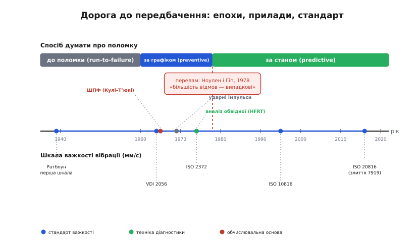

# 📜 Як індустрія навчилася слухати машини

Дешевий акселерометр на корпусі мотора, що попереджає про поломку за тижні, — здається очевидною ідеєю. Але ціле століття обслуговування машин ця ідея була **неможливою**, потім **єретичною**, і лише наприкінці XX століття стала звичною. Історія тут не про прилади — прилади з'явилися пізно й легко. Вона про **зміну способу думати про поломку**: від «лагодимо, коли зламається» через «міняємо за графіком, про всяк випадок» до «слухаємо й утручаємося, коли видно, що псується». Кожен крок коштував індустрії дорогих помилок, і саме помилки, а не теорія, штовхали її далі.

Варто пройти цю дорогу, бо вона пояснює речі, які інакше виглядають довільними. Чому стандарт міряє саме **швидкість у мм/с**, а не прискорення чи зміщення? Чому «обслуговування за графіком» — насправді **погана** стратегія, хоч звучить розважливо? Звідки взялася хитра техніка слухати **дзвін після удару**, а не сам удар? На все це є конкретна історична відповідь — з іменами, датами й суперечками.

## Три епохи: до поломки, за графіком, за станом

Найперша стратегія обслуговування — навіть не стратегія, а її відсутність: **працюй, поки не зламається** (англ. *run-to-failure*). Машина крутиться, доки не стане; тоді її лагодять чи міняють. Це не дурість — для дешевої, не критичної деталі це й досі найрозумніший вибір: навіщо обслуговувати лампочку, якщо її простіше замінити, коли перегорить. Лихо починається, коли так ставляться до **дорогої** машини, чия раптова смерть зупиняє цілий завод чи валить літак з неба. Тут «до поломки» означає аварію в найгірший момент — бо поломка не питає дозволу.

Відповіддю стала друга епоха — **планово-профілактичне обслуговування** (англ. *preventive maintenance*, обслуговування за графіком). Логіка спокуслива й на позір залізна: якщо деталь зношується, не чекаймо поломки — розберемо й замінимо її **наперед**, за календарем, поки вона ще ціла. Розкручуй машину раз на стільки-то годин, міняй підшипники за графіком — і раптових аварій не буде. Ця ідея панувала в промисловості й авіації десятиліттями й здавалася самоочевидною.

Її глибинне припущення — що зношення йде **передбачувано з віком**: що старша деталь, то ймовірніша поломка. Це і є знаменита **«ванна крива»** (англ. *bathtub curve*) надійності: висока «дитяча смертність» нових виробів спадає, тоді довге плато випадкових відмов, а під кінець крива знову круто йде вгору — старіння. Якщо так, рецепт очевидний: лови деталь перед фінальним підйомом і міняй. Уся стратегія за графіком стоїть на цій картинці.

Проблема в тому, що картинка **здебільшого хибна** — і це з'ясувалося приголомшливо пізно й приголомшливо доказово.

## Удар, що завалив «обслуговування за графіком»

У 1960-х авіакомпанія United Airlines зіткнулася з простою бідою: обслуговування зжирало близько третини операційних витрат, а літаки робилися дедалі складнішими, і графік повних розбирань ставав непідйомним. Інженери United **Стенлі Ноулен** (F. Stanley Nowlan) і **Говард Гіп** (Howard F. Heap) зробили те, що рідко роблять, — не повірили теорії на слово, а **подивилися на дані**: як насправді відмовляють тисячі типів вузлів цивільних літаків. Підсумок вони виклали у звіті 1978 року «Reliability-Centered Maintenance», що його замовив Департамент оборони США (статус — усталено, звіт публічний, AD-A066579).

Те, що вони побачили, суперечило всій логіці обслуговування за графіком. Класичній «ванні» — старінню з віком — відповідало лише близько **4%** вузлів. Якусь залежність відмови від віку показували разом близько **11%**. А переважна більшість вузлів відмовляла **випадково**, без жодного «терміну зношення»: ймовірність поломки не росла з годинами напрацювання. Понад те — близько **68%** вузлів показували «дитячу смертність»: найнебезпечніший період у них був **одразу після** збирання чи ремонту.

З цього випливав висновок, що перевертав усе. Якщо деталь відмовляє випадково, а не від віку, то **планова заміна її не рятує** — нова деталь так само може відмовити завтра. Гірше: оскільки найризикованіший момент — одразу після втручання, профілактичне розбирання **саме й створює** нову «дитячу смертність, тобто на ділі **підвищує** ймовірність поломки. Виходив парадокс: ремонт «про всяк випадок» нерідко не запобігав аваріям, а **спричиняв** їх.

> 🔧 **Навіщо це.** Це і є фундамент, на якому стоїть уся вібродіагностика. Якщо поломку не можна передбачити **за календарем**, лишається один шлях — передбачати її **за фактичним станом** машини: стежити за нею й ловити саму **появу** дефекту, поки він іще малий. Ноулен і Гіп назвали це окремою стратегією поряд із run-to-failure й заміною за віком: робити **обслуговування за станом**, шукаючи **початок** відмови. Саме сюди й цілить дешевий акселерометр на корпусі мотора — він і є інструмент цього «шукати початок».

Так народилася третя, теперішня епоха — **обслуговування за станом** (англ. *condition-based maintenance*), воно ж **передбачувальне** (англ. *predictive maintenance*). Не чекати поломки (як у першій епосі) і не міняти наосліп за графіком (як у другій), а **виміряти стан** машини й утрутитися саме тоді, коли видно, що псується. Підхід Ноулена й Гіпа ширше відомий як **надійнісно-орієнтоване обслуговування** (англ. *reliability-centered maintenance*, RCM); вибір стратегії під кожен конкретний вузол — його суть.

Але щоб «виміряти стан», потрібна величина, яку видно ще здалеку, поки машина працює, не розбираючи її. Найзручніша така величина — **вібрація**. І тут історія робить крок назад, у 1939 рік, бо перші спроби читати здоров'я машини по тремтінню почалися задовго до того, як хтось довів, що графік не працює.

## 1939: перший, хто склав машинам шкалу тремтіння

Думка, що машина «говорить» вібрацією, стара. Кожен механік знає на дотик: коли підшипник от-от помре, машина починає тремтіти інакше. Біда була не в думці, а в **числі** — тремтить «сильно» чи «нормально»? Без шкали це лишалося грою відчуттів: один механік чує біду, другий на тій самій машині — ні.

Першу шкалу склав **Т. К. Ратбоун** (T. C. Rathbone), головний інженер турбінного відділу страхової компанії Fidelity and Casualty of New York. У листопаді 1939 року в журналі *Power Plant Engineering* вийшла його стаття «Vibration Tolerances», і в ній — таблиця, що вперше пов'язала **амплітуду вібрації з оцінкою стану** машини: від «дуже гладко» до «небезпечно» (статус — усталено; це визнаний у фаху перший такий документ). Страхова логіка тут не випадкова: компанія платила за зруйновані турбіни й кревно хотіла навчитися передбачати руйнування **до** виплати.

У таблиці Ратбоуна крилася тонкість, що визначить усі майбутні стандарти, — і варто зрозуміти її від першопричини. Він будував криві по **зміщенню** (на скільки хитається стінка), бо тодішні прилади міряли саме зміщення. Та коли він провів межі «однакової небезпеки» через увесь діапазон частот, ці лінії лягли не по сталому зміщенню й не по сталому прискоренню, а приблизно по **сталій швидкості** коливання. Інакше кажучи, **рівна вібраційна швидкість приблизно відповідає рівній шкідливості** для машини в широкій смузі обертів.

Чому так — видно з фізики, яку ми вже [розклали в самій темі](root:embedded/vibration-diagnostics): три величини пов'язані множенням на частоту, і зміщення випинає повільні рухи, прискорення — швидкі, а **швидкість лежить посередині** й дає найрівніший внесок по всьому робочому діапазону. Шкідливість вібрації — це переважно про **енергію руху**, а вона зав'язана саме на швидкість. Ратбоун намацав це з даних страхових випадків, не виводячи формул; пізніше стандарти лише закріпили його спостереження. Ось чому сьогодні промисловий стандарт вібрації — це **мм/с**, а не міліметри зміщення чи `g` прискорення. Коріння цього вибору — у таблиці 1939 року.

## Від таблиці Ратбоуна до міжнародного стандарту

Таблиця Ратбоуна була американською й приватною. Щоб стати **спільною мовою** всієї індустрії, ідеї треба було пройти через національні, а тоді міжнародні органи стандартизації — і це зайняло десятиліття.

Першою великою спадкоємицею стала німецька настанова **VDI 2056** (жовтень 1964) — «Beurteilungsmaßstäbe für mechanische Schwingungen von Maschinen» (мірила оцінки механічних коливань машин). Вона вже прямо взяла за міру **вібраційну швидкість** і ввела ступені важкості з ряду чисел — 0.28, 0.45, 0.71, 1.12 … 71 мм/с (статус — усталено). Цей ряд не випадковий: сусідні значення відрізняються приблизно в 1.6 раза, тобто йдуть рівними кроками в логарифмі — так само, як вухо чує гучність. Ступені VDI 2056 згодом перейшли в міжнародний стандарт майже без змін.

Міжнародним документ став 1974 року — **ISO 2372**, «Mechanical vibration of machines with operating speeds from 10 to 200 rev/s» (статус — усталено; нині скасований). Він закріпив підхід, який ми застосовуємо й досі: міряти **діюче значення (RMS) вібраційної швидкості** в смузі частот і класти отримане **одне число** на шкалу зон. ISO 2372 поділяв машини на класи за потужністю й типом основи й для кожного давав межі зон. Це був прямий нащадок і Ратбоуна, і VDI 2056 — одне оглядове число важкості вібрації.

У ISO 2372 була й слабкість, видна одразу з нашої теми: **одне число не каже, що саме ламається**. Воно чесно кричить «погано», але дисбаланс, розцентрування й дефект підшипника можуть давати однаковий RMS — а лікуються по-різному. Стандарт давав «температуру» машини, не діагноз; для діагнозу вже потрібен був спектр.

Наступним кроком ISO 2372 переріс у серію **ISO 10816** (від 1995 року частинами) — ту, що десятиліттями була робочою для оцінки загальної вібрації машин (статус — усталено). ISO 10816 зберіг суть (RMS швидкості, зони A/B/C/D), але розбив машини на куди дрібніші типи: окремі частини під насоси, під великі турбіни, під двигуни, під поршневі машини. Замість чотирьох грубих класів ISO 2372 — детальні межі під конкретний клас обладнання. Саме на ISO 10816 спирається опис чотирьох зон у [нашій темі](root:embedded/vibration-diagnostics).

Останнє оновлення — серія **ISO 20816** (від 2016 року), що **злила** дві паралельні гілки в одну (статус — чинний міжнародний стандарт). Річ у тім, що вібрацію машини міряють двома різними способами, і кожен мав свій стандарт. **ISO 10816** описував вібрацію на **нерухомих** частинах — корпусі, кришках підшипників, — як її чує сейсмічний давач (акселерометр) ззовні; саме цей шлях нам близький, бо MEMS-акселерометр стоїть на корпусі. А **ISO 7919** описував вібрацію самого **вала**, як її ловить безконтактний вихрострумовий давач зазору, наведений на крутний вал зблизька. Це різні точки вимірювання й різні прилади, але один пацієнт — машина. ISO 20816-1:2016 об'єднав ISO 10816-1 та ISO 7919-1 в єдину систему, бо повна картина критичної машини потребує обох поглядів: і тремтіння корпусу (про стан конструкції), і биття вала (про стан ротора). Тому в [темі ми кажемо](root:embedded/vibration-diagnostics): історично ISO 10816, нині оновлений як ISO 20816, — це і є той родовід.

> 🔧 **Навіщо це.** Коли в коді прошивки ти кладеш виміряний RMS швидкості на шкалу зон A/B/C/D, ти користуєшся документом із родоводом у вісім десятиліть: страховий інженер 1939-го → німецька VDI 1964-го → ISO 2372 1974-го → ISO 10816 → нинішня ISO 20816. Тобі не треба вигадувати власні пороги «з голови» — за цими числами стоять десятиліття спостережень за реальними поломками. Знай лише, який клас машини в тебе під давачем: великій турбіні на пружній основі дозволено тремтіти більше, ніж дрібному насосу на жорсткій, — і стандарт це враховує.

## Поломка, яку число не ловить: дефект підшипника

Стандарти важкості розв'язали половину задачі — дали шкалу для **загальної** вібрації. Але лишалася підступна біда, яку ця шкала просто **не бачить** на ранній стадії: дефект **підшипника** кочення.

Розберімо, чому він особливий. Дисбаланс і розцентрування трясуть **усю** машину сильно й на низьких частотах — їх легко зміряти й видно навіть в одному числі RMS. А ранній дефект підшипника — це крихітна раковина на доріжці, по якій раз за разом б'ють кульки. Кожен удар **кволий** і **дуже короткий**; у загальному рівні вібрації він тоне, як шепіт у гаморі цеху. Поки дефект малий, RMS майже не ворушиться — а коли таки виросте, підшипник нерідко вже на межі руйнування. Класична шкала важкості ловить підшипник **надто пізно**.

Але в самій короткості удару ховається лазівка, і вона геніальна. Різкий короткий поштовх — це по суті [удар, що збуджує власні високочастотні коливання](root:embedded/why-frequency-domain) самого підшипника й корпусу: вони **дзвенять**, як дзвін від калатала, на своїй високій резонансній частоті в кілогерцях. Сам цей дзвін стоїть високо й прямо нічого про дефект не каже. Та удари **повторюються** з частотою, заданою геометрією підшипника, — отже високочастотний дзвін **то спалахує, то згасає** саме в ритмі дефекту. Якщо зловити не сам сигнал, а **обвідну** його високочастотної частини — наскільки сильно він дзвенить у кожну мить — і вже цю обвідну розкласти в спектр, дефект проступить чітко, навіть коли в звичайному спектрі його не видно. Це і є **аналіз обвідної** (англ. *envelope analysis*), він же **техніка високочастотного резонансу** (англ. *high-frequency resonance technique*, HFRT).

## 1974: дзвін, який почули у гелікоптерному редукторі

Хто перший здогадався слухати дзвін, а не удар, — питання, де треба бути точним, бо ідея «дозрівала» в кількох місцях одночасно, і легко приписати її одній особі.

Перша **задокументована** реалізація техніки високочастотного резонансу для діагностики підшипників — звіт **1974 року** трьох інженерів, **М. Дарлоу** (M. S. Darlow), **Р. Беджлі** (R. H. Badgley) і **Г. Гогга** (G. W. Hogg): «Application of High-Frequency Resonance Techniques for Bearing Diagnostics in Helicopter Gearboxes», технічний звіт лабораторії армії США USAAMRDL-TR-74-77 (статус — усталено). Місце не випадкове: **гелікоптерний редуктор**. У гелікоптера відмова підшипника головного редуктора — це падіння, тож військові були готові платити за будь-який спосіб упіймати дефект раніше. Дарлоу з колегами показали на головному редукторі гелікоптера UH-1, що метод працює: демодуляція високочастотної смуги виявляє дефект підшипника тоді, коли звичайний спектр мовчить.

Чому саме тут, варто затримати думку. Гелікоптерний редуктор — нещадне середовище для діагностики: десятки шестерень і підшипників разом, страшний загальний шум, кволий сигнал дефекту тоне в ньому. Якщо спосіб запрацював **там**, він запрацює деінде. Високі ставки (життя екіпажу) і нещадні умови (суцільний шум) і зробили авіацію природним полігоном — так само, як ламкі літакові вузли підштовхнули Ноулена й Гіпа переглянути саму ідею обслуговування за графіком.

Широку популярність метод дістав десятиліттям пізніше — через оглядову статтю, що звела докупи розрізнений досвід і дала йому спільну назву. **П. Макфадден** (P. D. McFadden) і **Дж. Сміт** (J. D. Smith) з Кембриджа опублікували 1984 року в *Tribology International* огляд «Vibration monitoring of rolling element bearings by the high-frequency resonance technique — a review» (т. 17, № 1, с. 3–10; статус — усталено). Вони не лише підсумували техніку, а й побудували **модель сигналу** від «точкового дефекту»: пояснили, чому й як удари модулюються, коли дефект проходить навантажену зону підшипника. Саме після цього огляду назва «high-frequency resonance technique» закріпилася у фаху, а сама стаття стала однією з найбільш цитованих у вібродіагностиці. Тому в [темі ми кажемо](root:embedded/vibration-diagnostics): аналіз обвідної відомий від середини 1970-х — перша реалізація 1974-го, канонічний огляд 1984-го.

> 🔧 **Навіщо це.** Коли твій простий монітор упевнено ловить дисбаланс, але ніяк не бачить ранній підшипник — це не баг твого коду, а **відома фізична межа** прямого спектра, через яку пройшла вся індустрія. Розв'язок винайдено ще 1974-го: не намагайся витиснути кволий удар зі звичайного ШПФ, а слухай **ритм дзвону після удару** — смуговий фільтр навколо резонансу, випрямлення, фільтр низьких частот (це й дає обвідну), тоді ШПФ обвідної. [Як зібрати цей конвеєр у прошивці](root:embedded/vibration-diagnostics/proj-envelope-analysis.md) — окрема практична розмова.

## Паралельна гілка: не дивитися на спектр, а просто рахувати удари

Поки академічна лінія йшла до аналізу обвідної через спектр, у промисловості визрів інший, простіший хід до тієї самої мети — і його варто згадати, бо він показує, що ту саму фізику можна осідлати по-різному.

1969 року норвезький інженер **Ейвінд Сьогоель** (Eivind Søhoel) запатентував **метод ударних імпульсів** (англ. *shock pulse method*, SPM), а наступного року заснував компанію SPM Instrument (статус — усталено). Поштовх був суто практичний: данський судновласник А. П. Мьоллер потерпав від того, що вантажні насоси його танкерів раз за разом виходили з ладу **без попередження**, — і потрібен був спосіб упіймати біду заздалегідь. Сьогоель учепився за ту саму ідею високочастотного дзвону, але обійшовся **без спектра**: він налаштував давач на власну резонансну частоту (близько 32 кГц) і просто рахував **силу й частоту ударних поштовхів**, що збуджують цей резонанс. Дефектний підшипник б'є частіше й сильніше — і прилад показує це одним числом, без жодного ШПФ.

Це елегантний інженерний компроміс. Спектральний аналіз обвідної каже **більше** — він називає, яка саме доріжка пошкоджена (зовнішня, внутрішня, кулька). Метод ударних імпульсів каже **менше** — лише «підшипник псується, ось наскільки», — зате працює на дуже скромній електроніці, без обчислення спектра. У 1970–80-х, коли цифровий ШПФ був дорогим і повільним, це була вирішальна перевага: до 1980-х SPM розставила мільйони точок вимірювання й продала десятки тисяч переносних приладів. Дві гілки — спектральна обвідна й рахунок ударів — це той самий фізичний принцип (дзвін після удару), осідланий під різний бюджет обчислень. На сьогоднішньому мікроконтролері обчислень вистачає на повний спектр, тож ми йдемо багатшою, спектральною гілкою; але корисно бачити, що дешевша теж жива й працює.

## Чому прилади дозріли так пізно

Лишається остання загадка: ідеї були від 1939-го (шкала важкості) і від 1974-го (обвідна), а масовим передбачувальне обслуговування стало лише наприкінці XX століття. Чому така затримка? Бо ідея — половина справи; другу половину тримали **прилади**, а вони дозрівали повільно й окремо.

Сам акселерометр з'явився рано. П'єзоелектричний давач прискорення компанія Brüel & Kjær показала ще близько 1943 року (статус — усталено). Та раннім давачам бракувало зручного підсилення просто в корпусі — і цей вузол додали аж 1971-го, коли компанія PCB Piezotronics упровадила вбудовану в давач електроніку (технологія ICP). Лише тоді акселерометр став простим у застосуванні «з коробки», а не лабораторним приладом із громіздким зовнішнім підсилювачем.

Та головним гальмом був не давач, а **спектр**. Уся діагностика стоїть на розкладі сигналу в частоти, а доти, доки спектр рахували повільно, метод лишався лабораторним. Зрушення дав алгоритм: 1965 року **Джеймс Кулі** (James Cooley) та **Джон Тʼюкі** (John Tukey) опублікували [швидке перетворення Фурʼє](root:embedded/why-frequency-domain) (ШПФ) — спосіб порахувати спектр у рази швидше (статус — усталено). Перші комерційні ШПФ-аналізатори зʼявилися вже наприкінці 1960-х, та десятиліттями це були важкі лабораторні прилади: щоб зняти спектр машини, до неї або тягли візок з апаратурою, або везли запис у лабораторію. Звідси й образ із [нашої теми](root:embedded/vibration-diagnostics) — «те, за що промисловість колись платила цілими лабораторіями».

Справжню демократизацію принесли **переносні збирачі даних** 1980-х: прилад, що його носять від машини до машини, знімає вібрацію, рахує спектр на місці й запам'ятовує. Відтоді один обхідник міг за зміну «вислухати» сотні машин — і передбачувальне обслуговування з лабораторної екзотики стало рутиною заводу. А далі ця сама дорога привела рівно туди, де ми стоїмо в [темі](root:embedded/vibration-diagnostics): лабораторний шафовий аналізатор стиснувся до переносного збирача, збирач — до мікросхеми. Те, що 1974-го робив армійський стенд із гелікоптерним редуктором, сьогодні робить копійчаний MEMS-акселерометр із мікроконтролером, постійно сидячи на корпусі машини.

## Що ця історія пояснює

Дорога вийшла довга, та кожен її поворот пояснює щось у теперішній практиці — і саме тому варто було її пройти.

Чому стандарт міряє **швидкість у мм/с** — бо ще 1939-го Ратбоун помітив із даних страхових випадків, що рівна швидкість приблизно відповідає рівній шкідливості; VDI 2056, ISO 2372, ISO 10816 і нинішня ISO 20816 лише закріпили це спостереження.

Чому **«обслуговування за графіком» — погана стратегія**, хоч звучить розважливо, — бо Ноулен і Гіп 1978-го показали на даних: більшість вузлів відмовляє випадково, не від віку, тож планова заміна не рятує, а через «дитячу смертність» після втручання нерідко **шкодить**. Звідси й уся ідея стежити за **станом**, а не за календарем.

Чому ми слухаємо **дзвін після удару**, а не сам удар, — бо ранній дефект підшипника надто кволий для прямого спектра, і ще 1974-го в гелікоптерному редукторі довели: демодульований високочастотний резонанс виказує дефект тоді, коли звичайний спектр мовчить.

І чому це масово стало можливим лише недавно — бо ідеї чекали на прилади: на вбудовану електроніку давача, на швидке перетворення Фурʼє, на переносний, а тоді й мікросхемний обчислювач спектра.

*Дорога до передбачення на одній осі часу. Угорі — зміна способу думати про поломку: **до поломки** (run-to-failure) → **за графіком** (preventive, спирається на хибну «ванну криву») → **за станом** (predictive); перелам — звіт Ноулена й Гіпа 1978-го, що показав: більшість відмов випадкові. Унизу — інструменти, що зробили «за станом» можливим: родовід **шкали важкості** (Ратбоун 1939 → VDI 2056 1964 → ISO 2372 1974 → ISO 10816 → ISO 20816 2016) і поява **аналізу обвідної** (HFRT, 1974) поряд із методом ударних імпульсів (1969), а під усім — обчислювальна основа: ШПФ (1965) → переносний збирач → мікроконтролер.*

За кожним рядком прошивки вібромонітора стоїть саме ця історія: страховий інженер, що склав першу шкалу; авіатори, що завалили «обслуговування за графіком» даними; військові, що навчилися чути дзвін підшипника в гаморі гелікоптерного редуктора; математики, що зробили спектр швидким. Дешевий акселерометр на корпусі мотора — не початок цієї історії, а її теперішній підсумок.
