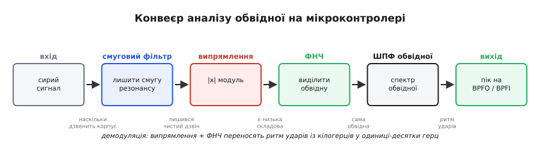
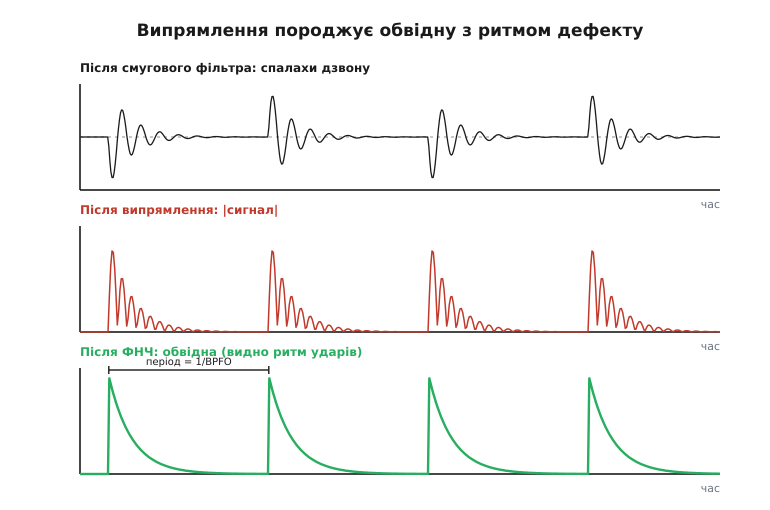
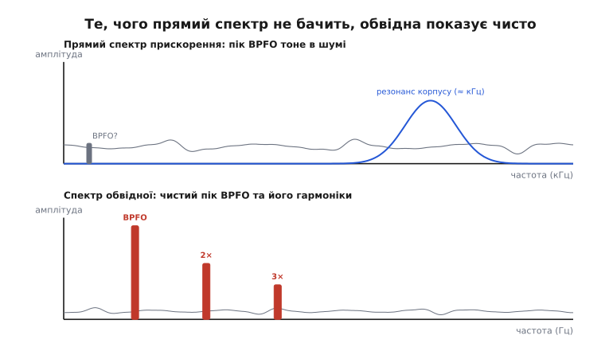

# ⚙️ Аналіз обвідної на мікроконтролері: зловити підшипник, коли пік на BPFO мовчить

**Задача.** Ми вже вміємо знімати спектр вібрації й читати в ньому адреси несправностей: `1×` — дисбаланс, `2×` — розцентрування, неціловий множник BPFO — зовнішня доріжка підшипника. Для дисбалансу й розцентрування цього досить: їхні піки сильні й сидять низько, звичайне ШПФ бачить їх без зусиль. Але **ранній** дефект підшипника так не зловити. Поки раковина на доріжці ще мала, удари кульок кволі, тонуть у загальній вібрації машини, і прямий пік на BPFO просто **не піднімається над шумовою підлогою**. А це найцінніший момент для діагностики — спіймати підшипник на старті, за тижні до того, як він почне сипатися. Питання конкретне: як на дешевому МК витягти частоту BPFO, коли в прямому спектрі її ще немає?

Відповідь індустрія знайшла ще на початку 1970-х і назвала **технікою високочастотного резонансу** (англ. *high-frequency resonance technique*, HFRT), а сьогодні вона ширше відома як **аналіз обвідної** (envelope analysis). Метод представила компанія Mechanical Technology Inc.; ключову роботу опублікували Darlow зі співавторами в 1974 році (статус — усталене, добре задокументоване інженерне джерело). Відтоді це безумовно найкращий прийом для раннього лову підшипників — він працює навіть у дуже шумному оточенні, як-от трансмісії гелікоптерів. Тут ми зберемо весь конвеєр у реальній прошивці, рядок за рядком, і розберемо, де в кожній ланці сидить пастка.

## Ідея: слухати не удар, а ритм дзвону після удару

Згадаймо фізику, з якої все росте. Коли кулька наїжджає на раковину в доріжці, вона не «гуде» на частоті BPFO — вона **б'є**: різкий, дуже короткий поштовх, майже дельта-імпульс. А короткий поштовх, як ми бачили, [у спектрі розсипається широко](book:math/windowing-leakage) — він збуджує **власний резонанс** заліза: підшипник, його обойма й корпус машини мають свою високу резонансну частоту й після удару **дзвенять** на ній, як дзвін після калатала. Цей дзвін стоїть високо — типово одиниці-десятки кілогерців — і сам по собі **нічого не каже про дефект**: його частота визначається жорсткістю й масою заліза, а не геометрією підшипника.

Уся хитрість у тому, що удари **повторюються** — рівно з частотою BPFO. Тобто високочастотний дзвін не звучить рівно: він **то спалахує, то згасає**, і робить це саме в ритмі дефекту. Сам дзвін — то лише *носій* (англ. *carrier*); корисна інформація — у тому, **як його гучність міняється з часом**, тобто в його **обвідній** (англ. *envelope*). Якщо ми відновимо цю обвідну — криву «наскільки сильно залізо дзвенить у кожну мить» — і розкладемо вже **її** в спектр, то в спектрі обвідної чітко проступить пік на BPFO. Прямий спектр його не бачив, бо енергія удару була розмазана по широкій смузі резонансу; обвідна ж **збирає** цю енергію назад у одну частоту повторення.

Це класична задача зв'язку, лише навиворіт. У радіо ми накладаємо корисний сигнал на високочастотну несучу, передаємо, а на прийомі **демодулюємо** — знімаємо обвідну, щоб дістати назад корисне. Тут несучу за нас створює сама фізика (резонанс заліза), модуляцію — дефект (вмикає й вимикає дзвін), а наша робота — той самий прийом приймача: **демодуляція за амплітудою**. Аналогія точна аж до математики; ламається вона лише в одному — у радіо несуча чиста й відома наперед, а тут це широкий, «брудний» резонансний горб, і його ще треба знайти й вирізати. Саме тому конвеєр починається з фільтра.

Ось весь ланцюг, який ми зберемо:


*Конвеєр аналізу обвідної. Сирий сигнал спершу проганяють крізь **смуговий фільтр**, налаштований на смугу резонансу підшипника й корпусу, — лишається чистий високочастотний дзвін без низькочастотної вібрації машини. Далі **випрямлення** (модуль) і **фільтр низьких частот** разом виконують демодуляцію: вони переносять ритм ударів із кілогерців униз, у одиниці-десятки герц, і дають саму обвідну. Нарешті **ШПФ обвідної** показує, з якою частотою ця обвідна пульсує, — і там стоїть пік на BPFO. Кожна стрілка лишає від сигналу рівно те, що потрібно наступній ланці.*

> 🔧 **Навіщо це.** Це той інструмент, що відрізняє «іграшковий» вібромонітор від робочого. Простий монітор на прямому ШПФ ловить дисбаланс і розцентрування — і впирається в стіну на підшипниках. Додавши до нього аналіз обвідної (а це лише кілька десятків рядків коду поверх того ж АЦП), ти отримуєш ранній лов найдорожчої й найчастішої причини відмов обертових машин. Жодного нового заліза — той самий копійчаний акселерометр, лише розумніша обробка.

## Ланка 1: смуговий фільтр навколо резонансу

Перша й найважливіша ланка — **смуговий фільтр** (англ. *band-pass filter*), що пропускає тільки смугу високочастотного резонансу й відкидає все решта. Навіщо він узагалі потрібен, видно з фізики: у сирому сигналі сидить велика низькочастотна вібрація — оберти, дисбаланс, зубчасте зачеплення — і вона **на порядки сильніша** за кволий дзвін підшипника. Якби ми випрямили сирий сигнал як є, обвідна відбивала б цю потужну низькочастотну вібрацію, а не наш дефект. Фільтр прибирає все, крім дзвону, — і лишає чистий носій, готовий до демодуляції.

Тепер головне рішення всього методу: **де поставити смугу**. Поставиш не туди — і дзвону в смузі не буде, демодулювати нічого. Є три способи знайти правильне місце, від найкращого до найпростішого.

Найнадійніше — **виміряти резонанс самому**. Стукни по корпусі підшипникового вузла (це називають *bump test*, тест ударом) і зніми спектр відгуку: на ньому буде широкий горб — то і є власна резонансна частота вузла. Туди й став центр смуги. Це найточніший шлях, бо резонанс у кожної машини свій.

Якщо стукати ніколи — бери смугу **з власного спектра в роботі**: майже завжди в спектрі прискорення видно широкий пагорб десь високо (3–15 кГц у дрібних машин), що піднімається над рівним шумом. Це і є збуджений резонанс; центруй смугу по його вершині.

Найгрубіше, коли немає ні того, ні того, — **емпіричне правило**: бери високу частину свого діапазону, типово від кількох кілогерців і вище, аби лише вона була **окремо** від смуги «загальної» вібрації (нагадаю, її міряють у [смузі 10–1000 Гц](root:embedded/imu-barometer)). Сенс — стати **подалі** від потужної низькочастотної вібрації, у зону, де живе тільки дзвін.

Тут і причаїлася найпідступніша пастка: смугу легко поставити **надто низько**, у вібрацію самої машини. Тоді обвідна підхопить дисбаланс і зубці, а не підшипник, — і метод тихо збреше, показавши «дефект» там, де його немає. Правило просте: **смуга має бути вище від усієї робочої вібрації машини й сидіти на справжньому резонансі заліза**, а не на її основних частотах.

Ширину смуги беруть досить широку — кілька сотень герц, а то й кілька кілогерців. Це здається дивним (навіщо широка смуга, ми ж шукаємо вузький пік?), але причина залізна: нам потрібна не сама частота дзвону, а його **обвідна**, а щоб обвідна зберегла гострий, короткий сплеск удару, смуга має пропустити **багато гармонік** цього сплеску. Вузька смуга розмазала б кожен удар у часі, обвідна стала б млявою, і ритм BPFO в ній притерся б. Широка смуга навколо резонансу — лишає удари різкими.

> 🔧 **Навіщо це.** Вибір смуги — це 80 % успіху методу. Якщо твій аналіз обвідної «не бачить» підшипник, перша підозра завжди одна: смуга стоїть не на резонансі. Перш ніж чіпати решту коду, зроби bump test або глянь на сирий спектр і знайди резонансний горб очима — і постав смугу точно на нього.

Як саме фільтрувати в прошивці? Найпрактичніший смуговий фільтр на МК — **біквадратна ланка** (biquad), [рекурсивний фільтр другого порядку](root:embedded/fir-vs-iir): п'ять коефіцієнтів, дві комірки пам'яті стану, кілька множень на відлік. Один біквад дає смугову характеристику з регульованою шириною; коли треба крутіші схили, ставлять два-три біквади поспіль (це і є [фільтр вищого порядку](root:embedded/choosing-a-filter)). Ось робоча реалізація однієї ланки у формі Direct Form II Transposed — її люблять за чисельну стійкість:

```c
// Біквадратна ланка (IIR 2-го порядку), форма DF2T.
// Зберігає 2 числа стану між викликами — справжній потоковий фільтр.
typedef struct {
    float b0, b1, b2;   // коефіцієнти чисельника
    float a1, a2;       // коефіцієнти знаменника (a0 нормований до 1)
    float z1, z2;       // стан (дві затримки)
} biquad_t;

static inline float biquad_step(biquad_t *f, float x) {
    float y = f->b0 * x + f->z1;
    f->z1   = f->b1 * x - f->a1 * y + f->z2;
    f->z2   = f->b2 * x - f->a2 * y;
    return y;
}
```

Коефіцієнти смугового біквада рахують один раз при старті, з центральної частоти `f0`, частоти дискретизації `fs` і добротності `Q` (вона задає ширину смуги: ширина ≈ `f0 / Q`). Формули — класичні «куховарські» Роберта Бристоу-Джонсона (RBJ), стандарт де-факто для аудіо- й вимірювальних біквадів:

```c
#include <math.h>

// Налаштувати біквад на СМУГОВИЙ фільтр із центром f0 і добротністю Q.
void biquad_bandpass(biquad_t *f, float f0, float fs, float Q) {
    float w0    = 2.0f * 3.14159265f * f0 / fs;   // нормована частота, рад/відлік
    float cosw0 = cosf(w0);
    float alpha = sinf(w0) / (2.0f * Q);          // визначає ширину смуги

    // band-pass із сталим піковим підсиленням (constant 0 dB peak)
    float b0 =   alpha;
    float b1 =   0.0f;
    float b2 =  -alpha;
    float a0 =   1.0f + alpha;
    float a1 =  -2.0f * cosw0;
    float a2 =   1.0f - alpha;

    // нормуємо на a0 — щоб у step не ділити щоразу
    f->b0 = b0 / a0;  f->b1 = b1 / a0;  f->b2 = b2 / a0;
    f->a1 = a1 / a0;  f->a2 = a2 / a0;
    f->z1 = f->z2 = 0.0f;
}
```

**Приклад (вибір центра й ширини смуги).** Дрібний насос, акселерометр оцифровуємо на `fs = 20 кГц`. Bump test показав резонанс корпусу близько `f0 = 6 кГц`. Хочемо смугу завширшки приблизно 2 кГц навколо нього. Яка треба добротність?

```c
// ширина смуги Δf ≈ f0 / Q   →   Q ≈ f0 / Δf
float f0 = 6000.0f;     // Гц — центр на резонансі
float df = 2000.0f;     // Гц — бажана ширина смуги
float Q  = f0 / df;     // = 3.0  — невисока добротність = широка смуга
// одного біквада зі схилами 12 дБ/окт тут замало для чистого вирізу;
// ставимо два такі біквади поспіль → разом 24 дБ/окт
biquad_t bp1, bp2;
biquad_bandpass(&bp1, f0, 20000.0f, Q);
biquad_bandpass(&bp2, f0, 20000.0f, Q);
```

Зверни увагу: `Q = 3` — це **навмисно низька** добротність, бо нам потрібна широка смуга. Високий `Q` (вузька смуга) тут зашкодив би — розмазав би удари в часі. А два біквади поспіль дають крутіший виріз без звуження самої смуги: кожен прибирає по 12 дБ/октаву, разом 24.

## Ланка 2: випрямлення — звідки демодуляція

Після фільтра в нас чистий високочастотний дзвін, що пульсує в ритмі дефекту. Тепер найхитріший момент усього методу: **просте випрямлення — узяти модуль кожного відліку — насправді й виконує демодуляцію**. Чому абсолютна величина раптом витягує обвідну? Це варто зрозуміти до кінця, бо інакше код виглядає магією.

Думаймо від фізики. Відфільтрований сигнал — це швидкий дзвін (несуча `cos(2π·f_c·t)`), помножений на повільну обвідну `e(t)` (вона зростає на удар і спадає між ударами):

```
s(t) = e(t) · cos(2π·f_c·t)        // дзвін, промодульований обвідною
```

Несуча `cos` весь час гойдається між `−1` і `+1`, дуже швидко. Обвідна `e(t)` — повільна й завжди додатна (це ж амплітуда). Уся потрібна нам інформація — у `e(t)`; несуча `cos` — лише швидкий «носій», який треба прибрати. Беремо модуль:

```
|s(t)| = e(t) · |cos(2π·f_c·t)|     // бо e(t) ≥ 0, виноситься з-під модуля
```

І ось ключ: `|cos|` — уже **не** симетрична хвиля навколо нуля. Раніше вона однаково часто бувала додатною й від'ємною, тож її **середнє дорівнювало нулю**. Випрямлена `|cos|` сидить **повністю над нуллю**, і її середнє вже **не нуль** — це стала близько `0.637` (тобто `2/π`). Інакше кажучи, випрямлення додає сигналу **постійну складову, пропорційну обвідній**. Розкласти `|cos|` у ряд можна так:

```
|cos(2π·f_c·t)| = 2/π + (швидкі гармоніки на 2·f_c, 4·f_c, …)
```

Підставивши назад, бачимо два світи в одному сигналі:

```
|s(t)| = (2/π)·e(t)            ← повільна частина: сама обвідна, біля нуля частот!
       + e(t)·(гармоніки на 2·f_c, 4·f_c, …)   ← швидка частина, високо вгорі
```

Ось воно. Випрямлення **перенесло копію обвідної вниз, до нульової частоти**, відірвавши її від несучої. Швидкі гармоніки лишилися високо (на подвоєній частоті несучої й вище) — і їх ми зараз приберемо фільтром низьких частот. Те, що зробив простий модуль, у радіо називають **детектором обвідної** (envelope detector); це той самий механізм, що в найпростішому AM-приймачі демодулює звук.

Подивімося на ці три стани сигналу в часі — стає очевидно:


*Чому модуль демодулює. Угорі — відфільтрований сигнал: швидкий дзвін, що спалахує на кожен удар кульки й гасне між ударами; сам по собі він гойдається навколо нуля, і його середнє нульове. Посередині — той самий сигнал після **випрямлення** (модуль): тепер він увесь над нуллю, і його «середній рівень» повторює форму спалахів. Унизу — після **фільтра низьких частот**, що прибрав швидкий дзвін і лишив тільки повільну обвідну: чітко видно ритм ударів, період між ними дорівнює `1/BPFO`. Саме цей повільний сигнал ми й розкладемо у спектр.*

У коді випрямлення — один рядок, найдешевша ланка всього конвеєра:

```c
float rectified = fabsf(filtered);   // |x| — і обвідна вже «лежить» біля нуля частот
```

Чому модуль (двопівперіодне випрямлення), а не «відрізати від'ємне» (однопівперіодне)? Однопівперіодне теж створює постійну складову, але викидає половину енергії й додає більше зайвих гармонік. Модуль використовує весь сигнал і дає чистішу обвідну — а коштує те саме (на МК `fabsf` — це фактично скидання знакового біта). Тому для аналізу обвідної беруть саме модуль.

> 🔧 **Навіщо це.** Запам'ятай це як рецепт: **смуговий фільтр → модуль → фільтр низьких частот = демодуляція за амплітудою**. Ця трійка перетворює «гучність високочастотного дзвону» на повільний сигнал, який далі читається звичайним ШПФ. Той самий прийом працює не лише для підшипників — будь-де, де корисна інформація сидить у тому, *як міняється амплітуда* високочастотного коливання (модуляція в радіо, биття в механіці, гул у трубопроводі).

## Ланка 3: фільтр низьких частот — лишити саму обвідну

Випрямлений сигнал містить обидва світи: повільну обвідну біля нуля частот і непотрібні швидкі гармоніки на `2·f_c` і вище. **Фільтр низьких частот** (англ. *low-pass filter*) відсікає швидке й лишає саму обвідну. Це і є та ланка, що остаточно «знімає носій».

Де ставити частоту зрізу `f_lp`? Логіка проста й двостороння. Знизу: зріз має бути **вище** найвищої цікавої частоти дефекту, аби її не зрізати разом зі сміттям. Найвища потрібна частота — це BPFI (внутрішня доріжка, зазвичай найвища з чотирьох) плюс кілька її гармонік, бо удари різкі й дають не один пік, а гребінець кратних. Зверху: зріз має бути **значно нижче** за несучу `f_c`, аби надійно прибити гармоніку на `2·f_c`. На щастя, ці дві межі рознесені на порядки: частоти дефекту — десятки-сотні герц, несуча — кілогерці. Тому зріз кладуть із великим запасом — типово кілька сотень герц до 1–2 кГц: достатньо вище за BPFI з гармоніками й глибоко нижче за `2·f_c`.

Реалізація — той самий біквад, лише в режимі низьких частот:

```c
// Налаштувати біквад на ФІЛЬТР НИЗЬКИХ ЧАСТОТ із частотою зрізу fc.
void biquad_lowpass(biquad_t *f, float fc, float fs, float Q) {
    float w0    = 2.0f * 3.14159265f * fc / fs;
    float cosw0 = cosf(w0);
    float alpha = sinf(w0) / (2.0f * Q);

    float b0 = (1.0f - cosw0) * 0.5f;
    float b1 =  1.0f - cosw0;
    float b2 = (1.0f - cosw0) * 0.5f;
    float a0 =  1.0f + alpha;
    float a1 = -2.0f * cosw0;
    float a2 =  1.0f - alpha;

    f->b0 = b0 / a0;  f->b1 = b1 / a0;  f->b2 = b2 / a0;
    f->a1 = a1 / a0;  f->a2 = a2 / a0;
    f->z1 = f->z2 = 0.0f;
}
```

Для фільтра низьких частот добротність беруть близько `Q ≈ 0.707` (це характеристика Баттерворта — максимально рівна в смузі пропускання, без горба на зрізі); [родини фільтрів](root:embedded/fir-vs-iir) тут не критичні, бо нам важлива лише чистота обвідної, а не точна форма зрізу.

## Ланка 2½: децимація — не платити за зайве

Тут вступає важлива оптимізація, без якої метод на слабкому МК тріщить. Подумаймо про числа. Несуча сидить на `f_c ≈ 6 кГц`, тож оцифровувати треба щонайменше на `fs = 20 кГц` (правило [Найквіста](book:math/aliasing): дискретизація вище за подвоєну найвищу частоту в сигналі). Але **обвідна** — повільна: усе цікаве в ній нижче за кілька сотень герц. Після фільтра низьких частот у сигналі вже немає нічого швидшого за `f_lp ≈ 1 кГц`. Це означає, що тримати його на `20 кГц` — марнотратство: для частот до 1 кГц вистачило б `fs = 2–4 кГц`. А кожен зайвий відлік — це зайва пам'ять під буфер ШПФ і зайвий час на саме ШПФ.

Лік — **децимація** (англ. *decimation*): після фільтра низьких частот беремо не кожен відлік, а кожен `M`-тий, і викидаємо решту. Якщо знизити частоту з 20 кГц до 2 кГц (`M = 10`), буфер під ту саму роздільність спектра стане **вдесятеро коротшим**, а ШПФ — у стільки ж разів швидшим і легшим по пам'яті. Це не приблизна економія, а пряма: роздільність спектра обвідної — це `fs_dec / N`, і щоб розрізнити BPFO `1×` від `2×`, нам важлива саме ця роздільність, а не висока вихідна частота.

Чому децимувати **можна** без шкоди — і де пастка? Викидати відліки безпечно лише тоді, коли в сигналі вже **немає** частот вище за половину **нової**, зниженої частоти. Інакше вони складуться в [аліаси](book:math/aliasing) — фальшиві низькі піки, що зруйнують увесь спектр обвідної. Ось чому фільтр низьких частот стоїть **перед** децимацією, а не після: він і є той антиаліасинговий захист, що прибирає все вище за `f_lp` до того, як ми проріджуємо. Порядок ланок тут не випадковий — він диктований Найквістом.

```c
// Децимація після ФНЧ: лишаємо кожен M-тий відлік.
// ФНЧ уже прибрав усе вище за fs_dec/2 — аліасингу не буде.
#define DECIM  10            // 20 кГц / 10 = 2 кГц на виході
int   dec_cnt = 0;
float env_buf[ENV_N];        // буфер обвідної (на зниженій частоті)
int   env_idx = 0;

void on_lowpassed_sample(float lp) {
    if (++dec_cnt >= DECIM) {
        dec_cnt = 0;
        if (env_idx < ENV_N)
            env_buf[env_idx++] = lp;   // зберігаємо лише кожен 10-й
    }
}
```

> 🔧 **Навіщо це.** Децимація — це різниця між «влізло в МК» і «не влізло». Без неї буфер обвідної на високій частоті з'їсть пам'ять і такти, яких на дрібному контролері просто немає. Запам'ятай зв'язку: **фільтр низьких частот завжди стоїть перед децимацією** — він антиаліасинговий захист проріджування. Поміняєш їх місцями — отримаєш фальшиві піки й діагностику, що бреше з виду впевнено.

## Збираємо потоковий конвеєр

Тепер з'єднаймо ланки 1–2½ в один потоковий обробник, що його викликають на **кожен** відлік прямо з [переривання АЦП чи DMA](root:embedded/dma-adc). Конвеєр обробляє відліки на льоту й накопичує **готову обвідну** в короткому буфері; коли буфер повний — пора на ШПФ.

```c
#include <math.h>

#define FS_RAW   20000.0f    // частота оцифровування, Гц
#define DECIM    10          // коефіцієнт децимації → 2 кГц на виході
#define ENV_N    512         // довжина буфера обвідної (для ШПФ)

static biquad_t bp1, bp2;    // смуговий фільтр (2 ланки = 24 дБ/окт)
static biquad_t lp;          // фільтр низьких частот (виділення обвідної)
static int   dec_cnt;
static float env_buf[ENV_N];
static volatile int env_idx;
static volatile int env_ready;

// Викликати один раз на старті.
void envelope_init(float f_res, float f_lp) {
    biquad_bandpass(&bp1, f_res, FS_RAW, 3.0f);   // широка смуга на резонансі
    biquad_bandpass(&bp2, f_res, FS_RAW, 3.0f);
    biquad_lowpass(&lp,  f_lp,  FS_RAW, 0.707f);  // Баттерворт
    dec_cnt = 0; env_idx = 0; env_ready = 0;
}

// Викликати на КОЖЕН сирий відлік прискорення (з ISR/DMA).
void envelope_feed(float x) {
    if (env_ready) return;                 // буфер ще не забрали — не псуємо

    float s = biquad_step(&bp1, x);        // 1) смуговий фільтр…
    s       = biquad_step(&bp2, s);        //    …другою ланкою
    s       = fabsf(s);                    // 2) випрямлення (демодуляція)
    s       = biquad_step(&lp, s);         // 3) фільтр низьких частот → обвідна

    if (++dec_cnt >= DECIM) {              // 2½) децимація
        dec_cnt = 0;
        env_buf[env_idx++] = s;
        if (env_idx >= ENV_N) {
            env_idx = 0;
            env_ready = 1;                 // обвідна готова — будимо основний цикл
        }
    }
}
```

Зверни увагу на дрібну, але важливу деталь форми. Випрямлення додає в обвідну ту саму постійну складову `2/π·середнє`, про яку ми говорили, — і фільтр низьких частот її пропускає, бо вона повільна. У спектрі вона дасть великий пік на нульовій частоті. Це не біда, якщо ми просто проігноруємо бін `k = 0` при пошуку піків (а ми так і робитимемо). Та якщо хочеться чистоти — перед ШПФ із буфера обвідної віднімають середнє, рівно як [ми робили в основному конвеєрі](root:embedded/vibration-diagnostics) перед звичайним спектром.

## Ланка 4: ШПФ обвідної й пошук BPFO

Останній крок знайомий: накласти вікно, узяти [ШПФ](book:algorithms/fft) і прочитати адресу BPFO — лише тепер на **зниженій** частоті дискретизації й по буферу обвідної. Усе як у звичайному спектрі, з однією поправкою в арифметиці бінів: частоту дискретизації беремо вже децимовану.

```c
// Готову обвідну (env_buf) перетворюємо у спектр і шукаємо пік BPFO.
#include <math.h>

void analyze_envelope(float *env_buf, float fr, float bpfo_mult) {
    // 0) прибрати постійну складову (та сама 2/π від випрямлення)
    float mean = 0.0f;
    for (int i = 0; i < ENV_N; i++) mean += env_buf[i];
    mean /= ENV_N;
    for (int i = 0; i < ENV_N; i++) env_buf[i] -= mean;

    // 1) вікно Ганна — щоб пік BPFO не «розмазався»
    for (int i = 0; i < ENV_N; i++) {
        float w = 0.5f * (1.0f - cosf(2.0f * 3.14159265f * i / (ENV_N - 1)));
        env_buf[i] *= w;
    }

    // 2) ШПФ (будь-яка бібліотека); результат — магнітуди mag[0..ENV_N/2]
    float mag[ENV_N / 2 + 1];
    fft_magnitude(env_buf, mag, ENV_N);       // ваша реалізація/бібліотека

    // 3) адреса BPFO на ЗНИЖЕНІЙ частоті
    const float fs_dec = FS_RAW / DECIM;      // = 2000 Гц
    float f_bpfo = bpfo_mult * fr;            // напр. 3.6 × оберти
    int   k      = (int)(f_bpfo * ENV_N / fs_dec + 0.5f);

    // 4) висота піка — беремо максимум у вузькому вікні ±2 біни
    //    (BPFO трохи «плаває» через прослизання кульок — рідко рівно цілий бін)
    float peak = 0.0f;
    for (int j = k - 2; j <= k + 2; j++)
        if (j > 0 && j <= ENV_N / 2 && mag[j] > peak) peak = mag[j];

    report_bpfo_level(peak);                   // далі — порівняння з еталоном
}
```

**Приклад (повний розрахунок адрес для реального насоса).** Мотор крутиться на 1770 об/хв. Підшипник із даташита: BPFO = 3.6× обертів, BPFI = 5.4×. Оцифровуємо на `FS_RAW = 20 кГц`, децимація `DECIM = 10`, буфер обвідної `ENV_N = 512`. Куди дивитися?

```c
float fr   = 1770.0f / 60.0f;        // = 29.5 Гц — частота обертання вала
float fs_d = 20000.0f / 10.0f;       // = 2000 Гц — частота після децимації

// частоти дефектів (живуть низько — у спектрі ОБВІДНОЇ)
float f_bpfo = 3.6f * fr;            // = 106.2 Гц
float f_bpfi = 5.4f * fr;            // = 159.3 Гц

// роздільність спектра обвідної
float bin_hz = fs_d / 512;           // = 3.9 Гц на бін

// номери бінів
int k_bpfo = (int)(f_bpfo * 512 / fs_d + 0.5f);   // 106.2·512/2000 ≈ 27
int k_bpfi = (int)(f_bpfi * 512 / fs_d + 0.5f);   // 159.3·512/2000 ≈ 41
```

Перевіримо, що задум зійшовся. Найвища цікава частота — BPFI з кількома гармоніками, скажімо до `4 × 159 ≈ 640 Гц`. Зріз фільтра низьких частот `f_lp = 1 кГц` її пропускає — добре. Нова частота дискретизації `fs_d = 2000 Гц` дає Найквіст `1000 Гц`, тож усе до 640 Гц влазить без аліасингу — добре. Роздільність `3.9 Гц` легко розділяє `106 Гц` (BPFO) і `159 Гц` (BPFI) — вони за десятки бінів один від одного. Числа склалися: децимований буфер на 512 точок дає чистий спектр обвідної, де BPFO і BPFI стоять окремо й видно їхні гармоніки.

А ось що дає цей конвеєр проти прямого спектра:


*Що бачить прямий спектр і що — обвідна. Угорі — прямий спектр прискорення: уся енергія удару розмазана у широкий резонансний горб високо по частоті, а внизу, на справжній частоті BPFO, ледь помітний горбик, який легко прийняти за шум. Унизу — спектр обвідної того самого сигналу: енергія зібрана назад у **чистий пік на BPFO** та його кратні (`2×`, `3×` — підпис різкого, періодичного удару). Те, чого прямий спектр не показував, обвідна виявляє однозначно.*

Поява **гармонік** BPFO в спектрі обвідної — додатковий, дуже надійний підпис. Здоровий підшипник дає гладку обвідну без вираженого ритму; дефект дає різкі періодичні сплески, а різький періодичний сигнал [розкладається в ряд кратних](root:embedded/why-frequency-domain). Тому коли бачиш у спектрі обвідної не один пік, а **гребінець** на BPFO, 2×BPFO, 3×BPFO — це майже певний дефект зовнішньої доріжки, а не випадковий збіг.

## Складність і пастки

Конвеєр короткий, але кожна ланка має місце, де новачок спотикається. Зберемо граблі в одному місці — це і є та частина, що відрізняє робочий монітор від «чомусь не працює».

- **Смуга стоїть не на резонансі.** Головна й найчастіша помилка. Якщо смуговий фільтр не накриває справжній резонанс заліза, в смузі немає дзвону — і демодулювати нічого, спектр обвідної порожній або шумний. Лік один: знайди резонанс **виміром** (bump test) чи по горбу в сирому спектрі, і став центр смуги туди. Не вгадуй наосліп.

- **Смугу поставили надто низько — у вібрацію машини.** Дзеркальна біда. Якщо смуга залазить у робочі частоти (оберти, зубці, дисбаланс), обвідна підхопить **їх**, а не підшипник, — і метод покаже «дефект» на частотах, що насправді є нормальною вібрацією. Смуга має сидіти **вище** за всю робочу вібрацію (вище за діапазон 10–1000 Гц), на чистому резонансі.

- **Забули фільтр низьких частот перед децимацією.** Якщо проредити сигнал, не прибравши спершу високі частоти, вони **складуться в аліаси** — фальшиві низькі піки, що сядуть просто в зоні BPFO й зіпсують діагноз. Порядок **модуль → ФНЧ → децимація** непорушний: ФНЧ і є антиаліасинговий захист проріджування.

- **Надто вузька смуга.** Спокуса взяти високий `Q`, щоб «точніше» вирізати резонанс, виходить боком: вузька смуга розтягує кожен удар у часі, обвідна стає млявою, і гострий ритм BPFO в ній притирається. Бери смугу **широку** (низький `Q`, кілька сотень герц і ширше) — нам потрібні різкі удари, а не вузька частота.

- **Не прибрали постійну складову перед ШПФ.** Випрямлення лишає велику постійну складову (`2/π` від середнього рівня). Без її віднімання в спектрі обвідної виросте величезний пік на нульовому біні, що може засліпити сусідні низькі біни, де живе BPFO. Віднімай середнє буфера обвідної перед вікном — або просто ігноруй бін `k = 0` при пошуку піків.

- **BPFO не лягає рівно в бін.** Кульки в підшипнику трохи **прослизають** (не котяться ідеально), тож реальна частота BPFO «плаває» на 1–2 % навколо теоретичної. Через це пік рідко сидить точно в розрахунковому біні. Тому шукай максимум не в одному біні, а у **вузькому вікні ±1–2 біни** навколо нього (як у коді вище) — інакше проґавиш пік, що зсунувся на сусідній бін.

- **Стан фільтрів не обнулили між сеансами.** Біквади тримають стан (`z1, z2`); якщо між блоками вимірів їх не скидати чи перемикати центр смуги «на гарячу», перехідний процес фільтра дасть сплеск, що засмітить початок буфера обвідної. Скидай стан при `*_init` і дай фільтрам кілька десятків відліків «прогрітися», перш ніж починати збирати обвідну.

- **fixed-point переповнення в біквадах.** На МК без FPU біквади в `Q15`/`Q31` легко переповнюються: рекурсивний фільтр з вузькою смугою має велике внутрішнє підсилення на своїй частоті. Тримай акумулятор із запасом розрядності (32-біт під 16-бітні відліки), масштабуй коефіцієнти або користуйся CMSIS-DSP `arm_biquad_*`, де це вже враховано.

- **Порівнюй з еталоном, а не з абсолютним порогом.** Як і для звичайного спектра, «нормальний» рівень піка BPFO у кожної машини свій. Не зашивай абсолютний поріг — зніми [еталон здорового підшипника](root:embedded/vibration-diagnostics) одразу після монтажу й стеж за **зростанням** піка BPFO відносно нього в часі. Саме тренд, а не миттєве число, ловить дефект на ранньому схилі.

Підсумок виходить такий. Аналіз обвідної — це акуратно складена **демодуляція за амплітудою**: смуговий фільтр вирізає високочастотний резонанс, що його збуджують удари; модуль переносить копію обвідної вниз, до нуля частот; фільтр низьких частот лишає саму обвідну; децимація робить її дешевою для ШПФ; а ШПФ показує, з якою частотою вона пульсує, — і там стоїть BPFO. Кожна ланка — кілька рядків C поверх того ж АЦП, що вже стоїть у плати. І саме цей конвеєр дає те, заради чого все затівалося: спіймати підшипник тоді, коли прямий пік ще мовчить, — за тижні до того, як стане пізно.
