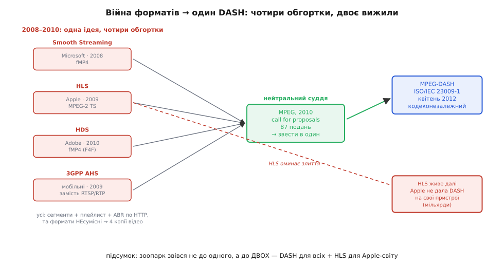

# 📜 HLS і DASH: як відео навчилося їхати звичайними файлами

У статті ми відкрили головну ідею масового мовлення: ріж відео на короткі **файли-сегменти**, склади **список**, і нехай плеєр тягне сегмент за сегментом звичайним HTTP — як картинки. Звучить настільки просто, що мимоволі питаєш: чому до цього додумалися аж наприкінці двотисячних, а не на світанку інтернет-відео? Адже HTTP був завжди, файли роздавати вміли завжди. Що заважало?

Відповідь у тому, що проста ідея здавалася **дурною**. Десять років галузь будувала рівно протилежне — складні, «розумні» потокові сервери, що тримали з кожним глядачем живий сеанс, стежили за його каналом, гнали йому персональний потік. RTP, RTSP, RealServer, Windows Media, Flash — усе це були **спеціальні машини для відео**, і пишалися саме тим, що вони спеціальні. Сказати «викиньте все це, роздавайте відео тим самим тупим веб-сервером, що віддає логотип» — означало визнати, що десятиліття інженерної роботи пішло не туди. Тож історія HLS і DASH — це історія того, як галузь, зціпивши зуби, **повернула назад до простого** — і чому простіше виявилося сильнішим.

## Чому «розумний сервер» уперся в стіну

Щоб відчути перелам, треба побачити, об що саме розбився старий підхід. Згадаймо з основної статті, як працює [RTP зі своїм пультом RTSP](root:embedded/video-streaming-protocols/hist-rtsp.md): сервер тримає з кожним глядачем **сеанс** — пам'ятає, де той у потоці, що поставив на паузу, який у нього канал. Поки глядачів сотні — чудово. А тепер уяви живий фінал чемпіонату: **десять мільйонів** одночасних глядачів. Десять мільйонів живих сеансів, кожен зі своїм станом, кожен жере пам'ять і процесор сервера. Жодна машина такого не витримає; треба ферма серверів, та ще й розумних, дорогих, спеціальних.

І це ще не вся біда. Спеціальні протоколи їхали спеціальними портами й транспортом — а корпоративні мережі, готелі, кав'ярні, мобільні оператори рубали все, крім звичайного веб-трафіку. Глядач за фаєрволом просто **не міг** під'єднатися до RTP-сервера: порт закрито. Доводилося городити обхідні шляхи, тунелі, запасні варіанти — і все одно частина людей лишалася без відео.

> 🔧 **Навіщо це.** Тут заховано правило, що варте більше за будь-який конкретний протокол: **те, що вже масово розгорнуте, майже завжди переможе елегантне нове.** До кінця двотисячних у світі вже стояли **сотні тисяч звичайних веб-серверів** і ціла індустрія [мереж доставки вмісту](root:com-transport/ip-routing) (CDN), що роздавали статичні файли мільйонам — картинки, завантаження, оновлення. Ця інфраструктура була оплачена, налагоджена, всюдисуща. Питання, яке зрештою поставили інженери, звучало єретично для свого часу: а що, як **не будувати нічого нового**, а просто прикинутися, ніби відео — це теж купа звичайних файлів? Тоді весь цей готовий, оплачений світ почне роздавати наше відео задарма. Саме ця думка — «паразитувати на вже наявному вебі замість будувати свій» — і є справжнє зерно HLS та DASH.

Думка носилася в повітрі, і за неї майже одночасно вхопилося **чотири різні табори** — кожен зі свого болю, кожен зі своєю обгорткою. Розберімо їх по черзі, бо саме з їхньої незгоди народиться спільний стандарт.

## Microsoft перша: Smooth Streaming, 2008

Першим публічно зробив крок не Apple, як часто думають, а **Microsoft**. У жовтні 2008 року, як розширення для свого веб-сервера IIS 7.0, вона випустила **Smooth Streaming** (англ. *smooth* — «плавний») — частину пакета IIS Media Services, із програвачем у **Silverlight** (тодішня відповідь Microsoft на Adobe Flash). Це і була перша масова система, що роздавала відео **сегментами поверх звичайного HTTP** з адаптивним бітрейтом.

Бойове хрещення Smooth Streaming прийняла дуже публічно — на **зимових Олімпійських іграх 2010 року у Ванкувері**, де NBC роздавала через неї всі трансляції у HD, і живі, і в записі. (На літніх іграх 2008-го в Пекіні NBC ще покладалася на старий Windows Media й лише обережно пробувала адаптивне HTTP-мовлення для записів у стандартній якості — повноцінного живого Smooth Streaming тоді ще просто не існувало, він дозрів якраз до 2009-го.) Ванкувер-2010: мільйони глядачів, живий спорт у HD, звичайний веб — система довела, що підхід працює не на папері, а під справжнім навантаженням.

Технічно Microsoft зробила розумний хід, який варто запам'ятати, бо він повториться: сегменти вона складала не окремими файликами на диску, а тримала відео **одним файлом** у форматі **фрагментованого MP4** (англ. *fragmented MP4*, fMP4) — того самого MP4, що його всі знали, тільки нарізаного всередині на шматочки, які сервер міг віддавати поштучно за запитом. Це поєднувало знайомий контейнер із посегментною віддачею.

## Apple відповідає: HLS, 2009 — і чому саме MPEG-2 TS

За пів року, у **травні 2009-го**, на конференції для розробників Apple показала свій варіант — **HLS** (англ. *HTTP Live Streaming*), і одразу вшила його в **iPhone OS 3.0**. Це був хід зовсім іншого масштабу, ніж у Microsoft: Smooth Streaming жив у браузерному плагіні Silverlight, який ще треба було поставити, а HLS від першого дня сидів **у кожному iPhone** як рідний, системний спосіб відтворювати відео. Якщо айфон грав живий потік — він грав HLS. А айфонів ставало дедалі більше.

Принцип той самий, що у всіх: плейлист (текстовий файл `.m3u8`) зі списком коротких сегментів, плеєр тягне їх по HTTP, перемикає якість під свій канал. Авторами специфікації, яку Apple подала в IETF, стали її інженери **Роджер Пантос (Roger Pantos)** і **Вільям Мей (William May)** — їхні імена стоять під чернеткою з 2009 року.

Та найцікавіша — і найхарактерніша для Apple — деталь у тому, **у що** HLS пакував відео. Усі інші (Microsoft, згодом Adobe) брали фрагментований MP4. Apple ж обрала старезний на той час контейнер — **MPEG-2 Transport Stream** (MPEG-2 TS, файли `.ts`), розроблений ще в дев'яностих для цифрового **телемовлення** й DVD. Дивний вибір? Лише на перший погляд.

> 🔧 **Навіщо це.** Розгадка — у залізі, і це чудовий урок про те, як насправді ухвалюють технічні рішення. iPhone 2009 року був малопотужним пристроєм із крихітною батареєю. Декодувати відео H.264 «софтом», на головному процесорі, він просто не міг — це з'їло б батарею за годину й гріло б телефон. Тому в чипі сидів **окремий апаратний декодер** H.264 — спеціальна схема, що розпаковує відео майже задарма по енергії. А цей декодер і весь медіаконвеєр Apple (той самий, що крутив відео у QuickTime й мав справу з цифровим ТБ) уже **вміли** ковтати потік саме у форматі MPEG-2 TS. Тобто Apple обрала TS не тому, що він кращий чи новіший — він **гірший**, він додає помітні накладні витрати, — а тому, що **залізо вже вміло його декодувати апаратно, без участі процесора**. Узяти готовий, апаратно прискорений шлях замість писати новий — ось чому в кожному `.ts`-сегменті раннього HLS жила луна телевізора дев'яностих. (Сам контейнер MPEG-2 TS — справді усталений стандарт тих років; а от мотив «бо апаратний декодер уже їв TS» добре задокументований у тому, що медіаконвеєр Apple будувався навколо TS, хоча Apple ніколи не публікувала окремого маніфесту «ми обрали TS саме тому».)

Цей вибір переслідуватиме HLS роками: формат `.ts` несумісний із fMP4, тож хто хотів годувати і айфони, і решту світу, мусив тримати відео **у двох копіях** — у TS для Apple і в MP4 для всіх інших. Подвійне сховище, подвійне кодування. Лише на **WWDC 2016** Apple нарешті дозволила HLS працювати й з фрагментованим MP4 — і світ зміг тримати один-єдиний набір сегментів на всіх. Сам же стандарт HLS офіційним документом IETF став ще пізніше — аж у серпні 2017-го, як **RFC 8216** (це вже сьома версія протоколу). Промовистий розрив: вісім років HLS працював у мільярдах пристроїв, ще не маючи статусу опублікованого стандарту. Спершу — реальність, потім — папір.

## Adobe останньою: HDS, 2010 — і запізнілий потяг

Третім, уже наздоганяючи, підтягнувся **Adobe** з **HDS** (англ. *HTTP Dynamic Streaming*) у **2010 році**, для свого Flash-плеєра й Flash Media Server. Технічно — те саме: сегменти поверх HTTP, адаптивний бітрейт, фрагментований MP4 в основі (зі своїми розширеннями-файлами `.f4m` для маніфесту й `.f4f` для фрагментів).

Чому Adobe спізнилася й чому HDS так і не злетів, попри тодішнє всевладдя Flash? Бо вона захищала вчорашній день. Уся бізнес-модель Adobe в відео трималася на **Flash і RTMP** — тому самому протоколі заливки потоку на сервер, що його ми назвали в основній статті ветераном на вході в систему. HDS був для Adobe не проривом, а **оборонним маневром**: спробою перенести Flash-екосистему на нові рейки, не відпускаючи Flash. Але потяг уже відходив в інший бік — у бік **HTML5-відео без жодних плагінів**, де ні Flash, ні Silverlight були не потрібні. За кілька років і Flash, і Silverlight, і HDS разом із ними тихо помруть; з усього раннього зоопарку масово переживуть добу лише двоє — HLS та новий спільний стандарт, до якого ми зараз і дійдемо.

## Тихий четвертий гравець: 3GPP і 3G-мережі, 2009

Поки три гіганти вебу мірялися плеєрами, з зовсім іншого боку до тієї самої ідеї прийшов **3GPP** — консорціум, що пише стандарти **мобільного зв'язку** (це їхні документи описують 3G, 4G, 5G). Їхній біль був свій, не такий, як у вебу.

Мобільні мережі 3G тоді гнали відео на телефони через **RTSP/RTP** — у складі служби з казенною назвою PSS (packet-switched streaming, «потокове мовлення з комутацією пакетів»). І 3GPP на власній шкурі відчув те саме, об що розбився весь старий підхід, тільки помножене на капризність радіоканалу: у стільниковій мережі швидкість **стрибає** щомиті — заїхав у тунель, відійшов від вишки, потрапив у натовп на стадіоні, — і жорсткий RTP-потік від такого захлинався й рвався. Потрібен був спосіб **гнучко підлаштовувати якість** під канал, що скаче, — а це рівно те, що дає адаптивний бітрейт на сегментах.

Тож у **2009 році**, у Release 9 своїх специфікацій, 3GPP стандартизував власну штуку — **Adaptive HTTP Streaming** (AHS, «адаптивне мовлення по HTTP») — з прямою, записаною в документах метою: **замінити RTSP/RTP** у мобільному відео на сегменти поверх HTTP. Той самий висновок, до якого незалежно дійшов веб, тепер зробили й телефонні інженери. А це — знайомий нам з історії RTSP знак: коли до однієї ідеї **незалежно** приходять із різних світів, ідея дозріла остаточно.

## Чотири однакові ідеї в чотирьох несумісних обгортках

Тепер відступімо на крок і подивімося, що вийшло на початок 2010-х. Картина абсурдна. **Чотири** системи — Smooth Streaming, HLS, HDS, 3GPP AHS — робили **по суті те саме**: сегменти, плейлист, адаптивний бітрейт поверх HTTP. Та сама ідея, чотири рази винайдена. Але кожна — у **своїй несумісній обгортці**: свій формат плейлиста, свій контейнер сегментів, свої правила.

Для глядача це було невидимо, а для того, хто **роздає** відео, — справжнє пекло. Хочеш, щоб твій фільм подивилися всі? Готуй його **чотири рази**: у TS для айфонів, у fMP4 для Silverlight, у f4f для Flash, ще якось для мобільних. Чотири копії того самого відео на диску, чотири конвеєри кодування, чотири набори помилок. Уся краса ідеї «роздаваймо звичайними файлами» тонула в тому, що **«звичайні файли» в кожного були різні**.

Це і є та сама болячка, що з неї колись народився RTSP, тільки на новому витку: **зоопарк несумісних діалектів навколо однієї спільної ідеї**. І ліки історія прописала ті самі — звести всі діалекти в **один відкритий стандарт**, який зрозуміє будь-хто.

*Чотири табори — Microsoft, Apple, Adobe, мобільні 3GPP — незалежно зробили те саме (сегменти, плейлист, адаптивний бітрейт поверх HTTP), але кожен у своїй несумісній обгортці, через що те саме відео доводилося готувати в кількох копіях. MPEG скликала всіх (заклик пропозицій 2010-го, 87 подань) і звела їх в один нейтральний, кодеконезалежний стандарт DASH (2012). Та HLS оминув злиття й лишився живим окремо — бо Apple не дала зробити DASH рідним на своєму залізі. Підсумок: не один переможець, а двоє.*

## MPEG скликає всіх: народження DASH, 2010–2012

За зведення взялася **MPEG** (Moving Picture Experts Group) — та сама міжнародна група експертів, чиї стандарти стиснення відео (MPEG-2, той самий H.264) на той час крутили все відео планети. Орган авторитетний і нейтральний: він не продавав ні плеєра, ні сервера, тож міг бути чесним суддею між Apple, Microsoft, Adobe й мобільниками.

У **2010 році** MPEG зробила класичний для світу стандартів хід — оголосила **call for proposals** (відкритий заклик надсилати пропозиції): мовляв, нам потрібен єдиний стандарт адаптивного мовлення по HTTP, покажіть, як ви це бачите. Відгук був приголомшливий — надійшло **87 пропозицій**. Саме це число найкраще передає, наскільки гострою на той час була проблема: вісімдесят сім різних команд по всьому світу одночасно сиділи над тією самою задачею. Ідея не просто дозріла — вона **перезріла**, і всі це відчували.

За основу MPEG узяла найдалі просунуту на той час роботу — **3GPP AHS Release 9**, той самий мобільний стандарт 2009 року, — і звела навколо нього решту. Робота закипіла швидко: чернетку міжнародного стандарту схвалили вже в січні 2011-го, статусу повноцінного міжнародного стандарту вона досягла в листопаді 2011-го, а на світ офіційно вийшла в **квітні 2012 року** як **ISO/IEC 23009-1** — під назвою **MPEG-DASH** (Dynamic Adaptive Streaming over HTTP, «динамічне адаптивне мовлення по HTTP»).

> 🔧 **Навіщо це.** У DASH вписали один глибокий урок, винесений з усього попереднього хаосу, — і його варто зрозуміти, бо він пояснює, чому DASH став **стандартом стандартів**. Усі попередники були **прив'язані до конкретного кодека й контейнера**: HLS — до TS, Smooth — до свого fMP4, і так далі. DASH свідомо зробили **байдужим до кодека** (codec-agnostic): йому однаково, що всередині сегментів — H.264, H.265, VP9, AV1, що завгодно; DASH описує лише **як нарізано на сегменти, як влаштований плейлист і як перемикати якість**, а чим саме стиснуте відео — не його справа. Це і є зрілість інженерної думки: не вмонтовувати в стандарт сьогоднішній кодек (який завтра застаріє), а описати **лише незмінну механіку доставки**. Завдяки цьому DASH 2012 року спокійно дожив до кодеків, яких 2012-го ще не існувало, — і саме тому пережив усіх своїх вузькоспеціалізованих попередників.

Щоб новий стандарт не лишився лежати на полиці папером (доля, що спіткала HDS), у 2012-му навколо нього зібрали **DASH Industry Forum** — об'єднання, де поряд сіли вчорашні суперники: Microsoft, Netflix, Google, Adobe, Samsung, Ericsson. Сам факт, що ці компанії, які щойно тягли кожна свою несумісну систему, тепер разом доводили до пуття спільний стандарт, — найкращий доказ, що зоопарк усім остаточно набрид.

## Чому в підсумку лишилося двоє — і навіщо це знати

Здавалося б, з'явився ідеальний нейтральний стандарт — DASH мав би проковтнути всіх, і настала б єдність. Реальність вийшла наполовину такою. Smooth Streaming, HDS і 3GPP-варіант розчинилися; а от **HLS нікуди не подівся** — і досі ділить світ із DASH майже навпіл.

Чому? Бо за HLS стоїть та сама сила, що ми вже назвали головною: **уже розгорнуте залізо перемагає.** Apple просто **відмовилася** робити DASH рідним на своїх пристроях; на iPhone, iPad, Apple TV з коробки грає **HLS**, і нічого з цим не вдієш. А Apple-пристроїв у світі — мільярди. Тож хто хоче охопити всіх, мусить і донині тримати **обидва**: HLS — щоб дістатися яблучного світу, DASH — щоб дістатися решти. Та сама подвійність, тільки тепер не з чотирьох копій, а з двох; і завдяки спільному фрагментованому MP4 (який HLS прийняв 2016-го) ці дві копії нарешті можуть ділити **ті самі файли сегментів**, відрізняючись лише плейлистом.

> 🔧 **Навіщо це.** Це не суха історична довідка — це твоя завтрашня робота. Коли ти ставитимеш на дрон чи камеру віддачу відео на багатьох глядачів, ти впрешся **рівно в цю спадщину**: муситимеш або готувати потік у двох пакуваннях (HLS для Apple, DASH для решти), або свідомо відмовитися від частини пристроїв. Розуміючи **чому** так склалося — що це не чийсь недогляд, а закам'янілий слід війни форматів 2008–2012 років і впертості Apple щодо власного заліза, — ти проєктуєш тверезо: не шукаєш міфічний «один протокол на всіх», а від початку закладаєш у систему оту двоїстість як даність. Історія тут — не музей, а **карта мін** на твоєму шляху.

Озирнімося на всю дугу. Десять років галузь будувала розумні, спеціальні, дорогі потокові сервери — і вперлася в стіну масштабу й фаєрволів. Тоді чотири табори майже одночасно зробили крок назад, до простого: нехай відео їде звичайними файлами звичайним вебом. Кожен зробив цей крок по-своєму, і вийшов вавилон обгорток. MPEG звела вавилон в один нейтральний, кодеконезалежний стандарт DASH — а вперте Apple-залізо лишило поруч із ним живим і HLS. Так із гонитви чотирьох народилися двоє, що й сьогодні несуть на собі майже все відео планети — від матчу на мільйони до картинки з твого дрона. І в основі обох — та сама «дурна» думка, що колись здавалася кроком назад: **не вигадуй нову машину для відео, прикинься, що відео — це просто файли.**

---

*Дати, назви та послідовність звірені з документацією й стандартами: Smooth Streaming — анонс жовтня 2008 (розширення IIS 7.0, плеєр Silverlight), повноцінне живе мовлення дозріло до 2009-го, флагманська трансляція — зимова Олімпіада у Ванкувері 2010 (на Пекіні-2008 NBC ще йшла на Windows Media й лише пробувала HTTP-адаптацію для записів у SD); HLS — Apple, травень 2009, iPhone OS 3.0, контейнер MPEG-2 TS, автори чернетки IETF Roger Pantos / William May, підтримка fMP4 з WWDC 2016, публікація RFC 8216 у серпні 2017 (v7); Adobe HDS — 2010, фрагментований MP4 (F4M/F4F); 3GPP Adaptive HTTP Streaming — Release 9, 2009 (TS 26.234, мета — заміна RTSP/RTP у PSS); MPEG-DASH — call for proposals 2010 (87 пропозицій), за основу взято 3GPP AHS R9, DIS січень 2011, IS листопад 2011, публікація ISO/IEC 23009-1 у квітні 2012, кодеконезалежний, DASH Industry Forum. Статус доказовості — усталений (первинні стандарти збігаються з вторинними джерелами). Єдине застереження: конкретний мотив вибору MPEG-2 TS у HLS («бо апаратний декодер і медіаконвеєр Apple уже працювали з TS») — добре задокументований інженерний факт про конвеєр Apple, але без окремої публічної заяви самої Apple «ми обрали TS саме тому»; подано як обґрунтоване пояснення, не як цитату.*
