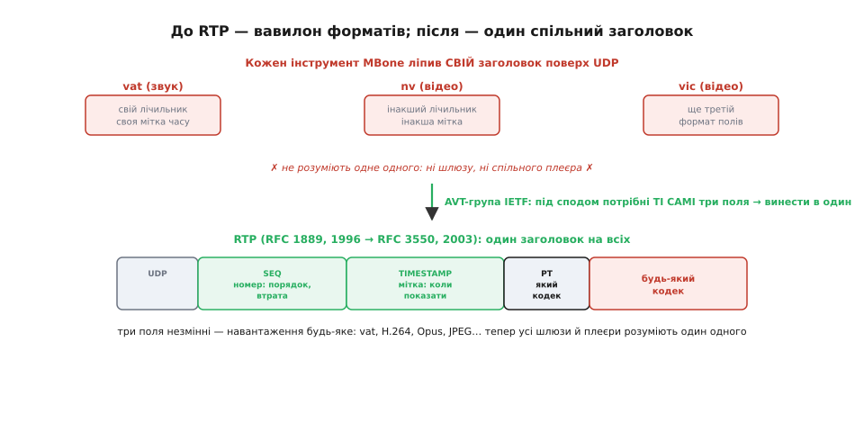

# 📜 Історія RTP: як домовилися про конверт для живого відео

У головній статті ми прийняли RTP майже як даність: тонкий заголовок над UDP, що несе номер, мітку часу й тип навантаження. Здавалося, ці три поля — самоочевидні, мало не природні. Насправді ж за цією очевидністю стоїть років двадцять спроб, цілий «вавилон» несумісних форматів і кілька принципових суперечок про те, **що саме** мусить нести конверт реального часу, а чого в ньому бути не повинно. Варто пройти цей шлях, бо він пояснює не дати, а **рішення** — чому RTP саме такий, а не інший, і чому виграли рівно ці поля.

Головна думка, заради якої вся ця історія, проста й трохи несподівана: RTP **нічого не винайшов**. Усе, що в ньому є, люди вже робили — кожен по-своєму, у власному форматі, у власній програмі. Внесок RTP був не у винаході полів, а в **домовленості**: побачити, що під сподом десятка різних програм лежить **одна й та сама** потреба, і виокремити її в спільний шар, який зрозуміють усі. Це історія не про геніальний здогад, а про те, як хаос самвидаву перетворюється на стандарт.

## Голос крізь пакети: на двадцять років раніше, ніж здається

Почнімо здалеку, бо корінь тут глибший, ніж очікуєш. Передавати **звук** пакетами через мережу спробували не в епоху інтернету, а ще на світанку самого ARPANET — попередника інтернету. Уже в серпні 1974 року дослідники продемонстрували **живий голос у реальному часі** між двома вузлами — USC/ISI у Каліфорнії й MIT Lincoln Laboratory на іншому кінці країни; а в січні 1976-го провели голосову конференцію вже між чотирма установами. Робилося це за протоколом із назвою **NVP** (англ. *Network Voice Protocol* — «мережевий голосовий протокол»), що його визначили в проєкті «Speech» у тому ж USC/ISI ще з кінця 1973 року. Серед людей, які запускали цей перший пакетний голос, був і **Денні Коен** (Danny Cohen) — і, що нам важливо, молодий інженер **Стівен Каснер** (Stephen Casner), один із тих, хто пізніше стане співавтором RTP.

Затримаймося на цьому факті, бо він ламає поширене уявлення. Ідея, що звук (а згодом і відео) можна різати на пакети й слати мережею «вистрелив і забув», не чекаючи підтвердження кожного шматка, — їй уже **за п'ятдесят років**. Іще не було ні вебу, ні UDP в сьогоднішньому вигляді, а інженери вже билися рівно з тими питаннями, які ми розбирали в статті: пакети приходять урозкид, частина губиться, проміжки між ними плавають — а голос усе одно мусить звучати рівно. Розв'язки тоді були чорнові й кожен свій, але **самé питання** вже стояло на повен зріст.

> 🔧 **Навіщо це.** Корисно тримати в голові: пакетний звук і відео — не примха інтернет-доби, а півстолітня інженерна традиція. Усі ті граблі, на які натрапляє новачок із відеолінком на дроні (порядок, втрати, джитер), люди методично вивчали поколіннями. RTP — це не «свіжа ідея 2000-х», а зрілий **підсумок** довгого досвіду; тому йому й варто довіряти.

## Вавилон MBone: коли кожен ліпив свій конверт

Тепер перенесімося на початок 1990-х — саме там народилося те, з чого виросте RTP. На той час в інтернеті з'явилася можливість, яка все підпалила: **багатоадресна розсилка** (англ. *multicast* — «множинна адресація»), коли один потік пакетів можна доставити одразу **багатьом** слухачам, не копіюючи його для кожного окремо. Над звичайним інтернетом збудували експериментальну надбудову для такої розсилки — **MBone** (від *Multicast Backbone*, «магістраль багатоадресності»); зробили її 1992 року Ван Якобсон (Van Jacobson), Стів Дірінг (Steve Deering) і той самий Стівен Каснер. Раптом стало можливим транслювати живий звук і відео на десятки майданчиків світу — і за це негайно взялися.

І тут почалося найцікавіше для нашої історії. Щоб щось транслювати, потрібні були **програми** — кодувати звук із мікрофона, різати на пакети, слати в MBone, на тому кінці збирати й відтворювати. І такі програми з'явилися — кілька, від різних людей, майже одночасно:

- **vat** (від *Visual Audio Tool*, «візуальний звуковий інструмент») — для **звуку**; його випустив Ван Якобсон із Lawrence Berkeley National Laboratory; уже в серпні 1991 року vat роздавали для дослідної мережі DARTnet, а в березні 1992-го ним провели першу MBone-трансляцію звуку із засідання IETF у Сан-Дієго.
- **nv** (від *Network Video*, «мережеве відео») — для **відео**; його написав **Рон Фредерік** (Ron Frederick) у дослідному центрі Xerox PARC і випустив версію 1.0 у листопаді 1992 року. Фредерік відверто моделював nv за зразком vat — узяв робочу ідею звукового інструмента й переніс на відео.
- **vic** (від *Video Conferencing*, «відеоконференція») — ще один відеоінструмент, що його робили Стівен Макканн (Steven McCanne) і Ван Якобсон з UCB/LBNL, перша версія — близько жовтня 1993 року.

Бачите, що тут утворилося? Кілька програм, кожна сама по собі **робоча**, передають живі звук і відео через ту саму мережу. Але кожна несла свої пакети у **власному форматі**: vat ліпив над UDP свій заголовок зі своїм лічильником пакетів і своєю міткою часу, nv — інакший, vic — ще третій. Кожен автор, дійшовши до того самого місця («а як приймачу зрозуміти порядок і час?»), розв'язував задачу **по-своєму** і зашивав розв'язок **усередину своєї програми**. Це підтверджують і самі творці: і vat, і vic спершу їхали **просто поверх UDP**, доки автори намацували, які поля взагалі потрібні, щоб дати раду реальному часу; багато з того, що згодом стане RTP, **жило тоді в самій програмі**.

*До RTP кожен інструмент MBone ліпив над UDP власний заголовок: vat — свій, nv — інакший, vic — ще третій, тож програми не розуміли одне одного. Робоча група AVT помітила головне: під сподом усім потрібні ті самі три поля — номер пакета, мітка часу, тип навантаження. Їх винесли в один спільний заголовок (RTP), і тепер будь-яка програма й будь-який шлюз розуміють чужий потік, хай яким кодеком він стиснутий.*

Це й був вавилон: люди говорять про одне, роблять одне, а **зрозуміти одне одного не можуть**. Звуковий інструмент одного автора не вмів прийняти потік від інструмента іншого. Не було спільного «плеєра», не було шлюзу, що переклав би один формат в інший. Кожна нова програма починала з нуля й винаходила свій конверт. І що більше таких програм з'являлося, то очевиднішим ставало: так далі не можна — потрібна **спільна мова**.

> 🔧 **Навіщо це.** Це класичний візерунок у техніці, який ти бачитимеш знову й знову: спершу кілька людей незалежно розв'язують ту саму задачу, кожен у своєму закутку, — і виходить купа несумісних рішень; потім хтось помічає спільне й виносить його в стандарт. Коли наступного разу побачиш «зоопарк» схожих, але несумісних форматів (своя телеметрія в кожного виробника дрона, свій протокол у кожної камери), знай: це **дозрівання до стандарту**, і варто питати, який спільний шар тут проситься назовні.

## Що під сподом однакове: народження спільного шару

Розгляньмо тепер головний крок — момент, коли з хаосу проступив порядок. Бо інженери MBone, дивлячись на свій вавилон, побачили річ нетривіальну: попри те що формати **різні**, потреби під ними — **однакові**. Хай це звук чи відео, хай vat, nv чи vic — кожному конче потрібні ті самі кілька речей, і саме їх кожен автор переписував наново.

Щоб виокремити це спільне, в **IETF** (англ. *Internet Engineering Task Force* — головний орган, де домовляються про інтернет-стандарти) зібрали робочу групу з промовистою назвою — **AVT**, *Audio/Video Transport* («транспорт звуку й відео»). Її очолив **Стівен Каснер** — той самий ветеран пакетного голосу ще з NVP 1970-х, тепер у ролі людини, що зводить розрізнений досвід докупи. До роботи стали ті, хто вже набив руку на власних інструментах, — і вийшов на диво доречний склад: люди, які **самі писали** ці несумісні формати, тепер разом вирішували, **яким має бути один на всіх**.

І ось до чого вони дійшли — до тих самих трьох полів, що ми розбирали в статті, але тепер видно, **чому** саме до них:

- **Номер пакета** (англ. *sequence number*). Кожен, хто слав живий потік по UDP, упирався в те, що UDP **не тримає порядку** й **мовчить про втрати**. Лічильник, що зростає на одиницю з кожним пакетом, розв'язує і те, і те разом: відновити порядок і побачити діру в нумерації. Це поле було в кожному з форматів — бо без нього ніяк.
- **Мітка часу** (англ. *timestamp*). Так само кожен натрапляв на джитер — нерівний прихід пакетів — і розумів, що показувати кадри треба **за внутрішнім часом потоку**, а не за миттю прибуття. Мітка «до якого моменту я належу» теж була всюди.
- **Тип навантаження** (англ. *payload type*, PT). А ось це поле — найглибша частина задуму, і саме воно перетворило стандарт на **спільний**. Думка така: нехай **заголовок** буде один на всіх, незмінний, а **те, що в ньому їде**, — будь-яке. Коротке число PT каже приймачу, чим стиснуто вміст: «це звук vat», «це відео H.264», «це JPEG». Заголовок не знає й не хоче знати, який усередині кодек, — він лише чесно його **називає**.

Ось у цьому третьому полі й ховається вся краса рішення. Розділивши **конверт** і **вміст**, AVT звільнила стандарт від прив'язки до конкретного кодека. Не треба було новий протокол під кожен новий спосіб стискання — досить видати новий номер типу навантаження, а конверт лишається той самий. Тому той самий RTP, описаний у 1990-х під тодішні кодеки, без жодної переробки несе сьогодні H.264, Opus, AV1 — формати, яких на момент його написання **ще не існувало**. Стандарт пережив покоління кодеків саме тому, що навмисно про них **нічого не знав**.

> 🔧 **Навіщо це.** Запам'ятай цей прийом — він золотий в інженерії: **відділи незмінний конверт від змінного вмісту**. Заголовок, який не залежить від того, що несе, переживає всі зміни вмісту. Те саме ти бачив у [MAVLink](root:embedded/mavlink-from-ground): єдиний кадр пакета несе сотні різних повідомлень, бо кадр не залежить від їхнього змісту. Проєктуючи власний формат, завжди питай: що тут **незмінне** (його — у спільний заголовок), а що **змінне** (його — у навантаження з полем-міткою «що це»)?

## Чому конверт лишили тонким: суперечка про те, чого НЕ робити

Тут варто спинитися на рішенні, яке з відстані років недооцінюють, а воно було, мабуть, найважче і найсуперечливіше: інженери AVT свідомо вирішили, **чого RTP робити не буде**. Бо спокуса напхати в новий протокол усе корисне була величезна — а вони втрималися.

Найбільша спокуса — **надійність**. TCP, на якому тримається веб, гарантує доставку: загубив пакет — перешлю, поки не дійде. Чому б і живому відео не дати таку гарантію? Відповідь, до якої ми вже приходили в статті, AVT поклала в самісіньку основу RTP: для живого потоку надійність TCP **шкідлива**. Перепитаний кадр прилітає **запізно** — момент його показу вже минув, тож із нього користі нуль, а от затримку він роздуває й забиває канал. Гірше того: коли TCP бачить втрати, він **притишує** швидкість — а в звуку й відео є свій «природний» темп, який не можна різко зменшити, інакше потік просто захлинеться. І ще: TCP не вміє багатоадресної розсилки, а заради неї весь MBone і затівався. Тому RTP лягає на **UDP** — дешевий конверт «доставити, як вийде» — і **сам нічого не перепитує**. Це був принциповий вибір: краще зрідка втратити пакет, ніж завжди тягнути зайву затримку. Усе це випливає з того, що ми вже знаємо про [різницю між TCP і UDP](book:communications/tcp-vs-udp), — RTP просто стоїть на правильному боці цієї межі.

Друге принципове рішення — RTP **не гарантує якості й нічим не керує сам**. Він не домовляється про сеанс, не вмикає й не вимикає потік, не стежить, чи стало гірше. Усе це винесли **геть із нього** — у сусідні протоколи: керування сеансом — у RTSP, зворотний зв'язок про якість — у RTCP, маленький протокол-супутник, що раз на кілька секунд переносить звіти «скільки втрачено, який джитер». RTP лишили робити **одне** — нести пронумерований, позначений часом потік, — і робити це добре. Це той самий аскетизм, що ми бачили скрізь у курсі: протокол має бути **рівно настільки складним**, наскільки вимагає задача, — і ні на крихту складнішим.

Придивімося, чому це було сміливо. Найлегше — додавати; найважче — встояти й **не додати**. Інженери AVT мали перед очима десяток своїх програм, кожна з купою корисних функцій, і свідомо лишили в спільному стандарті **голий мінімум**. Минув час — і саме ця стриманість виявилася головною причиною довговічності RTP. Усе, що в нього могли б «зашити намертво», застаріло б; а тонкий конверт із трьох полів пережив тридцять років, бо в ньому **нема чому застарівати**.

> 🔧 **Навіщо це.** Це, можливо, найголовніший урок усієї історії — і він прямо про твою роботу. Коли проєктуєш протокол чи формат, постійна спокуса — «а додаймо ще оце, воно ж корисне». Опирайся. Кожне поле, кожна функція — це те, що доведеться підтримувати **вічно** і що колись застаріє. Питай не «що б іще запхати», а «що звідси можна **викинути**, не зламавши суті». Тонкий, чесний у своїй вузькості протокол переживе товстий і всеосяжний.

## Від чернетки до фундаменту: RFC 1889 і RFC 3550

Лишилося звести все докупи й **записати** — перетворити домовленість на офіційний документ. В інтернеті такі документи звуть **RFC** (англ. *Request for Comments* — буквально «запит на відгуки»; так за традицією називають усі інтернет-стандарти, хай навіть давно усталені).

Перша версія RTP вийшла **RFC 1889** у **січні 1996 року** — як документ стандартного шляху (Standards Track), тобто заявка на повноцінний стандарт, а не чернетка-експеримент. Авторів було четверо, і кожен прийшов зі свого боку вавилону, який вони ж і впорядкували:

- **Генрі Шульцрінне** (Henning Schulzrinne) — на той час у дослідному інституті GMD Fokus у Берліні; згодом професор Колумбійського університету в Нью-Йорку, співавтор і RTP, і протоколу сеансів SIP, людина, чиє ім'я в цій галузі стоїть першим;
- **Стівен Каснер** (Stephen Casner) — ветеран пакетного голосу ще з NVP 1970-х, голова робочої групи AVT;
- **Рон Фредерік** (Ron Frederick) — автор відеоінструмента nv, тоді в Xerox PARC;
- **Ван Якобсон** (Van Jacobson) — автор vat і MBone, з Lawrence Berkeley National Laboratory.

Останнє ім'я варте окремого слова, бо за ним стоїть людина, без якої сьогоднішнього інтернету могло б не бути взагалі. **Ван Якобсон** — це той інженер, який наприкінці 1980-х приборкав **затори в TCP**: коли мережа в 1986–1988 роках почала «захлинатися» під власним трафіком і ось-ось мала впасти, його алгоритми керування навантаженням (повільний старт і уникання заторів, стаття «Congestion Avoidance and Control», 1988) витягли її з прірви — і донині працюють у переважній більшості пристроїв інтернету. Його ж рук діагностичні інструменти `traceroute` і `tcpdump`, без яких не обходиться жоден мережевий інженер. Те, що **та сама людина** стояла і за порятунком TCP, і біля колиски RTP, не випадковість: треба було глибоко розуміти, **чому** надійний TCP рятує веб, щоб усвідомити, **чому** для живого відео він навпаки шкідливий, — і збудувати протокол на протилежному принципі.

Минуло сім років практики — і 1996-й RFC замінили зрілою редакцією: **RFC 3550** у **липні 2003 року**. Він офіційно скасовує (англ. *obsoletes*) RFC 1889 — тобто заступає його як чинний стандарт; саме на нього посилаються відтоді. Зміни були не косметичні (уточнили роботу RTCP, масштабування звітів на великі групи, дрібні правила), але **серце лишилося те саме** — ті самі три поля, та сама філософія тонкого конверта.

Промовиста дрібниця ховається у списку авторів RFC 3550: люди ті самі, а **місця роботи інші**. Каснер і Якобсон значаться вже від Packet Design, Фредерік — від Blue Coat Systems, Шульцрінне — від Колумбійського університету. Дослідницька MBone-доба, що породила RTP, на той час уже стала історією — її учасники розійшлися по компаніях і кафедрах, а їхній спільний здобуток зробився **фундаментом**, на якому стоять чужі будівлі. Це найкраща ознака зрілого стандарту: автори давно зайняті іншим, а їхній протокол тихо несе майже все живе аудіо й відео планети — від відеодзвінків до IP-камер і відеолінку на дроні.

> 🔧 **Навіщо це.** Коли в документації камери, у дампі Wireshark чи в специфікації побачиш «RFC 3550» — тепер ти читаєш це не як суху позначку, а як адресу домовленості 1996 року, дозрілої до 2003-го. А «obsoletes RFC 1889» означає просто «це нова чинна редакція тієї самої речі». Уміння читати такі посилання — частина грамотної роботи: за кожним номером RFC стоїть конкретне інженерне рішення й конкретні люди, що його ухвалили.

## Чому ця історія варта запам'ятовування

Зберімо нитку. RTP не звалився з неба готовим — він **виріс** із двадцятилітнього досвіду пакетного голосу й із цілком конкретного безладу початку 1990-х, коли кожен інструмент MBone ніс живий потік у власному, несумісному з іншими форматі. Робоча група AVT зробила не винахід, а **впорядкування**: побачила, що під усіма цими форматами лежить одна потреба — номер, мітка часу, тип навантаження, — і виокремила її в один тонкий шар, який зрозуміють усі.

І три уроки цієї історії варто винести з собою далеко за межі відео. Перший: **спільне важливіше за досконале** — стандарт виграє не тим, що геніальний, а тим, що **один на всіх** і всі його тримаються. Другий: **відділяй незмінний конверт від змінного вмісту** — і твій формат переживе всі зміни того, що він несе. Третій, найважчий: **знай, чого НЕ робити** — тонкий протокол, який свідомо відмовився від надійності, керування й гарантій, віддавши їх сусідам, виявився довговічнішим за будь-який товстий. Тридцять років по тому ті самі три поля, що їх виокремили з вавилону MBone, досі несуть кожен відеодзвінок і кожен кадр із камери дрона — рівно тому, що в них немає нічого зайвого.
