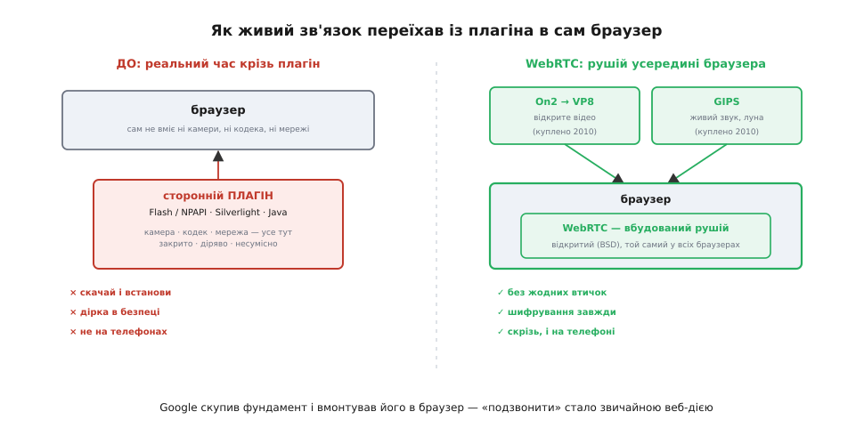
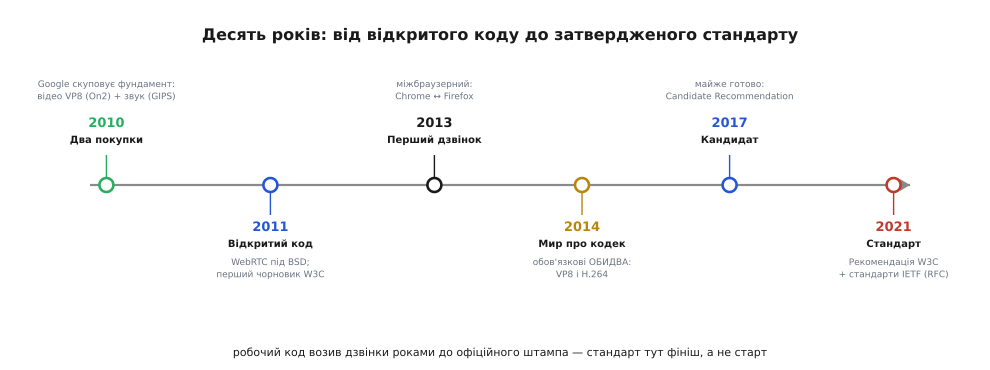

# 📜 Як реальний час потрапив у браузер: історія WebRTC

У [самій темі](root:embedded/video-streaming-protocols) ми поставили WebRTC на найгостріший край осі затримки — як «короля» двобічного реального часу, що дав відеодзвінок **прямо в браузері без жодних плагінів**. Сказати це — одне речення. Але за цим реченням стоїть тиха революція: до WebRTC слова «реальний час» і «браузер» в одній фразі звучали майже як жарт. Браузер умів показувати сторінку, картинку, відеофайл — але **поговорити** через нього, наживо, голосом і відеом, без того, щоб попередньо щось **доустановити**, було неможливо. Розберімо, **чому** так було, **хто** і **як** це зламав — і чому зламати виявилося так несподівано важко, що остаточний стандарт визрів аж за десять років.

Ця історія варта окремого розбору не датами. Вона повчальна тим, що показує рідкісну річ: як велика компанія за рік **купила** дві чужі технології, **роздала їх задарма** — і тим перевернула цілу галузь зв'язку, перетягши її з вузького світу платних плагінів у відкритий веб. І ще тим, що тут добре видно різницю, про яку завжди йдеться в нашому каноні: між «мати ідею», «зробити робочу реалізацію» і «зробити з неї **загальний стандарт**, яким користується весь світ».

## Світ до WebRTC: реальний час крізь плагін

Спершу станьмо в той світ і чесно відчуймо біль, який WebRTC прийшов погамувати. Уявімо інженера середини 2000-х, що хоче зробити на сайті просту річ — кнопку «подзвонити», відеодзвінок прямо зі сторінки. Що в нього під рукою?

Сам по собі браузер тих років не вмів **нічого** з того, що для цього треба. Він не мав доступу до **мікрофона й камери** — з міркувань безпеки сторінці туди ходу не було. Він не вмів **стискати звук і відео в реальному часі** — у ньому просто не було ні кодувальника, ні кодека. Він не вмів відкрити **пряме з'єднання** до іншого браузера, тим паче пробити його [крізь домашні роутери](book:communications/nat-traversal). Уся машинерія живого зв'язку, яку ми розклали в темі, — захоплення з пристрою, кодек, [транспорт по UDP](book:communications/tcp-vs-udp), [буфер джитера](book:communications/jitter), пробивання NAT — у браузері **відсутня цілком**.

Тому єдиний шлях був — **плагін** (англ. *plug-in* — «втичка», окремий модуль, що доустановлюється в браузер і дає йому здатності, яких сам він не має). Найпопулярнішим був **Adobe Flash Player**: він мав доступ до камери з мікрофоном, умів стискати звук і відео, умів говорити по мережі своїм [RTMP](root:embedded/video-streaming-protocols/hist-hls-dash.md), і саме на ньому довго трималися перші браузерні відеочати. Поряд жили інші втички — **Microsoft Silverlight**, аплети **Java**, а в світі IP-телефонії — окремі **настільні програми** на кшталт Skype, що теж несли весь цей рушій усередині себе.

Усі ці плагіни чіплялися до браузера через один старий механізм — **NPAPI** (англ. *Netscape Plugin Application Programming Interface*, інтерфейс плагінів, що з'явився ще в браузері Netscape у 1995 році). Це були ворота, крізь які стороння втичка діставала те, чого браузер їй сам не давав.

І ось у чім був глибокий клопіт, заради якого варто все це згадувати. Плагінна модель була **погана з усіх боків заразом**:

- **Морока для користувача.** Щоб подзвонити, спершу скачай і встанови втичку, дай їй права, час від часу онови. Кожен крок — місце, де людина кидає затію.
- **Дірка в безпеці.** Плагін — це сторонній код із широкими правами всередині браузера, і Flash роками був одним із головних джерел уразливостей в усьому вебі. Чим більше прав, тим солодша мішень.
- **Закрите й роздроблене.** Кожен плагін — власність своєї фірми, зі своїм закритим рушієм і своїми протоколами. Зробити так, щоб втичка одного виробника **поговорила** з втичкою іншого, було майже безнадійно.
- **Не скрізь працює.** На телефонах плагінів практично не було. Коли 2007-го вийшов iPhone, Apple **принципово не пустила Flash** у свій браузер — і це був перший дзвоник, що ера втичок добігає кінця.

> 🔧 **Навіщо це.** Цей біль варто відчути, бо саме він пояснює, **чому** WebRTC зрештою став таким, яким став — і чому шифрування в ньому **обов'язкове**, а не на вибір. Інженери, що його робили, добре пам'ятали, як плагінна модель прорвалася саме безпекою. Тому новий стек будували з протилежним рефлексом: жодного стороннього коду, усе — всередині самого браузера, усе — зашифроване за замовчуванням. Багато «дивних» суворостей WebRTC стають зрозумілими, щойно згадаєш, від чого він тікав.

Отже, на межі 2000–2010-х склалася парадоксальна ситуація. Веб уже був скрізь; відео в інтернеті вже лилося ріками. А **жива двобічна розмова** в браузері все ще трималася на старому, дірявому, закритому милиці — плагіні, який усі вже хотіли поховати, але **не було чим замінити**. Бракувало рівно одного: щоб увесь рушій живого зв'язку переїхав із втички **всередину самого браузера** і став **відкритим** для всіх. Саме цю порожнечу й заповнив Google — і заповнив дуже по-своєму.

## 2010: два покупки, що зібрали фундамент

Тут історія робить різкий поворот, і ключ до неї — розуміння, що зробити браузерний реальний час **з нуля** означало б написати наново кілька найскладніших шматків інженерії зв'язку: гарні кодеки, чисте оброблення звуку, надійний транспорт. На це йдуть роки й команди вузьких фахівців. Google пішов коротшим шляхом — **купив** готові шматки в тих, хто вже з'їв на них зуби. І зробив це за один **2010 рік**, двома окремими покупками, що закрили дві різні діри.

**Перша діра — відео-кодек.** На початку 2010-го Google придбав компанію **On2 Technologies** — давнього розробника відеокодеків (угоду оголосили ще 2009 року, закрили на початку 2010-го, приблизно за 124 мільйони доларів). У On2 був свіжий кодек **VP8**, і 19 травня 2010 року на конференції Google I/O компанія **відкрила** його: виклала вихідний код під вільною ліцензією й сам формат бітпотоку — під безвідкличним безкоштовним патентним дозволом. Того ж дня народився проєкт **WebM** — відкритий відеоформат для вебу на основі VP8, який підтримали Mozilla, Opera й десятки інших. Так у Google з'явився **свій відкритий відеокодек**, не обтяжений ліцензійними зборами, — те, чого бракувало для вільного відео в браузері.

> *Статус доказовості: усталений факт. Дати й суми (закриття угоди On2 на початку 2010-го, ~124,6 млн дол.; відкриття VP8 і запуск WebM 19 травня 2010-го на Google I/O) збігаються в кількох незалежних джерелах — Wikipedia (On2, VP8), репортажах The Register та InfoQ.*

**Друга діра — звук і обробка реального часу.** За кілька днів, 18 травня 2010 року, Google оголосив другу покупку — **Global IP Solutions** (скорочено **GIPS**), компанію зі Стокгольма й Сан-Франциско, що приблизно за 68 мільйонів доларів перейшла під крило Google. І саме ця покупка, хоч і менша грошима, виявилася для майбутнього WebRTC **серцевиною**.

Чим займалася GIPS? Вона десятиліттями робила дуже **невидиму, але страшенно важку** річ — програмний рушій живого голосу й відео по IP. Це не сам кодек у вузькому сенсі, а вся та делікатна обробка, без якої жива розмова перетворюється на муку:

- **Мовні кодеки** — вузькосмуговий **iLBC** (англ. *internet Low Bitrate Codec*) і ширшосмуговий **iSAC** (англ. *internet Speech Audio Codec*), розраховані саме на голос крізь непевну мережу.
- **Подавлення луни** (англ. *acoustic echo cancellation*, AEC) — те, що прибирає з розмови жахливе відлуння, коли звук із твого динаміка ловиться твоїм же мікрофоном і вертається співрозмовнику. Без цього гучний зв'язок без навушників нестерпний.
- **Притлумлення шуму, маскування втрачених пакетів, керування буфером джитера** — увесь той тонкий шар, що тримає голос розбірливим, коли мережа підводить.

Це і є та сама «брудна робота», яку важко зробити добре й на яку йдуть роки. Клієнтами GIPS свого часу були поважні імена в зв'язку — Yahoo, AOL, Nortel, WebEx, Samsung. Купивши GIPS, Google отримав **готовий, відшліфований роками рушій живого звуку** — і вирішив віддати його світу задарма.

> *Статус доказовості: усталений факт. Дата (18 травня 2010-го), сума (~68,2 млн дол.) і суть технологій GIPS (кодеки iLBC та iSAC, подавлення луни, обробка голосу для VoIP) підтверджені офіційним пресрелізом Google, репортажем siliconrepublic та статтею про Global IP Solutions у Wikipedia.*

Складімо тепер дві покупки докупи — і стане видно задум. **On2 дав відкрите відео; GIPS дав відкритий, відшліфований живий звук і всю обробку реального часу.** Два шматки, що поодинці нічого не вирішували, разом склали майже повний **фундамент** для живого зв'язку в браузері. Лишалося зробити останнє, найважливіше — **вмонтувати цей фундамент у сам браузер** і відкрити його так, щоб ним міг скористатися будь-хто, не питаючи дозволу.

## 2011: Google відкриває WebRTC

Через рік, **31 травня 2011 року**, Google зробив той самий останній крок. Інженер **Гаральд Альвестранд** (норв. *Harald Alvestrand*) написав у списку розсилки нової робочої групи W3C коротке оголошення: Google **відкриває вихідний код WebRTC** — рушій живого аудіо й відео для вебу, зібраний саме з того, що дала GIPS (кодеки, подавлення луни, обробка голосу) і VP8 від On2. Код виклали під вільною ліцензією **BSD** разом із патентним дозволом — тобто будь-який браузер, будь-яка компанія могли взяти його й вбудувати в себе, **безплатно й без юридичних пасток**.

> *Статус доказовості: усталений факт. Дату (31 травня 2011-го), авторство оголошення (Harald Alvestrand) і ліцензію (BSD із патентним дозволом) підтверджують збережений архів листа в розсилці public-webrtc@w3.org за травень 2011-го, репортаж The Register від 1 червня 2011-го та стаття WebRTC у Wikipedia.*

Вдумаймося, що саме тут сталося, бо в цьому вся суть. Google не просто **зробив** браузерний реальний час — він зробив його **відкритим стандартом-у-зародку**. Це принципово інший хід, ніж у Skype чи Flash, що тримали свій рушій під замком як перевагу. Логіка Google була інша: відеозв'язок цінний не сам по собі, а тоді, коли він **скрізь і всумісний** — коли будь-яка сторінка в будь-якому браузері може подзвонити будь-кому без втичок. А такого не збудуєш закритим кодом однієї фірми; це можливо лише як **спільне надбання всього вебу**. Тому Google свідомо роздав фундамент конкурентам — щоб вони вбудували той самий рушій у свої браузери, і живий зв'язок став спільною мовою, а не острівцем.

Назва **WebRTC** — це просто **Web Real-Time Communication**, «вебний зв'язок реального часу». І ціль у нього з першого дня була та, яку ми вже назвали в темі: жива розмова **прямо в браузері, без жодних плагінів**. Похоронити Flash, NPAPI й окремі настільні програми — і зробити «подзвонити» такою ж звичайною веб-дією, як «відкрити сторінку».

Тут, для чесності, варто розставити, **хто що зробив** — бо легенда любить спрощувати до «Google винайшов відеодзвінок у браузері», а це неточно. Сам **живий зв'язок по IP** винайшли задовго до Google — на ньому стояла ціла індустрія VoIP, і саме її напрацювання (зокрема в GIPS) Google **купив**, а не вигадав. [RTP](root:embedded/video-streaming-protocols/hist-rtp.md), що б'ється в серці WebRTC, описали ще 1996 року зовсім інші люди. Заслуга Google інша й по-своєму більша: він **зібрав** найкращі готові шматки докупи, **вмонтував** їх у браузер і — найголовніше — **відкрив** усе це так, щоб воно стало загальним. Це класичний приклад нашого розрізнення: не «мати ідею» живого зв'язку (ідея була стара) і навіть не «зробити реалізацію» (реалізації були в GIPS, у Skype), а **створити з цього відкриту систему**, доступну всьому вебу. Саме останнє й перевернуло галузь.

*Зліва — світ до WebRTC: щоб поговорити, браузер мусив тягти сторонній плагін (Flash/NPAPI, Silverlight, Java), і вже той ніс камеру, кодек і мережу — закрито, діряво й несумісно між виробниками. Справа — WebRTC: Google скупив фундамент (відео VP8 від On2, живий звук і подавлення луни від GIPS), вмонтував його просто в браузер і відкрив під ліцензією BSD. Той самий рушій опинився всередині кожного браузера — і «подзвонити» стало звичайною веб-дією без жодних втичок.*

## Дві кухні стандарту: чому W3C і IETF разом

Відкритий код — це ще не стандарт. Щоб WebRTC справді став **спільною мовою всіх браузерів**, його треба було не просто роздати, а **домовитися** — записати точні правила, яких триматимуться всі виробники, інакше реалізації розповзлися б і перестали розуміти одна одну. І тут з'являється цікава особливість, варта окремого слова: WebRTC стандартизували **дві різні організації одночасно** — W3C і IETF. Чому дві, а не одна?

Бо WebRTC живе **на стику двох світів**, і кожен світ має свого господаря стандартів.

**Перший світ — те, що бачить веброзробник усередині сторінки:** команди мовою JavaScript на кшталт «дай мені камеру», «з'єднайся з тим браузером», «надішли цей потік». Це **програмний інтерфейс** (API) всередині веб-сторінки. А все, що стосується API браузера й мов веба, — вотчина **W3C** (англ. *World Wide Web Consortium*, консорціум, що задає стандарти вебу: HTML, CSS і подібне). Тож W3C узяв на себе **верх** — як WebRTC виглядає для програміста, що пише сторінку.

**Другий світ — те, що біжить дротами між пристроями:** які саме байти, в яких пакетах, яким [транспортом](book:communications/tcp-vs-udp), як шифровані, як пробивають NAT. Це **мережеві протоколи**, а їхній господар — **IETF** (англ. *Internet Engineering Task Force*, спільнота, що задає протоколи інтернету у вигляді документів RFC: саме там народилися й [RTP](root:embedded/video-streaming-protocols/hist-rtp.md), і безліч інших цеглин мережі). Тож IETF узяв **низ** — що саме літає каналом.

Ось чому двоє. Це не плутанина й не дублювання, а природний **поділ праці за рівнями**, той самий, що ми бачимо в темі на прикладі поділу даних і керування: W3C відповідає за **обличчя** WebRTC для розробника сторінки, IETF — за його **нутрощі** в мережі. Один стандарт описує, як це **викликати**; інший — як це **передається**. Разом вони й роблять WebRTC цілим: сторінка в будь-якому браузері говорить тими самими JavaScript-командами (канон W3C), а під капотом ці команди шлють тими самими пакетами (канон IETF) — тож браузери різних виробників розуміють одне одного й зверху, і знизу.

> 🔧 **Навіщо це.** Цей поділ — не історична дрібниця, а карта, за якою орієнтуються, коли щось не працює. Зламалося на рівні сторінки — «не дає камеру», «`RTCPeerConnection` кидає помилку» — шукай у специфікаціях **W3C**. Зламалося в мережі — пакети не доходять, не пробивається NAT, не сходиться шифрування — копай у документах **IETF** (RFC). Знаючи, що WebRTC має дві кухні стандарту, ти одразу знаєш, у **чий** кухонний стіл стукати з конкретною бідою, замість шукати все в одній купі.

## Чому стандарт визрівав десять років

А тепер найдивовижніша частина історії. Код відкрили 2011 року; перший чорновий начерк специфікації W3C з'явився вже в **жовтні 2011-го**. Здавалося б, ще рік-два — і готовий стандарт. Насправді офіційною **Рекомендацією W3C** (англ. *W3C Recommendation* — найвищий, остаточний статус стандарту в W3C) версія **WebRTC 1.0** стала аж **26 січня 2021 року**. Майже **десять років** від відкриття коду до затвердженого стандарту. Чому так довго?

Тут криється важливий урок про те, чим **робоча реалізація** відрізняється від **узгодженого стандарту** — і чому друге дається в рази важче за перше.

По-перше, **WebRTC — не один протокол, а цілий стек**, і кожен його шматок треба було узгодити окремо. Згадаймо з теми, що там усередині: [RTP](root:embedded/video-streaming-protocols/hist-rtp.md) для медіа, обов'язкове шифрування, вибір кодека на льоту, [пробивання NAT](book:communications/nat-traversal), канал даних, зворотний зв'язок про якість. Кожна з цих цеглин — окремий документ, окрема домовленість, а часто й окрема суперечка. Стандартизувати стек — це не одна угода, а **десятки**, що мають ще й бездоганно лягати одна до одної.

По-друге, **узгодити мали конкуренти**, у кожного зі своїм уже відвантаженим кодом. До столу сіли Google, Mozilla, Microsoft, Apple, Opera — і в кожного були свої реалізації, свої вподобання, свої вже написані продукти, які не хотілося ламати. А ще тлів затяжний **спір про кодеки**: який відеокодек зробити обов'язковим — відкритий VP8 від Google чи поширений H.264, обтяжений патентами? Цей конкретний вузол розв'язали лише компромісом 2014 року — **зобов'язали браузери підтримувати обидва**. Кожна така незгода розтягувала шлях до спільного «так».

По-третє — і це наскрізна риса всіх відкритих стандартів — **поспіх тут шкідливий**. Стандарт пишуть **раз і надовго**: на нього спиратимуться мільярди пристроїв роками, і помилку в ньому потім не виправиш легко, бо «виправлення» зламає всіх, хто вже за ним зробив. Тому шлях навмисне обвішаний запобіжниками й проміжними щаблями. Статус **Candidate Recommendation** (кандидат у рекомендації) WebRTC отримав лише в **листопаді 2017-го** — і це вже означало «технічно майже готово»; далі ще роки пішли на те, щоб незалежні реалізації довели **сумісність** на практиці, перш ніж поставити остаточний штамп 2021-го.

*Шлях WebRTC від двох покупок до офіційного стандарту. 2010-го Google скуповує фундамент — відео-кодек VP8 (On2) і живий звук із подавленням луни (GIPS). 2011-го відкриває код під BSD; того ж року з'являється перший чорновий начерк W3C. Далі — роки узгодження між конкурентами (Google, Mozilla, Microsoft, Apple, Opera) і спір про обов'язковий кодек, розв'язаний 2014-го компромісом «обидва». 2017-го — статус кандидата; і лише 26 січня 2021-го — офіційна Рекомендація W3C та супутні стандарти IETF (RFC). Десять років не на код, а на спільне «так».*

> *Статус доказовості: усталений факт. Дати (перший чорновий начерк W3C — жовтень 2011-го; компроміс про кодеки — 2014-й; Candidate Recommendation — листопад 2017-го; офіційна Рекомендація W3C і пакет стандартів IETF — 26 січня 2021-го) підтверджені пресрелізом W3C про статус WebRTC 2021 року, статтею WebRTC у Wikipedia та документами IETF (зокрема RFC 8825).*

Тут варто наголосити на тонкій, але дуже практичній речі. Те, що стандарт **затвердили** лише 2021-го, зовсім **не означає**, що до того WebRTC не працював. Якраз навпаки: він уже роками **возив реальні дзвінки на мільярди** — браузери вбудували його задовго до офіційного штампа, бо код був відкритий і робочий. Перший **міжбраузерний** відеодзвінок (Chrome із Firefox) показали ще в **лютому 2013 року**. Тобто реалізація випереджала стандарт на роки — і це **нормальний** порядок речей у вебі: спершу всі домовляються **на практиці**, відвантажуючи робочий код і притираючи його одне до одного, а офіційна Рекомендація лише **скріплює печаткою** те, що вже встоялося в житті. Стандарт тут — не старт, а **фініш**: визнання того, що домовленість уже відбулася й перевірена.

## Тиха революція: вибух відеодзвінків

Лишається останнє — оцінити, **що з усього цього вийшло**. І тут масштаб легко проґавити, бо WebRTC — технологія **навмисне невидима**: вона добре зробила свою роботу саме тоді, коли її перестали помічати.

Згадаймо вихідну точку: близько 2010 року «подзвонити по відео» означало або скачати окрему програму (Skype), або терпіти плагін на сайті. Через десять років усе перевернулося: відеодзвінок став **звичайною кнопкою на веб-сторінці**, що працює сама, без жодної доустановки, у будь-якому браузері на будь-якому пристрої. І ту кнопку майже скрізь крутить **той самий рушій** — WebRTC, відкритий 2011-го. Він став **невидимою сантехнікою** живого зв'язку в інтернеті — як водогін, якого не помічаєш, поки тече.

Найгучніше це проявилося в **2020 році**, коли світ через пандемію раптом пересів на відеозв'язок — робота, школа, лікарі, рідні, усе через екран. Раптовий, небачений сплеск попиту на відеодзвінки веб-платформи витримали **значною мірою тому**, що під ними вже лежав готовий, відкритий, вбудований у кожен браузер стек реального часу. Не було б WebRTC — не було б на чому так швидко й масово розгорнути всі ці дзвінки прямо в браузері, без вимоги кожному щось скачувати. Тиха технологія, закладена за десятиліття до того, виявилася саме тим фундаментом, на якому світ протримався на відстані.

І найкрасивіше тут — повне коло, що замикає всю історію. Те, заради чого Google починав, — поховати плагіни й перенести живий зв'язок усередину відкритого браузера, — **збулося цілком**. Flash офіційно помер наприкінці 2020 року; NPAPI браузери викинули ще раніше (Chrome — 2015-го). А на їхньому місці лишилося рівно те, що задумувалося: **відкритий, спільний, вбудований реальний час**, яким однаково користуються гіганти відеоконференцій і крихітний саморобний відеочат на чиїйсь домашній сторінці. Те, що в [темі](root:embedded/video-streaming-protocols) ти береш як спокійну даність — «WebRTC дає дзвінок у браузері без плагінів», — і є **здійснена** мрія, заради якої 2010-го купили дві компанії, а 2011-го роздали світу їхні нутрощі.

## Що з цієї історії забрати собі

Зведімо нитки — і лишиться кілька думок, ширших за самий WebRTC.

Перша й найзагальніша: **відкритість буває потужнішою за володіння**. Google міг тримати куплений у GIPS і On2 рушій під замком як перевагу — як робили Skype і Adobe. Натомість він **роздав** його конкурентам — і саме тому виграв куди більше: живий зв'язок став спільною мовою всього вебу, а не ще одним закритим острівцем. Іноді, щоб технологія охопила світ, її треба **відпустити**, а не стиснути в кулаку.

Друга: **стандарт — це фініш, а не старт**. WebRTC возив реальні дзвінки роками до офіційної Рекомендації 2021-го. Спершу з'явився робочий **відкритий код**, потім роки **притирання** між конкурентами на практиці — і лише наприкінці печатка стандарту, що скріпила вже усталене. Тож, побачивши «новий стандарт», варто питати не «коли його затвердили», а «**коли він реально запрацював у житті**» — це різні, часом дуже далекі дати.

Третя, найпрактичніша й найближча до нашого ремесла: **велике часто збирають, а не винаходять**. WebRTC — це не геніальний єдиний винахід, а **майстерне складання** готового: куплений живий звук GIPS, куплене відео On2, давній [RTP](root:embedded/video-streaming-protocols/hist-rtp.md) із 1996-го, чуже шифрування, чуже пробивання NAT — усе зведене докупи й вмонтоване в браузер. Заслуга не в тому, щоб вигадати кожну цеглину з нуля, а в тому, щоб **побачити ціле**, зібрати найкращі шматки й зробити з них відкриту систему, якою користуватиметься весь світ. Це варто тримати в голові щоразу, коли здається, ніби велике народжується лише з осяяння одинака: частіше воно народжується з розумного складання вже відомого — і з відваги це складене **віддати**.
