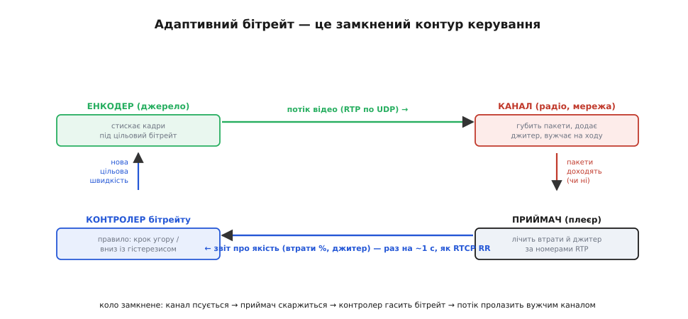
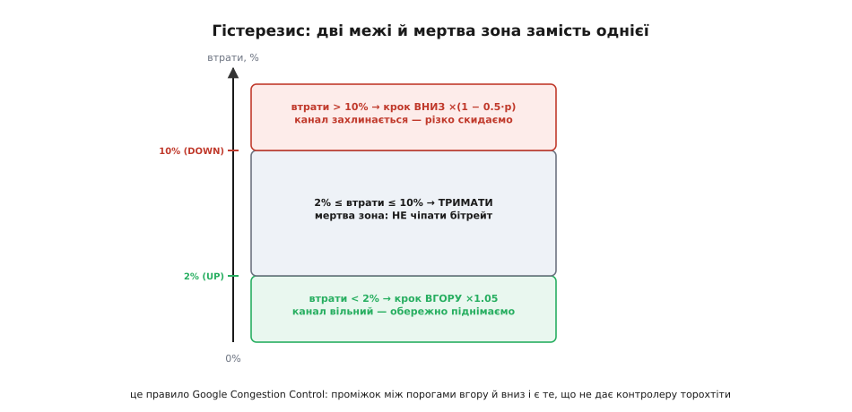
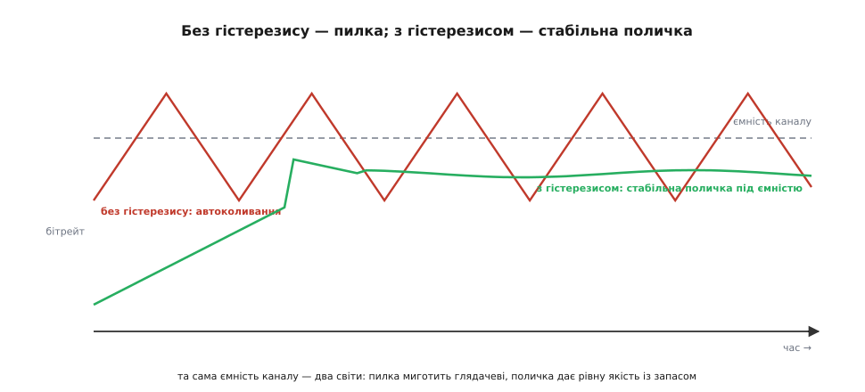

# ⚙️ Петля адаптивного бітрейту: коли відео саме гасить якість

У темі ми лишили нерозкритою найживучішу ідею всього стрімінгу — ту, що тримає відео живим на каналі, який щомиті псується. Ми бачили, що в парі з RTP завжди їде маленький супутник RTCP, який раз на кілька секунд переносить **звіт про якість**: приймач каже джерелу «я втратив стільки-то відсотків пакетів, джитер такий-то». І ми пообіцяли: знаючи, що канал псується, розумне джерело **знижує бітрейт** — стискає картинку сильніше, щоб вона пролізла крізь вужчий канал, нехай і гіршою. Тепер закриваємо цей борг до кінця: збудуємо ту саму петлю руками, рядок за рядком робочого C, і побачимо, що вона ховає геть не там, де здається.

Бо тут чигає підступ. На словах правило звучить як дитяча гра: «втрачаєш пакети — знижуй якість; не втрачаєш — піднімай». Здавалося б, що тут писати — три рядки. Але якщо саме так і написати, ви отримаєте відео, що **миготить** — стрибає між чітким і мутним кожні дві секунди, гірше дратуючи глядача, ніж стабільно посередня картинка. Уся складність адаптивного бітрейту — не в тому, **коли** міняти швидкість, а в тому, як зробити, щоб контролер **не торохтів**, не сіпався на кожен чих каналу й при цьому **встигав** ухилитися, коли канал по-справжньому валиться. Це задача керування зі зворотним зв'язком — рівно того роду, що інженери розв'язують у регуляторах, — тільки замість температури чи обертів тут якість відео, а замість датчика — звіт про втрачені пакети.

## Задача: джерело, що саме підлаштовує якість під канал

Сформулюймо чесно, що ми будуємо. На одному кінці — **джерело**: камера, енкодер H.264, передавач. Енкодер має одну ручку, якою ми можемо крутити на ходу, — **цільовий бітрейт** (англ. *target bitrate*): скільки кілобітів за секунду йому дозволено витрачати на стиснене відео. Накрутиш більше — картинка чіткіша, але потік товщий; прикрутиш — картинка мутнішає й сіпається на швидкому русі, зате потік тонший і пролізе крізь вужчий канал. (Енкодер тримає цю задану швидкість, керуючи **квантуванням** — грубістю округлення коефіцієнтів; груба сітка — менше бітів, більше «квадратиків».)

На другому кінці — **приймач**, що бачить правду про канал, недосяжну джерелу. Джерело не знає, доходять його пакети чи тонуть у радіоефірі, — воно лише висипає байти в UDP і забуває про них. А приймач, дивлячись на **номери RTP**, точно бачить діри в нумерації (5, 6, 8 — пакет 7 загубився) і міряє **джитер** — як плаває проміжок між приходами. Тобто потрібну для рішення інформацію має один (приймач), а ручку, якою це рішення виконується, тримає інший (джерело). Між ними — той самий ненадійний канал, через який і треба передати скаргу.

Звідси й уся конструкція. Нам потрібні **три деталі**, з'єднані в кільце:

```
 приймач  →  міряє втрати й джитер, пакує у звіт (як RTCP RR)
    │
    │  звіт летить назад через канал
    ▼
 контролер  →  за простим правилом рахує НОВИЙ цільовий бітрейт
    │
    │  команда «нова швидкість»
    ▼
 енкодер  →  перебудовується під нову швидкість, ллє далі
    │
    └──────►  потік знову йде в канал — і коло замикається
```

Ключове слово — **кільце**. Це не «передати й забути», а **контур зі зворотним зв'язком** (англ. *feedback loop*): вихід системи (стан каналу) повертається на її вхід (рішення про бітрейт) і впливає на наступний крок. Той, хто хоч раз налаштовував регулятор температури чи обертів двигуна, упізнає тут знайому пастку: контур зі зворотним зв'язком можна легко загнати в **автоколивання**, і вся майстерність — у тому, щоб цього не сталося. Ми до цього прийдемо; спершу збудуймо саме кільце.


*Адаптивний бітрейт — це замкнений контур керування, а не однобічна передача. Угорі дані течуть зліва направо: енкодер → канал → приймач. Унизу інформація тече назад: приймач лічить втрати й джитер за номерами RTP і шле звіт (як RTCP receiver report, раз на ~1 с), контролер за правилом рахує нову цільову швидкість і віддає її енкодеру. Без зворотної (нижньої) гілки це був би «відкритий цикл», що ллє наосліп; саме замикання кільця й робить відео стійким до зміни каналу.*

## Ідея: вимірювання, рішення, гістерезис

Розкладімо кільце на три питання, бо кожне має свою тонкість.

**Перше — що саме міряти.** Приймач рахує дві речі, які ми вже знаємо з теми. Перша — **частка втрат** (англ. *fraction lost*): скільки відсотків пакетів зникло **за останній інтервал** (не за весь сеанс, а саме від попереднього звіту — щоб бачити свіжий стан). Друга — **джитер**: варіація затримки приходу. Чому дві, а не одна? Бо вони ловлять **різні стадії** біди. Коли канал тільки-но починає захлинатися, пакети ще не губляться — вони лише **затримуються** в чергах маршрутизаторів, і це видно як зростання джитера **раніше**, ніж з'являться втрати. А втрати — це вже коли черги переповнились і пакети **викидаються**. Тобто джитер — ранній дзвіночок, втрати — пізній і твердий сигнал. Гарний контролер слухає обидва; ми почнемо з втрат як простішого й твердішого, а джитер додамо як раннє попередження.

> 🔧 **Навіщо це.** Це той самий поділ, що в дорослих алгоритмах. У відеодзвінках Chrome (Google Congestion Control) працюють **два** оцінювачі заразом: один за втратами, другий за затримкою (зростанням джитера), і перемагає той, що каже знижувати **сильніше**. Логіка проста: затримка попереджає рано, втрати підтверджують пізно — слухай обидва й вір гіршому. Ми збудуємо спрощену версію тієї самої ідеї, тож, дочитавши, ви розумітимете не навчальну іграшку, а скелет того, що реально возить мільярди дзвінків.

**Друге — як саме приймач пакує звіт.** Тут не треба нічого вигадувати: формат давно стандартизовано в **RTCP receiver report** (RFC 3550). Варто глянути, які поля він несе насправді, — це і є наш «датчик», і його розрядність диктує, як писати код. Звіт містить (усталений факт, RFC 3550 §6.4.1):

```
 fraction lost      —  8 бітів:  частка втрат ЗА ОСТАННІЙ інтервал,
                       закодована як floor(частка · 256). Тобто 256 = 100%,
                       значення 13 ≈ 5% втрат. Дробу немає — ціле число.
 cumulative lost    —  24 біти зі знаком: УСЬОГО втрачено від початку сеансу
                       (накопичувально; не за інтервал).
 interarrival jitter — 32 біти: згладжена оцінка варіації затримки,
                       за алгоритмом RFC 3550, Додаток A.8.
```

Зверніть увагу на дрібницю, що береже від багу: `fraction lost` — це **не відсоток і не частка від нуля до одиниці**, а ціле від 0 до 255, де 255 — це майже 100% втрат. Розпаковуючи звіт, перше, що робиш, — ділиш на 256, щоб дістати звичну частку. Поплутаєш — і поріг «10% втрат» спрацює на 0.04% реальних, контролер сказиться. Ми це врахуємо в коді.

> 🔧 **Навіщо це.** Навіть якщо у вашій системі немає повноцінного RTCP (на вузькому дрон-лінку часто ліплять свій мінімальний звіт), **повторіть формат розумно**: шліть частку втрат за останній інтервал, а не сире число загублених пакетів. Сире число нічого не каже без знання, скільки всього послано; частка — самодостатня. А восьми бітів (крок ≈ 0.4%) для рішення про бітрейт цілком досить — не транжирте смугу зворотного каналу на зайву точність.

**Третє — і найважливіше — як вирішувати.** Ось тут наївне «втрати є → вниз, втрат нема → вгору» і ламається. Уявімо контролер з **одним** порогом, скажімо 5%: вище — крок униз, нижче — крок угору. Що буде? Канал має якусь ємність. Контролер піднімає бітрейт, доки не впреться в неї й не почне ловити втрати; втрати перевищують 5% — крок униз; тепер бітрейт нижчий за ємність, втрат нема — крок **угору**; знову вперлися — знову вниз. Контролер **гойдається** навколо ємності каналу вічно, ніколи не сідаючи на стабільне значення. Глядач бачить, як картинка ритмічно то різкішає, то мутнішає, — і це гірше за стабільно нижчу якість.

Ліки звуться **гістерезис** (гр. *hystéresis* — «відставання, запізнення») — і це та сама ідея, що в кімнатному термостаті. Термостат не вмикає й не вимикає опалення на тій самій температурі (інакше реле торохтіло б щосекунди) — він гріє до 21°, а вимикає аж на 23°, лишаючи **мертву зону** між порогами вмикання й вимикання. Так само й тут: треба **два різні пороги**. Один, **низький** (скажімо, 2% втрат), нижче якого ми обережно піднімаємо якість. Другий, **високий** (скажімо, 10%), вище якого різко знижуємо. А **між ними — мертва зона**, де контролер не робить **нічого**, хай канал собі дихає. Ця мертва зона й розриває порочне коло гойдання: піднявшись і впершись, контролер не починає негайно опускатися — він спершу мовчки тримає, і автоколивання нема звідки взятися.


*Серце контролера — два пороги й мертва зона між ними. Низькі втрати (зелена зона, менше 2%) означають вільний канал — обережно піднімаємо бітрейт. Високі (червона, понад 10%) означають, що канал захлинається, — різко скидаємо. Між ними (сіра, 2–10%) — мертва зона, де НЕ чіпаємо нічого. Саме проміжок між порогом угору й порогом униз гасить автоколивання: піднявшись і впершись у втрати, контролер не починає одразу падати, а тримає. Це рівно правило Google Congestion Control для відеодзвінків.*

І ось приємна перевірка реальністю: ті пороги, що ми «вгадали», — 2% і 10% — це **дослівно** правило, яким Google Congestion Control керує бітрейтом у відеодзвінках. У його чорновику IETF (draft-ietf-rmcat-gcc) loss-based-контролер записано так (усталений факт, цитата зі специфікації):

```
 втрати < 2%        →  бітрейт ← бітрейт · 1.05      (рости на 5%)
 2% ≤ втрати ≤ 10%  →  бітрейт ← бітрейт            (тримати)
 втрати > 10%       →  бітрейт ← бітрейт · (1 − 0.5·p)   (p — частка втрат)
```

Тобто наш «навчальний» гістерезис і є промислова формула. Зверніть увагу на **асиметрію**, до якої ми ще повернемось окремо: вгору — фіксований обережний крок (+5%), а вниз — крок **пропорційний** біді (за 20% втрат це ×0.9, за 50% — ×0.75). Це не випадковість: рости треба боязко й однаково, а **тікати** — тим швидше, чим гірше горить. Запам'ятаймо це; зараз — у код.

## Робочий код: контролер бітрейту з гістерезисом

Зберемо контролер так, як він жив би в прошивці передавача. Спочатку — стан і параметри в одній структурі, щоб усе налаштування було в одному місці й нічого не «висіло» глобально. Усі швидкості тримаємо в **бітах за секунду** цілими (`uint32_t`) — на прошивці без потреби не тягнемо `float` туди, де досить цілої арифметики; частку втрат теж тримаємо в зручній цілій формі.

:::tabs
```c
#include <stdint.h>

typedef struct {
    uint32_t rate;        // поточний цільовий бітрейт, біт/с
    uint32_t rate_min;    // підлога: нижче не опускаємось (гірша допустима якість)
    uint32_t rate_max;    // стеля: вище не піднімаємось (краща потрібна якість)

    // пороги втрат у ПРОМІЛЕ (‰), щоб лишитись у цілій арифметиці:
    //   20‰ = 2%   (поріг росту),   100‰ = 10%  (поріг падіння)
    uint16_t loss_up_permille;    // < цього → рости
    uint16_t loss_down_permille;  // > цього → падати

    uint8_t  up_step_pct;   // крок угору, % (наприклад, 5 → ×1.05)
} abr_t;

void abr_init(abr_t *c, uint32_t start, uint32_t lo, uint32_t hi)
{
    c->rate     = start;
    c->rate_min = lo;
    c->rate_max = hi;
    c->loss_up_permille   = 20;   // 2.0%
    c->loss_down_permille = 100;  // 10.0%
    c->up_step_pct        = 5;    // +5% за крок угору
}
```
```python
from dataclasses import dataclass

@dataclass
class Abr:
    rate: int             # поточний цільовий бітрейт, біт/с
    rate_min: int         # підлога: нижче не опускаємось (гірша допустима якість)
    rate_max: int         # стеля: вище не піднімаємось (краща потрібна якість)

    # пороги втрат у ПРОМІЛЕ (‰), щоб лишитись у цілій арифметиці:
    #   20‰ = 2%   (поріг росту),   100‰ = 10%  (поріг падіння)
    loss_up_permille: int = 20      # < цього → рости    (2.0%)
    loss_down_permille: int = 100   # > цього → падати   (10.0%)

    up_step_pct: int = 5            # крок угору, % (наприклад, 5 → ×1.05)


def abr_init(start: int, lo: int, hi: int) -> Abr:
    return Abr(rate=start, rate_min=lo, rate_max=hi)
```
:::

Тепер серце — функція, яку викликаємо **на кожен прийнятий звіт**. Вона дістає частку втрат, проганяє її крізь три зони гістерезису й повертає новий бітрейт. Вхід — `fraction_lost` рівно в тому вигляді, як його несе RTCP RR: ціле 0…255, де 255 ≈ 100%. Перше ж, що робимо, — переводимо його в проміле (‰), щоб порівнювати з порогами; це і є та сама обережність із розрядністю, про яку ми попереджали.

:::tabs
```c
// Викликати на КОЖЕН звіт від приймача.
//   fraction_lost — поле RTCP RR: 0..255, де 256 == 100% (floor(частка·256)).
// Повертає оновлений цільовий бітрейт (біт/с).
uint32_t abr_on_report(abr_t *c, uint8_t fraction_lost)
{
    // 0..255  →  проміле 0..1000:  ‰ = fraction_lost · 1000 / 256
    uint16_t loss = (uint16_t)(((uint32_t)fraction_lost * 1000u) >> 8);

    if (loss > c->loss_down_permille) {
        // ── ЗОНА ПАДІННЯ: скидаємо тим різкіше, чим більші втрати ──
        // множник (1 − 0.5·p): за 10% → ×0.95, за 50% → ×0.75
        // у цілій арифметиці: rate · (2000 − loss) / 2000   (loss у ‰)
        uint32_t num = 2000u - loss;           // напр., loss=300‰ → 1700
        c->rate = (uint32_t)(((uint64_t)c->rate * num) / 2000u);

    } else if (loss < c->loss_up_permille) {
        // ── ЗОНА РОСТУ: один обережний крок угору ──
        c->rate += c->rate / 100u * c->up_step_pct;   // +5%

    }
    // ── інакше (2%..10%): МЕРТВА ЗОНА — нічого не міняємо ──

    // тримаємось у межах [rate_min, rate_max]
    if (c->rate < c->rate_min) c->rate = c->rate_min;
    if (c->rate > c->rate_max) c->rate = c->rate_max;

    return c->rate;
}
```
```python
# Викликати на КОЖЕН звіт від приймача.
#   fraction_lost — поле RTCP RR: 0..255, де 256 == 100% (floor(частка·256)).
# Повертає оновлений цільовий бітрейт (біт/с).
def abr_on_report(c: Abr, fraction_lost: int) -> int:
    # 0..255  →  проміле 0..1000:  ‰ = fraction_lost · 1000 / 256
    loss = (fraction_lost * 1000) >> 8

    if loss > c.loss_down_permille:
        # ── ЗОНА ПАДІННЯ: скидаємо тим різкіше, чим більші втрати ──
        # множник (1 − 0.5·p): за 10% → ×0.95, за 50% → ×0.75
        # у цілій арифметиці: rate · (2000 − loss) / 2000   (loss у ‰)
        num = 2000 - loss                      # напр., loss=300‰ → 1700
        c.rate = c.rate * num // 2000

    elif loss < c.loss_up_permille:
        # ── ЗОНА РОСТУ: один обережний крок угору ──
        c.rate += c.rate // 100 * c.up_step_pct   # +5%

    # ── інакше (2%..10%): МЕРТВА ЗОНА — нічого не міняємо ──

    # тримаємось у межах [rate_min, rate_max]
    c.rate = max(c.rate_min, min(c.rate, c.rate_max))

    return c.rate
```
:::

Простежмо, що тут діється, на конкретних числах — це найкраще показує, чому гістерезис рятує. Хай канал має ємність близько 4 Мбіт/с, стартуємо з 2 Мбіт/с, межі — від 0.5 до 6 Мбіт/с.

**Прогін: канал ємністю ≈ 4 Мбіт/с, старт 2 Мбіт/с.**

```
 звіт  втрати   зона          дія              новий бітрейт
 ────  ──────   ───────────   ──────────────   ─────────────
  1     0.0%    ріст (<2%)    ×1.05            2.10 Мбіт/с
  2     0.0%    ріст          ×1.05            2.21
  3     0.0%    ріст          ×1.05            2.32
  …     …       ріст          ×1.05            … росте до ~4.0
  9     1.2%    ріст (<2%)    ×1.05            4.20  (перестрибнули ємність!)
 10     8.0%    МЕРТВА зона   —                4.20  (тримаємо: 2%<8%<10%)
 11     6.0%    МЕРТВА зона   —                4.20  (канал ледь тягне, та терпимо)
 12     3.0%    МЕРТВА зона   —                4.20  (сидимо рівно)
 13     2.5%    МЕРТВА зона   —                4.20
```

Ось воно — диво мертвої зони. Контролер ріс, перестрибнув ємність на дев'ятому звіті, словив помірні втрати — і **завмер** на 4.2 Мбіт/с, бо втрати потрапили в мертву зону (2%…10%). Він не кинувся вниз, як зробив би одно­пороговий, тож і гойдатися не починає: сидить трохи **вище** реальної ємності, миряючись із кількома відсотками втрат (їх з'їсть [буфер джитера](root:com-transport/jitter) та FEC), і **не торохтить**. А тепер уявімо, що канал по-справжньому впав — скажімо, дрон залетів за пагорб:

**Той самий контролер, канал різко впав до ≈ 1.5 Мбіт/с.**

```
 звіт  втрати   зона          дія                  новий бітрейт
 ────  ──────   ───────────   ──────────────────   ─────────────
 14    35%     падіння(>10%) ×(1−0.5·0.35)=×0.825  3.47 Мбіт/с
 15    28%     падіння       ×0.86                  2.98
 16    20%     падіння       ×0.90                  2.68
 17    14%     падіння       ×0.93                  2.49
 18     9%     МЕРТВА зона   —                      2.49  (ще зависоко, та в зоні)
 19    11%     падіння(>10%) ×0.945                 2.35
 20     6%     МЕРТВА зона   —                      2.35  ← осіли під нову ємність
```

Бачите, як **пропорційний** крок униз працює: перші звіти з жахливими втратами (35%, 28%) дають великі скиди, а коли біда вщухає (14%, 11%), скиди дрібнішають, і контролер плавно сідає на нову поличку. Якби крок униз був фіксованим (як угору), на 35% втрат ми скидали б ті самі 5% — і повзли б до нової ємності болісно довго, увесь цей час показуючи глядачеві суцільні квадрати. Асиметрія «боязко вгору, рішуче вниз» — не примха, а необхідність: перельот угору коштує кількох відсотків втрат, а **запізнення** вниз коштує повністю розваленої картинки.

> 🔧 **Навіщо це.** Зверніть увагу на `>> 8` і цілу арифметику з `uint64_t` у множенні. На дрібному МК (Cortex-M0 без FPU) кожен `float` — це або повільна емуляція, або зайвий код; а тут уся логіка контролера лягає в цілі зсуви й одне 64-бітне множення на звіт (звітів — раз на секунду, тож це задарма). Проміжне `rate · num` множимо у `uint64_t`, бо `4_000_000 · 1700` уже не влазить у 32 біти — класична пастка переповнення, на якій бітрейт раптом «обнуляється» серед польоту. Дрібниця, а валить систему.

## Тренд: відрізнити сплеск від тривалого спаду

Контролер вище реагує на **кожен окремий звіт**. І тут ховається ще одна підступність каналу, особливо радіо: втрати приходять **сплесками**. Майнула перешкода, проїхала вантажівка між дроном і антеною, на пів секунди стрибнули втрати до 30% — і вже минулося. Якщо контролер шарпнеться вниз на цей одиничний сплеск, він даремно зіб'є якість, яку канал чудово тримав і за секунду до, і за секунду після. А от якщо втрати **ростуть звіт за звітом** — 4%, потім 7%, потім 11%, потім 16% — це вже не сплеск, це **тренд**: канал справді й надовго звужується, і реагувати треба.

Як їх розрізнити? Дивитися не на одне число, а на **кілька останніх** звітів. Найдешевший спосіб — **згладжене середнє** (англ. *exponential moving average*, EMA): тримаємо одну поточну оцінку й кожен новий звіт лише трохи її посуваємо в свій бік. Один поодинокий сплеск посуне середнє ледь-ледь (і воно одразу відкотиться назад наступним добрим звітом), а **стійкий ріст** втрат потягне середнє за собою впевнено. Формула EMA — рівно та сама, що у фільтрі першого порядку:

```
 avg ← avg + α·(нове − avg)
```

де `α` (грецьке «альфа») — між 0 і 1: мале `α` (0.1) робить середнє інертним, добре глушить сплески, але повільніше помічає тренд; велике (0.5) — навпаки, чуйніше, та пропускає більше сплесків. Це знову той самий компроміс інертності й чуйності, що в буфері джитера: глибше згладжуєш — спокійніше, та повільніше реагуєш.

Додамо це до контролера. Тепер рішення приймаємо не на сирій частці втрат, а на **згладженій**, — і одразу глушимо хибні шарпання на сплесках. Заодно введемо ту саму ідею для **джитера** як раннє попередження: різке зростання згладженого джитера натякає, що канал ось-ось почне губити, і дозволяє притримати ріст бітрейту **ще до** появи втрат.

:::tabs
```c
typedef struct {
    abr_t    base;          // контролер із гістерезисом (вище)
    uint16_t loss_avg;      // згладжені втрати, ‰  (EMA)
    uint32_t jitter_avg;    // згладжений джитер (одиниці RTP timestamp)
    uint8_t  alpha_pct;     // вага нового звіту в EMA, %  (напр., 25 → α=0.25)
    uint8_t  seeded;        // 0 до першого звіту: EMA треба засіяти, не зростати з нуля
} abr_trend_t;

void abr_trend_init(abr_trend_t *t, uint32_t start, uint32_t lo, uint32_t hi)
{
    abr_init(&t->base, start, lo, hi);
    t->loss_avg   = 0;
    t->jitter_avg = 0;
    t->alpha_pct  = 25;    // α = 0.25: розумний баланс глушіння й чуйності
    t->seeded     = 0;     // перший звіт сяде в середнє цілком, без розгону з 0
}

// EMA в цілій арифметиці:  avg += α·(нове − avg)
static uint16_t ema_u16(uint16_t avg, uint16_t sample, uint8_t alpha_pct)
{
    int32_t d = (int32_t)sample - (int32_t)avg;
    return (uint16_t)((int32_t)avg + d * (int32_t)alpha_pct / 100);
}

uint32_t abr_trend_on_report(abr_trend_t *t,
                             uint8_t  fraction_lost,
                             uint32_t jitter)
{
    uint16_t loss = (uint16_t)(((uint32_t)fraction_lost * 1000u) >> 8);

    // 0) перший звіт сяде в середнє ЦІЛКОМ — інакше EMA повзла б від нуля
    //    кілька звітів і пропустила б ранній стан каналу
    if (!t->seeded) {
        t->loss_avg   = loss;
        t->jitter_avg = jitter;
        t->seeded     = 1;
    }

    // 1) згладжуємо обидва датчики — гасимо одиничні сплески
    t->loss_avg   = ema_u16(t->loss_avg, loss, t->alpha_pct);
    // джитер 32-бітний — згладимо окремо тим самим правилом
    {
        int64_t dj = (int64_t)jitter - (int64_t)t->jitter_avg;
        t->jitter_avg = (uint32_t)((int64_t)t->jitter_avg
                                   + dj * t->alpha_pct / 100);
    }

    // 2) РАННЄ ПОПЕРЕДЖЕННЯ за джитером: він росте швидко, а втрат ще нема —
    //    канал ось-ось захлинеться. Не піднімаємось, навіть якщо втрати малі.
    int jitter_rising = ((int64_t)jitter > (int64_t)t->jitter_avg * 3 / 2);

    if (jitter_rising && t->loss_avg < t->base.loss_up_permille) {
        // притримуємо ріст: пропускаємо крок угору, лишаємо бітрейт як є
        return t->base.rate;
    }

    // 3) рішення — на ЗГЛАДЖЕНИХ втратах, не на сирих.
    //    переводимо ‰ (0..1000) назад у формат RR (0..255) і затискаємо стелею:
    uint32_t f255 = ((uint32_t)t->loss_avg << 8) / 1000u;   // ‰ → 0..256
    if (f255 > 255u) f255 = 255u;                            // 100% не має дати 0!
    return abr_on_report(&t->base, (uint8_t)f255);
}
```
```python
from dataclasses import dataclass, field

@dataclass
class AbrTrend:
    base: Abr                    # контролер із гістерезисом (вище)
    loss_avg: int = 0            # згладжені втрати, ‰  (EMA)
    jitter_avg: int = 0          # згладжений джитер (одиниці RTP timestamp)
    alpha_pct: int = 25          # вага нового звіту в EMA, %  (напр., 25 → α=0.25)
    seeded: bool = False         # False до першого звіту: EMA треба засіяти, не зростати з нуля


def abr_trend_init(start: int, lo: int, hi: int) -> AbrTrend:
    # α = 0.25: розумний баланс глушіння й чуйності;
    # перший звіт сяде в середнє цілком, без розгону з 0
    return AbrTrend(base=abr_init(start, lo, hi), alpha_pct=25)


# EMA в цілій арифметиці:  avg += α·(нове − avg)
def _ema(avg: int, sample: int, alpha_pct: int) -> int:
    return avg + (sample - avg) * alpha_pct // 100


def abr_trend_on_report(t: AbrTrend, fraction_lost: int, jitter: int) -> int:
    loss = (fraction_lost * 1000) >> 8

    # 0) перший звіт сяде в середнє ЦІЛКОМ — інакше EMA повзла б від нуля
    #    кілька звітів і пропустила б ранній стан каналу
    if not t.seeded:
        t.loss_avg   = loss
        t.jitter_avg = jitter
        t.seeded     = True

    # 1) згладжуємо обидва датчики — гасимо одиничні сплески
    t.loss_avg   = _ema(t.loss_avg, loss, t.alpha_pct)
    # джитер згладимо тим самим правилом
    t.jitter_avg = _ema(t.jitter_avg, jitter, t.alpha_pct)

    # 2) РАННЄ ПОПЕРЕДЖЕННЯ за джитером: він росте швидко, а втрат ще нема —
    #    канал ось-ось захлинеться. Не піднімаємось, навіть якщо втрати малі.
    jitter_rising = jitter > t.jitter_avg * 3 // 2

    if jitter_rising and t.loss_avg < t.base.loss_up_permille:
        # притримуємо ріст: пропускаємо крок угору, лишаємо бітрейт як є
        return t.base.rate

    # 3) рішення — на ЗГЛАДЖЕНИХ втратах, не на сирих.
    #    переводимо ‰ (0..1000) назад у формат RR (0..255) і затискаємо стелею:
    f255 = (t.loss_avg << 8) // 1000        # ‰ → 0..256
    f255 = min(f255, 255)                    # 100% не має дати 0!
    return abr_on_report(t.base, f255)
```
:::

Останній рядок виглядає кручено, але робить просту річ: переводить згладжені проміле назад у формат 0…255, щоб згодувати їх уже готовій `abr_on_report` і не дублювати логіку гістерезису. Тепер прослідкуймо різницю на сплеску проти тренду:

**Той самий сплеск 30% проти повільного тренду — згладжені втрати (α=0.25).**

```
 ── одиничний СПЛЕСК ──            ── стійкий ТРЕНД ──
 звіт  сирі   loss_avg  дія        звіт  сирі   loss_avg  дія
 ────  ────   ────────  ───        ────  ────   ────────  ──────────
  1     1%     1.0%     ріст        1     1%     1.0%     ріст
  2    30%     8.2%     мертва!     2     4%     1.7%     ріст
  3     1%     6.4%     мертва      3     7%     3.0%     мертва
  4     1%     5.1%     мертва      4    11%     5.0%     мертва
  5     1%     4.1%     мертва      5    16%     7.7%     мертва
  6     1%     3.4%     мертва      6    22%    11.2%     ПАДІННЯ ✓
```

Подивіться на другий звіт у лівій колонці: сирі втрати 30% **миттю** кинули б одно­пороговий контролер у різке падіння — а згладжені дали лише 8.2%, що потрапляє в мертву зону. Контролер **не сіпнувся** на сплеск, а перечекав його: середнє осідає назад звіт за звітом (6.4 → 5.1 → 4.1 → 3.4%) і повзе до зони росту, ні разу не зірвавшись у паніку вниз. А в правій колонці втрати ростуть стало; згладжене середнє слухняно повзе вгору слідом і на шостому звіті переходить поріг 10% — контролер починає падати, як і має, бо це **справжній** тренд, а не випадковість. Одна й та сама механіка EMA автоматично відрізнила сплеск від спаду — без жодних окремих «детекторів сплесків», самим лише згладжуванням.

> 🔧 **Навіщо це.** На дрон-лінку через місто це різниця між «відео раз на хвилину дарма падає до каші, коли дрон проминає ліхтар» і «відео тримає якість, а спадає лише коли дрон справді відлітає за перешкоду». Підбирайте `α` під **темп звітів і норов каналу**: часті звіти (5/с) і смикане радіо — менше `α` (0.1…0.2), сильніше глушіть; рідкі звіти (1/с) і спокійний канал — більше (0.3…0.4), щоб не реагувати з запізненням на десятки секунд. Це головна ручка цього шару, і крутять її саме за характером перешкод.

## Інший бік кільця: ABR-вибір сегмента в плеєрі

Усе дотепер було про **джерело**, що крутить ручку енкодера, — це світ живого зв'язку: WebRTC, SRT, дрон-лінк. Але є й **дзеркальна** конструкція тієї самої ідеї, що живе на протилежному кінці осі затримки, — у масовому мовленні через HTTP (HLS і DASH), яке ми розбирали в кінці теми. Там керує не джерело, а **плеєр**, і ручка інша; варто побачити обидві, бо разом вони показують всю широчінь поняття «адаптивний бітрейт».

Згадаймо механіку сегментного мовлення з теми: джерело наперед готує кожен короткий сегмент (кілька секунд відео) у **кількох якостях** — 1080p, 720p, 480p — і складає список усіх варіантів. Джерело тут **нічого не адаптує**: воно просто тримає всі сходинки якості напоготові. Рішення — за плеєром: перед кожним сегментом він **сам** обирає, яку сходинку тягнути, дивлячись на одну величину — **виміряну пропускну здатність** свого каналу. А міряє він її дуже просто: засікає, скільки **байтів** важив щойно завантажений сегмент і скільки **секунд** ішло завантаження. Поділив одне на друге — маєш оцінку швидкості каналу просто зараз.

Далі — правило вибору, обманливо просте: **бери найвищу якість, чий бітрейт ще нижчий за виміряну швидкість** (з невеликим запасом). Запас (англ. *safety factor*, скажімо 0.8) критичний: тягнути сегмент бітрейтом рівно під стелю каналу — напрошуватися на спустошення буфера, бо найменше коливання швидкості — і сегмент не встигне довантажитись до показу. Ось цей вибір у коді плеєра:

```c
// Сходинки якості з маніфесту (HLS/DASH), від нижчої до вищої, біт/с.
static const uint32_t LADDER[] = {
    400000, 800000, 1500000, 3000000, 6000000   // 480p … 1080p
};
static const int LADDER_N = sizeof(LADDER) / sizeof(LADDER[0]);

// Вибір сходинки під виміряну пропускну.
//   segment_bytes — розмір щойно завантаженого сегмента
//   download_ms   — скільки тривало його завантаження
int abr_pick_rendition(uint32_t segment_bytes, uint32_t download_ms)
{
    // виміряна пропускна = байти·8 / час  (біт/с); бережемось ділення на нуль
    if (download_ms == 0) download_ms = 1;
    uint32_t measured_bps =
        (uint32_t)(((uint64_t)segment_bytes * 8u * 1000u) / download_ms);

    // safety factor 0.8: лишаємо 20% запасу на коливання
    uint32_t budget = (uint32_t)(((uint64_t)measured_bps * 80u) / 100u);

    // найвища сходинка, що влазить у бюджет (мінімум — найнижча)
    int pick = 0;
    for (int i = 0; i < LADDER_N; i++) {
        if (LADDER[i] <= budget) pick = i;
    }
    return pick;
}
```

І — увага — той самий гістерезис чигає й тут, лише в новій одежі. Якщо плеєр перемикає сходинку **миттєво** на кожен вимір, ви отримаєте те саме миготіння: один сегмент прийшов трохи повільніше — плеєр стрибнув на 480p, наступний швидше — назад на 1080p, і так без кінця. Тому реальні ABR-плеєри додають ту саму обережність: **угору перемикаються неохоче** (вимагають, щоб кілька сегментів поспіль легко влізали з запасом, перш ніж підняти якість) і **вниз — рішуче** (один повільний сегмент — уже привід впасти, бо порожній буфер означає «крутиться колесо»). Та сама асиметрія «боязко вгору, швидко вниз», що ми вивели для джерела, відтворюється тут слово в слово.

```c
typedef struct {
    int current;        // поточна сходинка
    int up_confirm;     // лічильник «легко влазить» поспіль (для росту)
} abr_player_t;

int abr_player_step(abr_player_t *p, uint32_t seg_bytes, uint32_t dl_ms)
{
    int want = abr_pick_rendition(seg_bytes, dl_ms);

    if (want < p->current) {
        // вниз — БЕЗ роздумів: порожній буфер найгірший
        p->current   = want;
        p->up_confirm = 0;
    } else if (want > p->current) {
        // вгору — лише після трьох підтверджень поспіль
        if (++p->up_confirm >= 3) {
            p->current   += 1;          // піднімаємось на ОДНУ сходинку
            p->up_confirm = 0;
        }
    } else {
        p->up_confirm = 0;              // тупцюємо — скидаємо лічильник
    }
    return p->current;
}
```

Глибша різниця між двома боками — у природі ручки. Джерело крутить бітрейт **плавно** (енкодер бере будь-яке число кілобітів), тож там доречні множники ×1.05 і ×0.9. Плеєр же стрибає **дискретними сходинками** готових якостей — між ними нема проміжних, тож там логіка не «помнож», а «обери сходинку зі списку». Але **ідея спільна**: міряй стан каналу, вирішуй обережно з гістерезисом, тікай униз швидше, ніж лізеш угору. Один принцип — два втілення під різні ручки. (Сучасні ABR-алгоритми, як-от BOLA в плеєрі dash.js, замість самої лише пропускної дивляться ще й на **запас буфера** — повний буфер дозволяє ризикнути вищою якістю, майже порожній змушує впасти; але це вже надбудова над тією самою серцевиною, яку ми зібрали.)

## Складність і пастки

Ми вже зустріли кілька пасток по дорозі; зберімо їх разом із рештою — це і є та «складність», заради якої варто було будувати петлю руками, а не списувати три рядки.

**Пастка перша: осциляція (автоколивання).** Найголовніша й найпідступніша. Контролер зі зворотним зв'язком без гістерезису неминуче входить у автоколивання навколо ємності каналу — пилку, якої не видно в коді, але добре видно глядачеві. Ми її вже знешкодили мертвою зоною між двома порогами, та варто **бачити**, як це виглядає в часі, бо саме картинка пояснює, чому деадбенд — не косметика, а несуча конструкція.


*Та сама ємність каналу — два світи. Червона крива (контролер без гістерезису, один поріг) увійшла в автоколивання: безперервно перестрибує ємність, ловить втрати, падає, знову лізе — глядач бачить ритмічне миготіння якості. Зелена (із гістерезисом і мертвою зоною) обережно піднялася, упіймала перші втрати біля ємності й **осіла** на стабільну поличку трохи нижче, де лиш ледь дихає. Різниця не в швидкості, не в смузі — лише в наявності мертвої зони між порогами вгору й униз.*

**Пастка друга: надто різкі стрибки.** Навіть із правильним гістерезисом можна напартачити **розміром** кроків. Спокуса велика: «канал упав — скиньмо одразу вдвічі, хай напевно влізе». Але різкий стрибок бітрейту — це удар по самому енкодеру й каналу. Енкодер H.264 не міняє швидкість миттєво й без шраму: різке падіння бітрейту змушує його видати кадр гіршої якості, ніж навіть нова низька швидкість заслуговує (бо він мусить терміново «вкластися»), а різкий **підйом** провокує вкинути великий **ключовий кадр** (I-frame) — а той сам по собі важкий і може **переповнити** канал, спричинивши рівно ті втрати, яких ми уникали. Тому кроки тримають **скромними** (звідси й обережні +5% угору) і навіть униз обмежують: пропорційний скид ×(1−0.5p) ніколи не падає нижче половини (бо `p ≤ 1`), а на практиці його ще й затискають знизу, щоб один панічний звіт не обвалив бітрейт у підлогу. Згладжування втрат (EMA) рятує й тут — воно само по собі робить реакцію плавнішою, бо середнє не стрибає так, як сире число.

> 🔧 **Навіщо це.** Якщо після різкого зниження бітрейту картинка не покращала, а **погіршала** на секунду — це майже завжди ключовий кадр чи спазм rate-control енкодера, а не канал. Лік: міняти цільовий бітрейт енкодера **плавно**, дрібними кроками раз на звіт, і не смикати його частіше, ніж раз на 0.5–1 с, навіть якщо звіти йдуть густіше. Дайте енкодеру **дожити** до наступного рішення в новому режимі, перш ніж судити про результат, — інакше ви керуєте перехідним процесом, а не сталим станом, і робите тільки гірше.

**Пастка третя: сплеск проти тривалого спаду.** Ми її розібрали окремо — це різниця між реакцією на одиничну перешкоду й на справжнє звуження каналу. Без згладжування контролер шарпається на кожен сплеск, дарма б'ючи якість; із EMA він перечікує сплеск і реагує лише на стійкий тренд. Нагадаймо суть: **дивися на кілька останніх звітів, а не на один**; найдешевше — згладжене середнє, чию інертність (`α`) підбираєш під норов каналу.

**Пастка четверта: затримка в самій петлі.** Згадаймо, що звіт від приймача **не миттєвий** — він летить назад через той самий канал і йде раз на інтервал (у RTCP — типово кілька секунд, у дрон-лінках частіше). Це означає, що контролер завжди реагує на **минуле**: він бачить стан каналу, яким той був секунду-дві тому. Чим довша ця затримка зворотного зв'язку (англ. *feedback delay*), тим **повільнішим** і обережнішим мусить бути контролер, інакше він перереагує на застарілі дані й сам себе розгойдає — це фундаментальний закон будь-якого контуру керування, не лише відео. Звідси практичне: **частота звітів — теж ручка**. Частіші звіти дають свіжіші дані й дозволяють жвавішу реакцію, але з'їдають смугу зворотного каналу (а на симетричному вузькому лінку вона дорога). Тому реальні системи шлють звіти **частіше, коли канал міняється** (втрати скачуть), і **рідше, коли все спокійно** — економлячи смугу там, де реагувати все одно нема на що.

**Пастка п'ята: підлога й стеля — не формальність.** Межі `rate_min`/`rate_max` у коді легко сприйняти як дрібну гігієну, та вони несуть зміст. **Стеля** не дає контролеру роздути бітрейт вище, ніж потрібно для потрібної якості, навіть коли канал широченний, — бо лити 20 Мбіт/с туди, де око не відрізнить від 6, означає дарма гріти радіо й батарею. А **підлога** — це усвідомлене рішення «нижче цієї якості краще не показувати взагалі»: для дрона це може бути межа, за якою картинка стає некорисною для пілота, і замість мильної каші розумніше показати попередження «зв'язок слабкий». Без підлоги контролер на дуже поганому каналі заганяє бітрейт у нуль, а це вже не відео, а знущання.

## Що забрати з собою

Адаптивний бітрейт — це **контур керування зі зворотним зв'язком**, замкнений через ненадійний канал. Приймач міряє правду, якої не бачить джерело (втрати за номерами RTP, джитер), і шле її назад звітом — рівно тим, що стандартизовано в RTCP receiver report (частка втрат — 8 бітів як floor(частка·256), кумулятив — 24 біти, джитер — 32). Контролер на джерелі за простим правилом перекладає цю скаргу в нову цільову швидкість енкодера — і коло замикається.

Уся складність — не в тому, **коли** міняти бітрейт, а в тому, щоб контур **не торохтів**. Серце рішення — **гістерезис**: два пороги (вгору на низьких втратах, вниз на високих) із **мертвою зоною** між ними, що розриває автоколивання. Це не навчальна вигадка, а дослівне правило Google Congestion Control: втрати < 2% → ×1.05, 2–10% → тримати, > 10% → ×(1 − 0.5·p). Реакцію роблять **асиметричною** — боязко вгору, рішуче вниз, бо перельот угору коштує кількох відсотків втрат, а запізнення вниз коштує всієї картинки. Сирі звіти **згладжують** (EMA), щоб відрізнити одиничний сплеск перешкоди від справжнього тривалого спаду, а кроки тримають дрібними, щоб не бити по енкодеру різкими стрибками й важкими ключовими кадрами.

І та сама ідея живе на обох кінцях осі затримки. На джерелі (WebRTC, SRT, дрон-лінк) ручка — плавний бітрейт енкодера, керує **передавач**. У масовому мовленні (HLS, DASH) ручка — дискретний вибір готової сходинки якості перед кожним сегментом, керує **плеєр** за виміряною пропускною із запасом. Дві ручки, один принцип: міряй канал, вирішуй обережно з гістерезисом, тікай униз швидше, ніж лізеш угору. Саме ця петля й тримає відео живим там, де без неї воно просто розсипалося б на квадрати, — рівно настільки складна, наскільки ненадійний канал її змушує бути.
