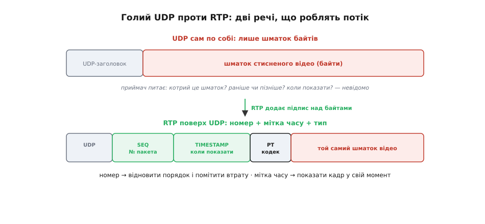
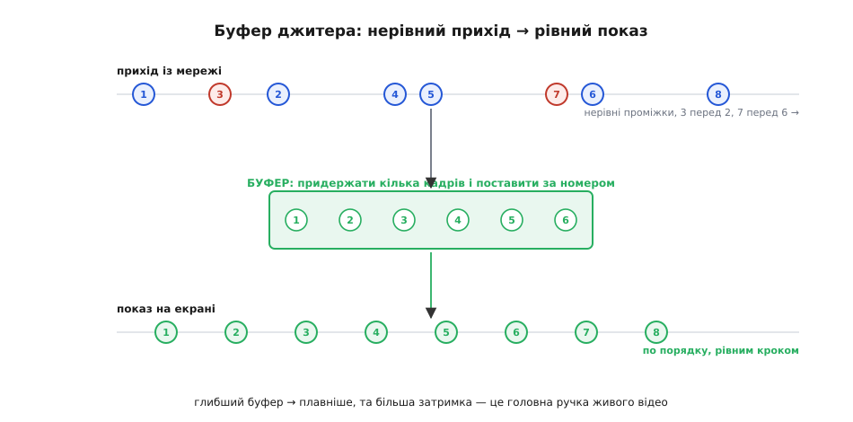
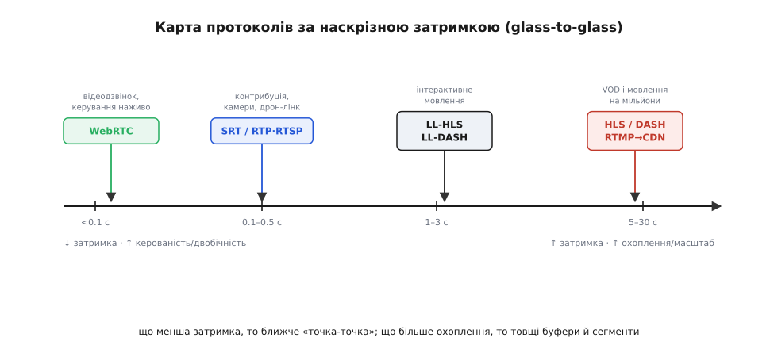

# Протоколи відеострімінгу

До цього кроку відео в нас уже майже готове до польоту. Картинку з камери ми навчилися **стискати**, обравши між MJPEG і H.264; ми бачили **дві фізичні дороги** з борту на землю — аналогову хвилю й цифрову мережу; і ми вже знаємо, що для живого відео транспортом служить [UDP, а не TCP](topic:com-transport/tcp-vs-udp), бо перепитувати спізнілий кадр немає сенсу. Здавалося б, лишилося дрібне: ріж стиснений бітпотік на UDP-датаграми й шквар у радіо.

Спробуймо — і одразу впораємось у стіну. Уявімо, що ми буквально так і зробили: накраяли потік на пакети по 1200 байтів і висипали в канал. На тому кінці приймач ловить **купу датаграм** — і не може з нею зробити нічого осмисленого. Він не знає, **котрий шматок раніше, а котрий пізніше**: UDP порядку не тримає, тож пакет №7 цілком може прийти перед №6. Він не знає, **де закінчується один кадр і починається наступний**. Він не знає, **коли саме** показати цей шматок на екрані, щоб відео йшло рівно, а не сіпалося. І коли пакет **загубиться** (а він загубиться — це радіо), приймач навіть не помітить діри: просто склеїть сусідів і покаже сміття.

Ось де народжується **протокол відеострімінгу** (англ. *streaming* — «течія, безперервний потік»). Сам по собі UDP — це лише дешевий конверт «доставити байти, як вийде». Щоб із потоку конвертів зібрати **живе відео**, над UDP треба покласти тонкий шар домовленостей: як **нумерувати**, як **позначати час**, як **домовитися про сеанс**, як **дати зворотний зв'язок**. Це і є те, що ми розбираємо. Логіка тут та сама, що ми вже бачили [в MAVLink](root:embedded/mavlink-from-ground): складність протоколу рівно така, якою її робить **ненадійність каналу**, — не більша й не менша. Тільки там ішлося про команди й телеметрію, а тут — про безперервний **потік кадрів реального часу**, і це ставить свої, особливі вимоги.

### Дві речі, яких бракує: номер і час

Почнімо з найголовнішого — з того, чого UDP не дає, а потоку конче треба. Виявляється, речей рівно **дві**, і вони напрочуд прості.

Перша — **номер пакета**. Якщо кожен шматок несе свій порядковий номер (англ. *sequence number*), приймач одразу вміє три речі, недосяжні раніше: **відновити порядок** (поставити №6 перед №7, навіть якщо вони прийшли навпаки), **помітити втрату** (у нумерації 5, 6, 8 зяє діра — пакет 7 загубився) і зрозуміти, **скільки** загубилося. Номер — це той самий лічильник `SEQ`, що ми вже зустрічали в заголовку пакетів: він не вимагає повтору, він лише **показує** правду про канал.

Друга — **мітка часу** (англ. *timestamp*). Відео — це не просто послідовність кадрів, це послідовність кадрів **у часі**: кадр №2 треба показати рівно через 1/30 секунди після №1, інакше рух смикатиметься. Якби приймач показував кадри тоді, коли вони **прийшли**, відео сіпалося б у такт нерівностям мережі. Тому кожен шматок несе мітку «до якого моменту відеопотоку я належу», і приймач показує його **за цією міткою**, а не за миттю прибуття. Час відв'язується від мережі — і це рятівна ідея, до якої ми зараз повернемось.

Саме ці дві речі — номер і мітку часу — і додає **RTP** (англ. *Real-time Transport Protocol* — «протокол передачі реального часу»), стандартний тонкий заголовок, що лягає **між UDP і шматком відео**. Описали його [Генрі Шульцрінне (Henning Schulzrinne), Стівен Каснер, Рон Фредерік і Ван Якобсон у RFC 3550](root:embedded/video-streaming-protocols/hist-rtp.md) (редакція 2003 року, перша версія — ще 1996-го), і відтоді саме RTP несе майже все живе аудіо й відео в інтернеті: відеодзвінки, IP-камери, телебачення по мережі.


*Голий UDP-датаграм — це лише конверт зі шматком стисненого відео: приймач не знає ні порядку, ні часу, ні факту втрати. RTP кладе над байтами тонкий підпис: SEQ (номер пакета — відновити порядок і помітити діру), TIMESTAMP (мітка часу — коли показати кадр) і PT (тип корисного навантаження — яким кодеком стиснуто). Ці кілька байтів і перетворюють розсип датаграм на впорядкований потік реального часу.*

Заголовок RTP несе ще третє корисне поле — **тип навантаження** (англ. *payload type*, PT): коротке число, що каже «це H.264», «це Opus», «це JPEG», щоб приймач знав, **яким декодером** розпаковувати байти. Але серце все ж у перших двох полях. Номер дає **порядок і чесність про втрати**, мітка часу дає **рівний показ**. Усе інше в стрімінгу будується довкола цих двох ідей.

> 🔧 **Навіщо це.** Коли «відео розсипається на квадрати» або «йде ривками», перше, на що дивляться інженери, — це **номери й мітки часу RTP** у дампі (наприклад, у Wireshark). Розрив у номерах — губляться пакети (шукай причину в каналі: слабкий сигнал, перевантаження). Номери цілі, але **мітки часу стрибають** — біда з боку джерела: камера віддає кадри нерівно, кодер захлинається. Уміючи читати ці два поля, ти відрізняєш проблему **каналу** від проблеми **джерела** за десять секунд, а не методом тику.

### Буфер джитера: серце живого відео

Ми сказали, що приймач показує кадри **за мітками часу**, а не за миттю прибуття. Тепер придивімося, **як** він це робить, — бо тут лежить найважливіша й найтонша ідея всього живого відео.

Згадаймо, чому прибуття нерівне. Пакети летять мережею, де кожен проходить свій шлях через черги маршрутизаторів, повітря, перевантаження; тому проміжки між їхнім приходом **плавають**: то два пакети майже разом, то пауза, то знову залп. Цю мінливість затримки звуть [джитером](topic:com-transport/jitter) (англ. *jitter* — «тремтіння»), і вона — головний ворог рівного показу. Якщо плеєр віддаватиме кадр на екран щойно той прийде, відео тремтітиме рівно так, як тремтить мережа.

Рятунок — **буфер джитера** (англ. *jitter buffer*, інколи *de-jitter buffer*): невелика черга **перед** декодером, куди пакети спершу складаються, а вже звідти забираються **рівним кроком**. Буфер робить дві речі заразом. По-перше, **пересортовує**: користуючись номерами RTP, він ставить пакети по порядку, навіть якщо вони прийшли врозкид. По-друге, **придержує**: він навмисне чекає, накопичивши кадрів на кілька десятків мілісекунд наперед, щоб у момент, коли плеєру треба наступний кадр, той **уже лежав** напоготові — навіть якщо мережа цієї миті дала паузу.


*Зверху — прихід із мережі: нерівні проміжки, пакет 3 випередив 2, 7 випередив 6. Посередині — буфер джитера: він придержує кілька кадрів і викладає їх за номером. Знизу — показ на екрані: рівним кроком, по порядку. Глибина буфера — головна ручка живого відео: глибше згладжує сильніший джитер, але прямо додає затримки.*

І ось де ховається **головний компроміс усього живого стрімінгу**, заради якого варто було сюди дійти. Глибина буфера — це пряма **ручка обміну між плавністю й затримкою**. Зробиш буфер **глибшим** (придержуй більше кадрів) — переживеш сильніший джитер і довші паузи мережі, картинка буде гладенька; але кожен кадр тепер чекає в черзі довше, і **затримка зростає**. Зробиш буфер **мілкішим** — затримка впаде, відео стане «живішим», ближчим до реального часу; але найменша нерівність мережі тепер дасть **затинку** (плеєру нема чого показати, бо буфер порожній). Третього не дано: ти або платиш затримкою за плавність, або плавністю за миттєвість.

Звідси й уся розбіжність між сферами застосування, до якої ми прийдемо наприкінці. Для **відеодзвінка чи керування дроном** затримка смертельна, тож буфер тримають крихітним (десятки мілісекунд) і миряться з рідкими затинками. Для **перегляду фільму** затинка нестерпна, а пів секунди запізнення ніхто не помітить, тож буфер роблять величезним (секунди). Один і той самий механізм, та сама ручка — лише крутять її в протилежні боки залежно від того, що дорожче.

> 🔧 **Навіщо це.** «Збільшити буфер, щоб не лагало» — найперша й найчастіша порада, і вона працює, та має свою тіньову ціну. На дроні чи в грі великий буфер означає, що ти бачиш **минуле**: апарат уже звернув, а в окулярах він ще летить прямо — і ти керуєш наосліп. Тому в FPV буфер тиснуть до мінімуму свідомо, приймаючи зрідка «квадратики» як меншу біду, ніж запізнення. А на трансляції концерту, навпаки, кілька секунд буфера — норма й благо. Налаштовуючи лінк, завжди питай себе **не «як менше лагів»**, а «**чим я готовий заплатити** — затримкою чи затинками».

### Хто керує сеансом: окремий канал команд

RTP несе самі дані — потік пронумерованих кадрів із мітками часу. Але хтось має цим потоком **керувати**: сказати джерелу «почни лити», «постав на паузу», «перемотай», «зупини», ще й спершу домовитися, **яким кодеком** і на **яку адресу** слати. Класичне рішення — винести керування в **окремий канал**, відрубаний від самого відео.

Цей канал команд і є **RTSP** (англ. *Real-Time Streaming Protocol* — «протокол потокового мовлення реального часу», [RFC 2326, 1998 рік](root:embedded/video-streaming-protocols/hist-rtsp.md)). Назвою він схожий на RTP, але роль інша: RTSP сам відео **не несе** — він ним **командує**. Його часто звуть «мережевим пультом для відеопотоку», і це точний образ: натискаєш кнопку на пульті — телевізор робить, але сам сигнал іде іншим дротом.

Розгляньмо типову IP-камеру — найпоширеніший випадок RTSP. Плеєр спершу веде з камерою короткий діалог простими текстовими командами, дуже схожими на HTTP:

```
плеєр → камера   DESCRIBE   «опиши, що в тебе є» (кодек, роздільність)
камера → плеєр   ← опис потоку (H.264, 1080p, такі-то параметри)
плеєр → камера   SETUP      «готуймо сеанс; відео шли RTP на цей порт»
плеєр → камера   PLAY       «лий»
камера → плеєр   ═══ RTP-потік відео ════════════════►  (окремим каналом)
плеєр → камера   TEARDOWN   «досить, закривай сеанс»
```

Придивімося, **чому** керування варто було відділити від даних. Команди (`PLAY`, `PAUSE`) — рідкі, разові й **критичні**: їх не можна губити, як ми вже знаємо з історії [команд MAVLink](root:embedded/mavlink-from-ground). Тому канал керування RTSP роблять **надійним** (часто поверх TCP): команда дійде гарантовано або ти дізнаєшся про збій. А самé відео — навпаки, безперервне й **необов'язкове до доставки** в кожному пакеті (загубився кадр — наступний уже летить), тому воно йде швидким **RTP по UDP**. Два потоки з протилежними вимогами — надійні рідкі команди й швидкі часті дані — природно розкладаються на **два окремі канали**, кожен зі своїм транспортом. Це той самий поділ, що ми бачили на борту: надійні команди з підтвердженням окремо, потокова телеметрія «вистрелив і забув» окремо.

Лишається питання зворотного зв'язку: добре, відео ллється — а **як воно долітає**? Чи багато губиться, чи сильний джитер? Для цього в парі з RTP завжди йде маленький супутник — **RTCP** (англ. *RTP Control Protocol*). Він не несе відео; він раз на кілька секунд переносить **звіти про якість**: приймач каже джерелу «я втратив стільки-то відсотків пакетів, джитер такий-то», а джерело з цього розуміє стан каналу. Навіщо? Бо знаючи, що канал псується, розумне джерело може **знизити бітрейт** — стиснути картинку сильніше, щоб вона пролізла крізь вужчий канал, нехай і гіршою. Ось ця петля «приймач поскаржився → джерело пригасило якість» — і є те, що тримає відео **живим на поганому каналі** замість того, щоб воно зовсім розсипалося. Її варто розуміти окремо: [як зворотний зв'язок керує бітрейтом](root:embedded/video-streaming-protocols/proj-adaptive-bitrate.md).

### Інтерактивний край: коли мілісекунди вирішують

Тепер, маючи в руках RTP, буфер і керування, розкладімо реальні протоколи **за єдиною віссю — наскрізною затримкою**. Бо вибір протоколу відеострімінгу — це насправді вибір **місця на цій осі**: що ти готовий віддати за миттєвість.

На найгострішому кінці — **двобічне реальний час**: відеодзвінок, хмарні ігри, керування апаратом по відео. Тут затримку рахують **наскрізно** — від світла на сенсорі до пікселя на екрані (англ. *glass-to-glass*, «від скла до скла»), і вона мусить бути в межах однієї-двох **десятих** секунди, інакше розмова збивається, а керування стає некерованим. Жодних товстих буферів, жодного перепитування.

Король цього кінця — **WebRTC** (англ. *Web Real-Time Communication*). Це не один протокол, а цілий стек, який [Google відкрив 2011 року](root:embedded/video-streaming-protocols/hist-webrtc.md), щоб відеодзвінки працювали **прямо в браузері без жодних плагінів**. Усередині WebRTC — той самий знайомий RTP для медіа, але обкладений усім, чого бракує для прямого зв'язку між двома пристроями: шифруванням (обов'язковим), вибором кодека на льоту й, найважче, **пробиванням крізь NAT**. Останнє варте слова окремо: два домашні пристрої сидять кожен за своїм роутером і не мають публічної адреси, тож просто так з'єднатися не можуть — і WebRTC застосовує хитру техніку, щоб усе ж прокласти між ними прямий тунель. Це окрема велика тема — [як пробити прямий зв'язок крізь NAT](topic:com-transport/nat-traversal).

Поряд із WebRTC, але в іншій ніші, стоїть **SRT** (англ. *Secure Reliable Transport* — «захищений надійний транспорт»). Його [створила компанія Haivision 2013 року й відкрила 2017-го](root:embedded/video-streaming-protocols/hist-srt.md) для задачі, де WebRTC незручний: **надіслати якісний відеопотік через непевний публічний інтернет** (скажімо, з камери репортера в студію за тисячу кілометрів). SRT теж їде по UDP, але робить дивовижну річ: він **обмежено перепитує** загублені пакети — але тільки доти, доки повтор **встигає** до моменту показу. Згадаймо: ми ж казали, що перепитувати живе відео марно? Так — якщо перепит спізнюється. SRT же тримає буфер на кількасот мілісекунд і встигає **тихо доставити повтор** у це вікно, тож глядач втрати не бачить узагалі. Це елегантний компроміс: не нульова затримка WebRTC, а трохи більша — зате потік виходить **бездоганним** навіть на дірявому інтернеті. Для дрона, що шле HD-відео через мобільну мережу, SRT часто — найкращий вибір.

> 🔧 **Навіщо це.** На дроні з цифровим відеолінком вибір між «майже нульовою затримкою з рідкими квадратиками» і «чистою картинкою ціною зайвих 200–300 мс» — це по суті вибір **WebRTC-подібного режиму проти SRT-подібного**. Для гонок і акробатики бери перше: пілотові потрібні руки, а не краса. Для зйомки, інспекції, польоту за відео на дальній дистанції бери друге: тут краще побачити все чітко з невеликим запізненням, ніж смикану картинку «прямо зараз». Це знову та сама ручка буфера, тільки в обгортці готових протоколів.

### Масовий край: відео через HTTP для мільйонів

А тепер стрибнімо на **протилежний кінець** осі — і побачимо геть інший світ, збудований на протилежному компромісі. Уявімо не дзвінок двох людей, а **трансляцію на мільйон глядачів** одночасно: спортивний матч, концерт. Тут затримка в кілька секунд — **дрібниця** (ніхто не зрівнює свій екран із сусідовим), зате критичні дві інші речі: дотягтися до **мільйонів різних пристроїв** із різною швидкістю інтернету — і зробити це **дешево**.

RTP тут не годиться: мільйон окремих RTP-сеансів не потягне жоден сервер, а ще багато глядачів сидять за корпоративними мережами, де все, крім звичайного веб-трафіку, заблоковано. Тож масове відео пішло **зовсім іншим шляхом** — через той самий **HTTP**, яким качаються веб-сторінки. Ідея проста до геніальності: розріж відео на **короткі файли-сегменти** по кілька секунд кожен (англ. *segment*, «відрізок»), склади **список цих файлів** (англ. *playlist* / *manifest*) — і нехай плеєр просто **завантажує сегмент за сегментом** звичайними HTTP-запитами, як картинки.

Що це дає? Усе, чого бракувало масовому мовленню. По-перше, сегменти — це **звичайні файли**, тож їх можна роздавати з [мережі доставки вмісту](topic:com-transport/ip-routing) (CDN — тисячі серверів по світу, що вже й так роздають веб), і той самий матч тягнуть мільйони, не навантажуючи джерело. По-друге, HTTP **проходить будь-де**, бо його не блокує жоден файрвол. По-третє — і це найкрасивіше — **адаптивний бітрейт** (англ. *adaptive bitrate*, ABR): джерело готує кожен сегмент у **кількох якостях** (1080p, 720p, 480p), а плеєр **сам** перед кожним сегментом вирішує, яку якість тягти, дивлячись на свою швидкість. Інтернет просів — наступний сегмент береться в нижчій якості, відео не стає, лише трохи мутніє; розігнався — плеєр піднімає якість назад. Ось чому Netflix чи YouTube то різкішають, то мутнішають, але майже ніколи не «крутять колесо».

Так працюють два майже однакові за духом стандарти: **HLS** (англ. *HTTP Live Streaming*, [що Apple випустила 2009 року](root:embedded/video-streaming-protocols/hist-hls-dash.md) і вшила в кожен iPhone) і **MPEG-DASH** (англ. *Dynamic Adaptive Streaming over HTTP* — «динамічне адаптивне мовлення по HTTP», міжнародний стандарт ISO/IEC 23009-1 від 2012 року). Обидва роблять те саме — сегменти плюс список плюс адаптивний бітрейт, — лише в різних обгортках. Ціна за всю цю масовість і дешевизну — **затримка**: поки набереться сегмент, поки він завантажиться, поки заповниться буфер плеєра, минає легко **5–30 секунд**. Для матчу це терпимо; для відеодзвінка — неможливо. (Існують «низькозатримкові» різновиди, LL-HLS і LL-DASH, що тиснуть це до 2–3 секунд дрібнішими сегментами, але до десятих секунди WebRTC їм не дістати.)

Окремо варто назвати ветерана, що досі живий на **вході** в цю систему, — **RTMP** (англ. *Real-Time Messaging Protocol*). Його колись створили в **Macromedia** (згодом викупленій Adobe) для Flash-плеєра. Сам Flash давно мертвий, але RTMP несподівано вижив у вузькій ролі: ним зручно **заливати** живий потік від однієї камери чи стрімера **на сервер** (затримка кілька секунд, надійно поверх TCP), а вже сервер перекодовує його в HLS/DASH і роздає мільйонам. Тобто RTMP — це часто **перша ланка** ланцюга, а HLS/DASH — остання.

### Уся карта на одній осі

Складімо тепер усе докупи — і вийде на диво струнка картина. Усі ці протоколи — RTP, WebRTC, SRT, HLS, DASH, RTMP — не конкурують абстрактно «хто кращий». Кожен сидить на **своєму місці однієї осі — наскрізної затримки**, бо кожен зробив свій вибір у тому самому компромісі, що ми розкрили на буфері джитера: **миттєвість проти охоплення й стійкості**.


*Карта протоколів за наскрізною затримкою (glass-to-glass). Лівий край — інтерактивне реальний час (WebRTC: дзвінки, керування): десяті частки секунди, точка-точка, крихітний буфер. Далі — професійна контрибуція й камери (SRT, RTP/RTSP): затримка трохи більша, зате потік чистий навіть на поганому каналі. Правіше — сегментне мовлення по HTTP (LL-HLS/DASH, тоді звичайні HLS/DASH, з RTMP на вході в CDN): від кількох до десятків секунд, зате через будь-який інтернет на мільйони пристроїв. Праворуч ростуть затримка, буфери й розмір сегментів — і разом із ними охоплення та дешевизна.*

Тримаючи цю вісь у голові, ти обираєш протокол не навмання, а одним питанням: **скільки затримки терпить твоя задача?** Двобічна розмова чи керування апаратом, де кожна десята секунди на вагу, — лівий край, WebRTC або SRT, крихітний буфер. Якісний потік з однієї точки в іншу через лихий інтернет — SRT, що тихо латає втрати у вузьке вікно. Трансляція на масу глядачів, де секунди байдужі, а важать охоплення й ціна, — правий край, HLS чи DASH через CDN, з RTMP на заливці. А під капотом майже скрізь — або **RTP** з його номером і міткою часу, або **сегменти-файли** зі списком; і скрізь, без винятку, працює **буфер**, чию глибину ти крутиш у бік миттєвості чи в бік плавності.

Усе живе відео, від окулярів гонщика до екрана з фільмом, тримається на цій одній думці: канал ненадійний і нерівний, а глядач хоче рівної картинки **вчасно** — і весь протокол є рівно стільки складним, скільки коштує цю суперечність розв'язати для **твоєї** затримки.
