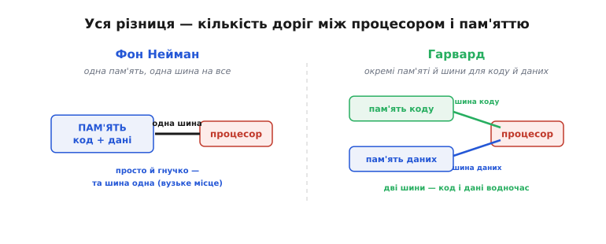
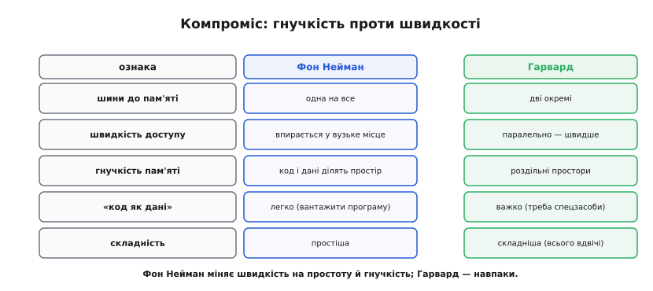
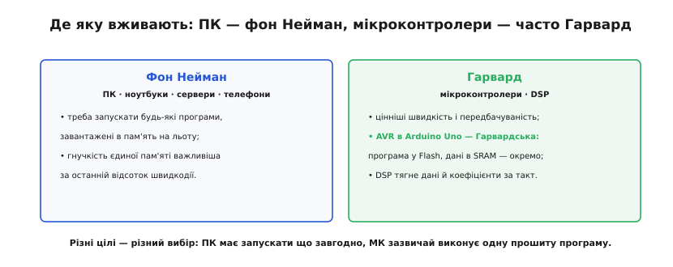
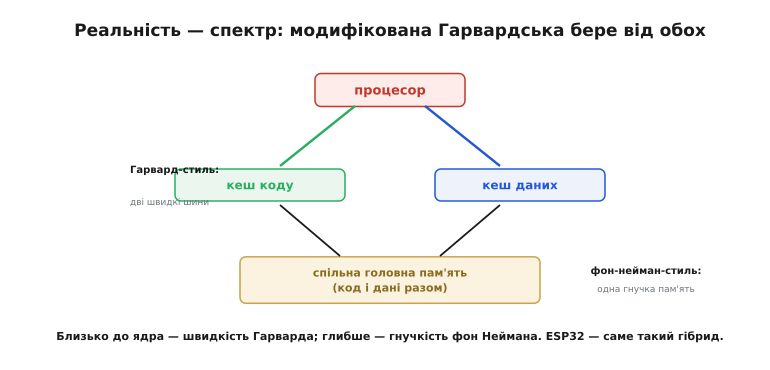

# Фон Нейман і Гарвард

Класичний процесор тримає «вузьке місце фон Неймана»: код і дані живуть в **одній** пам'яті й ходять до процесора **однією** шиною, тож суперничають за неї. Поставмо пряме питання: а що, як дати коду й даним **окремі** пам'яті й окремі шини? Тоді процесор міг би брати команду й дані **водночас**, без суперництва. Це і є **Гарвардська** архітектура (назва — від машини Harvard Mark I, що тримала програму й дані нарізно) — альтернатива фон-нейманівській. Вибір між ними — фундаментальна розвилка в будові будь-якого процесора: тут і дві архітектури поряд, і що кожна виграє й програє, і де яку вживають (зокрема чому Arduino — Гарвардська), і чому більшість сучасних чипів насправді десь **посередині**.

### Дві архітектури поряд

Уся різниця між ними зводиться до однієї речі — скільки «доріг» між процесором і пам'яттю.


*Фон-нейманівська машина: одна пам'ять тримає код і дані разом, і до процесора веде одна спільна шина — просто й гнучко, та шина одна на все. Гарвардська: окремі пам'яті для коду й для даних, кожна зі своєю шиною, тож процесор має дві незалежні дороги.*

Ось і весь поділ: **одна** дорога чи **дві**. Фон-нейманівська машина елегантно проста — все в одній пам'яті. Гарвардська ставить дві окремі пам'яті з двома шинами. Здавалося б, дрібниця в кількості дротів — та наслідки великі, бо саме ця кількість доріг визначає, чи можуть код і дані рухатися **одночасно**.

### Що дають дві шини

Подивімося, що конкретно купує друга шина.


*У фон Неймана одна шина, тож вибірка команди й читання даних конфліктують: спершу один доступ, потім другий — дані чекають на команду. У Гарварда дві шини, тож вибірку команди й читання даних роблять за один такт паралельно — ніхто нікого не чекає.*

Ось у чому виграш Гарварда. У [конвеєрі](topic:hw-arch/pipeline) одна команда **виконується** (читає чи пише дані), поки наступну **вибирають** з пам'яті. На фон-нейманівській машині ці два звертання до пам'яті б'ються за єдину шину — і конвеєр спотикається. На Гарвардській вони йдуть по різних шинах паралельно — конвеєр тече гладко. Та сама перевага безцінна для **обробки сигналів** (DSP, *digital signal processing*), де щотакту треба тягти і дані, і коефіцієнти фільтра одночасно — два потоки, дві шини. Розділивши дороги, Гарвард прибирає саму причину затору.

> 🔧 **Навіщо це.** Коли скромний мікроконтролер встигає за такт і виконати команду, і звернутися до даних, — за цим часто стоїть саме Гарвардський паралельний доступ. Розуміючи, що команди й дані ходять різними шинами, ви точніше оцінюєте, скільки роботи реально вкладається в один такт, — а це основа будь-якого розрахунку часу в керуванні чи обробці сигналів.

### Компроміс: гнучкість проти швидкості

Якщо Гарвард швидший, чому не всі машини такі? Бо за швидкість він платить **гнучкістю**.


*Фон Нейман: одна шина (вузьке місце), зате код і дані вільно ділять спільний простір пам'яті, легко завантажити будь-яку програму як дані, і вся конструкція простіша. Гарвард: дві шини (паралельний, швидший доступ), зате роздільні простори, «код як дані» дається важко, а всього вдвічі більше.*

Це класичний інженерний обмін, без «переможця». Фон-нейманівська **гнучкість** — пряме породження ідеї збереженої програми: якщо код і дані в одній пам'яті, машина може завантажити нову програму просто **як дані** в ту саму пам'ять і запустити її. Саме це робить персональний комп'ютер таким універсальним — він щодня вантажить і запускає тисячі різних програм. Гарвардська машина з її роздільними просторами це робить **важко**: пам'ять коду — то пам'ять коду, і запхати туди свіжозавантажену програму непросто. Тож фон Нейман міняє швидкість на простоту й гнучкість, а Гарвард — навпаки.

Платня за дві шини теж конкретна. Дві пам'яті — це два набори дротів, два контролери, дві наперед визначені межі: скільки відвести під код і скільки під дані, доводиться вирішувати **заздалегідь**, і вільно «позичити» місце з одного простору в інший уже не вийде. У фон-нейманівській машині такої межі немає — уся пам'ять спільна, і програма бере звідти стільки під код і стільки під дані, скільки треба зараз. Цікаво, що та сама роздільність, яка коштує гнучкості, інколи обертається й **перевагою захисту**: коли дані фізично не лежать у просторі команд, випадково (чи зловмисно) «виконати дані як код» набагато важче — класичні атаки на переповнення цим і живляться.

### Де яку вживають

З цього компромісу прямо випливає, хто яку обирає.


*Фон Нейман — у ПК, ноутбуках, серверах, телефонах: там треба запускати будь-які програми, завантажені на льоту, тож гнучкість єдиної пам'яті важливіша за останній відсоток швидкодії. Гарвард — у мікроконтролерах і DSP: там цінніші швидкість і передбачуваність. 8-бітний AVR в Arduino Uno — Гарвардська машина: програма у Flash, дані в SRAM, окремо, з окремими шинами.*

Звідси й відповідь: **AVR в Arduino — Гарвардська** машина. Чому саме так: мікроконтролеру важлива швидка, передбачувана робота в реальному часі (керувати мотором, читати давач точно вчасно), а не здатність вантажити довільні програми — він зазвичай виконує **одну** прошиту програму. Тож роздільні код і дані йому пасують. У процесорах обробки сигналів цей мотив ще гостріший: ядро DSP за **один** такт має взяти команду, прочитати відлік сигналу й дістати коефіцієнт фільтра — три звертання до пам'яті, які на одній шині ніяк не вмістити в такт, а на кількох роздільних — цілком. А персональний комп'ютер — фон-нейманівський, бо його суть — запускати що завгодно. Те, що програма мікроконтролера лежить саме у Flash, а дані в SRAM, — це питання [типів пам'яті](topic:hw-arch/flash-vs-ram); тут важливо лише, що вони **окремі**. Різні цілі — різний вибір архітектури.

Роздільні простори — не абстракція: вони видні прямо в коді. На AVR пам'ять програм і пам'ять даних адресуються **нарізно**, тож великий сталий масив (скажімо, таблицю синуса чи довгий текст) кладуть у Flash, щоб не з'їдати дефіцитну SRAM, — і читають його **окремою** командою, бо звичайний покажчик у Гарвардській машині дивиться в простір **даних**, а не коду.

**Умова:** на Arduino Uno (AVR) винести таблицю в програмну пам'ять і прочитати її елемент.

```c
#include <avr/pgmspace.h>

// Таблиця живе у Flash (простір КОДУ), а не в SRAM (простір ДАНИХ):
const uint8_t sine[4] PROGMEM = { 128, 218, 128, 38 };

uint8_t at(uint8_t i) {
    // Звичайне sine[i] читало б простір ДАНИХ за тією ж адресою — там сміття.
    // pgm_read_byte вмикає окрему «шину коду» й бере байт із Flash:
    return pgm_read_byte(&sine[i]);   // i=1 → 218
}
```

Тут `PROGMEM` і `pgm_read_byte` — це і є Гарвардська архітектура, що проступила в мові: число 218 лежить у пам'яті коду, і дістати його можна лише командою, яка свідомо йде **туди**, а не в пам'ять даних. На фон-нейманівській машині такого розділення немає — там той самий покажчик дотягнеться куди завгодно.

### Реальність: модифікована Гарвардська

Та не варто думати, що світ чітко поділений на дві архітектури. Насправді це **спектр**, і більшість сучасних чипів живуть посередині.


*Чисті форми рідкісні; типовий сучасний чип — модифікована Гарвардська: близько до ядра окремі швидкі шляхи для коду й даних (Гарвард-стиль, паралельний доступ), а під ними спільна головна пам'ять (фон-нейман-стиль, гнучкість). Так чип дістає і швидкість Гарварда, і гнучкість фон Неймана.*

Це мудрий компроміс, що бере найкраще від обох. Там, де швидкість критична (близько до ядра), роблять роздільні шляхи для коду й даних — паралельний доступ; а глибше, де важить гнучкість і простота, лишають спільну пам'ять. ESP32 — саме такий гібрид, [і це видно в його шинах](root:embedded/von-neumann-harvard/comp-esp32-buses.md). Навіть «чисто Гарвардський» AVR має шпарину — ту саму команду читати пам'ять програм як дані (бо сталі константи зручно тримати поруч із кодом). Тож «фон Нейман проти Гарварда» — не жорстке «або-або», а **палітра**, з якої інженер змішує потрібну пропорцію під свою задачу. Знаючи, де на цій палітрі ваш процесор, ви краще розумієте і його сильні сторони, і його обмеження.

Звідки взялася сама назва «Гарвардська» — і чому вона молодша за машину, що дала їй ім'я, — [в історичній вставці](root:embedded/von-neumann-harvard/hist-harvard-architecture.md).
