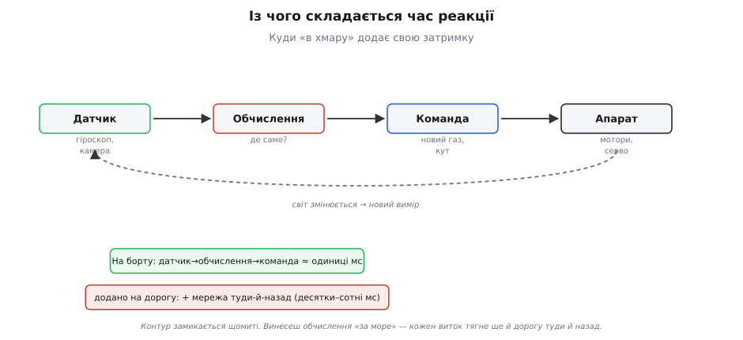
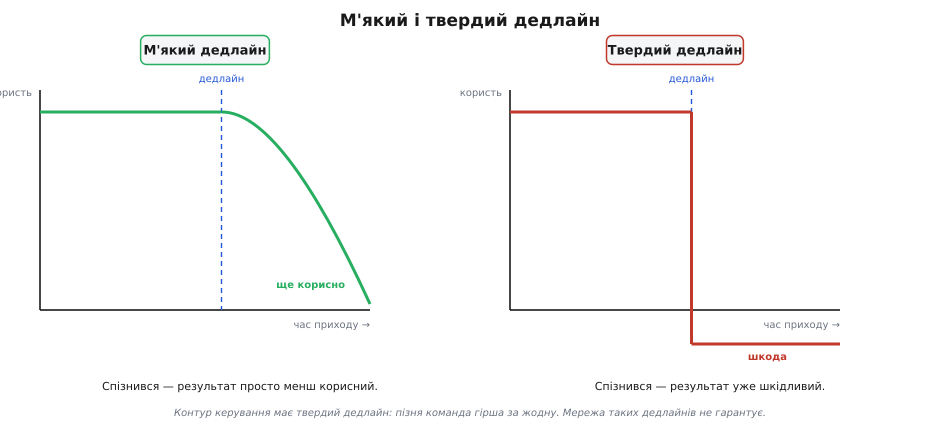
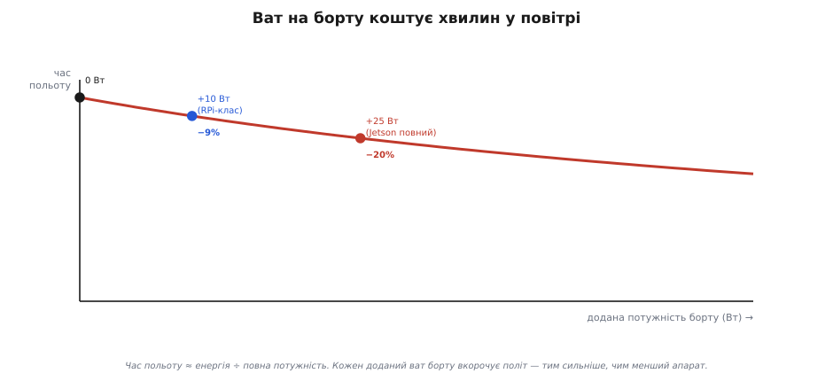
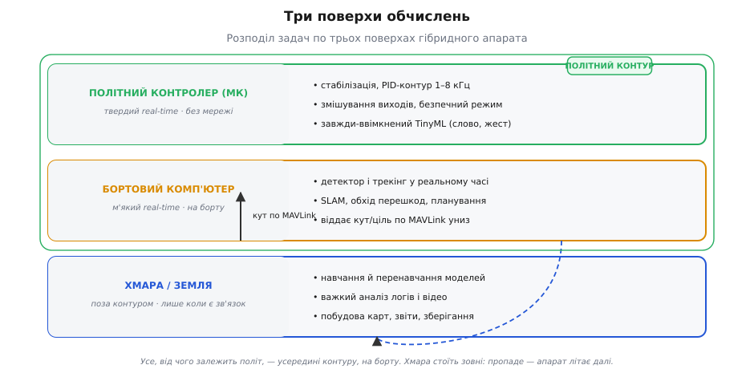

# Де рахувати: механіка розподілу, дедлайни й найгірший випадок

У [базовому кроці](root:embedded/where-to-compute) ми вже поставили карту: обчислення живуть у трьох місцях — на **польотному контролері** (МК), на **бортовому комп'ютері** й у **хмарі**, — і ми знаємо золоте правило: критичне за часом рахуємо на борту, важке й не термінове можна віддати нагору. Цього досить, щоб не зробити грубої помилки. Але щоб *проєктувати* систему, а не лише не завалити її, треба розібрати, **чому** правило саме таке — і де воно ламається.

Тут ми копаємо глибше. Спершу розкладемо «затримку» на складники й побачимо, звідки береться та цифра «сотні мілісекунд». Тоді введемо різницю між **м'яким і твердим дедлайном** — це серце всієї теми, бо саме вона перетворює «повільно» на «розіб'ється». Далі — арифметика бюджету: скільки хвилин польоту коштує кожен доданий ват, і як звідси випадає **межа TinyML**. Потім розберемо **інтерфейс** між поверхами (MAVLink, спільна пам'ять, черги) — бо гібрид тримається на тому, як шари говорять один з одним. І нарешті — метод **найгіршого випадку**: перевірка, яку кожен інженер має прогнати перед першим польотом.

Нитку веду природно: кожен наступний шматок спирається на попередній, як у справжньому проєктуванні.

## Затримка — це не одне число, а ланцюг

Коли в базовому кроці ми казали «хмара додає сотні мілісекунд», це було чесне спрощення. Насправді затримка (англ. *latency* — «прихованість», час від причини до наслідку) — це не властивість каналу, а **сума** часів на всьому шляху від зміни у світі до відповіді апарата. Розкладімо цей шлях, бо саме зі складників видно, де саме обчислення додають, а де віднімають.

Уяви замкнене коло, яке апарат крутить безперестанку: **датчик** ловить стан світу (гіроскоп — кутову швидкість, камера — кадр) → **обчислення** перетворюють вимір на рішення (наскільки крутнуло, куди сунути газ) → **команда** йде у виконавці → **виконавець** (мотор, серворульна машинка) міняє світ → і датчик ловить уже новий стан. Це і є **контур керування** (англ. *control loop*). Він не спиняється ні на мить.


*Час реакції — сума ланок контуру, а не властивість каналу. Датчик, обчислення, команда й виконавець дають одиниці мілісекунд, поки все на борту. Винесеш обчислення в мережу — між «датчиком» і «командою» вклинюється дорога туди й назад, і вона додається до **кожного** витка.*

Розкладімо один виток на складники часу, бо в них уся суть:

```
T_витка = t_датчик + t_передача_вниз + t_обчислення + t_передача_вгору + t_виконавець

на борту:   t_передача_* ≈ десятки мікросекунд (шина SPI/I²C/UART)
через хмару: t_передача_* = t_радіо + t_мережа + t_черга + t_радіо  (десятки–сотні мс)
```

Головне видно одразу: **на борту** дві ланки передачі — це біг по мідній доріжці чи короткій шині, десятки мікросекунд, круглий нуль на тлі решти. Винесеш обчислення в хмару — і ці дві ланки роздуваються до **радіоканалу плюс мережі плюс черг у чужих маршрутизаторах**, туди й назад. От звідки «сотні мілісекунд»: не з обчислень (сервер якраз рахує швидше за борт), а з **дороги до нього й назад**.

Щоб цифри були не з голови, зберімо реальні порядки. Це підтверджені виміри, не оцінки:

```
канал                 туди-й-назад (RTT)     стабільність
провід/шина на борту   0.02–0.2 мс            ідеальна
Wi-Fi поруч            2–20 мс                добра, та з викидами
4G/LTE                 20–50 мс               плаває (джитер)
Starlink (LEO)         25–60 мс               плаває, бувають провали
супутник GEO           500–600 мс             стабільно велика
Земля ↔ Марс           3–22 хв (в один бік)   фіксовано фізикою
```

Числа для 4G (20–50 мс), GEO (~500–600 мс), LEO Starlink (25–60 мс) і Марса (3 хв 13 с … 22 хв 16 с в один бік) — з відкритих вимірів і небесної механіки; статус — **усталений факт**, легко перевірити. Марсіанський рядок ми в базовому кроці вже зустрічали як історію; тут він стоїть у таблиці як **межовий випадок** тієї самої фізики — коли дорога така довга, що керувати з-за неї неможливо в принципі. Докладніше цю історію — чому світло *забороняє* пульт і як марсохід через це змушений думати сам — ми розгортаємо в окремій вставці [«Швидкість світла проти джойстика»](root:embedded/where-to-compute/hist-mars-autonomy.md); тут досить тримати в голові її урок: контур, від якого залежить апарат, замикається на борту.

Але навіть маленьке середнє RTT ще не рятує. Дивись на колонку «стабільність»: 4G має *середні* 30 мс, але окремий пакет може прийти через 300 мс або **не прийти зовсім** — це називають джитером (англ. *jitter* — «тремтіння») і втратами. А контур керування, як ми зараз побачимо, живе не середнім, а **найгіршим** випадком.

> 🔧 **Навіщо це.** Проєктуючи розподіл, рахуй затримку **поланково**, а не одним числом. Спитай для кожної задачі: скільки мілісекунд вона *дозволяє* на весь виток? Виток стабілізації дозволяє одиниці мс — жодна мережа туди не влазить. Виток «наведи гімбал на людину» дозволяє сотні мс — сюди мережа *теоретично* влазить, але тільки якщо ти готовий до її викидів. Розклад по ланках одразу показує, що можна виносити, а що ні.

## М'який і твердий дедлайн — де «повільно» стає «смертельно»

Тепер — головне поняття всієї теми, якого в базовому кроці ми торкнулися лише словом «критично за часом». Розкриймо його точно.

Кожна обчислювальна задача має **дедлайн** (англ. *deadline* — «крайній строк»): момент, до якого результат мусить бути готовий, щоб мати сенс. Але дедлайни бувають двох геть різних порід, і плутати їх — найдорожча помилка в цій темі.

**М'який дедлайн** (soft): спізнився — результат просто **менш корисний**, але шкоди нема. Відеокадр детектора прийшов на 100 мс пізніше — ну, рамка на екрані смикнулася, неприємно, та ніхто не впав. Карта місцевості побудувалася на секунду довше — байдуже. Тут запізнення коштує *якості*, і тільки.

**Твердий дедлайн** (hard): спізнився — результат стає **шкідливим**, гіршим за відсутність. Команда «вирівняй крен», що спізнилася на пів секунди, — це не «трохи гірше вирівнювання». Апарат за цей час устиг крутнутися далі, і команда, розрахована на **старий** стан, тепер штовхає його в *неправильний* бік. Пізня команда керування не нейтральна — вона активно валить.


*М'який дедлайн (ліворуч): після строку користь плавно згасає — пізній результат просто слабший. Твердий дедлайн (праворуч): за строком крива провалюється **нижче нуля** — пізній результат уже шкодить. Контур керування — це твердий дедлайн, і саме тому його не можна віддавати мережі, що гарантує лише «зазвичай швидко».*

Ось де змикається все. Мережа — навіть чудова — дає гарантію виду «зазвичай 30 мс, іноді 300, зрідка втрата». Для **м'якого** дедлайну це прийнятно: «іноді гірша якість» — переживемо. Для **твердого** — катастрофа, бо «іноді команда спізнюється на 300 мс» означає «іноді апарат отримує шкідливий поштовх». А в польоті «іноді» настає щодня.

Розкладім, чому пізня команда саме *шкодить*, а не просто «менше допомагає». Контур стабілізації працює за оберненим зв'язком: він міряє помилку (наскільки нахилило) і докладає протидію, пропорційну помилці. Уся математика оберненого зв'язку припускає, що протидія приходить **майже миттєво** після виміру — тоді вона гасить помилку. Якщо ж між виміром і протидією влізла затримка, апарат за цей час нахилився ще далі *в той самий бік*; протидія, розрахована на старий (менший) нахил, приходить запізно й виявляється або замалою, або взагалі не в фазі — вона підганяє коливання замість гасити. За теорією керування, затримка в петлі оберненого зв'язку зжирає **запас стійкості**: спершу апарат починає розгойдуватися дедалі сильніше, а за певним порогом затримки контур стає нестійким і йде «врознос». Тому пізня команда — не «слабша допомога», а **дестабілізатор**. Це не аналогія, це механіка.

> 🔧 **Навіщо це.** Перше питання до кожної задачі — не «швидка вона чи повільна», а **«який у неї дедлайн — м'який чи твердий?»**. Твердий → на борт, крапка, бо мережа твердих дедлайнів не гарантує в принципі. М'який → дивись далі (об'єм даних, потужність, приватність) — його *можна* виносити. Уся плутанина «а може, все ж через хмару» розсіюється, щойно ти чесно назвеш породу дедлайну.

Тепер відчувається, чому в базовому кроці «пускати контур керування через хмару» назвали **смертним гріхом**, а не просто поганою ідеєю: це спроба закрити твердий дедлайн каналом, який дає лише статистичну обіцянку. Рано чи пізно статистика підведе — і підведе якраз тоді, коли завада найсильніша, тобто коли апарат найбільше потребує керування.

## Порядки затримки: чому одиниці мілісекунд — це не примха

Щоб «твердий дедлайн» перестав бути абстракцією, прив'яжімо його до конкретних чисел контуру. Це вже глибше за базовий крок, бо тут ми рахуємо самі частоти.

Внутрішній контур стабілізації в реальних польотних прошивках крутиться **дуже** швидко. Betaflight — популярна прошивка для перегонових дронів — жене PID-контур зі швидкістю до **8 кГц**, тобто 8000 витків за секунду; на кожен виток припадає **125 мікросекунд**. PX4 і ArduPilot для більших апаратів тримають внутрішній контур звично на **1 кГц** — 1000 витків, по мілісекунді на кожен. Ці числа — з документації прошивок; статус **усталений**.

Звідки така скаженість? Бо апарат — фізично **нестійка** система. Мультикоптер сам по собі падає: нахилився на градус — тяга штовхає його далі в той бік, нахил росте лавиною. Утримує його рівно лише те, що контур **устигає** зловити зачаток нахилу й підрізати тягу *раніше*, ніж нахил розжене себе. Що швидший виток — то менший нахил контур ще встигає впіймати, то стійкіший політ. Тому 125 мкс — не хизування інженерів, а межа, за якою апарат просто не тримається в повітрі.

Тепер прикладемо до цієї шкали мережу:

```
виток стабілізації Betaflight:   125 мкс = 0.125 мс
одне RTT по 4G (у кращому разі):   20 мс   = 160 витків
одне RTT по 4G (звичайний викид):  300 мс  = 2400 витків
```

Поки одна команда «сходила б у хмару й назад» по звичайному стільниковому зв'язку, контур мусив би зробити від **сотні до кількох тисяч** витків. Апарат за ці тисячі пропущених витків давно перекинеться. Ось чому питання «а може, стабілізацію в хмару?» навіть не стоїть: розрив у масштабах — не в рази, а в **тисячі разів**. Це та сама фізика, що й у марсохода, лише строки інші: там дорога дає хвилини проти секунд реакції, тут — сотні мілісекунд проти сотень мікросекунд. Пропорція однакова, вирок однаковий.

## Скільки коштує потужність: бюджет часу польоту

Гаразд, критичне лишається на борту. Але «на борту» — це теж вибір: **на МК** чи **на бортовому комп'ютері**? У базовому кроці ми сказали «бортовий комп'ютер коштує ват і грамів». Тепер порахуймо цю ціну точно, бо саме вона визначає межу, за якою бортовий комп'ютер уже не по кишені апарата.

Час польоту з батареї — це проста фізика:

```
T_польоту ≈ E_батареї / P_повна

E_батареї — запасена енергія (Вт·год)
P_повна   — уся потужність, яку апарат тягне (Вт): мотори + електроніка + обчислення
```

Мотори з'їдають левову частку — це база, її не оминути. А ось обчислення додаються **згори** до цієї бази. І тут ключова несправедливість: доданий ват б'є **непропорційно сильно** саме по малому апараті, бо в нього й база мала. Розгорнемо це на числах.

**Ціна бортового комп'ютера у хвилинах польоту.**
```c
// Модель у прошивці: оцінити, скільки хвилин з'їдає доданий вантаж-обчислювач.
// Вхід: ємність батареї, базова потужність апарата, потужність обчислювача.
float flight_time_min(float E_wh, float P_base_w, float P_compute_w) {
    float P_total = P_base_w + P_compute_w;   // повна потужність
    return (E_wh / P_total) * 60.0f;          // Вт·год / Вт = год → у хвилини
}

// Малий апарат: батарея 40 Вт·год, база 100 Вт (мотори + FC)
float t0    = flight_time_min(40.0f, 100.0f, 0.0f);    // 24.0 хв  (без обчислювача)
float t_rpi = flight_time_min(40.0f, 100.0f, 10.0f);   // 21.8 хв  (+Raspberry Pi-клас, ~10 Вт)
float t_jet = flight_time_min(40.0f, 100.0f, 25.0f);   // 19.2 хв  (+Jetson на повній, ~25 Вт)
```
Порахуймо руками, щоб побачити механіку:
```
t0    = 40 / 100          × 60 = 24.0 хв
t_rpi = 40 / (100 + 10)   × 60 = 21.8 хв   → −9%
t_jet = 40 / (100 + 25)   × 60 = 19.2 хв   → −20%
```
**Висновок.** Додав бортовий комп'ютер класу Raspberry Pi (≈10 Вт) — втратив ~9% польоту; повноцінний Jetson на повній потужності (до 25 Вт) — уже ~20%. І це ще не рахуючи **грамів**: комп'ютер, його радіатор і живлення додають маси, а зайва маса змушує мотори гребти дужче, тобто піднімає й саму P_base. Тому реальна втрата ще більша за цю «чисто електричну» оцінку.


*Час польоту ≈ енергія ÷ повна потужність, тож крива спадає з кожним доданим ватом борту. Що менша база апарата, то крутіший спад: на малому дроні перехід від «нічого» до повного Jetson забирає близько п'ятої частини повітря. Це і є ціна «розуму на борту», яку платять хвилинами.*

Звідси видно, чому вибір «МК чи бортовий комп'ютер» — не про «що потужніше», а про **чи виправдана задача цієї ціни**. Якщо задачу тягне TinyML на самому МК за десятки міліват — вона фактично безкоштовна для бюджету польоту. Якщо ж вона *вимагає* Jetson — ти свідомо міняєш п'яту частину польоту на здатність бачити. Іноді воно того варте (пошуково-рятувальний апарат, що *мусить* розпізнавати людину), іноді ні. Але тепер ти рахуєш цей обмін, а не вгадуєш.

> 🔧 **Навіщо це.** Перш ніж чіпляти бортовий комп'ютер, прожени `flight_time_min` для свого апарата двічі — з ним і без — і подивись на різницю в хвилинах. Часто виявляється, що задачу можна втиснути в TinyML на МК за копійки енергії, і важкий комп'ютер просто не потрібен. А якщо потрібен — ти хоча б *знаєш*, скільки польоту він коштує, і не здивуєшся, чому апарат раптом сідає на третину раніше.

## Межа TinyML: чому МК тягне слово, але не тягне зір

Ми весь час кажемо «МК тягне лише крихітне». Розкриймо цю межу точно — бо саме вона проводить лінію між «рахуй на МК» і «потрібен бортовий комп'ютер». У базовому кроці межа була якісною («слово — так, зір — ні»); тут зробимо її кількісною.

МК має три вузькі місця, і будь-яке з них ставить стелю. Розберім кожне.

**Пам'ять.** Модель мусить *поміститися*. У МК її дві: Flash (постійна, для ваг моделі) і RAM (оперативна, для проміжних обчислень). Типовий МК має сотні кілобайтів Flash і десятки-сотні кілобайтів RAM. Модель розпізнавання слова-команди, [стиснута під мікроконтролер](book:algorithms/tinyml), важить десятки кілобайтів — влазить. А найменший пристойний детектор об'єктів на зображенні — це **мільйони** параметрів, одиниці-десятки мегабайтів навіть після стиснення. Різниця — три порядки. Модель зору просто **не влазить** у Flash МК, і на цьому розмова закінчується, ще не почавшись про швидкість.

**Обчислювальна пропускність.** Навіть якби модель влізла, її треба **прорахувати** за час дедлайну. Згорткова мережа (CNN) для кадру — це мільярди множень-додавань на кадр. МК на 100–500 МГц робить порядку сотень мільйонів простих операцій за секунду. Поділи мільярди на сотні мільйонів — і один кадр рахувався б **секундами**. Для відео (треба десятки кадрів за секунду) це провал на два-три порядки. Бортовий комп'ютер з GPU/прискорювачем робить **трильйони** операцій за секунду (сучасний Jetson Orin Nano — до **67 TOPS**, тобто 67 трильйонів операцій int8 за секунду, при 7–25 Вт; статус **усталений**, з даних виробника) — і той самий кадр прораховує за одиниці мілісекунд. Ось де прірва: не «трохи повільніше», а **у тисячі разів**.

**Тип арифметики.** Нейромережа природно рахує в дробових числах (float). МК або не має апаратного float узагалі (тоді кожне множення — довга емуляція), або має слабкий. TinyML тому й існує як окрема наука: він **квантує** модель — переводить ваги у 8-бітні цілі, які МК множить швидко, — ціною невеликої втрати точності. Це відсуває стелю, але не прибирає: навіть у int8 мільярди операцій на кадр МК не встигне.

Складімо межу в одну таблицю — вона й є практична лінія розподілу:

```
задача                     розмір моделі   операцій/кадр   де живе
слово-команда (KWS)         10–50 КБ        ~1 млн          МК (TinyML)
простий жест / класи        50–300 КБ       ~10 млн         МК (TinyML)
детектор об'єктів (кадр)     2–30 МБ         1–10 млрд       бортовий комп'ютер
трекінг + SLAM              десятки МБ      десятки млрд    бортовий комп'ютер
```

Лінія проходить приблизно там, де модель перестає мірятися **кілобайтами** й починає мірятися **мегабайтами**, а операції — з мільйонів переходять у мільярди. Усе до лінії — на МК, майже безкоштовно для бюджету. Усе за лінією — вимагає бортового комп'ютера з усією його ціною у ватах, яку ми щойно порахували. Оце і є повний, кількісний зміст фрази «МК тягне слово, але не тягне зір».

## Інтерфейс між поверхами: гібрид тримається на швах

Досі ми ділили задачі по поверхах. Але гібридний апарат — це не три окремі пристрої, а **один організм**, і живе він рівно настільки, наскільки добре поверхи говорять один з одним. У базовому кроці ми сказали «бортовий комп'ютер шле кут по MAVLink контролеру» — і на цьому спинилися. Розгорнім цей шов, бо тут ховаються найпідступніші пастки.

Є два зовсім різні типи швів, і плутати їх не можна.

**Шов усередині одного апарата (МК ↔ бортовий комп'ютер).** Обидва на борту, з'єднані проводом — звично UART або SPI. Це шов **у контурі**: по ньому біжать дані, від яких залежить політ. Найпоширеніша мова тут — **MAVLink**, компактний двійковий протокол обміну повідомленнями між польотним контролером і супутником. Бортовий комп'ютер порахував, де ціль, і шле вниз коротке повідомлення «ось кут» — а контролер вплітає цей кут у своє керування. Докладніше про сам протокол — розкладку повідомлень, підтвердження, версії — ми говоримо в кроці [MAVLink](root:embedded/pymavlink); тут важлива не структура пакета, а **дисципліна шва**.

**Шов до зовнішнього світу (борт ↔ хмара/земля).** Це шов **поза контуром**: по радіо, ненадійний, з тим самим джитером і провалами з нашої таблиці. Головне правило вже вбите золотим правилом: через цей шов **не** проходить нічого, від чого залежить політ.

Уся хитрість — у першому шві. Він *усередині* апарата, але він **асинхронний**: контролер крутить свій твердий контур на 1–8 кГц, а бортовий комп'ютер видає результат зору нерівно — то за 20 мс, то за 50, а іноді захлинувся й пропустив кадр. І от питання: що робить контролер, коли черговий «кут» від комп'ютера **не прийшов вчасно**?

Тут — межа між живим апаратом і завислим. Правильна архітектура шва тримається на трьох правилах.

*Перше: контролер ніколи не блокується, чекаючи на комп'ютер.* Твердий контур не сміє спинятися ні на мілісекунду через те, що зверху щось затрималося. Він читає **останнє** отримане значення й летить далі. Реалізується це через розділення: комп'ютер пише в спільну структуру, контур її лише читає.

**Неблокувальне читання останнього кута від бортового комп'ютера.**
```c
// Бортовий комп'ютер надсилає по UART повідомлення MAVLink із кутом на ціль.
// Контур керування НЕ чекає на нього — читає останнє відоме значення й летить.
typedef struct {
    float   target_angle;   // останній кут на ціль від зору
    uint32_t stamp_ms;      // коли прийшов (мс від старту)
    bool    valid;          // чи взагалі щось приходило
} vision_hint_t;

static volatile vision_hint_t g_hint = { 0.0f, 0, false };

// Викликається у перерві приймача UART, коли розібрано пакет MAVLink:
void on_vision_msg(float angle, uint32_t now_ms) {
    g_hint.target_angle = angle;
    g_hint.stamp_ms     = now_ms;
    g_hint.valid        = true;
}

// Викликається в кожному витку контуру (1–8 кГц). Ніколи не блокується:
void control_step(uint32_t now_ms) {
    vision_hint_t h = g_hint;                 // копія-знімок
    bool fresh = h.valid && (now_ms - h.stamp_ms) < 200;  // не старше 200 мс
    if (fresh) {
        steer_towards(h.target_angle);        // веди на ціль
    } else {
        hold_or_search();                     // підказка застаріла — тримай курс / шукай
    }
}
```

*Друге правило вже видно в коді: кожна підказка має «термін придатності».* Кут, порахований 300 мс тому, описує **вчорашній** світ — ціль уже поїхала. Тому контур не просто читає останнє значення, а й перевіряє його **свіжість** (`now_ms - stamp_ms`). Протух — контур сам вирішує, що робити далі: тримати курс, повертатися в режим пошуку, гальмувати. Головне — він **не діє за застарілими даними**, бо це той самий твердий дедлайн з іншого боку.

*Третє: у знімку — узгоджені дані.* Зверни увагу на рядок `vision_hint_t h = g_hint;` — контур копіює всю структуру одним махом і далі працює з копією. Якби він читав `target_angle` і `stamp_ms` окремо, могло б статися страшне: перерва приймача вклинюється **між** двома читаннями, і контур бере **новий** кут зі **старим** штампом (чи навпаки) — розірвана, безглузда пара. Копія-знімок закриває цю щілину. (На МК, де читання структури не атомарне, знімок беруть з коротко вимкненими перериваннями або через подвійний буфер — механіку цього розкриваємо у [вставці про безпечний обмін між контуром і зором](root:embedded/where-to-compute/proj-vision-hint-buffer.md).)

Оці три правила й перетворюють «три пристрої» на один надійний апарат. Порушиш перше — контролер зависне, чекаючи на зір, і апарат упаде. Порушиш друге — апарат поженеться за примарою, якої вже нема. Порушиш третє — раз на тисячу зчитувань контур отримає покруч і смикнеться невідомо куди. Гібрид тримається на швах — і шви ці треба шити свідомо.


*Гібрид — один організм із трьох поверхів. Контролер веде твердий контур; бортовий комп'ютер робить зір і віддає кут по MAVLink униз (шов у контурі); хмара стоїть **зовні** обведеного польотного контуру й підключається лише коли є зв'язок. Уся конструкція живе рівно настільки, наскільки чесно шов між контролером і зором обробляє запізнення та протухання даних.*

## Приватність і власність даних: тихий четвертий вимір

Ми повністю розібрали три технічні осі — затримку, потужність, автономність. Але є вимір, який не міряється мілісекундами й ватами, а часом важить більше за них: **куди діваються дані**. У базовому кроці ми згадали приватність одним рядком; додамо механіку, бо рішення тут теж інженерне.

Щойно кадр іде **в хмару**, він фізично залишає апарат і лягає на чужий сервер — проходить через радіоканал (де його можна перехопити), через чужу мережу, і зберігається там, де ти вже не контролюєш. Для багатьох застосувань це неприйнятно не з міркувань «приватності взагалі», а цілком конкретно: зйомка приватної території, обличчя людей, режимний об'єкт, комерційна таємниця маршруту. Обробив кадр **на борту** — з апарата назовні йде тільки *висновок* («тут людина», «перешкода за 5 метрів»), а сам кадр нікуди не летить і після обробки може бути стертий.

Це дає ще одну, вже не технічну, а *правову* причину тримати обробку на борту — навіть коли затримка дозволяла б хмару. Апарат, що *не передає* сирого відео назовні, простіше сертифікувати, він не створює каналу витоку й не залежить від того, як чужий дата-центр береже чужі дані. Тому «обробка на борту» часто продають не як швидкість, а саме як **приватність за побудовою**: дані не витікають, бо їм нема куди витікати.

Зверни увагу, як цей вимір **збігається** з технічними. Приватність тягне обробку **на борт** — туди ж, куди тягне твердий дедлайн і автономність. Тобто здебільшого чотири осі вказують в один бік: критичне, автономне й приватне — усе донизу, на борт; лише важке й не термінове (та не чутливе) — нагору. Саме тому гібрид з міцним низом і тонким верхом виявляється правильним відповіддям так часто.

## Метод найгіршого випадку: перевірка, яку роблять до першого польоту

Ми зібрали всю механіку. Лишилося перетворити її на **процедуру** — послідовність питань, що проводить будь-яку задачу на її поверх без вгадування. Це вже інженерна дисципліна, глибша за «золоте правило» базового кроку: правило дає напрям, метод дає рішення.

Для кожної задачі апарата став чотири питання **по черзі** — перше ж «донизу» вирішує:

**1. Дедлайн твердий?** (Пізній результат — шкідливий, а не просто слабший.) Так → **на борт**, далі не питай. Керування, стабілізація, аварійне спрацювання, обхід перешкоди на швидкості — усе сюди. Мережа тут заборонена не тому, що повільна, а тому, що не *гарантує*.

**2. Влазить у МК?** (Модель — кілобайти, операції — мільйони, дедлайн — досяжний на сотнях МГц.) Так → **на МК**, майже безкоштовно для польоту. Слово-команда, простий жест, порогова класифікація. Ні → крок далі.

**3. Виправдовує ват і грамів?** (Задача *варта* п'ятої частини польоту, яку з'їсть бортовий комп'ютер?) Так → **бортовий комп'ютер**. Детектор, трекінг, SLAM, обхід у реальному часі. Тут ти свідомо міняєш час у повітрі на здатність бачити — і вже порахував цей обмін через `flight_time_min`.

**4. Усе ще тут?** Тоді задача **важка, не термінова й не чутлива** → **хмара/земля**. [Навчання моделей](book:algorithms/train-vs-inference), важкий аналіз відео, побудова карт, звіти, довге зберігання. Немає дедлайну — немає й проблеми з мережею.

А тепер — головна перевірка, яку роблять **до** першого польоту й яка ловить приховані помилки розподілу. Назвемо її **тестом пропалого зв'язку**:

> **Уяви, що в найгіршу мить зв'язок зник цілком. Що робить апарат?**

Проганяємо кожен рівень крізь цей тест:
- **Контролер** втратив бортовий комп'ютер (обірвався UART, комп'ютер завис): контур керування має **летіти далі** на останніх даних, а протухлу підказку зору — відкинути (те саме `fresh`-правило з коду вище). Правильний результат: апарат стабільний, просто «осліп» на зір.
- **Апарат** втратив хмару/землю (вийшов з покриття): усе критичне вже на борту, тож апарат **виконує місію** й повертається. Правильний результат: жодної зміни в поведінці польоту.
- **Апарат** втратив *усі* зовнішні канали (і землю, і оператора): має спрацювати автономний **безпечний режим** — утримати позицію, повернутися додому чи сісти, — і цей режим теж **на борту**, бо як інакше.

Якщо для будь-якого рівня чесна відповідь на тест — «апарат падає» або «зависає», розподіл **зроблено неправильно**: щось критичне опинилося за ненадійним швом. Це і є практичний, покроковий зміст «смертного гріха» з базового кроку. Золоте правило каже *що* не робити; тест пропалого зв'язку **ловить**, чи ти цього не зробив.

Саме так проєктують справжні автономні апарати. Skydio — дрон, що сам ухиляється від гілок у лісі, — тримає **весь** контур сприйняття й обходу на борту (спершу на NVIDIA TX2, у пізніших моделях — на Jetson Orin), а не в хмарі: інакше перше ж дерево між ним і базовою станцією обірвало б зв'язок якраз тоді, коли обхід найпотрібніший (факт з матеріалів виробника; статус **усталений**). Це той самий тест пропалого зв'язку, пройдений на етапі проєктування: усе, від чого залежить *не врізатися*, живе там, де зв'язок обірватися не може, — на борту.

> 🔧 **Навіщо це.** Зроби тест пропалого зв'язку письмово для свого апарата — по рядку на кожен канал (зір, телеметрія, оператор), і на кожен напиши, що станеться, коли він зникне. Це п'ять хвилин роботи, які ловлять помилку, що інакше коштувала б апарата. Правильна таблиця має в кожному рядку закінчуватися словами «і апарат далі літає» — якщо десь стоїть «падає», ти щойно знайшов, що перенести на борт, ще до того, як здійняв машину в повітря.

## Підсумок кроку

Ми пройшли той самий розподіл, що й у базовому кроці, але тепер бачимо його **зсередини**. Затримка — не число каналу, а **сума ланок** контуру; хмара роздуває саме ланку дороги, тому й «сотні мілісекунд». Головна межа — **порода дедлайну**: м'який (пізнє — слабше) можна виносити, твердий (пізнє — шкідливе) — ніколи, бо мережа гарантує лише «зазвичай», а контур керування живе найгіршим випадком. Числа підтвердили масштаб: виток стабілізації — сотні мікросекунд, RTT мережі — сотні мілісекунд, розрив у **тисячі разів**. Вибір «МК чи бортовий комп'ютер» ми звели до арифметики бюджету (`flight_time_min`: повний Jetson коштує ~п'ятої частини польоту малого апарата) і до кількісної межі TinyML (кілобайти й мільйони операцій — на МК; мегабайти й мільярди — на бортовий комп'ютер). Гібрид тримається на **швах**: асинхронний шов МК↔комп'ютер вимагає неблокувального читання, перевірки свіжості й узгодженого знімка — інакше апарат зависне, поженеться за примарою чи смикнеться від покрученої пари. Приватність додає четверту вісь, що вказує туди ж, куди й решта, — на борт. А зводить усе в дію метод: чотири питання по черзі й **тест пропалого зв'язку**, чия правильна відповідь у кожному рядку — «і апарат далі літає». Це той самий урок, що неспростовно довів марсохід: контур, від якого залежить апарат, замикається на борту — байдуже, чи над ним гілка в лісі, чи мільйони кілометрів порожнечі.
