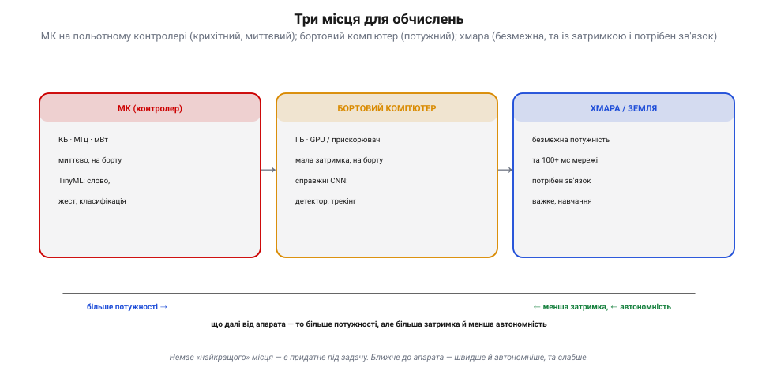
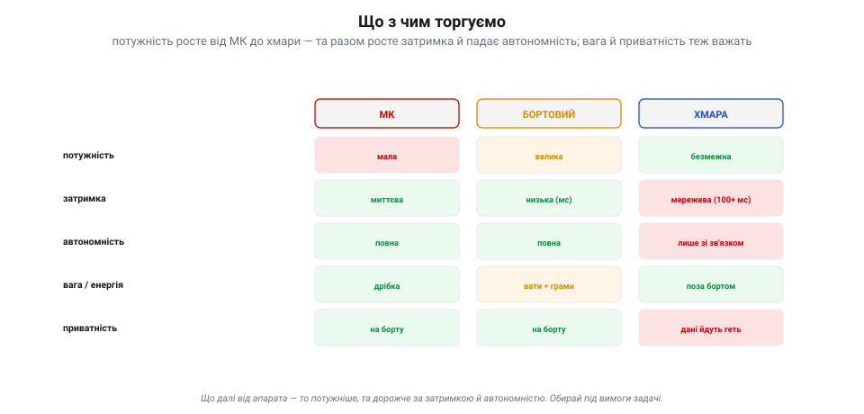
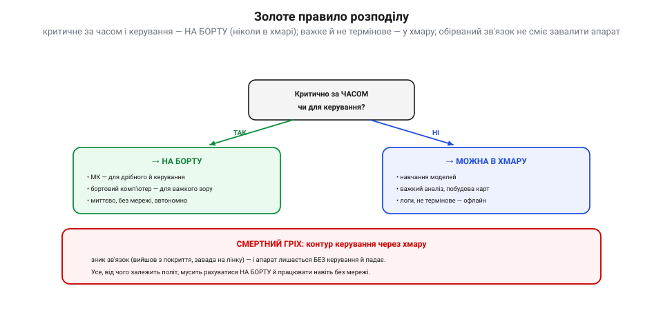
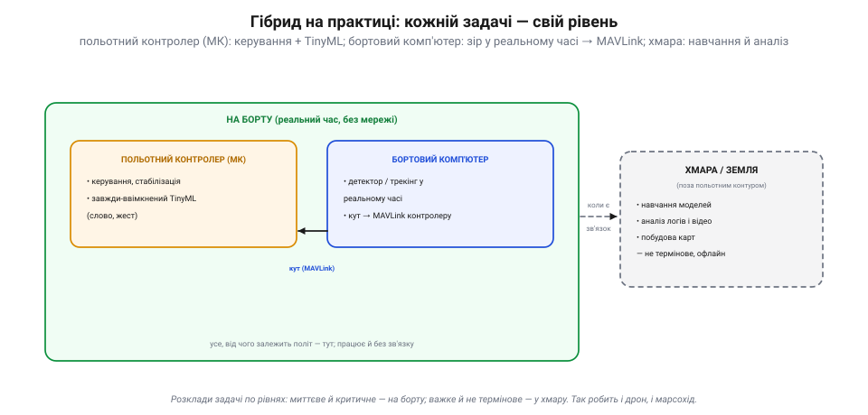

# Де рахувати: МК vs бортовий комп'ютер vs хмара

Коли модель навчено й [стиснуто до розмірів мікроконтролера](topic:sf-ml/tinyml), лишається останнє рішення — **де** її запускати. Місць три: на самому **польотному контролері** (МК), на **бортовому комп'ютері** (супутнику) або в **хмарі** (на віддаленому сервері через мережу). Вибір — це компроміс між **потужністю**, **затримкою** й **автономністю**, у якому сходяться [ціна обчислень у вазі й енергії](topic:hw-arch/compute-cost), [бюджет бітрейту каналу](topic:com-signal/quality-bitrate), [надійність відеолінку](topic:com-transport/video-transmission) та різниця між [навчанням і висновуванням](topic:sf-ml/train-vs-inference).

### Три місця для обчислень

Розгляньмо ці три рівні — від найближчого до апарата до найдальшого.

*Три місця. **МК** (польотний контролер): кілобайти, мілівати, миттєво й автономно — тягне лише TinyML. **Бортовий комп'ютер** (Pi/Jetson на борту): гігабайти, GPU, мала затримка — справжні CNN-детектори. **Хмара/земля**: безмежна потужність, та 100+ мс мережі й потрібен зв'язок. Що далі від апарата — то більше потужності, але більша затримка й менша автономність.*

**МК** (сам польотний контролер) — найближче: кілобайти, мілівати, рахує **миттєво** й завжди доступний, але тягне лише найдрібніше — [крихітні TinyML-моделі](topic:sf-ml/tinyml): слово-команду, жест, просту класифікацію. **Бортовий комп'ютер** (супутник — Raspberry Pi чи Jetson на борту) — потужніший: гігабайти, GPU чи прискорювач, мала затримка (усе **на борту**, без мережі) — це робоча конячка серйозного зору ([нейромережні детектори](topic:sf-visual/nn-detectors), [трекінг](topic:sf-visual/tracking)). **Хмара** (потужний віддалений сервер через радіо/мережу) — найпотужніша, фактично **безмежна**, та платить за це мережевою **затримкою** (сотні мс і непередбачувано) і **залежністю від зв'язку** ([нема сигналу — нема обчислень](topic:com-transport/video-transmission)). Закономірність ясна: що далі від апарата, то більше сили, але й більша затримка й менша автономність.

### Що з чим торгуємо

Звідси — таблиця компромісів, за якою й вибирають.

*Що з чим торгуємо. **Потужність** росте від МК до хмари (мала → велика → безмежна). Та разом росте **затримка** (миттєва → мс → мережева 100+ мс) і падає **автономність** (повна → повна → лише зі зв'язком). Додай **вагу/енергію** (МК — дрібка; бортовий — вати й грами; хмара — поза бортом) і **приватність** (на борту дані лишаються; у хмару — йдуть геть). Обирай під вимоги задачі.*

Осі компромісу такі. **Потужність**: МК < бортовий < хмара. **Затримка**: МК миттєво, бортовий — мілісекунди, хмара — десятки-сотні мс мережі (і нестабільно). **Автономність**: МК і бортовий працюють **будь-де**; хмара — лише доки є зв'язок. **Вага й енергія**: МК — дрібка, бортовий комп'ютер коштує **ват і грамів** (а отже, [часу польоту](topic:hw-arch/compute-cost)), хмара — поза бортом (та радіоканал теж їсть енергію). **Приватність**: на борту дані лишаються вдома, у хмару — відлітають геть. Усього одразу не виграти — кожну задачу ставлять туди, де її вимоги збігаються з можливостями рівня.

### Золоте правило розподілу

Попри п'ять осей, головне рішення зводиться до **одного** питання: **чи критична задача за часом?**

*Золоте правило. Питання одне: **критично за часом чи для керування?** Якщо **так** — рахуй **на борту** (МК для дрібного й керування, бортовий комп'ютер для важкого зору): миттєво, без мережі, автономно. Якщо **ні** — можна в **хмару** (навчання моделей, важкий аналіз, карти — офлайн). **Смертний гріх**: пускати контур керування через хмару — зник зв'язок, і апарат лишається без керування й падає.*

Якщо **так** (керування, реальний час) — рахуй **на борту**: дрібне й керування на МК, важкий зір на бортовому комп'ютері. Тут усе **миттєво**, автономно, без оглядки на мережу. Якщо **ні** (важке, не термінове) — сміливо віддавай у **хмару**: [навчання моделей](topic:sf-ml/train-vs-inference), важкий аналіз, побудова карт, логи. А **смертний гріх** — пускати **контур керування** через хмару: щойно зникне зв'язок (вийшов з покриття, [завада на відеолінку](topic:com-transport/video-transmission)), апарат залишиться **без керування** й розіб'ється. Запам'ятай назавжди: **усе, від чого залежить політ, мусить рахуватися на борту й працювати навіть без мережі.**

### Гібрид на практиці

Тому реальний апарат майже завжди **гібридний** — він розкладає задачі по всіх трьох рівнях.

*Гібрид на практиці. **На борту** (реальний час, без мережі): **польотний контролер** (МК) веде керування й завжди-ввімкнений TinyML (слово, жест), а **бортовий комп'ютер** робить детектор/трекінг у реальному часі й шле кут по MAVLink контролеру. **Хмара/земля** (поза польотним контуром, лише коли є зв'язок): навчання моделей, аналіз логів і відео, побудова карт — усе не термінове, офлайн.*

Розподіл звичайно такий. **Польотний контролер** (МК) — керування, стабілізація й завжди-ввімкнений TinyML (наприклад, реакція на голосову команду чи жест). **Бортовий комп'ютер** — зір у реальному часі: [детектор](topic:sf-visual/nn-detectors) і [трекінг](topic:sf-visual/tracking), що віддає **кут** цілі по MAVLink назад у контролер. І те, й те — **на борту**, у польотному контурі, працює без мережі. А **хмара чи земля** стоять **поза** польотним контуром: туди, коли є зв'язок, скидають важке й не термінове — [навчають моделі](topic:sf-ml/train-vs-inference), аналізують логи й відео, будують карти. Кожна задача — на своєму рівні: миттєве й критичне внизу, потужне й офлайнове нагорі.

> 📜 **Чому марсохід думає сам: швидкість світла забороняє пульт.** Найпереконливіший доказ золотого правила дала не земна техніка, а **Марс**. Уяви: інженер на Землі хоче кермувати марсоходом джойстиком. Та сигнал від Землі до Марса йде **від 3 до 22 хвилин** (туди-назад — близько **25**), бо такою є відстань навіть для світла. Поки картинка «попереду яма» долетить до Землі, а команда «гальмуй» долетить назад, мине пів години — і марсохід давно вже **в ямі**. Керувати ним у реальному часі **фізично неможливо**. Тому марсоходи (Curiosity, Perseverance) **думають самі**: із Землі їм надсилають лише **план** на день — куди їхати, — а **рішення на ходу** вони ухвалюють **на борту**. Їхня система автономної навігації (AutoNav) знімає місцевість стереокамерами, будує тривимірну карту, сама бачить небезпеки (камені, схили, пухкий пісок) і прокладає **безпечний** шлях — Perseverance так долає до 200 метрів за день **без жодної команди** з Землі. Це і є наше золоте правило, лише в космічному масштабі: **критичне за часом не можна виносити «в хмару»** — затримка вб'є. Те, що для марсохода диктує швидкість світла, для твого дрона диктує надійність радіоканалу: контур, від якого залежить апарат, мусить замикатися **на борту**. Марс просто робить цей урок неспростовним.

> 🔧 **Навіщо це.** Розподіляй задачі за **одним** питанням: критично за часом — на борт, ні — можна в хмару. **Керування й реальний час** тримай **на борту** (МК для дрібного й польоту, бортовий комп'ютер для важкого зору) і **ніколи** не замикай політний контур через мережу — [обірвався зв'язок](topic:com-transport/video-transmission), і апарат падає. **Важке й не термінове** ([навчання](topic:sf-ml/train-vs-inference), аналіз, карти) спокійно віддавай у хмару чи на землю. Зважуй ціну бортового комп'ютера — [**вати й грами** коротшають політ](topic:hw-arch/compute-cost), — і пам'ятай про **приватність** (у хмару дані відлітають). За умовчанням бери **гібрид**: МК плюс бортовий комп'ютер для всього термінового, хмара — лише для офлайнового. І перевіряй найгірший випадок: **що буде, коли зникне зв'язок?** — правильна відповідь має бути «апарат і далі літає».

### Підсумок теми

Запускати модель можна у трьох місцях: **МК** (крихітний, миттєвий, автономний — TinyML), **бортовий комп'ютер** (потужний, з малою затримкою, на борту — справжні CNN) і **хмара** (безмежна, та з мережевою затримкою і залежна від зв'язку). Компроміс незмінний: що далі від апарата, то більше потужності, але більша затримка й менша автономність — плюс ціна у вазі/енергії та приватності. **Золоте правило**: критичне за часом і керування — **на борту** (ніколи в хмарі: обірваний зв'язок не сміє завалити апарат), важке й не термінове — у хмару. На практиці апарат **гібридний**: контролер веде політ і TinyML, бортовий комп'ютер — зір у реальному часі (кут по MAVLink), а хмара [навчає](topic:sf-ml/train-vs-inference) й аналізує поза польотним контуром. Неспростовний доказ цього правила — марсохід, що змушений думати сам, бо світло від Землі йде надто довго: контур, від якого залежить апарат, мусить замикатися **на борту**, навіть коли над головою — мільйони кілометрів порожнечі.
