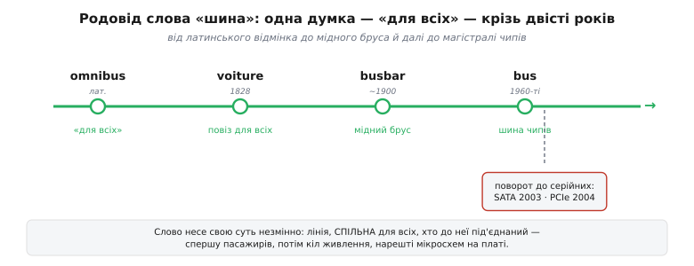

# 📜 Слово «шина»: від латинського відмінка до серійних доріжок

У темі ми вивели шину з потреби: окремий дріт на кожну пару чипів росте як квадрат, тож лінії доводиться **ділити** — покласти одну спільну магістраль, до якої чіпляються всі. І тоді впало саме слово — *шина*, англ. *bus*, — ніби воно завжди й означало «спільна лінія». Але це слово прийшло здалеку й довгою дорогою, і сама ця дорога — маленька, майже неймовірна історія про те, як латинський граматичний відмінок став назвою для мідного бруса, а потім для магістралі кремнієвих чипів. Причому крізь усі перевтілення воно несло **одну незмінну думку** — «для всіх», «спільне». А наприкінці, уже в кремнії, ця сама думка вперлася у фізичну стелю, і інженерам довелося переписати залізо. Розкладімо цей ланцюг ланка за ланкою, бо він пояснює не лише звідки слово, а й **чому** сучасна периферія стала вузькою й послідовною.

*Одна зелена нитка «для всіх» тримається крізь двісті років: латинський відмінок → паризький повіз (1828) → мідний брус живлення (близько 1900) → магістраль чипів. А внизу — розвилка, де ця сама думка «спільне для всіх» на високій частоті ламається, і залізо повертає до серійних шин (SATA 2003, PCIe 2004).*

## Латинський відмінок, у якому не лишилося кореня

Почнімо з найдивнішого кінця. Латинське *omnis* означає «весь, кожен». Мова ця відмінкова: одне й те саме слово змінює закінчення залежно від того, чим воно стоїть у реченні. Форма *omnibus* — це давальний (і водночас орудний) відмінок множини, тобто буквально «всім», «для всіх». Не окреме слово зі своїм змістом, а граматична форма з характерним закінченням **-ibus**. Запам'ятаймо це закінчення — саме воно, а не корінь, доживе до наших днів. *(Статус: усталено — *omnibus* як dative/ablative plural від *omnis* фіксують усі етимологічні словники латини.)*

Століттями *omnibus* так і жило всередині латинських текстів звичайним службовим словом. Щоб воно стало **назвою речі**, мала статися випадковість — і вона сталася у Франції на самому початку XIX століття.

## Париж, 1828: «повіз для всіх»

У французькому місті Нант підприємець на ім'я **Станіслас Бодрі** (фр. *Stanislas Baudry*) тримав лазні на околиці й пустив каретку, щоб підвозити містян від центру до своїх купалень. Цікаве сталося саме собою: люди сідали в каретку не заради лазень, а щоб просто доїхати з пункту в пункт. Бодрі зрозумів, що золото не в купальнях, а в самому перевезенні — у регулярному екіпажі, відкритому будь-кому, хто заплатить за місце.

Далі — деталь, яку історики вважають найпоширенішою (хоч і не єдиною) версією походження слова. Кінцева зупинка тієї каретки нібито стояла коло крамниці, над якою висіла вивіска з латинським словом *Omnes* («усі») чи навіть грою слів на прізвище власника-крамаря на ім'я Omnès — і напис *«Omnes omnibus»*, «Omnès — для всіх». Слово *omnibus* причепилося до самого екіпажа як влучне: **повіз для всіх**. *(Статус: ядро усталене — Бодрі, Нант, кінець 1820-х; конкретна легенда про вивіску «Omnes omnibus» подається у джерелах саме як популярна оповідь, а не строго доведений факт.)*

Коли **1828 року** Бодрі переніс справу до Парижа й запустив там регулярну лінію громадських екіпажів, офіційна назва вже містила це слово: *voiture omnibus* — «повіз для всіх», *voiture* означає «екіпаж, повіз». Ось перший поворот нашого ланцюга: латинська граматична форма стала французькою **назвою транспорту, відкритого кожному**. Суть слова — «для всіх» — не змінилася ні на йоту; змінилося тільки те, до чого воно тепер приліпилося. *(Статус: усталено — рік 1828 і паризький *voiture omnibus* підтверджують і словники, і історія міського транспорту.)*

А далі мова зробила з довгим словом те, що завжди робить із довгими вжитками, — вкоротила його. Уже близько **1832 року** з *omnibus* лишився самий кінець — **bus**. І тут ховається лінгвістичний курйоз, який варто відчути на смак: у слові *bus* немає жодного кореня. Це вцілілий уламок латинського закінчення *-ibus*, «хвіст» від «для всіх», що зажив власним життям без голови й тулуба. Ми досі, називаючи шину, вимовляємо самий лише відмінковий суфікс мертвої мови. *(Статус: усталено — скорочення *omnibus → bus* близько 1830-х фіксують етимологічні словники.)*

Дотепер це історія про громадський транспорт. Щоб слово дійшло до електроніки, потрібна була ще одна пересадка — з вулиці на щит живлення.

## Мідний брус, що годує всіх: *busbar*

Кінець XIX — початок XX століття, епоха, коли електрику вперше повели у великі будівлі й на підстанції. Постала суто інженерна задача: як від одного потужного джерела нагодувати струмом одразу багато споживачів — багато машин, багато відходжень кабелю? Тягнути окремий товстий провід від джерела до кожного споживача — марнотратство міді й хаос на щиті. Рішення напросилося просте й дуже фізичне: покласти **один спільний масивний провідник** — товстий мідний (чи алюмінієвий) брус, — на який заведено джерело, і від якого вже коротко відгалужуються всі споживачі.

І тут інженери взяли готове слово. Той спільний брус живлення назвали *omnibus bar* — «брус для всіх», бо він, як і паризький повіз, служив **усім** відразу. Незабаром вираз скоротили до *busbar* (українською — **збірна шина**, «збірна», бо збирає на собі струм для всіх відходжень). Другий великий поворот ланцюга: слово «для всіх» переселилося з вулиці на електротехнічний щит, зберігши точнісінько ту саму суть — **одна спільна лінія, з якої живляться всі**. *(Статус: усталено в головному — термін *busbar* усталюється в електротехніці США на зламі XIX–XX ст., один із ранніх задокументованих ужитків «bus bar» — у патентній практиці початку 1900-х; точну «дату народження» слова назвати не можна, бо термін входив у мову поступово.)*

Зверніть увагу, наскільки точно збіглася **ідея**. Паризький омнібус: один екіпаж — для всіх пасажирів. Мідна збірна шина: один брус — для всіх кіл. Обидва рази слово тримається не за форму об'єкта, а за його **роль**: бути спільним ресурсом, доступним багатьом. Саме тому наступний стрибок — в обчислювальну техніку — вийшов таким природним.

## Магістраль чипів: слово входить в обчислювальну техніку

Коли з'явилися перші комп'ютери, всередині них постала задача, майже тотожна щитові живлення, тільки замість струму — **дані**. Багато вузлів: процесор, пам'ять, пристрої вводу-виводу. Кожному треба обмінюватися числами з рештою. Тягнути окремий пучок дротів між кожними двома вузлами — та сама катастрофа квадратичного зростання, з якої ми починали тему. Тож інженери зробили те саме, що електрики зі струмом: проклали **один спільний набір ліній**, на який усі вузли кладуть і з якого всі читають дані. І назвали його вже знайомим словом — **bus**, шина.

Так замкнувся ланцюг. Одна й та сама думка — «спільна магістраль для всіх, хто до неї під'єднаний» — пройшла крізь три зовсім різні світи: пасажири в паризькому екіпажі, струм на мідному брусі, дані на лініях між чипами. Слово *bus* не метафора, накинута згори; це **точна назва суті**, що її електроніка успадкувала від електротехніки, а та — від громадського транспорту. Коли в темі ми казали «шина — це спільна лінія для всіх», ми, самі того не називаючи, повторювали визначення двохсотрічної давнини. *(Статус: усталено — обчислювальне значення *bus* прямо походить від електротехнічного *busbar*, що його своєю чергою запозичено з *omnibus*.)*

> 🔧 **Навіщо це.** Слово несе конструкцію. Щойно ви чуєте «шина» — байдуже, шина живлення на платі, шина даних чи адресна шина в описі мікроконтролера, — воно вам одразу підказує топологію: **спільна лінія, до якої всі під'єднані паралельно**. А зі спільної лінії негайно випливають ті самі три угоди з теми — де межа сигналу, хто зараз веде, до кого мова. Тобто саме слово вже містить попередження: якщо лінія спільна, комусь доведеться поступатися чергою. Розуміти етимологію тут — не забавка, а спосіб з першого погляду вгадати, які проблеми вас чекають на будь-якій шині.

Але в цьому «для всіх» — у самій ідеї спільної **широкої** магістралі — крилася пастка, яка вибухнула, щойно швидкості піднялися високо. І щоб зрозуміти головний поворот сучасної периферії, треба побачити, як саме ідея «для всіх» почала себе руйнувати.

## Коли «широке для всіх» перестало встигати

Перші комп'ютерні шини були не лише спільні, а й **широкі** — багато паралельних ліній даних, щоб гнати цілий байт, а то й кілька байтів воднораз. Логіка та сама, з якої ми починали тему: більше ліній — більше даних за один такт. Десятиліттями це працювало й тільки розросталося: 8, 16, 32, нарешті 64 паралельні лінії даних у системних шинах.

І тут спрацювала фізика, якої на низьких швидкостях просто не було видно. У темі ми її вже назвали; тут поглянемо на неї як на **історичну межу**, об яку розбилися конкретні технології. Вісім (чи тридцять дві) «однакових» ліній насправді ніколи не однакові: вони трохи різної довжини, лежать поряд і наводять сигнал одна на одну, мають дрібні розбіжності в ємності. Поки такт повільний — дрібниці. Але коли частоту піднімають, фронти на всіх лініях перестають приходити **точно разом**: один біт випереджає, інший спізнюється. Цей розбіг звуть перекосом (англ. *skew*). Настає момент, коли передавач уже виставляє наступне слово, а приймач ще не певен, що на **всіх** лініях устоялося попереднє. Додайте сюди наведення між сусідніми дротами (англ. *crosstalk*), що з частотою тільки росте, — і виходить прикрий парадокс: широка шина впирається у стелю саме через свою ширину. «Для всіх воднораз» на високій частоті означає «чекаємо найповільнішого й найгіршого з усіх».

Вихід виявився протилежним до інтуїції — і саме на зламі 2000-х його масово втілили в залізі. Замість розширювати шину її стали **звужувати** до однієї-двох ліній і слати біти **один за одним**, зате піднімати частоту дуже високо. Одна лінія сама з собою розсинхронізуватися не може: перекосу між нею й нею немає. А наведення приборкують окремим прийомом — двома протифазними лініями, диференційною парою. І тоді вузький серійний канал розганяється до швидкостей, недосяжних для товстого паралельного джгута. Це та сама розв'язка, що її розгорнуто в темі про [диференційні пари](topic:com-medium/differential-pair): дві лінії у протифазі б'ються з наведенням там, де широка шина здавалася.

## Дві гучні смерті паралельних шин: PATA і PCI

Ця зміна — не абстракція з підручника, а конкретний перелом, який можна датувати з точністю до місяця. Два приклади показові, бо обидва — про масові, всім знайомі шини, що прожили довге життя й уперлися рівно в описану стелю.

**Диски: PATA → SATA.** Десятиліттями жорсткі диски в комп'ютерах під'єднувалися паралельним інтерфейсом **PATA** (англ. *Parallel ATA*, він же IDE) — тією самою широкою стрічкою на 40 контактів (пізніше 80-жильною), що її бачив кожен, хто відкривав системний блок кінця 1990-х. Її остання й найшвидша редакція, *Ultra DMA mode 6* (анонс середина 2001 року), уперлася в стелю близько **133 МБ/с** — і далі паралельний тракт розганятися відмовлявся саме через перекіс і наведення на стрічці. Заміна прийшла у вигляді послідовного **SATA** (англ. *Serial ATA*): його перша редакція (Serial ATA 1.0a) вийшла **7 січня 2003 року** вже зі швидкістю 1.5 Гбіт/с по кількох тонких лініях замість сорока. Замість широкої стрічки — семижильний шнурок; замість «усі біти воднораз» — біти по черзі, зате на високій частоті. *(Статус: усталено — стеля PATA близько 133 МБ/с (UDMA-6) і вихід SATA 1.0a 7 січня 2003 з 1.5 Гбіт/с підтверджені специфікаціями та профільними джерелами.)*

**Плати розширення: PCI → PCI Express.** Та сама історія — з головною системною шиною персональних комп'ютерів. Класична **PCI** (англ. *Peripheral Component Interconnect*) була широкою спільною шиною: багато ліній даних, і всі плати сиділи на одному спільному тракті, ділячи його між собою, — точнісінько «для всіх» у первісному сенсі слова. З ростом частот той спільний широкий тракт став гальмом. На зміну прийшов **PCI Express** (PCIe), збудований на протилежному принципі: не один спільний широкий тракт, а набір **вузьких серійних доріжок** (англ. *lanes*), кожна з яких — окреме двоспрямоване послідовне з'єднання «точка-точка». Базову специфікацію PCI Express 1.0 було затверджено **29 квітня 2002 року**, а перші плати й відеокарти на PCIe (як-от Intel-чипсети серії 9xx та відеокарти NVIDIA GeForce 6) масово прийшли на ринок **2004 року** — саме тоді PCIe почав витісняти паралельну PCI з материнських плат. *(Статус: усталено — specification 1.0 датовано квітнем 2002, масове впровадження в залізі — 2004; обидві дати підтверджені і документами PCI-SIG, і історією платформ. Часто зустрічається коротка згадка «PCIe — 2004»: це рік появи в продуктах, а не рік специфікації.)*

Обидва переходи промовляють одне й те саме, і саме тому вони варті місця поряд із темою. Стара, буквальна ідея шини — **один широкий тракт для всіх** — на високій частоті програє. Її наступник у назві часто зберігає слово *bus* або натяк на нього (та ж PCI — це *…Interconnect*, а логічно все одно шина), але фізично це вже не спільний широкий брус, а пучок вузьких серійних ліній. Слово вціліло; конструкція під ним перевернулася.

## Що з цього випливає для мікроконтролера

Тепер видно, чому **вся** периферія мікроконтролера з теми — послідовна, а не паралельна. UART, I2C, SPI не тягнуть пласким байтом по восьми лініях; вони течуть бітами по черзі по одній-двох. Це не випадковість і не забаганка — це те саме історичне рішення, що переписало диски й плати комп'ютерів, тільки застосоване на рівні окремих чипів. На дрібній платі ще й додається аргумент, з якого починалася тема: вузька серійна лінія економить дорогоцінні ніжки. Тобто дві сили — фізика високих частот і скупість ніжок — штовхають в один бік, до вузького й послідовного.

І остання, найтонша нитка через увесь цей родовід. Слово *bus* народилося з ідеї «спільне **для всіх**» — і саме частина «для всіх», коли її розуміли буквально як «усі лінії воднораз», у підсумку й стала межею. Сучасні шини лишилися спільними в логіці — до однієї магістралі так само чіпляється гроно давачів на I2C, — але перестали бути широкими у фізиці. Вони, якщо завгодно, «для всіх по черзі», а не «для всіх водночас». Двохсотрічне слово досі точно описує, **хто** під'єднаний до лінії; а от **як** саме по ній ідуть біти — це вже відповідь, яку інженерія переписала на нашому з вами віку, повернувши від широкого паралельного до вузького серійного. Тому, читаючи далі UART, I2C і SPI, тримайте в голові обидва боки слова: спільність, що лишилася, — і ширину, від якої відмовилися.
