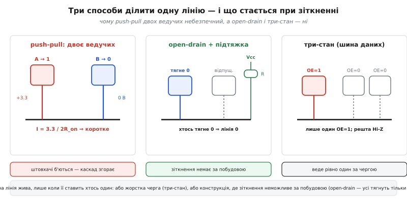
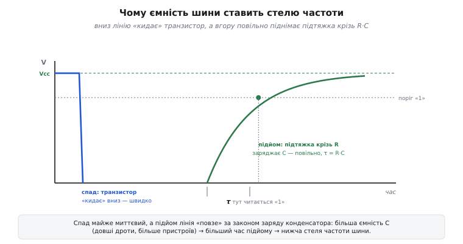
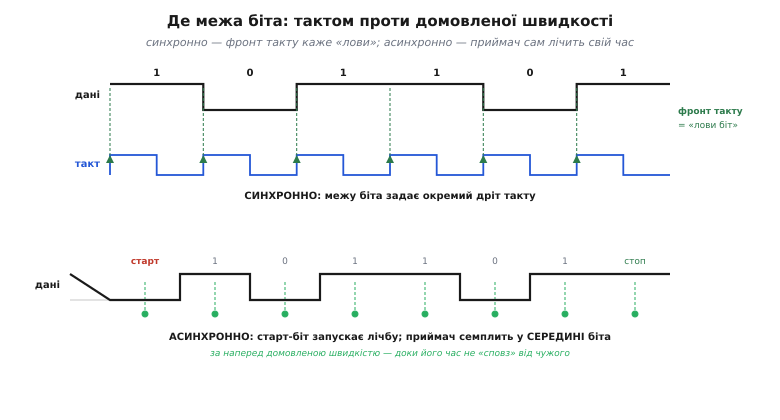

# Як чипи розмовляють: навіщо шини

<preknowlist>
</preknowlist>

У базовому кроці ми вивели саму ідею шини з простого підрахунку: окремий дріт на кожну пару чипів росте як квадрат від їхньої кількості, тож лінії доводиться **ділити** — покласти одну спільну магістраль і домовитися про три речі: де кінчається біт, хто зараз веде лінію, до кого адресована мова. Тоді ж ми побачили, чому широка паралельна шина програє вузькій серійній на високій частоті, і зібрали вручну найпростіший серійний передавач.

Тут ми беремося за ті самі питання **глибше** — туди, де базовий крок лише назвав явище, а тепер треба показати його механіку до кінця. Три речі, яких там бракувало і які визначають усе подальше: **як саме кілька виходів фізично ділять один дріт, не спаливши одне одного** (базовий крок сказав «двоє не мають штовхати воднораз» — але не сказав, що станеться, якщо таки штовхнуть, і як залізо це унеможливлює); **скільки точно можна дозволити двом годинникам розійтися**, поки асинхронний приймач ще влучає в біт (виведемо бюджет розсинхронізації в числах); і **звідки береться конкретна стеля частоти** — не «перекіс заважає», а формула, що дає мегагерци. Наскрізна нитка та сама, що вела нас від GPIO-регістрів до цього модуля: чип уміє лише виставляти й читати рівні на ніжках — з цього мінімуму й доводиться будувати всю розмову між кристалами.

## Пін-бюджет: чому квадрат — це вирок, а не незручність

Почнімо з підрахунку, який у базовому кроці був швидким, а тут заслуговує строгості, бо саме він робить шину неминучою, а не однією з опцій.

Візьмімо N чипів і спитаймо: скільки окремих двоточкових каналів треба, щоб кожен міг говорити з кожним напряму? Перший чип має провести лінію до кожного з решти — це N−1 ліній. Другий — теж до кожного, крім себе, але лінію до першого вже проведено, тож нових у нього N−2. Третій додає N−3, і так далі до останнього, який не додає жодної нової. Сума:

```
(N−1) + (N−2) + … + 1 + 0 = N·(N−1)/2
```

Це трикутне число, і росте воно **квадратично**: подвоїш кількість чипів — учетверо зростуть з'єднання. Але саме число ліній — ще півбіди. Справжня катастрофа в тому, що кожна лінія коштує **фізичного ресурсу з обох кінців**: ніжки на кристалі чипа-джерела, ніжки на чипі-приймачі, доріжки на платі між ними. А якщо ми, спокушені швидкістю, зробимо кожен канал не однопровідним, а восьмипровідним (цілий байт воднораз), то множимо все на ширину каналу W:

```
ніжок усього ≈ W · N·(N−1)  (кожна лінія — по ніжці на кожному з двох кінців)
```

**Скільки ніжок з'їдає наївний паралельний підхід.**

```c
#include <stdint.h>

// Повний двоточковий зв'язок «кожен з кожним», кожен канал — W ліній даних.
// Рахуємо не лінії, а САМЕ НІЖКИ (кожна лінія займає ніжку на обох кінцях).
static uint32_t naive_pins_total(uint32_t n_chips, uint32_t width) {
    uint32_t links = n_chips * (n_chips - 1u) / 2u;   // N·(N−1)/2 каналів
    return width * links * 2u;                         // ×W ліній ×2 кінці
}

// А тепер полічимо максимум ніжок, потрібних ОДНОМУ чипові в такій схемі:
// він тягне канал до кожного з решти, кожен канал — W ліній.
static uint32_t naive_pins_per_chip(uint32_t n_chips, uint32_t width) {
    return width * (n_chips - 1u);
}
```

Підставмо реальні числа скромної плати: шість чипів (процесор, пам'ять, два давачі, дисплей, радіо), байтовий канал W = 8.

```
links            = 6·5/2 = 15 каналів
ніжок усього     = 8 · 15 · 2 = 240 ніжок на всю плату лише на дані
на один чип      = 8 · (6−1) = 40 ніжок лише на дані, лише на цьому чипі
```

Сорок ніжок **одного** чипа — тільки на дані, без живлення, без такту, без зворотних ліній. У дрібного мікроконтролера всього ніжок буває два-три десятки. Тобто наївна схема не влазить у корпус **фізично**, і то з великим запасом. Помітьте: проблема не в тому, що дротів «багато» в побутовому сенсі, — проблема в тому, що вимога зростає **швидше**, ніж будь-який бюджет ніжок може за нею встигнути. Додавання одного чипа до п'яти вимагає не однієї нової лінії, а п'яти (по одній до кожного наявного), і чим більша плата, тим дорожчий кожен наступний учасник.

> 🔧 **Навіщо це.** Квадратичне зростання — це не абстрактна математика, а рядок у специфікації, об який ви вдаряєтеся щоразу, коли на платі більше трьох активних чипів. Саме тому в даташиті будь-якого давача ви бачите не «шину даних», а дві-три ніжки інтерфейсу: виробник давно розв'язав цю проблему за вас, поклавши все на серійну шину. Розуміти корінь варто, щоб не намагатися «прискорити» зв'язок, розпаралеливши його на багато ліній, — на дрібній платі це майже завжди програш і за ніжками, і, як побачимо далі, за частотою.

Шина зрізає цей квадрат до майже сталої величини. Одна спільна магістраль із двох-трьох ліній обслуговує **всіх**: додавання чипа коштує одного відводу, а не пучка дротів через усю плату. Формально вартість падає з O(N²) ліній до O(1) ліній плюс O(N) коротких відводів. Але — і в цьому вся суть детального погляду — щойно лінія стала спільною, з'являється проблема, якої в дедикованому дроті просто не могло бути: **на неї тепер дивиться кілька виходів воднораз, і треба фізично гарантувати, що вони не поб'ються за неї.** Базовий крок сказав «домовтеся про чергу». Тут ми побачимо, що самої домовленості мало — потрібна ще й правильна електрика виходу.

## Що фізично стається, коли двоє штовхають одну лінію

Уявімо найгірше й порахуймо його чесно. На спільній лінії висять два звичайні цифрові виходи типу [push-pull](root:hw-digital/push-pull-output) — такий вихід має два ключі: верхній сполучає лінію з живленням (виставляє «1»), нижній — із землею (виставляє «0»). У нормі активний лише один із них. Тепер хай чип A виставляє «1» (замкнув верхній ключ, тягне лінію до 3.3 В), а чип B тієї ж миті виставляє «0» (замкнув нижній ключ, тягне лінію до 0 В). Що на лінії?

Лінія фізично не може бути водночас на 3.3 В і на 0 В. Натомість утворюється наскрізний шлях струму: 3.3 В → відкритий верхній ключ A → мідь лінії → відкритий нижній ключ B → земля. Єдине, що обмежує цей струм, — опір самих відкритих ключів (англ. *R_on*, опір відкритого каналу), одиниці — десятки ом.

**Наскрізний струм при зіткненні двох push-pull виходів.**

```c
#include <stdint.h>

// Оцінка струму короткого замикання, коли один вихід тягне вгору,
// а інший тієї ж миті — вниз. Обмежує лише сума опорів двох відкритих ключів.
static float contention_current_A(float vdd, float ron_high, float ron_low) {
    return vdd / (ron_high + ron_low);   // закон Ома по наскрізному шляху
}
// Приклад: Vdd = 3.3 В, кожен ключ ~15 Ом.
//   I = 3.3 / (15 + 15) = 3.3 / 30 = 0.11 А = 110 мА
```

Сто десять міліампер крізь транзистор, розрахований на одиниці міліампер вихідного струму. Це десятки-сотні разів понад норму. Розсіювана на ключах потужність — I²·R_on ≈ 0.11²·15 ≈ 0.18 Вт на крихітному транзисторі площею часток квадратного міліметра — миттєво його перегріває. Якщо зіткнення коротке (наносекунди при випадковому збігу), вихід виживе; якщо стале (двоє утримують протилежні рівні мікросекундами) — вигорає металізація або відмирає ключ. І помітьте окрему підступність: під час зіткнення на лінії стоїть **проміжна** напруга (десь посередині між 0 і 3.3 В, за дільником R_on), яку приймачі прочитають як невизначений рівень — тобто дані однаково зіпсовано, навіть поки залізо ще живе.


*Ліворуч — два push-pull штовхають протилежне: наскрізний струм 3.3/2R_on крізь обидва каскади, вихід згорає. Посередині — open-drain: усі виходи вміють лише тягнути вниз або відпускати, тож зіткнення неможливе за побудовою, а рівень лінії — логічне І усіх. Праворуч — три-стан: усі, крім одного, у високому опорі (Hi-Z), «відчеплені» від лінії, і черга дозволяє вести рівно одному.*

Звідси випливають рівно два способи зробити спільну лінію безпечною — і обидва працюють в реальних шинах. Перший: **жорстко стежити, щоб у кожен момент активним був рівно один push-pull вихід**, а всі інші стояли у третьому стані.

Третій стан (англ. *tri-state*, Hi-Z — high impedance, високий опір) — це коли вихід розмикає **обидва** ключі й ніби фізично від'єднується від лінії: не тягне ні вгору, ні вниз, а «висить» з дуже великим опором, майже як обірваний дріт. Керує цим окремий внутрішній сигнал дозволу виходу (англ. *OE*, output enable). Поки OE = 0, вихід у Hi-Z і не заважає нікому; коли OE = 1, вихід стає звичайним push-pull і веде лінію. Правило шини тоді просте: **рівно один OE = 1 воднораз.** Так працюють широкі шини даних усередині процесора й пам'яті — кожен, хто не «свій» цієї миті, тихо відчеплений.

Другий спосіб хитріший і красивіший, бо унеможливлює зіткнення **за самою побудовою виходу**, не покладаючись на дисципліну. Це [open-drain](root:hw-digital/open-drain-output) (відкритий стік): у виходу лишають **тільки нижній ключ**. Він або тягне лінію до землі («0»), або розмикається й відпускає її. Верхнього ключа немає взагалі — вихід просто не вміє тягнути вгору. Тоді хоч скільки таких виходів висить на лінії, ніхто ніколи не тягне її до живлення, а отже, наскрізному струму нізвідки взятися: усі або тягнуть вниз, або мовчать.

Але якщо ніхто не тягне вгору, звідки на лінії береться «1»? Її забезпечує окремий елемент — [підтяжка](root:hw-digital/floating-pullups) (англ. *pull-up*): резистор між лінією й живленням, що тихенько тягне лінію до 3.3 В, коли жоден вихід її не тримає внизу. Виходить елегантна логіка: **лінія на «1» тоді й лише тоді, коли ЖОДЕН вихід не тягне її вниз.** Досить одному потягнути — лінія падає в «0». Це не що інше, як апаратне логічне І (кон'юнкція) всіх виходів, зашите просто в мідь; його так і звуть — монтажне І (англ. *wired-AND*).

Саме на цьому стоїть [I2C](root:com-devices/i2c-bus) — шина, де дві лінії (дані SDA і такт SCL) спільні для всіх пристроїв. Кожен пристрій має open-drain виходи на обидві лінії, а вгору їх тягнуть два зовнішні резистори-підтяжки. Тому I2C **не може** мати конфлікту рівнів у фізичному сенсі: будь-хто будь-коли або тягне лінію вниз, або відпускає, і найгірше, що станеться при неузгодженні, — це зіпсований байт, а не спалений вихід. Ба більше, монтажне І тут — не побічний ефект, а робочий інструмент: на ньому тримається і арбітраж кількох ведучих (хто виставив «0», той і переміг, бо «0» завжди перемагає «1» на wired-AND), і механізм, яким повільний ведений може «розтягнути» такт, утримуючи SCL внизу. Але за цю безпеку доводиться платити — і рахунок за неї виставляє фізика заряду, до якої ми зараз і переходимо.

## Ціна open-drain: чому підтягнута лінія повільна

У push-pull виході обидва напрямки активні: верхній ключ **штовхає** лінію вгору так само сильно, як нижній — вниз. Обидва фронти круті, обидва швидкі. В open-drain усе несиметрично, і в цій несиметрії — прихована стеля швидкості.

Униз лінію тягне транзистор — потужно, з малим опором R_on, тож спад майже вертикальний: лінія «падає» в нуль за наносекунди. А вгору її не штовхає ніхто; її лише **відпускають**, і піднімає лінію слабенький струм крізь резистор-підтяжку R_p. Але піднімати доводиться не порожнечу: будь-яка реальна лінія має **ємність** — сумарну ємність доріжки, усіх приєднаних входів, монтажу. Позначмо її C. І от підтяжка мусить **зарядити** цю ємність крізь свій опір — а це рівно та сама задача, що [заряд конденсатора крізь резистор](root:hw-analog/rc-time-constant), з добре відомою експонентою:

```
V(t) = Vcc · (1 − e^(−t / τ)),   де стала часу  τ = R_p · C
```

Напруга на лінії повзе до Vcc не миттєво, а за експонентою зі сталою часу τ = R_p·C. За одну τ вона проходить 63% шляху, за три τ — 95%, за п'ять τ — 99%. Приймачеві важливо, коли лінія перетне поріг «1» (десь 0.7·Vcc для типової логіки). Знайдімо цей час, розв'язавши рівняння відносно t:

```
0.7 = 1 − e^(−t/τ)
e^(−t/τ) = 0.3
−t/τ = ln(0.3) ≈ −1.20
t ≈ 1.20 · τ = 1.20 · R_p · C
```

**Час підйому підтягнутої лінії до порога «1».**

```c
#include <math.h>

// Скільки лінія «повзе» від 0 до порога (0.7·Vcc) при підтяжці R_p і ємності C.
// Саме цей час, а не спад, ставить стелю частоти open-drain шини.
static float rise_to_threshold_s(float rp_ohm, float c_farad, float thr_frac) {
    // V(t)=Vcc(1−e^{−t/τ});  t = −τ·ln(1−thr)
    float tau = rp_ohm * c_farad;
    return -tau * logf(1.0f - thr_frac);   // thr_frac = 0.7 → ≈1.20·τ
}
// Приклад I2C: R_p = 4.7 кОм, C = 200 пФ (помірна шина), поріг 0.7.
//   τ = 4700 · 200e-12 = 9.4e-7 с = 0.94 мкс
//   t = 1.20 · 0.94 мкс ≈ 1.13 мкс
```

Понад мікросекунду лише на **один** підйом лінії. А кожен біт на шині — це принаймні один підйом і один спад. Якщо підйом займає мікросекунду, то період біта не може бути коротшим за кілька мікросекунд, тобто частота такту впирається в сотні кілогерц — і це рівно та стеля, яку задає стандарт I2C для звичайного режиму (100 кГц) та швидкого (400 кГц). Не примха комітету — пряма арифметика R_p·C.


*Униз лінію «кидає» транзистор — спад майже миттєвий. Угору лінію піднімає лише підтяжка, заряджаючи ємність C крізь резистор R_p, тож підйом повзе за експонентою заряду зі сталою часу τ = R·C. Поріг «1» лінія перетинає аж через ≈1.2·τ. Більша ємність (довші дроти, більше пристроїв) розтягує підйом і опускає стелю частоти.*

Тут криється прикра дилема, яку доводиться розв'язувати на кожній I2C-платі. Хочете швидший підйом — зменшуйте τ, тобто беріть **менший** R_p. Але менший R_p означає більший струм, коли лінію тягнуть униз (I = Vcc/R_p), а цей струм має «перетравити» нижній транзистор веденого, і стандарт обмежує його (для I2C — 3 мА). Тобто R_p не можна робити як завгодно малим: знизу його тримає гранично допустимий струм стоку, зверху — гранично допустимий час підйому. А ємність C ви майже не контролюєте — вона зростає з кожним приєднаним чипом і кожним сантиметром доріжки. Ось чому специфікація I2C ставить жорстку стелю: **сумарна ємність шини не більш як 400 пФ** для звичайного й швидкого режимів (перевищиш — підйом не влізе у відведений час), а рекомендований час підйому — до 1000 нс для 100 кГц і до 300 нс для 400 кГц. *(Статус: усталено — межа 400 пФ і бюджети часу підйому зафіксовано в специфікації I2C-bus, UM10204 rev. 7.0, NXP, 2021.)* Розрахунок цієї підтяжки — окрема практична вправа, до якої курс дійде трохи згодом; тут важливо бачити її **корінь**: несиметрія open-drain перетворює ємність лінії на прямий обмежувач швидкості.

І от вимальовується глибша розв'язка, спільна для всієї периферії. У push-pull штовхають обидва фронти, тож ємність заряджається активно й швидко в обидва боки — таку лінію можна гнати на десятках мегагерц. Тому [SPI](root:com-devices/spi-bus), де всі лінії push-pull (окрема на кожен напрям), розганяється до десятків МГц, а I2C зі своїм безпечним, але млявим open-drain лишається на сотнях кГц. Це вже не питання протоколу — це різні фізики виходу. Компроміс чистий: open-drain дарує безпеку зіткнення й монтажне І, але платить швидкістю; push-pull дарує швидкість, але вимагає жорсткої черги, бо зіткнення для нього смертельне.

## Де кінчається біт: такт проти домовленого часу, строго

Перейдімо до другої угоди — межі біта, — де базовий крок розрізнив синхронний і асинхронний обмін, але не показав, **скільки** асинхронний може собі дозволити помилятися. Тут це головне питання, і воно має точну відповідь у числах.

Нагадаю суть. Приймач бачить на лінії лише рівень, що тримається якийсь час. Щоб зрозуміти, це один довгий біт чи кілька коротких однакових, потрібен спосіб розставити **моменти зчитування**. Синхронна шина розв'язує це прямо: окремий дріт такту, і кожен його фронт каже «зараз лови». Асинхронна дроту такту не має — сторони наперед домовляються про **швидкість** (біт триває рівно 1/швидкість секунд), а приймач сам відлічує ці моменти за власним годинником.


*Угорі — синхронно: окремий дріт такту, і кожен його фронт каже приймачеві «лови біт»; розсинхронізуватися нічому, бо межу задає спільна лінія. Унизу — асинхронно: стартовий біт (перехід у «0») запускає лічбу, і далі приймач семплить у середині кожного біта за наперед домовленою швидкістю — доки його власний час не «сповз» від часу передавача надто далеко.*

### Синхронно: замість часу — межа надійності стає setup/hold

У синхронній шині проблема часу нібито зникає: фронт такту сам показує, коли дивитися. Але вона не зникає, а перетворюється на дві тонші вимоги, які на високій частоті й стають межею.

Приймач-тригер надійно защіпає біт лише тоді, коли дані на лінії **устоялися до** фронту такту й тримаються **після** нього. Перше — це час встановлення (англ. *setup time*, t_su): скільки дані мають бути стабільні перед фронтом. Друге — час утримання (англ. *hold time*, t_h): скільки після фронту. Якщо фронт застав дані в русі — тригер може защіпнути напівзначення й надовго зависнути в невизначеному стані (метастабільність — окрема тема пізніших модулів). Складімо бюджет одного такту синхронної шини:

```
T_такту  ≥  t_ведучий_виставив + t_проліт_лінією + t_su
```

Тобто період такту мусить умістити: час, поки ведучий виставить біт на лінію після свого фронту (затримка «такт→вихід»), плюс час прольоту сигналу лінією до приймача, плюс setup приймача. Що вищий такт — то тісніший цей бюджет; на межі один із доданків уже не влазить, і шина далі не розганяється. Ось чому в SPI, наприклад, гранична частота залежить не лише від чипів, а й від довжини доріжок: довша лінія додає до t_проліт, і бюджет тріщить раніше. Синхронна шина зручна тим, що ведучий і ведений ділять **один** годинник, тож їхні відліки не можуть розійтися **в часі**; але вони мусять розійтися **в просторі-затримці**, і саме цей рознос обмежує швидкість.

### Асинхронно: виведімо бюджет розсинхронізації

Асинхронна лінія (та сама, що під [UART](root:com-devices/async-serial)) не має спільного такту зовсім. Передавач шле біти зі своєю швидкістю, приймач ловить їх зі своєю — а два кварцові чи RC-годинники **ніколи** не тактують ідеально однаково. Питання руба: **наскільки їхні швидкості можуть розійтися, щоб приймач ще влучав у кожен біт?**

Розберімо механіку. Лінія в спокої тримає «1». Передача починається зі стартового біта — переходу в «0», який будить приймач і запускає його внутрішній відлік. Далі приймач чекає **пів-біта** (щоб опинитися в середині стартового), перевіряє, що там ще «0» (захист від хибного спрацювання), і потім семплить кожен наступний біт через **цілий** біт-час — тобто цілиться в **середину** кожного біта, найдалі від країв, де рівень міняється. Класичний кадр UART — це стартовий біт, 8 біт даних і стоповий: приймач має пройти від старту до останнього, восьмого, біта даних, зберігаючи влучання.

Найдовше «плече» відліку — від фронту старту до середини останнього біта даних. Порахуймо його в одиницях біт-часу. Приймач синхронізувався по фронту старту (нульова точка). Далі він відлічує пів-біта до середини старту, потім по цілому біту до середини кожного з восьми даних. Середина восьмого біта даних настає через:

```
0.5 (до середини старту) + 8 (вісім бітів до середини восьмого) = 8.5 біт-часу
```

Тепер — суть. Приймач відлічує ці 8.5 біт-часу **своїм** годинником, а передавач вимірює їх **своїм**. Хай їхні швидкості різняться на частку ε (наприклад, ε = 0.02 — це 2%). Тоді до моменту, коли приймач думає, що настала середина восьмого біта, реальна межа цього біта в передавача зсунулася на 8.5·ε біт-часу. Приймач ще влучає в біт, лише поки цей накопичений зсув менший за **пів-біта** (бо ціль — середина, а стіни — за пів-біта в кожен бік):

```
8.5 · ε  <  0.5
ε  <  0.5 / 8.5  ≈  0.0588  ≈  5.9%
```

**Гранична розбіжність швидкостей для кадру UART.**

```c
#include <stdint.h>

// Максимально допустима СУМАРНА розбіжність швидкостей приймача й передавача,
// щоб семпл у середині останнього біта ще влучав. n_data — біт даних у кадрі.
// Плече відліку від фронту старту до середини останнього біта = 0.5 + n_data.
static float max_clock_mismatch(uint32_t n_data) {
    float sampling_arm = 0.5f + (float)n_data;   // у біт-часах
    return 0.5f / sampling_arm;                   // ε < пів-біта / плече
}
// Кадр 8 біт даних:  arm = 8.5;  ε_max = 0.5/8.5 ≈ 0.0588 → близько 5.9%
// Кадр із 9-м бітом: arm = 9.5;  ε_max = 0.5/9.5 ≈ 0.0526 → близько 5.3%
```

Майже 6% сумарної розбіжності — здавалося б, дуже щедро. Але цю 6% ділять **обидві** сторони, тож кожному годиннику лишається близько ±3%, і це в ідеалі — без запасу на дрейф від температури, на джитер фронтів, на неточність вибірки. Тому на практиці цілять значно точніше: RC-генератор із похибкою ±2–5% на межі, а надійно — лише кварц чи відкалібрований внутрішній генератор із похибкою десяті частки відсотка. Ось **чому** UART завжди йде з наперед узгодженою швидкістю й чому «нечитабельна каша» в терміналі при неправильно виставленому baud — це не збій, а рівно те, що передбачає ця нерівність: щойно ε перевищила поріг, семпл починає падати в сусідній біт, і кадр розсипається.

Помітьте ще один тонкий бік, який пояснює конструкцію приймача. Чому семплять саме в **середині** біта, а не з краю? Бо край — це місце переходу, найгірше для зчитування: там і фронт лінії ще повзе (та сама RC-експонента), і накопичений зсув годинників найдужче псує влучання. Середина дає максимальний запас у обидва боки — по пів-біта до кожної стіни, — і саме цей запас ми щойно й прирівняли до накопиченого зсуву, вивівши поріг. А реальні UART-приймачі йдуть іще далі: вони тактують внутрішньо **у 16 разів** швидше за біт (передискретизація ×16) і на кожен біт беруть кілька вибірок довкола середини, голосуючи більшістю, — так вони гасять і одиничний джитер, і шум на фронті. Це не суперечить нашому виведенню, а підпирає його: 16 внутрішніх кроків на біт дають достатньо роздільності, щоб точно поставити «середину» й тримати обраний поріг.

## Звідки береться конкретна стеля паралельної шини

Тепер — третій, найкількісніший борг базового кроку. Там ми сказали: широка паралельна шина програє вузькій серійній через **перекіс** (skew) і **наведення** (crosstalk), і навели історичну стелю PATA ≈ 133 МБ/с. Тут виведемо, звідки ця стеля береться як число, а не як загальна теза.

Сигнал не летить дротом миттєво — він поширюється зі скінченною швидкістю, близькою до двох третин швидкості світла в типовій платі. Зручна інженерна константа: на друкованій платі з матеріалу FR-4 сигнал долає **приблизно 15 см за 1 наносекунду** (близько 6 дюймів за нс, тобто затримка ≈ 150 пікосекунд на сантиметр доріжки-мікросмужки). *(Статус: усталено — типова швидкість поширення в мікросмужці FR-4 близько 6 in/ns ≈ 15 см/нс, ≈150 пс/см; ε_r FR-4 ≈ 4.0–4.6.)* Ця скінченність — корінь усього далі.

У широкій шині вісім (чи 32) ліній ідеалізовано «однакові», та насправді ні: вони трохи різної довжини, лежать поряд, мають дрібні розбіжності ємності й затримки. Тому фронти на них не приходять **точно разом** — рознос моментів приходу і є перекіс. Хай, наприклад, лінії відрізняються довжиною до 3 см (звична річ на широкій паралельній стрічці, де доріжки петляють по-різному). Тоді самий лише геометричний перекіс:

```
t_skew ≈ 3 см · 150 пс/см ≈ 450 пс
```

Приймач мусить зчитати «зріз» усіх ліній воднораз, а зробити це надійно можна тільки в **вікні**, коли на **всіх** лініях біт уже устоявся й ще не змінився. Ширина цього вікна — період біта мінус усе, що його з'їдає: перекіс між лініями, час установлення приймача, розкид часу вибірки:

```
T_біт  ≥  t_skew + t_su + t_проліт_розкид
```

Це нерівність із того самого роду, що синхронний бюджет вище, тільки тепер найгірший доданок — саме t_skew, і він зростає з шириною й довжиною шини. Прикиньмо стелю. Хай сумарно «накладні» (перекіс + setup + розкид) з'їдають, скажімо, 6 нс на кожен зріз — тоді період біта не може бути коротшим за ці 6 нс, тобто зрізів на секунду не більш як ≈ 1/6нс ≈ 166 мільйонів. При восьми лініях це:

```
166·10⁶ зрізів/с · 8 біт = 1.33·10⁹ біт/с ≈ 166 МБ/с
```

Ось порядок тієї самої стелі PATA: розкид фронтів на широкій стрічці не дає розганяти зрізи швидше певної межі, і хоч скільки байтів ти береш воднораз, кожен зріз коштує «найгіршого й найповільнішого з восьми». Розширення шини тут не рятує, а **шкодить**: більше сусідніх ліній — більше наведення (crosstalk росте з частотою й із кількістю сусідів), більший розкид довжин — більший перекіс. Широка шина впирається у стелю саме через свою ширину.

**Порівняймо два підходи чесно, у числах.**

```c
#include <stdint.h>

// Пропускна здатність двох шин. Паралельна: 8 ліній, але зріз коштує дорого
// (перекіс+setup), тож частота зрізів низька. Серійна: 1 лінія, зате фронт
// на одній лінії ні з ким не розсинхронізовується — частоту можна підняти високо.
static uint64_t parallel_bps(float slice_ns, uint32_t lines) {
    // один зріз за slice_ns → 1e9/slice_ns зрізів/с, кожен несе `lines` біт
    return (uint64_t)((1.0e9f / slice_ns) * (float)lines);
}
static uint64_t serial_bps(float bit_ns) {
    return (uint64_t)(1.0e9f / bit_ns);   // один біт за bit_ns
}
// Паралельна: зріз 6 нс, 8 ліній → (1e9/6)·8 ≈ 1.33 Гбіт/с
// Серійна:    біт 0.8 нс (1.25 ГГц на ОДНІЙ парі) → 1.25 Гбіт/с… з ОДНІЄЇ лінії
//   а поставивши кілька таких серійних смуг поряд — множимо й обганяємо джгут
```

Порівняння показове. Серійна лінія на одній парі вже майже наздоганяє восьмипровідну паралельну — а вона ж лінія **одна**. Постав кілька таких вузьких серійних смуг поряд (як зробили PCI Express зі своїми lane-ами чи SATA з кількома лініями) — і сумарна пропускна здатність легко обганяє товстий паралельний джгут, при кількаразово меншій кількості дротів. Секрет у тому, що на одній лінії перекошуватися нічому: немає «сусіда по слову», з яким треба синхронізуватися, тож фронт можна робити скільки завгодно крутим і частим. А наведення на кількох лініях приборкують окремим прийомом — двома протифазними лініями, [диференційною парою](root:com-medium/differential-pair), яка віднімає спільну заваду. Так вузький серійний канал розганяється туди, куди широкий паралельний не пускає його власна ширина.

Це не теорія з підручника, а перелом, що переписав залізо на зламі 2000-х: паралельний PATA поступився серійному SATA, спільна широка PCI — вузьким серійним доріжкам PCI Express. Історія цього повороту — окрема цікава розмова [про родовід слова «шина» й фізичну стелю паралельних магістралей](root:embedded/why-buses/hist-bus-word.md). Для нас із теми головне інше: **вся** периферія мікроконтролера — UART, I2C, SPI — послідовна саме тому. Дві сили штовхають в один бік: скупість ніжок (з пін-бюджету на початку) і фізика фронтів на високій частоті (щойно виведена). Обидві кажуть: вузько, по черзі, зате швидко.

## Три угоди як робочий інструмент вибору

Зберімо все докупи. Будь-яка дротова шина плати — це кілька мідних ліній плюс три угоди, і тепер ми бачимо не лише **які** вони, а й **чому** саме такі та якою фізикою обмежені. Пройдімося по трьох ще раз, тепер із важелем механіки під кожною.

**Де межа біта.** Або окремий дріт такту (синхронно — I2C, SPI), і тоді межа задана залізно, а стеля впирається в setup/hold і проліт лінією; або домовлена швидкість (асинхронно — UART), і тоді дроту менше, зате годинники не мають розійтися понад ≈±3% на кадр. Синхронно — швидше й надійніше на високій частоті, але коштує лінії такту; асинхронно — дешевше дротами, але вимагає точного годинника й обмежене його дрейфом.

**Хто веде.** Або жорстка черга з активним push-pull (три-стан, SPI із вибіркою кристала), де ведучий смикає лінію CS і в кожен момент веде рівно один; або конструкція, де зіткнення неможливе за побудовою (open-drain + монтажне І, I2C), де кільком ведучим навіть дозволено сперечатися, бо «0» завжди перемагає й програвший тихо відступає. Перше — швидко, але треба берегти чергу; друге — безпечно й багатоведуче, але млявіше через RC.

**До кого мова.** Або власна адреса в кадрі (I2C — гроно давачів на двох дротах, розрізняє адреса), або окрема лінія-вибірка на кожного (SPI — по дроту CS на пристрій, зате обмін швидкий), або взагалі без адрес, коли на лінії лише двоє (UART — точка-точка). Адреса економить ніжки ціною біт у кадрі; вибірка витрачає ніжку на пристрій ціною найшвидшого обміну.

> 🔧 **Навіщо це.** Ця трійця з важелями — не мнемоніка, а робочий алгоритм вибору шини під задачу. Треба причепити десяток дрібних давачів і ніжок обмаль, а швидкість байдужа — це кричить I2C (дві лінії на всіх, адреси, безпечний open-drain), і ви одразу знаєте, що впертеся в 400 пФ ємності й сотні кГц. Треба гнати кадри з дисплея чи потік із АЦП — це SPI (push-pull, десятки МГц, окрема CS), і ви знаєте, що заплатите ніжкою на кожен пристрій і мусите берегти довжину доріжок під setup/hold. Треба просто зшити плату з комп'ютером чи GPS-модулем — це UART (два дроти, точка-точка), і ви знаєте, що доведеться точно узгодити швидкість і мати пристойний годинник. Дивлячись у даташит нового чипа, ви тепер читаєте не «що це за протокол», а по трьох угодах із їхньою ціною — і підключення перестає бути щоразу новою загадкою.

І остання нитка, що зшиває детальний погляд із базовим. Слово «шина» народилося з ідеї «спільне для всіх», і саме спільність лінії породила всі три угоди: якби дріт був між двома, не треба було б ні черги, ні адрес, ні навіть узгодження такту понад мінімум. Спільність — це і економія (одна магістраль замість квадрата дротів), і джерело всіх складнощів (зіткнення, арбітраж, адресація). А фізика виходу й фронтів вирішує, **якою ціною** кожна шина цю спільність тримає: open-drain платить швидкістю за безпеку, push-pull платить дисципліною за швидкість, серійність платить одним дротом-за-раз за обхід перекосу. Далі в модулі ми беремося за кожну з трьох окремо — кадр UART, адресацію I2C, лінії SPI — і щоразу впізнаватимемо ті самі три угоди з тією самою механікою під ними. А наприкінці поставимо їх поряд у прямому порівнянні [коли брати SPI, а коли I2C](root:embedded/spi-vs-i2c) — і побачимо, що на реальній платі відповідь дуже часто «обидві разом», кожна на своєму місці за своєю ціною.
