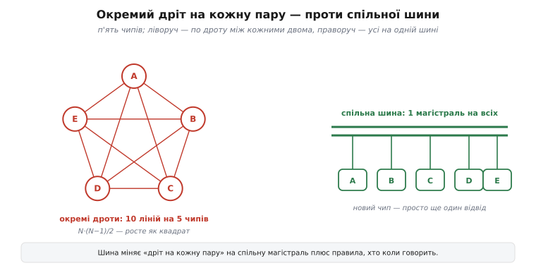
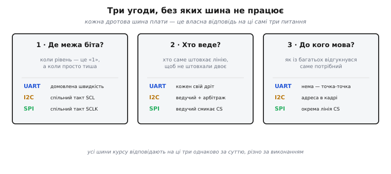
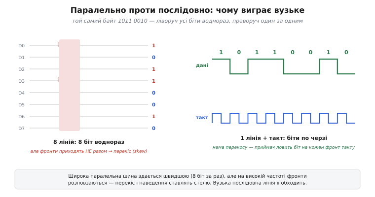

# Як чипи розмовляють: навіщо шини

Мікроконтролер сам по собі — глухонімий. Він уміє рахувати, тримати стан у пам'яті, смикати свої ніжки вгору-вниз, але жодного давача не спитає, жодного дисплея не запалить і жодного байта не покладе на картку, поки поряд не з'явиться інший чип і між ними не ляже дріт. А реальна плата — це якраз невеликий натовп мікросхем: процесор, пам'ять, кілька давачів, дисплей, радіомодуль. Вони мусять весь час обмінюватися числами. Тож перше практичне питання всієї периферії — не «які бувають давачі», а простіше й глибше: **як два чипи взагалі передають один одному один-єдиний байт по мідному дроту?**

Відповідь на нього тягне за собою все інше — і саме з неї виростає поняття шини. Розкладімо його від самого низу, бо коли видно, *чому* шина мусить бути саме такою, усі конкретні UART, I2C і SPI далі читаються не як набір абревіатур, а як три різні відповіді на одне й те саме питання.

## Найпростіша ідея — і чому вона гине

Байт — це вісім біт, вісім нулів та одиниць. Найпряміший спосіб передати біт із чипа A в чип B — простягнути дріт: A ставить на ньому високий рівень (скажімо, 3.3 В) для одиниці й низький (0 В) для нуля, B той рівень читає. Один дріт — один біт за раз. Хочемо гнати вісім біт водночас, щоб було швидше, — тягнемо вісім дротів. Хочемо, щоб B теж відповідав, — ще дроти назад. Логіка проста й спокуслива: більше дротів — більше даних воднораз.

Спокуса розбивається, щойно чипів стає більше двох. Порахуймо чесно. Якщо кожна пара чипів має власний окремий канал, то на N чипів припадає N·(N−1)/2 з'єднань — на п'ять чипів це вже десять ліній, на десять чипів сорок п'ять. А кожна лінія — це фізична ніжка на кристалі, доріжка на платі й місце в корпусі. Ніжок у мікроконтролера скінченна кількість: у дрібного їх два-три десятки на все. Помножте на вісім дротів заради «паралельності» — і бюджет ніжок вигорає ще до того, як ви підключили третій давач.

**Приклад (скільки ніжок з'їдає наївний підхід).**

```c
#include <stdint.h>

// Наївно: кожен пристрій — власний паралельний канал у 8 ліній даних.
// Полічимо ніжки для набору з давача, дисплея, картки й радіо.
#define WIRES_PER_DEVICE  8
#define DEVICE_COUNT      4

int naive_pins(void) {
    return WIRES_PER_DEVICE * DEVICE_COUNT;   // 8 × 4 = 32 ніжки лише на дані
}
// 32 ніжки — це вже майже весь корпус дрібного MCU, і то без ліній «назад»,
// без живлення, без такту. Так система не масштабується.
```

Тридцять дві ніжки лише на дані чотирьох пристроїв — і це без зворотних ліній, без службових сигналів, без живлення. Наївний підхід не те щоб повільний — він просто **не влазить у корпус**. Потрібен інший принцип, і він напрошується сам: якщо окремий дріт на кожну пару — це катастрофа, то дроти треба **ділити**.

## Спільна лінія — це і є шина

Ідея шини вся вміщається в одне слово: замість дроту між кожними двома чипами прокладаємо **один спільний набір ліній**, до якого чіпляються всі. Кожен, кому треба щось сказати, кладе біти на ту саму магістраль; кожен, кому треба почути, з неї читає. Новий пристрій додається не новим пучком дротів через усю плату, а простим відводом до вже наявної лінії.


*Ліворуч — по дроту між кожними двома з п'яти чипів: десять ліній, і число росте як квадрат від кількості пристроїв. Праворуч — усі п'ять сидять на одній спільній магістралі, а новий чип — це просто ще один відвід. Шина міняє «дріт на кожну пару» на «спільна лінія плюс правила».*

Саме звідси й назва. Слово прийшло довгою дорогою: латинське *omnibus* означає «для всіх» (давальний відмінок множини від *omnis* — «весь»), у Франції 1828 року так назвали новий громадський екіпаж — *voiture omnibus*, «повіз для всіх», відкритий будь-кому. Коли з'явилася електрика, інженери запозичили слово для мідного бруса-провідника, що розносив увесь струм джерела на всіх споживачів — *omnibus bar*, згодом коротше *busbar* (збірна шина). А вже з електротехніки воно перейшло в обчислювальну техніку на позначення спільної магістралі, якою чипи гуртом передають дані. Тобто **шина** (англ. *bus*, від *omnibus* — «для всіх») буквально названа за своєю суттю: лінія, спільна для всіх, хто до неї під'єднаний. Звідки саме взялося це слово й чому паралельні шини згодом поступилися послідовним — [коротка історія слова та повороту до серійних шин](root:embedded/why-buses/hist-bus-word.md).

Але тільки-но лінія стала **спільною**, з'являється нова, значно тонша проблема, якої в дедикованому дроті просто не було. Коли дріт лише між A і B, усе ясно: хто на ньому говорить, той і хазяїн. Коли ж на одну лінію дивляться п'ять чипів, треба про все домовитися — інакше двоє почнуть штовхати рівень одночасно й нашкодять, а решта не зрозуміє, кому взагалі адресовано біти.

## Три угоди, без яких спільна лінія не працює

Будь-яка шина, від найпростішої до найскладнішої, — це насправді **набір домовленостей** поверх кількох мідних ліній. І домовитися треба рівно про три речі; усе інше — деталі їхнього виконання.

**Перша угода — де закінчується біт.** Приймач бачить на лінії просто рівень напруги, що тримається якийсь час. Але звідки йому знати, це один довгий нуль чи п'ять коротких нулів підряд? Потрібен спільний ритм — момент, коли «зараз дивись, ось валідний біт». Тут шини розходяться. Одні тягнуть окремий дріт **такту** (англ. *clock*): ведучий смикає його вгору-вниз, і кожен фронт такту каже «лови біт». Такий обмін звуть синхронним. Інші дроту такту не мають узагалі — сторони наперед домовляються про **швидкість** (стільки-то біт за секунду), і приймач сам відлічує моменти за власним годинником; це асинхронний обмін, і саме на ньому стоїть UART.

**Друга угода — хто зараз веде.** Спільну лінію в один момент має штовхати лише один чип. Якщо два одночасно поставлять — один одиницю, другий нуль, — вони закоротять живлення через себе й спалять вихідні каскади. Тож потрібне правило черги. Найпростіше — жорстко призначити одного ведучого (англ. *master*), який завжди починає обмін, а решта — ведені (англ. *slave*), що лише відповідають, коли до них звернулися. Складніше — дозволити кільком ведучим на одній шині, але тоді потрібен арбітраж: правило, за яким при одночасній спробі один поступається без зіткнення.

**Третя угода — до кого мова.** На спільній лінії висить багато пристроїв, а байт зазвичай призначений одному. Як саме потрібний зрозуміє, що звертаються до нього, а решта промовчить? Знову різні відповіді: можна дати кожному пристрою власну **адресу** й починати обмін із неї (так робить I2C), можна кинути до кожного окрему лінію-**вибірку** й опускати саме ту, з ким говориш (так робить SPI), а можна взагалі обійтися без адрес, коли на шині лише двоє (так живе UART — зв'язок точка-точка).


*Кожна дротова шина плати — це власна відповідь на три питання: де межа біта, хто зараз веде лінію і до кого адресована мова. UART, I2C і SPI відповідають на них по-різному, але саме ці три угоди й роблять зі жмутка дротів робочу шину.*

Ця трійця — не абстракція, а точний ключ до всієї периферії. Коли далі в курсі ми беремося за UART, I2C чи SPI, кожну з них варто читати як конкретні відповіді на ці самі три питання. Тоді десятки абревіатур складаються в одну зрозумілу картину, а не в купу окремих правил, які доводиться зубрити.

## Вузько й по черзі — чому серійна лінія перемогла

Лишилося розв'язати ту саму спокусу, з якої ми почали: якщо ділити лінії, то, може, зробити спільну шину все ж **широкою** — вісім ліній даних, щоб гнати цілий байт за один такт? Так довго й робили: старі паралельні шини комп'ютерів саме такі. І тут спрацьовує неочевидна фізика, через яку широка шина програє вузькій рівно там, де від неї хотіли виграшу — на високій швидкості.

Річ у тім, що вісім «однакових» дротів насправді не однакові. Вони трохи різної довжини, лежать поряд і наводять сигнал один на одного, мають дрібні розбіжності в ємності. Поки такт повільний, це дрібниці. Але коли ви піднімаєте частоту, фронти на восьми лініях перестають приходити **точно разом**: один біт трохи випереджає, інший спізнюється. Цей розбіг звуть перекосом (англ. *skew*). Настає момент, коли ведучий уже виставив наступний байт, а приймач ще не певен, що на всіх восьми лініях устоявся попередній, — і зчитати «зріз» усіх ліній воднораз надійно вже не можна. Додайте сюди наведення між сусідніми дротами (англ. *crosstalk*), що з частотою тільки росте, — і виходить, що широка шина впирається у стелю саме через свою ширину.


*Той самий байт двома способами. Ліворуч — вісім паралельних ліній: усі біти нібито воднораз, та на високій частоті фронти приходять НЕ синхронно, і перекіс розмиває момент зчитування. Праворуч — одна лінія з тактом: біти йдуть по черзі, приймач ловить кожен на фронт такту, і розсинхронізовувати нічому.*

Вихід виявився протилежним до інтуїції: не розширювати шину, а **звузити** її до однієї-двох ліній і слати біти **один за одним**, зате підняти частоту дуже високо. Одна лінія сама з собою розсинхронізуватися не може — перекосу між нею й нею немає. Наведення на кількох дротах приборкують окремим прийомом (дві протифазні лінії — диференційна пара), і тоді вузький серійний канал розганяється до швидкостей, недосяжних для товстого паралельного джгута.

Це не теорія, а те, як реально переписали залізо на зламі 2000-х. Паралельний інтерфейс дисків PATA (стрічка на 40 дротів) уперся в стелю близько 133 МБ/с — і його змінив послідовний SATA, чия перша редакція вийшла в січні 2003 року вже з 1.5 Гбіт/с по кількох лініях. Так само паралельну шину плат PCI змінив послідовний PCI Express (2004): замість спільного широкого тракту — набір вузьких серійних доріжок. Скрізь та сама розв'язка: вузько, по черзі, високо частотою. Тому й уся периферія мікроконтролера — UART, I2C, SPI — послідовна: біти течуть чергою по кількох лініях, а не пласким байтом по восьми.

Щоб «біти по черзі, під такт» перестало бути абстракцією, ось найпростіший серійний передавач, зібраний вручну на двох звичайних ніжках — саме так, до речі, влаштований кістяк SPI:

**Приклад (вручну висунути байт серійно, старшим бітом уперед).**

```c
#include <stdint.h>

#define PIN_DATA  23   // лінія даних (MOSI)
#define PIN_CLK   18   // лінія такту (SCLK)

// Кладемо біт на лінію даних і «клацаємо» тактом — приймач ловить біт на фронті.
static void shift_out_byte(uint8_t value) {
    for (int i = 7; i >= 0; --i) {           // старший біт першим
        gpio_set(PIN_DATA, (value >> i) & 1); // виставити поточний біт
        gpio_set(PIN_CLK, 1);                 // фронт такту: «дивись, біт валідний»
        gpio_set(PIN_CLK, 0);                 // повернути такт — готові до наступного
    }
}
// Вісім проходів — вісім біт по ОДНІЙ лінії. Такт замінив сім зайвих дротів даних:
// приймачеві не треба вгадувати межу біта, її задає фронт CLK.
```

Тут видно суть серійної передачі в чистому вигляді. Одна лінія даних несе біти чергою; лінія такту на кожному фронті каже приймачеві «ось валідний біт». Сім дротів, які в наївному паралельному підході тягнули б решту біт, зникли — їхню роль перебрав час. Це і є та зміна «дроти на час», яка робить сучасні шини вузькими й швидкими водночас.

## Три відповіді на одне питання

Тепер уся периферійна частина курсу складається в просту рамку. Є одне питання — як чипам на платі надійно обмінюватися байтами по мінімуму дротів — і три класичні відповіді, кожна зі своїм компромісом за трьома угодами вище.

[UART](root:com-devices/async-serial) (англ. *Universal Asynchronous Receiver-Transmitter* — універсальний асинхронний приймач-передавач) відповідає найпростіше: жодного такту, сторони домовляються про швидкість наперед, а зв'язок — лише точка-точка, тому й адреси не треба. Це найзручніший спосіб з'єднати два пристрої потоком — плату з комп'ютером, з GPS-модулем, із радіомодемом.

[I2C](root:com-devices/i2c-bus) (англ. *Inter-Integrated Circuit* — «між мікросхемами») відповідає ощадливо: дві лінії на всіх (дані плюс спільний такт), а розрізняє пристрої **адреса** в кадрі. На цих двох дротах висне гроно дрібних давачів — саме там економія ніжок дає найбільше.

[SPI](root:com-devices/spi-bus) (англ. *Serial Peripheral Interface* — послідовний інтерфейс периферії) відповідає на швидкість: окремі лінії на кожен напрям і власна лінія-вибірка на кожен пристрій, зате обмін жене на десятках мегагерц. Це шина для швидких і об'ємних — дисплея, картки, флешу.

> 🔧 **Навіщо це.** Бачити периферію як три відповіді на одне питання — практичний навик, а не красива метафора. Беручи новий давач, ви передусім дивитеся в його опис не «що це за протокол», а по тих самих трьох угодах: чи є в нього окремий такт, хто кого веде, як він адресується. Тоді підключення нового чипа перестає бути щоразу новою загадкою — ви одразу знаєте, які лінії шукати на платі й чого від них чекати. А коли зв'язок виходить за межі плати — метри дроту, кабель між блоками, завади — жодна з трьох на платі туди не тягнеться, і починається окрема царина [диференційних шин](root:com-medium/differential-pair), де дві протифазні лінії б'ються з наведенням уже всерйоз.

Далі в модулі ми пройдемо кожну з трьох по черзі — від кадру UART до адресації I2C й ліній SPI — і наприкінці поставимо їх поряд, щоб під конкретний пристрій обирати свідомо. Це окрема практична розмова: [коли брати SPI, а коли I2C](root:embedded/spi-vs-i2c), і чому на реальній платі відповідь дуже часто — «обидві разом». Але фундамент під усім цим один і той самий: спільна лінія плюс три угоди, хто на ній коли й до кого говорить. Усе решта — деталі того, як саме ці угоди виконано.
