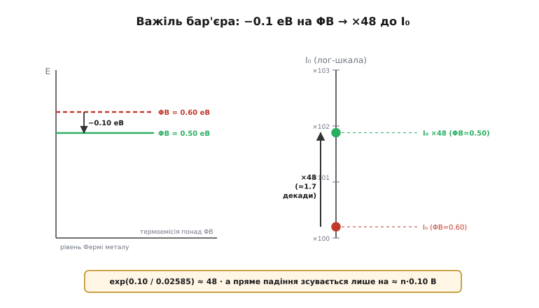

# 🧮 Термоемісія крізь бар'єр Шотткі: одна формула на все

> Це математична вставка до кроку про [особливі діоди](root:embedded/zener-schottky). У самому кроці ми взяли готовий результат — струм насичення `I₀ = A*·S·T²·exp(−Φ_B/kT)` — і читали його «як інженери»: низький бар'єр → великий I₀ → мале падіння, але й великий витік. Тут ми цю формулу **виведемо** — з'ясуємо, звідки береться множник T² і чому саме експонента, — а тоді покажемо, як із неї **водночас** випливають пряме падіння, зворотний витік і їхня жахлива температурна залежність. Наприкінці порахуємо руками, що робить зсув бар'єра на якісь 0.1 еВ, і замкнемо петлю теплової втечі числом.

Домовмося про масштаб задачі наперед, щоб було видно, навіщо весь цей апарат. Ми казали в кроці, що вся інженерія Шотткі крутиться навколо однієї величини — висоти бар'єра Φ_B. Це не перебільшення заради красного слівця. Зараз ми побачимо буквально: Φ_B сидить **в експоненті**, поділена на крихітну теплову енергію kT, і тому кожна десята частка електронвольта важить у десятки разів. Формула, яку ми виводимо, — це не прикраса теорії, а той важіль, яким виробник задає характер діода, а ви — обираєте його під задачу.

## Означення: термоемісія проти дифузії

Спершу треба чітко розрізнити два способи, якими струм долає перехід, бо саме цим Шотткі відрізняється від звичайного діода на рівні механізму, а не лише цифр.

У [PN-переході](topic:ph-condensed/pn-junction) струм несуть **неосновні** носії, які **дифундують** крізь збіднену зону. Прикладемо пряму напругу — вона знижує вбудований бар'єр, і з кожного боку в чужу область впорскуються носії протилежного знаку (електрони в p, дірки в n). Далі вони повільно розпливаються за градієнтом концентрації й рекомбінують. Швидкість усього процесу задає **дифузія** — те, як носії просочуються крізь товщу напівпровідника. Саме тому в PN-діода є накопичений заряд неосновних носіїв (звідки береться зворотне відновлення — його розбирає окрема [стаття про Q_rr](topic:hw-components/reverse-recovery)), і саме тому його падіння ~0.7 В: треба досить напруги, щоб узагалі запустити інжекцію крізь широкий бар'єр кремнію.

У контакті метал–напівпровідник картина інша. Тут немає p-області, куди щось інжектувати; є метал, повний електронів, і n-напівпровідник, теж з електронами. Між ними — бар'єр Шотткі висотою Φ_B: сходинка потенціальної енергії, яку електрон мусить **перескочити зверху**, щоб перейти з одного матеріалу в інший. Ніхто нікуди не дифундує крізь товщу — електрон або має досить теплової енергії, щоб опинитися **понад** сходинкою, або ні. Це і є **термоемісія** (*thermionic emission*, від гр. thermē — тепло): випуск носіїв за рахунок теплового руху понад енергетичний бар'єр.

> 🔧 **Навіщо це.** Різниця «дифузія vs термоемісія» — не термінологічна причепа, а корінь усіх практичних відмінностей Шотткі. Бо струм несуть **лише основні** носії (електрони, що перескочили бар'єр, лишаються електронами) — немає інжекції неосновних, немає накопиченого заряду, немає Q_rr, і діод замикається миттєво. Та сама фізика, що дає формулу нижче, дає й швидкість. Один механізм — усі наслідки.

Історично це розмежування зробили не одразу. Саму формулу термоемісії з гарячого катода вивів 1901 року **Овен Віланс Річардсон** (Owen Willans Richardson) — британський фізик, учень Дж. Дж. Томсона в Кавендіші; за ці роботи він дістав Нобелівську премію 1928 року (усталений факт). Квантовий сенс сталій-множнику надав пізніше **Саул Душман** (Saul Dushman) — фізико-хімік, єврей, народжений 1883 року в Ростові (тоді Російська імперія), який дитиною емігрував і зробив кар'єру в Північній Америці (докторат у Торонто, лабораторія General Electric); звідси подвійна назва «рівняння Річардсона–Душмана». А застосував цю теорію саме до **контакту метал–напівпровідник** уже 1942 року **Ганс Бете** (Hans Bethe) — німецько-американський фізик. Тобто формула, яку ми зараз виведемо для Шотткі, — це теорія гарячого катода (Річардсон), уточнена квантово (Душман) і перенесена на діод (Бете).

## Інтуїція: чому взагалі експонента

Перш ніж інтегрувати, зрозуміймо результат наперед — щоб потім формули лише підтвердили те, що ми вже бачимо очима. Ключ — у тому, **скільки** електронів мають досить енергії, щоб перескочити бар'єр Φ_B.

Електрони в металі не сидять на місці — вони мають теплову енергію, і їхні швидкості розкидані. Скільки саме електронів має енергію вище якогось порогу E, задає **розподіл Больцмана**: частка носіїв з енергією понад E спадає як exp(−E/kT), де kT — характерна теплова енергія (k — стала Больцмана, T — абсолютна температура). Це той самий «хвіст» розподілу, який керує всім у теплофізиці: висока енергія рідкісна, і рідкісна вона **експоненційно**.

Тепер підставмо замість порогу нашу висоту бар'єра. Частка електронів, здатних перескочити Φ_B, — це exp(−Φ_B/kT). Ось звідки експонента, і ось чому вона така злюща. При кімнатній температурі:

```
kT = 0.02585 еВ  (при T = 300 K; бо k = 8.617·10⁻⁵ еВ/K)
```

Теплова енергія — **лише 26 мілі-електронвольт**, а бар'єр — сотні мілівольт. Тобто в експоненті стоїть велике число (Φ_B/kT ≈ 20 і більше), і exp від мінус великого числа — це страшенно мала частка. Перескакують одиниці з мільярдів. Але саме ця мала частка й тече як струм насичення — і саме тому вона так дико реагує на будь-яку зміну Φ_B чи T: коли ти вже сидиш глибоко у хвості експоненти, найменший зсув порогу множить чи ділить результат у рази.


*Важіль бар'єра. Ліворуч — дві висоти бар'єра, що різняться на якісь 0.10 еВ. Праворуч (лог-шкала!) — що це робить зі струмом насичення I₀: він стрибає майже на дві декади, у ≈48 разів. Одна десята електронвольта на вході — п'ятдесятикратна зміна струму на виході. Ось чому Φ_B — головна ручка Шотткі, і чому «трохи інший метал» дає зовсім інший діод.*

Множник T² попереду — тонший ефект, і чиста інтуїція його не видасть; він вилазить лише з інтегрування, до якого й переходимо. Але наперед скажу, куди дивитися: T² — це «скільки електронів взагалі підлітає до межі за секунду», а exp(−Φ_B/kT) — «яка їх частка має досить енергії пройти». Добуток — потік крізь бар'єр.

## Формальний апарат: звідки береться A*·T²

Тепер виведемо струм по-справжньому. Не бійтеся — це три кроки, кожен фізично прозорий, і жодної магії.

**Крок 1. Хто взагалі долетить до межі.** Розгляньмо електрони в напівпровіднику біля межі з металом. Струм у бік металу створюють лише ті, що (а) летять **у бік** межі й (б) мають досить енергії, щоб перескочити бар'єр. Щільність потоку — це concentration × швидкість, проінтегрована по всіх «правильних» швидкостях. Швидкості розподілені за Максвеллом–Больцманом (той самий хвіст, лише записаний через швидкість, а не енергію):

```
f(v) ∝ exp( −m*·v² / (2kT) )      (розподіл швидкостей; m* — ефективна маса електрона)
```

Нас цікавить складова швидкості вздовж осі x (до межі), v_x, і лише ті електрони, чия x-складова енергії перевищує бар'єр: ½·m*·v_x² > Φ_B (плюс внесок від напруги — про нього за мить). Потік — це інтеграл n·v_x·f(v) по всіх дозволених v.

**Крок 2. Інтеграл.** Тут і народжується T². Проінтегрувати треба добуток «швидкість v_x» × «експонента розподілу» по трьох напрямках швидкості, з нижньою межею по v_x, заданою бар'єром. Два поперечні напрямки (v_y, v_z) дають по множнику √T кожен (гаусів інтеграл ∫exp(−m*v²/2kT)dv ∝ √(kT)). Поздовжній напрямок з нижньою межею й зайвим множником v_x дає ще один kT. Разом:

```
√T · √T · T = T²      ← ось звідки квадрат температури
```

А концентрацію електронів біля дна зони провідності теж треба виразити через густину станів — і вона теж несе T^(3/2), яке разом із рештою складається так, щоб на виході лишилося рівно T². Не будемо розписувати кожен гаусів інтеграл — важливо, що **два поперечні виміри швидкості дають T, а поздовжній з бар'єром — ще одну степінь, і сумарно виходить T², не T і не T³.** Це не підгонка: степінь двійка — прямий наслідок того, що ми рахуємо потік (одна швидкість у підінтегральній функції) у тривимірному розподілі швидкостей.

**Крок 3. Збираємо константу.** Усі числові множники — маса електрона, заряд, стала Планка, стала Больцмана — злипаються в один коефіцієнт перед T². Його називають **сталою Річардсона** A* (зірочка — бо для напівпровідника беруть *ефективну* масу m*, а не масу вільного електрона). Її «теоретична» величина для вільного електрона:

```
A₀ = 4π·q·m·k² / h³ ≈ 120 А/(см²·K²)
```

Для реального напівпровідника m замінюють на ефективну масу m* (і множать на кількість долин зони провідності), тож A* виходить іншою — для кремнію порядку сотні А/(см²·K²), а точне значення залежить від орієнтації кристала й типу провідності (усталений факт; конкретні числа беруть із довідників на кшталт Sze). Практику важлива не третя цифра A*, а сама структура: константа × T² × експонента.

Зібравши все, дістаємо щільність струму насичення, а помноживши на площу контакту S — сам струм:

```
J₀ = A* · T² · exp( −Φ_B / kT )              (щільність струму насичення)
I₀ = A* · S · T² · exp( −Φ_B / kT )          (струм насичення; S — площа контакту)
```

Це рівно та формула, яку ми взяли готовою в кроці. Тепер вона не з неба: T² — з тривимірного інтегрування потоку, експонента — з больцманівського хвоста, A* — зі злиплих констант із ефективною масою. Кожен множник має адресу.

## Формальний апарат: пряма вітка й коефіцієнт ідеальності

I₀ — це струм у **рівновазі**: стільки електронів перескакує бар'єр з кожного боку, і зустрічні потоки рівні, сумарний струм нуль. Тепер прикладемо напругу U і подивімося, що зміниться.

Напруга зміщення діє **несиметрично**, і в цьому вся суть. Прикладемо пряму напругу U (плюс на метал, мінус на n-напівпровідник). Вона **знижує** бар'єр з боку напівпровідника на величину qU — електронам з напівпровідника стало легше перескакувати. А бар'єр з боку **металу** напруга майже не чіпає: він як був Φ_B, так і лишився. Виходить, потік «напівпровідник → метал» зростає, а зустрічний «метал → напівпровідник» — ні.

Порахуймо. Потік з напівпровідника мав долати не Φ_B, а знижений бар'єр (Φ_B − qU), тож він множиться на exp(+qU/kT):

```
з напівпровідника в метал:   I₀ · exp( qU / kT )     ← бар'єр знижено напругою
з металу в напівпровідник:   I₀                       ← цей бар'єр напруга не чіпає
```

Сумарний струм — різниця зустрічних потоків:

```
I = I₀ · exp(qU/kT) − I₀ = I₀ · [ exp(qU/kT) − 1 ]
```

Ось вона, класична **діодна експонента** — виведена суто з термоемісії, без жодної дифузії. Прочитаймо її в обидва боки, бо це та сама формула, що дає і падіння, і витік:

- **Пряма вітка (U > 0):** exp(qU/kT) швидко стає величезним, одиницею можна знехтувати, і струм росте як I ≈ I₀·exp(qU/kT). Щоб пропустити заданий I_F, потрібна напруга U_F = (kT/q)·ln(I_F/I₀). Ось звідки логарифмічна залежність падіння від струму — і ось чому **великий I₀ дає мале падіння**: якщо стартова «полиця» I₀ висока, до робочого I_F лишається пройти небагато декад, а кожна декада коштує лише kT/q·ln10 ≈ 60 мВ.
- **Зворотна вітка (U < 0):** exp(qU/kT) стрімко йде в нуль, лишається I ≈ −I₀. Тобто зворотний струм витоку **дорівнює** тому самому I₀. Не «пов'язаний із ним», не «пропорційний» — це буквально одне й те саме число.

Оце і є та єдність, про яку ми говорили в кроці якісно, а тепер бачимо алгебраїчно: **I₀ — це водночас масштаб прямої вітки й величина зворотного витоку.** Одна формула, одна константа, обидва наслідки. Не можна зробити I₀ великим для гарного падіння й малим для гарного витоку — це те саме I₀.

**Реальність трохи брудніша — коефіцієнт ідеальності.** Чиста термоемісія передбачає, що вся прикладена напруга йде на зниження бар'єра. Насправді частина падає деінде (на тонкому проміжному шарі, на послідовному опорі), домішуються паразитні механізми — тунелювання крізь верхівку бар'єра, генерація-рекомбінація, витік по краях контакту. Щоб описати це відхилення однією цифрою, у знаменник експоненти вставляють **коефіцієнт ідеальності** (*ideality factor*) n:

```
I = I₀ · [ exp( qU / (n·kT) ) − 1 ]
```

Ідеальна термоемісія дала б рівно n = 1. Реальні Шотткі мають n ≈ 1.02…1.2; що ближче до одиниці, то «чистіший» контакт і тим точніше він слухається виведеної формули. Фізичний сенс n прямий: він каже, **яка частка** прикладеної напруги реально працює на зниження бар'єра (працює 1/n). При n = 1.1 лише ~91% напруги йде «в діло», решта губиться, і вітка стає пологішою. Практику n цінний як індикатор: діод з n = 1.05 передбачуваний, з n = 1.4 — ні, і саме крайовими паразитними механізмами (тими, що роздувають n) тече зайвий витік.

## Де в темі це працює: числовий приклад на 0.1 еВ

Тепер — обіцяний рахунок руками, той, що робить усю вставку не теорією, а інструментом. Питання просте: **на скільки зміниться діод, якщо змінити висоту бар'єра на 0.1 еВ** — скажімо, обравши інший метал контакту чи інакший техпроцес? У кроці ми казали «різні Шотткі — це різні точки на компромісі падіння/витік»; ось ціна кроку по цьому компромісу в числах.

Ключ — відношення двох струмів насичення при **тій самій** температурі. Площа S, стала A* і T² скорочуються, лишається чиста експонента різниці бар'єрів:

**Зниження бар'єра на ΔΦ_B = 0.10 еВ при кімнатній температурі (T = 300 K, kT = 0.02585 еВ):**

```
I₀(нижчий) / I₀(вищий) = exp( +ΔΦ_B / kT ) = exp( 0.10 / 0.02585 )
                       = exp( 3.868 ) ≈ 48
```

Зниження бар'єра лише на десяту частку електронвольта множить струм насичення **у ~48 разів**. Це стосується **обох** його втілень одразу:

- **Витік зростає в ті самі ~48 разів.** Діод, що тік 1 мкА, тектиме ~48 мкА — за незмінної температури, лише від зсуву бар'єра.
- **Пряме падіння спадає.** Наскільки? У прямій вітці I_F ≈ I₀·exp(qU_F/nkT). Щоб пропустити той самий I_F за вп'ятдесятеро більшого I₀, потрібно менше U_F. Порахуймо зсув падіння (візьмімо n = 1):

```
ΔU_F = −(n·kT/q) · ln( I₀(нижчий)/I₀(вищий) )
     = −(1 · 0.02585 В) · ln(48)
     = −0.02585 · 3.868 ≈ −0.100 В
```

Ось красива симетрія, яку варто відчути: **зниження бар'єра на 0.10 еВ зсуває пряме падіння теж на ≈0.10 В** (при n = 1). Це не збіг — це та сама експонента, прочитана з двох кінців. У прямій вітці зниження бар'єра «безкоштовно» опускає падіння майже один-до-одного (в еВ → у В), а в зворотній — множить витік на десятки разів. Тому крок на 0.1 еВ вниз по бар'єру — це «мінус 0.1 В падіння, але ×48 витоку». Хочеш іще менше падіння — плати вже сотнями крат витоку. Уся лінійка Шотткі на ринку — це різні виробники, що зупинилися в різних місцях цього безжального обміну.

Порівняймо для контрасту зі звичайним кремнієвим PN: там бар'єр по суті — ширина забороненої зони, ~1.1 еВ, тобто Φ_B/kT ≈ 43, і I₀ на багато порядків менший. Тому в PN падіння ~0.7 В, а витік — пікоампери, і саме тому його не бере теплова втеча. Шотткі свідомо опустили бар'єр удвічі-втричі — і дістали і подарунок (падіння 0.2–0.3 В), і прокляття (витік і його температурний норов), як два боки однієї exp(−Φ_B/kT).

## Де в темі це працює: температурна крутість і петля втечі

Тепер поверніть увагу на T у формулі — і ви побачите, звідки береться найнебезпечніша риса Шотткі, про яку крок сказав словами, а ми скажемо числом.

I₀ залежить від температури **двічі**: явно через T² і, головне, через T у знаменнику експоненти. Порахуймо, наскільки круто росте витік. Візьмімо той самий діод (Φ_B = 0.5 еВ) і нагріймо його з 300 K до 350 K (від ~27 °C до ~77 °C — цілком буденний нагрів у корпусі):

**Зростання I₀ при нагріві з 300 K до 350 K (Φ_B = 0.5 еВ):**

```
множник від T²:        (350/300)²                 = 1.36
множник від експоненти: exp[ (Φ_B/k)·(1/300 − 1/350) ]
                        Φ_B/k = 0.5 / 8.617·10⁻⁵   = 5802 K
                        = exp[ 5802 · (0.003333 − 0.002857) ]
                        = exp[ 5802 · 0.0004762 ]  = exp(2.763) ≈ 15.8
разом:  I₀(350) / I₀(300) ≈ 1.36 · 15.8            ≈ 21
```

Нагрів на якісь 50 градусів множить витік **приблизно у 21 раз** — і майже весь цей ріст дає експонента, а не T². Ось чому в кроці ми наголошували: витік дивляться при **робочій** температурі, а не при лабораторних 25 °C; діод, що на столі тік мікроамперами, при 100 °C легко тече міліамперами.

А тепер замкнемо петлю — те, заради чого ця крутість справді небезпечна. У зворотному зміщенні (наприклад, у паузі роботи випрямляча) на діоді стоїть напруга U_R і тече витік I₀. Вони дають потужність втрат P = U_R·I₀, яка **гріє** перехід. Гарячіший перехід дає — як ми щойно порахували — різко **більший** I₀. Більший I₀ — більшу P. Більша P — вищу T. Це додатний зворотний зв'язок:

```
T↑ → I₀↑ (експоненційно, ×21 на 50 K) → P = U_R·I₀ ↑ → T↑↑ → …
```

Питання життя чи смерті діода — чи встигає тепловідвід скидати цю дедалі більшу потужність. Тепловідвід скидає тепло **лінійно** з перегрівом (скільки градусів над середовищем — стільки й ват відводить, через тепловий опір; механізм — у [тепловому бюджеті](root:embedded/thermal-budget)). А генерація тепла росте **експоненційно**. Пряма проти експоненти має щонайбільше дві точки перетину — і якщо робоча точка опиниться правіше верхньої, лінійний відвід уже ніколи не наздожене експоненційну генерацію, і температура біжить угору, сама себе розганяючи. Це **теплова втеча** (*thermal runaway*): діод гине, часто раптово.

Тепер видно, чому це біда саме Шотткі, а не кремнієвого PN. У PN витік — пікоампери, P = U_R·I₀ мізерна, петлі просто нема чим живитися. У Шотткі з його великим I₀ (згадайте: у десятки-сотні разів більший через нижчий бар'єр) добуток U_R·I₀ уже відчутний, і петля реальна — надто якщо діод працює близько до граничної напруги (велике U_R), у теплі (висока стартова T) і з поганим тепловідводом (пологий лінійний скид). Усі три «не роби так» із кроку тепер мають кількісну причину: кожне з них або піднімає стартову точку на кривій генерації, або опускає лінію відводу — і зрушує систему до фатального перетину.

> 🔧 **Навіщо це.** Ця вставка перетворює три інженерні правила з кроку на розрахунок, який можна зробити на серветці. **Перше:** обираючи Шотткі, дивіться витік при робочій T — помножте паспортний витік при 25 °C приблизно на 20 за кожні +50 °C і подивіться, чи вас це влаштовує. **Друге:** беріть діод із зворотною напругою з запасом (вдвічі-втричі вище робочої) — це прямо зменшує U_R в P = U_R·I₀ і відсуває петлю. **Третє:** рахуйте тепловий баланс у **найгіршому** корпусі (закритий, улітку), бо саме там лінія відводу найпологіша й перетин найближчий. Один діод, обраний «за найменшим падінням» без цих трьох перевірок, — класична причина, чому блок живлення чудово працює на столі й тихо гине в полі.

## Що варто винести

Ми пройшли шлях від «звідки взагалі експонента» до числа, що замикає петлю теплової втечі, — і по дорозі побачили, що вся поведінка діода Шотткі стискається в одну формулу термоемісії. Стягнемо нитку:

- **Механізм — термоемісія, не дифузія:** носії перескакують бар'єр Φ_B зверху, струм несуть лише основні носії — звідси й формула, і відсутність Q_rr, і швидкість.
- **`I₀ = A*·S·T²·exp(−Φ_B/kT)` має адресу кожного множника:** T² — з тривимірного інтегрування потоку (два поперечні виміри дають T, поздовжній з бар'єром — ще степінь), exp — з больцманівського хвоста, A* — зі злиплих констант з ефективною масою.
- **Одне I₀ — обидва наслідки:** з `I = I₀·[exp(qU/nkT) − 1]` пряме падіння (∝ ln, тому мале при великому I₀) і зворотний витік (= I₀) виходять з тієї самої експоненти; їх не можна оптимізувати нарізно.
- **Коефіцієнт ідеальності n** каже, яка частка напруги реально знижує бар'єр (1/n); n → 1 — чистий контакт.
- **Числа, які варто пам'ятати:** kT ≈ 0.026 еВ при 300 K; зсув Φ_B на 0.1 еВ → ×48 до I₀ і −0.1 В до падіння; нагрів на 50 K → ×~21 до витоку; лінійний відвід проти експоненційної генерації → теплова втеча.

Саме тому в кроці ми могли впевнено сказати, що вся інженерія Шотткі — це вибір однієї точки на кривій exp(−Φ_B/kT). Тепер ця крива для вас не гасло, а формула, яку ви щойно вивели й порахували.
