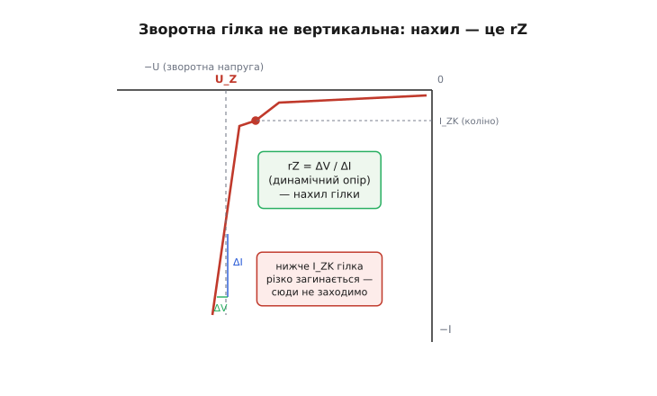
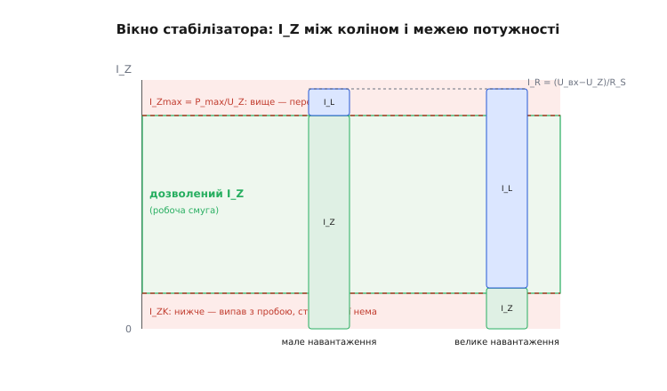
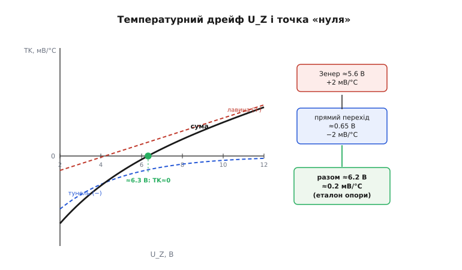
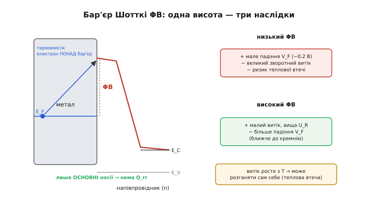

# Особливі діоди: Зенера, Шотткі — глибше

У базовому кроці ми домовилися про головне: діод Зенера приборкує [пробій](book:electronics/diode-iv-curve) і тримає в зворотному напрямку сталу напругу U_Z, а діод Шотткі ставить метал замість p-області, від чого дістає мале падіння й велику швидкість. Це чесна картина — але навмисно спрощена. Ми казали «напруга стала», «гілка вертикальна», «Шотткі швидкий» — і кожне з цих слів має другий шар, який визначає, чи спрацює ваша схема в реальному приладі, чи попливе на морозі, задзвенить від шуму або згорить від теплової втечі.

Тут ми беремо ті самі два діоди й розбираємо їх до дна. Замість «тримає сталу напругу» виведемо, **наскільки** стало й **чому не ідеально** — через динамічний опір. Замість «поставте резистор» порахуємо **обидві** межі робочого вікна й побачимо, між якими двома смертями живе стабілізатор. Замість «два механізми» виведемо їхні **протилежні температурні знаки** й зрозуміємо, звідки береться магічний номінал опори. А для Шотткі дійдемо до рівняння, що керує і його падінням, і його витоком, і його схильністю спалити себе. Нитку ведемо так само знизу вгору: спершу — чому чиста картинка бреше, тоді — на скільки, і лише тоді — як із цим жити.

## Зворотна гілка не вертикальна

Почнімо з обіцянки, яку ми дали й яку варто взяти назад. У базовому кроці зворотна гілка Зенера була «майже вертикальна»: напруга стала, струм який завгодно. Якби це була правда, Зенер був би ідеальним джерелом напруги — а таких не буває. Гілка нахилена. Той нахил — не дефект конкретного діода, а фізика: щоб пропустити більший струм пробою, полю треба бути трохи сильнішим, отже й напрузі — трохи вищою.

Кількісно нахил гілки описує **динамічний опір** (*dynamic impedance*, r_Z) — похідна напруги за струмом у робочій точці:

```
r_Z = ΔU_Z / ΔI_Z        (Ом; нахил зворотної гілки біля робочої точки)
```

Це **не** звичайний опір діода (U/I — той величезний), а саме нахил гілки: наскільки посунеться напруга, коли струм зміниться на ΔI_Z. Для доброго стабілітрона на кілька мА r_Z — це одиниці або десятки ом; для точних опорних мікросхем його заганяють нижче ома. І тут ховається головне практичне число: **чим менший r_Z, тим ближче Зенер до ідеального джерела** — тим менше пливе його напруга від будь-яких коливань струму.


*Правда про зворотну гілку: вона не вертикальна, а має нахил r_Z = ΔU/ΔI. Змінили струм на ΔI — напруга зсунулась на r_Z·ΔI. Нижче коліна I_ZK гілка різко загинається (там r_Z злітає в сотні ом), тож робочу точку тримають вище коліна.*

Гілка не просто нахилена — вона ще й **не пряма**. Біля дна, де струм малий, вона різко загинається: це **коліно** (*knee*). Там перехід тільки-но входить у пробій, носіїв обмаль, і крихітна зміна струму дає велику зміну напруги — тобто r_Z у коліна не одиниці ом, а сотні. Даташит чесно дає **два** значення динамічного опору: r_Z у номінальній точці (при струмі випробування I_ZT, скажімо, 5 чи 20 мА) і r_ZK у коліна (при струмі коліна I_ZK ≈ 0.25–1 мА), і друге буває в сто разів гіршим за перше.

> 🔧 **Навіщо це.** Динамічний опір — це не академічна тонкість, а те число, за яким Зенер стабілізує або не стабілізує. Уся «стабільність» опори — це малий r_Z; уся її «нестабільність» від коливань живлення й навантаження рахується через r_Z, як ми зараз побачимо. І перше правило проєктування прямо з нього випливає: **тримай робочий струм добре вище I_ZK**, бо в коліна r_Z розпухає й діод із джерела напруги перетворюється майже на резистор.

### Чому це головна причина недосконалості

Тепер порахуймо, що дає скінченний r_Z у справжній схемі. Зенер-стабілізатор — це подільник: напруга живлення U_вх крізь резистор R_S приходить на Зенер, а той тримає вихід. Але для **змінних** складових (пульсацій входу, коливань навантаження) Зенер — не ідеальне коротке замикання, а опір r_Z. Отже маленькі сигнали бачать звичайний резистивний подільник R_S → r_Z.

Звідси одразу два числа якості стабілізатора. **Лінійне регулювання** (*line regulation*) — як вихід повторює брижі входу:

```
ΔU_вих / ΔU_вх ≈ r_Z / (r_Z + R_S)
```

Логіка проста: змінна частина входу ділиться між R_S і r_Z, а виходу дістається частка на r_Z. Якщо на вході 1 В пульсацій, R_S = 470 Ом, r_Z = 15 Ом, то на виході лишиться 1 · 15/485 ≈ 31 мВ. Тобто простий Зенер **давить пульсації входу приблизно в R_S/r_Z разів** — тут у тридцять. Не диво, але й не нікчемно, і рахується одним діленням.

**Навантажувальне регулювання** (*load regulation*) — як просідає вихід, коли навантаження раптом забирає більше струму. Зайвий струм навантаження ΔI_L Зенер віддає зі свого струму, а на його r_Z це дає падіння:

```
ΔU_вих ≈ −r_Z · ΔI_L        (просідання виходу від стрибка навантаження)
```

Стрибок навантаження на 10 мА при r_Z = 15 Ом просадить вихід на 150 мВ. Ось чому простий Зенер погано тримає різко змінне навантаження — не тому, що «не встигає» (він якраз миттєвий), а тому, що кожен міліампер навантаження зсуває напругу на r_Z вольт. Ті самі 150 мВ на п'ятивольтовій опорі — це 3% похибки, для АЦП уже забагато.

Обидві формули — той самий подільник R_S/r_Z, поданий з двох боків: раз як послаблення входу, раз як вихідний опір. Запам'ятати варто одне: **якість простого Зенер-стабілізатора цілком визначається відношенням r_Z до R_S**, а покращити її можна або меншим r_Z (кращий діод, вищий струм), або… відмовою від простого Зенера на користь схеми з підсиленням — до чого ми ще дійдемо.

## Робоче вікно стабілізатора: між двома смертями

У базовому кроці ми порахували резистор для «типового» струму й згадали, що є нижня й верхня межі. Тепер порахуймо їх обидві по-справжньому — бо саме між ними живе схема, і саме тут її найлегше вбити.

Ідея вся в одному балансі струмів. Резистор R_S проводить струм I_R = (U_вх − U_Z)/R_S. Цей струм розходиться на два: частина йде в навантаження (I_L), решта — крізь Зенер (I_Z). Тобто:

```
I_Z = I_R − I_L = (U_вх − U_Z)/R_S − I_L
```

Зенерові дістається **те, що не забрало навантаження**. І тут два очевидні лиха. Якщо навантаження забере надто багато — Зенерові не лишиться струму, він **випаде з пробою** й перестане тримати напругу. Якщо навантаження забере надто мало (або відпаде зовсім) — увесь I_R полізе крізь Зенер, і той **перегріється**. Стабілізатор мусить жити так, щоб за будь-яких умов I_Z не впав нижче коліна I_ZK і не піднявся вище допустимого I_Zmax.


*Робоче вікно. Резистор задає повний струм I_R (той самий у обох стовпчиках); навантаження забирає I_L, Зенерові лишається I_Z. Мале навантаження → I_Z близько до стелі I_Zmax (перегрів). Велике навантаження → I_Z ледь над коліном I_ZK (ось-ось випаде з пробою). Схема жива, лише поки I_Z у зеленій смузі за ОБОХ крайніх режимів.*

Верхню межу задає потужність. Зенер розсіює P = U_Z · I_Z, тож гранично допустимий струм:

```
I_Zmax = P_max / U_Z
```

причому P_max — не паспортна цифра з даташита «в лоб», а вже **зменшена за тепловим бюджетом** (дерейтинг): корпус у теплі тримає менше, ніж на лабораторних 25 °C. Про механізм цього зменшення — окрема тема про [тепловий бюджет](root:embedded/thermal-budget), але правило-палець просте: закладай хіба половину паспортної потужності.

Тепер два робочі рівняння, що затискають R_S з двох боків. **Найгірший випадок для нижньої межі** — коли вхід найнижчий, а навантаження найбільше (Зенерові лишається найменше): навіть тоді I_Z має бути ≥ I_ZK. **Найгірший для верхньої** — вхід найвищий, а навантаження зникло (усе тече крізь Зенер): навіть тоді I_Z ≤ I_Zmax.

```
R_S(макс) = (U_вх.min − U_Z) / (I_ZK + I_L.max)     ← щоб не випав з пробою
R_S(мін)  = (U_вх.max − U_Z) / I_Zmax               ← щоб не згорів без навантаження
```

R_S мусить лягти **між** цими двома значеннями. Якщо вікно порожнє (R_S(мін) > R_S(макс)) — простий Зенер тут не впорається взагалі, треба інша схема. Тобто рахунок не лише дає номінал резистора, а й чесно каже, коли задача не по зубах цій топології.

**Приклад. Стабілізатор 5.1 В від живлення 12 В ±10 %, навантаження 0…15 мА, Зенер BZX55C5V1 (P_max = 500 мВт, беремо дерейтинг до 250 мВт, I_ZK ≈ 1 мА).**

```
U_вх.min = 12 · 0.9 = 10.8 В ;  U_вх.max = 12 · 1.1 = 13.2 В
I_Zmax   = P_доп / U_Z = 0.250 / 5.1 ≈ 49 мА

R_S(макс) = (10.8 − 5.1) / (0.001 + 0.015) = 5.7 / 0.016  ≈ 356 Ом
R_S(мін)  = (13.2 − 5.1) / 0.049            = 8.1 / 0.049  ≈ 165 Ом
```

Вікно є: будь-який R_S між 165 і 356 Ом працює. Візьмімо 270 Ом (стандартний ряд, ближче до середини — з запасом від обох стін). Перевіримо крайнощі:

```
I_Z.min = (10.8 − 5.1)/270 − 0.015 = 21.1 мА − 15 мА = 6.1 мА  (> I_ZK ✓)
I_Z.max = (13.2 − 5.1)/270 − 0     = 30.0 мА                    (< 49 мА ✓)
P_Z.max = 5.1 · 0.030 = 153 мВт    (< 250 мВт ✓)
```

Обидві межі з добрим запасом. Зверніть увагу на неприємну арифметику: щоб прогодувати 15 мА навантаження, схема **весь час** ганяє 21…30 мА крізь резистор, і в холосту всі 30 мА гріють Зенер. Це і є та марнотратність, про яку ми казали: простий Зенер бере з розетки більше, ніж віддає, завжди. Для 15 мА це терпимо; для сотень — уже ні, і туди йдуть стабілізатори з активним регулюванням.

> 🔧 **Навіщо це.** Ці два рівняння — робочий інструмент, який відрізняє «зібрав і працює» від «зібрав, а воно гріється й пливе». У прошивці ви цього резистора не побачите, зате побачите наслідки: якщо опора АЦП раптом «попливла» під навантаженням або на морозі — майже завжди хтось порахував R_S для одного режиму й забув про крайній. Рахуйте обидві стіни завжди, навіть коли здається, що навантаження стале: «стале» має звичку відпадати в найгірший момент.

### Коли простого Зенера мало

З формул видно межу топології. Простий Зенер добрий, поки: струм невеликий (інакше марнування нестерпне), навантаження відносно стале (інакше r_Z·ΔI_L псує вихід), а точності досить кількох відсотків. Щойно хоч одне не так — переходять до **активної** схеми: Зенер (чи кращу опору) лишають як **еталон**, а струм навантаження дає транзистор або мікросхема, керовані від цього еталона. Тоді навантаження бачить низький вихідний опір підсилювача, а не r_Z діода, і всі три вади зникають разом. Але серцем такої схеми лишається та сама фізика приборканого пробою — просто оточена підсиленням. Найпростіший її варіант — той самий Зенер плюс один транзистор-повторювач; складніший — інтегральний стабілізатор, де на кристалі сидить точна опора. Про це — у [захисті й живленні](root:embedded/flyback-protection); тут нам важливо, що діод лишається джерелом істини, а не робочим конем.

## Два механізми пробою — і звідки береться «магічний» номінал

Базовий крок згадав, що Зенери «тримають» напругу двома способами — тунелюванням на низьких напругах і лавиною на високих — і що десь біля 5–6 В вони врівноважуються. Тепер розберімо, **чому** ці два механізми мають протилежну реакцію на температуру, і виведемо звідси, чому саме 5.6 та 6.2 В — найкоханіші номінали точних опор. Це не збіг і не мода: це фізика, яку можна довести.

Обидва механізми починаються однаково: у зворотно зміщеному переході є [збіднена зона](book:physics/pn-junction) з сильним полем. Далі шляхи розходяться.

**Тунельний (власне зенерівський) механізм.** У сильнолегованому, тонкому переході збіднена зона вузька, поле в ній величезне. Воно так круто нахиляє енергетичні рівні, що заборонена щілина стає дуже тонким бар'єром — і електрон **квантово тунелює** крізь неї, не набираючи енергії, а просто просочуючись на той бік. Детально фізику цього тунелювання й постать теоретика розбирає [історична вставка про Зенера](root:embedded/zener-schottky/hist-zener.md): коротко — ефект відкрив 1934 року Кларенс Зенер для ізоляторів, а не для діодів, і в більшості «зенерів» його насправді немає. Тунельний механізм панує **нижче ~5 В**.

**Лавинний механізм.** У слабше легованому, ширшому переході поле на пробої менше, тунелювання не встигає — зате вільний носій, розігнаний полем, встигає набрати досить енергії, щоб **вибити** з атома нову пару електрон-дірка. Ті розганяються й вибивають наступні — ланцюгова реакція, **ударна іонізація**, струм наростає лавиною. Кількісно її пояснили 1953 року Маккей і Макафі. Лавина панує **вище ~5.6 В**.

Тепер ключ — **температура**, і тут два механізми поводяться протилежно, з двох різних причин.

Тунелювання залежить від ширини забороненої щілини: що вона вужча, то легше тунелювати. А щілина з нагрівом **звужується** (кристал розширюється, зв'язки слабшають — бандгеп спадає). Отже гарячіший діод тунелює **легше** → пробій настає на **нижчій** напрузі → температурний коефіцієнт **від'ємний**:

```
тунель:  T↑ → щілина↓ → тунелювати легше → U_Z↓ → TK < 0   (−0.02…−0.05 %/°C)
```

Лавина залежить від довжини вільного пробігу носія: щоб вибити пару, треба розігнатися між зіткненнями. А з нагрівом ґратка коливається сильніше, носій частіше **розсіюється** на теплових коливаннях, не встигає набрати енергію — лавину доводиться підганяти сильнішим полем. Отже гарячіший діод лавинить **важче** → пробій настає на **вищій** напрузі → коефіцієнт **додатний**:

```
лавина:  T↑ → розсіювання↑ → розігнатись важче → U_Z↑ → TK > 0   (+0.05…+0.1 %/°C)
```

Два протилежні знаки на сусідніх ділянках напруги означають одне: десь між ними TK **переходить через нуль**. Це не там, де один механізм закінчується й починається інший, а там, де вони **співіснують** і їхні внески гасять один одного — приблизно **5–6 В**. Саме тому стабілітрони на ці напруги природно виходять найстабільнішими до температури: фізика сама скомпенсувала дрейф.


*Чому 6 В — особливе. Тунельний механізм дає від'ємний TK (спадає з напругою), лавинний — додатний (росте). Їхня сума перетинає нуль біля 5–6 В: там U_Z майже не пливе від температури. Праворуч — інженерне продовження ідеї: Зенер ≈5.6 В з малим додатним TK послідовно з прямим переходом (−2 мВ/°C) дають ≈6.2 В із майже нульовим дрейфом.*

### Від фізики — до еталона: температурно-компенсована опора

Природна нульова точка біля 5.6 В — уже добре, але інженери пішли далі й зробили дрейф ще меншим **навмисно**. Прийом гарний своєю простотою. Візьмімо Зенер на ~5.6 В, у якого лишився невеликий **додатний** TK (близько +2 мВ/°C — переважно вже лавина). Увімкнімо з ним **послідовно** звичайний PN-перехід у прямому напрямку — той самий, чиє падіння ~0.65 В має добре відомий **від'ємний** TK близько −2 мВ/°C (бо з нагрівом діод відкривається за меншої напруги). Знаки протилежні, величини майже рівні — вони гасять один одного:

```
U_опори = U_Z + U_прям ≈ 5.6 + 0.65 ≈ 6.2 В
TK_разом ≈ (+2 мВ/°C) + (−2 мВ/°C) ≈ 0.2 мВ/°C   (замість ~11 мВ/°C у голого Зенера)
```

Ось звідки «магічні» **6.2 та 6.3 В** — це не окремий фізичний ефект на цій напрузі, а сума приборканого пробою (~5.6 В) і прямого падіння (~0.65 В), дібрана так, щоб температурні нахили скасувались. Такий стек дає дрейф у десятки разів менший за окремий Зенер — одиниці частин на мільйон на градус.

Саме на цій ідеї побудовані класичні прецизійні [опори на стабілітроні](book:electronics/voltage-reference-sources), де на кристалі поєднано пробій із компенсацією й підсиленням; хрестоматійний приклад — сімейство LM329/LM129 на 6.9 В. Число 6.9 В (а не 6.2) там неспроста: у монолітному виконанні до Зенера додають не один, а більше переходів у ланцюзі зміщення, і сумарна напруга виходить трохи вищою — але принцип той самий: додатний нахил пробою гасять від'ємним нахилом прямих переходів.

### Схований пробій: чому дорогі опори тихіші

Є ще одна причина, чому прецизійні опори роблять не на простому Зенері, і вона стосується **шуму**. Пробій — процес статистичний: носії народжуються й гинуть випадково, і ця випадковість сидить на напрузі як шум. У звичайного Зенера пробій відбувається біля **поверхні** кристала, де дефектів і пасток багато, — і шуму від них помітно.

Тож у точних опорах пробій навмисно **заганяють під поверхню** — це «схований», або «підповерхневий», Зенер (*buried / subsurface zener*). Активна зона пробою лежить у глибині чистого кремнію, подалі від брудної поверхні з її пастками, — і шум падає в рази, а довготривала стабільність зростає. Платня — трохи складніший техпроцес, тому такі опори дорожчі. Але коли треба опора для 16- чи 24-бітного АЦП, де кожен мікровольт шуму псує молодші розряди, схований Зенер довго лишався еталоном тиші (з ним змагаються хіба опори на [ширині забороненої зони — bandgap](book:electronics/voltage-reference-sources) — іншого принципу).

> 🔧 **Навіщо це.** Практичний висновок для вибору опори простий і не завжди очевидний. Якщо треба **найстабільніша** до температури проста опора — беріть номінал біля **5.6 або 6.2 В**, а не «кругліші» 5.1 чи 10 В: різниця в дрейфі може бути десятикратна. Якщо треба **тиха** опора для точного АЦП — не економте на простому Зенері, беріть спеціалізовану мікросхему-опору зі схованим переходом. А якщо у вас у схемі опора «пливе» на морозі чи в спеку — перше, на що дивіться, це чи не взяли ви Зенер із номіналом далеко від нульової точки TK.

## Діод Шотткі: одна висота бар'єра керує всім

Тепер повернімося до другого діода й так само поглибимо його. Базово ми сказали: контакт метал–напівпровідник, бар'єр **нижчий**, звідси мале падіння й швидкість. Ключове слово — **нижчий**, і вся інженерія Шотткі крутиться навколо цієї однієї величини: **висоти бар'єра** Φ_B. Вона задає одразу три речі — падіння, витік і граничну напругу, — і задає їх у конфлікті. Зрозумівши цей конфлікт, ви зрозумієте, чому Шотткі саме такі, які є, і де вони раптово підводять.

Струм крізь бар'єр Шотткі йде переважно **термоемісією** (*thermionic emission*): електрони з металу (чи з напівпровідника), яким теплова енергія дала досить, щоб перескочити **понад** бар'єр Φ_B. Це принципово інший механізм, ніж дифузія носіїв крізь PN-перехід, і саме він дає діодові його характер. Кількісно термоемісію описує рівняння Річардсона; повне його виведення й розбір, звідки береться множник T² і чому струм так круто залежить від температури, ми виносимо в окрему [математичну вставку про термоемісію та рівняння Річардсона](root:embedded/zener-schottky/math-schottky-thermionic.md). Тут візьмімо з неї головний результат — струм насичення (той самий зворотний витік і масштаб прямої вітки):

```
I₀ = A* · S · T² · exp(−Φ_B / kT)
```

де A* — стала Річардсона, S — площа контакту, T — температура, k — стала Больцмана. Уся суть Шотткі — в експоненті exp(−Φ_B/kT). Прочитаймо її як інженери.


*Ліворуч — зонна діаграма контакту метал–напівпровідник: електрон долає бар'єр Φ_B термоемісією, ПОНАД нього (не тунелюванням), і струм несуть лише основні носії — тому накопиченого заряду й Q_rr немає. Праворуч — конфлікт: низький Φ_B дає мале падіння, але великий витік і ризик теплової втечі; високий Φ_B — навпаки. Одну висоту не можна оптимізувати під усе.*

**Пряме падіння.** Щоб пропустити заданий прямий струм I_F, треба, аби струм піднявся від I₀ до I_F, а він росте з напругою експоненційно. Що більший стартовий I₀ (тобто що **нижчий** Φ_B), то менша напруга потрібна, щоб дістатися I_F. Ось звідки мале падіння Шотткі: низький бар'єр → великий I₀ → пряма вітка «стартує» рано, при ~0.2–0.3 В замість ~0.7 В. Логіка та сама, що й для звичайного діода (падіння логарифмічно залежить від струму), лише зсунута низьким бар'єром вниз.

**Зворотний витік.** Але той самий великий I₀ — це і є зворотний струм витоку! У зворотному зміщенні крізь діод тече якраз ~I₀, і низький Φ_B, що дав нам гарне мале падіння, **неминуче** дає й більший витік. Це не два незалежні недоліки, а **одна** величина Φ_B, потягнута в різні боки: не можна мати водночас крихітне падіння й крихітний витік — фізика exp(−Φ_B/kT) цього не дозволяє. Хочеш менше падіння — плати витоком; хочеш менше витоку — плати падінням. Уся різноманітність Шотткі на ринку — це різні точки на цьому компромісі, дібрані під різні задачі.

**Гранична зворотна напруга.** Низький бар'єр і тонша структура означають ще й меншу зворотну напругу, яку діод витримає до пробою. Тому Шотткі рідко бувають на високі напруги: типово десятки, рідше сотні вольт, тоді як кремнієві PN — на тисячі. (Виняток — Шотткі на карбіді кремнію, SiC, де ширша заборонена зона піднімає цю стелю; про матеріали — [SiC і GaN](root:embedded/sic-gan-comparison).)

### Неідеальність: коефіцієнт ідеальності

Реальний Шотткі проводить не точно за термоемісією — домішуються інші механізми (тунелювання крізь тонкий бар'єр, генерація-рекомбінація, витік по краях контакту). Щоб описати відхилення однією цифрою, у формулу прямої вітки вставляють **коефіцієнт ідеальності** (*ideality factor*, n):

```
I ≈ I₀ · [ exp(qU / (n·kT)) − 1 ]
```

Ідеальна термоемісія дала б n = 1. Реальні Шотткі мають n ≈ 1.02…1.2; що ближче до одиниці, то «чистіший» контакт. Коли n помітно більший — це сигнал, що працюють паразитні механізми (часто крайові), і саме з них тече зайвий витік. Практику n цікавий як індикатор якості: діод із n = 1.05 поводитиметься передбачувано, а з n = 1.4 — гірше й з більшим розкидом. У даташит n прямо не пишуть, зате його наслідки видно в кривих витоку.

### Теплова втеча: коли Шотткі вбиває себе сам

Тепер — найнебезпечніша сторона того самого рівняння, про яку базовий крок лише натякнув словом «витік на спеці більший». Подивімося на I₀ = A*·S·T²·exp(−Φ_B/kT) ще раз, тепер очима того, хто боїться пожежі. Витік росте з температурою **дуже** круто — і множник T², і, головне, експонента, у якій T у знаменнику: невелике нагрівання переходу різко збільшує зворотний струм. А тепер замкнімо петлю.

У зворотному зміщенні (наприклад, у паузі роботи випрямляча) на діоді стоїть напруга U_R, і тече витік I_витік. Вони дають потужність втрат P = U_R · I_витік, яка **гріє** перехід. Гарячіший перехід дає **більший** витік. Більший витік — більшу потужність. Більша потужність — вищу температуру. Це **додатний зворотний зв'язок**:

```
T↑ → I₀↑ (експоненційно) → P = U_R·I₀ ↑ → T↑↑ → …
```

Якщо тепловідвід не встигає скинути цю дедалі більшу потужність, температура біжить угору сама себе розганяючи — **теплова втеча** (*thermal runaway*), і діод гине, часто раптово. Кремнієвий PN-діод у зворотному зміщенні майже нічого не розсіює (його витік мізерний), тож для нього це рідкість; а Шотткі з його великим I₀ і низьким Φ_B до цього **схильний** — надто якщо працює на межі напруги, у теплі й із поганим тепловідводом.

Звідси цілком практичні правила, які часто дивують новачка. Шотткі **не можна** ставити близько до його граничної зворотної напруги: там і витік більший, і запасу на нагрів нема. Шотткі **треба** добре охолоджувати — і не лише через прямі втрати, а щоб не запустити зворотну петлю. І при виборі дивляться не лише на пряме падіння (яке хочеться мінімальним), а й на зворотний витік при **робочій** температурі, а не при 25 °C: діод, що на столі тік мікроамперами, при 100 °C може текти міліамперами. Іронія повна: та сама низька висота бар'єра, за яку ми любимо Шотткі (мале падіння), робить його ж схильним спалити себе. Одна величина Φ_B — і подарунок, і загроза.

> 🔧 **Навіщо це.** У блоці живлення, що працює в закритому теплому корпусі, вибір Шотткі «за найменшим падінням» без огляду на витік — класична пастка: на столі все чудово, у полі влітку — тихо деградує й гине. Тому в реальних розрахунках дивляться на криву витоку від температури й лишають запас за напругою (беруть діод із U_R вдвічі-втричі вищою за робочу). Це прямо економить на гарантійних поверненнях.

### Крайовий пробій і як його лікують

Останній шматок фізики Шотткі, який пояснює, чому «гола» пляма металу на кремнії — поганий діод. По краях металевого контакту силові лінії поля **згущуються** (край завжди концентрує поле — як вістря громовідводу). Через це на краях пробій настає раніше, а витік більший, ніж мала б давати сама висота бар'єра. Гола Шотткі-пляма пробивається передчасно й тече зайве саме крайками.

Лікують це **захисним кільцем** (*guard ring*): по периметру контакту імплантують кільце протилежного типу (p-область довкола n-Шотткі), яке перерозподіляє поле й прибирає згущення на краю. Крок далі — **JBS-діод** (*junction-barrier Schottky*): усередину активної зони вводять сітку дрібних p-областей, що в зворотному зміщенні «затуляють» Шотткі-плями від сильного поля (менше витоку), а в прямому не заважають струму. Так поєднують мале падіння Шотткі із стерпним витоком і вищою напругою — саме такими роблять силові Шотткі й особливо SiC-діоди. Практику номери деталей цих тонкощів не показують, зате показують результат: два діоди з однаковим падінням можуть мати десятикратно різний витік — це різниця в тому, як зроблено краї.

## Швидкість Шотткі — це відсутність заряду, а не поспіх

Базовий крок сказав: Шотткі швидкий, бо не накопичує носіїв. Це правда, і вона заслуговує точного формулювання, бо саме воно пов'язує Шотткі з найнебезпечнішою миттю в силовій електроніці.

Звичайний PN-діод, проводячи вперед, тримає в базі запас **неосновних** носіїв — інжектованих крізь перехід. Поки цей заряд є, діод **фізично не може** замкнутися: щоб напруга стала зворотною, носії спершу треба винести струмом. Тому при різкому замиканні струм не спиняється на нулі, а обертається назад і деякий час тече в мінус, вимітаючи заряд. Це **зворотне відновлення**, і воно вимірюється двома числами — часом t_rr і зарядом Q_rr. Повний апарат — від di/dt до втрат і до наскрізного струму в півмості — розібрано у статті про [зворотне відновлення діода](book:electronics/reverse-recovery); тут важливий сам зв'язок із фізикою бар'єра.

А зв'язок прямий. У контакті метал–напівпровідник струм несуть **лише основні** носії (електрони з n-кремнію в метал і назад). Неосновні майже не інжектуються — а отже й накопичувати нема чого. Немає накопиченого заряду → немає чого вимітати → **Q_rr ≈ 0** → діод замикається майже миттєво. Тобто «швидкість» Шотткі — це не те, що він щось робить прудкіше, а те, що йому **нема чого робити** при замиканні: заряду, який гальмує PN-діод, у нього просто немає. Це та сама відсутність інжекції неосновних носіїв, що дала мале падіння, — знову одна фізична причина з двома наслідками.

Ось чому Шотткі незамінний саме у **швидкій** комутації: імпульсні блоки живлення на сотні кілогерц, синхронне випрямлення, буст- і бак-перетворювачі. Там кожне замикання PN-діода коштувало б втрат на виметання Q_rr (а на високій частоті вони множаться в непристойні вати) і давало б кидок зворотного струму, здатний у півмості закоротити шину крізь ще незакритий діод. Шотткі обриває струм чисто — і тому в цих місцях стоїть він, а не кремнієвий PN. Виняток той самий, що завжди: висока напруга або сильна спека, де витік і граничні напруги Шотткі стають нестерпними, — тоді беруть ультрашвидкі PN або SiC.

## Усе сімейство під одним поглядом

Тепер, коли обидва діоди розібрано до фізики, звéдемо картину — не як список ролей (це було в базовому кроці), а як **одну ідею з трьома налаштуваннями**. Усі три діоди — це PN-перехід (або його метал-напівпровідникова заміна), у якого крутять одну з трьох речей:

```
звичайний PN : працюємо в ПРЯМІЙ вітці, зворотної уникаємо
               → універсальне випрямлення й сигнали; падіння ~0.7 В; є Q_rr
Зенера       : працюємо в ЗВОРОТНІЙ вітці, у пробої (тунель або лавина)
               → опора/стабілізація/обмеження; U_Z заданий легуванням; якість = r_Z
Шотткі       : міняємо саму МЕЖУ (метал замість p), знижуємо бар'єр Φ_B
               → мале падіння + Q_rr≈0; плата — витік і низька U_R; ризик теплової втечі
```

Логіка вибору тепер спирається не на завчені ролі, а на розуміння. Потрібна **стала напруга** — працюйте в зворотній вітці, беріть Зенер, і якщо важить точність — біля 5.6–6.2 В зі схованим переходом. Потрібне **ефективне чи швидке** випрямлення — знижуйте бар'єр, беріть Шотткі, але порахуйте витік при робочій температурі й лишіть запас за напругою. Потрібне **все інше** — звичайний кремнієвий PN, найдешевший і найвитриваліший. А коли номінали й корпуси доходять до конкретики — [ходові типи діодів](root:embedded/diodes) підбирають за двома-трьома числами даташита, які тепер для вас не абревіатури, а фізика: I_F і V_R — межі вітки, r_Z — якість опори, Q_rr — ціна швидкості.

Сімейство ширше за ці троє: варикапи торгують ємністю переходу під зворотною напругою, супресори ([TVS](book:electronics/tvs-diode)) коротко гасять потужний удар перенапруги, PIN-діоди керують ВЧ-сигналом. Усі вони — той самий перехід, у якого підкрутили один параметр під свою роль. Побачивши в схемі незнайомий діод, спитайте не «що це за деталь», а «яку з трьох речей тут підкрутили — режим, напругу пробою чи саму межу», — і фізика підкаже призначення. Саме це розуміння, а не таблиця номіналів, робить вибір діода інженерним, а не гадальним.
