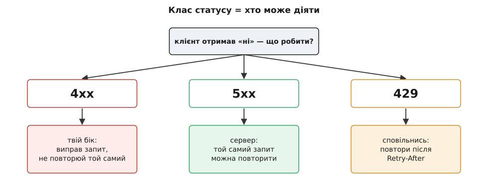

# Помилки як контракт назовні

<preknowlist>
- [REST і HTTP](root:com-protocol/rest-api) — запит-відповідь, методи й **родини статус-кодів** (2xx/4xx/5xx); саме ними промовляє помилка на дроті.
- [Проєктування за контрактом](root:sf-release/design-by-contract) — інтерфейс як двобічна обіцянка: передумова — борг того, хто кличе, постумова — того, кого кличуть; помилка теж частина цієї обіцянки.
</preknowlist>

Колись у цьому курсі ми вже [проводили помилку крізь шари](root:progarch/errors-through-layers): апаратний збій народжувався в драйвері мовою шини, підіймався до політики, на кожній межі перевдягався в слова свого рівня й нагорі ставав пережитою подією — записом у журнал і рішенням тримати безпечний стан. Тоді всі ці межі були **внутрішні**: обидва їхні боки — наш код, і помилка нікуди не виходила за процес. Ми навіть назвали останню з тих меж — код виходу CLI-утиліти на межі процесу.

Тепер у дому є API. `GET /devices/{id}` віддає стан пристрою назовні, і той самий збій давача, який раніше вмирав у журналі, мусить пройти **ще одну межу — мережеву**. А по той бік цієї межі вже не наш журнал і не наш скрипт-обгортка, а [той самий чужий світ, що читає й наші поля](root:progarch/api-evolution-dh): п'ятдесят тисяч настінних панелей із торішньою прошивкою, мобільний застосунок і чужі інтеграції. Це остання трансляція помилки — і єдина, що виходить **на люди**. І майже завжди саме її забувають спроєктувати.


*Внутрішні межі вели помилку вгору й лишали її вдома. Мережева межа — остання, і вона виводить помилку до клієнтів, яких ти не контролюєш. Саме тому те, що перетинає її, мусить бути спроєктованим контрактом, а не тим, що випадково випало зі стека.*

## Забутий контракт

Придивімося, як зазвичай народжується помилка на межі API. Хтось уважно виточив форму *успішної* відповіді — `temperature`, `at`, які поля додавати, як їх версіонувати, — бо це «і є API». А відповідь на збій лишили на відкуп фреймворку: не спіймав виняток — фреймворк сам віддасть `500` і вивалить стек. Форму успіху проєктували; форму невдачі **пустили самопливом**.

Але подивись, що робить клієнт, коли отримує «ні». Панель на стіні не просто показує червоний хрестик — її код **розбирає** відповідь і **ухвалює рішення**:

```js
if (res.status === 503) scheduleRetry();        // тимчасово — повторю
else if (res.status === 404) forgetDevice();    // пристрою нема — заберу з екрана
else if (body.code === "rate_limited") backOff();
```

Щойно клієнт написав цей `if`, форма твоєї помилки стала **несучою**. Статус `503`, поле `code`, навіть текст повідомлення, за який хтось зачепився регуляркою, — усе це тепер частина контракту, байдуже, документував ти його чи ні. Це [закон Гайрама](root:progarch/what-makes-irreversible/math-hyrum-law.md) у чистому вигляді: за достатньої кількості клієнтів кожна спостережна дрібниця твоєї поведінки стає чиєюсь опорою. А отже, помилка на межі API — це контракт **завжди**. Питання лише в тому, це контракт, який ти **спроєктував**, чи той, що склався випадково — і якого ти вже не можеш змінити, бо не знаєш, хто на нього сперся.

Ось звідки головна теза кроку: **до відповіді на збій треба ставитися з тією самою дисципліною, що й до відповіді на успіх.** Її форму купують на першому дні — так само, як [адитивність полів](root:progarch/api-evolution-dh), — інакше платять за неї потім, кожним «тихим» клієнтом, що зламався на неохайному `500`.

> 🔧 **Навіщо це.** «Наш API повертає JSON із даними, а помилки — то вже як вийде» — це рішення відкласти проєктування половини контракту. Половини, яка спрацьовує рівно тоді, коли в клієнта щось пішло не так, тобто в найгірший для нього момент. Спроєктована помилка каже клієнту, що робити далі; випадкова — лишає його гадати за кодом статусу, якого ти навіть не обирав свідомо.

## Що клієнтові треба від «ні»

Гаразд, помилку треба проєктувати. Але проєктувати під що? Станьмо на місце коду клієнта й спитаймо, які рішення він мусить ухвалити, отримавши збій. Виявляється, їх рівно три, і кожне потребує свого шматка відповіді.

**Перше рішення: чи можу я взагалі щось із цим удіяти — і хто винен?** Це вирішує **клас статусу**, і тут HTTP уже зробив за нас найважче. `4xx` означає «проблема на твоєму, клієнте, боці» — ти надіслав те, чого не мав, і **сліпо повторювати не варто**: повторний однаковий запит зламається так само. `5xx` означає «проблема на нашому боці» — з тим самим запитом **повтор може вдатися**, коли ми оклигаємо. А `429` окремо каже «сповільнись». Це та сама думка, що вела нас крізь [помилки крізь шари](root:progarch/errors-through-layers) — «у помилки є адреса, спитай, хто здатен щось вирішити», — тільки адрес тепер три: *ти виправ*, *ми оклигаємо*, *почекай*. Клас статусу — це найгрубший, найважливіший біт: він каже машині, **хто тут може діяти**.


*Клас статусу — це відповідь на питання «хто може діяти». 4xx повертає м'яч клієнту, 5xx лишає його на сервері, 429 просить паузу. Повторювати той самий запит наосліп марно на 4xx — там нічого не зміниться, доки клієнт не виправить його сам.*

**Друге рішення: що саме сталося — так, щоб мій код міг розгалузитися?** І ось тут головна пастка новачка: сплутати повідомлення для людини з кодом для машини. Це дві різні речі в одній відповіді, і їх не можна змішувати:

```json
{
  "code": "device_unavailable",
  "detail": "Давач у спальні не відповідає. Спробуйте за кілька секунд.",
  "status": 503
}
```

Поле `detail` — для **людських очей**. Його перекладають, переписують, роблять лагіднішим — і все це вільно, бо жодна машина за нього не має чіплятися. Поле `code` — для **коду клієнта**: стабільний, короткий, машиночитний ярлик, за яким пишуть `switch`. Він **не змінюється ніколи**, бо він і є та частина, на яку клієнт сперся. Переплутати їх — значить або змусити клієнтів парсити людський текст (і тоді ти вже не можеш переписати жодного повідомлення, не зламавши когось), або віддавати машині лише `status`, якого замало, щоб відрізнити «пристрій офлайн» від «пристрій не твій» — обидва цілком можуть бути `403` чи `404`.


*Дві авдиторії однієї помилки. Повідомлення живе для людини й вільно змінюється; код живе для машини й закам'янілий. Один рядок відповіді — два контракти з різним терміном придатності.*

**Третє рішення: що мені робити просто зараз?** Це **дієвість**. Тимчасовий збій має нести ознаку, що його варто повторити, і підказку коли — заголовок `Retry-After`. Помилка валідації має показати, **яке поле** не так, щоб клієнт підсвітив саме його, а не весь екран. А будь-яка помилка має нести **кореляційний ідентифікатор** — те саме число, що ти записав у журнал. Тоді користувач, який бачить «щось пішло не так, код `a1b2c3`», дає тобі рівно ту нитку, за якою ти витягнеш із логів саме його запит. Пам'ятаєш правило з модуля меж — [логувати збій один раз, там, де його обробили](root:progarch/errors-through-layers)? Кореляційний id — це місток від того єдиного запису в журналі до людини, яка тримає помилку в руках; він з'єднує внутрішню [спостережність](root:progarch/observability-as-testability) із зовнішнім контрактом.

## Остання трансляція — і те, що не сміє пройти

Тепер зберімо це в код і побачимо, що структурно це той самий прийом, який ми вже знаємо. У модулі меж помилка перекладалася на кожній межі, і переклад жив **в одному місці** — на самій межі, не розсипаний по всьому коду. Мережева межа нічим не інакша: доменні помилки — `DeviceNotFound`, `DeviceUnavailable` — підіймаються знизу рівно так, як підіймалися раніше, а на самому краю **одне** місце перекладає їх у відповідь-контракт:

:::tabs
```ts
// доменні помилки — ті самі, що підіймалися крізь шари; тут вони впираються в межу HTTP
class DeviceNotFound   extends Error { constructor(public id: string) { super("no device"); } }
class DeviceUnavailable extends Error { constructor(public id: string) { super("offline"); } }

// одне місце перекладу: доменна помилка → HTTP-відповідь як контракт
function toProblem(err: unknown, reqId: string) {
  if (err instanceof DeviceNotFound)
    return { status: 404, headers: {},
      body: { type: "https://api.dh.io/errors/device-not-found",
              title: "Пристрій не знайдено", status: 404,
              code: "device_not_found", detail: `Пристрою ${err.id} немає.`,
              requestId: reqId } };

  if (err instanceof DeviceUnavailable)
    return { status: 503, headers: { "Retry-After": "5" },
      body: { type: "https://api.dh.io/errors/device-unavailable",
              title: "Пристрій тимчасово недоступний", status: 503,
              code: "device_unavailable", retryable: true,
              detail: "Давач не відповідає, спробуйте за кілька секунд.",
              requestId: reqId } };

  // усе інше — це БАГ, а не факт світу: назовні нічого, у журнал — усе
  log.error({ reqId, err });                       // лог РАЗ, саме тут, зі стеком
  return { status: 500, headers: {},
    body: { type: "about:blank", title: "Внутрішня помилка", status: 500,
            code: "internal", detail: "Сталася непередбачена помилка.",
            requestId: reqId } };                   // жодного стека, жодного SQL назовні
}
```
```py
# доменні помилки — ті самі, що підіймалися крізь шари; тут вони впираються в межу HTTP
class DeviceNotFound(Exception):
    def __init__(self, id): self.id = id
class DeviceUnavailable(Exception):
    def __init__(self, id): self.id = id

def to_problem(err, req_id):                        # одне місце перекладу
    if isinstance(err, DeviceNotFound):
        return 404, {}, {
            "type": "https://api.dh.io/errors/device-not-found",
            "title": "Пристрій не знайдено", "status": 404,
            "code": "device_not_found", "detail": f"Пристрою {err.id} немає.",
            "requestId": req_id}

    if isinstance(err, DeviceUnavailable):
        return 503, {"Retry-After": "5"}, {
            "type": "https://api.dh.io/errors/device-unavailable",
            "title": "Пристрій тимчасово недоступний", "status": 503,
            "code": "device_unavailable", "retryable": True,
            "detail": "Давач не відповідає, спробуйте за кілька секунд.",
            "requestId": req_id}

    # усе інше — це БАГ, а не факт світу: назовні нічого, у журнал — усе
    log.error("unhandled", extra={"req_id": req_id}, exc_info=err)  # лог РАЗ, тут
    return 500, {}, {
        "type": "about:blank", "title": "Внутрішня помилка", "status": 500,
        "code": "internal", "detail": "Сталася непередбачена помилка.",
        "requestId": req_id}                        # жодного трейсбека назовні
```
:::

Уся вага цього фрагмента — в останній гілці. Доменні помилки ми **самі** оголосили частиною контракту, тож перекладаємо їх чесно й докладно. Але все, чого ми **не** передбачили, — це [баг у нашому коді, а не факт світу](root:progarch/errors-through-layers), і на межі API з ним чинять протилежно до внутрішнього «впасти голосно»: назовні він стає **непрозорим** `500` без жодної деталі, а весь стек, назва винятку й SQL лишаються **вдома**, у журналі, під кореляційним id. Ця гілка — стіна редакції: те, що всередині мусить кричати причиною, назовні мусить мовчати про неї.

І мовчати не з ввічливості, а з двох твердих причин. Перша — безпека: стек, шлях до файлу, версія бібліотеки, текст помилки бази — це подарунок тому, хто шукає, як тебе зламати; межа помилки — це ще й поверхня атаки. Друга — той самий закон Гайрама: якщо ти хоч раз пропустив назовні `NullPointerException: user.tier is null`, знайдеться клієнт, який зачепиться за цей рядок, — і тепер твоя внутрішня деталь реалізації стала контрактом, якого ти не хотів. Тому правило межі з модуля про шари тут лише твердне: **сире слово нижнього шару не сміє пройти назовні** — ні в даних, ні в помилці.

> 🔧 **Навіщо це.** Один обробник на краю, а не `try/catch` у кожному хендлері, дає тобі єдину точку, де вирішено все одразу: який статус, що показати людині, що сховати, куди записати, який id вернути. Зміниш політику — «ніколи не віддавати стек у проді», «на кожну 5xx чіпляти кореляційний id» — і правиш одне місце, а не двісті ендпойнтів. Розсипаний по коду формат помилки — це двісті контрактів, які неминуче розійдуться.

## Форма, а не сніжинка

Досі ми мовчки вигадували поля — `type`, `title`, `status`, `code`, `detail`. Це не імпровізація: це **стандартний конверт** для помилок HTTP, описаний як [Problem Details і виплеканий довгою суперечкою про те, як узагалі має виглядати відмова API](root:progarch/api-error-contract/hist-error-contract-lineage.md). Замість того, щоб кожен ендпойнт вигадував власний JSON збою — десь `{"error": "..."}`, десь `{"message": "..."}`, десь голий рядок, — усі говорять однією формою, і клієнт пише **один** розбирач помилок на весь API, а не по одному на ендпойнт. Стандарт навіть має свій тип вмісту, `application/problem+json`, щоб клієнт одразу знав, що прилетіло.

Однорідність тут не косметична — вона й є те, що дає змогу помилки **безпечно розвивати**. Спільний конверт означає спільне правило «незнайомі поля ігноруй»; а без нього кожне нове поле в помилці — окрема лотерея. І це підводить нас до останнього й найважливішого: контракт помилки живе в часі так само, як контракт полів.

## Помилки старіють, як поля

Уся асиметрія попереднього кроку — **ти рухаєшся, клієнти стоять** — діє на помилки без жодної знижки. А отже, і ті самі три роди зміни, з тією самою різницею в ціні.

**Додати код** — як додати поле. Продукт вводить новий стан: пристрій оновлює прошивку, і на команду ти хочеш відповідати новим `device_updating`. Це безпечно — **за однієї умови**, дзеркальної до [поблажливих читачів](root:progarch/api-evolution-dh): клієнт мусить читати множину кодів як **відкриту**, тобто мати гілку «інше» на будь-який незнаний код:

```js
switch (body.code) {
  case "device_unavailable": scheduleRetry(); break;
  case "device_not_found":   forgetDevice();  break;
  default:                   showGenericError(body.detail);   // ← рятує від нового коду
}
```

Клієнт із таким `default` переживе твій новий `device_updating` — покаже загальне повідомлення й піде далі. Клієнт, що зробив вичерпний розбір без `default`, провалиться повз усі гілки — рівно та сама пастка закритого переліку, що й зі статусами пристрою. Тому «нові коди помилок можуть з'являтися, будь готовий до незнаних» — це теж частина контракту, і оголосити її треба **заздалегідь**.

**Перейменувати код або змінити статус** — це зміна форми, і вона ламає **голосно**. Був `device_offline` — став `device_unavailable`; віддавав `404` — почав `410`. Кожен клієнт, що розгалужувався на старому значенні, тепер не впізнає його. Лік той самий, що й для полів: веди старе й нове паралельно, познач старе [застарілим](root:com-protocol/deprecation-basics), і прибирай лише тоді, коли телеметрія покаже нуль клієнтів на старому коді.

**Переспрямувати зміст під тим самим кодом** — знову найпідступніше, знову тиша. Уяви, що `rate_limited` раніше означав тільки «занадто часто, зачекай і повтори», а тепер ти почав віддавати його ще й на «вичерпано місячну квоту». Ярлик той самий, `code` не змінився — але зміст розійшовся. Клієнт, написаний під старий сенс, слухняно чекає й **повторює вічно** те, що повторенням не полагодиш: квота не відновиться від того, що він стукає. Той самий закон, що й для `at` у мілісекундах: **новому змісту потрібен новий код**, бо новий код — єдине, що клієнт здатен помітити. Треба відрізнити «зачекай» від «квота вичерпана» — вводь `quota_exceeded` поруч, а не тихо розширюй значення старого.

Отже, коди помилок деприкейтять, версіонують і спостерігають достоту як поля відповіді: **додавати дешево, забирати дорого, і ніколи не переспрямовувати назву на новий зміст.** Помилка — не виняток із контракту, вона його рівноправна частина.

## Дім, що чесно каже «ні»

Зведімо все на конкретному API дому. Ось запити й чесні відповіді на збій:

| Що сталося | Статус | `code` | Дієвість |
|---|---|---|---|
| `GET /devices/42` — такого нема | `404` | `device_not_found` | не повторювати |
| `GET /devices/42` — не твій дім | `404` | `device_not_found` | не повторювати |
| Давач офлайн (те саме `SensorUnavailable`) | `503` | `device_unavailable` | `retryable`, `Retry-After: 5` |
| `POST …/commands` — крива команда | `400` | `invalid_command` | вказати поле, не повторювати як є |
| Забагато запитів | `429` | `rate_limited` | `Retry-After` |
| Баг у нашому коді | `500` | `internal` | непрозоро, кореляційний id |

Два рядки варті окремого слова. «Пристрою нема» і «пристрій не твій» ми свідомо злили в **однакову** `404`: якби на чужий пристрій ми відповідали `403 forbidden`, а на неіснуючий — `404`, то будь-хто міг би перебором відрізнити, які id у системі є, а яких немає, — межа помилки стала б оракулом існування. Іноді найчесніша відповідь — навмисно **менш** детальна; тонше цю рівновагу «інформативність проти витоку» курс розбере далі, у безпеці.

А рядок давача — це те саме коло, з якого ми почали, замкнуте. Апаратний збій, що в самому першому [v0](root:progarch/dh-v0-one-sensor) убивав систему тихою смертю, у модулі меж став пережитою внутрішньою подією `SensorUnavailable`, а тепер, на межі API, він стає чесним `503 device_unavailable` з підказкою повторити — контрактом, за яким п'ятдесят тисяч панелей знають, що дім живий, просто цей давач на хвилину замовк. Повний робочий обробник — з конвертом Problem Details, кореляційним id, `Retry-After` та **контрактним тестом**, що пришпилює форму помилки, щоб її не можна було зламати ненароком, — зібрано в [харнесі межі помилок DH](root:progarch/api-error-contract/proj-dh-error-boundary.md).

## Що лишається в руках

Помилка на межі API — це третій контракт того самого шва. Модуль про шари закінчився думкою, що межа не готова, поки не сказано трьох речей: які **дані**, які **виклики** й які **помилки** її перетинають і чиєю мовою. Тоді всі три були внутрішні. Цей крок вивів останню з них **назовні** — і виявилося, що назовні вона підпорядкована рівно тим самим законам, що й публічна форма даних: її треба проєктувати, а не пускати самопливом; тримати стабільним машинний `code` окремо від змінного людського повідомлення; ставити чесний клас статусу, що каже, хто може діяти; бути дієвою — повторюваність, поле-винуватець, кореляційний id; нічого не пропускати зі свого нутра; і розвивати її як поле — додавати дешево, ламати дорого, ніколи не переспрямовувати зміст під старою назвою.

За всім цим — одна проста несправедливість, з якою ми вже зустрічались: обіцянку дешево доповнювати й дорого відкликати. Просто цього разу обіцянка стосується найгіршого дня клієнта — того, коли в нього щось не працює. І половина API, яку найлегше забути, — це саме та половина, що промовляє до найменш підконтрольних тобі клієнтів у мить, коли їм найпотрібніша ясна відповідь.
