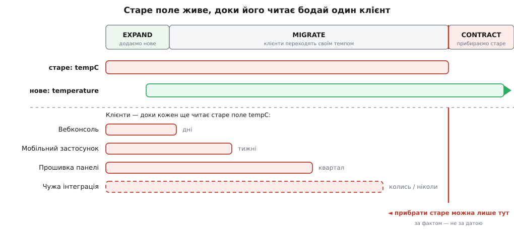
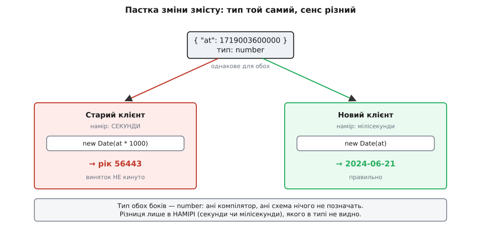

# Еволюція API DH без поломки

<preknowlist>
- [DTO](topic:programming/dto) — пакет даних, що перетинає межу; тіло API-відповіді і є такий пакет, а «еволюція API» — це насамперед еволюція його схеми.
- [Проєктування за контрактом](topic:programming/design-by-contract) — інтерфейс як обіцянка двох сторін: передумова — борг того, хто кличе, постумова — борг того, кого кличуть; зламати API означає зламати обіцянку, яку вже дали.
</preknowlist>

Модуль тому ми виписали [контракт межі між хабом і драйвером пристрою](root:progarch/contract-as-boundary): `read()` повертає `Reading` — `{ ok, tempC, at }` за успіху, типізований збій інакше. Тоді ту межу було приємно міняти: обидві її сторони — наш код. Зачепив контракт — зайшов у два файли й полагодив обидва в одному коміті. Дорого, узгоджено, але **у твоїх руках**.

Тепер та сама форма `{ tempC, at }` виходить назовні. Дім віддає стан пристрою у відповіді на `GET /devices/{id}`, і читають її вже не наші два файли, а зовсім чужий світ: **50 тисяч настінних панелей** із торішньою прошивкою, **мобільний застосунок**, який половина людей не оновлювала місяцями, і **чужі інтеграції** — хтось раз написав місток до голосового помічника й забув про нього. Асиметрія перевернулася. Раніше «змінити контракт» означало «оновити обидві сторони»; тепер це означає «ти змінюєш свою сторону й молишся, що друга вже змінила свою». А вона не змінила. Сервер ти передеплоїш сьогодні вночі — панель на чужій стіні, застосунок у чужій кишені та інтеграцію, автора якої вже не знайдеш, ти не передеплоїш ніколи.

Ми [щойно розібрали версіонування](topic:programming/api-versioning) — як позначати покоління API — та [expand–contract](topic:programming/expand-contract) — як міняти інтерфейс у три фази, нікого не зламавши. Тепер зведімо ці два інструменти на живий дім. Питання цього кроку не «які є прийоми», а прикладне: **під конкретну зміну DH — котрий прийом брати і скільки він коштуватиме.** І відповідь починається з того, що зміни бувають трьох дуже різних родів.

## Три роди зміни — і чому вони коштують по-різному

Візьмімо ту саму відповідь про пристрій і спробуймо її розвивати. Виявляється, «змінити API» — це три несхожі речі, і ціна між ними відрізняється не в рази, а якісно.

**Перше — додати.** Продукт хоче показувати вологість і заряд батарейки. Ти дописуєш у відповідь нові поля:

```
{ "tempC": 21.5, "at": 1719003600, "humidity": 47, "battery": 0.82 }
```

Старий застосунок читає `tempC` й `at`, як читав; нових полів він просто не бачить. Це безпечно — **за однієї умови**: клієнти написані як *поблажливі читачі* (tolerant reader) — не давляться невідомими полями й не спираються на порядок ключів. Це той самий [принцип надійності Постела](root:progarch/contract-as-boundary/hist-postel-law.md), тільки тепер він працює на тебе: якщо клієнти терплячі до зайвого, ти можеш **рости адитивно вічно й без версій**. Це найдешевша зміна на світі, і вона задає перше правило: проєктуй відповіді так, щоб їх можна було лише **доповнювати** — об'єкт, який розширюється, а не кортеж із фіксованими позиціями.

**Друге — переінакшити форму.** Тепер складніше: американським домам треба Фаренгейти, і одне число `tempC` більше не годиться. Правильна форма — `temperature: { value, unit }`. Але `tempC` читають тисячі клієнтів; прибереш його — і всі вони зламаються **голосно**: поля нема, застосунок падає або показує порожнечу. Ось тут і живе expand–contract, і за хвилину ми проженемо його на DH крок за кроком.

**Третє — і найпідступніше — переінакшити зміст, не чіпаючи форми.** У контракті драйвера ми не дарма окремо позначали *одиницю* поля `at` — там навіть було видно, що в одній реалізації це секунди, а в іншій мілісекунди. Уяви, що ти вирішив: хай надалі `at` скрізь буде в мілісекундах. Тип не змінився — як був `number`, так і лишився. Код клієнта компілюється. Запити йдуть. І клієнт, написаний під секунди, тихо рахує час, помиляючись у тисячу разів — **і ніхто не кидає винятку**. Компілятор пішов у відпустку саме тоді, коли був найпотрібніший.

Звідси головний і неочевидний висновок: **ціна зміни визначається не розміром правки, а тим, наскільки голосно вона падає й скільки некерованих клієнтів на неї спиралися.** Правка на один символ — переінакшити зміст поля — небезпечніша за ціле нове поле, бо перша валить тихо, а друге не валить узагалі.

> 🔧 **Навіщо це.** Адитивність — найдешевша суперсила сумісності, але її треба закласти заздалегідь. Якщо відповідь — розширюваний об'єкт, а клієнти — поблажливі читачі, більшість майбутніх фіч додаються новими полями й **не потребують ані версії, ані міграції**. Команди, які цього не заклали (позиційні масиви, клієнти, що падають на невідомому ключі), платять версією за кожну дрібницю. Форму сумісності купують на першому дні, а не в день першої фічі.

## Форма змінюється: expand–contract на температурі DH

Отже, `tempC: number` має стати `temperature: { value: number, unit: "C" | "F" }`. Клієнтів ми не контролюємо, тож ламати відразу не можна. Розкладімо це на три фази.

**Фаза EXPAND — додаємо нове, не чіпаючи старого.** Сервер починає віддавати **обидва** поля одночасно. `tempC` лишається точно таким, як був; поруч з'являється `temperature`. Ключова дисципліна — рахувати обидва з **одного джерела правди**, щоб вони ніколи не розійшлися:

:::tabs
```ts
type DeviceStateDTO = {
  // старе поле — лишаємо байт-у-байт, поки його хтось читає
  tempC: number;
  // нове поле — канонічне джерело правди
  temperature: { value: number; unit: "C" | "F" };
  at: number;
};

function buildState(d: Device): DeviceStateDTO {
  const temperature = d.temperature;                 // єдина правда
  return {
    temperature,
    tempC: toCelsius(temperature),                   // старе — ПОХІДНЕ від нового
    at: d.lastReadingAt,
  };
}
```
```py
from dataclasses import dataclass
from typing import Literal

@dataclass(frozen=True)
class Temperature:
    value: float
    unit: Literal["C", "F"]

def build_state(d: Device) -> dict:
    temperature = d.temperature                       # єдина правда
    return {
        "temperature": {"value": temperature.value, "unit": temperature.unit},
        "tempC": to_celsius(temperature),             # старе — ПОХІДНЕ від нового
        "at": d.last_reading_at,
    }
```
:::

Старий клієнт бачить `tempC` незмінним — для нього нічого не сталося. Новий клієнт читає `temperature`. Обидва живуть у одній відповіді, і оскільки `tempC` **виводиться** з `temperature`, а не рахується окремо, вони фізично не можуть розійтися.

**Фаза MIGRATE — клієнти переходять на нове, кожен своїм темпом.** І ось тут проступає справжня ціна. Вебконсоль ти оновиш наступного тижня — ти її й контролюєш. Застосунок поїде в наступному релізі в магазині — це тижні, і то якщо людина натисне «оновити». Прошивка панелі перейде наступною хвилею OTA — а це може бути квартал. Чужа інтеграція перейде тоді, коли її автор спохопиться, тобто, найімовірніше, **ніколи**. Усі ці клієнти читають старе поле рівно стільки, скільки їм заманеться, і ти на це не впливаєш.

**Фаза CONTRACT — прибираємо старе.** `tempC` видаляємо. Але — і це весь фокус — **лише тоді, коли його перестав читати найповільніший клієнт.** До тієї миті старе поле живе. Його час життя дорівнює не твоєму рішенню й не даті в календарі, а **хвостові найповільнішого клієнта**.


*Нове поле з'являється в EXPAND і житиме далі; старе тягнеться доти, доки його читає бодай один клієнт. Вебконсоль переходить за дні, застосунок — за тижні, прошивка панелі — за квартал, чужа інтеграція — колись. Прибрати старе можна лише праворуч від найповільнішого — не за розкладом, а за фактом.*

Найважче в цьому танці — не «expand» і не «migrate», а знати, **коли настала мить contract**. Про це — за два розділи; спершу владнаймо тихого вбивцю.

> 🔧 **Навіщо це.** Класична пастка фази expand — порахувати старе й нове **незалежно**. Хтось лагодить `toCelsius`, забуває про паралельну гілку, що рахує `temperature`, — і тепер у відповіді два поля, які кажуть різне. Ти щойно завів **два контракти, які не збігаються**, і клієнти на кожному бачать свій дім. Одне джерело правди, з якого решта виводиться, — не стиль, а те, що не дає expand-фазі народити пару брехунів.

## Зміст змінюється: тиша, якої не ловить компілятор

Повернімося до найпідступнішого. Ти вирішив перевести `at` на мілісекунди. Форма ідентична — `number`; жоден компілятор, жодна схема цього не позначить. А на дроті тепер їде інше число:

```ts
// БУЛО (секунди):  at = 1719003600
// СТАЛО (мілісекунди): at = 1719003600000

// Старий клієнт, написаний під секунди:
const shownAt = new Date(reading.at * 1000);   // × ще раз 1000 → рік 56443
// нічого не кинуто. Просто абсурдна дата на екрані панелі.
```

Байти ті самі для обох сторін — а зміст розійшовся на десятиліття. Це [закон Гайрама](root:progarch/what-makes-irreversible/math-hyrum-law.md) у чистому вигляді: одиниця `at` була частиною **справжнього** контракту, хоч тип про неї й мовчав, — і клієнти на неї сперлися. Тип показував лише зовнішній край обіцянки; зміст жив нижче, і саме його ти нишком підмінив.


*Ті самі байти, різний сенс. Тип не змінився — тож ані компілятор, ані схема нічого не помітять. Помилка не «кидається», вона тихо оселяється на екрані. Тому зміну змісту не можна ховати під стару назву.*

Ліки одне й непорушне: **ніколи не переспрямовуй наявну назву на новий зміст.** Змінюється зміст — мусить змінитися **назва**. Треба мілісекунди — вводь `atMs` поруч, лишай `at` недоторканим і став усе за тими самими трьома фазами expand–contract, **хоч байти й здаються тими самими**. Розрізняє сторони саме нова назва, бо нова назва — єдине, що клієнт здатен **помітити**. Тихий злам перетворюється на голосний перехід, а голосний перехід — це вже керована зміна форми, а не диверсія.

Та сама пастка чигає й на переліках. Здавалося б, додати значення до enum — це «додати», отже безпечно. Але подивись на статус пристрою:

```ts
type DeviceStatus = "online" | "offline";
// панель робить вичерпний розбір:
switch (status) {
  case "online":  showGreen(); break;
  case "offline": showGrey();  break;
  // нового випадку тут нема — прошивці рік
}
```

Додаєш `"updating"` — і торішня прошивка панелі провалюється повз усі гілки: порожній екран або виняток, залежно від того, наскільки автор був обережний. Набір значень старий клієнт вважав **закритим**, і для нього розширення переліку — це зміна змісту, а не додавання. Тож правило дзеркальне з обох боків: клієнти читають переліки як **відкриті** (є гілка «інше»), а сервер вводить нові стани обережно — за прапорцем чи лише тим клієнтам, що готові, — поки старі не навчаться їх переживати.

## Коли ти справді мусиш зламати: версія як остання відповідь

Іноді адитивно не виходить. Ти не додаєш поле й не міняєш одне — ти перебудовуєш **усю модель**: пристрій стає деревом під-ресурсів, авторизація переїжджає, форма відповіді змінюється всюди одразу. Тоді настає той самий момент, заради якого існує [версіонування](topic:programming/api-versioning): народжується `v2`, а `v1` живе поруч.

Але дім навчає тверезо дивитися на цей крок. **Версія — це обіцянка тримати обидва покоління стільки, скільки живе найповільніший клієнт.** Ти тепер ведеш два кодові шляхи, два набори [контрактних тестів](topic:programming/contract-testing), дві сторінки документації — і так доти, доки остання панель не переповзе на `v2`. Версіонування не прибирає ціну сумісності, воно її **множить**. Тому для одного поля версія майже завжди дорожча за expand–contract; версіонують не поле, а **зсув усієї поверхні**, коли злам надто наскрізний, щоб його локалізувати.

Є й третій шлях, посередині між «одне поле» та «нова версія», — його показав [Stripe, чий публічний API роками не ламає інтеграцій](root:progarch/api-evolution-dh/hist-stripe-api-versioning.md): усередині живе **один** сучасний код, а кожна стара версія існує лише як невеликий перетворювач, що на межі «відкочує» свіжу відповідь назад до тієї форми, яку очікує саме цей клієнт. Це expand–contract, вирослий до масштабу компанії: одна правда всередині, переклад на кордоні.

А доти, доки версію не змусили народитися, корисно тримати перед очима, **хто взагалі читає твій API** — бо саме різнобій темпів визначає всі рішення вище:

| Клієнт | Як швидко оновлюється | Хто вирішує |
|---|---|---|
| Вебконсоль | хвилини — ти деплоїш | **ти** |
| Мобільний застосунок | тижні — реліз у магазині + воля користувача | почасти ти |
| Прошивка панелі | місяці — хвилі OTA | почасти ти |
| Чужа інтеграція | невідомо, часто ніколи | **не ти** |

Стовпець, що вирішує все, — останній. Там, де відповідь «не ти», старий контракт мусить жити, доки клієнт не перейде сам, — або доки ти свідомо й попереджено не відітнеш його.

## Звідки знати, що вже можна contract

Прибрати старе «на віру» не можна — це і є та мить, де ламаються всі гарні наміри. На щастя, потрібні інструменти вже в руках читача.

Перший — **спостережність**. У [кроці про спостережність як тестованість](root:progarch/observability-as-testability) ми навчилися робити поведінку системи видимою. Наведи це на API: записуй на кожен запит, який клієнт (за версією, за `User-Agent`) яке **застаріле** поле прочитав. Тепер питання «чи хтось іще на `tempC`?» — не здогад, а **запит до даних**. Це закон Гайрама, обернений на дашборд: справжній контракт не вичитаєш із документації, його видно лише в трафіку.

Другий — **деприкейшн як частина контракту**. [Позначити поле застарілим](topic:programming/deprecation-basics) — це не викинути його, а оголосити дату заходу сонця, віддавати клієнтам заголовок-попередження (`Deprecation`, `Sunset`) — і, найголовніше, **тримати видалення на замку**, поки телеметрія не покаже нуль читань у найповільнішій когорті. Деприкейшн без даних — це таймер, що комусь та й розчерепить голову; деприкейшн із даними — це ворота, які відчиняються рівно тоді, коли за ними вже безпечно.

Третій — для клієнтів, яких ти **контролюєш**: [контрактні тести](topic:programming/contract-testing), керовані споживачем. Кожен свій клієнт публікує, на що він спирається; твій CI червоніє, щойно зміна зачепила б відоме очікування. «Сподіваюся, цього ніхто не читає» перетворюється на «CI довів, що жоден мій клієнт цього не читає». Некерованих (чужі інтеграції) це не покриває — там лишається телеметрія.

Повний робочий стан цього — подвійний запис старого й нового, лічильник читань застарілого поля за версією клієнта та **ворота готовності**, які зеленіють лише коли лічильник упав до нуля в кожній когорті, — зібрано в [харнесі міграції поля DH](root:progarch/api-evolution-dh/proj-dh-field-migration.md).

> 🔧 **Навіщо це.** Прив'язуй видалення до **метрики, а не до дати**. «Прибрати `tempC`, коли читань нуль протягом 30 днів по всіх версіях» — це безпечне, самочасне зняття: воно станеться саме тоді, коли перестане когось ламати. «Прибрати `tempC` 1 березня» — це парі, яке ти програєш на тій єдиній панелі, що не оновилася. Дата не знає про твоїх клієнтів; метрика знає.

## Що лишається в руках

За всією цією дисципліною стоїть та сама думка, що вела нас крізь увесь модуль контрактів: **обіцянку дешево доповнювати й дорого забирати назад.** Але дім показав, як розтягується оте «дорого». Поки контракт жив між двома нашими файлами, забрати обіцянку назад коштувало одного уважного коміту. Щойно той самий контракт вийшов до п'ятдесяти тисяч чужих домів, «дорого» стало календарем завдовжки в життя найповільнішої панелі: тепер обіцянку тримаєш не ти, а той останній клієнт, якого ти не контролюєш, — і триматимеш доти, доки він її пам'ятає.

Тому справжня межа тут пролягає не між «легкою» і «важкою» зміною, а між «до» і «після» тієї миті, коли контракт уперше перетнув край твого коду. До неї будь-яку обіцянку ще можна переписати одним комітом; після неї — лише пережити. Уся техніка цього кроку існує рівно для того, щоб цю мить пройти зрячими: віддавати назовні тільки те, що готовий нести, доки його читає найповільніший.
