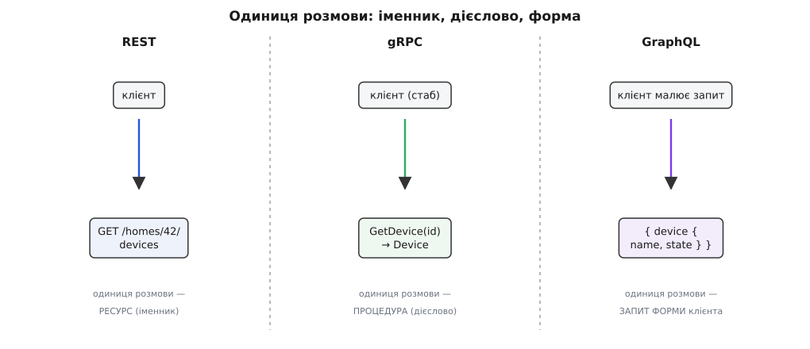
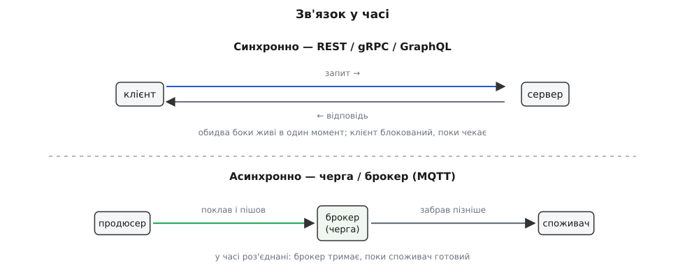

# Стилі API як рішення, не релігія

<preknowlist>
- [Зчеплення і зв'язність](book:programming/coupling-cohesion) — спільна форма між двома боками робить зміну дорогою; вибір стилю API — це передусім вибір, яке зчеплення ти на цю межу береш.
- [Інтерфейс проти реалізації](book:programming/interface-vs-implementation) — API і є той інтерфейс: зовнішня межа, на яку сперлися чужі програми, тому змінювати її дорого, а вибирати треба свідомо.
</preknowlist>

Мало яка тема в бекенді породжує стільки суперечок, як «яким має бути API». REST — єдино правильний, gRPC — для тих, хто любить ускладнювати, GraphQL — модна дурниця; або дзеркально: REST застарів, усе серйозне давно на gRPC, а GraphQL урятує вас від REST-пекла. Люди бʼються за це так, ніби обирають віру.

Ми вже проходили цю пастку — на принципах коду. [Принцип не догма, а спресована сила під конкретне рішення](root:progarch/principles-as-tools-not-dogma); слухати гасло замість сили під ним — це карго-культ. Зі стилями API — те саме, лише масштабом більше. API (англ. *application programming interface* — інтерфейс прикладного програмування) — це **межа між двома сторонами, які мусять домовитися про форму розмови**. Стиль API — це просто набір готових відповідей на те, як саме ця домовленість влаштована: чим ти називаєш річ, хто визначає форму відповіді, скільки типів зашито в контракт. Ніякої святості тут немає. Є межа, на ній діють конкретні сили, і питання ніколи не «який стиль найкращий узагалі», а **які сили сидять саме на цій межі**.

Тож розберімо чесно: чим стилі справді різняться, з якого болю кожен народився, і як під конкретну межу обрати той, що ляже, — а не той, за який модно вболівати.

## Чим стилі різняться насправді — одиниця розмови

Відкиньмо гасла й спитаймо по-фейнманівськи: що в цих стилях фізично різне? Не синтаксис, не мода. Різна **одиниця розмови** — те, чим ти оперуєш, коли звертаєшся до чужої системи.

У **REST** (англ. *Representational State Transfer* — передавання представлень стану) одиниця — це **іменник, ресурс**. Ти називаєш річ і застосовуєш до неї маленький сталий набір стандартних дієслів HTTP: узяти, створити, замінити, видалити. Словник дій зафіксовано наперед і на всіх однаковий; твоє — лише називати речі. «Дай пристрої дому 42» звучить так:

```http
GET /homes/42/devices HTTP/1.1
Host: api.digitalhomes.io
Accept: application/json
```

```json
[
  { "id": "dev-7", "kind": "thermostat", "room": "kitchen" },
  { "id": "dev-8", "kind": "motion",     "room": "hallway"  }
]
```

У **gRPC** (RPC — англ. *Remote Procedure Call*, виклик віддаленої процедури; «g» спершу означало Google, тепер жартома змінюється щорелізу) одиниця — це **дієслово, процедура**. Ти не називаєш ресурс — ти викликаєш названу функцію з типізованими аргументами й дістаєш типізований результат, так ніби вона локальна. Але спершу обидві сторони погоджують контракт — файл опису (`.proto`), з якого генератор робить **стаб** (англ. *stub* — заглушка, підставна локальна функція, що під капотом ходить у мережу):

```proto
service DeviceRegistry {
  rpc GetDevice(GetDeviceRequest) returns (Device);
  rpc StreamReadings(DeviceId) returns (stream Reading);
}

message Device {
  string id   = 1;
  string kind = 2;
  string room = 3;
}
```

```go
// стаб згенеровано з .proto; виклик виглядає майже як локальний
dev, err := registry.GetDevice(ctx, &pb.GetDeviceRequest{Id: "dev-7"})
```

У **GraphQL** (англ. *graph* — граф + *query language* — мова запитів) одиниця — це **форма, яку малює сам клієнт**. Один-єдиний вхід, а клієнт надсилає не назву ресурсу й не виклик функції, а **опис того, яку форму відповіді він хоче**. Сервер повертає рівно її — не більше й не менше:

```graphql
{
  home(id: 42) {
    rooms {
      name
      devices { id kind state { on temperature } }
    }
  }
}
```

Відповідь дзеркалить запит формою: ті самі поля, та сама вкладеність. Клієнт попросив три рівні графа за один захід — і дістав саме три рівні.



*Стилі різняться не оздобленням, а тим, що є однією одиницею взаємодії: у REST ти називаєш річ, у gRPC викликаєш дію, у GraphQL описуєш потрібну форму відповіді.*

Уже з цього видно, що «кращого» серед них немає — вони відповідають на різні питання. І щоб зрозуміти, коли який лягає, корисно побачити, з якого саме болю кожен зʼявився.

## Кожен стиль — відповідь на конкретний біль

Стилі не впали з неба однаково доброго дизайну. Кожен народився, коли комусь стало нестерпно боляче в конкретний спосіб, і закодував у себе саме той урок.

**REST** зʼявився не як винахід, а як **опис того, чому вже працює**. Рой Філдінг (Roy Fielding), один з авторів специфікації HTTP, у докторській дисертації 2000 року в Каліфорнійському університеті в Ірвайні формалізував архітектурний стиль, що зробив Всесвітню павутину масштабованою: назви-ресурси, сталий набір методів, кеш посередині, кожен запит самодостатній. Це усталений факт. Тому REST так добре лягає туди, де клієнтів багато, вони чужі й некеровані, а між тобою й ними стоїть уся інфраструктура HTTP — кеші, проксі, CDN, — яку REST дістає задарма.

**gRPC** виріс усередині Google з системи на імʼя Stubby, якою компанія понад десять років гоняла мільярди внутрішніх викликів між сервісами. Відкрили її світові 2015 року, поставивши на HTTP/2 і бінарний формат Protocol Buffers. Це теж усталено. Звідси й його характер: він створений для **свого проти свого** — сервіс до сервіса, де важать швидкість, щільний типізований контракт і генерація клієнта відразу під десяток мов.

**GraphQL** народився з дуже конкретної рани. Близько 2012 року у Facebook переписували мобільний застосунок, і стрічка новин на телефоні задихалася: щоб намалювати один екран, доводилося або смикати сервер десятками запитів, або тягти купу зайвого. Команда (серед них Лі Байрон, Нік Шрок, Ден Шафер) зробила мову, якою **клієнт сам описує потрібний зріз графа даних**; назовні відкрили 2015-го. Тому GraphQL блищить там, де багато різних екранів хочуть різні форми того самого багатого графа.

> [Три стилі як три відповіді на три болі: чому REST лише описав успіх Вебу, звідки в gRPC спадок RPC аж від CORBA, і як мобільна стрічка Facebook породила GraphQL](root:progarch/api-style-choice/hist-api-styles-lineage.md) — окрема історія; коли знаєш походження, вибір перестає бути справою смаку.

Побачивши це, помічаєш головне: кожен стиль **упереджений** — несе в собі ту межу, під яку його виточили. Отже, вибір зводиться до того, щоб зіставити упередження стилю із силами твоєї межі.

## Сили, які вирішують

Ось ті сили. Це і є зміст рішення — не «що мені більше подобається», а чесна відповідь на кілька питань про конкретну межу.

**Хто на іншому кінці?** Найважча сила. Якщо там **невідомі чужі клієнти**, яких ти не можеш змусити оновитися одночасно з тобою, — тобі потрібна максимально нев'їдлива, стабільна, самоописова межа: REST по звичайному HTTP, який відкриється з будь-чого, хоч із `curl`. Якщо на іншому кінці **твої власні сервіси**, що деплояться разом, — можна дозволити собі щільний типізований контракт gRPC, бо обидві сторони ти оновиш сам. Якщо там **багато твоїх власних інтерфейсів** (застосунок на iOS, на Android, вебсторінка, годинник), що ходять по одному й тому ж багатому графу, — GraphQL дає кожному брати свою форму без окремого ендпойнта на кожен екран.

**Яка форма читання?** Один сталий ресурс — чи багато різних зрізів по звʼязаному графу? Класичний біль REST тут — **недобір і перебір**. Уяви екран-панель мобільного застосунку DH: показати дім, його кімнати, у кожній кімнаті пристрої, у кожного пристрою останнє показання. По REST це водоспад запитів — спершу дім, тоді на кожну кімнату по запиту на пристрої, тоді на кожен пристрій по запиту на показання:

```
20 послідовних запитів × 150 мс (RTT телефона) = 3000 мс  (≈ 3 с)
 1 запит потрібної форми     × 150 мс           =  150 мс
```

Три секунди білого екрана проти десятої частки секунди. Той самий граф, а різниця — саме в тому, хто визначає форму відповіді. GraphQL (або зібраний під клієнта REST-ендпойнт — **BFF**, backend-for-frontend) забирає водоспад за один захід.

**Яке зчеплення ти можеш собі дозволити?** Тут стиль прямо торкається того, що ми звемо [зчепленням](book:programming/coupling-cohesion). Типізований контракт gRPC — це **тісне зчеплення в обмін на швидкодію й безпеку типів**: обидві сторони діляться одним `.proto`, генерують код, і розійтися версіями наосліп їм важче. REST по JSON — **вільне зчеплення ціною суворості**: клієнт і сервер знають одне про одного мінімум, зате нову необовʼязкову властивість можна додати, нікого не зламавши. Ні те, ні те не «краще» — це вибір, скільки жорсткості ти купуєш і чим платиш.

**Яку інфраструктуру ти дістаєш задарма?** REST їде на всьому, що вміє HTTP: кеш на межі, проксі, CDN, коди станів, які розуміє кожен балансувальник. gRPC за це не тримається — йому потрібен HTTP/2 наскрізь, а в наївному проксі чи прямо у браузері він живе погано. Це не вада, це ціна: він міняв сумісність із веб-інфраструктурою на швидкість і стрімінг.

**Який бюджет швидкодії?** Бінарний Protocol Buffers і мультиплексування HTTP/2 роблять gRPC відчутно легшим і швидшим за текстовий JSON поверх звичайних зʼєднань — там, де викликів мільйони на секунду й кожна мілісекунда й байт на рахунку. Там, де запитів жменя й читає їх людина, ця перевага не важить нічого, зате читабельність JSON важить багато.


*Ті самі сили, розкладені на дві осі, самі розводять стилі по кутах — вибір стає читанням координат межі, а не питанням віри.*

> 🔧 **Навіщо це.** На рев'ю дизайну різниця між «обрав стиль» і «сповідує стиль» — груба й помітна. Хто бачить сили, каже: «тут публічний застосунок і невідомі клієнти — REST на межі; а от між реєстром пристроїв і рушієм автоматизацій свій-до-свого й гарячий шлях — усередині беремо gRPC». Хто завчив гасло, каже «ми ж REST-контора» або «пишемо все на gRPC» — і тягне один стиль на межу, яка про інше просить. Перший ставить діагноз межі, другий виконує обряд; за обряд платить продукт — зайвими секундами на екрані, злитими наспіх версіями, мостами, яких могло не бути.

## Прихована четверта вісь — час

Усі три стилі вище, попри різницю, поділяють одну німу засаду: вони **синхронні**. Запит-відповідь: обидва боки живі в один і той самий момент, і той, хто питає, **блокований**, поки чекає. Це так природно, що його не помічають, — і саме тому це найдорожча пропущена межа.

Бо іноді відповідь тобі **зараз не потрібна**. Тобі треба лише передати факт і йти далі. Пригадай найпершу DH v0 — скрипт, що раз на дві секунди читає температуру. Тепер він живе на хабі в чиємусь домі, а показання має долітати до хмари. Якщо хаб робитиме на кожне показання синхронний `POST` і чекатиме на відповідь, то на поганому домашньому Wi-Fi він **зависатиме на кожному вимірі**, а щойно мережа моргне — губитиме дані й падатиме. Синхронний виклик тут — прямо неправильна форма.

Правильна — **не питати, а покласти повідомлення й піти**. Хаб кидає показання в чергу через брокер (англ. *broker* — посередник), а хмара забирає його, коли готова. Класичний інструмент саме для такого — **MQTT**, легкий протокол телеметрії (гр. *tēle* — далеко + *metron* — міра), що його 1999 року зробили Енді Стенфорд-Кларк з IBM і Арлен Ніппер для давачів на нафтопроводах: батарея, дорогий супутниковий канал, слати треба ощадливо й без гарантії, що приймач зараз живий. Той самий профіль, що й у хаба на кволому Wi-Fi.

```python
# асинхронно: поклав у брокер і пішов — відповіді не чекаємо
client.publish("dh/home/42/dev-7/reading",
               json.dumps({"t": 22.4, "at": now()}), qos=1)
```

```python
# синхронно: блокує хаб, поки хмара не відповість; нема мережі — падаємо
resp = requests.post("https://api.digitalhomes.io/readings",
                     json=payload, timeout=5)
```



*Синхронний стиль звʼязує сторони в часі — обидві мусять бути живі разом; черга роз'єднує їх, тримаючи повідомлення, поки приймач готовий. Це окреме рішення, важливіше за вибір між REST і gRPC.*

Ось чому «вибір стилю API» — насправді **два питання, а не одне**. Перше й головніше: чи має ця розмова взагалі бути синхронною? Якщо факт можна віддати й забути — місце не запиту, а черги, і питання REST-чи-gRPC відпадає само. І лише якщо відповідь потрібна тут і тепер, постає друге питання — якої форми той синхронний виклик: іменник, дієслово чи форма клієнта.

> 🔧 **Навіщо це.** Сплутати ці дві осі — типова дорога помилка. Команда годинами свариться, REST чи gRPC, для потоку, який за своєю природою мав бути чергою подій, — і будує синхронний ланцюжок там, де перша ж часткова відмова кладе все. Спершу спитай про час: чи чекаємо відповіді. Це рішення про звʼязок у часі коштує куди дорожче за колір синхронного стилю зверху, бо його відкотити — переписати сам спосіб, яким частини системи торкаються одна одної.

## Рішення — на кожну межу окремо, і воно дороге

Складімо все докупи на Digital Homes — і побачимо, чому «яка в нас релігія API» — хибне питання. Одна система чесно несе **чотири стилі одночасно**, бо в неї чотири різні межі:

- **Публічний застосунок і сторонні інтеграції ↔ хмара DH** — REST. Клієнтів багато, вони чужі й некеровані, читання переважно прості й кешовані, межу треба тримати стабільною роками.
- **Реєстр пристроїв ↔ рушій автоматизацій усередині хмари** — gRPC. Свій до свого, гарячий шлях, щільний типізований контракт, деплой разом.
- **Панель мобільного застосунку** — GraphQL або зібраний під неї BFF. Один багатий граф, багато різних екранів, кожному потрібна своя форма за один захід замість водоспаду.
- **Хаб ↔ хмара, потік телеметрії** — черга через брокер. Відповідь не потрібна, мережа ненадійна, слати треба, не блокуючись.

Чотири межі — чотири рішення, кожне продиктоване силами саме своєї межі. Це протилежність вірі: не «ми gRPC-контора», а «ця межа про оце, тому тут таке». [Зібрати ту саму панель DH усіма чотирма способами й поміряти round-trip, розмір відповіді та ціну зчеплення](root:progarch/api-style-choice/proj-dh-api-styles.md) — окрема практика, де видно різницю не на словах, а в числах.

І остання, найважливіша річ, що вертає нас до хребта курсу. Стиль API — це **межа, а межа затвердіває**. Щойно чужі клієнти сперлися на форму твоєї відповіді — навіть на дрібницю, якої ти не обіцяв, — вони від неї залежать ([будь-яку помітну поведінку контракту хтось із часом почне використовувати](root:progarch/what-makes-irreversible/math-hyrum-law.md)), і дешево змінити її ти вже не можеш. Тому вибір стилю — це **архітектурне рішення** в точному сенсі, який ми дали на початку курсу: широкий радіус вибуху, помножений на зобовʼязання назовні. Отже: обирай стиль за силами межі, не за модою; дозволяй різним межам різні стилі; і — оскільки відкотити його дорого — ухвали це рішення **свідомо й запиши чому**, доки воно ще дешеве.

Стиль API — це інструмент під конкретну межу, як і всякий принцип у цьому курсі. Знай сили, що на цій межі діють, і стиль обереться майже сам. А там, де хтось пропонує тобі обрати віру раз і на все, — він продає догму, і платити за неї доведеться саме на тій межі, де вона не лягла.
