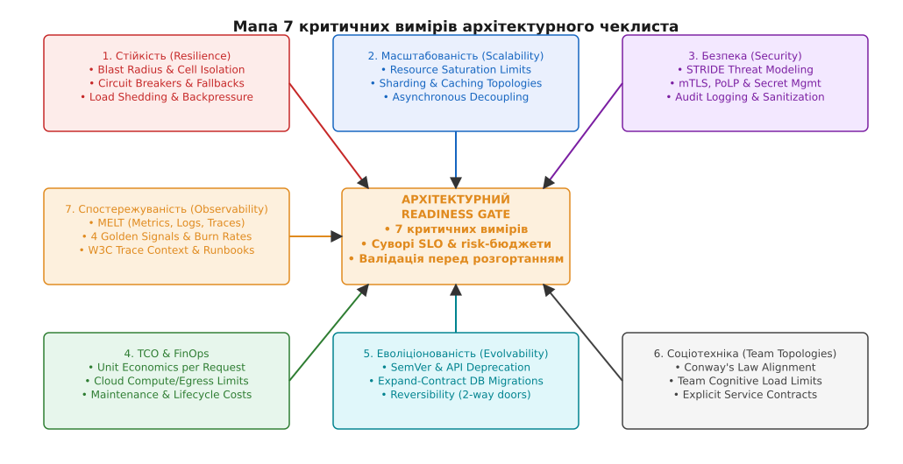
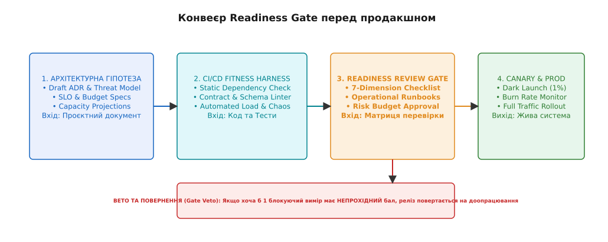
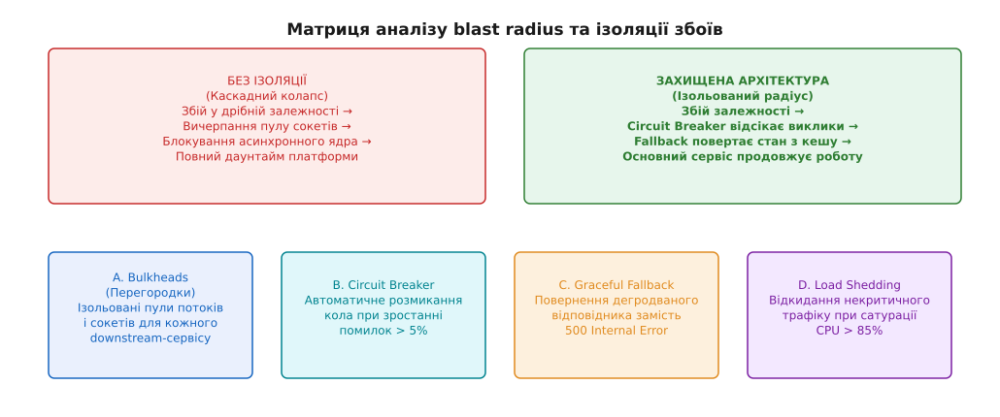

# Чеклист архітектора

<preknowlist>
- [Якісні атрибути й сценарії](root:progarch/mindset/attribute-scenarios) — вимірювані вимоги до системи як основа прийняття рішень.
- [Зворотні й незворотні рішення](book:programming/architecture-discipline/reversible-irreversible-decisions) — розрізнення 1-way та 2-way door рішень при оцінці перед продакшном.
- [Смак архітектора](root:progarch/legacy-and-evolution/architect-taste) — баланс простоти, прагматизму та чесності в інженерних судженнях.
- [Deprecation як керований процес](book:programming/architecture-discipline/deprecation-policy) — життєвий цикл змін та збереження зворотної сумісності.
- [Оцінка та управління технічним боргом](book:programming/architecture-discipline/technical-debt-management) — облік і компроміси системного боргу.
</preknowlist>

Оцінка архітектурної готовності системи перед виходом у продакшн розв'язує фундаментальну інженерну задачу: як перевірити стійкість, масштабованість, безпеку та TCO рішення під навантаженням, запобігаючи каскадним збоям і фінансовим втратам. Восени 2025 року платформа Digital Homes (DH) випустила масштабне оновлення підсистеми управління розумними енерголічильниками на 45 000 житлових об'єктів. Репозиторій системи мав 94% покриття юніт-тестами, успішно пройшов усі 1200 інтеграційних автотестів у стабільному CI/CD та отримав схвальний підпис технічного ліда. Проте через 18 хвилин після розгортання вхідного трафіку короткочасне 100-мілісекундне коливання мережі між хабами та центральним Gateway спричинило каскадний колапс:
1. Запити пристроїв повторювалися без Circuit Breaker та джитера, миттєво вичерпавши пул з'єднань із базою даних.
2. Телеметричний сервіс почав виплескувати необмежені аналоги логів у форматі JSON, що подвоїло оперативну пам'ять контейнерів і спричинило OOM-Kill у 30 мікросервісах.
3. Рахунок за хмарний трафік зростав на \$3500 щогодини через неконтрольоване повторне передавання сирих бінарних кадрів.
4. Спроба виконати відкат (rollback) провалилася, оскільки міграція бази даних зрізала застарілу колонку авторизації без проміжної фази сумісності.
5. Загальний даунтайм тривав 4 години 20 хвилин, а прямі збитки компанії сягнули \$210 000.

Цей інцидент виявив фундаментальну проблему: зелений статус юніт-тестів та формальна читота вихідного коду не мають нічого спільного з готовністю системи до реального продакшну. Між архітектурним задумом на папері й працюючим середовищем потрібен систематичний, багатовимірний фільтр — **Architectural Readiness Review Gate** (гейт оцінки архітектурної готовності).


*Мапа 7 критичних вимірів: збалансована перевірка стійкості, масштабованості, безпеки, TCO, еволіціонованості, соціотехнічного дизайну та спостережуваності захищає продакшн від катастрофічних збоїв.*

## 1. Природа Architectural Readiness Review та межі його застосування

У багатьох інженерних організаціях перевірка перед продакшном зводиться до формального підписання тикета в Jira або спонтанного перегляду коду (code review). Така практика не здатна виявити системні дефекти, оскільки перегляд коду бачить лише локальні рядки (Local Syntax), але не бачить системної топології (Global Topology), мережевих меж, економіки хмари та соціотехнічного поділу відповідальності.

Історично процедура оцінки архітектурних рішень пройшла шлях від важковагових кількатижневих сесій методології ATAM (Software Engineering Institute, 1998) до сучасних хмарних каркасів AWS Well-Architected та автоматизованих інженерних обмежень. Детальний аналіз цього еволюційного шляху висвітлено в матеріалі [історія оцінки архітектури](root:progarch/legacy-and-evolution/architect-checklist/hist-atam-evolution.md).

```
[Формальний Code Review]  ──> Перевіряє лише синтаксис та локальну логіку класу
                                        VS
[Architectural Readiness Gate] ──> Валідує 7 системних вимірів під навантаженням
```

Архітектурний чеклист не є списком бюрократичних заборон. Це інженерний інструмент верифікації висунутих гіпотез. Його призначення — гарантувати, що кожне незворотне (one-way door) та зворотне (two-way door) рішення має обґрунтовану ціну, виміряні межі та інструкцію на випадок катастрофи.

> 🔧 **Навіщо це.** Впровадження суворого Readiness Gate скорочує кількість критичних інцидентів (P1/P2 Incident Rate) у продакшні на 60–80%. Воно змушує розробників замислюватися про таймаути, вибуховий радіус та вартість хмари ще на етапі проектування, а не під час аварійного виклику о 3-й годині ночі.

---

## 2. Глибокий розбір 7 критичних вимірів архітектурного чеклиста

Практична оцінка будь-якого розгортання або зміни топології здійснюється за 7 незалежними вимірами. Проходження кожної контрольної точки вимагає наявності конкретних виміряних метрик та підтверджувальних артефактів.


*Конвеєр Readiness Gate: від архітектурної гіпотези та ADR до автоматизованих Fitness Functions і суворого фазового гейту перед розгортанням.*

---

### Вимір 1: Стійкість та відмовостійкість (Resilience & Fault Tolerance)

Стійкість описує здатність системи продовжувати виконання своїх бізнес-функцій в умовах часткової відмови інфраструктури, виходу з ладу окремих вузлів, мережевих розривів або спотворення вхідних даних.


*Матриця оцінки blast radius: ізоляція збоїв за допомогою circuit breakers, деградації функціонала та обмежений радіус ураження.*

Критичні контрольні запитання виміру стійкості:

1. **Який максимально допустимий вибуховий радіус (Blast Radius)?** Якщо сервіс розпізнавання облич на дверних панелях DH падає, чи залишається працювати фізичне відчинення реле через RFID-картку? Архітектура зобов'язана розділяти крихітне доменне ядро (Tier-1 Core) від супутніх сервісів. Перевіряється наявність ізольованих клітин (Cell-based Architecture) та автономних регіональних інстансів.
2. **Чи реалізовані перегородки (Bulkheads)?** Кожен downstream-ресурс (база даних, зовнішній API, HTTP-клієнт) мусить мати власні, ізольовані пули потоків виконання та з'єднань. Збій в аналітичному сервісі не має право вичерпувати пули транзакційної бази даних. На рівні конфігурації перевіряється наявність окремих екземплярів `ThreadPoolExecutor` та `ConnectionPool` для кожного виклику. Простеження на рівні Linux kernel через `/proc/sys/net/ipv4/tcp_max_syn_backlog` та eBPF-зонд `sys_enter_connect` підтверджує ізоляцію сокетних буферів.
3. **Як налаштовані Circuit Breakers та таймаути?** Будь-який мережевий виклик без виключного таймауту є потенційним джерелом блокування всієї системи. Захисне коло (Circuit Breaker) зобов'язане розмикатися при відсотку помилок > 5%, відсікаючи запити та запобігаючи перевантаженню пошкодженого вузла. У чеклисті фіксуються значення порогів `failureRateThreshold` та `slidingWindowSize`.
4. **Чи застосовується експоненціальне повторення з джитером (Exponential Backoff with Full Jitter)?** Повторні запити від тисяч пристроїв одночасно без випадкового зсуву за часом (jitter) створюють ефект «шторму повторів» (Retry Storm), який не дає відновитися сервісу, що тільки-но піднявся. Перевіряється формула розрахунку паузи повтору: `t_wait = random(0, min(t_max, t_base * 2^attempt))`.
5. **Чи опрацьований сценарій деградації (Graceful Degradation)?** Якщо підсистема рекомендацій енергозбереження недоступна, сервіс повертає кешовані статичні значення за замовчуванням замість помилки `500 Internal Server Error`. У маніфесті вказується чіткий режим `fallback_mode`.

---

### Вимір 2: Масштабованість та продуктивність (Scalability & Performance)

Масштабованість визначає здатність системи адаптуватися до зростання навантаження (обсягу запитів, кількості підключених пристроїв, розміру бази даних) без порушення угоди про рівень обслуговування (Service Level Agreement, SLA).

Формальна оцінка продуктивності вимагає розрахунку межі сатурації ресурсів (Resource Saturation Limits):

```
Сатурація CPU / Memory = (Поточне навантаження) / (Максимальна пропускна здатність вузла)
```

Критичні контрольні запитання виміру масштабованості:

1. **Де знаходиться поточний вузол сатурації (Bottleneck)?** Що вичерпається першим при 10-разовому зростанні трафіку: CPU сервера додатків, пропускна здатність мережевої карти, операційна пам'ять кешу чи кількість I/O операцій баз даних (IOPS)? У чеклист заносяться графіки навантажувального тестування під навантаженням 1.5× від пікового. Аналізуються профілі kernel tracepoints (`sys_enter_read`, `sys_enter_write`).
2. **Чи визначено стратегію партиціювання та шардингу даних (Data Partitioning)?** Як розподіляються дані в СУБД при зростанні таблиці телеметрії до 10 мільярдів рядків? Чи вибрано правильний ключ шардингу (Sharding Key, наприклад, `home_id`), який забезпечує рівномірне навантаження без появи «гарячих вузлів» (Hot Spots)? Перевіряється кардинальність ключа та відсутність крос-шардових транзакцій.
3. **Як побудована топологія кешування та захист від Cache Stampede?** Чи налаштовано інвалідацію кешу? Що станеться, якщо ключовий об'єкт кешу випаде під час пікового навантаження (Cache Miss Storm)? Чи використовуються імовірнісні алгоритми захисту (наприклад, XFetch або шлюзове блокування mutex)?
4. **Які показники хвостової затримки (Tail Latency `p99` та `p99.9`)?** Середня затримка (Mean Latency) є оманливою метрикою. Оцінка проводиться виключно за 99-м та 99.9-м перцентилями під максимальним синтетичним навантаженням. Фіксується максимальний поріг `p99_latency_ms`.
5. **Чи відокремлено синхронний шлях обробки від асинхронного?** Операції, які не вимагають миттєвої відповіді користувачеві (надсилання push-сповіщень, генерування аналітичних звітів, запис аудиту), зобов'язані виноситися в асинхронні черги за допомогою патерну Transactional Outbox. Перевіряється гарантія доставки `at-least-once` та ідемпотентність обробників.

---

### Вимір 3: Безпека та модель загроз (Security & Risk Mitigation)

Безпека системи оцінюється на основі принципу Zero Trust (нульова довіра) та моделі загроз STRIDE (Spoofing, Tampering, Repudiation, Information Disclosure, Denial of Service, Elevation of Privilege).

Критичні контрольні запитання виміру безпеки:

1. **Чи розграничені периметри та межі довіри (Trust Boundaries)?** Чи використовується взаємна автентифікація mTLS (Mutual TLS) між усіма мікросервісами платформи? Чи шифрується трафік як у стані спокою (Encryption at Rest), так і під час передачі мережею (Encryption in Transit)? Валідується конфігурація TLS 1.3 та шифрів.
2. **Чи дотримано принципу найменших привілеїв (Principle of Least Privilege)?** Чи має сервіс телеметрії доступ лише до запису своїх конкретних таблиць у СУБД, чи він запускається з правами `DBA / root`? Перевіряються маніфести IAM-ролей та файли конфігурації баз даних.
3. **Як реалізовано управління секретами (Secret Management)?** Перевірка на відсутність захардкоджених паролів, API-ключів та приватних сертифікатів у вихідному коді або змінних оточення Docker-контейнерів. Секрети повинні динамічно монтуватися з захищених сховищ (наприклад, HashiCorp Vault) з обмеженим часом життя (TTL).
4. **Чи забезпечено захист від атак типу Denial of Service (DoS) та санітизацію вхідних даних?** Чи налаштовано Rate Limiting на всіх публічних API-ендпоінтах? Чи перевіряються розміри вхідних кадрів та JSON-структур до їх парсингу в оперативній пам'яті? Перевіряється наявність лімітів `max_body_size` у шлюзі.
5. **Чи ведеться журнал безпекового аудиту (Audit Logging) з захистом від підробки?** Усі операції зміни прав, відчинення замків та вивантаження персональних даних мусять записуватися в журнал, який недоступний для редагування навіть адміністраторам сервісу (Append-Only Log).

---

### Вимір 4: TCO та FinOps (Total Cost of Ownership & Resource Efficiency)

Повна вартість володіння (TCO) оцінює не лише безпосередній рахунок за хмарну інфраструктуру (AWS, GCP, Azure), але й операційні витрати на її підтримку, споживання ресурсів та потенційний ризик прив'язки до вендора (Vendor Lock-in).

Формула розрахунку Unit Economics архітектурного рішення:

```
Unit Cost = (Загальна вартість інфраструктури за місяць) / (Кількість активних користувачів або 1M запитів)
```

Критичні контрольні запитання виміру TCO:

1. **Яка питома вартість одного запиту (Unit Cost)?** Чи розуміє команда, скільки коштує обробка одного смарт-замка на місяць? Якщо архітектурне оновлення покращує затримку на 2 мс, але підвищує вартість хмари у 4 рази, таке рішення є інженерно незрілим. У чеклист додається розрахунок `USD_per_1M_requests`. Розрахунок для DH: при 45 000 хабах та 12 000 rps цільовий Unit Cost не повинен перевищувати \$0.42 на 1M запитів.
2. **Чи налаштовано автоматичне масштабування та ліміти ресурсів (Requests / Limits)?** Чи встановлено суворі межі CPU та RAM для контейнерів у Kubernetes? Контейнери без визначених лімітів можуть захопити всі ресурси вузла (Noisy Neighbor Problem). Перевіряється відповідність `limits` до результатів навантажувальних тестів через `/sys/fs/cgroup/memory/memory.stat`.
3. **Яка стратегія життєвого циклу даних (Data Lifecycle & Retention Policy)?** Скільки часу зберігаються сирі метрики телеметрії? Наприклад, збереження детальної секундної телеметрії протягом 5 років у гарячому оперативному сховищі є фінансовим самогубством. Дані мусять автоматично агрегуватися та стискатися у холодні бакети (Cold Object Storage).
4. **Яка ціна прив'язки до вендора (Vendor Lock-in Assessment)?** Наскільки легко перенести сервіс із пропрієтарного хмарного сервісу на відкритий аналог у разі зміни цін або виходу з регіону? Оцінюється вартість портів та абстракцій.
5. **Які операційні накладні витрати (Operational Overhead)?** Скільки людсько-годин вимагатиме обслуговування даної інфраструктури (наприклад, підтримка власного кластера Kafka проти використання керованого сервісу)?

---

### Вимір 5: Еволіціонованість та сумісність (Evolvability & Backward Compatibility)

Еволіціонованість описує легкість, із якою система може змінюватися в майбутньому без деструктивного впливу на існуючі клієнти та суміжні сервіси.

Критичні контрольні запитання виміру еволіціонованості:

1. **Як управляються версії API та політика виведення з експлуатації (Deprecation Policy)?** Чи дотримується сервіс семантичного версіонування (SemVer)? Чи реалізовано період паралельного співіснування старих та нових версій контракту для забезпечення плавного переходу? Валідуються заголовки `Deprecation` та `Sunset`.
2. **Чи застосовується патерн Expand-Contract для міграцій баз даних?** Жодна міграція структури даних у продакшні не повинна видаляти або перейменовувати колонки за один крок. Зміна виконується у три фази: 1) Розширення (Expand) — додавання нової колонки; 2) Перехід — подвійний запис у обидві колонки; 3) Звуження (Contract) — видалення старої колонки після оновлення всіх клієнтів.
3. **Наскільки рішення є зворотним (Reversibility & Feature Toggles)?** Чи належить рішення до категорії «двохсторонніх дверей» (Two-Way Door)? Чи сховано новий функціонал за перемикачами (Feature Flags / Dark Launch), що дозволяє вимкнути його за 5 секунд у разі аномалій без викочування нового релізу?
4. **Чи відсутнє паразитне зачеплення (Coupling Analysis)?** Чи немає прихованого розподіленого моноліту, де зміна одного поля у сервісі A вимагає одночасного розгортання сервісів B, C та D (Temporal and Deployment Coupling)?

---

### Вимір 6: Соціотехнічний дизайн та Team Topologies (Sociotechnical Alignment)

Соціотехнічний вимір перевіряє відповідність структури програмного забезпечення організаційній структурі інженерних команд, спираючись на закон Конвея (Conway's Law).

Конвеєрний зв'язок між архітектурою та організацією:

```
[Організаційна структура команд] ──(Закон Конвея)──> [Архітектурні межі сервісів]
```

Критичні контрольні запитання соціотехнічного виміру:

1. **Чи збігаються межі сервісу з межами відповідальності однієї команди?** Сервіс повинен належати **точнісінько одній** інженерній команді. Спільне володіння кодом кількома командами без чітких API-контрактів призводить до розмивання відповідальності та ерозії коду.
2. **Яке когнітивне навантаження на команду (Cognitive Load)?** Чи не змушена одна команда підтримувати 25 різних мікросервісів, написаних 5 різними мовами програмування? Перевищення когнітивного навантаження призводить до вигорання та систематичних помилок у коді.
3. **Чи визначено чіткі типи команд (Stream-aligned, Platform, Enabling, Complicated-subsystem)?** Хто надає інфраструктурну платформу як продукт, а хто відповідає за кінцеву бізнес-фічу?
4. **Чи відсутні одиничні точки відмови у знаннях (Single Point of Knowledge Failure)?** Чи є у команді щонайменше 2–3 інженери, які розуміють внутрішній устрій даного вузла та вміють виконувати його аварійну процедуру?

---

### Вимір 7: Спостережуваність та оперованість (Observability & Operability)

Спостережуваність вимірює можливість зрозуміти внутрішній стан системи на основі її зовнішніх виходів (метрик, логів, трасувань) та швидкість реакції чергових інженерів на відхилення від норми.

Критичні контрольні запитання виміру спостережуваності:

1. **Чи реалізовано повний каркас MELT (Metrics, Events, Logs, Traces)?** Чи збираються 4 золоті сигнали (Golden Signals: Latency, Traffic, Errors, Saturation)? Валідуються експортери Prometheus/OpenTelemetry.
2. **Чи прокидається контекст сквозного трасування (W3C Trace Context / OpenTelemetry)?** Чи дозволяє єдиний `Trace ID` простежити шлях запиту від натискання кнопки у мобільному застосунку через API Gateway, чергу RabbitMQ до SQL-запиту в PostgreSQL? Контролюється наявність заголовка `traceparent: 00-4bf92f3577b34da6a3ce929d0e0e4736-00f067aa0ba902b7-01`.
3. **Чи є сповіщення дієвими (Actionable Alerts)?** Сповіщення повинні приходити лише тоді, коли вичерпується бюджет помилок (Error Budget Burn Rate) або потрібне негайне втручання людини. Оповіщення, які проігноровано 10 разів, перетворюються на «шум моніторингу».
4. **Чи створено та перевірено інструкції з експлуатації (Runbooks / SOPs)?** Кожне сповіщення у моніторингу мусить містити пряме посилання на Runbook із покроковими інструкціями діагностики, перезапуску та локалізації збою.
5. **Чи готові сценарії розгортання (Canary Deployment & Rollback)?** Чи підтримує інфраструктура канареєчне розгортання (rollout на 1% → 5% → 25% → 100% трафіку) з автоматичним відкатом при зростанні помилок?

---

## 3. Методологія проведення Readiness Review Gate

Процедура архітектурного гейту не повинна ставати бюрократичним гальмом розробки. Для цього вона розділяється на два взаємодоповнюючі рівні: автоматичний та експертний.

```
                  [ПРОЦЕС READINESS REVIEW GATE]
                                │
       ┌────────────────────────┴────────────────────────┐
       ▼                                                 ▼
[Автоматичний рівень (CI/CD)]                 [Peer-Review Рівень]
• Static Dependency Check                    • Оцінка TCO та бізнес-ризиків
• Linter контракту & схем                     • Перевірка Runbooks
• Architecture Fitness Functions              • Обговорення 7 вимірів
```

### Автоматичний рівень: CI/CD Architecture Fitness Harness

Більшість технічних обмежень (наприклад, перевірка меж зачеплення класів, відсутність таймаутів, наявність W3C Trace Context та валідація SemVer) перевіряються автоматично при кожному збиранні коду за допомогою спеціальних тестових контролерів. Приклад реалізації такого контролера наведено у матеріалі [контролер архітектурних обмежень](root:progarch/legacy-and-evolution/architect-checklist/proj-fitness-functions-harness.md).

### Експертний рівень: Peer-Review та контракт перевірки

Для оцінки соціотехнічних, економічних та стратегічних компромісів команда висуває реліз разом із машинно-читаним маніфестом readiness-gate. Точний формат цього контракту, математична модель розрахунку підсумкового балу готовності та вето-порогові значення наведені у матеріалі [специфікація Readiness Gate](root:progarch/legacy-and-evolution/architect-checklist/api-architectural-gate-spec.md).

### Алгоритм проведення сесії Readiness Review (30 хвилин)

1. **Крок 1. Перевірка авто-тестів (5 хв):** Підтвердження зеленого статусу CI/CD Architecture Fitness Harness.
2. **Крок 2. Аналіз блокуючих умов (10 хв):** Перевірка 7 вимірів на наявність Hard Blockers.
3. **Крок 3. Оцінка операційної готовності (10 хв):** Перевірка посилань на Runbooks, графіки панелей моніторингу та інструкції з відкату.
4. **Крок 4. Прийняття рішення (5 хв):** Схвалення релізу (`PASSED`), умовний пропуск із фіксацією технічного боргу (`CONDITIONAL_PASS`), або вето та повернення на доопрацювання (`REJECTED`).

---

## 4. Практична матриця контрольних запитань та антипатерни

Для повсякденної роботи архітектора зручно використовувати узагальнену матрицю самоперевірки.

| Вимір | Головна перевірка перед деплоєм | Поширений антипатерн |
| :--- | :--- | :--- |
| **Стійкість** | Наявність Circuit Breakers та джитера у повторах | Падаюча залежність блокує всі потоки виконання ядра |
| **Масштабованість** | Захист від Cache Stampede та партиціювання | Кеш-промах випалює транзакційну базу даних |
| **Безпека** | mTLS між сервісами та відсутність секретів у коді | Hardcoded креденшали в Docker-образах |
| **TCO** | Визначені ліміти ресурсів та політика retention | Безкінечний ріст безструктурних логів у дорогій СУБД |
| **Еволіціонованість** | Міграція схеми БД за патерном Expand-Contract | Одномоментне видалення колонки, що ламає старий реліз |
| **Соціотехніка** | Точно одна відповідальна команда за сервіс | Спільна зона "нічийної" відповідальності кількох команд |
| **Спостережуваність** | Сквозний Trace ID та пряме посилання на Runbook | Оповіщення аварії без інструкції, що саме ремонтувати |

### Антипатерни проведення Readiness Review

- **Антипатерн 1. «Паперова архітектура» (Paper Architecture):** Заповнення чеклиста раді формальності без реальної перевірки під навантаженням. Лікується впровадженням автоматизованих Fitness Functions у CI/CD.
- **Антипатерн 2. «Архітектурна інквізиція» (Architecture Police):** Перетворення гейту на каральний орган, який блокує розробку через дрібні стилістичні невідповідності. Лікується чітким розділенням на Hard Blockers та рекомендації.
- **Антипатерн 3. «Реліз Великого Вибуху» (Big Bang Rollout):** Одночасне розгортання десятка нових сервісів без канареєчного етапу. Лікується обов'язковою вимогою Dark Launch та Feature Flags.

Застосування 7-вимірної матриці перевірки перетворює випуск програмних систем із небезпечного експерименту на передбачуваний, вимірюваний та контрольований інженерний процес.
