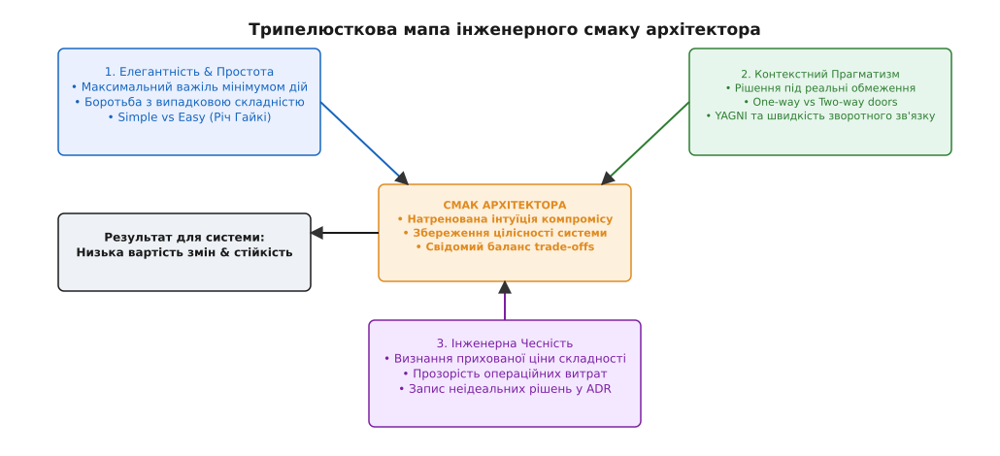
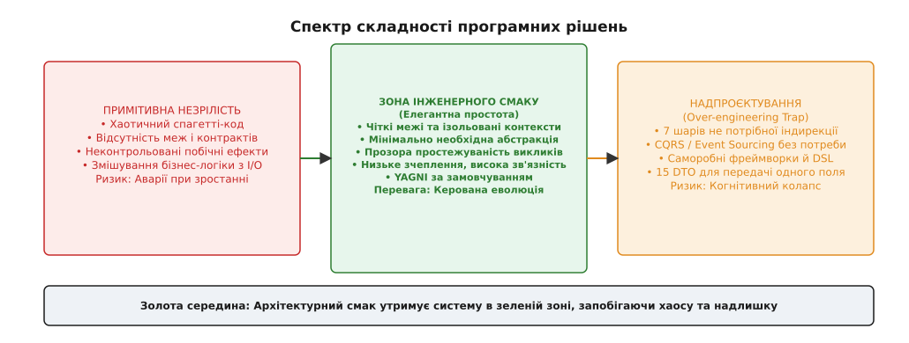
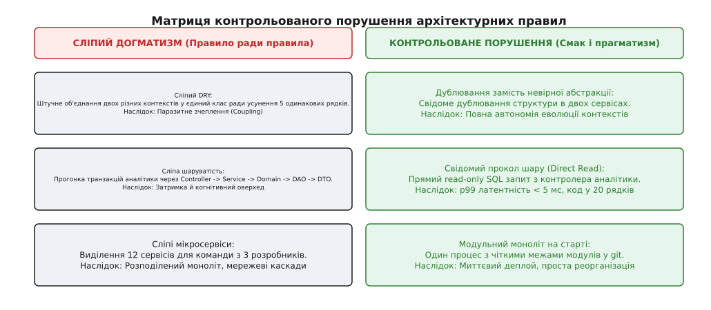

# Смак архітектора

<preknowlist>
- [Якісні атрибути й сценарії](root:sf-apps/attribute-scenarios) — вимірювані вимоги до системи як основа прийняття рішень.
- [Trade-off-аналіз](root:sf-apps/tradeoff-analysis) — свідомий компроміс між латентністю, консистентністю та вартістю.
- [YAGNI та боротьба з надлишковою складністю](root:sf-apps/dry-kiss-yagni) — принцип мінімізації непотрібної абстракції та випадкової складності.
- [Зворотні й незворотні рішення](root:sf-apps/reversible-irreversible-decisions) — калібрування темпу розробки під ціну відкату.
- [Ерозія архітектури](root:sf-apps/architecture-erosion) — деградація системи під тиском локальних змін.
</preknowlist>

У січневу ніч під час аварійного відключення електромережі у багатоповерховому житловому комплексі Києва електронні замки платформи Digital Homes (DH) відмовилися відчиняти двері для 200 мешканців. Аварійна команда, яка прибула на місце, з'ясувала, що внутрішній контролер хаба не зміг виконати локальну авторизацію через 15-секундний таймаут у мережевому виклику. Аналіз вихідного коду виявив, що проста команда «відчинити реле за збереженим криптографічним ключем» проходила крізь 14 послідовних шарів індирекції: `AbstractLockStrategyFactory` → `AccessPolicyChainMediator` → `DynamicConfigRedisProxy` → `EventSourcingAggregateRoot` → `RxSubjectDispatcher` → `BLEHardwareAdapter`. Тимчасовий збій сокета у локальному Redis-кеші викликав каскадне блокування потоків виконання всього сервісу. Репозиторій системи мав 98% покриття юніт-тестами, нуль зауважень від linter-аналізаторів і повністю відповідав канонам «чистої архітектури», але представляв собою абсолютну катастрофу інженерного судження. Цей інцидент продемонстрував базову істину: сухе дотримання формальних правил без інженерного смаку перетворює систему на крихку, некеровану та небезпечну споруду.


*Трипелюсткова мапа інженерного смаку: гармонійне поєднання елегантної простоти, контекстного прагматизму та інженерної чесності забезпечує мінімальну вартість змін та високу стійкість системи.*

## 1. Природа інженерного смаку та ілюзія формального догматизму

У професійному середовищі розробників програмного забезпечення поняття «смак» (taste) часто викликає насторогу або нерозуміння. Його плутають із суб'єктивними естетичними вподобаннями, стилістичним «мені так подобається» або естетикою синтаксичного цукру конкретної мови програмування. Протім в інженерній дисципліні смак архітектора — це строго натренована інтуїція компромісу, здатність передбачати майбутню ціну поточного рішення та глибоке відчуття доцільності кожної абстракції.

Формальний догматизм опирається на дотримання правил ради самих правил. Розробник зчитує з книжок або підручників патерни (GoF, CQRS, Event Sourcing, Hexagonal Architecture) та починає застосовувати їх як універсальний чеклист: якщо у нас є сутність, для неї **мусить** бути інтерфейс, репозиторій, фабрика, сервісний шар, DTO-конвертер та CQRS-медіатор. Такий підхід створює ілюзію високої якості, оскільки кожен окремий клас виглядає «чистим» і має один обов'язок (Single Responsibility Principle). Проте на рівні всієї системи виникає феномен, детально описаний у матеріалі [історія інженерного смаку](root:progarch/architect-taste/hist-taste-lineage.md): випадкова складність (accidental complexity) зростає експоненціально щодо істотної складності (essential complexity) доменної задачі.

```
[Доменна задача: Відчинити замок]  ── (Істотна складність: 5%)
                 │
                 ▼
[Формальний догматизм]            ── (Випадкова складність: 95%)
  ├── 14 шарів індирекції
  ├── 5 DTO-маперів на кожен запит
  ├── 3 рівні асинхронних черг
  └── Повна втрата простежуваності виклику
```

Смак архітектора проявляється не в тому, скільки патернів він знає й зміг впровадити в проєкт, а в тому, від скількох непотрібних патернів він **свідомо відмовився**. Елегантна система виглядає так, ніби вона була зібрана найкоротшим і найприроднішим шляхом: у ній немає жодної абстракції, без якої неможливо обійтися, і жодної деталі, яка існує «про всяк випадок».

Недосвідчені розробники часто вважають, що додавання додаткових шарів абстракцій захищає код від майбутніх змін. Це одна з найпоширеніших ілюзій у програмуванні. Створення абстракції — це завжди обмін: ви отримуєте можливість підмінити реалізацію в майбутньому ціною збільшення когнітивного навантаження, втрати прямої простежуваності викликів та ускладнення налагодження прямо зараз. Якщо ймовірність зміни реалізації становить 5%, а ціна утримання абстракції сплачується щодня кожним розробником команди, цей обмін є інженерно збитковим.

### Чотири стадії професійного дозрівання інженера

Еволюція архітектурного мислення розробника зазвичай проходить крізь чотири послідовні етапи:

1. **Стадія 1. Наївний хаос (Naive Hacking):** Код пишеться суцільним спагетті-потоком без розділення меж, без інкапсуляції та без урахування атрибутів якості. Логіка I/O змішана з обчисленнями.
2. **Стадія 2. Догматичне надпроєктування (Pattern Dogmatism):** Розробник відкриває для себе патерни та архітектурні книги. Система перенасичується фабриками, обгортками, інтерфейсами на кожен клас та CQRS-медіаторами. Проєкт стає «чистим» за формальними ознаками, але абсолютно нежиттєздатним під навантаженням.
3. **Стадія 3. Прагматичне розчарування (Pragmatic Awareness):** Інженер стикається з аваріями у продакшні, складним debugging та високими рахунками за хмару. З'являється розуміння, що кожен шар індирекції має свою ціну у мільсекундах та доларах.
4. **Стадія 4. Архітектурний смак (Effortless Elegance):** Повернення до простоти на вищому рівні розуміння. Інженер обирає найпростіший шлях, який гарантовано виконує SLO, легко вимірюється і вимагає мінімальних зусиль для підтримки.

Причинно-наслідковий ланцюг втрати інженерного смаку на другій стадії розгортається за наступним сценарієм:

```
[Страх невизначеності] → [Передчасне узагальнення] → [Створення неіснуючих шарів] → [Когнітивний колапс]
```

Зрілий архітектор розуміє, що найкраща абстракція — це її відсутність доти, доки в коді не з'явиться щонайменше дві або три реальні, виміряні реалізації, які вимагають спільного інтерфейсу.

> 🔧 **Навіщо це.** Інженерний смак — це головний захисний механізм від когнітивного колапсу команди. Коли новий розробник витрачає три дні лише на те, щоб відстежити шлях HTTP-запиту до SQL-запиту крізь десяток абстрактних фасадів, швидкість розробки сповільнюється у рази, а ризик непоміченої помилки при викликах зростає.

## 2. Три стовпи інженерного смаку: Елегантність, Прагматизм та Чесність

Судження архітектора формується на перетині трьох фундаментальних принципів, жоден з яких не може існувати ізольовано від інших.

### Стовп 1. Елегантність і боротьба за простоту (Elegance & Simplicity)

Елегантність у програмуванні — це не прикраса, а максимальний важіль, отриманий мінімальною кількістю концепцій. Як сформулював Річ Гайкі у своїй праці *Simple Made Easy*, необхідно чітко розрізняти *Easy* (те, що зручно написати прямо зараз за допомогою готового фреймворку чи генератора коду) та *Simple* (те, що не створює невидимих переплетінь і зчеплення між модулями).

Елегантний дизайн вирізняється наступними ознаками:
- **Очевидність відсутності дефектів:** Структура коду настільки прозора, що для розуміння його роботи не потрібно тримати в голові п'ять шарів неявного стану. Чарльз Гоар вказував, що система повинна бути побудована так, щоб дефектам просто не було де приховатися.
- **Основа на даних, а не на індирекції:** Передача чітких, незмінних структур даних (Data Transfer Objects / Structs) замість складних ієрархій об'єктів з прихованою мутацією та побічними ефектами.
- **Максимальне використання мовної виразності:** Замість побудови власного обгорткового DSL використання лаконічних мовних конструкцій і базових контейнерів.

### Стовп 2. Контекстний прагматизм (Contextual Pragmatism)

Жодне архітектурне рішення не існує у вакуумі. Те, що є еталоном для системи з 10 мільйонами активних користувачів і командою з 300 інженерів (наприклад, розподілений сервіс-меш із складною інфраструктурою), стає архітектурним злочином для стартапу з трьох людей, який перевіряє бізнес-гіпотезу.

Контекстний прагматизм вимагає від архітектора постійно аналізувати наступні фактори:
1. **Яка ціна відкату цього рішення?** Якщо це зворотне рішення (two-way door, наприклад, вибір бібліотеки логування або внутрішнього HTTP-клієнта), його треба приймати за 15 хвилин без нескінченних дискусій. Якщо це незворотне рішення (one-way door, наприклад, вибір первинної СУБД або публічного API-контракту), воно вимагає ретельного аналізу та створення прототипу (walking skeleton).
2. **Який поточний бюджет і зрілість команди?** Прагматик обирає «нудні технології» (Boring Technology), які команда вже вміє експлуатувати та відбудовувати у 3 години ночі під час пожежі, замість того щоб тягнути у прод новітній розподілений брокер з документацією на 5 сторінок.
3. **Де знаходиться дійсний вузол навантаження?** Архітектор оптимізує ті вузли, які обмежують продуктивність за виміряними SLO, а не ті, які «цікаво проєктувати».

### Стовп 3. Інженерна чесність (Technical Honesty)

Найважчий елемент смаку — це абсолютна чесність перед собою, командою та бізнесом. Розробники схильні маскувати свої особисті вподобання, бажання спробувати нову технологію для резюме (Resume-Driven Development) або прагнення приховати швидкий хак під виглядом «високоабстрактного патерна».

Інженерна чесність означає:
- **Визнання прихованих витрат:** Якщо ми обираємо мікросервісну топологію, ми чесно кажемо бізнесу: «Ми купуємо автономію команд ціною збільшення мережевої латентності в 5 разів, здорожчання хмари на 40% і потреби у додаткових інженерах з експлуатації».
- **Фіксація неідеальних рішень:** Якщо під тиском дедлайну доводиться написати тимчасовий компромісний код, архітектор не обгортає його в 5 абстрактних класів, щоб створити видимість «ідейності», а чесно називає речі своїми іменами, ставить таг `TODO` та реєструє технічний борг у ADR (Architecture Decision Record).
- **Сміливість визнати помилку:** Коли з'ясовується, що обрана пів року тому NoSQL-база даних не справляється зі складними реляційними вибірками, чесний архітектор не будує поверх неї саморобний індексний рушій, а готує план міграції на PostgreSQL.

## 3. Анатомія та маркери надлишкової складності (Accidental Complexity)

Надлишкова складність майже ніколи не з'являється одномоментно через злий намір. Вона накопичується поступово, у формі дрібних «покращень», кожне з яких окремо виглядає логічним та правильним.


*Спектр складності: завдання архітектора — утримувати систему в зеленій зоні елегантної простоти, не допускаючи сповзання ані в примітивний хаос, ані в пастку надпроєктування.*

### Пастки надпроєктування (Over-Engineering Patterns)

Розглянемо найпоширеніші сценарії, де відсутність інженерного смаку призводить до деградації архітектури:

1. **Передчасне узагальнення (Premature Generalization):** Створення складного патерна `Strategy` або плагінної системи для коду, який має всього одну реалізацію і не змінюватиметься найближчі два роки. Приклад з практики DH: розробник написав абстрактний розбирач для 12 різних протоколів розумних лічильників, хоча компанія продавала лише одну модель давача.
2. **Сліпе карго-культування:** Бездумне копіювання архітектурних рішень великих тех-гігантів (Netflix, Uber, Google) без наявності їхніх масштабів та ресурсів. Якщо ваш сервіс обробляє 50 запитів на секунду, вам не потрібен Kafka-кластер із 10 вузлів та сітка з 30 мікросервісів.
3. **Саморобні інфраструктурні фреймворки:** Прагнення створити «власний легкий ORM», «власну бібліотеку DI» або «власний сервіс конфігурації». У 99% випадків це закінчується створенням погано протестованого, недокументованого монолітного монстра, якого вміє підтримувати лише його автор.
4. **Каскади DTO-трансформацій:** Ситуація, коли дані на шляху від бази даних до HTTP-відповіді перекладаються з `Entity` в `DomainModel`, потім в `ApplicationDTO`, далі в `ServiceResponse` і наприкінці в `ViewDTO`. Якщо всі п'ять структур мають ідентичний набір полів, це 100% ознака відсутності смаку.
5. **Абстракція як психологічний захист (Abstraction as Defense):** Ситуація, коли розробник створює три шари інтерфейсів лише тому, що бізнес ще не визначився з остаточними вимогами. Замість того щоб уточнити вимоги або застосувати принцип останнього відповідального моменту (Last Responsible Moment), інженер будує «універсальний комбайн», який пізніше виявляється непридатним для жодного з реальних сценаріїв.

### Кількісні метрики втрати смаку

Виявити відсутність інженерного смаку в системі можна за допомогою автоматичного аналізу метрик, які демонструються у практичному матеріалі [обчислення бюджету складності](root:progarch/architect-taste/proj-complexity-budget.md):

| Метрика складності | Норма (Смак) | Пастка (Over-engineering) |
| :--- | :--- | :--- |
| **Глибина індирекції (Call Depth)** | 2 – 4 шари від входу до I/O | > 6 шарів транзитних викликів |
| **Wrapper Ratio (Частка класів-проксі)** | < 15% від усіх модулів | > 35% (класи лише перенаправляють виклик) |
| **Кількість DTO на один потік даних** | 1 – 2 структури | > 5 конвертацій одних полів у інші |
| **Час на трасування помилки у логах** | < 5 хвилин (єдиний correlation ID) | Години плутанини між шарами й асинхронними подіями |

Формула співвідношення користі до складності реалізації має вигляд:

```
                  Корисність для бізнесу + Зручність підтримки
Індекс Смаку = ──────────────────────────────────────────────────────────
                Кількість абстракцій × Когнітивне навантаження
```

Якщо при додаванні нової невеликої бізнес-вимоги індекс смаку прямує до нуля (тобто кількість створеного інфраструктурного коду значно перевищує обсяг бізнес-логіки) — система перебуває в стані важкої архітектурної ерозії.

## 4. Контрольоване порушення правил: коли інженерне чуття вище за канон

Справжня зрілість інженера визначається не знанням усіх правил з підручників, а розумінням фізичних причин, з яких ці правила були створені, та здатністю **свідомо і контрольовано порушувати їх**, коли цього вимагають виміряні атрибути якості.


*Матриця контрольованого порушення правил: порівняння сліпого догматизму з контрольованим прагматизмом на прикладах DRY, шаруватості та топології.*

### Практичні кейси прагматичних винятків

Розглянемо конкретні ситуації з розробки Digital Homes, де свідоме порушення канонічних правил виявилося єдино правильним архітектурним ходом:

#### Кейс 1. Свідоме порушення DRY (Дублювання замість невірної абстракції)

Принцип DRY (Don't Repeat Yourself) вимагає уникати дублювання знань у системі. Проте недосвідчені інженери плутають дублювання *тексту коду* з дублюванням *бізнес-знань*.

У системі Digital Homes сервіс билінгу (`BillingService`) та сервіс моніторингу обладнання (`DeviceTelemetry`) мали схожі 10 рядків коду для вирахування часових інтервалів активності пристроїв. Розробник змайстрував спільний модуль `CommonUtils` у спільному репозиторії, куди виніс цю логіку. За шість місяців будь-яка зміна у `CommonUtils` для потреб билінгу ламала розархівацію телеметрії.

Смак архітектора підказує: **краще дублювати 10 рядків коду у двох незалежних контекстах, ніж створити між ними паразитне зчеплення (coupling) через спільну хибну абстракцію**. Порушення DRY тут є абсолютно виправданим інженерним ходом, який зберігає автономію мікросервісів.

#### Кейс 2. Прокол шару (Direct Layer Bypass for Performance)

Класична Hexagonal або Layered архітектура забороняє веб-контролеру звертатися напряму до бази даних, вимагаючи проходити через сервісний шар та репозиторій, які повертають доменні агрегати.

Проте для високонавантаженого дашборду DH, який запитує агреговану статистику за мільйоном телеметричних подій на секунду, завантаження повноцінних доменних об'єктів ORM через 3 шари створювало колосальне навантаження на Garbage Collector та додавало 120 мс затримки.

Архітектор прийняв рішення про **контрольований прокол шару**: створення спеціалізованого Read-Model контролера, який виконує прямий, оптимізований `SELECT` запит до TimescaleDB і відразу віддає JSON-потік у сокет.

```
[Стандартний шлях (Write-path)] : Controller ──> Service ──> Domain ──> Repository ──> DB
                                                                                        │
[Прокол шару (Read-path)]       : Controller ───────────────────────────────────────────┘ (Direct SQL)
```

Це рішення було оформлено відповідним ADR з чіткими межами: прокол дозволено **тільки** для read-only операцій аналітики під контролем SLO латентності, тоді як усі мутації стану (write-path) строго проходять крізь доменні агрегати та інваріанти.

#### Кейс 3. Синхронний REST замість розподіленої Саги для простих сценаріїв

Мода на подієву архітектуру (Event-Driven Architecture) змушує багатьох розробників впроваджувати асинхронний обмін повідомленнями та патерн Сага навіть туди, де достатньо прямого виклику. При оформленні підписки на сповіщення DH розробники спочатку побудували ланцюжок із 4 топіків у RabbitMQ з компенсаційними подіями. Помилка у форматі JSON призводила до того, що повідомлення губилися у Dead Letter Queue, а користувач чекав підтвердження 10 секунд.

Архітектор спростив схему до одного синхронного gRPC-запиту з таймаутом у 200 мс та явним поверненням помилки. Система стала у 50 разів простішою для розуміння й підтримання, а рівень успішних транзакцій зріс до 99.99%.

#### Кейс 4. Монолітний складний модуль замість 5 мікросервісів

На ранньому етапі розробки DH сервіси авторизації, керування користувачами, списку пристроїв та сповіщень були об'єднані в єдину процесну систему (Модульний моноліт). Це дозволило команді здійснювати атомарні БД-транзакції та рефакторити межі контекстів усередині однієї IDE без потреби у складній розподіленій координації. Розбиття на мікросервіси було відкладено до моменту, коли масштаби навантаження та розміри команд дійсно вимагали мережевої ізоляції.

### Межа між інженерним смаком та банальним костилем (Hack)

Чим відрізняється свідоме порушення правил архітектором зі смаком від неохайного коду (spaghetti code)?

1. **Локалізованість меж:** Виняток із правила ізольовано всередині одного модуля або за чітким інтерфейсом. Він не протікає в сусідні контексти.
2. **Вимірюваність мотивації:** Рішення прийнято не тому, що розробнику було лінь написати тест, а на основі конкретних чисел (наприклад, зменшення p99 latency з 150 мс до 4 мс або скорочення часу деплою з 40 хвилин до 2 хвилин).
3. **Явна документація у ADR:** Наявність запису в журналі архітектурних рішень із вказівкою: ЧОМУ правило було порушено, ЯКІ альтернативи розглядали, і за ЯКИХ умов це рішення має бути переглянуто у майбутньому.

## 5. Порівняльний аналіз: Елегантна модель проти Пастки надпроєктування

Для ілюстрації різниці між формальним догматизмом та інженерним смаком розглянемо реальнй модуль сповіщень користувачів платформи Digital Homes (системні push-нотифікації про спрацювання давачів протікання води).

```
[Варіант А: Пастка надпроєктування (Over-engineered)]
  Event ──> EventBus ──> SagaManager ──> NotificationFactory ──> TemplateExpressionEngine
        ──> ProviderResolverStrategy ──> QueueProducer ──> Worker ──> ExternalAPI
  (6 сервісів, 12 DTO, Kafka-кластер, p99 = 4.2 секунди, рахунок AWS = $800/міс)

[Варіант Б: Зона інженерного смаку (Tasteful Elegance)]
  Event ──> NotificationWorker (PostgreSQL Transactional Queue) ──> HTTP Client (Retry Policy)
  (1 процесний модуль, 2 структури даних, p99 = 180 мс, рахунок AWS = $20/міс)
```

Порівняння обох рішень за атрибутами якості та експлуатаційними витратами:

| Атрибут / Метрика | Варіант А (Надпроєктований) | Варіант Б (Архітектурний смак) |
| :--- | :--- | :--- |
| **Латентність доставки (p99)** | 4200 мс (затримка в чергах) | 180 мс (прямий зважений виклик) |
| **Обсяг вихідного коду** | 4500 рядків C++ / 18 класів | 380 рядків C++ / 3 модулі |
| **Час онбордингу розробника** | 2 тижні вивчення фреймворку | 2 години читання коду |
| **Вартість інфраструктури** | $800 / місяць (Kafka + K8s) | $20 / місяць (існуючий Postgres) |
| **Час локалізації аварії** | 3 години простеження трейсів | 5 хвилин за логом з Correlation ID |

Рішення Б не лише виявилося у 40 разів дешевше в експлуатації та у 23 рази швидше, але й гарантувало значно вищий рівень надійності за рахунок мінімальної кількості потенційних точок відмови (Points of Failure).

## 6. Гартування архітектурного судження: евристики та щоденна практика

Інженерний смак не є вродженим талантом чи містичним даром. Це професійна навичка, яка гартується роками практичної роботи, аналізом власних та чужих помилок і постійною аналітичною дисципліною.

### Евристики оцінки рішень для щоденної практики

Зріле архітектурне судження спирається на набір перевірених евристик, які дозволяють швидко відсіяти невдалі конструкції ще на етапі обговорення RFC або ADR:

1. **Евристика серветки (Whiteboard Test):** Якщо ви не можете намалювати топологію взаємодії модулів для даної фічі за 2 хвилини на маркерній дошці, ваше рішення переускладнене.
2. **Евристика вилучення (Deletion Test):** Чим простіше вилучити або повністю замінити модуль у майбутньому без переписання всієї системи, тим краща його архітектура.
3. **Евристика операційного болю (3 AM Operations Test):** Запитайте себе: як черговий інженер о 3-й годині ночі під час пожежі в продакшні зрозуміє, чому ця конкретна транзакція зависла? Якщо для цього треба читати вихідний код 5 мікросервісів — рішення не має смаку.
4. **Евристика нудної технології (Boring Technology Default):** Завжди обирайте найпростіший та найвідоміший інструмент, який здатний вирішити задачу, лишаючи «інноваційні жетони» лише для того ядра, яке створює реальну бізнес-перевагу вашого продукту.
5. **Евристика трьох реалізацій (Rule of Three):** Ніколи не створюйте абстрактний інтерфейс чи фабрику, доки у вас немає принаймні двох (а краще трьох) працюючих реалізацій у продакшні.

```
┌────────────────────────────────────────────────────────────────────────┐
│                   ЧЕКЛИСТ АРХІТЕКТУРНОГО СМАКУ                         │
├────────────────────────────────────────────────────────────────────────┤
│ 1. Чи вирішує це рішення НАЯВНУ проблему, а не уявну майбутню? (YAGNI) │
│ 2. Чи можна пояснити шлях даних за 2 хвилини без схеми на 50 вузлів?   │
│ 3. Чи виміряно ціну додаткової індирекції у мс та доларах AWS?         │
│ 4. Чи записано свідомі винятки та компроміси в ADR?                    │
│ 5. Чи зрозумілий код розробнику без знання вашого внутрішнього фреймворку? │
└────────────────────────────────────────────────────────────────────────┘
```

### Як розвивати інженерний смак

- **Вивчайте великі відкриті системи з високою репутацією:** Читання вихідного коду Linux kernel, SQLite, Redis, Nginx дає розуміння того, як видатні інженери досягають феноменальної продуктивності та надійності за допомогою простих, лаконічних структур даних та мінімальної індирекції.
- **Проводьте глибокі Post-Mortem аналізи:** Кожна аварія в продакшні — це найкращий учитель. Не шукайте винних, а досліджуйте системні причини: яка саме надлишкова складність або приховане зчеплення заважало простежити помилку або спричинило каскадний збій.
- **Практикуйте Architecture Katas та ADR-рев'ю:** Проводьте в команді сесії з оцінки кількох варіантів проєктування однієї задачі, порівнюючи їх за матрицею trade-offs та критерієм мінімальної необхідної складності.

Смак архітектора — це відданість простоті в світі, який постійно штовхає до складності. Це інженерна чесність обирати не те, що виглядає модно чи вражаюче на слайдах презентацій, а те, що працює надійно, тихо і передбачувано день за днем.
