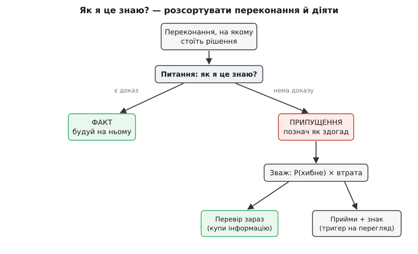

# Припущення проти фактів як дисципліна

<preknowlist>
- [Імовірність](book:math/probability-basics) — ймовірність як міра непевності (число від 0 до 1) і очікуване значення (ймовірність × наслідок); цим ми зважуватимемо, чи варта перевірка припущення своєї ціни.
</preknowlist>

Весь цей модуль ми ухвалювали рішення, не знаючи всього. Розрізняли зворотні двері й незворотні, купували інформацію замість здогадів, важили вартість зволікання проти вартості помилки, вели ризик-реєстр. Усе це стоїть на одній тихій основі, яку ми досі не називали вголос: **кожне рішення спирається на купу переконань про світ**. Скільки в нас буде користувачів. Наскільки швидка база. Чи стабільний чужий API. Що встигне вивчити команда. Частину цих переконань ми перевірили. Більшість — угадали.

Небезпека не в тому, що ми вгадуємо. Вгадувати доводиться: знати все наперед не можна, а рухатися треба. Небезпека в тому, що ми **забуваємо, де знання, а де здогад**. Непозначений здогад — це міна: ти будуєш на ньому поверх, і коли він зривається, валиться все, що згори.

Найдорожчий приклад цього коштував NASA цілого міжпланетного апарата. 23 вересня 1999 року Mars Climate Orbiter вийшов на орбіту Марса — і зник. Причина виявилася не в коді як такому: програма компанії Lockheed Martin віддавала імпульс двигунів у фунт-силах на секунду, а навігація Лабораторії реактивного руху (JPL) читала ці числа як ньютон-секунди — а це в 4.45 раза більше. Обидві команди мовчки припускали, що інша рахує в тих самих одиницях. Ніхто не записав це припущення **як припущення, яке треба звірити**. Апарат зайшов надто низько й згорів. Здогад, який усі вважали фактом, зірвався на швидкості міжпланетної траєкторії.

## Одне питання, що ділить світ навпіл

Візьми будь-яке твердження, на якому тримається твоє рішення, і постав до нього одне питання: **як я це знаю?**

Якщо чесна відповідь — «я виміряв», «це в контракті», «я прогнав код і побачив», — це **факт** (лат. *factum* — зроблене, що сталося): у тебе на руках доказ. Якщо чесна відповідь — «усі так кажуть», «це ж очевидно», «та мабуть», — це **припущення** (лат. *assumptio* — узяте на себе): ти дієш на віру, бо доказу немає, а вирішувати треба зараз.

Уся дисципліна починається з того, щоб ставити це питання чесно й не плутати дві відповіді. Плутати легко, бо припущення любить маскуватися під факт. Твердження «наша база тягне десять тисяч запитів на секунду» звучить однаково впевнено і коли ти вчора зняв це під навантаженням, і коли ти прочитав це в чужому блозі три роки тому. Слова ті самі — доказова вага різна.

> 🔧 **Навіщо це.** Факт теж псується. Замір, знятий торік на старому залізі, сьогодні — вже припущення, бо світ під ним змінився. Тому в дисципліні факт — це не «щось правдиве взагалі», а **доказ, який ти реально тримаєш у руках і який ще чинний**. Усе інше, хай яким очевидним воно здається, — припущення, з яким треба щось робити.

Головне тут — не сором. **Припущення не гріх; гріх — видавати його за факт.** Проєкт без припущень неможливий: ти ніколи не матимеш повних даних до того, як почнеш. Дисципліна не в тому, щоб їх позбутися, а в тому, щоб тримати їх на видноті й керувати ними. Це три звички поспіль.

## Позначити, зважити, діяти

**Позначити.** Невидимим припущенням неможливо керувати — його немає для команди, доки хтось не спіткнеться. Тож перше — зробити несучі переконання видимими: біля кожного важливого твердження в рішенні поставити мітку, факт це чи припущення. «Несуче» — ключове слово. Не кожен здогад вартий церемонії; варті ті, що **тримають рішення**: якщо таке припущення хибне, рішення падає. Цей точний термін — *load-bearing assumption*, несуча передумова — прийшов із методу, який у 1980-х розробили в корпорації RAND Джеймс Дьюар і Морлі Левін саме для того, щоб великі плани не завалювалися від забутих здогадів. Про це коріння — [коротка історія дисципліни](root:progarch/assumptions-vs-facts/hist-assumption-discipline.md): як явна робота з припущеннями виросла в RAND, у розвідці й у світі стартапів.

**Зважити.** Позначених припущень зазвичай десятки, а руки й час одні. Отже, їх треба впорядкувати за небезпекою — тим самим множенням, що ми вже вживали в [ризик-реєстрі](book:programming/risk-register): **ймовірність, що припущення хибне, помножена на втрату, якщо воно хибне**. Це число — очікувана втрата — ставить страшні на слух, але майже певні здогади нижче за нудні, але хиткі.

**Діяти.** Для найнебезпечніших припущень є рівно два ходи. Перший — **перевірити зараз**: це те саме [купування інформації](book:programming/deciding-under-uncertainty), що ми проходили, спрямоване на конкретне переконання (замір, спайк, навантажний тест, дзвінок вендору). Другий — **прийняти й поставити знак**: погодитися жити з припущенням, але наперед домовитися про поріг, за яким воно вважається зламаним. Що з двох обрати — підказує арифметика.


*Одне питання ділить переконання на факт і припущення; припущення далі зважують і скеровують в один із двох ходів.*

## Скільки коштує не перевірити

Перевіряти все — задорого; не перевіряти нічого — сліпо. Межу дає той самий рахунок, що й [вартість помилки проти вартості зволікання](root:progarch/cost-of-delay): **перевірка варта зусиль, поки її ціна менша за втрату, яку вона відвертає.**

**Припущення: коробковий модуль замка тримає свій хмарний API щонайменше два роки** (ми ж вирішили купити цей модуль, а не писати свій).

```
P(хибне)              = 0.30          # вендор молодий, API вже мінявся двічі за рік
Втрата, якщо хибне    = 120 люд-днів  # вирвати інтеграцію, переписати, відкликати прошивку з поля
Очікувана втрата      = 0.30 × 120 = 36 люд-днів
Ціна перевірки        = 3 люд-дні     # SLA в контракті + історія депрекейшенів + спайк запасного адаптера
36 ≫ 3  →  перевіряти зараз, до коміту
```

Число, що вирішує, — **очікувана втрата**, а не гучність страху. Той самий рахунок відсортує назад: якщо перевірка коштувала б 40 людино-днів проти очікуваної втрати 36, дешевше прийняти припущення й поставити знак, ніж платити за певність більше, ніж вона того варта. А ще перевірка не тільки збиває ймовірність помилки — вона часто **міняє саме рішення**: дізнавшись, що вендор ховає в контракті право закрити API за 90 днів, ти можеш і зовсім передумати його купувати.

> 🔧 **Навіщо це.** Наскільки жорстко треба перевіряти — залежить від того, [зворотні двері чи незворотні](book:programming/reversible-irreversible-decisions). За зворотним рішенням можна дешево припуститися й виправитися, тож частину припущень там сміливо приймають на віру. Перед незворотним — вибором формату даних, публічним контрактом, залізом у полі — несучі припущення відкуповують перевіркою **до** коміту, бо після нього ціна помилки стає майже нескінченною.

Глибший бік цієї арифметики — скільки насправді коштує саме знання і чому перевіряти варто **найінформативніше** припущення першим — розбирає [цінність інформації](book:math/value-of-information), апарат, що стоїть за нашим порогом «перевіряй, поки ціна менша за очікувану втрату».

## Журнал припущень — близнюк ризик-реєстру

Три звички просяться в артефакт, і ти вже ведеш його брата. **Ризик-реєстр** питає «що може піти не так?». **Журнал припущень** — «що ми вважаємо істинним без доказу?». Форма та сама: рядок на переконання, тими самими стовпцями.

| Припущення | Тип | P(хибне) | Втрата | Як перевірити | Стан |
|---|---|---|---|---|---|
| Модуль замка тримає API ≥ 2 роки | несуче | 0.30 | 120 лд | SLA + спайк запасного адаптера | перевіряємо |
| Брокер тягне 50 тис. пристроїв на один вузол | несуче | 0.40 | 60 лд | навантажний тест до відмови | відкрите |
| У домі стабільний Wi-Fi без довгих обривів | побутове | 0.50 | 8 лд | телеметрія з поля | прийнято + знак |
| Користувач відчиняє застосунком раз на день | продуктове | 0.30 | 15 лд | аналітика бети | прийнято + знак |

Журнал **живий**, і це головне. Коли припущення підтверджується — воно стає фактом, і рядок закривається. Коли **падає** — ти не тихо латаєш наслідок; ти **перевідкриваєш рішення**, яке на ньому стояло, бо підпора з-під нього щойно зникла. А для тих припущень, що ти свідомо прийняв без перевірки, живе **сигнальний знак** (термін тих-таки RAND — *signpost*): наперед домовлений поріг, за яким припущення вважається зламаним. «Якщо місячних активних більше за п'ятдесят тисяч — перевідкрити вибір брокера.» Знак спрацював — рішення повертається на стіл, поки воно ще дешеве, а не тоді, коли брокер уже задихнувся в проді.

Живе це не десь збоку, а **поруч із рішенням**, яке припущення тримає. Далі в курсі ми заведемо для рішень [журнал архітектурних рішень (ADR)](book:programming/architecture-decision-records) — і кожен запис у ньому нестиме свій короткий список несучих припущень, під якими те рішення чинне. Змінилося припущення — видно, який запис перечитати.

## Чи це взагалі припущення

Перш ніж вносити щось у журнал, є одна перевірка на самому вході: **назви спостереження, яке довело б це хибним**. «Брокер тримає п'ятдесят тисяч пристроїв» — назвати легко: навантажний тест до відмови або підтвердить, або спростує. «Архітектура в нас чиста» — не назвеш нічого; жоден вимір її не спростує, бо це думка, а не твердження про світ. Критерій той самий, що Карл Поппер дав для наукових тверджень: перевірне лише те, що в принципі можна **спростувати**. Не можеш уявити доказ проти — тоді перед тобою не гіпотеза, а цінність або гасло; не став на ньому рішення так, ніби це знання.

Порядок перевірки диктує та сама пара — **вплив і впевненість**. Найдорожче лишити неперевіреним те, що коштує дорого, якщо хибне, і в чому ти найменш упевнений. Ерік Рис у «Lean Startup», спираючись на роботу Стіва Бланка, назвав такі переконання *leap-of-faith* — «стрибок віри»: те, на чому тримається все й що найризикованіше лишати на здогад; звідси практика перевіряти найризикованіше припущення **першим**, ще до того, як щось збудовано. Розклади припущення по цих двох осях — і що робити з кожним, стає видно з одного погляду.


*Дві осі — впевненість і вплив — сортують припущення на чотири різні дії; дорого-й-непевне йде на перевірку першим.*

## Дисципліна в коді

Розсортувати переконання й вирішити, що перевіряти, можна прямо в типах. Факт несе доказ; припущення несе числа, з яких рахується очікувана втрата, — і функція повертає, чи варто платити за перевірку тепер.

:::tabs
```ts
type Belief =
  | { kind: "fact"; claim: string; evidence: string }
  | { kind: "assumption"; claim: string;
      pWrong: number; lossIfWrong: number; costToCheck: number };

function shouldValidateNow(b: Belief): boolean {
  if (b.kind === "fact") return false;         // доказ уже на руках — перевіряти нічого
  const expectedLoss = b.pWrong * b.lossIfWrong;
  return b.costToCheck < expectedLoss;         // купуй інформацію, поки вона дешевша за втрату
}

const lockApi: Belief = {
  kind: "assumption", claim: "модуль замка тримає API ≥ 2 роки",
  pWrong: 0.3, lossIfWrong: 120, costToCheck: 3,
};
shouldValidateNow(lockApi); // true → перевірити до коміту
```
```py
from dataclasses import dataclass

@dataclass
class Fact:
    claim: str
    evidence: str          # доказ уже на руках

@dataclass
class Assumption:
    claim: str
    p_wrong: float         # 0..1
    loss_if_wrong: float   # людино-дні
    cost_to_check: float

def should_validate_now(b) -> bool:
    if isinstance(b, Fact):
        return False
    return b.cost_to_check < b.p_wrong * b.loss_if_wrong

lock_api = Assumption("модуль замка тримає API ≥ 2 роки", 0.3, 120, 3)
should_validate_now(lock_api)  # True → перевірити до коміту
```
:::

Тип `Belief` навмисне не дає навіть спитати про `pWrong` у факту — доказ або є, або перед тобою припущення, яке треба зважити. Повний журнал припущень і код, що ранжує їх за очікуваною втратою й підказує, що звірити перед незворотним кроком, зібрано окремою [майстернею з ранжування припущень](root:progarch/assumptions-vs-facts/proj-assumption-register.md).

> 🔧 **Навіщо це.** На реальному проєкті журнал припущень — це те, що перетворює «нас застали зненацька» на «ми знали, що це наш ризик номер два, і мали на нього знак». Коли інтеграцію із замком таки доведеться вирвати, різниця між командою, що записала це припущення й тримала напоготові запасний адаптер, і командою, що вважала API вічним, — це тижні проти кварталів.

## Підсумок

Дисципліна припущень — це буденне обличчя рішень під невизначеністю. Непевність нікуди не дінеться — але кожен здогад, на якому потай усе трималося, з невидимого стає **позначеною підпорою, за якою ти стежиш**. І найважливіше трапляється не тоді, коли припущення справджується, а коли воно **падає**: там, де недисциплінована команда тихо латає наслідок, дисциплінована повертає на стіл саме те рішення, що стояло на зниклій підпорі, — поки повернути ще дешево. Далі ми проженемо через це всю платформу Digital Homes і побачимо, як кілька несучих припущень наперед вирішують, що будувати, а що поки лишити на віру.
