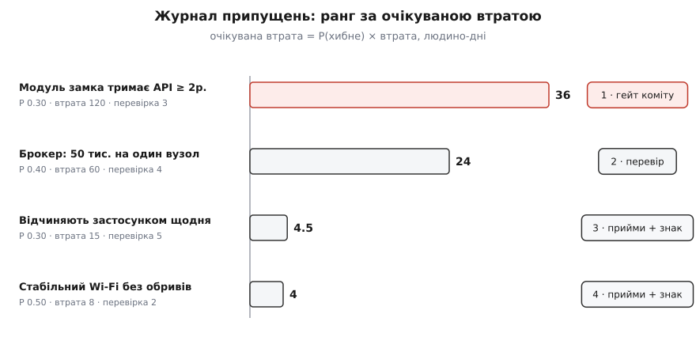

# ⚙️ Майстерня: журнал припущень, що сам каже, з чого почати

Журнал припущень ми вже намалювали — чотири рядки в таблиці, кожен зі своїм `P × втрата`. Таблиця охайна й цілком мертва. Вона нічого не рахує: щоб дізнатися, який рядок найнебезпечніший, ти множиш стовпці в голові й сортуєш очима. Вона нічого не спиняє: коли інженер завтра заллє прошивку в поле, ніщо не перевірить, чи не стоїть те незворотне рішення на неперевіреному здогаді. І вона нічого не забуває стежити: рядок «прийнято + знак» виглядає точнісінько так само і коли за знаком хтось наглядає, і коли всі про нього забули.

Тож зробімо з таблиці програму. Не заради краси коду — заради трьох робіт, яких таблиця не робить: **порахувати й відсортувати** за небезпекою, **спинити незворотний крок**, поки під ним висить незнятий здогад, і **не дати фактам тихо протухнути**. Наскрізний матеріал — та сама платформа Digital Homes: коробковий модуль замка, брокер на десятки тисяч пристроїв, Wi-Fi у домі, звичка відчиняти застосунком. Теорію ми проходили; тут ми її **виконуємо**.

## Задача: перетворити нотатку на вартового

Сформулюймо точно, чого таблиці бракує, бо саме звідси ростуть функції.

Перше — **рахунок і порядок**. Чотири рядки ще можна відсортувати оком. Тридцять — уже ні, а на живому проєкті їх саме стільки. Око до того ж піддається на гучність: страшний на слух здогад лізе вперед нудного, хоч нудний хиткіший. Машині байдуже, як здогад звучить; вона множить `P × втрата` й ставить у чергу за числом.

Друге — **гейт перед незворотним**. Половина сенсу дисципліни в тому, щоб несучі припущення [незворотного кроку](topic:sf-apps/reversible-irreversible-decisions) відкупити перевіркою **до** коміту, а не після. «До коміту» — це не гасло, це умова, яку хтось має **перевірити машинно** в той момент, коли палець уже над кнопкою. Таблиця в вікі того моменту не застане; функція в збірці — застане.

Третє — **живучість**. Журнал корисний, лише поки він не бреше. Прийняте припущення без нагляду за знаком тихо стає прийнятим-і-забутим. Доведений факт з торішнім доказом тихо стає спогадом. Обидва виродження непомітні на око й помітні коду, який уміє спитати про дату й про монітор.

Отже, мета майстерні: журнал, який **сам** каже, що перевіряти першим, **сам** блокує незворотний крок, поки той стоїть на здогаді, і **сам** підіймає тривогу, коли знак без нагляду або факт протух.

## Ідея: рядок — це запис із дев'ятьма полями

Простий тип із теорії — «факт несе доказ, припущення несе три числа» — для журналу замалий. Щоб журнал робив три роботи вище, рядок мусить нести дев'ять полів, і кожне заслуговує своє місце.

**Твердження** (`claim`) — саме переконання, одним реченням. **Тип** (`kind`) — несуче, побутове чи продуктове: несуче тримає рішення, решта лише його забарвлює. Три числа арифметики: **`p_wrong`** — наскільки віримо, що хибне (0..1), **`loss`** — скільки коштує помилка, **`cost_to_check`** — скільки коштує перевірка. Далі йдуть чотири поля, яких у простому типі не було, і саме вони перетворюють нотатку на вартового:

- **Спосіб** (`method`) — *чим саме* перевіряємо. Без нього «перевірити» — гасло; з ним — SLA в контракті, навантажний тест до відмови, дзвінок вендору. Спосіб — це те, що хтось піде й зробить.
- **Знак** (`signpost`) — наперед домовлений поріг, за яким приймуте припущення вважаємо зламаним. Живе на рядках, які ми свідомо **не** перевіряємо, а приймаємо під нагляд.
- **Стан** (`state`) — де рядок у житті: `open` (не чіпали), `checking` (перевірка в роботі), `accepted` (прийнято під знак), `fact` (доведено, доказ на руках), `broken` (знак спрацював, здогад упав). Стан — це те, що робить журнал живим.
- **Рішення** (`decision`) — на яке рішення спирається здогад. Поле показує на [запис у журналі архітектурних рішень](topic:sf-apps/architecture-decision-records): упаде припущення — видно, який запис перевідкрити.

І один прапорець — **`irreversible`**: чи веде те рішення до незворотного кроку. Саме він живить гейт.

:::tabs
```py
# assumptions.py — журнал припущень, що рахує й спиняє
from __future__ import annotations
from dataclasses import dataclass
from enum import Enum
import yaml                                   # pip install pyyaml


class State(str, Enum):
    OPEN     = "open"        # ще не чіпали
    CHECKING = "checking"    # перевірка в роботі
    ACCEPTED = "accepted"    # свідомо прийняли під знак
    FACT     = "fact"        # доведено — доказ на руках
    BROKEN   = "broken"      # знак спрацював, припущення впало


LIVE = {State.OPEN, State.CHECKING, State.ACCEPTED}   # ще важать на рішення


@dataclass
class Assumption:
    id: str
    claim: str
    kind: str                # несуче | побутове | продуктове
    p_wrong: float           # 0..1
    loss: float              # людино-дні, якщо хибне
    cost_to_check: float     # людино-дні на перевірку
    method: str              # ЧИМ перевіряємо (не «перевірити», а як саме)
    signpost: str            # поріг, за яким припущення вважаємо зламаним
    state: State
    decision: str            # яке рішення (ADR) на ньому стоїть
    irreversible: bool       # чи веде те рішення до незворотного кроку

    def expected_loss(self) -> float:
        return self.p_wrong * self.loss if self.state in LIVE else 0.0

    def worth_checking(self) -> bool:
        # перевіряти має сенс, лише поки не прийняли й не довели
        if self.state not in (State.OPEN, State.CHECKING):
            return False
        return self.cost_to_check < self.expected_loss()
```
```ts
// assumptions.ts — журнал припущень, що рахує й спиняє
import { readFileSync } from "node:fs";
import { parse } from "yaml";                 // npm i yaml

type State = "open" | "checking" | "accepted" | "fact" | "broken";
const LIVE: State[] = ["open", "checking", "accepted"]; // ще важать на рішення

interface Assumption {
  id: string;
  claim: string;
  kind: "несуче" | "побутове" | "продуктове";
  pWrong: number;          // 0..1
  loss: number;            // людино-дні, якщо хибне
  costToCheck: number;     // людино-дні на перевірку
  method: string;          // ЧИМ перевіряємо, не «перевірити»
  signpost: string;        // поріг, за яким припущення вважаємо зламаним
  state: State;
  decision: string;        // яке рішення (ADR) на ньому стоїть
  irreversible: boolean;   // чи веде те рішення до незворотного кроку
}

const expectedLoss = (a: Assumption): number =>
  LIVE.includes(a.state) ? a.pWrong * a.loss : 0;

const worthChecking = (a: Assumption): boolean =>
  // перевіряти має сенс, лише поки не прийняли й не довели
  (a.state === "open" || a.state === "checking") &&
  a.costToCheck < expectedLoss(a);
```
:::

Зверни увагу на `expected_loss`: у станах `fact` і `broken` вона повертає нуль. Це не оптимізація, а зміст. Доведене припущення вже не важить на рішення — воно стало фактом. Зламане вже спрацювало — його втрата не «очікувана», а реалізована, і місце їй у розтині після збою, а не в черзі на перевірку. Очікувану втрату несуть лише **живі** рядки, ті, що ще висять над рішенням непевні.

## Журнал як один YAML-файл

Дані живуть окремо від коду — в одному файлі, який людина редагує руками. Формат навмисно нудний: рядок на припущення, поле на стовпець. Файл лягає в репозиторій поруч із записами рішень, ходить через рев'ю тим самим `diff`, і його історія показує, як мінялися наші здогади в часі.

```yaml
# assumptions.yml — несучі здогади під платформою Digital Homes
- id: A-lock-api
  claim: "модуль замка тримає хмарний API ≥ 2 роки"
  kind: несуче
  p_wrong: 0.30
  loss: 120
  cost_to_check: 3
  method: "SLA в контракті + історія депрекейшенів + спайк запасного адаптера"
  signpost: "вендор оголосив зміну API або SLA впав нижче 12 міс"
  state: checking
  decision: ADR-014          # купити готовий модуль, не писати свій драйвер
  irreversible: true         # прошивка вже в полі — вирвати дорого

- id: A-broker-scale
  claim: "брокер тягне 50 тис. пристроїв на один вузол"
  kind: несуче
  p_wrong: 0.40
  loss: 60
  cost_to_check: 4
  method: "навантажний тест до відмови на репліці проду"
  signpost: "активних пристроїв на вузол > 35 тис."
  state: open
  decision: ADR-021          # один брокер-вузол на старті
  irreversible: false        # шардування — зворотний хід

- id: A-wifi
  claim: "у домі стабільний Wi-Fi без довгих обривів"
  kind: побутове
  p_wrong: 0.50
  loss: 8
  cost_to_check: 2
  method: "телеметрія обривів із поля бети"
  signpost: "> 5% домів мають обриви довші за 10 хв/добу"
  state: accepted
  decision: ADR-009
  irreversible: false

- id: A-open-daily
  claim: "користувач відчиняє застосунком дім раз на день"
  kind: продуктове
  p_wrong: 0.30
  loss: 15
  cost_to_check: 5
  method: "аналітика частоти відчинень у беті"
  signpost: "медіана відчинень застосунком < 1 на 3 дні"
  state: accepted
  decision: ADR-017
  irreversible: false
```

## Рахувати й ранжувати

Тепер найлегша й найкорисніша частина: завантажити файл, порахувати очікувану втрату кожного рядка й вишикувати чергу. Завантаження — це заразом і перша застава: **тут ловиться `P` зі стелі, що вилізло за межу [0,1]**, і від'ємна ціна. Здогад, що не проходить цей вхідний контроль, у журнал не потрапляє.

:::tabs
```py
def load(path: str) -> list[Assumption]:
    with open(path, encoding="utf-8") as f:
        raw = yaml.safe_load(f)
    reg = [Assumption(state=State(r.pop("state")), **r) for r in raw]
    for a in reg:
        if not 0.0 <= a.p_wrong <= 1.0:
            raise ValueError(f"{a.id}: P поза [0,1] — {a.p_wrong}")
        if a.loss < 0 or a.cost_to_check < 0:
            raise ValueError(f"{a.id}: відʼємна ціна")
    return reg


def ranked(reg: list[Assumption]) -> list[Assumption]:
    live = [a for a in reg if a.state in LIVE]
    return sorted(live, key=lambda a: a.expected_loss(), reverse=True)


def check_first(reg: list[Assumption]) -> list[Assumption]:
    return [a for a in ranked(reg) if a.worth_checking()]


def report(reg: list[Assumption]) -> None:
    print("що перевіряти першим (спадання очікуваної втрати):")
    for i, a in enumerate(check_first(reg), 1):
        flag = "  ⟵ ГЕЙТ незворотного кроку" if a.irreversible else ""
        print(f"{i:>2}. {a.expected_loss():5.1f}  {a.claim}{flag}")
    watch = [a for a in reg if a.state is State.ACCEPTED]
    if watch:
        print("\nпід сигнальним знаком (стежити, не перевіряти):")
        for a in watch:
            print(f"  • {a.claim} → знак: {a.signpost}")
```
```ts
function load(path: string): Assumption[] {
  const raw = parse(readFileSync(path, "utf8")) as any[];
  return raw.map((r) => {
    const a: Assumption = {
      id: r.id, claim: r.claim, kind: r.kind,
      pWrong: r.p_wrong, loss: r.loss, costToCheck: r.cost_to_check,
      method: r.method, signpost: r.signpost,
      state: r.state, decision: r.decision, irreversible: r.irreversible,
    };
    if (!(a.pWrong >= 0 && a.pWrong <= 1))
      throw new Error(`${a.id}: P поза [0,1] — ${a.pWrong}`);
    if (a.loss < 0 || a.costToCheck < 0)
      throw new Error(`${a.id}: відʼємна ціна`);
    return a;
  });
}

const ranked = (reg: Assumption[]): Assumption[] =>
  reg.filter((a) => LIVE.includes(a.state))
     .sort((x, y) => expectedLoss(y) - expectedLoss(x));

const checkFirst = (reg: Assumption[]): Assumption[] =>
  ranked(reg).filter(worthChecking);

function report(reg: Assumption[]): void {
  console.log("що перевіряти першим (спадання очікуваної втрати):");
  checkFirst(reg).forEach((a, i) => {
    const flag = a.irreversible ? "  ⟵ ГЕЙТ незворотного кроку" : "";
    const n = String(i + 1).padStart(2);
    console.log(`${n}. ${expectedLoss(a).toFixed(1).padStart(5)}  ${a.claim}${flag}`);
  });
  const watch = reg.filter((a) => a.state === "accepted");
  if (watch.length) {
    console.log("\nпід сигнальним знаком (стежити, не перевіряти):");
    for (const a of watch) console.log(`  • ${a.claim} → знак: ${a.signpost}`);
  }
}
```
:::

Проженімо `report` на нашому файлі:

```text
що перевіряти першим (спадання очікуваної втрати):
 1.  36.0  модуль замка тримає хмарний API ≥ 2 роки  ⟵ ГЕЙТ незворотного кроку
 2.  24.0  брокер тягне 50 тис. пристроїв на один вузол

під сигнальним знаком (стежити, не перевіряти):
  • у домі стабільний Wi-Fi без довгих обривів → знак: > 5% домів мають обриви довші за 10 хв/добу
  • користувач відчиняє застосунком дім раз на день → знак: медіана відчинень застосунком < 1 на 3 дні
```

Ось де журнал перестав бути нотаткою. Чотири рядки самі поділилися на дві купки. У черзі на перевірку — тільки два, ті, чия перевірка дешевша за очікувану втрату: замок (36) і брокер (24). Двоє інших туди не потрапили не тому, що безпечні, а тому, що ми вже свідомо їх **прийняли** під знак — для Wi-Fi очікувана втрата 4 при ціні перевірки 2, для звички відчиняти — 4.5 при ціні 5, тобто перевіряти застосунок дорожче, ніж змиритися й наглядати. Вони пішли не в чергу, а під нагляд. Один погляд на вивід — і видно і що робити руками зараз, і за чим лише стежити.


*Той самий журнал, вишикуваний машиною: висота стовпчика — очікувана втрата, права мітка — дія. Перший рядок несе прапорець незворотного кроку.*

> 🔧 **Навіщо це.** Черга за очікуваною втратою — це розклад твого тижня, а не прикраса. Руки одні, здогадів десятки; ти працюєш згори вниз і спиняєшся тієї миті, коли ціна наступної перевірки перевищує втрату, яку вона відвертає. Журнал не радить «перевір усе» — він каже, що перевірити **першим** і де **зупинитися**.

## Прапорець незворотності: гейт перед комітом

Черга каже, з чого почати. Але є момент, коли порада мусить стати **забороною** — момент незворотного кроку. Заллємо прошивку в тисячі замків — і якщо припущення про чужий API виявиться хибним, назад дороги вже майже нема. Саме тут прапорець `irreversible` перетворюється з поля таблиці на брамника.

Гейт простий: серед несучих припущень, що ведуть до незворотного кроку, знайти ті, які ще **варто** зняти перевіркою (живі й дешевші за свою загрозу). Якщо таких немає — брама відчинена. Якщо є хоч одне — крок зупинено, і функція називає, що саме зняти.

:::tabs
```py
def blocks_commit(reg: list[Assumption]) -> list[Assumption]:
    """Несучі припущення незворотного кроку, ще не зняті перевіркою."""
    return [a for a in ranked(reg) if a.irreversible and a.worth_checking()]


def gate(reg: list[Assumption]) -> None:
    blockers = blocks_commit(reg)
    if blockers:
        lines = "\n".join(
            f"  ✗ {a.id}: {a.claim} "
            f"(очік. втрата {a.expected_loss():.0f}, перевірка {a.cost_to_check:.0f})"
            for a in blockers)
        raise SystemExit(
            "НЕЗВОРОТНИЙ КРОК ЗАБЛОКОВАНО — спершу зніми перевіркою:\n" + lines)
    print("гейт відкрито: усі несучі припущення незворотного кроку зняті")


if __name__ == "__main__":
    gate(load("assumptions.yml"))     # у CI перед заливкою прошивки в поле
```
```ts
const blocksCommit = (reg: Assumption[]): Assumption[] =>
  ranked(reg).filter((a) => a.irreversible && worthChecking(a));

function gate(reg: Assumption[]): void {
  const blockers = blocksCommit(reg);
  if (blockers.length) {
    const lines = blockers.map((a) =>
      `  ✗ ${a.id}: ${a.claim} ` +
      `(очік. втрата ${expectedLoss(a).toFixed(0)}, перевірка ${a.costToCheck})`
    ).join("\n");
    console.error("НЕЗВОРОТНИЙ КРОК ЗАБЛОКОВАНО — спершу зніми перевіркою:\n" + lines);
    process.exit(1);
  }
  console.log("гейт відкрито: усі несучі припущення незворотного кроку зняті");
}

// у CI перед заливкою прошивки в поле:
gate(load("assumptions.yml"));
```
:::

Поставлений у збірку перед заливкою прошивки, гейт червоніє:

```text
НЕЗВОРОТНИЙ КРОК ЗАБЛОКОВАНО — спершу зніми перевіркою:
  ✗ A-lock-api: модуль замка тримає хмарний API ≥ 2 роки (очік. втрата 36, перевірка 3)
```

Це та сама різниця, що між червоним асертом і думкою: коміт зупинила не чиясь обережність, а рядок у файлі. Щоб брама відчинилася, треба піти й зробити те, що записано в `method`, — вичитати SLA, підняти спайк запасного адаптера — і чесно перевести рядок у новий стан. Довели, що API надійний, — `state: fact`, очікувана втрата падає в нуль, `worth_checking` гасне, гейт відчиняється. Дізналися, що вендор ховає право закрити API за 90 днів, — `state: broken`, і перевідкривається `ADR-014`: можливо, замок ми взагалі не купуємо. В обох випадках незворотний крок відбувається **свідомо**, а не наосліп.

Брокер до гейта не потрапив, хоч і стоїть у черзі другим: його `irreversible` — `false`, бо перейти на кластер із одного вузла — зворотний хід, який можна зробити й потім. Прапорець відділяє «перевір колись» від «перевір, бо після цього вороття нема». Перше — питання порядку; друге — питання, чи взагалі можна натискати кнопку.

## Складність і пастки

Інструмент вийшов гострий, і саме тому ним легко порізатися. Три пастки нижче важать не менше за самі функції; кожну варто закрити ще одним вартовим. Показую вартових на Python — у TypeScript вони тієї самої форми, і транслітерувати їх було б лише шумом.

**Перша: `P` зі стелі.** Уся черга тримається на числі `p_wrong`, а його майже завжди беруть з голови. Небезпека не в тому, що `P` неточне — воно й не може бути точним, — а в тому, що **хибна точність** цього числа маскується під об'єктивність рангу. Черга виглядає як факт, а насправді успадковує всю хисткість здогаду про `P`. Захист не в тому, щоб вгадати `P` точніше, а в тому, щоб знати, **де ранг крихкий**: якщо два сусіди в черзі стоять надто близько за очікуваною втратою, дрібна похибка в `P` легко їх перекидає, і сперечатися про їхній порядок — марно.

```python
def fragile_pairs(reg, ratio=1.3):
    """Сусіди в черзі, чиї очікувані втрати надто близькі:
    тут похибка в P зі стелі легко перекидає порядок."""
    q = check_first(reg)
    out = []
    for hi, lo in zip(q, q[1:]):
        if lo.expected_loss() and hi.expected_loss() / lo.expected_loss() < ratio:
            out.append((hi.id, lo.id))
    return out
```

Для Digital Homes черга — 36 проти 24, відношення 1.5: замок стоїть попереду брокера з добрим запасом, і навіть груба похибка в обох `P` цього порядку не зламає. `fragile_pairs` повертає порожньо — верхівці черги можна довіряти. Але якби втрата брокера була не 60, а 90 (очікувана 36, ніздря в ніздрю із замком), вартовий підняв би цю пару як «монету підкинь»: там порядок диктує не небезпека, а випадковий вибір `P`, і замість сперечатися, який із двох перший, дешевше **обидва** й перевірити.

**Друга: забуті знаки.** «Прийнято + знак» — найпідступніший стан, бо він виглядає як завершена робота, а насправді лише почата. Поставити знак і нікуди його не підключити — те саме, що не поставити зовсім. Журнал **не монітор**: рядок `signpost` — це проза, доки за ним не стоїть жива метрика з власником, який зобов'язаний діяти, коли вона перетне поріг. Без цього «прийнято + знак» тихо вироджується в «прийнято + забуто».

```python
# знак живий, лише коли за ним стежить справжній монітор із власником
WIRED = {
    "A-wifi": "grafana: wifi_drop_ratio > 0.05  (власник: платформа)",
    # A-open-daily — знака ще нікуди не підключено!
}

def unwatched(reg):
    """Прийняті припущення, чий знак ніде не наглядається."""
    return [a.id for a in reg
            if a.state is State.ACCEPTED and a.id not in WIRED]
```

`unwatched` повертає `["A-open-daily"]`: звичку відчиняти ми прийняли, знак записали — а нікуди його не завели. Саме так гине найдорожчий знак в історії. У Mars Climate Orbiter поріг **спрацював** — усю весну й літо 1999-го навігаційні розв'язки вперто виходили ближчими до Марса, ніж належало, і щонайменше двоє навігаторів це бачили. Тривогу відмахнули — зокрема тому, що занепокоєння не оформили належним бланком (усталено за звітом комісії). Знак лежав просто в даних; бракувало не сигналу, а **підключеного** до нього процесу, який змусив би діяти. `unwatched` — це якраз перевірка, що такий процес існує.

**Третя: припущення-міфи, що застигли фактами.** Найтихіша й найнебезпечніша. Рядок зі станом `fact` більше не важить на очікувану втрату — і правильно, доки доказ на руках і чинний. Але доказ псується. Замір пропускної здатності, знятий торік на старому залізі, сьогодні вже не факт, а спогад про факт — світ під ним змінився, а рядок і далі мовчки виведений з-під нагляду. Так здогад, колись чесно доведений, вертається в розряд припущень — а журнал про це не знає, бо ніхто не спитав про дату.

```python
from datetime import date

FACT_TTL_DAYS = 180        # доказ піврічної давнини — вже не факт, а спогад

def expire_stale_facts(reg, today=None):
    """Факт зі старим доказом вертається в припущення — його переперевірять."""
    today = today or date.today()
    for a in reg:
        stale = a.state is State.FACT and (today - a.checked_on).days > FACT_TTL_DAYS
        if stale:
            a.state = State.OPEN            # доказ протух → знову здогад у черзі
            a.claim += "  [факт протух — переперевір]"
    return reg
```

Вартовий вимагає одного нового поля — `checked_on`, дати, коли доказ востаннє тримали в руках, — і повертає протухлий факт назад у чергу, де його знову зважать і, якщо треба, переперевірять. Півроку — цифра з голови; підбирають її під те, як швидко міняється саме твій світ (чужий API старіє за місяці, фізичний закон — ніколи). Головне не число, а сама згода, що **факт — це не «правда назавжди», а доказ із терміном придатності**. Журнал, який цього не знає, з часом наповнюється впевненими рядками, під якими вже нема нічого, — і це найгірший різновид журналу, бо він заспокоює.

Зведімо. Живий журнал припущень — це не документ, а машина з трьох рухів: вона **ранжує** здогади за очікуваною втратою й каже, з чого почати; вона **спиняє** незворотний крок, поки під ним висить незнятий несучий здогад; і вона **не дає** ні знакам загубитися, ні фактам протухнути. Три вартові з пасток — не додаток до неї, а її совість: без них ранг бреше хибною точністю, знак тихне, а факт гниє. З ними журнал робить те, заради чого й заведений, — перетворює «нас застали зненацька» на «знак спрацював, і ми були готові».
