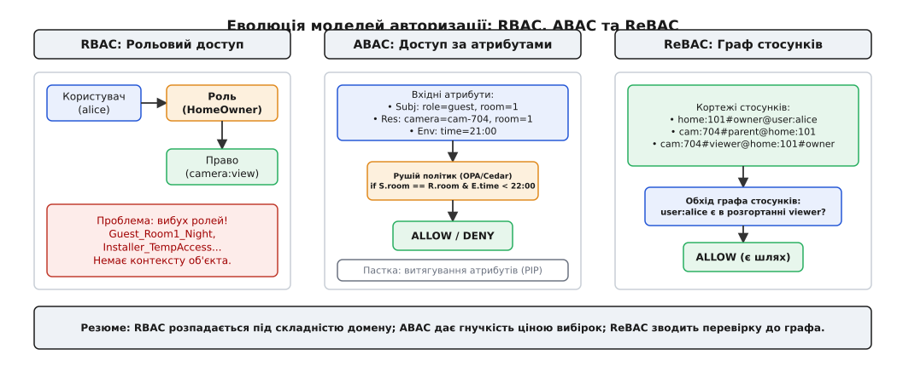
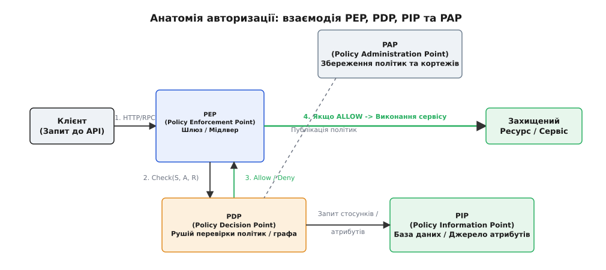
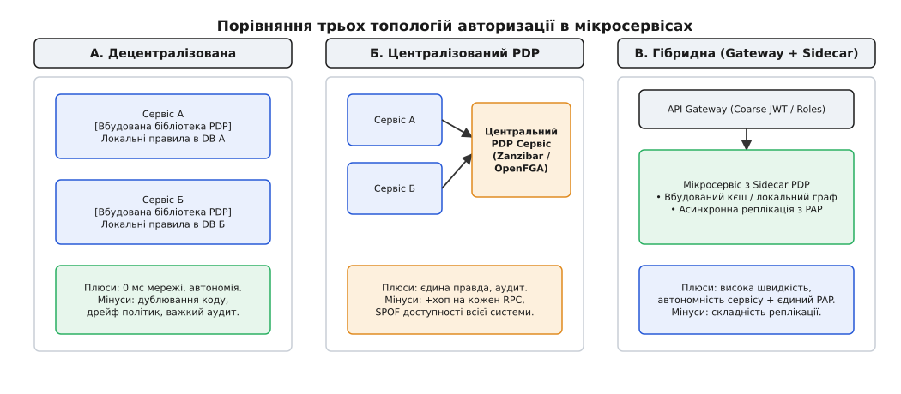

# Авторизація вглиб

<preknowlist>
- [REST і HTTP](root:com-protocol/rest-api) — заголовки, токени та передача контексту між клієнтом і сервером.
- [Автентифікація та токени](root:sf-security/authentication) — «хто ти»: підпис JWT, перевірка ідентичності та передача identity claim крізь шлюз.
- [Зчеплення і зв'язність](root:sf-apps/coupling-cohesion) — як винесення рішень про доступ впливає на залежності між мікросервісами.
- [Найменші привілеї](root:sf-security/least-privilege) — deny-by-default як захисна постава системи.
</preknowlist>

Коли мобільний застосунок надсилає HTTP-запит `POST /devices/cam-704/stream`, підписаний криптографічним JWT-токеном, служба автентифікації легко підтверджує ідентичність: «запит надійшов від користувача `user:alice` з ідентифікатором сесії `sess-981`». Підпис перевірено, токен дійсний, ідентичність встановлена. Але в цю мить система зупиняється перед значно складнішим питанням: а чи має право Аліса дивитися відеопотік саме з камери `cam-704` у будинку `home-101` о одинадцятій годині вечора? Якщо ця камера належить її чоловіку, який дав їй повний доступ, відповідь «так». Якщо це камера в орендованій гостьовій кімнаті, де термін оренди закінчився годину тому, відповідь «ні».

Автентифікація відповідає на статичне питання «хто ти», спираючись лише на математику криптографічних підписів. Вона однакова для всіх сервісів і не змінюється від змісту діла. **Авторизація відповідає на динамічне питання «що тобі можна робити з цим конкретним ресурсом у цьому конкретному контексті».** Вона потребує знання доменної моделі, прав власності, часових обмежень, геозон та вкладених стосунків між сутностями. І якщо автентифікація в мікросервісах розв'язується прозоро на API Gateway, то авторизація стає однією з найважчих архітектурних задач розподілених систем, де найменша помилка в дизайні перетворюється на масовий витік даних або катастрофічне падіння продуктивності.

> 🔧 **Навіщо це.** Забути спроєктувати авторизацію як окрему підсистему означає розсипати перевірки прав у вигляді виразів `if (user.role == 'admin')` по всьому бізнес-коду десятків мікросервісів. Це гарантовано веде до вразливостей класу BOLA (Broken Object Level Authorization — злам контролю доступу на рівні об'єктів, №1 у списку OWASP API Security Top 10), коли користувач міняє ID у URL і дістає чужий пристрій, бо сервіс перевірив лише факт входу, але не право на конкретний об'єкт.

---

## Еволюція моделей доступу: від ролей до атрибутів і графів

Зі зростанням складності програмних продуктів змінювалися й моделі, якими інженери описували допуск користувачів до ресурсів. Кожна наступна модель народжувалася як відповідь на фундаментальну пастку попередньої.


*Еволюція моделей авторизації: RBAC зв'язує суб'єкта з дією через статичні ролі, але ламається від вибуху ролей; ABAC обчислює правила над атрибутами, але впирається у вибірку даних; ReBAC зводить перевірку до обходу графа стосунків.*

### 1. Рольовий доступ (RBAC — Role-Based Access Control)

Найдавніший і найпростіший підхід підключає користувача до прав через проміжну абстракцію — **роль**. Користувач `U` має набір ролей `R`, а кожна роль містить набір дозволених дій `P` над категоріями ресурсів.

```
user:alice ──> Role: HomeOwner ──> Permission: camera:view
```

У монолітному застосунку з трьома категоріями людей — `Admin`, `Operator`, `Customer` — RBAC працює бездоганно. Таблиця ролей проста, SQL-запит для перевірки зводиться до `JOIN user_roles`, а логіка зрозуміла будь-якому розробнику.

Проблема RBAC починається тоді, коли домен вимагає контексту конкретного об'єкта. У системі розумного дому Аліса є власником `home-101`, але лише гостем у `home-202`. Якщо створити роль `HomeOwner`, вона дасть Алісі права на *усі* будинки системи. Щоб вирішити це в межах RBAC, розробники починають плодити динамічні ролі: `HomeOwner_101`, `Guest_Room1_NightOnly`, `Installer_Temp`. 

Цей феномен зветься **вибухом ролей (Role Explosion)**. Кількість ролей у системі перевищує кількість користувачів, база даних заповнюється тисячами одноразових записів, а адміністрування прав перетворюється на хаос. RBAC неспроможний виразити правило «користувач бачить лише *свої* камери», бо роль у RBAC є глобальним ярликом, позбавленим зв'язку з конкретним екземпляром ресурсу.

### 2. Доступ за атрибутами (ABAC — Attribute-Based Access Control)

На зміну ролям прийшов ABAC. Замість зіставлення статичних таблиць ABAC розглядає авторизацію як обчислення логічної функції над набором атрибутів чотирьох категорій:

1. **Суб'єкт (Subject)**: атрибути того, хто запитує (`user.id`, `user.role`, `user.clearance`).
2. **Ресурс (Resource)**: атрибути об'єкта (`camera.id`, `camera.room_id`, `camera.is_private`).
3. **Дія (Action)**: тип операції (`read`, `write`, `delete`, `stream`).
4. **Оточення (Environment)**: обставини виклику (`env.current_time`, `env.client_ip`, `env.device_status`).

Правило описується декларативною политикою:

```
ALLOW action == "stream:read" IF
  Subject.role == "guest" AND
  Resource.room_id == Subject.assigned_room AND
  Environment.current_time >= Subject.visit_start AND
  Environment.current_time <= Subject.visit_end
```

ABAC повністю розв'язує проблему вибуху ролей. Один рядок політики покриває мільйони гостей і тисячі будинків, враховуючи час, IP-адресу, статус підписки чи геозону.

Але у розподілених архітектурах ABAC впирається у **пастку витягування атрибутів (PIP Latency Trap)**. Щоб обчислити вирази `Resource.room_id == Subject.assigned_room`, рушій політик мусить десь взяти ці атрибути. Якщо клієнт запитує список із 50 камер на головному екрані, для кожної з 50 камер рушій мусить зробити запит до бази даних пристроїв, бази даних бронювань та бази даних користувачів. Перевірка одного запиту перетворюється на сотні мережевих викликів, і затримка API зростає з 5 мілісекунд до кількох секунд.

### 3. Доступ на основі стосунків (ReBAC — Relationship-Based Access Control)

Модель ReBAC, популяризована інженерами Google у підсистемі Zanzibar, вирішує пастку атрибутів шляхом зміни самого формату збереження фактів доступу. 

Замість того щоб описувати складні обчислювальні скрипти над довільними атрибутами, ReBAC представляє усю систему як **направлений граф стосунків**. Усі факти доступу зберігаються у формі атомних кортежів:

```
<об'єкт>#<стосунок>@<суб'єкт_або_множина>
```

Розгляньмо це на прикладі розумного дому:

1. `home:101#owner@user:alice` — Аліса є власником будинку 101.
2. `camera:704#parent@home:101` — Камера 704 належить будинку 101.
3. `camera:704#viewer@home:101#owner` — Будь-хто, хто є власником будинку 101, має право переглядати камеру 704.

Коли приходить запит «чи може `user:alice` переглядати `camera:704`», ReBAC-рушій не обчислює вирази й не запитує зовнішні сервіси. Він виконує **обхід графа (Graph Reachability)**: піднімається від `camera:704#viewer` до `home:101#owner` і знаходить там `user:alice`. 

Перевірка доступу стає високоефективною пошуковою операцією в індексованому графі стосунків. Детальний шлях створення цієї системи розкрито в [історії Google Zanzibar](root:progarch/authz-in-depth/hist-zanzibar.md).

---

## Анатомія авторизаційної інфраструктури: PEP, PDP, PIP, PAP

Щоб вибудувати авторизацію в мікросервісній системі, необхідно чітко розділити відповідальності між її компонентами. Міжнародний стандарт XACML/NIST розбиває підсистему контролю доступу на чотири фундаментальні концептуальні блоки.


*Анатомія авторизаційної інфраструктури: PEP перехоплює запит і зупиняє виконання; PDP обчислює рішення; PIP постачає атрибути або кортежі графа; PAP зберігає та версіонує політики.*

### 1. Точка виконання політик (PEP — Policy Enforcement Point)

PEP — це перехоплювач (middleware, API Gateway або сервісний шлюз), який стоїть безпосередньо на шляху виконання мережевого запиту. PEP **не ухвалює рішень** самостійно і не знає правил доступу. Його єдина задача — зупинити запит, сформувати контекст `Check(subject, action, resource)`, відправити його до PDP, і в разі відповіді `DENY` перервати виклик, повернувши клієнту HTTP `403 Forbidden`.

### 2. Точка ухвалення рішень (PDP — Policy Decision Point)

PDP — це «мозок» системи авторизації. Це ізольований рушій (наприклад, OPA, OpenFGA або вбудований модуль), який приймає від PEP запит на перевірку, зіставляє його з наявними політиками чи графом стосунків і повертає чистий булевий результат: `ALLOW` або `DENY`. PDP позбавлений побічних ефектів бізнес-логіки.

### 3. Точка інформації про політики (PIP — Policy Information Point)

PIP — це джерело даних, до якого звертається PDP, якщо для ухвалення рішення бракує атрибутів або зв'язків. PIP може бути сховищем кортежів Zanzibar, реплікою бази даних або кешем Redis.

### 4. Точка адміністрування політик (PAP — Policy Administration Point)

PAP — це панель управління та інструментарій версіонування (Control Plane), через який розробники публікують нові релізи політик (Policy-as-Code у Git) або бізнес-події додають нові кортежі стосунків (наприклад, коли користувач ділиться доступом до замка через мобільний застосунок).

---

## Розподілені топології в мікросервісах: де ухвалити рішення

Коли в системі з'являється кілька десятків мікросервісів, виникає головне архітектурне питання: **де саме мають розміщуватися PEP та PDP?** Існує три базові топології, кожна з яких має свою ціну за затримку, доступність та складність.


*Три топології розподіленої авторизації: А — децентралізована локальна перевірка у кожному сервісі; Б — централізований PDP-сервіс; В — гібридний підхід із грубою перевіркою на шлюзі та тонким локальним sidecar.*

### Топологія А: Децентралізована (Локальний PDP у кожному сервісі)

У цій схемі кожен мікросервіс містить вбудовану авторизаційну бібліотеку і самостійно виконує перевірку доступу, звертаючись до власної бази даних.

- **Як працює**: Сервіс камер сам дістає з локальної БД запис про те, чи є Аліса власниці камери, і робить `if (cam.owner_id == user.id)`.
- **Переваги**: Нульова мережева затримка (немає хопа до зовнішнього PDP), абсолютна автономність сервісу (якщо центральні системи впали, сервіс продовжує працювати).
- **Недоліки**: 
  - **Дрейф політик (Policy Drift)**: Логіка авторизації розмазана по кодових базах різних команд.
  - **Неможливість аудиту**: Відповісти на питання регулятора «до яких саме ресурсів має доступ користувач X у всій платформі» стає неможливо без сканування бази даних кожного сервісу.

### Топологія Б: Централізований PDP-сервіс (Кластер Zanzibar / OpenFGA)

Усі перевірки доступу виносяться в окремий високонавантажений кластер авторизації. Мікросервіси звертаються до нього через gRPC-протокол `Check(subject, relation, object)`.

- **Як працює**: Сервіс пристроїв отримує запит, зупиняється на PEP і робить gRPC-виклик до центрального OpenFGA/SpiceDB.
- **Переваги**: Єдине джерело правди для всієї компанії, централізований аудит доступів з коробки, політики тестуються і деплояться окремо від бізнес-сервісів.
- **Недоліки**:
  - **Додатковий мережевий хоп (+2..10 мс)** на кожнісінький внутрішній виклик між сервісами.
  - **Єдина точка відмови (SPOF)**: Якщо центральний кластер PDP падає або тупить під навантаженням, зупиняється працездатність геть усіх мікросервісів компанії.

### Топологія В: Гібридний підхід (Coarse Check на Шлюзі + Fine-grained Local Sidecar)

Найбільш зріле виробниче рішення розбиває авторизацію на два рівні гранульованості:

1. **Груба авторизація (Coarse-grained)** виконується на **API Gateway**. Шлюз перевіряє JWT-тороп, маски OAuth scopes (`devices:write`) та грубі ролі. Якщо користувач не має права взагалі працювати з доменом пристроїв, запит відсікається ще на вході.
2. **Тонка авторизація (Fine-grained)** виконується всередині мікросервісу через **локальний Sidecar PDP**. Sidecar тримає в пам'яті гарячий кеш реляційного графа або локальну репліку кортежів, які асинхронно транслюються з центрального PAP через шину подій (NATS/Kafka).

```
Запит  ──>  [ API Gateway ]  ──(груба перевірка scope)──>  [ Microservice ]
                                                                 │
                                                    (локальний gRPC / 0.5 мс)
                                                                 ▼
                                                        [ Local PDP Sidecar ]
                                                                 │
                                                       (асинхронна реплікація)
                                                                 ▼
                                                        [ Central PAP Store ]
```

Гібридна топологія дає найкраще з двох світів: швидкість локальної перевірки (під 0.5 мс) та автономність від збоїв мережі, зберігаючи при цьому централізоване управління політиками у Git.

> 🔧 **Навіщо це.** Гібридний підхід рятує систему під час мережевих розривів. Якщо центральний сервіс авторизації стає недоступним, мікросервіси продовжують ухвалювати рішення на основі локально закешованого графа. Системи розумного дому можуть відкривати замки мешканцям навіть тоді, коли зв'язок з хмарою повністю втрачено.

---

## Захист від вразливостей BOLA та тестування політик у CI/CD

Проєктуючи розподілену авторизацію, архітектор має вирішити ще дві критичні проблеми реального продакшну: захист від атак розмежовування об'єктів та автоматичну перевірку безпеки при деплої.

### Захист від BOLA / IDOR на рівні архітектури

Вразливість BOLA виникає тоді, коли сервіс перевіряє права на рівні API-рута (`GET /api/v1/cameras`), але не робить точкової перевірки `Check(user, view, camera_id)` для конкретного ID у шляху запиту. Зловмисник бере свій токен, міняє ID камери на сусідній і дістає чужий відеопотік.

Щоб зробити BOLA архітектурно неможливою, PEP-мідлвер автоматично витягує ідентифікатор ресурсу з REST/gRPC шляху (`/devices/{id}`) та автоматично генерує точковий запит до PDP. Бізнес-код усередині хендлера взагалі не викликається, якщо PEP не отримав `ALLOW` для цього конкретного об'єкта.

### Політики як код та фітнес-функції авторизації

Оскільки політики в OPA (Rego) чи OpenFGA (DSL) винесені з коду застосунку, їх можна й необхідно тестувати в автоматизованому CI/CD конвеєрі так само, як звичайний юніт-код.

Перед кожним релізом CI запускає сюїту юніт-тестів політик:

```rego
# Приклад тесту Rego для OPA
test_guest_cannot_view_camera_at_night {
    not allow with input as {
        "user": {"role": "guest"},
        "action": "view",
        "camera": {"id": "cam-704"},
        "env": {"time_hour": 23}
    }
}
```

Це перетворює авторизацію на **архітектурну фітнес-функцію**: жодна зміна правил не проходить у прод без проходження автоматизованих безпекових тестів.

---

## Консистентність, Zookies та запобігання витокам у кеші

У будь-якій розподіленій системі з кешуванням прав виникає **проблема нової людини (New-Enemy Problem)**. Розгляньмо приклад:

1. Аліса звільняє інсталятора Боба та вилучає його з групи доступу до замка будинку `home-101` о 12:00:00.
2. Сервіс авторизації записує видалення кортежу в базу даних.
3. О 12:00:01 Боб надсилає запит на відчинення замка. Сервіс замків звертається до локального кешу Sidecar PDP, який ще не встиг отримати інвалідацію й зберігає застаріле рішення `ALLOW`.
4. Боб відчиняє замок після того, як його позбавили прав.

Це найнебезпечніший клас вразливостей авторизації. Для його усунення Zanzibar ввів поняття **Zookies (Consistency Tokens)**. Zookie — це непрозорий токен консистентності (або мітка часу TrueTime), який віддається клієнту при будь-якій зміні прав. Коли клієнт робить наступний запит, він передає Zookie у заголовку. PDP зобов'язаний оцінювати граф на знімку даних, **не старішому ніж мітка часу у Zookie**.

Якщо локальний кеш Sidecar застарів, він бачить, що версія в Zookie свіжіша за його локальну репліку, і робить точковий синхронний запит до основного сховища, запобігаючи несанкціонованому доступу.

---

## Порівняльна матриця та інструментарій

Обираючи конкретну технологію авторизації для архітектури системи, інженер має зіставити вимоги доменної моделі з характеристиками наявних відкритих та хмарних рушіїв.

Детальний аналіз готових open-source систем, від OPA до OpenFGA та SpiceDB, наведено у вставці з [порівнянні систем авторизації](root:progarch/authz-in-depth/comp-authz-systems.md). Практичну реалізацію реляційного рушія з обходом графа показано у [реалізації ReBAC-рушія](root:progarch/authz-in-depth/proj-authz-engine.md).

| Характеристика | RBAC (Ролі) | ABAC (OPA / Cedar) | ReBAC (Zanzibar / OpenFGA) |
| :--- | :--- | :--- | :--- |
| **Основа прийняття рішення** | Статична роль користувача | Динамічні вирази над атрибутами | Граф стосунків між сутностями |
| **Складність вибірки списків** | Легка (`WHERE role = 'admin'`) | Надзвичайно важка (Пастка PIP) | Легка (`Expand/ListObjects` у графі) |
| **Спільне володіння / вкладеність**| Не підтримується (вибух ролей)| Потребує складного предзавантаження | Нативна підтримка через рекурсію |
| **Витрати на мережеву затримку** | < 0.1 мс (локальна DB) | 1–5 мс (залежить від PIP) | 1–3 мс (індексований граф) |
| **Версіонування та аудит** | Важке (зміни в DB) | Ідеальне (Policy-as-Code у Git) | Ідеальне (Центральний журнал кортежів) |

---

## Архітектурний висновок: Практичний вибір для Digital Homes

Для платформи Digital Homes, яка керує сотнями тисяч пристроїв, камер та замків, єдиної правильної моделі «на всі випадки життя» не існує. Зріла архітектура будується як шарова оборонна система з чітким розділенням обов'язків:

1. **API Gateway (Грубий бар'єр)**: Вхідний шлюз перевіряє підпис JWT, перевіряє статус бана акаунта та збіг OAuth scopes. Це відсікає неавтентифікований та завідомо невалідний трафік без торкання внутрішніх сервісів.
2. **ReBAC-сервіс для доменних об'єктів**: Стосунки між будинками, кімнатами, замками, камерами та мешканцями описуються у вигляді ReBAC-кортежів (`camera:704#parent@home:101`). Це гарантує, що передача прав на дім миттєво й безпечно відкриває або закриває доступ до всіх внутрішніх пристроїв без зміни коду.
3. **ABAC-політики для контексту оточення**: Тимчасові обмеження (доступ інсталятора з 09:00 до 18:00, одноразові коди для кур'єрів) накладаються поверх ReBAC-графа через легкі атрибутивні перевірки на межі конкретного сервісу.

Такий трьохрівневий підхід гарантує, що система залишається швидкою на гарячих шляхах, стійкою до мережевих збоїв та абсолютно захищеною від несанкціонованого проникнення.
