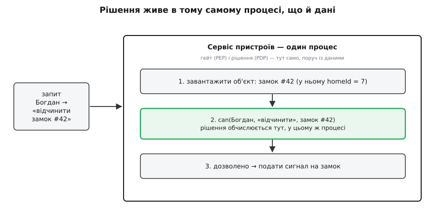
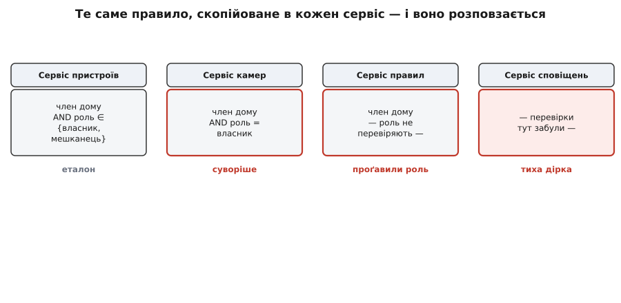
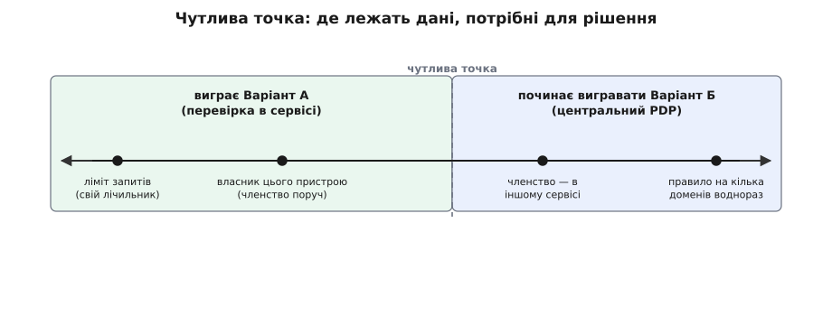

# Варіант А: кожен сервіс авторизує сам

<preknowlist>
- [Моделі авторизації](topic:sf-security/authorization-models) — як записати правило «кому що можна»: ролями (RBAC), атрибутами (ABAC), зв'язками (ReBAC). Цей крок вирішує не *як* записати правило, а *де* його виконувати.
- [Горизонтальна ескалація (IDOR)](root:progarch/idor-horizontal-escalation) — та сама роль, але чужий об'єкт: користувач підставляє чужий ідентифікатор і дотягується до чужого. Саме цю дірку найприродніше закриває перевірка поруч із даними.
</preknowlist>

Ми вже вміємо записати правило доступу — [моделлю ролей, атрибутів чи зв'язків](topic:sf-security/authorization-models) — і навіть [тримати його як код](topic:sf-security/policy-as-code), а не як розсипані по обробниках `if`-и. Лишилося питання, від якого досі відверталися: **де** це правило виконується, коли запит іде крізь систему з кількох сервісів?

DH уже не скрипт під столом. Богдан тисне «відчинити» у застосунку — команда летить у хмару, проходить шлюз, автентифікацію (ми знаємо, що це справді Богдан) і дістається сервісу пристроїв, який і керує замками. І десь на цьому шляху хтось мусить дати відповідь на просте на вигляд питання: **чи можна Богданові відчинити саме цей замок?** Питання не «як записати правило» — правило ми вже маємо. Питання — **де його обчислити**.

Це [класична розвилка курсу](root:progarch/variant-block-anatomy): чесних відповідей тут дві, а третьою буде їхній гібрид. Тут ми боронимо першу — найстаршу, найпростішу, вшиту в кожен веб-фреймворк — і боронимо в найсильнішій формі, щоб згодом важити її чесно, а не бити опудало. Варіант А каже коротко: **хай кожен сервіс вирішує сам, у себе, поруч із даними, які він захищає**.

## Рішення там само, де дані

Будь-яка перевірка доступу — це насправді дві різні речі. Одна **ухвалює** вердикт («Богданові — можна»), інша його **застосовує** (відчиняє замок або відмовляє). У безпеці їх давно розрізняють поіменно: точка, де рішення ухвалюють (англ. *Policy Decision Point*, PDP — «точка рішення»), і точка, де його застосовують (*Policy Enforcement Point*, PEP — «точка застосування»). Розділили їх не для краси: колись ці дві ролі опинялися в різних місцях — окремий сервер вирішував, а застосунок лише слухався вердикту.

Варіант А зводить їх назад в одне: **точка рішення живе в тому самому процесі, що й точка застосування**. Вердикт обчислюється прямо там, де сервіс і так тримає об'єкт у руках — звичайним викликом функції, без жодного стрибка кудись назовні.

:::tabs
```ts
// Сервіс пристроїв: обробник команди «відчинити замок»
async function unlockDoor(req: Request, res: Response) {
  const user = req.user;                            // хто прийшов (уже автентифікований)
  const door = await devices.load(req.params.id);  // об'єкт У РУКАХ: у ньому homeId

  if (!authz.can(user, "unlock", door)) {          // рішення — тут, у процесі
    return res.status(403).json({ error: "forbidden" });
  }
  await door.unlock();
  res.json({ ok: true });
}
```
```py
# Сервіс пристроїв: обробник команди «відчинити замок»
def unlock_door(request, door_id):
    user = request.user                        # хто прийшов (уже автентифікований)
    door = devices.load(door_id)               # об'єкт У РУКАХ: у ньому home_id

    if not authz.can(user, "unlock", door):    # рішення — тут, у процесі
        return Response(status=403)
    door.unlock()
    return Response({"ok": True})
```
:::

Придивись, коли саме кличуть `can(...)`: **після** того, як об'єкт уже завантажено. Тож у перевірки на руках і Богдан, і сам замок #42 з його `homeId`. Вона питає не абстрактне «Богдан — мешканець?», а конкретне «Богдан — мешканець дому, якому належить **цей** замок?». Ця дрібниця — «об'єкт уже тут» — і є весь секрет Варіанта А.


*Точка рішення (PDP) і точка застосування (PEP) — в одному процесі, поруч із об'єктом. Рішення — це виклик функції, а не запит до сусідньої машини.*

## Головний виграш: усе для рішення — під рукою

Чому за цю модель тримаються? Три речі сходяться в тому «поруч».

**Об'єкт у руках — і [IDOR](root:progarch/idor-horizontal-escalation) нікуди сховатися.** Горизонтальна ескалація — це коли роль правильна, а об'єкт чужий: мешканець одного дому підставляє ідентифікатор замка іншого. Щоб її спинити, треба зіставити **запитаний об'єкт** із тим, хто просить. У сервісі об'єкт уже завантажено — перевірка стає одним рядком і природно виходить об'єктною. Центральна ж перевірка, яка бачить лише «Богдан, роль=мешканець, дія=unlock, id=42», не знає, **чий** це замок 42, — доти, доки їй окремо не привезуть дані про власність. Сервіс цю власність уже має; йому нема чого возити.

**Жодного мережевого стрибка на рішення.** Вердикт — виклик функції, а не запит до іншої коробки. Це не лише швидше; це ще й [знімає цілий клас відмов](topic:sf-distributed/distributed-fallacies). Якби «сервіс авторизації» був віддалений, кожен запит залежав би ще й від того, чи той сервіс живий і досяжний, — нова точка, що може відвалитися, нова черга, новий таймаут. У процесі рішення падає лише разом із самим сервісом, а це вже та відмова, яку ти й так обробляєш.

**Найдешевше на старті.** Це дефолт кожного фреймворка: тобі не треба нічого піднімати збоку — перевірка стоїть там, де вже стоїть код. Першу робочу версію віддаєш швидше за всіх.

> 🔧 **Навіщо це.** Найгостріша діра авторизації на практиці — не «слабке правило», а **забута об'єктна перевірка**: код спитав «ти взагалі мешканець?» і не спитав «мешканець **цього** дому?». Варіант А тримає перевірку там, де об'єкт уже в руках, — і зіставити «чий це замок» стає найлегшим, а не найважчим кроком. Ти платиш дублюванням правила (про це нижче), щоб купити найдешевшу у світі об'єктну перевірку. Для багатьох систем це вигідний обмін — надто на старті, коли сервіс один.

## Хто возить це в проді

Не музейний експонат — це те, як авторизує майже весь веб. Rails зі своїми Pundit і CanCanCan, Django та DRF із класами-дозволами, Spring Security з `@PreAuthorize` просто над методом — усі вони ставлять перевірку в процес застосунку, поруч із хендлером. Мільярди запитів на день проходять саме так.

Ба більше: навіть «дорослі» рушії політик уміють жити в процесі. Open Policy Agent (OPA) можна підключити не тільки окремим сервером через мережу, а й **бібліотекою** просто в код — тоді оцінка політики стає локальним викликом без жодного стрибка. А SDK Cedar від AWS (відкритий 2023-го, з бібліотеками для Rust, Java, Python, JS і Go) прямо задуманий, щоб рушій рішень **жив усередині** застосунку. Тобто навіть коли політику виносять у спеціальний рушій, його часто **повертають назад у процес** — бо co-location дешевша й швидша. [Історію того, як «точку рішення» спершу відділили й назвали окремо, а потім знову вшили в сервіс](root:progarch/authz-inservice-variant/hist-authz-decision-point.md), варто знати окремо: вона показує, що Варіант А — не наївність новачка, а свідомий кінець маятника.

## Чим платиш

Тепер — найважливіший рядок будь-якого варіанта. І вся ціна Варіанта А росте з одного кореня: **правило живе всередині сервісу, тож копіюється стільки разів, скільки сервісів його потребують.**

**Дублювання й дрейф.** Правило «член дому + відповідна роль → можна» доводиться вписати і в сервіс пристроїв, і в сервіс камер, і в сервіс правил, і в сервіс сповіщень. Це N копій одного правила. А копії розповзаються: одна стає суворішою, друга губить перевірку ролі, третьої взагалі забули додати. Захотів змінити правило — скажімо, «гостям можна відчиняти з 8:00 до 22:00» — і мусиш знайти **кожну** копію, у кожному репозиторії, і зробити їх однаковими до літери. Ніщо, крім твоєї уважності, не гарантує, що вони збіглися.


*Одне правило, скопійоване в кожен сервіс, з часом розповзається. Змінив — лови всі копії; проґавив одну — і в ній тиха діра, якої не видно, поки її не знайде зловмисник.*

**Немає єдиного погляду.** На питання «хто має доступ до камер спальні?» немає **одного** місця, де відповісти. Щоб дізнатися, треба читати N кодових баз. А така відповідь потрібна регулярно — на рев'ю безпеки, на аудит, на запит про приватність («хто взагалі може бачити ці дані?»). Коли правило розмазане по сервісах, кожна така відповідь стає розкопками, а не запитом.

**Податок поліглота.** Якщо сервіси різними мовами — Python тут, Go там, TypeScript на краю — правило існує в трьох мовах одночасно. Тримати їх однаковими **за поведінкою** доводиться руками: жоден компілятор не звірить, що python-версія й go-версія вирішують ідентично.

**Тихі діри.** Додав новий маршрут, забув перевірку — і це невидимо, поки хтось не скористається. Немає центрального гейта, який гарантує, що **всі** шляхи прикриті; кожен новий обробник — це новий шанс проґавити. Дисципліну «відмовляй за замовчуванням» тут доводиться тримати самотужки, бо ніщо її не примушує. Найчастіше це шлях назад до [IDOR](root:progarch/idor-horizontal-escalation): не забув перевірку зовсім — забув саме **об'єктну** її частину на одному свіжому маршруті.

**Дані для рішення можуть жити не тут.** Найтонша ціна. Перевірці потрібні атрибути, щоб вирішити. «Богдан — член дому 7?» — а членство може жити не в сервісі пристроїв, а в окремому сервісі домогосподарств. Тоді «внутрішня» перевірка мусить **сходити по ці дані** назовні — і ти повертаєш собі і мережевий стрибок, і застарілість даних, тобто рівно те, чого Варіант А мав уникнути. Ось чому він чистий саме тоді, коли дані для рішення **лежать у самому сервісі**.

## Де виграє, а де стіна

Зведімо в одне чесне речення. Варіант А **сяє**, коли сервісів небагато, стек одномовний, дані для рішення локальні, бюджет затримки тісний, а проєкт молодий. Він **упирається в стіну**, коли сервіси множаться, флот поліглотний, правила тягнуться через ресурси різних сервісів, або коли аудит і відповідність вимагають **одного** місця, де відповісти «кому що можна».

Чутлива точка — той один факт, що перемикає вибір: **чи лежать дані, потрібні для рішення, у самому сервісі?** Локальні — перевірка в сервісі природна й швидка. Розкидані по сервісах — «внутрішня» перевірка мусить або тримати чужу копію графа зв'язків, або ходити по неї мережею, і тоді центр починає вигравати.


*Переможця немає в порожнечі — є поріг за одним фактом. Ліміт запитів за власним лічильником сидить ліворуч (усе своє), а правило, що спирається на членство з іншого сервісу, зсувається праворуч — туди, де вигідніший центр.*

## Зворотність: чи легко відкотити

Остання лінза. Почати з Варіанта А — рішення **двобічне**, але лише за однієї умови: якщо перевірка стоїть за чистим швом. Пастка — розкидати логіку інлайном:

```ts
// АНТИПАТЕРН: правило вписане прямо в обробник — і так у кожному з тридцяти
async function unlockDoor(req: Request, res: Response) {
  const user = req.user;
  const door = await devices.load(req.params.id);
  if (door.homeId !== user.homeId ||                        // те саме «член дому + роль»
      (user.role !== "owner" && user.role !== "resident"))  // копіями по всіх маршрутах
    return res.status(403).end();
  await door.unlock();
  res.json({ ok: true });
}
```

Розсипав так по тридцятьох обробниках — і зміна моделі авторизації стала однобічними дверима: правило нема де перемкнути, його треба виловлювати по всьому коду. А сховав за одним [швом](root:progarch/seams-and-boundaries) — інтерфейсом `Authorizer` з єдиним `can(user, action, resource)`, крізь який кличуть **усі** обробники, — і весь сервіс має одну точку рішення. Тоді пізніше, коли дублювання почне пекти, ту одну реалізацію можна **замінити** викликом до центрального рушія, не чіпаючи жодного хендлера. Шов перетворює незворотне рішення на зворотне — тому Варіант А варто будувати за швом із першого дня, [зібравши перевірку DH так, щоб чужий замок не відчинявся](root:progarch/authz-inservice-variant/proj-dh-inservice-authz.md), навіть якщо згодом переростеш у центр.

І саме туди цілить наступний крок: [Варіант Б виносить рішення в один центр](root:progarch/authz-central-variant) — платить стрибком і залежністю, зате прибирає дублювання й дає той єдиний погляд, якого тут бракує. Що з них під які драйвери — зважить [підсумковий вибір](root:progarch/authz-choice), прогнавши обидва крізь [спільні сценарії якості](topic:sf-apps/attribute-scenarios); а тоді DH складе їх у гібрид і проведе один живий запит [крізь усю дорогу авторизації](root:progarch/dh-auth-path).
