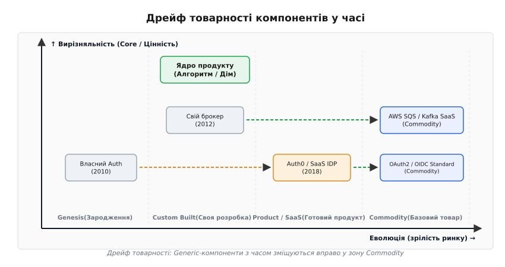
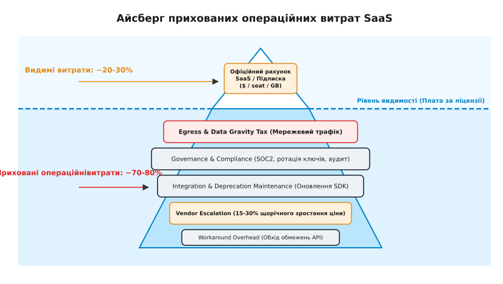
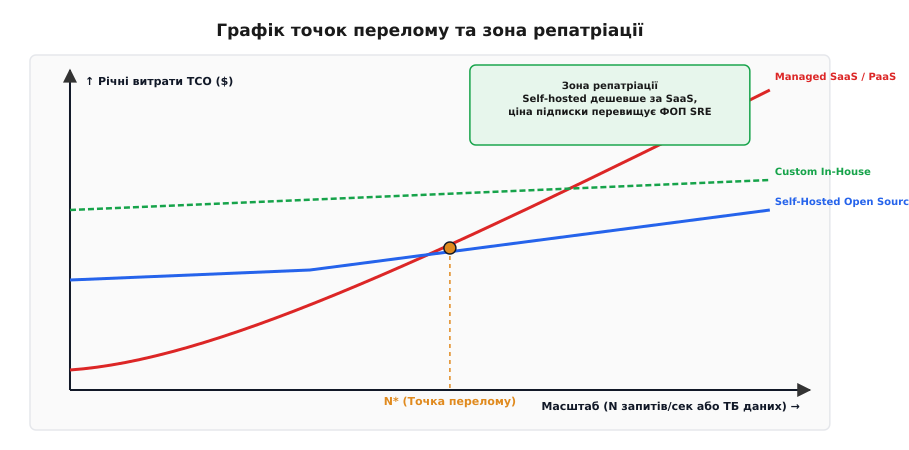
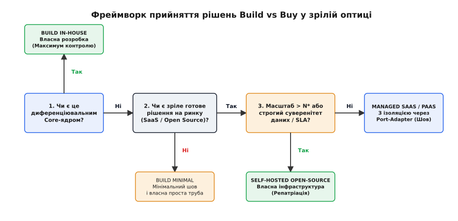

# Build vs buy у зрілій оптиці

<preknowlist>
- [Build vs buy](book:programming/architecture-discipline/build-vs-buy) — первинна двовимірна модель «ядро проти контексту» та аналіз беззбитковості.
- [Прив'язка і вартість виходу](book:programming/architecture-discipline/lock-in-exit-cost) — оцінка lock-in як усвідомленого кредиту й витрат на вихід.
- [Стратегічні піддомени](book:programming/software-design/subdomains-strategic) — класифікація піддоменів на Core, Supporting та Generic.
</preknowlist>

На третій рік експлуатації продакшн-системи початкові розрахунки вибору між власною розробкою й купівлею (англ. *Build vs Buy*) систематично розпадаються. На старті проєкту сервіс автентифікації виглядав як легке рішення «взяти готовий SaaS за $200 на місяць», а брокер повідомлень — як «розгорнути відкритий Kafka-кластер за два дні». Проте після досягнення 100 000 активних користувачів рахунок від SaaS-вендора стрибає до $35 000 щомісяця через перехід на корпоративний тариф з вимогами SAML/SSO, а відкритий Kafka-кластер поглинає 40% робочого часу двох senior-інженерів, які замість розвитку продукту гасять пожежі з ребалансуванням дисків та оновленням ZooKeeper.

Цей перелом називається етапом зрілої експлуатації (англ. *Day-2 operations*). Наінтуїтивні серветкові розрахунки ранньої стадії враховували лише первинні витрати на розробку або базову підписку, але повністю ігнорували приховану інфляцію вендорів, операційний тягар утримання заліза, витрати на мережевий трафік (англ. *egress cost*) та ерозію фокусу інженерної команди. Зріла оптика вимагає від архітектора переходу від статичного вибору «зробити чи купити» до динамічної моделі оцінки наскрізної вартості володіння (англ. *Total Cost of Ownership*, TCO), врахування еволюційного дрейфу технологій та готовності до керованої репатріації (англ. *cloud repatriation*).

---

## Дрейф товарності та еволюція Core vs Non-Core

Класична диференціація предметної області ділить усю систему на унікальне ядро (англ. *core subdomain*) — те, за що клієнти платять саме вам, та контекст або загальні піддомени (англ. *generic subdomains*) — необхідні, але не вирізняльні компоненти. Проста модель каже: «ядро будуй самотужки, а контекст купуй на ринку». У зрілій оптиці ця формула ускладнюється явищем **дрейфу товарності** (англ. *commodity drift*): статус технології не є статичним і зміщується з часом убік масового стандартизованого товару (англ. *commodity*).

Те, що десять років тому становило унікальне диференціювальне ядро й вимагало власної розробки — наприклад, розподілений рушій повнотекстового пошуку, система автентифікації за токенами чи складний черговик повідомлень — сьогодні стало базовим коммодіті. Спроба будувати власне коммодіті сьогодні означає витрачати інженерні сили на повторення чужого пройденого шляху.



*Компоненти системи з часом еволюціонують зліва направо: від унікальної внутрішньої розробки (Genesis/Custom) до загальнодоступного стандартного товару (Commodity). Спроба тримати generic-компоненти у зоні власної розробки створює невиправдане операційне навантаження.*

На мапі еволюції технологій розрізняють чотири стадії:
1. **Зародження (Genesis):** перші експериментальні ідеї та лабораторії;
2. **Власна розробка (Custom Built):** унікальні системи, які кожна компанія пише під себе за відсутності аналогів;
3. **Готовий продукт / SaaS (Product/SaaS):** поява комерційних вендорів та підписок на ринку;
4. **Базовий товар (Commodity/Utility):** повна стандартизація (наприклад, електрика, протокол HTTP або стандарти OAuth2/OIDC).

Межа між стадіями є рухомою. Коли технологія досягає рівня Commodity, ринок пропонує її у вигляді прозорого стандарту чи відкритого коду. Проте комерційні хмарні провайдери продають не сам код (який є безкоштовним), а **операційне обслуговування** цього коду (англ. *Managed Control Plane*).

Найпоширенішою помилкою зрілих організацій є **податок на кастомізацію** (англ. *customization tax*). Він виникає тоді, коли компанія купує готовий Generic-продукт (SaaS або відкриту систему), але намагається переписати 30% його внутрішньої логіки під свої «унікальні» бюрократичні звички. У результаті виникає найгірший з обох світів: організація сплачує повну ліцензійну вартість купленого рішення, але втрачає можливість оновлювати його без поломки власних хаків.

Існує також **імпліцитний кастомізаційний податок** (англ. *implicit customization tax*): використання інструменту не за призначенням. Прикладом є спроба використати реляційну базу даних як чергу повідомлень із частим оновленням прапорців, що призводить до блокування сторінок та деградації продуктивності, або використання Redis як єдиної персистентної бази даних. Інженерний ресурс витрачається на боротьбу з інструментом замість розвитку продукту.

Детальний перебіг того, як індустрія пройшла шлях від мейнфреймів 1970-х років та кастомізаційного пекла ERP 1990-х до сучасної репатріації, розкрито в [історії еволюції Build vs Buy](root:progarch/cost-and-lock-in/build-vs-buy-mature/hist-build-vs-buy-lineage.md).

> 🔧 **Навіщо це.** Якщо ви купуєте готове рішення (SaaS чи відкритий пакет), змінюйте власні внутрішні процеси під стандартну логіку продукту. Спроба глибоко кастомізувати купленого вендора — це найдорожчий спосіб отримати нестабільну систему, яку неможливо оновлювати.

---

## Айсберг прихованих операційних витрат SaaS

Рекламна пропозиція SaaS-сервісів спирається на ілюзію «нульових операційних витрат»: ви купуєте підписку й не опікуєтеся серверами, базами даних та чергуваннями вночі. Проте при масштабуванні системи виринає прихований айсберг операційного навантаження, де плата за ліцензію становить лише 20–30% від підсумкових витрат.



*Офіційний рахунок за підписку SaaS — це лише видима верхівка. Під водою ховаються витрати на мережевий трафік між хмарами, інфляція вендора, governance-аудит та інженерний час на підтримку інтеграцій.*

Підводна частина айсберга складається з п'яти прихованих статей витрат:

1. **Податок на мережевий трафік та гравітацію даних (Egress & Data Gravity Tax):**
   Коли ваша основна система розгорнута в AWS, а аналітична база або сервіс логування розташовані у сторонньому SaaS, кожен гігабайт переданих даних оподатковується платою за вихідний трафік (англ. *egress fee*). Наприклад, сервіс із навантаженням у 2 ТБ логів на день відправляє трафік у зовнішній SaaS. За тарифу AWS Egress $0.09/GB лише мережева передача коштує $180 на день ($5,400 на місяць) — додатково до рахунку самого SaaS.
2. **Витрати на управління та відповідність (Governance & Compliance Tax):**
   Підключення кожного нового SaaS-вендора вимагає регулярних аудитів безпеки (SOC 2, ISO 27001, GDPR), юридичного аналізу договорів, ротації API-ключів, управління доступами звільнених співробітників та налаштування шифрування. Якщо SaaS отримує персональні дані користувачів, юридична відповідальність за можливий витік на боці вендора залишається на вас.
3. **Супровід інтеграцій та виведення API з експлуатації (Integration & Deprecation Maintenance):**
   Зовнішні SaaS-вендори регулярно оновлюють свої API та виводять старі версії з експлуатації (англ. *API deprecation*). Ваша інженерна команда змушена регулярно відлікати сили від продукту на оновлення SDK, переписання адаптерів та тестування сумісності.
4. **Ескалація цін вендора (Vendor Price Escalation):**
   Опинившись у ситуації жорсткого замикання (англ. *vendor lock-in*), компанія стає заручником монопольного ціноутворення. Вендори використовують комерційну стратегію «Land and Expand»: заходять задешево на старті, чекають замикання системи, а потім піднімають ціни на 15–30% щорічно або переводять необхідні функції у дорожчі Enterprise-тарифи.
5. **Накладні витрати на обхід обмежень (Workaround Overhead):**
   Жоден SaaS не відповідає вимогам продукту на 100%. Інженери витрачають сотні годин на створення «костилів» довкола жорстких лімітів чужого API (наприклад, обмеження на розмір пакета, частоту запитів чи затримку Webhook-сповіщень).

---

## Розбір чотирьох інфраструктурних стейків із даними експлуатації

Щоб побачити, як зріла оптика змінює рішення у реальних системах, розглянемо чотири базові інфраструктурні підсистеми на етапі Day-2 експлуатації.

### 1. Автентифікація та ідентичність (Auth / IDP)

На старті SaaS-автентифікація (Auth0, Okta, Clerk) здається ідеальним вибором: за тиждень інтегруються OAuth2, соцмережі, двофакторний вхід (MFA) та захист від добору паролів. Стартовий рахунок становить $100–300 на місяць.

Проте при появі B2B-клієнтів виникає вимога корпоративного входу (SAML/SSO, Active Directory/LDAP, SCIM-синхронізація). SaaS-вендори категорично виключають SAML з базових тарифів і вимагають переходу на **Enterprise Plan**, де вартість обчислюється не за активних користувачів, а за загальний контракт компанії ($30,000–60,000 на рік). 

Крім того, виникає архітектурний ризик зовнішньої відмови (англ. *third-party outage*). Якщо у Auth0 стається глобальний збій OAuth2 Discovery Endpoint, ваші користувачі не можуть увійти в систему, навіть якщо ваша власній інфраструктура працює ідеально. Без розривного адаптера на межі системи цей збій перетворюється на каскадну аварію для всього продукту.

На цьому етапі розгортання власного Self-Hosted рішення (наприклад, Keycloak або Ory Hydra) у власному Kubernetes-кластері окупається за 3–6 місяців. Ви отримуєте повний контроль над даними користувачів (які не залишають контур VPC), підтримку будь-яких протоколів і нульову плату за кількість активних акаунтів.

### 2. Брокер повідомлень і черги (Message Queue / Broker)

Керований брокер (AWS SQS, Confluent Cloud, AWS MSK) знімає головний біль розгортання кластера, налаштування реплікації та оперативного відновлення дисків.

На масштабі у 50 000 повідомлень на секунду починає працювати математика трафіку. Managed Kafka у хмарі стягує плату за: (а) години роботи брокерських вузлів; (б) обсяг збережених даних; (в) Cross-AZ трафік реплікації між зонами доступності. Перехід на Self-Hosted Kafka або Redpanda на орендованому «голому залізі» (англ. *bare-metal*) або EC2-екземплярах із NVMe-дисками знижує витрати у 4–8 разів, оскільки ви сплачуєте лише фіксовану ціну обчислювачів.

Проте Self-Hosted брокер вимагає SRE-експертизи: налаштування retention-політик очищення дисків, моніторингу деградації OS page cache та ліквідації штормів ребалансування (англ. *consumer group rebalance storms*).

### 3. Реляційна та документна база даних (Database)

Managed Aurora або Cloud SQL є золотої серединою для більшості систем: вони забезпечують автоматичний failover, автомасштабування диска, регулярні знімки (snapshots) та відновлення на будь-який момент часу (PITR).

Вихід із Managed DB на власний Self-Hosted Postgres виправданий лише у двох крайових випадках:
- **Гігантський обсяг та IOPS:** коли ціна за операції вводу-виводу (IOPS) у хмарі стає астрономічною, а системі потрібні специфічні налаштування ядра Linux (`sysctl`), HugePages, tune PgBouncer та прямий доступ до NVMe-масивів;
- **Суворе законодавство про суверенітет даних (GDPR, HIPAA):** коли дані не мають права оброблятися у спільних хмарних середовищах сторонніх операторів.

Приклад з практики: процедура PostgreSQL autovacuum на таблиці розміром 500 ГБ під активним OLTP-навантаженням викликає сплески затримки I/O. Managed Aurora вирішує це за допомогою власної розподіленої логової архітектури сховища, що виправдовує додаткові $5,000 на місяць для команд, які не мають штатного DBA.

### 4. Телеметрія та спостережність (Observability / Logs / Traces)

SaaS-системы спостережливості (Datadog, Honeycomb) пропонують найкращий на ринку UX, але є найнебезпечнішими з точки зору нелінійного зростання витрат.

Коли при аварії у продакшні система починає генерувати у 50 разів більше логів та трасувань, SaaS-вендор виставляє рахунок за кожен гігабайт прийнятого інжесту (англ. *ingest fee*). Помилка в одному мікросервісі може призвести до рахунку у $30 000 за вихідні. Зрілі системи будують гібридну модель: відправляють базові метрики у SaaS, а важкий потік логів та трасувань фільтрують за допомогою OpenTelemetry Collector і зберігають у власному відносно дешевому сховищі (Loki / Tempo поверх S3-сумісного об'єктного сховища).

Систематичний порівняльний аналіз трьох класів виконання для кожного з чотирьох стейків зібрано у [порівняльному розборі класів інфраструктури](root:progarch/cost-and-lock-in/build-vs-buy-mature/comp-managed-vs-self-hosted.md).

---

## Точка перелому й маятник репатріації

Зрілий архітектор знає: вибір між Build та Buy — це не одноразова дія, а динамічний маятник. На старті проєкту (зона низького масштабу) оптимальним є максимум SaaS та PaaS. Але при зростанні навантаження система неминуче наближається до **точки перелому** (англ. *crossover point* $N^*$).



*Точка перелому N* показує момент, де стрімке зростання витрат на SaaS/PaaS перевищує високі фіксовані витрати на утримання власної Self-Hosted інфраструктури та SRE-команди. Праворуч від N* лежить зона репатріації.*

Точка перелому $N^*$ визначається математичною рівновагою:

```
Рахунок SaaS(N*) = Фіксовані витрати на залізо + Зарплатний фонд SRE (FTE) + Витрати на вихід
```

Коли річна плата вендору за SaaS починає дорівнювати зарплатному фонду повноцінної інфраструктурної команди з 3–5 SRE-інженерів (плюс амортизація заліза), орендувати сервіс далі стає економічно шкідливим. З цього моменту починається **репатріація** — кероване перенесення підсистеми з SaaS на власний Self-Hosted Open Source стек.

Яскраві приклади репатріації у промисловості:
- **Dropbox (2016–2018):** міграція з AWS S3 на власноруч збудоване об'єктне сховище Magic Pocket (понад 1 ЕБ даних), що заощадило $75 млн за 2 роки;
- **37signals / Basecamp (2022–2023):** повний вихід із хмари AWS на орендовані bare-metal сервери, що знизило річні витрати з $3.2 млн до $800 000 при збереженні тієї самої команди.

Покрокова стратегія безперебійної репатріації (zero-downtime repatriation) включає:
1. **Паралельне розгортання (Shadow Deployment):** підняття Self-Hosted кластера поруч із функціонуючим SaaS;
2. **Дзеркалювання трафіку (Traffic Mirroring):** дублювання викликів чи подій у новий кластер без впливу на користувачів;
3. **Звірка стану (Reconciliation):** перевірка цілісності даних між SaaS та Self-Hosted сховищем;
4. **Перемикання прапорцем (Canary Cutover):** поступовий перевід 1% → 10% → 100% трафіку через адаптер шва.

> 🔧 **Навіщо це.** Не бійтеся мігрувати на SaaS на старті, щоб виграти швидкість (Time-to-Market). Але з першого дня закладайте в архітектуру порти та адаптери (англ. *exit seams*), щоб при досягненні точки перелому N* ви могли здійснити репатріацію без повного переписування продукту.

---

## Кейс Digital Homes (DH): еволюція рішень у часі

Платформа розумного дому **Digital Homes (DH)** чудово ілюструє, як зріла оптика змінює рішення Build vs Buy на різних стадіях життя продукту.

```
Еволюція інфраструктурного стека Digital Homes:

Компонент           Старт (MVP, 5k домів)        Зрілість (500k домів)
─────────────────────────────────────────────────────────────────────────────
Ядро хаба (FSM)     Build In-House (C++)          Build In-House (C++)
Брокер подій        Managed AWS IoT Hub           Self-Hosted VerneMQ (K8s)
Автентифікація      SaaS Auth0                    Self-Hosted Keycloak
Відеопотік          P2P WebRTC (без хмари)        P2P WebRTC + S3 Event Clips
```

1. **Ядро хаба та FSM логіка (Core Subdomain):**
   Логіка виконання сценаріїв на хабі у випадку обриву інтернету є унікальною перевагою DH. Вона від початку будувалася як **Build In-House** на мові C++ і залишається власною розробкою на всіх масштабах.
2. **Брокер повідомлень пристроїв (Generic -> Repatriation):**
   На старті DH взяла керований AWS IoT Hub ($1/мільйон повідомлень). При зростанні до 500 000 домів трафік досяг 2 млрд повідомлень на місяць, а рахунок AWS піднявся до $45 000 на місяць. DH здійснила репатріацію на Self-Hosted кластер VerneMQ на Bare-metal серверах, знизивши річні витрати до $8 500 на місяць (включаючи зарплату 0.5 FTE SRE).
3. **Автентифікація пристроїв та жителів (Generic):**
   DH починала з SaaS Auth0, але при виході на ринок застройщиків (B2B Real Estate) зіткнулася з вимогою SAML/SSO для керуючих компаній. Перехід на Self-Hosted Keycloak дозволив зберегти бізнес без сплати Enterprise-тарифу Auth0.

---

## Інтерфейсний шов та ізоляція постачальника у коді

Головним технічним інструментом, який робить рішення Build vs Buy оборотним (англ. *reversible decision*), є **інтерфейсний шов** (англ. *seam*), реалізований за допомогою паттерна Порт-Адаптер (Hexagonal Architecture).

Доменна логіка продукту взаємодіє виключно з власним абстрактним портом (інтерфейсом). Конкретний SDK SaaS-вендора чи бібліотека відкритого ПЗ виноситься у окремий клас-адаптер.

```
Структура ізоляційного шва:

[ Доменне Ядро Застосунку ]
          │
          ▼
   ( IAuthPort )  ◄── [ Чистий доменний інтерфейс ]
          │
    ┌─────┴────────────────┐
    ▼                      ▼
[ Auth0Adapter ]    [ KeycloakAdapter ]  ◄── [ Конкретні адаптери ]
    │                      │
    ▼                      ▼
( Ззовні Auth0 )    ( Власний Keycloak )
```

Подивімося, як цей шов виглядає у робочому коді:

:::tabs
```cpp
#include <iostream>
#include <memory>
#include <string>
#include <string_view>
#include <expected>

// Доменна сутність користувача
struct UserIdentity {
    std::string user_id;
    std::string email;
    bool is_authenticated;
};

// 1. ПОРТ (Інтерфейс) — живе всередині нашого домену
class IAuthPort {
public:
    virtual ~IAuthPort() = default;
    virtual std::expected<UserIdentity, std::string> authenticate(
        std::string_view token) = 0;
};

// 2. АДАПТЕР A: SaaS Auth0
class Auth0Adapter final : public IAuthPort {
public:
    std::expected<UserIdentity, std::string> authenticate(
        std::string_view token) override 
    {
        // Виклики зовнішнього Auth0 API / SDK
        if (token.empty()) return std::unexpected("Auth0: invalid token");
        return UserIdentity{"auth0|12345", "user@example.com", true};
    }
};

// 3. АДАПТЕР B: Self-Hosted Keycloak (Репатріація!)
class KeycloakAdapter final : public IAuthPort {
public:
    std::expected<UserIdentity, std::string> authenticate(
        std::string_view token) override 
    {
        // Перевірка JWT підпису через локальний Keycloak JWKS
        if (token.empty()) return std::unexpected("Keycloak: invalid token");
        return UserIdentity{"kc-8899", "user@example.com", true};
    }
};

// Фабрика підміни адаптера через конфіг без зміни бізнес-коду
std::unique_ptr<IAuthPort> create_auth_provider(std::string_view provider_type) {
    if (provider_type == "saas_auth0") {
        return std::make_unique<Auth0Adapter>();
    }
    return std::make_unique<KeycloakAdapter>();
}
```

```ts
// 1. ПОРТ (Інтерфейс) у бізнес-шарі
export interface UserIdentity {
  userId: string;
  email: string;
  isAuthenticated: boolean;
}

export interface IAuthPort {
  authenticate(token: string): Promise<UserIdentity>;
}

// 2. АДАПТЕР A: SaaS Auth0
export class Auth0Adapter implements IAuthPort {
  async authenticate(token: string): Promise<UserIdentity> {
    if (!token) throw new Error("Auth0: Empty token");
    return { userId: "auth0|12345", email: "user@example.com", isAuthenticated: true };
  }
}

// 3. АДАПТЕР B: Self-Hosted Keycloak (Репатріація)
export class KeycloakAdapter implements IAuthPort {
  async authenticate(token: string): Promise<UserIdentity> {
    if (!token) throw new Error("Keycloak: Empty token");
    return { userId: "kc-8899", email: "user@example.com", isAuthenticated: true };
  }
}
```
:::

При такій структурі заміна SaaS-вендора на Self-Hosted рішення (або зміна одного вендора на іншого) вимагає написання **одного нового класу-адаптера**. Жоден рядок доменної логіки чи бізнес-правил не змінюється.

---

## Зрілий фреймворк прийняття рішень та оформлення ADR

Щоб ухвалювати виважені архітектурні рішення, використовується чотирикроковий фреймворк оцінки.



*Послідовність оцінки вибору інфраструктурного рішення: перевірка на належність до Core-ядра, наявність зрілого ринкового продукту та аналіз точки перелому N*.*

Алгоритм оцінки складається з 4 послідовних питань:

1. **Чи належить ця функція до унікального диференціювального Core-ядра?**
   - *Так* ──► **BUILD IN-HOUSE**. Це ваша головна цінність, інвестуйте 100% інженерного ресурсу сюди.
   - *Ні* ──► Переходьте до кроку 2.
2. **Чи існує зріле готове рішення на ринку (SaaS чи Open Source)?**
   - *Ні* ──► **BUILD MINIMAL**. Напишіть найпростіший власний модуль із мінімальними функціями й ізолюйте його.
   - *Так* ──► Переходьте до кроку 3.
3. **Чи перевищує навантаження точку перелому $N^*$ або чи є суворі вимоги щодо суверенітету даних/SLA?**
   - *Так* ──► **SELF-HOSTED OPEN SOURCE**. Розгортайте відкрите рішення на власних/орендованих вузлах під контролем SRE.
   - *Ні* ──► Переходьте до кроку 4.
4. **Впровадження Managed SaaS / PaaS через інтерфейсний шов:**
   - Купуйте SaaS-підписку, але **забороніть пряме використання SDK вендора у бізнес-коді**. Ізолюйте чужий сервіс за допомогою антикорупційного шару (англ. *Anti-Corruption Layer*) або шва «Порт-Адаптер».

Для точного математичного розрахунку 3-річного TCO та визначення точної точки $N^*$ під власні параметри навантаження використовуйте [моделювання 3-річного TCO та розрахунок точки беззбитковості у коді](root:progarch/cost-and-lock-in/build-vs-buy-mature/proj-tco-decision-matrix.md).

### Дисципліна фіксації у журналі архітектурних рішень (ADR)

Рішення класу Build vs Buy є найдорожчими для забуття. За два роки команда змінюється, і новий лід-інженер може необачно запропонувати переписати купленого вендора або, навпаки, затягнути непотрібний SaaS у ядро.

Тому будь-який вибір Build vs Buy фіксується в журналі архітектурних рішень (англ. *Architecture Decision Record*, ADR) з обов'язковим зазначенням **тригерів перегляду** (англ. *decision triggers*):

```markdown
# ADR-042: Вибір сервісу автентифікації та ідентичності

## Контекст
Нам потрібен сервіс ідентичності для 15,000 користувачів із підтримкою OAuth2 та MFA.

## Рішення
Обираємо Managed SaaS (Auth0) через інтерфейсний шов AuthPort.

## Тригери перегляду рішення (Тригери репатріації)
Ми переглядаємо це рішення на користь Self-Hosted Keycloak, якщо:
1. Кількість активних користувачів (MAU) перевищить 60,000;
2. Річний рахунок Auth0 перевищить $25,000;
3. З'явиться вимога підтримки SAML/SSO для трьох B2B-клієнтів.
```

Такий формат запису перетворює рішення з емоційної суперечки на керований інженерний процес. Зріла оптика Build vs Buy гарантує, що ви не платите за ілюзію свободи від операцій і не будуєте власні велосипедні інфраструктури там, де ринок давно створив стандартизований дешевий товар.
