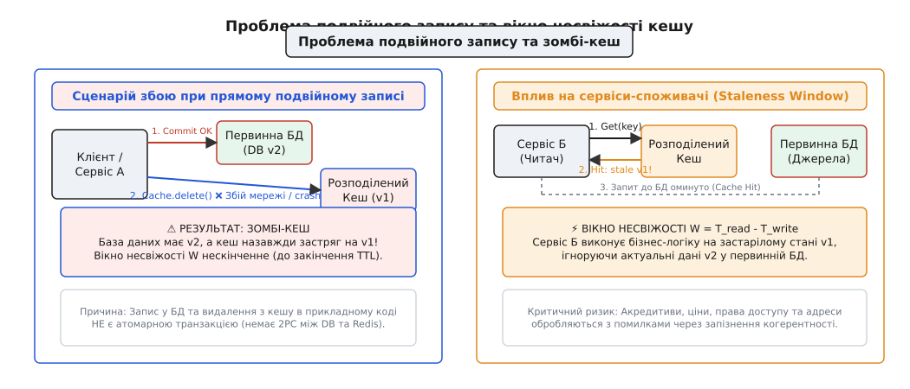
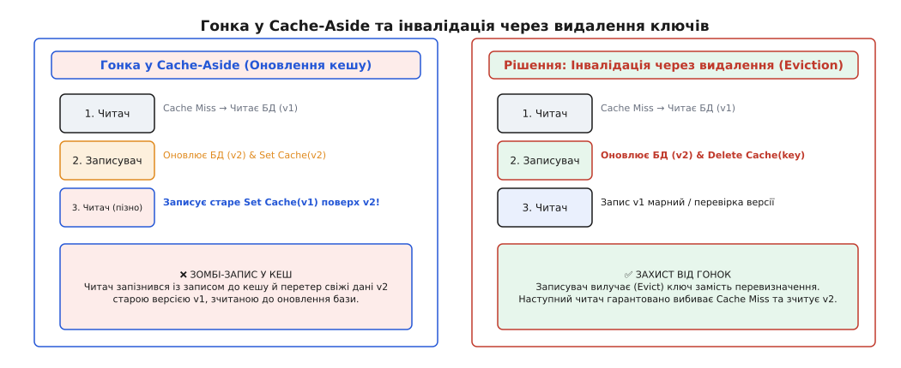
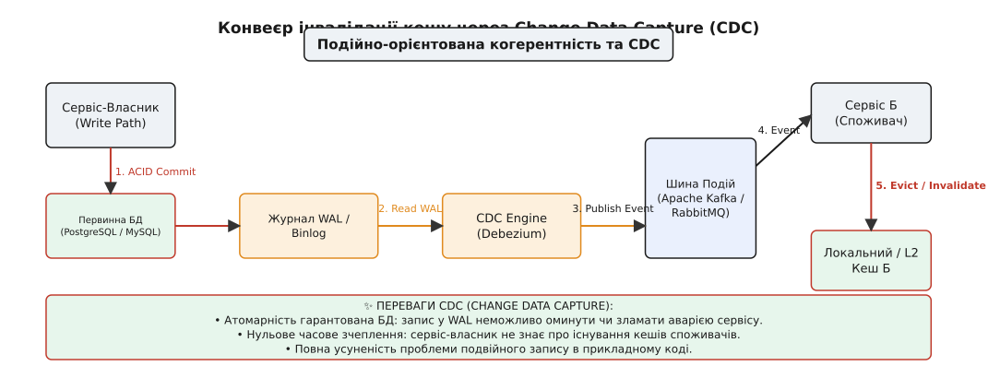
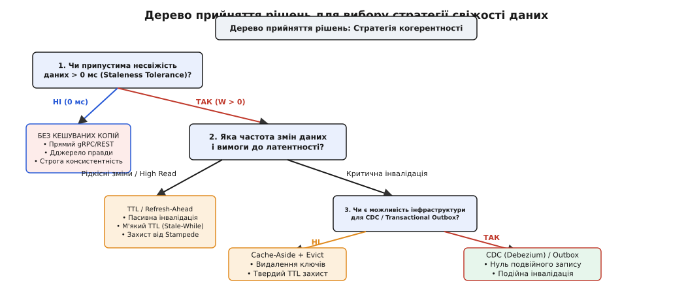

# Вибір стратегії свіжості між сервісами

<preknowlist>
- [Рамка рішення про кеш](root:progarch/cache-decision-framework) — вартість кешування, запізнення та оцінка вигоди.
- [Матеріалізація проти кешу проти читання наживо](root:progarch/materialization-vs-cache) — вибір між обчисленням при запиті, проміжним кешем та підготовленим поданням.
- [Zero-downtime міграції даних](root:progarch/zero-downtime-migration) — розширення та звуження схем, подвійний запис без простою.
- [Transactional outbox](root:progarch/outbox-pattern) — транзакційна публікація подій змін стану без подвійного запису.
- [CAP і PACELC](root:progarch/cap-theorem) — компроміс між узгодженістю, доступністю та затримкою в розподілених системах.
</preknowlist>

Сервіс профілів користувачів оновлює юридичну адресу покупця й успішно зберігає новий рядок у первинній базі даних PostgreSQL. У той самий момент сервіс оформлення замовлень читає профіль того самого користувача з розподіленого Redis-кешу, де встановлено стандартний час життя (TTL) в 1 годину. Користувач тисне кнопку «Оформити замовлення», і коштовне відправлення вартістю 15 000 грн вирушає за старою адресою, оскільки локальний кеш сервісу замовлень ще 42 хвилини вважатиме застарілий запис повністю дійсним. Одне рассинхронізоване значення між первинним сховищем даних та кешем сервісу-споживача перетворює звичайне оновлення профілю на фінансову втрату, скаргу покупця й тривале ручне розслідування.

Ця аварія виникає не через помилку в коді валідації і не через збій у мережевому обладнанні. Вона є прямим наслідком архітектурного вибору: впроваджуючи кеш між розподіленими сервісами, інженери створили **друге джерело правди** (Second Source of Truth), але не спроєктували чіткої стратегії когерентності (англ. *cache coherence* — узгодженість кешу, від лат. *cohaerens* — пов'язаний) для його інвалідації.

У цьому кроці ми розберемо, як виміряти вікно несвіжості даних між сервісами, чому прямий подвійний запис гарантовано призводить до зомбі-кешу при збоях, чим Cache-Aside відрізняється від Change Data Capture (CDC) на рівні транзакційних журналів і як побудувати інженерну матрицю прийняття рішень для вибору стратегії свіжості під кожну доменну межу.

---

## 1. Анатомія незбігу: вікно несвіжості та друга правда системи

У розподілених системах кеш часто сприймають як «безкоштовний прискорювач читання». Проте з точки зору архітектури збереження будь-якої копії даних у локальній пам'яті сервісу або в оперативній базі Redis створює принципово новий стан: **система втрачає строгу консистентність** (Strong Consistency).

### 1.1. Вікно несвіжості (Staleness Window)

Мить, коли сервіс-власник здійснює фіксацію зміни у первинному сховищі (`T_write`), майже ніколи не збігається з миттю, коли ця зміна відображається у кеші сервісу-споживача (`T_sync`). Проміжок часу між цими двома подіями називають **вікном несвіжості** (Staleness Window, `W`):

```
W = T_sync - T_write
```

Протягом усього часу `W` будь-яке читання з кешу повертає застарілий стан (Stale Read). Якщо середній інтервал між оновленнями сутності становить `T̄_update`, ймовірність `P_stale` того, що споживач натрапить на застарілі дані під час довільного запиту, пропорційна відношенню вікна несвіжості до частоти оновлень:

```
P_stale = min(1.0, W / T̄_update)
```

Якщо вікно несвіжості `W` вимірюється годинами (як при пасивному TTL), а дані оновлюються щохвилини, ймовірність отримати застарілий стан наближається до 100%.

```
Сервіс-Власник (Write):  ---[T_write: DB Commit v2]----------------------------------------->
                                   |
                                   |  Вікно несвіжості W (Кеш містить старе v1)
                                   v
Сервіс-Споживач (Read):  -----------------------[T_read: Cache Hit v1]---[T_sync: Evict]---->
```

Розгляньмо конкретний приклад із трасування трафіку (Distributed Tracing). Сервіс оновлення цін виставляє новий прайс на товар о 14:00:00.000. Втім, сервіс оформлення покупок продовжує отримувати Cache Hit із застарілою ціною зі свого L2 Redis-кешу:

```text
[14:00:00.000] [PriceService] DB Commit: product_42 price = 499.00 UAH
[14:00:00.150] [OrderService] GET /cache/product_42 -> Cache Hit: price = 299.00 UAH (STALE!)
[14:00:00.300] [OrderService] Checkout Order #1001 with price = 299.00 UAH
[14:00:05.000] [CacheEvictWorker] Redis DEL product_42 (Eviction Completed)
```

У цьому трасуванні вікно несвіжості `W` становило 5.0 секунд. Протягом цих 5 секунд компанія продавала товар за заниженою ціною, оскільки кеш сервісу замовлень не дізнався про зміну негайно.

### 1.2. Фундаментальна дилема: швидкість проти свіжості

Згідно з теоремою PACELC (розширенням CAP-теореми), навіть за відсутності мережевих розривів (`P`), система мусить обирати між затримкою (`L` — Latency) та консистентністю (`C` — Consistency).

Спроба зробити кеш **абсолютно свіжим** (`W = 0`) вимагає, щоб кожен запис у базу даних сервісу-власника синхронно інвалідував або оновлював кеші всіх сервісів-споживачів у межах однієї розподіленої транзакції. Це миттєво повертає систему до часового й операційного зчеплення (Temporal and Operational Coupling): затримка запису зростає до суми затримок усіх мережевих стрибків, а падіння одного вузла кешу блокує записи в усій системі.

Математично затримка синхронного оновлення кешу `L_sync` обчислюється як:

```
L_sync = T_db_commit + 2 × max(RTT_network) + T_cache_update
```

Якщо в системі 5 незалежних сервісів-споживачів, кожен із яких тримає свій кеш, затримка запису зростає в рази, а надійність описується як добуток доступностей усіх вузлів.

Навпаки, відмова від синхронізації заради низької затримки й високої доступності робить вікно `W` неконтрольованим. Зрозуміти, як індустрія пройшла шлях від апаратних шин процесорів до програмного управління вікном несвіжості, можна прочитавши [історію протоколу MESI та виклик Філа Карлтона](root:progarch/change-and-cache-tactics/cache-coherence-choice/hist-cache-invalidation.md).

### 1.3. Динамікакоефіцієнта попадань (Hit Ratio Degradation)

Масове скасування чи інвалідація ключів впливає на середній коефіцієнт попадань у кеш (Hit Ratio). Якщо у звичайному режимі `Hit_Ratio = 0.95` (95% запитів повертаються з оперативної пам'яті за 1.5 мс), то масовий виклик `Evict` падає `Hit_Ratio` до 0.20.

Наслідком є сплеск затримки на профілі p99: якщо базу даних розраховано лише на 5% основного трафіку, раптове зростання навантаження в 16 разів (з 5% до 80%) призводить до вичерпання пулу з'єднань БД (Connection Pool Exhaustion), зростання затримок з 10 мс до 4000 мс та відмови системних контролерів.

---

## 2. Проблема подвійного запису (Dual-Write Problem) та зомбі-кеш

Найпоширенішою інженерною помилкою при реалізації когерентності кешу є **прямий подвійний запис** (Dual-Write) у прикладному коді сервісу.

Розробник пише метод оновлення сутності, намагаючись послідовно виконати дві операції:

```
1. primary_db.commit(updated_entity);
2. distributed_cache.delete(entity_id);
```

На перший погляд ця схема здається логічною. Проте вона не володіє властивістю атомарності, оскільки первинне сховище (наприклад, PostgreSQL) та кеш-сервер (наприклад, Redis) є **двома незалежними розподіленими системами**, між якими немає спільного транзакційного контексту (Two-Phase Commit).


*Проблема подвійного запису: збій оновлення кешу після запису в БД створює нескінченне вікно несвіжості W.*

### 2.1. Анатомія гілок збою при подвійному записі

Аналіз виконання цього коду під навантаженням виявляє два критичні сценарії аварій:

#### Сценарій А: Збій після фіксації у БД (Partial Failure)
1. Команда `primary_db.commit()` виконується успішно. База даних зафіксувала стан `v2`.
2. До виконання операції `distributed_cache.delete()` відбувається один із трьох інцидентів:
   - Процес застосунку отримує `OOMKilled` або `SIGKILL` від ОС;
   - Мережевий комутатор скидає з'єднання з Redis-кластером;
   - Таймаут з'єднання з кешем перевищено через пик латентності.

**Наслідок**: База даних містить нове значення `v2`, але кеш зберігає старий стан `v1`. Оскільки ключ у кеші не було видалено, вікно несвіжості `W` перетворюється на нескінченність (або триває до закінчення твердого TTL). Утворюється **зомбі-кеш** — застарілі дані, які система вважає актуальними.

#### Сценарій Б: Відкат транзакції після очищення кешу
Якщо розробник міняє порядок операцій, намагаючись спочатку очистити кеш, а потім записати в БД:

```
1. distributed_cache.delete(entity_id);
2. primary_db.commit(updated_entity); // ❌ Помилка: unique constraint violation!
```

При помилці на кроці 2 транзакція у БД відкочується (Rollback), і в базі залишається стан `v1`. Проте кеш уже очищено. Наступний паралельний запит читача вибиває Cache Miss, зчитує з бази стан `v1` і повертає його в кеш. Здається, що система повернулася в норму, але під час гонки записів паралельний читач може вклинитися між кроками 1 і 2, зчитати ще незафіксований стан і зафіксувати його у кеші.

### 2.2. Чому розподілені транзакції (2PC) не є рішенням

Намагання огорнути операцію запису в БД та видалення з кешу в розподілену транзакцію за протоколом двох фаз (2PC / XA Transactions) створює неприпустимі накладні витрати:
- Кожен запис вимагає двох фаз мережевих узгоджень (`Prepare` та `Commit`);
- Якщо Redis або мережа тимчасово недоступні, база даних блокує рядки й зупиняє обробку всіх нових транзакцій;
- Доступність всієї системи падає до добутку доступностей її компонентів: `A_system = A_db × A_cache × A_network`.

### 2.3. Повернення консистентності при розділенні мережі (Split-Brain Handling)

У розподілених кеш-кластерах на зразок Redis Cluster або Redis Sentinel виникнення мережевого ізолювання (Network Partitioning) створює загрозу роздвоєння кешу (Split-Brain). Якщо майстер-нода ізолюється від більшості вузлів, але продовжує приймати виклики `DEL` від найближчого сервісу, а решта кластера обирає нового майстра, команди інвалідації будуть втрачені.

Для нейтралізації цього ризику в конфігурації кеш-вузлів вимагається встановлення суворих параметрів реплікації:

```text
min-replicas-to-write 1
min-replicas-max-lag 10
```

Ці налаштування блокують операції запису й інвалідації на ізольованому майстрі, якщо він втрачає підтвердження від реплік, запобігаючи виконанню команд у збійній партиції.

---

## 3. Реактивна інвалідація: Cache-Aside проти Write-Through

Щоб зменшити вікно несвіжості `W` без використання небезпечного подвійного запису, застосовують активні патерни інвалідації.

### 3.1. Cache-Aside (Lazy Loading) та захист від гонок

У патерні Cache-Aside прикладний код сервісу-читача явно керує взаємодією з кешем та базою даних:

```
[Запит читання]
  ├──> 1. Get(key) з Кешу
  │     ├──> Cache Hit  ──> Повернути дані
  │     └──> Cache Miss ──> 2. Read з БД ──> 3. Set(key, val) у Кеш ──> Повернути дані
```

Головний ризик Cache-Aside полягає у **гонінці читача й записувача** (Read-Write Race Condition):

```
Читач (Miss):   ---[1. Read DB v1]-----------------------------[3. Set Cache v1 (STALE!)]--->
                                       \                     /
Записувач:       -------------------[2. Write DB v2]--[Evict Cache]------------------------>
```

1. Читач 1 вибиває Cache Miss і зчитує з бази застарілий стан `v1`.
2. Записувач 2 оновлює базу даних до стану `v2` і надсилає команду видалення ключа з кешу (`Evict`).
3. Читач 1, затримавшись у мережі на кілька мілісекунд, нарешті доходить до кроку запису в кеш і виконує `Set(key, v1)`.

У результаті застарілий стан `v1`, зчитаний до оновлення бази, переписує порожнє місце в кеші після інвалідації.


*Гонка паралельного читача й записувача у Cache-Aside та її вирішення через видалення ключів.*

#### Правила захисту Cache-Aside від гонок

1. **Інвалідація через видалення (Eviction over Update)**:
   Записувач **ніколи не повинен записувати нове значення** у кеш (`Set(key, new_val)`). Він повинен виключно **видаляти ключ** (`Delete(key)`). Це змушує наступного читача виконувати чесний Cache Miss і тягнути свіжий стан із БД.
2. **Перевірка монотонної версії (Version Guard)**:
   Кожен запис у кеш повинен містити монотонну версію або таймстамп сутності (`version`). Якщо кеш вже містить запис із версією `v2`, спроба запізнілого читача записати `v1` відхиляється на рівні атомарного скрипта (Redis Lua Script або CAS-операція).
3. **Об'єднання паралельних запитів (Single-Flight Coalescing)**:
   Щоб запобігти масовому пробиванню бази даних (Thundering Herd) при Cache Miss, сервіс повинен гарантувати, що лише перший потік звертається до БД для обчислення значення ключа, а інші чекають на результат першого запиту (наприклад, за допомогою `golang.org/x/sync/singleflight` або Java `Caffeine`).

Детальну реалізацію версійного бар'єра мовами C, C++ та Python зведено в [робочий харнес стратегій когерентності](root:progarch/change-and-cache-tactics/cache-coherence-choice/proj-cache-coherence-harness.md).

### 3.2. Write-Through та Write-Behind (Inline Caching)

У патерні **Write-Through** кеш виступає єдиним фасадом даних. Застосунок пише лише в кеш, а кеш-шар синхронно проливає зміну у первинну базу даних:

```
[Write Query] ──> Cache ──(Синхронний транзакційний запис)──> Primary Database
```

- **Write-Through (Синхронний)**: Запит очікує завершення запису і в кеш, і в БД. Гарантує `W = 0`, але зберігає часове зчеплення.
- **Write-Behind / Write-Back (Асинхронний)**: Кеш негайно підтверджує запис, а фоновий потік асинхронно скидає накопичені зміни в базу пачками (Batching).

**Чому Write-Through провалюється між розподіленими сервісами**:
Write-Through чудово працює всередині одного моноліту або однорідної бази даних (наприклад, Cassandra чи In-Memory Data Grid). Проте між різними мікросервісами він вимагає, щоб один сервіс віддавав право керування своєю первинною базою даних зовнішньому кеш-шару. Це порушує автономію доменних меж і переносить межі транзакцій на зовнішню інфраструктуру.

---

## 4. Подійно-орієнтована когерентність та Change Data Capture (CDC)

Для усунення проблеми подвійного запису без втрати автономії сервісів використовують **подійно-орієнтовану інвалідацію**.

### 4.1. Transactional Outbox: Гарантована публікація подій інвалідації

Замість прямого виклику кешу або шини подій у прикладному коді, сервіс-власник використовує патерн **Transactional Outbox**:

1. В межах однієї транзакції PostgreSQL оновлюється бізнес-таблиця `users` та додається рядок у таблицю `outbox_events`:

```sql
BEGIN;
UPDATE users SET address = 'Нова Адреса', version = version + 1 WHERE id = 'usr_42';
INSERT INTO outbox_events (id, aggregate_type, aggregate_id, payload)
VALUES ('evt_100', 'USER_PROFILE', 'usr_42', '{"event": "USER_ADDRESS_UPDATED"}');
COMMIT;
```

2. окремий фоновий релей (Outbox Worker) вичитує таблицю `outbox_events` і публікує повідомлення в брокер (Apache Kafka).
3. Сервіси-споживачі слухають топік і при отриманні події виконують `Cache.delete("usr_42")`.

Це гарантує атомарність: якщо транзакція в базі відкотилася, подія інвалідації не вийде в мережу; якщо транзакція зафіксована, подія гарантовано буде опублікована (гарантія `at-least-once`).

### 4.2. Change Data Capture (CDC): Інвалідація на рівні транзакційних журналів

Патерн **Change Data Capture (CDC)** іде ще далі: він повністю усуває необхідність писати код публікації подій або ведення таблиці Outbox.

Спеціалізований процес (наприклад, **Debezium**) підключається безпосередньо до транзакційного журналу бази даних (PostgreSQL WAL — Write-Ahead Log або MySQL Binlog). Щойно база фіксує зміну рядка, CDC-коннектор зчитує бінарний лог і генерує подію в Kafka.


*Подійно-орієнтована когерентність на основі Change Data Capture (CDC / Debezium) та шини подій.*

#### Інженерні переваги CDC для кеш-когерентності

- **Абсолютна надійність (No Dual-Write)**: Прикладний код взагалі не знає про існування кешів чи Kafka. Запис у WAL є фізичною основою роботи самої БД, його неможливо оминути чи забути в коді.
- **Нульове часове зчеплення**: Сервіс-власник виконує записи з максимальною швидкістю локальної БД.
- **Гарантований порядок (Monotonic Ordering)**: Записи у логу WAL строго впорядковані. CDC-коннектор транслює їх у Kafka з використанням `aggregate_id` як ключа партиціонування, що гарантує збереження хронології інвалідації.
- **Компактні топіки (Log Compacted Topics)**: В конфігурації Kafka `cleanup.policy=compact` шина зберігає лише останній стан для кожного ключа, що дозволяє новим сервісам-читачам миттєво підтягувати актуальні інвалідації при запуску.

#### Налаштування логічної реплікації PostgreSQL для Debezium

Для роботи CDC у PostgreSQL включають розширенну логічну реплікацію в `postgresql.conf`:

```text
wal_level = logical
max_replication_slots = 10
max_wal_senders = 10
```

CDC-плагін `pgoutput` створює реплікаційний слот, що гарантує читання кожної фізичної транзакції без втрати подій інвалідації навіть при перезапуску Debezium.

---

## 5. Пасивна когерентність: TTL, Soft TTL та Refresh-Ahead

Якщо бізнес-домен допускає вікно несвіжості `W > 0`, найпростішим і найстійкішим рішенням є **пасивні стратегії свіжості**, які взагалі не вимагають мережевих викликів інвалідації.

### 5.1. Твердий TTL (Hard Time-To-Live)

Кожен запис у кеші отримує жорсткий час життя `T_ttl`. Після закінчення цього часу кеш-сервер автоматично вилучає ключ:

```
W_max = T_ttl
```

**Переваги**: Нульова складність інфраструктури, абсолютна автономність читачів, захист від витоків пам'яті.

**Формула розрахунку навантаження на базу даних**:
Якщо загальний потік запитів становить `QPS_total`, а кеш витісняється кожні `T_ttl` секунд, середня кількість запитів, що пробиваються до первинної бази даних (`QPS_db`), становить:

```
QPS_db = QPS_total / (1.0 + (QPS_total × T_ttl / N_keys))
```

Збільшення `T_ttl` зменшує `QPS_db`, але лінійно розширює вікно несвіжості `W`.

### 5.2. Soft TTL + Background Refresh (Stale-While-Revalidate)

Для захисту від **лавинного ефекту** (Cache Stampede / Thundering Herd) при закінченні TTL на гарячих ключах застосовують патерн **Soft TTL** (Stale-While-Revalidate):

Запис у кеші містить два таймстампи:
- `T_soft` — час, після якого дані вважаються «м'яко застарілими»;
- `T_hard` — час остаточного вилучення з кешу.

```
[Потік запитів]
  │
  ├──> t < T_soft  ──> Hit: Повернути свіжі дані негайно
  │
  ├──> T_soft <= t < T_hard ──> Hit: Повернути застарілі дані + Асинхронно запустити фоновий Refresh
  │
  └──> t >= T_hard ──> Hard Miss: Блокуюче оновлення з БД (Single-Flight Lock)
```

```
Часова вісь життя ключа:
0 ------------------------ T_soft ------------------------ T_hard ------------------------> (Час)
  [ Свіжий стан (Hit) ]            [ М'яка несвіжість ]             [ Твердий Miss ]
                                   (Повертаємо stale +
                                    фоновий refresh в БД)
```

Коли запит приходить у проміжку між `T_soft` та `T_hard`, кеш **негайно повертає застаріле значення**, не змушуючи користувача чекати. Одночасно один фоновий потік надсилає запит до первинної БД для оновлення значення в кеші. Це повністю усуває сплески затримки й захищає первинну базу даних від перевантаження під час масових розпродажів.

### 5.3. Імовірне раннє оновлення (Алгоритм XFetch)

Для усунення синхронних затримок при високому трафіку використовують алгоритм імовірнісного оновлення **XFetch**:

```
Compute_Early_Refresh = ( -beta × log(rand()) × delta ) > ( T_hard - t )
```

де `delta` — час виконання обчислення/запиту до БД, `beta` — коефіцієнт агресивності оновлення (`beta > 0`), `rand()` — випадкове число від 0 до 1. Що ближче час `t` до закінчення терміну дії ключа `T_hard`, то вищою є ймовірність того, що випадковий запит запустить фонове оновлення до того, як ключ остаточно затухне.

---

## 6. Матриця прийняття рішень та інженерна рамка

Вибір стратегії когерентності кешу між сервісами повинен спиратися на суворі бізнес-вимоги до консистентності та технічні обмеження інфраструктури.

### 6.1. Покроковий алгоритм вибору

```
                         Чи припустиме вікно несвіжості W > 0?
                                   /             \
                             (Ні) /               \ (Так)
                                 v                 v
                   [Direct Read / Без кешу]    Чи критичний ризик подвійного
                   (Строга консистентність)    запису при аваріях?
                                                   /          \
                                             (Так)/            \(Ні)
                                                 v              v
                                        Чи є інфраструктура   [Cache-Aside +
                                        для CDC / Outbox?     Eviction + TTL]
                                           /          \
                                     (Так)/            \(Ні)
                                         v              v
                                      [CDC /      [Transactional
                                    Debezium]       Outbox]
```


*Дерево прийняття рішень для вибору стратегії свіжості даних між розподіленими сервісами.*

Зіставити інженерні параметри, деталі стандартного конверта подій та сценарії аварій допоможе [матрицю порівняння й контракт інвалідації](root:progarch/change-and-cache-tactics/cache-coherence-choice/api-coherence-matrix.md).

> 🔧 **Навіщо це.**
> У реальній системі електронної комерції (e-commerce) спроба застосувати єдиний патерн інвалідації для всіх даних призводить до катастрофи.
>
> 1. **Баланс користувача та залишки акцій**: Вікно несвіжості `W = 0`. Кешування заборонено, читання виконується напряму з транзакційної БД із застосуванням песимістичних блокувань (`SELECT ... FOR UPDATE`).
> 2. **Каталог товарів та ціни**: Вікно несвіжості `W ≤ 100 мс`. Застосовують **CDC (Debezium + Kafka)**: оновлення ціни у БД менеджерського сервісу автоматично вибиває кеші у сервісі пошуку й каталогу без викликів прямого REST/gRPC.
> 3. **Довідники країн, брендів та категорій**: Вікно несвіжості `W ≤ 24 години`. Застосовують **Soft TTL (Stale-While-Revalidate)** із фоновим оновленням. Сервіси працюють із 100% локальною швидкістю, повністю ізольовані від аварій центральної бази даних.

---

## 7. Підсумковий синтез

Кешування між розподіленими сервісами — це завжди компроміс між продуктивністю та узгодженістю. Головні висновки для проєктування когерентності:

1. **Кеш — це друга правда**: Створення кешу без визначеної стратегії інвалідації гарантовано призводить до читання застарілих даних.
2. **Уникайте подвійного запису у прикладному коді**: Спроба оновити базу даних та кеш послідовними викликами в один метод створює зомбі-кеш при першому ж мережевому збої або аварії процесу.
3. **Видаляйте, а не перезаписуйте**: У патерні Cache-Aside записувач повинен виконувати `Delete(key)`, а не `Set(key, val)`, й захищати записи версійним бар'єром.
4. **Використовуйте CDC або Outbox для важливих подій**: Якщо потрібна швидка інвалідація без подвійного запису, зчитайте журнал транзакцій (WAL) через CDC або розгортайте Transactional Outbox.
5. **Використовуйте Soft TTL для пасивної свіжості**: Коли домен пробачає запізнення у кілька секунд або хвилин, Soft TTL із фоновим оновленням дає максимальну доступність і захищає первинні сховища від лавинного ефекту.
