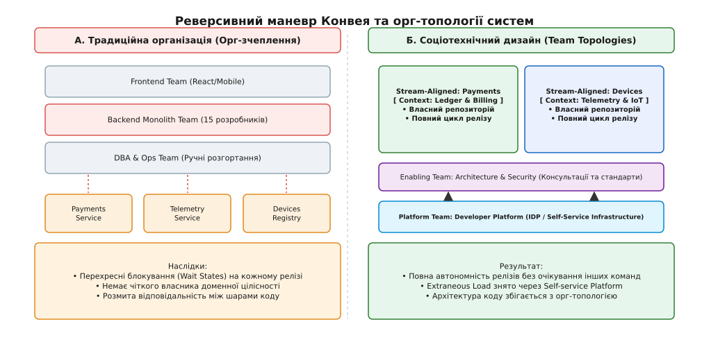
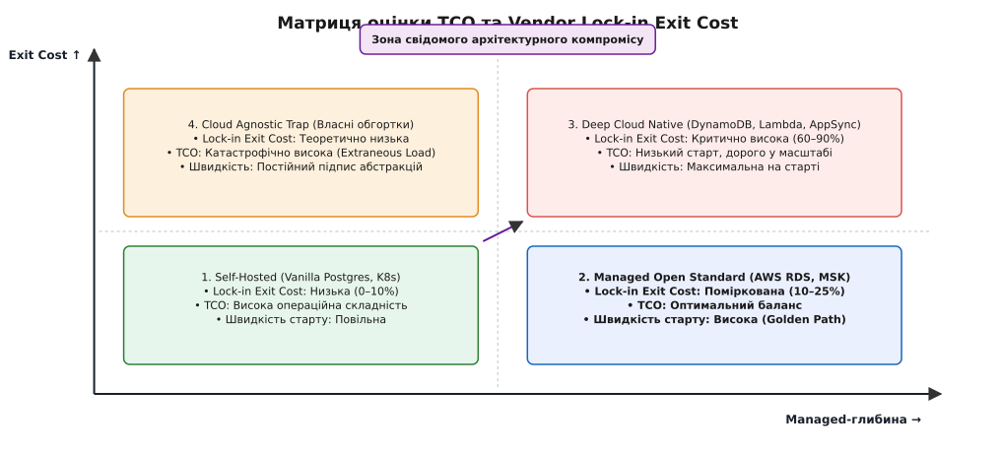
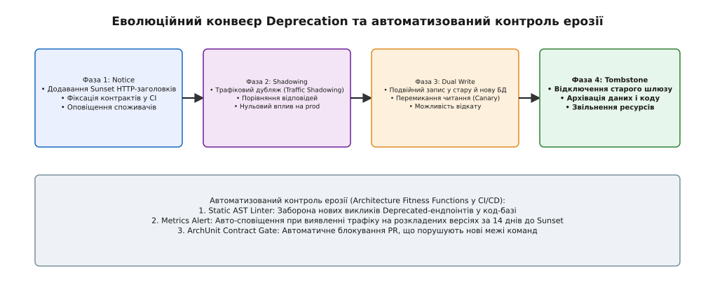

# Капстон, крок 5: Організація й еволюція

<preknowlist>
- [Закон Конвея та топології команд](book:programming/architecture-discipline/conway-law-team-topologies) — зсув архітектурних меж і груп відповідно до комунікаційних каналів.
- [Когнітивне навантаження команди](book:programming/architecture-discipline/cognitive-load-limits) — типи когнітивного навантаження та обмеження розміру контексту для однієї команди.
- [Економіка TCO та Vendor Lock-in](book:programming/architecture-discipline/cloud-tco-lockin) — вимірювання вартості володіння, оцінка еластичності хмари та ціна виходу з вендора.
- [Політика Deprecation](book:programming/architecture-discipline/deprecation-policy) — виведення застарілих API, сервісів і даних без зупинки працюючих систем.
- [Стратегія Strangler Fig](book:programming/software-design/strangler-fig) — покрокове заміщення спадщини новим функціоналом на межі шлюзу.
</preknowlist>

Платформа Digital Homes (DH) розрослася до 45 мікросервісів у трьох географічних регіонах, а інженерний штат збільшився з 8 до 50 розробників. Кожне нове розгортання перетворилося на соціотехнічний кошмар: реліз простого оновлення сервісу авторизації вимагає узгодження між п'ятьма командами, черга на тестування у загальному стейджингу розтягується на два тижні, а щомісячний рахунок від AWS перевищив \$120 000 через неконтрольоване використання закритих managed-сервісів. На п'ятому кроці капстон-проєкту ми виходимо за межі чистої технічної схеми: система, позбавлена чіткої соціотехнічної топології, неминуче розвалюється під власною орг-структурною вагою.

До цього моменту ми збудували бізнес-драйвери (Крок 1), виділили межі контекстів і моделі даних (Крок 2), розрізали сервіси й узгодили саги (Крок 3), а також загартували систему під тиском масштабу й загроз (Крок 4). Проте будь-яке ідеальне технічне рішення втрачає сенс, якщо оргструктура компанії створює міжкомандні блокування, розробники тонуть у налаштуванні інфраструктури, а хмарний lock-in паралізує еволюційний розвитку. Організація й еволюція — це фінальний соціотехнічний шар, який зшиває систему в єдине ціле.


*Реверсивний маневр Конвея: перехід від хаотичного перехресного орг-зчеплення шарів до автономних Stream-aligned команд, підтримуваних Внутрішньою платформою (Platform Team).*

## 1. Соціотехнічний дизайн та Закон Конвея

Коли інженерний штат Digital Homes виріс із 8 до 50 осіб, керівництво компанії зробило класичну помилку: воно розділило інженерів за технологічними шарами коду. Було створено «Команду Frontend» (React/Mobile), «Команду Backend» (Go/C++) та «Команду DBA/Ops» (PostgreSQL/Kubernetes). 

На папері ця структура виглядала логічно. На практиці вона призвела до повної паралізації релізів. Щоб додати нову фічу (наприклад, плату за підписку на розорені камери відеонагляду), розробник Frontend чекав 5 днів, поки Backend додасть новий API-ендпоінт, а Backend чекав 4 дні, поки DBA створить нову таблицю в PostgreSQL та прокотить міграцію. Час від виникнення ідеї до виходу в продакшн (Lead Time for Changes) зріс із 3 годин до 25 днів.

### Закон Конвея у дії: чому тех-архітектура та оргструктура нерозривні

Закон Мелвіна Конвея стверджує, що структура будь-якої програмної системи дзеркально копіює комунікаційні шляхи організації, яка її створила. Детальний історичний шлях розвитку цього принципу розібрано у вставці [📜 Від статті Мелвіна Конвея 1967 року до соціотехнічного дизайну 2020-х](root:progarch/legacy-and-evolution/capstone-org-evolution/hist-conway-law-origins.md).

Коли команди розділені за шарами коду (UI, Backend, DB), між ними виникає формальний кордон комунікації. Оскільки спілкування між різними відділами коштує дорого (мітинги, тікети в Jira, узгодження), інженери несвідомо будують міжшарові зв'язки, які вимагають постійних синхронних викликів та блокувань:

```
[ Frontend Team ] ──(Тікет в Jira)──> [ Backend Team ] ──(Тікет в Jira)──> [ DBA Team ]
        │                                    │                                  │
        ▼                                    ▼                                  ▼
[ React Component ] ──(HTTP Sync)──> [ Monolithic Controller ] ──(SQL)──> [ Monolithic DB ]
```

Результатом стає соціотехнічне зчеплення (Socio-Technical Coupling). Зміни в одному модулі викликають каскадні редагування у репозиторіях трьох різних команд. Жодна з команд не має повного бачення домену, і жодна не може самостійно задеплоїти свій код без згоди інших.

### Реверсивний маневр Конвея (Inverse Conway Maneuver)

Щоб зламати цей тупиковий стан, ми застосовуємо **Реверсивний маневр Конвея**. Замість того, щоб підлаштовувати технічну архітектуру під існуючі відділи, ми спочатку розкроюємо топологію команд так, щоб вона дзеркально відповідала бажаним межам обмежених контекстів (Bounded Contexts) з Кроку 2.

У системі Digital Homes ми переформовуємо оргструктуру з горизонтальних шар-команд на вертикальні автономні **Stream-Aligned команди**:

1. **Stream-Aligned Team: Payments & Subscriptions:** Повністю відповідає за домен грошей, білінгу та підписок. Команда містить власних frontend-, backend- та data-інженерів. Вони володіють сервісами `payment-gateway`, `ledger-service` та таблицями білінгу від баз даних до UI.
2. **Stream-Aligned Team: Device Telemetry & IoT:** Володіє доменом прийому високонавантаженого потоку даних з давачів (`telemetry-ingest`, `mqtt-broker`, time-series DB).
3. **Stream-Aligned Team: Access & Security:** Володіє доменом ідентичності, замків та політик доступу.

Завдяки цьому зсуву кожна Stream-aligned команда отримує повну продуктивну автономію (Product Autonomy). Вона розгортає власні сервіси в продакшн незалежно від інших команд, а її релізи не вимагають проходження крізь крос-командні стейджинг-черги.

### Чотири топології команд та три режими взаємодії

За концепцією Team Topologies, для забезпечення ефективного розходу людської енергії ми впроваджуємо чіткий розподіл функцій між чотирма типами команд:

- **Stream-Aligned Team (Команда потоку цінності):** Основна рушійна сила бізнесу. Працює над конкретним бізнес-доменом. Головна метрика — швидкість доставки цінності клієнту (Cycle Time) без очікування інших команд.
- **Platform Team (Платформна команда):** Створює Внутрішню платформу розробника (Internal Developer Platform — IDP). Вона надає інфраструктурні обгортки (Kubernetes, CI/CD, логування, моніторинг, шаблони сервісів) як продукт (X-as-a-Service).
- **Enabling Team (Команда-фасилітатор):** Група експертів з конкретної тематики (наприклад, безпека, хаос-інжиніринг або C++20/Go оптимізація). Вона тимчасово підключається до Stream-команд, щоб підвищити їхні навички, після чого виходить з проекта.
- **Complicated-Subdomain Team (Команда складної підсистеми):** Виділяється лише тоді, коли у системі є вузький математично чи технічно складний модуль (наприклад, реалокація відеокодеків H.265 або ML-модель розпізнавання облич на краю).

Взаємодія між цими командами суворо регламентується за трьома режимами: **Collaboration** (тимчасова спільна розробка специфікацій), **X-as-a-Service** (споживання продуктів платформи через API без мітингів) та **Facilitating** (навчання). Нормативні шаблони та правила цих режимів зведено у вставці [📋 Соціотехнічний контракт, аудит когнітивного навантаження та матриця TCO/Lock-in](root:progarch/legacy-and-evolution/capstone-org-evolution/api-org-evolution-playbook.md).

Пастка неконтрольованої співпраці (Collaboration Trap) виникає тоді, коли дві Stream-aligned команди сидять у режимі Collaboration місяцями. Це сигналізує про невірне виділення меж контексту: якщо командою Payments та командою Telemetry потрібні щоденні спільні засідання для узгодження полів у JSON, ці два модулі насправді утворюють єдиний контекст і повинні бути злиті в одну команду чи розділені чітким асинхронним подіям контрактом.

Правило чистоти володіння кодом (Strict Code Ownership vs Open Internal Source) вимагає, щоб кожен репозиторій мав одну єдину відповідальну Stream-команду. Зовнішній розробник може створити Pull Request у чужий репозиторій, але мердж здійснюється виключно після схвалення двома інспекторами з команди-власника згідно із встановленим SLA перевірки (PR Review SLA <= 24 hours).

Соціотехнічні антипатерни, такі як «Матричне управління» (Matrix Management) чи «Дробове володіння інженером» (коли один розробник виділяється на 3 різні команди на 20% часу), категорично відкидаються. Будь-яке розщеплення людської уваги руйнує фокус Stream-aligned команди і призводить до того, що інженер витрачає 80% енергії на контекстні перемикання між мітингами трьох різних продуктів.

## 2. Обмеження когнітивного навантаження

Чому наївна спроба розрізати моноліт Digital Homes на 45 мікросервісів при наявності 5 команд призвела до катастрофи? Оскільки кожна команда отримала під опіку по 9 мікросервісів, написаних на різних мовах, із власними Dockerfile, Terraform-скриптами, базами даних та CI/CD конвеєрами.

Розробники витрачали 70% свого робочого часу не на бізнес-логіку, а на перемикання контексту, відновлення впалих CI-конвеєрів та розбір конфліктів у Helm-чартах. Вони впали у стан **когнітивного перевантаження**.

### Анатомія когнітивного навантаження інженера

Людський мозок має обмежену ємність робочої пам'яті (згідно із законами когнітивної психології, людина здатна одночасно утримувати лише $7 \pm 2$ інформаційних фокусів). У соціотехнічному дизайні навантаження ділиться на три компоненти:

```
[ Загальне навантаження команди ] = [ Intrinsic Load ] + [ Extraneous Load ] + [ Germane Load ]
```

1. **Внутрішнє навантаження (Intrinsic Load):** Складність самого бізнес-домену (наприклад, правила взаєморозрахунків у платіжній системі чи правила обробки MQTT-пакетів). Це корисна складність, ради якої компанія наймає розробників. Вона знижується чистим доменним моделюванням (DDD) та розділенням контекстів.
2. **Стороннє навантаження (Extraneous Load):** Механічна рутина, пов'язана з інструментами, інфраструктурою та середовищем. Написання 500 рядків YAML для Kubernetes, ручне створення баз даних у AWS консолі, розбір поламаного Jenkins-файлу — це чисті сторонні витрати, які не додають жодної копійки бізнес-цінності.
3. **Доречне навантаження (Germane Load):** Продуктивна когнітивна робота, спрямована на створення архітектурних абстракцій, написання характеристичних тестів, перевірку доменних інваріантів та рефакторинг.

Коли Extraneous Load розростається до 60–70% ємності мозку інженера, на Germane Load залишається менше 10%. Розробники втомлюються, роблять дурні помилки у коді, а архітектура системи починає швидко деградувати (архітектурна ерозія).

### Зниження Extraneous Load через Внутрішню платформу (IDP)

Єдиний спосіб врятувати Stream-aligned команди від когнітивного вигорання — це передати все Extraneous-навантаження до **Platform Team**.

Платформена команда розробляє **Golden Path (Золотий шлях)** — набір автоматизованих CLI-інструментів, шаблонів проєктів та самообслуговуючих API. Коли Stream-команді Payments потрібен новий мікросервіс з базами даних і логуванням, вона не пише Terraform-скрипти з нуля. Вона виконує одну команду в терміналі:

```bash
dh-cli service create --name=payment-reconciler --template=go-microservice --db=postgres
```

За 2 хвилини IDP авто-генерує репозиторій із налаштованим CI/CD, прокинутим OpenTelemetry трейсингом, TLS-сертифікатами, підключеним Vault для секретів та базовими ArchUnit-тестами. Extraneous-навантаження розробника падає з 70% до 5%.

Платформа розглядається не як жорсткий бюрократичний інструмент, а як внутрішній продукт (Platform as a Product). Платформена команда постійно збирає зворотний зв'язок від Stream-команд, вимірює Net Promoter Score (NPS) серед розробників та скорочує час до першого успішного деплою нового інженера (Time to First Commit) до 1 години.

### Формування меж сервісів за когнітивною ємністю

Замість того, щоб різати кодову базу на 45 дрібних мікросервісів (нановироби), ми застосовуємо правило **когнітивного розкрою**:

> **Золоте правило розкрою:** Кількість та розмір сервісів під опікою однієї Stream-aligned команди не повинні перевищувати її когнітивну ємність. Одна команда розміром 5–8 осіб може ефективно володіти **максимум 1–2 складними обмеженими контекстами** (або одним модульним монолітом із 3–5 внутрішніми модулями).

Якщо бізнес-контекст розростається настільки, що команда не може тримати його ментальну мапу в голові на щоденних standup-зустрічах, цей контекст ділиться на два — і під другий контекст формується нова Stream-aligned команда.

Прийоми розкроювання при перевантаженні включають виділення другорядних сервісів у платформні модулі або ізоляцію важких обчислювальних алгоритмів у Complicated-Subdomain команди (наприклад, виділення алгоритму аналізу відеопотоків із камер у підсистему `video-analytics-engine`).

Когнітивна ємність команди також обмежується за правилом числа Данбара для мікрокоманд: як тільки чисельність Stream-aligned команди перевищує 9 осіб, природна комунікаційна щільність розривається. Команда перестає відчувати спільну відповідальність за код і самочинно ділиться на конкуруючі фракції. У цей момент архітектор повинен провести реорганізацію, розділивши команду на дві автономні Stream-групи з чітко розведеними Bounded Contexts.

## 3. Економіка архітектури, TCO та оцінка Lock-in

На четвертому місяці масштабування Digital Homes фінансовий директор виявив, що рахунок за AWS досяг \$120 000 на місяць. При цьому 40% цієї суми складала оплата за пропрієтарні сервіси AWS (DynamoDB, AppSync, AWS Amplify, Kinesis), які розробники підключили на ранньому етапі для «швидкого старту». 

Коли виникла потреба розгорнути локальний кластер DH у приватному дата-центрі у Європі через вимоги GDPR, з'ясувалося, що код повністю прив'язаний до закритих хмарних SDK. Спроба виходу з хмари оцінювалася у 8 місяців роботи всієї команди та \$500 000 бюджету.

### Повна вартість володіння (Total Cost of Ownership — TCO)

Архітектор зобов'язаний оцінювати будь-яке рішення не лише за інфраструктурним чеком від хмарного провайдера, а за метрикою TCO:

```
TCO = C_infra + C_ops + C_cognitive
```

Де:
- `C_infra`: Прямі фінансові витрати на оренду серверів, баз даних, дискового простору та мережевого трафіку.
- `C_ops`: Заробітна плата інженерів, які витрачають час на обслуговування цієї інфраструктури (патчі, резервне копіювання, аварії).
- `C_cognitive`: Фінансові втрати бізнесу від затримки виходу нових функцій через інфраструктурну складність (Cost of Delay).

Оптимізація TCO полягає в пошуку балансу між прямими інфраструктурними чеками та витратами людської праці. Дешевий self-hosted сервіс, який вимагає двох повноцінних DevOps-інженерів для підтримки, у підсумку коштує компанії дорожче, ніж дорогий managed-сервіс AWS RDS.

Також у концепцію FinOps входить впровадження обов'язкового тегування ресурсів (`CostCenter = PaymentsTeam`), що дає змогу бачити точну вартість інфраструктури в розрахунку на один активний давач або одну транзакцію клієнта.


*Співвідношення операційної швидкості розробки та ціни виходу (Lock-in Exit Cost). Свідомий компроміс вибирає керовані стандарти (Managed Open Standards), залишаючи власні абстракції лише у крайніх випадках.*

### Оцінка Lock-in Exit Cost (Ціни виходу з вендора)

Не весь Vendor Lock-in є шкідливим. На ранній стадії стартапу використання AWS DynamoDB або Firebase виправдано, оскільки воно дає змогу вийти на ринок за 2 тижні замість 6 місяців. Проте у зрілій системі за це доводиться платити.

Ми впроваджуємо метрику **Lock-in Exit Cost (Ціна виходу)** — обчислювальну оцінку того, скільки коштуватиме повне вилучення пропрієтарної технології з кодової бази:

```
ExitCost = (H_rewrite × Rate) + C_migration_data + C_downtime_risk
```

Де:
- `H_rewrite`: Кількість людино-годин, необхідних для переписування коду, що прямо використовує пропрієтарний SDK вендора.
- `C_migration_data`: Вартість експорту даних, трансформації схем та оплати вихідного мережевого трафіку (Egress Fees).
- `C_downtime_risk`: Фінансові ризики зупинки сервісу під час перемикання.

### Пастка «Cloud Agnostic» проти керованих стандартів

Незріла архітектурна відповідь на ризик Lock-in — це спроба побудувати **Cloud Agnostic** систему: створення власних шарів абстракцій поверх баз даних, черг, обчислень і сховищ файлів. 

Досвід показує, що створення власних обгортальних бібліотек поверх AWS S3 чи DynamoDB вимагає тисяч інженерних годин. Власний шар абстракції виходить недосконалим, покриває лише 20% можливостей хмари, позбавляє систему унікальних переваг провайдера і катастрофічно збільшує Extraneous Load для інженерів.

Замість цієї пастки ми застосовуємо правило **Managed Open Standards**:

1. **Бази даних та черги (Layer 1–2):** Використовуємо відкриті стандарти з можливістю запусків у managed-версіях. Замість DynamoDB обираємо **Managed PostgreSQL** (AWS RDS / GCP Cloud SQL) або **Cassandra**. Замість AWS Kinesis обираємо **Managed Apache Kafka (MSK)** або **NATS**. Якщо виникне потреба міграції, ми просто змінюємо connection string і мігруємо дані стандартними утилітами (`pg_dump`, CDC), а код застосунку залишається без змін.
2. **Обчислення (Compute):** Контейнеризація на базі Docker/OCI та стандартні розгортання в Kubernetes (EKS/GKE чи bare-metal). Відмова від пропрієтарних Serverless-фреймворків у ядерному домені.
3. **Припущений Lock-in:** Використання закритих хмарних сервісів дозволяється **виключно у допоміжних доменах** (Supporting/Generic Contexts) — наприклад, AWS SES для розсилки пошти чи AWS CloudFront для роздачі статичних файлів, де ціна виходу є мізерною.

Архітектор повинен систематично проводити аналіз коефіцієнта еластичності витрат (Cost Elasticity Factor): під час падіння трафіку інфраструктурний чек повинен автоматично знижуватися пропорційно до кількості активних підписок, не створюючи фіксованої фінансової заборгованості.

## 4. План еволюції та безперервне Deprecation

Жодна програмна система не є статичною. Сервіси, створені на 2-му та 3-му кроці капстону, через рік застаріють, бізнес-вимоги зміняться, а старі REST API v1 вимагатимуть виведення з експлуатації. Головна ознака зрілої архітектури — здатність видаляти старий код і сервіси **без зупинки продакшну та без зламу працюючих клієнтів**.

### Еволюційний чотирифазний конвеєр Deprecation

Для виведення застарілих API, баз даних або цілих мікросервісів ми впроваджуємо стандартизований конвеєр **Deprecation & Sunset Pipeline**:


*Чотирифазний конвеєр зняття застарілих сервісів з експлуатації: від оголошення Sunset-заголовків до остаточного видалення, підкріплений автоматизованими Architecture Fitness Functions у CI/CD.*

1. **Фаза 1: Notice (Оголошення):**
   - У відповіді застарілих HTTP API v1 додаються RFC-заголовки `Deprecation: @<timestamp>` та `Sunset: <date>`.
   - У CI/CD конвеєри клієнтських команд вбудовується linter, який генерує build warning при виявленні викликів застарілих ендпоінтів.
   - Опубліковується міграційний документ із зазначенням конкретної дати вимкнення (Sunset Date, зазвичай 90 днів).
2. **Фаза 2: Traffic Shadowing (Трафіковий дубляж):**
   - Новий сервіс v2 розгортається поруч із v1.
   - API Gateway дублює вхідний трафік (Shadow Traffic) у новий сервіс v2 асинхронно. Відповідь v2 відкидається, але логи та помилки порівнюються з v1 (Diff Testing). Це дає змогу перевірити новий сервіс під реальним навантаженням без ризику для користувачів.
3. **Фаза 3: Dual Write & Canary Switch (Подвійний запис і перемикання):**
   - При міграції схем даних вмикається подвійний запис (Dual Write) у стару й нову СУБД через патерн Branch-by-Abstraction.
   - Читальний трафік плавно перемикається на новий сервіс v2 (1% → 10% → 50% → 100%). При виявленні будь-якого сплеску помилок робиться миттєвий відкат.
4. **Фаза 4: Tombstone & Sunset (Видалення):**
   - Настає Sunset Date. Шлюз перемикає старий ендпоінт v1 у режим повернення `HTTP 410 Gone`.
   - Проводиться «Tombstoning»: вихідний код старого сервісу видаляється з репозиторію, бази даних архівуються, а інфраструктурні ресурси вивільняються.

Детальний приклад реалізації HTTP-роутера деприкації та написання код-перевірок наведено у вставці [⚙️ Автоматизація соціотехнічних меж: Fitness Functions та HTTP Deprecation Router](root:progarch/legacy-and-evolution/capstone-org-evolution/proj-team-topologies-sim.md).

Для апаратних давачів та контролерів, чиї прошивки не вміють обробляти HTTP-заголовки `Sunset`, шлюз задействує спеціальний трансляційний адаптер (Firmware Proxy Layer), який перехоплює старий протокол і прозоро конвертує його в нові формати v2.

### Автоматизований контроль ерозії: Architecture Fitness Functions

Щоб підтримувати соціотехнічну дисципліну протягом років, ми не покладаємося на «усні домовленості». Ми впроваджуємо **Architecture Fitness Functions** — автоматизовані тести, які запускаються в CI/CD конвеєрі під час кожного Pull Request.

Приклади захисних бар'єрів Fitness Functions:

- **ArchUnit / AST Import Linter:** Автоматично валить збірку проєкту, якщо розробник із команди Payments прямо імпортує приватний внутрішній пакет із контексту Telemetry, оминаючи офіційний контракт `contracts/telemetry`.
- **Efferent Coupling Gate:** Перевіряє граф залежностей. Якщо сервіс починає залежати від понад 3 інших контекстів, білд зупиняється з вимогою провести декомпозицію.
- **Deprecation Scanner:** Автоматично надсилає сповіщення в Slack за 14 днів до настання Sunset Date, якщо у логах шлюзу все ще фіксуються вхідні запити від старого мобільного застосунку.

Завдяки цим автоматизованим бар'єрам архітектурний дрейф локалізується на етапі створення Pull Request, не дозволяючи випадковому недбалому коміту порушити соціотехнічні межі системи.

Патерн розширення та стиснення (Expand and Contract Pattern) використовується при еволюційних змінах баз даних. Коли поле `phone_number` перейменовується на `contact_phone`, на першому етапі додається нове поле, код пише в обидва поля (Expand), потім читання переводиться на нове поле, і лише після цього старе поле видаляється зі схеми (Contract). Це виключає ризик простоя при деплої.

## 5. Фінальний синтез капстону: Повний зчеплений ланцюг рішення

П'ятий крок завершує побудову архітектурного рішення для платформи Digital Homes. Ми пройшли повний шлях від невизначеної бізнес-ідеї до цілісної соціотехнічної системи, де кожне рішення на нижчих рівнях випливає з рішень вищого рівня.

Простежимо цей зчеплений ланцюг від Кроку 1 до Кроку 5:

```
[ Крок 1: Вимоги й Атрибути ] ──> Бізнес-драйвер: 1M пристроїв, 3 регіони, 99.95% SLO
               │
               ▼
[ Крок 2: Форма й Дані ]       ──> C4 Контейнери, Eventual Consistency, CQRS у телеметрії
               │
               ▼
[ Крок 3: Сервіси й Вузли ]     ──> Ідемпотентність, Outbox Pattern, Саги в платіжках
               │
               ▼
[ Крок 4: Масштаб, Безпека ]   ──> Multi-Region Cell Architecture, Rate Limiting, Threat Model
               │
               ▼
[ Крок 5: Орг & Еволюція ]     ──> Stream-Aligned Teams, IDP Platform, TCO Control, Deprecation
```

### Детальна розкрійка зчеплення рішень капстону

1. **Від вимог до даних (Крок 1 → Крок 2):** Дерево корисності показало критичну вимогу доступності прийому телеметрії під тиском 100 000 пакетів/сек. Це зумовило відмову від строгої ACID-консистентності на користь Eventual Consistency та CQRS розділення шляхів читання й запису.
2. **Від даних до сервісів (Крок 2 → Крок 3):** Виділені Bounded Contexts зумовили розрізання моноліту на 4 основні сервіси. Для підтримки міжсервісних інваріантів без distributed transactions були обрані асинхронні саги на базі Outbox Pattern та ідемпотентні споживачі з ключ дублювання.
3. **Від сервісів до масштабу (Крок 3 → Крок 4):** Необхідність виходу у 3 географічні регіони та захисту від катастрофічних збоїв зумовила перехід на Клітинну архітектуру (Cell Architecture). Кожна клітина містить автономний набір сервісів з ізольованою базою даних. Захист меж забезпечено шлюзовим Rate Limiting та Zero-Trust токенами.
4. **Від масштабу до соціотехнічного дизайну (Крок 4 → Крок 5):** Складність клітинної multi-region архітектури вимагала створення Stream-aligned команд під кожну клітину/контекст та заснування Platform Team. Платформа зняла Extraneous-навантаження з інженерів через IDP, а керовані стандарти (Managed Open Standards) зберегли контроль над TCO та ціною виходу з хмари (Lock-in Exit Cost).

Сумарна цілісність усіх 5 кроків капстону гарантує, що архітектурні рішення не існують у вакуумі. Технічний вибір баз даних підпорядкований доменній консистентності, топологія сервісів підпорядкована вимогам географічного масштабування, а топологія команд створена так, щоб Закон Конвея працював на збереження цієї технічної форми протягом багатьох років.

Еволюційна архітектура є остаточною реалізацією принципу зрілості: інженерна команда будує не ідеальний пам'ятник коду, а гнучкий інфраструктурно-органічний механізм, здатний переносити будь-які зміни бізнес-моделі без розриву зв'язків.

### Матриця підсумкового соціотехнічного синтезу системи Digital Homes

| Крок капстон-проєкта | Технічне рішення | Соціотехнічне та організаційне забезпечення |
| :--- | :--- | :--- |
| **Крок 1. Постановка** | Дерево корисності (Utility Tree); Walking Skeleton для швидкої перевірки гіпотез. | Формування єдиної мови (Ubiquitous Language) між бізнесом та інженерами. |
| **Крок 2. Форма й дані** | Виділення Bounded Contexts (Payments, Telemetry, Access); розбіжність CQRS для читання й запису. | Автономність даних: 1 Bounded Context = 1 база даних під опікою 1 Stream-aligned команди. |
| **Крок 3. Сервіси й вузли** | Саги на базі асинхронних подій (Outbox/Kafka); ідемпотентні обробники з `idempotency_key`. | Міжкомандні контракти (OpenAPI/AsyncAPI); відсутність спільних онлайн-транзакцій між командами. |
| **Крок 4. Масштаб і безпека** | Клітинна архітектура (Cell Architecture); підпис вебхуків HMAC-SHA256; Zero-Trust TLS. | Команда супровіду (On-Call) розподілена за Stream-командами; чіткі межі довіри (Trust Boundaries). |
| **Крок 5. Орг & Еволюція** | Внутрішня платформа (IDP); керовані стандарти (Managed Open Standards); Deprecation Headers. | Зняття Extraneous Load через Platform Team; обмеження когнітивного навантаження; автоматизовані Fitness Functions у CI/CD. |

### Підсумковий висновок

Програмна архітектура — це не статичний документ у Confluence і не красива C4-діаграма, намальована на білій дошці. Архітектура — це **неперервний потік соціотехнічних рішень**, які врівноважують вимоги бізнесу, обмеження людської психіки, економіку інфраструктури та неминучість змін. 

Провівши систему крізь усі 5 кроків капстону, ми збудували не просто працездатне технічне рішення для 1 мільйона пристроїв у трьох регіонах. Ми створили **живу еволюційну систему**, в якій автономні команди розробників спроможні розвивати свої домени роками без орг-колапсу, без вигорання та без зупинки продакшну.
