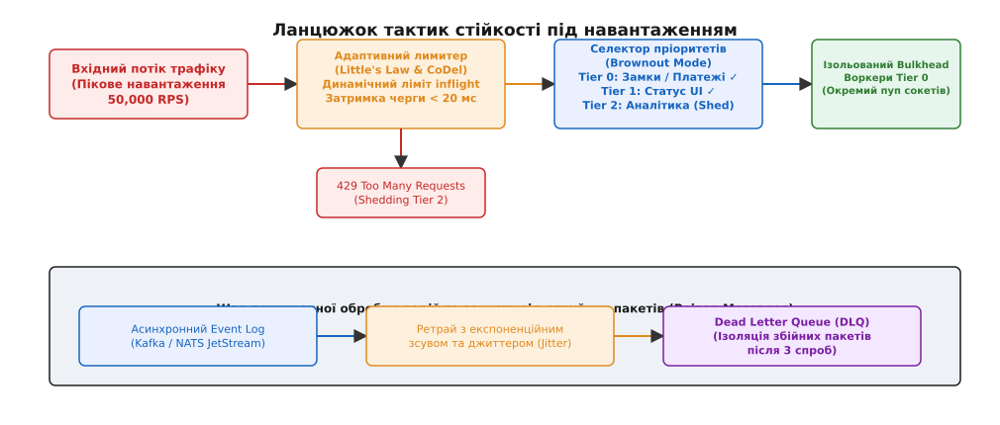
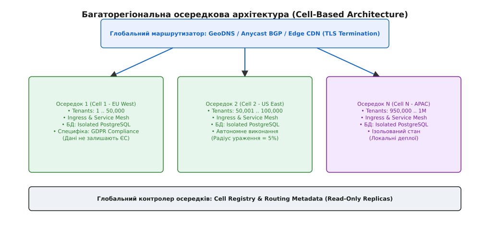
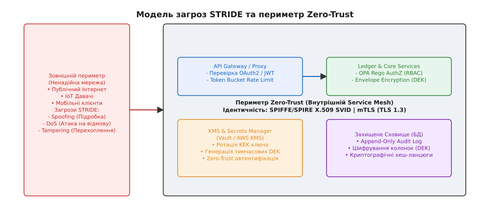
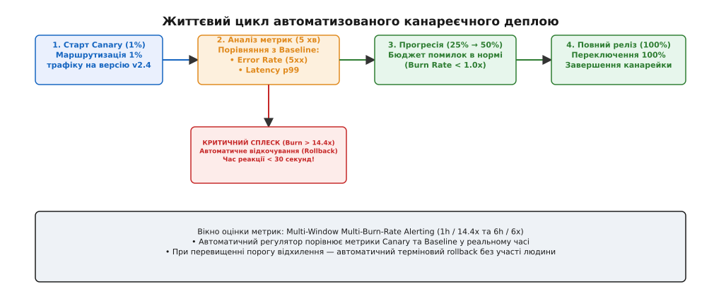

# Капстон, крок 4: стійкість під тиском, глобальний масштаб, безпека та канареєчні деплої

<preknowlist>
- [Тактики стійкості під навантаженням](root:progarch/resilience-tactics/load-shedding-adaptive) — скидання навантаження, адаптивне обмеження паралелізму та метастабільні відмови.
- [Багаторегіональні топології](root:progarch/scale-and-load/multi-region-topologies) — Active-Active, Active-Passive та шардинг на основі осередків (Cell-Based Architecture).
- [Моделювання загроз](root:progarch/security-architecture/threat-modeling-stride) — методологія STRIDE та побудова меж довіри.
- [SLO та бюджети помилок](root:progarch/observability-and-operations/slo-and-error-budgets) — визначення метрик SLI/SLO та розрахунок швидкості вигорання (Burn Rate).
- [Стратегії деплою](root:progarch/observability-and-operations/deploy-canary-blue-green) — синьо-зелене та канареєчне розгортання з автоматичним відкочуванням.
</preknowlist>

У перших трьох кроках капстон-проєкту було зведено фундаментальний каркас розподіленої платформи: визначено бізнес-драйвери та зважене дерево корисності, сформовано шари C4-моделі, розподілено дані між строго консистентними реляційними та eventual-послідовними NoSQL сховищами, а також побудовано саги й критичні вузли ідентичності, авторизації та фінансового реєстру. Проте статично працююча схема на папері чи у тестовому середовищі не є гарантією живучості під час реальної експлуатації в продакшні. Коли на систему обрушується піковий трафік у 50,000 запитів на секунду, один із трьох географічних дата-центрів повністю виходить з ладу через обрив оптичного магістрального кабелю, підрядник інфраструктури отримує масовану DDoS-атаку, а розробники розгортають новий бінарний файл із неявним витоком пам'яті — класичний проєкт розвалюється протягом кількох хвилин.

Четвертий крок капстону переводить систему з категорії «працююча на папері» в категорію «стійка до катастроф у промисловому продакшні». У цьому розборі зчіплюються чотири невід'ємні лінії захисту: тактики стійкості під метастабільним тиском, осередкова багаторегіональна топологія із суворим дотриманням регуляторних меж (GDPR), модель загроз STRIDE у периметрі Zero-Trust та автоматизований канареєчний деплой на основі математики вигорання бюджету помилок.

## 1. Контекст навантаження та вихідні вимоги IV фази

Розглянемо глобальну платформу розумних екосистем та платіжних сервісів, яка вийшла на масштаб у **1,000,000 активних пристроїв та користувачів** у трьох географічних регіонах: Європа (EU-West, Франкфурт/Ірландія), Північна Америка (US-East, Вірджинія) та Азійсько-Тихоокеанський регіон (APAC-South, Сінгапур). Система повинна забезпечувати цільовий рівень доступності SLO **99.99%** (максимально припустимий сумарний простій — не більше ніж 4.32 хвилини на місяць) для бізнес-критичних транзакцій (управління замками контролю доступу, проведення платежів) та латентність `p99 < 250 мс`.

Трафік платформи є сильно неоднорідним за своєю цінністю, вимогами до консистентності та обсягом:

```text
               +------------------------------------------------------+
               |    Загальний потік трафіку (Пік: 50,000 RPS)         |
               +------------------------------------------------------+
                                          |
        +---------------------------------+---------------------------------+
        |                                 |                                 |
        v                                 v                                 v
+------------------+             +------------------+             +------------------+
|  Tier 0 (1,000)  |             | Tier 1 (14,000)  |             | Tier 2 (35,000)  |
|  Критичний стан: |             | Інтерактивний UI:|             | Телеметрія та    |
|  Замки, Платежі  |             | Запити стану,    |             | аналітика давачів|
|  (SLO 99.99%)    |             | Повідомлення     |             | (Eventual Data)  |
+------------------+             +------------------+             +------------------+
```

При виникненні аномального сплеску навантаження або відмові частини сервісів спроба обслуговувати всі 50,000 RPS однаково призведе до швидкої деградації: черги запитів у пам'яті вичерпають оперативну пам'ять та сокети, викликаючи падіння процесів. Після перезапуску контейнерів на них негайно шквалить накопичений затор запитів та повторні спроби клієнтів (Thundering Herd Problem). Виникає метастабільна відмова (Metastable Failure), коли система потрапляє у самопідтримувану петлю збоку і не може повернутися до нормального стану навіть після припинення зовнішнього сплеску.

Щоб запобігти цьому, першим рубежем захисту стає ланцюжок динамічних тактик стійкості.

## 2. Динамічні тактики стійкості під метастабільним тиском

Головна помилка при проєктуванні високонавантажених систем — використання статичних лімітів потоків та фіксованих розмірів черг на вхідних HTTP/gRPC серверах. Згідно з законом Літтла (`L = λ · W`, де `L` — середня кількість запитів у системі, `λ` — інтенсивність вхідного потоку, `W` — середня тривалість обробки одного запиту), при зростанні затримки `W` у базі даних накопичення запитів у черзі `L` зростає лінійно, викликаючи вичерпання RAM та падіння процесу.


*Ланцюжок тактик стійкості: вхідне навантаження фільтрується адаптивним контролером паралелізму, переповнення відсікається селектором пріоритетів у режимі Brownout, а критичні операції виділяються в ізольовані пули Bulkhead.*

### Адаптивне обмеження паралелізму (Adaptive Concurrency Limiting)

Замість статичного ліміту `max_threads = 200` вхідні шлюзи API утворюють адаптивний контролер на основі алгоритму CoDel (Controlled Delay) або TCP Vegas. Шлюз постійно вимірює мінімальну затримку системи без навантаження `RTT_min` та поточну затримку `RTT_current`. Динамічний ліміт паралелізму `Limit_inflight` оновлюється на кожному вимірювальному інтервалі:

```text
Limit_new = Limit_old · (RTT_min / RTT_current) + alpha

Приклад: якщо RTT_current зростає в 4 рази через сповільнення БД:
Limit_new = Limit_old · 0.25 + alpha
```

Якщо кількість активних запитів перевищує `Limit_inflight`, шлюз не ставить нові запити в чергу пам'яті, а **миттєво відхиляє їх з кодом `HTTP 429 Too Many Requests`**. Це зрізає хвіст затримки, захищає пули сокетів та запобігає накопиченню затору.

### Режим планованої деградації (Brownout Mode)

При досягненні критичного навантаження CPU (> 85%) або вичерпанні ліміту паралелізму система автоматично переходить у режим планованої деградації **Brownout**:

1. **Tier 2 (Аналітика та фонова телеметрія):** Повністю відсікається на вхідному Nginx/Envoy шлюзі (`HTTP 429` або silent drop). Обробка телеметрії давачів призупиняється.
2. **Tier 1 (Запити стану UI):** Перемикається зі строгого читання з основної БД на читання з кешу Redis із допустимим лагом (Stale Read до 60 секунд).
3. **Tier 0 (Замки та платежі):** Отримує 100% обчислювальних ресурсів та ізольований пул з'єднань із базою даних.

### Ізоляція перебійок (Bulkhead) та отруйні пакети (Poison Messages)

Для запобігання ситуації, коли один збійний мікросервіс вичерпує всі ресурси загального кластера, застосовується патерн **Bulkhead**. Потоки обробки критичних транзакцій повністю відокремлені від потоків обробки вебхуків та сповіщень на рівні пулів сокетів, пулів пам'яті та Pod-політик Kubernetes.

При обробці черг асинхронних подій (Kafka / NATS) виникає ризик появі «отруйного пакета» (Poison Message) — повідомлення із пошкодженою формою, яке викликає паніку воркера (`Panic / CrashLoop`). Без спеціального обходу воркер читає пакет, падає, перезапускається, читає той самий пакет знову й зупиняє всю чергу. Захист вибудовується за ланцюжком:

```text
[Вхідне повідомлення] → [Спроба 1] --(Помилка)--> [Експоненційний зсув + Jitter]
                                                       |
[Dead Letter Queue (DLQ)] <-- (Помилка після 3 спроб) -+
```

Після 3 невдалих спроб обробки з експоненційною затримкою та додаванням випадкового джиттеру (Jitter) повідомлення вилучається з основної черги та відправляється в **Dead Letter Queue (DLQ)** для ізольованого аналізу, а основний потік споживачів продовжує роботу без зупинки.

> 🔧 **Навіщо це.** Без комбінації адаптивного обмеження паралелізму, режимів Brownout та DLQ високонавантажена система під час будь-якого аномального сплеску трафіку впадає у метастабільний колапс, з якого її неможливо вивести навіть додаванням нових серверів.

## 3. Глобальний масштаб, осередкова архітектура та регуляторні межі

Обслуговування мільйона пристроїв у трьох континентальних регіонах вимагає вирішення двох протилежних задач: **масштабованості** (мінімізація мережевого RTT) та **надійності** (обмеження радіуса ураження відмов).

Традиційна топологія з єдиною глобальною базою даних або єдиним глобальним кластером створює точку монолітної відмови: падіння одного регіону або помилка в схемі даних виводить з ладу 100% користувачів по всьому світу.


*Осередкова архітектура системи: кожен осередок (Cell) містить повністю автономний стек виконання та ізольовану базу даних. Радіус ураження будь-якої аварії обмежений розміром одного осередку (5% користувачів).*

### Осередкова архітектура (Cell-Based Architecture)

Для досягнення абсолютної ізоляції відмов платформа розподіляється на автономні **осередки (Cells)**:

1. **Розмір осередку:** Один осередок розрахований на обслуговування фіксованої кількості орендарів/користувачів (наприклад, **50,000 активних пристроїв на осередок**). Для мільйона користувачів система розгортає 20 автономних осередків.
2. **Автономність осередку:** Кожен осередок містить власний API Gateway, мікросервіси, контролери та **окремий екземпляр бази даних** (PostgreSQL + Redis). Осередок не має синхронних мережевих залежностей від інших осередків.
3. **Глобальний маршрутизатор (Global Cell Router):** На краї мережі (Edge) Anycast DNS та Nginx/Envoy шлюзи аналізують ID користувача або пристрою та спрямовують запит строго у відповідний осередок:

```text
User ID: 104522 → Partition Key: 104522 % 20 = 2 → Route to Cell 2 (US-East)
```

4. **Обмеження радіуса ураження (Blast Radius):** Якщо в осередку Cell 2 відбудеться повне пошкодження бази даних або неконтрольована помилка пам'яті, **95% користувачів у решті 19 осередків не відчують жодного збою**.

### Дотримання регуляторних меж (GDPR & Data Residency)

Розподіл на осередки вирішує критичну регуляторну вимогу Європейського Союзу (GDPR) щодо локалізації персональних даних. 

Осередки, розташовані у регіоні `EU-West`, зберігають персональні дані (PII, адреси, фінансові транзакції) строго на фізичних серверах у межах Франкфурта та Ірландії. Міжрегіональна реплікація між ЄС та США **повністю виключає транскордонну передачу PII-даних**. Між регіонами синхронізуються лише анонімізовані глобальні ідентифікатори маршрутизації та агреговані технічні метрики.

При аварії дата-центру в США (US-East) глобальний DNS перенаправляє американський трафік на запасний осередок у ЄС, але система примусово вмикає режим **Read-Only** для запобігання конфліктам запису та порушенню регуляторних меж.

## 4. Модель загроз STRIDE та Zero-Trust периметр безпеки

Розподілена система з мільйоном IoT-пристроїв та публічними API-шлюзами є привабливою ціллю для зловмисників. Безпека в IV фазі проєктування описується не як «додавання фаєрволу», а як сувора **модель загроз STRIDE** та архітектура **Zero-Trust**.


*Модель загроз та периметр Zero-Trust: зовнішній ненадійний трафік проходити крізь mTLS-термінацію; внутрішні сервіси взаємодіють через короткоживучі X.509 SVID сертифікати, а стан шифрується тимчасовими ключами DEK.*

### Матриця аналізу загроз STRIDE для капстон-системи

| Категорія загрози (STRIDE) | Вектор атаки на платформу | Архітектурна мітигація в системі |
|---|---|---|
| **Spoofing** (Підробка ідентичності) | Атакуючий підробляє ID контролера замка та надсилає команду відчинення. | Перевірка **SPIFFE/SPIRE** ідентичності. Пристрої та сервіси автентифікуються через взаємний TLS (mTLS) з короткими X.509 SVID сертифікатами. |
| **Tampering** (Фабрикація даних) | Перехоплення та модифікація команд усередині мережі між сервісами. | Примусове привабливе шифрування трафіку **mTLS (TLS 1.3, AES-256-GCM)** на рівні Service Mesh (Istio / Linkerd) без винятків. |
| **Repudiation** (Заперечення дій) | Користувач стверджує, що не робив переказу коштів чи відчинення дверей. | Запис усіх критичних мутацій в **Append-Only Audit Log** із криптографічним хешуванням ланцюгів записів (Merkle Tree / HMAC). |
| **Information Disclosure** (Витік даних) | Викрадення дампу бази даних або вихідного трафіку з диска. | **Конвертне шифрування (Envelope Encryption)**. Дані на диску шифруються локальним Data Encryption Key (DEK), а DEK шифрується майстер-ключем KEK у KMS. |
| **Denial of Service** (DoS / DDoS) | Заплавлення шлюзу мільйоном некоректних HTTP/gRPC запитів. | eBPF/XDP фільтрація аномальних пакетів на рівні ядра Linux + Token Bucket Rate Limiter на API Gateway. |
| **Elevation of Privilege** (Неземне підвищення прав) | Компрометація сервісу телеметрії для виконання команд у фінансовому реєстрі. | Суворі політики авторизації на основі атрибутів **ABAC / RBAC** через Open Policy Agent (OPA Rego) на межі кожного сервісу. |

### Конвертне шифрування даних (Envelope Encryption)

Шифрувати всю базу даних одним статичним ключем — це ризик: компрометація ключа вимагає перешифрування терабайтів даних. У капстон-системі застосовується **двохрівнева схема конвертного шифрування**:

```text
[ Master Key (KEK) у KMS / Vault ]
               |
               v (Шифрує / Розшифровує)
[ Data Encryption Key (DEK) ] → (Шифрує конкретний запис / колонку PII у БД)
```

1. Сервіс запитує у KMS (HashiCorp Vault / AWS KMS) тимчасовий ключ **DEK (Data Encryption Key)**.
2. Сервіс шифрує PII-дані локально в пам'яті за допомогою DEK (алгоритм `AES-256-GCM`).
3. Зашифрований DEK зберігається поруч із зашифрованим блобом у базі даних.
4. Головний ключ **KEK (Key Encryption Key)** ніколи не залишає захищений контур KMS і ротується кожні 90 днів.

### Деталізація авторизації через Open Policy Agent (OPA)

Припустимо, мікросервіс обробки вебхуків намагається викликати метод списання коштів у фінансовому реєстрі. Замість зашивання правил у код сервісу, на межі кожного Pod-а Envoy проксі надсилає JSON-запит авторизації у локальний боковий контейнер (Sidecar) Open Policy Agent (OPA).

OPA оцінює вхідні атрибути запиту за допомогою підписаного Rego-скрипта:

```rego
package authz

default allow = false

# Дозволити списання лише якщо запит від фінансового сервісу та має підпис mTLS
allow {
    input.service_spiffe == "spiffe://capstone.internal/ns/prod/sa/payment-service"
    input.method == "POST"
    input.path == ["v1", "ledger", "transact"]
    input.user_roles[_] == "finance_operator"
}
```

Якщо Rego-політика повертає `allow = false`, Envoy перехоплює запит і відмовляє у виконанні з кодом `HTTP 403 Forbidden` ще до того, як бізнес-код реєстру дізнається про спробу виклику.

## 5. Спостережуваність, канареєчний розгорт та Disaster Recovery

Навіть найзахищеніша та найстійкіша архітектура розвалиться, якщо команда не має реального бачення стану системи під час розгортання оновлень.

### Спостережуваність та швидкість вигорання бюджету помилок (Burn Rate)

Для платформи визначено суворі показники SLO: 99.99% успішних запитів за 30-денне вікно. Бюджет помилок становить `E_slo = 0.0001` (0.01%).

Замість застарілих сповіщень при перевищенні фіксованого відсотка помилок система застосовує **двовіконне оцінювання швидкості вигорання (Multi-Window Multi-Burn-Rate Alerting)**. 

Детальний математичний розрахунок вигорання бюджету та формули виведення коефіцієнтів `B = 14.4` винесено у вставку [🧮 Математика швидкості вигорання бюджету помилок (Burn Rate)](root:progarch/legacy-and-evolution/capstone-scale-secure-ops/math-error-budget-burn.md).

```text
Швидкість вигорання (Burn Rate):
B = 1.0  → Вигорання 100% бюджету за 30 днів (Норма)
B = 14.4 → Вигорання 2% budget за 1 годину (КРИТИЧНА ТРИВОГА!)
```

### Автоматизований канареєчний деплой (Canary Progressive Delivery)

Розгортання нових версій сервісів «усі разом» (Big-Bang Deployment) є головним джерелом масштабних аварій у промислових системах. Історичний кейс такої катастрофи розібрано у вставці [📜 Кейс Knight Capital: катастрофа деплою та ціна автоматичного відкочування](root:progarch/legacy-and-evolution/capstone-scale-secure-ops/hist-knight-capital-ops.md).

Щоб повністю виключити людський фактор, у капстон-системі розгортання виконується автоматизованим контролером канареєчного деплою.


*Життєвий цикл канареєчного розгортання: контролер спрямовує 1% трафіку на нову версію, здійснює порівняльний аналіз метрик з Baseline та автоматично відкочує реліз при сплеску Burn Rate > 14.4x.*

Процес розгортання проходить чотири етапи:

1. **Фаза 1 (Canary 1%):** 1% вхідних запитів спрямовується на канареєчну групу контейнерів (Canary Pods). Решта 99% трафіку йде на контрольну групу (Baseline Pods).
2. **Фаза 2 (Автоматичний аналіз метрик):** Канареєчний контролер протягом 5 хвилин порівнює метрики SLI між Canary та Baseline:
   - **Error Rate Burn Rate:** Якщо `B(5m) ≥ 14.4`, контролер негайно ініціює `ROLLBACK`.
   - **Latency `p99`:** Якщо затримка канарейки перевищує baseline більше ніж на 25%, ініціюється `ROLLBACK`.
3. **Фаза 3 (Прогресія 25% → 50%):** Якщо метрики в нормі, частка трафіку нарощується ступенями з вікном спостереження 10 хвилин на кожному етапі.
4. **Фаза 4 (Повна ротація 100%):** Оновлений бінарний файл заміщує старий на всіх Pod-ах.

Практичну реалізацію аналітичного ядра канареєчного контролера трьома мовами (C++, C, Go) наведено у вставці [⚙️ Автоматизований канареєчний контролер та аналізатор SLI](root:progarch/legacy-and-evolution/capstone-scale-secure-ops/proj-capstone-canary-controller.md).

### Відновлення після катастроф (Disaster Recovery: RPO / RTO)

Для капстон-системи встановлено суворі операційні цілі відновлення:
- **RPO (Recovery Point Objective) = 5 секунд:** Максимально припустима втрата даних при повному фізичному знищенні дата-центру не може перевищувати 5 секунд (завдяки асинхронній потоковій реплікації WAL-логів та Kafka MirrorMaker 2).
- **RTO (Recovery Time Objective) = 2 хвилини:** Час від моменту аварії дата-центру до повного переключення трафіку на резервні осередки іншого регіону не перевищує 120 секунд.

Надійність планів DR перевіряється не на папері, а регулярним ін'єктуванням штучних аварій за допомогою інструментів **Chaos Engineering** (Chaos Mesh / LitmusChaos), які щотижня у робочий час випадково вимикають вузли, імітують мережеве розщеплення (Split-Brain) та вносять затримку у 500 мс між регіонами.

## 6. Синтез: підсумкова матриця компромісів та результати Капстону

На IV кроці проєктування ми завершуємо побудову цілісного архітектурного репертуару. Кожне прийняте рішення в області стійкості, масштабу, безпеки та експлуатації є свідомим компромісом (Trade-off).

### Зведена матриця компромісів IV кроку Капстону

```text
+-------------------------------------------------------------------------------------------------------------+
| Архітектурний вибір      | Що виграємо (Attributes)           | Чим платимо (Cost & Complexity)             |
+-------------------------------------------------------------------------------------------------------------+
| Адаптивне обмеження      | Запобігання метастабільним аваріям,| Dropped requests (429) для клієнтів         |
| паралелізму (CoDel)      | захист від вичерпання пам'яті      | під час піків; складність налаштування      |
+-------------------------------------------------------------------------------------------------------------+
| Осередкова архітектура   | Радіус ураження = 5% користувачів; | Збільшення інфраструктурних витрат (x1.4);  |
| (Cell-Based, 20 cells)   | суворий GDPR Compliance            | складність глобальної маршрутизації         |
+-------------------------------------------------------------------------------------------------------------+
| Zero-Trust & Envelope    | Захист від витоків PII та         | Накладні витрати CPU на mTLS/AES-256 (3-5%);|
| Encryption (KMS)         | компрометації внутрішньої мережі   | складність автоматичної ротації сертифікатів|
+-------------------------------------------------------------------------------------------------------------+
| Автоматизований канарейка| 100% захист від людських помилок   | Сповільнення швидкості деплою (час релізу   |
| (Burn Rate Controller)   | та катастроф рівня Knight Capital  | збільшується з 2 хвилин до 35 хвилин)       |
+-------------------------------------------------------------------------------------------------------------+
```

### Фінальна перевірка проти дерева корисності (Utility Tree)

Повертаючись до початкових дедлайнів та сценаріїв атрибутів якості з I кроку капстону, ми бачимо повне замикання архітектурного ланцюга:

1. **Сценарій «Надійність замка `p99 < 250 мс`»:** Досягнуто за рахунок виділення Tier 0 трафіку в ізольовані пули Bulkhead та осередкової локалізації баз даних.
2. **Сценарій «Доступність SLO 99.99% під час відмови регіону»:** Досягнуто за рахунок ізоляції радіуса ураження в Cell-Based топології (RTO < 2 хв, RPO < 5 сек).
3. **Сценарій «Безпека PII-даних та дотримання GDPR»:** Досягнуто за рахунок конвертного шифрування Envelope Encryption та локалізації осередків у межах регуляторних кордонів ЄС.
4. **Сценарій «Захист від руйнівних деплоїв»:** Досягнуто за рахунок двовіконного автоматизованого канареєчного контролера з вигоранням бюджету помилок.

Система пройшла повну еволюцію: від найпростішого скрипта на одноплатнику (Digital Homes v0) до глобальної, стійкої до катастроф багаторегіональної платформи. Архітектура доведена як потік свідомих, обґрунтованих та вимірюваних рішень.
