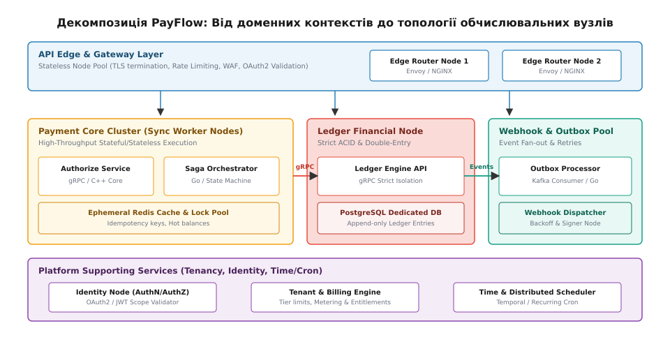
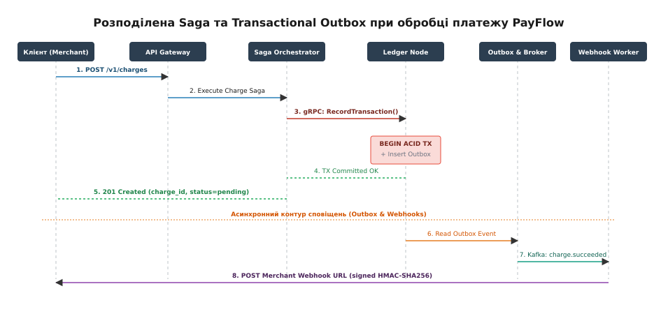
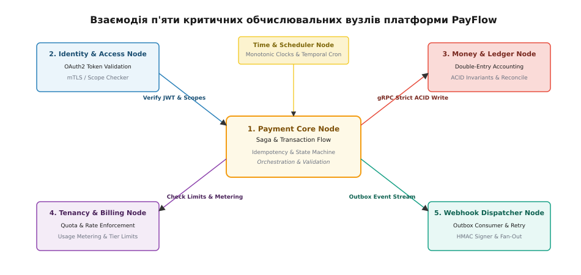

# Капстон, крок 3: сервісні межі, обчислювальні платформи та топологія вузлів

<preknowlist>
- [Модульний моноліт проти мікросервісів](root:sf-apps/modular-monolith) — критерії виділення сервісних меж та ціна мережевого розриву.
- [Паттерн Saga та Outbox](root:sf-apps/cqrs) — забезпечення розподіленої консистентності через події та локальні транзакції.
- Критичні вузли: Identity, Ledger та Webhooks — розмежування надійності та безпеки спеціалізованих сервісів.
- [Контракти API та версіонування](root:com-protocol/api-versioning) — жорсткі схеми взаємодії та безпечне розширення інтерфейсів.
- [Капстон, крок 1](root:progarch/capstone-setup) — постановка вимог, дерево корисності та атрибути наскрізного проєкту.
- [Капстон, крок 2](root:progarch/capstone-shape-data) — форма застосунку, архітектурні в'ю та стратегія консистентності даних.
</preknowlist>

Платформа еквайрингу PayFlow обробляє 4 500 транзакцій на секунду у пікові години, обслуговуючи 1 000 000 активних торговців у трьох географічних регіонах (EU-central-1, US-east-1, AP-southeast-1). На кроці 2 було закладено базову модульно-монолітну форму ядра та схем даних. Однак при зростанні навантаження до 10 000 RPS транзакції списання коштів починають конкурувати за процесорний час та пул з'єднань із базою даних із довготривалими операціями генерації звітів, розрахунком комісій та відправкою сотень тисяч асинхронних сповіщень. Мережевий розрив моноліту стає неминучим, але проведення сервісних меж навмання створює найгірший тип систем — розподілений моноліт з каскадними відмовами.

Сервісна межа — це не просто розподіл коду по окремих репозиторіях, а межа автономності володіння даними та темпом їхніх змін. Кожна представлена сервісна межа збільшує латентність на вартість мережевого стрибка (network hop, 0.5–2 мс у межах одного дата-центру) та вимагає відмови від ACID-транзакцій бази даних на користь подібної до ACID консистентності в кінцевому підсумку (eventual consistency — від латинського *consistentia* — стійкість, щільність). Розберемо декомпозицію PayFlow на незалежні сервіси, вибір обчислювальних платформ, узгодження API-контрактів та проєктування п'яти критичних вузлів.

---

## 1. Анатомія декомпозиції: клей чи мережевий розрив

Для прийняття обґрунтованого рішення про виділення сервісу застосовуємо чотири суворі критерії: незалежна швидкість масштабування (different scaling vectors), ізоляція точок відмови (failure domain isolation), автономність команд (Conway's Law alignment) та специфічні вимоги до обчислювальних ресурсів (compute profile).

У платформі PayFlow виділяються три принципово різні типи навантаження:
1. **Синхронний критичний контур (Critical Path):** Авторизація та списання коштів. Вимагає латентності p99 < 200 мс, максимальної доступності (99.999%) та нульової втрати даних.
2. **Строгий фінансовий контур (Strict Accounting):** Бухгалтерський подвійний запис (double-entry ledger). Вимагає суворих ACID-гарантій, серіалізованих транзакцій та ізоляції від доменів, що швидко змінюються.
3. **Асинхронний контур виходу назовні (Async Outbound):** Доставка вебхуків на сервери торговців. Звертається до зовнішніх неохоплюваних систем із латентністю відповіді від 50 мс до 10 секунд і вимагає постійних повторних спроб (retries).

Якщо розмістити синхронні платежі та асинхронні вебхуки в одному процесі чи з'єднати їх спільною базою даних, уповільнення бэкенду одного з торговців призведе до вичерпання пулу потоків веб-сервера і зупинки обробки транзакцій усіх інших торговців платформи.

При проведенні сервісної межі архітектор зважує вартість мережевого розриву. Мережевий розрив вносить чотири нові категорії складності:
* **Мережева латентність:** Кожен RPC-виклик додає щонайменше 0.5–1.5 мс серіалізації Protobuf та мережевого RTT.
* **Часткові відмови (Partial Failures):** Мережа може розірватися після того, як запит дійшов до отримувача, але до повернення підтвердження.
* **Втрата атомарності:** Єдина транзакція `BEGIN TRANSACTION ... COMMIT` розпадається на незалежні локальні транзакції.
* **Дублювання подій:** Через відсутність гарантії Exactly-Once у мережі будь-яка подія може бути доставлена двічі.

При проведенні аналізу мережевого розриву ми оцінюємо математичний баланс між затримкою мережі та блокуваннями бази даних. У модульному моноліті міжмодульний виклик залишається викликом функції у пам'яті (затримка менше 10 наносекунд). При виділенні мікросервісу виклик перетворюється на gRPC-запит через сокет:

```
T_total = T_marshal + T_network_RTT + T_service_exec + T_unmarshal
```

Де серіалізація Protobuf забирає біля 50 мікросекунд, а мережевий RTT у межах однієї зони доступності (AZ) додає від 0.3 до 0.8 мілісекунди. Однак для фінансового обліку ця затримка виправдана, оскільки альтернативою є блокування рядків у спільній БД PostgreSQL, яке при навантаженні 10 000 RPS створює черги очікування на замках (lock wait timeout) тривалістю понад 500 мілісекунд.

Аналіз декомпозиції PayFlow базується на порівнянні векторів навантаження та ризиків між доменами. У моноліті кроку 2 таблиця `charges` та таблиця `ledger_entries` жила у єдиній базі даних PostgreSQL. Під час чергового розпродажу (Black Friday) навантаження на записи подвійного запису досягло 12 000 дискретних транзакцій на секунду. Пул з'єднань PostgreSQL (PgBouncer) вичерпався, а транзакції зчитування для звітності торговців почали блокувати рядки балансів, що призвело до відмови авторизації платежів у 18% користувачів.

Це підтверджує: домен фінансового обліку (`Ledger Node`) та домен асинхронних сповіщень (`Webhook Node`) мають несумісні профілі обчислень та відмінні точки відмови. Вони не можуть залишатися в одному процесі.

Таблиця нижче підсумовує аналіз виділення сервісних меж PayFlow за чотирма критеріями:

| Доменний контекст | Вектор масштабування | Точка відмови | Специфіка обчислень | Рішення щодо межі |
| :--- | :--- | :--- | :--- | :--- |
| **Payment Authorization** | Сплески запитів (RPS) | Блокування еквайрів | High CPU, In-memory locks | **Payment Core Node** (Sync Cluster) |
| **Financial Ledger** | Транзакційні записи | Блокування та ACID | High I/O, Synchronous Disk | **Ledger Financial Node** (Isolated) |
| **Webhook Delivery** | Кількість подій (Fan-out) | Таймаути зовнішніх API | High Network I/O, Async Workers | **Webhook Worker Pool** (Isolated) |
| **Merchant Auth & Identity** | Read-heavy (Cacheable) | Невалідні токени | Low Latency, In-Memory DB | **Identity Service Node** (Shared Core) |
| **Tenant Billing & Limits** | Періодичні квоти | Перевищення лімітів | CPU bound, Aggregations | **Billing & Tenancy Node** (Isolated) |

З аналізу випливає головне архітектурне правило: **фінансове ядро та доставка сповіщень виділяються у фізично ізольовані обчислювальні вузли**, тоді як авторизація та перевірка обмежень консолідуються у stateless-шарі API Gateway.

---

## 2. Фізична топологія вузлів та обчислювальні платформи

Сервісна межа в коді закріплюється топологією обчислювальних вузлів (node topology — від грецьких *topos* — місце, *logos* — вчення). Топологія описує, як саме процеси розподіляються по фізичних або віртуальних машинах, кластерах та мережевих сегментах.

При виборі топології ми відштовхуємося від трьох фундаментальних форм розгортання:

### 1. API Edge & Gateway Layer (Stateless Router Pool)
Пул безстанних вузлів на базі Envoy Proxy, розгорнутий у Kubernetes (EKS) у 3 зонах доступності (Availability Zones). Вузли виконують TLS-термінацію, перевірку OAuth2 JWT-токенів у локальному кеші, первинний Rate Limiting за алгоритмом Token Bucket та маршрутизацію трафіку. Оскільки вузли не мають стану, їх масштабування відбувається миттєво за метрикою CPU/Network Throughput.

Принципи роботи Edge Gateway Layer:
* **Нульовий стан на вузлі:** Жоден вузол роутера не зберігає сесійний стан у пам'яті. Усі JWT-токени є самодостатніми (cryptographically signed).
* **Кешування ключів валідації:** Публічні ключі для перевірки підпису токенів (JWKS) кешуються у пам'яті процесів зі скиданням кожні 60 хвилин.
* **Швидкий відклик (Short Circuit):** Невалідні або прострочені запити відсікаються безпосередньо на NGINX/Envoy, не витрачаючи жодного CPU-циклу внутрішніх сервісів.
* **Протокольний трафік:** Збереження підтримання підключень HTTP/2 та gRPC multiplexing для зведення до мінімуму накладних витрат на TCP handshake.

### 2. Payment Core & Saga Orchestrator Pool (Sync Compute Nodes)
Сервіс обробки транзакцій написаний мовами Go та C++ для забезпечення стабільного перцентиля латентності p99 < 150 мс без паузи збирача сміття (Garbage Collector spikes). Вузли об'єднані у кластер під управлінням Kubernetes із виділеним інстансом Redis Cluster для блокувань ідемпотентності (distributed locks). Вузли спілкуються з іншими внутрішніми сервісами виключно через високопродуктивний gRPC (HTTP/2).

Обчислювальний профіль Payment Core:
* **High Memory Bandwidth:** Інтенсивна робота з оперативною пам'яттю для валідації правил та парсингу Protobuf.
* **Ephemeral Lock Management:** Короткоживучі розподілені замки на базі Redis Redlock із TTL 30 секунд для уникнення race conditions при одночасних запитах з однаковим `Idempotency-Key`.
* **Zero GC Overhead:** Використання пулів об'єктів (`sync.Pool` у Go або пам'яті арени у C++) для запобігання алокаціям у heap під час високого навантаження.

### 3. Isolated Ledger Financial Cluster (Dedicated DB Nodes)
Вузли фінансового обліку розміщуються на виділених інстансах AWS EC2 (Bare-Metal / Nitro) з локальними NVMe SSD дисками у конфігурації RAID-10. Використання контейнерного середовища тут свідомо відкинуто: базу даних PostgreSQL зафіксовано на конкретному залізі для виключення ефекту «галасливого сусіда» (noisy neighbor) та гарантії мінімального часу скидання WAL-журналу на диск (fsync latency < 1 мс).

Вимоги до ізоляції Ledger Node:
* **Мережева ізоляція (VPC Peering + Security Groups):** Доступ до порту 5432 PostgreSQL відкритий ВИКЛЮЧНО з IP-адрес вузлів `Ledger Engine API`. Прямий доступ розробників або інших сервісів перекрито на рівні фаєрволу.
* **Синхронна реплікація (Synchronous Replication):** Фіксація транзакції повертає OK клієнту лише після того, як WAL-запис збережено на дисках щонайменше двох реплік у різних зонах доступності.
* **Резервне копіювання без просідання I/O:** Використання EBS-знімків із підтримкою WAL-G для безперервної потокової доставки WAL-файлів у S3 без блокування таблиць.


*Мережеві межі та пули обчислювальних вузлів платформи PayFlow.*

Порівняння трьох обчислювальних платформ для вузлів PayFlow подано у таблиці:

| Параметр порівняння | Kubernetes EKS (Edge & Gateway) | Bare-Metal EC2 Nitro (Ledger DB) | Serverless / Workers (Outbox) |
| :--- | :--- | :--- | :--- |
| **Час автомасштабування** | 10–30 секунд (HPA) | Ручне / Фіксований флот | 1–3 секунди |
| **Максимальна I/O латентність** | 2–5 мс (EBS GP3) | < 0.5 мс (NVMe RAID-10) | 5–15 мс |
| **Ізоляція ресурсів** | Cgroups / Namespaces | Фізична CPU/RAM ізоляція | Ізоляція на рівні VM/Process |
| **Операційна складність** | Середня (K8s manifests) | Низька (IaC Terraform) | Мінімальна |

Для детального ознайомлення з Protobuf-схемами та структурою gRPC-сервісів дивіться [Специфікація API-контрактів та схем подій PayFlow](root:progarch/capstone-services-nodes/api-service-contracts.md) — розгорнутий довідник контрактів взаємодії сервісів.

---

## 3. Інтеграційні патерни, API-контракти та саги

Коли єдина ACID-транзакція моноліту розривається мережею, забезпечення узгодженості даних між `Payment Core` та `Ledger Node` стає головним архітектурним викликом. Застосування важких протоколів двофазного коміту (2PC / XA Transactions) заборонено: 2PC заблокує ресурси у разі падіння будь-якого вузла і збільшить латентність у 3–5 разів.

Замість 2PC PayFlow використовує **Saga Pattern з оркестрацією (від латинського *orchestra* — танцювальний майданчик перед сценою) та паттерн Transactional Outbox**.

### Порівняння підходів інтеграції:
1. **Оркестрація (Orchestration):** Центральний сервіс (`Saga Orchestrator`) явно керує кроками, викликає gRPC-методи інших сервісів та обробляє відхилення.
2. **Хореографія (Choreography):** Сервіси реагують на події в Kafka без центрального координатора.

Для платформи еквайрингу PayFlow обрано **оркестрацію для синхронного фінансового контуру** (оскільки стан платежу повинен бути чітко детермінованим) та **хореографію для асинхронного контуру вебхуків**.

### Механіка виконання Saga під час обробки платежу:
1. **Ініціалізація:** Клієнт надсилає `POST /v1/charges` з заголовком `Idempotency-Key: order_10024`. API Gateway перевіряє ключ у Redis і передає запит у `Payment Core`.
2. **Локальна транзакція саги:** `Payment Core` створює запис у власній БД зі статусом `PENDING`.
3. **Синхронний крок (gRPC):** `Payment Core` викликає `LedgerService.RecordTransaction()` через gRPC. `Ledger Node` виконує подвійний запис у власній базі даних і повертає `STATUS_COMMITTED`.
4. **Атомарний Outbox:** `Payment Core` відкриває локальну ACID-транзакцію у своїй БД, оновлює стан платежу на `SUCCEEDED` і одночасно вставляє запис у таблицю `outbox_events`.
5. **Асинхронний релей:** Окремий процес-релей (Outbox Processor) зчитує нові події з `outbox_events` та публікує їх у топік Kafka `charge.succeeded`.
6. **Доставка вебхука:** `Webhook Worker Pool` вичитує подію з Kafka та відправляє підписаний HTTP POST запит на сервер торговця.

```
+------------------+             +--------------------+             +------------------+
|  Merchant Client |             | Saga Orchestrator  |             |  Ledger Service  |
+------------------+             +--------------------+             +------------------+
         |                                  |                                |
         |--- POST /v1/charges ------------>|                                |
         |    (Idempotency-Key: order_1)    |--- gRPC RecordTransaction() -->|
         |                                  |<-- STATUS_COMMITTED -----------|
         |                                  |                                |
         |                                  |=== LOCAL ACID TX ==============|
         |                                  |  1. Update charge=SUCCEEDED    |
         |                                  |  2. INSERT outbox_events       |
         |                                  |================================|
         |<-- 201 Created (charge_id) ------|                                |
```

### Обробка сценаріїв відмов у ланцюгу Saga:
* **Мережевий розрив при виклику Ledger Service:** Якщо `Saga Orchestrator` не отримав ACK від `Ledger Node` за 500 мс, він переводить сагу у фазу компенсації. Оркестратор надсилає статус `STATUS_CANCELLED` до Redis для відмикання ключа ідемпотентності та повертає клієнту `504 Gateway Timeout`.
* **Повторна відправка при мережевій невизначеності:** При відновленні зв'язку клієнт повторює запит із тим самим `Idempotency-Key`. Оркестратор знаходить існуючий запис саги і повертає раніше обчислений результат без виконання повторного списання.


*Послідовність виконання Saga та генерації подій Outbox для захисту від втрати даних.*

Код реалізації даного Saga-оркестратора та атомарного запису в Outbox доступний у вставці [Реалізація Saga-оркестратора та Transactional Outbox](root:progarch/capstone-services-nodes/proj-saga-orchestrator.md) мовами Go та C++.

---

## 4. Глибокий розбір п'яти критичних вузлів платформи

Для забезпечення стійкості PayFlow до системних збоїв розберемо внутрішній устрій п'яти критичних обчислювальних вузлів (nodes).


*Взаємозв'язки та потоки даних між п'ятьма спеціалізованими вузлами платформи.*

### Вузол 1: Identity & Access Node (Автентифікація та авторизація)
Вузол ідентичності відповідає за безпечний доступ до API та розмежування ролей. 
* **Механізм довіри:** API Gateway перевіряє JWT-токени клієнтів за допомогою публічних ключів (JWKS), що кешуються в оперативній пам'яті. Внутрішні міжсервісні виклики між вузлами захищаються за допомогою **mTLS (Mutual TLS)** із автоматичною ротацією сертифікатів через SPIFFE/SPIRE.
* **Матриця прав (Scope Checker):** Кожен запит перевіряється на наявність необхідних прав (наприклад, `charges:write` для списання коштів, `reports:read` для звітів). Невалідні запити відсікаються на периферії Edge Gateway, не навантажуючи внутрішні сервіси.
* **Ротація ключів підпису:** Кожні 24 години вузол генерирує нову пару ключів RSA-4096. Старий публічний ключ залишається активним ще 48 годин для валідації токенів, випущених до ротації.

### Вузол 2: Money & Ledger Node (Фінансовий облік та інваріанти)
Вузол бухгалтерського обліку є серцем фінансової надійності платформи.
* **Принцип подвійного запису:** Будь-яка зміна балансу торговця складається щонайменше з двох записів у таблиці `ledger_entries` — дебету одного рахунку та кредиту іншого. Сума дебету повинна точно дорівнювати сумі кредиту:

```
∑ Debits - ∑ Credits = 0      [інваріант подвійного запису]
```

* **Незиблемість даних (Immutability):** Рядки в таблиці `ledger_entries` можна лише вставляти (`INSERT`). Модифікація (`UPDATE`) або видалення (`DELETE`) операцій заборонені на рівні тригерів бази даних та прав користувача PostgreSQL. Будь-яке коригування помилкового платежу здійснюється виключно сторнуючим записом (Reversal transaction).
* **Аудит сверки (Reconciliation Audit):** Щоночі о 02:00 UTC автоматичний фоновий процес звіряє суму всіх дебетів і кредитів за день із виписками банків-еквайрів. Якщо виявляється розходження хоча б у 1 цент, генериться критичний алерт у PagerDuty.

### Вузол 3: Time & Job Scheduling Node (Прикладний час та фонові джоби)
Облік часу у розподіленій системі на три регіони вимагає чіткого розмежування фізичного та астрономічного часу.
* **Монотонні годинники (Monotonic Clocks):** Для розрахунку латентності та таймаутів у коді використовуються виключно монотонні таймери (`clock_gettime(CLOCK_MONOTONIC)` у C++ або `time.Now()` у Go), які не схильні до стрибків під час синхронізації NTP.
* **Диспетчер рекурентних задач:** Щоденне списання абонентської плати та виплати торговцям (Payouts) керуються через розподілений оркестратор Temporal. Кожна джоба має чітку часову зону торговця (`timezone="Europe/Kyiv"`) та зберігається у форматі UTC у базі даних, запобігаючи помилкам під час переходу на літній/зимовий час (DST).
* **Обробка витоку часу (Clock Skew):** Якщо зміщення годинника між вузлами в різних AZ перевищує 50 мс, вузол тимчасово виключається з пулу обробки через Health Check перевірку daemon-процесу `chrony`.

### Вузол 4: Webhook & Outbox Node (Вихід назовні та доставка)
Найбільш нестабільна частина платформи, яка взаємодіє з тисячами сторонніх серверів у мережі Інтернет.
* **Підпис повідомлень (Security):** Кожен Webhook підписується заголовком `X-PayFlow-Signature`, обчисленим за алгоритмом HMAC-SHA256 від тіла запиту з використанням секретного ключа торговця. Це гарантує торговцю, що сповіщення надійшло саме від PayFlow і не було підроблено.
* **Управління чергами та Exponential Backoff:** Якщо сервер торговця повертає HTTP 5xx або не відповідає за таймаутом (5 секунд), виклик повторюється за схемою з випадковим відхиленням (Jitter) для уникнення шторму запитів (Thundering Herd). Після 10 невдалих спроб протягом 24 годин подія переміщується у Dead Letter Queue (DLQ), а торговцю надсилається електронний лист про несправність його ендпоінта.
* **Ізоляція повільних торговців (Fair Queueing):** Події кожного торговця вичитуються з Kafka у власні віртуальні черги. Повільний торговець із 100 000 накопиченими помилками не сповільнює доставку сповіщень сусіднім торговцям платформи.

### Вузол 5: Multi-Tenant & Billing Node (Багатоорендність та обмеження)
Сервіс мультиорендності забезпечує ізоляцію торговців платформи (tenants).
* **Стратегія ізоляції даних:** Для торговців базових тарифів (Standard/Professional) використовується модель із спільною базою даних та колоною `merchant_id` у кожній таблиці (Discriminator Column) з включеним Row Level Security (RLS) у PostgreSQL. Для великих корпоративних клієнтів (Enterprise Tier) надається ізольована схема бази даних або окремий інстанс БД.
* **Ліміти та метринг:** Вузол підраховує кількість транзакцій у реальному часі за допомогою Redis Sliding Window і блокує перевищення добових лімітів згідно з обраним тарифним планом.
* **Динамічний тарифікатор (Metering):** Метрики споживання (обсяг транзакцій, кількість вебхуків) накопичуються в пам'яті Redis і щогодини фіксуються в таблиці агрегатів для формування щомісячного інвойсу.

---

## 5. Практична рамка прийняття рішень (ADR для Кроку 3)

Для фіксації прийнятих рішень у загальному журналі архітектурних рішень платформи PayFlow створюються три ключові записи (ADR):

### ADR-005: Виділення ізольованого Ledger Node
* **Контекст:** Зростання транзакційного навантаження створює конкуренцію за суворі блокування бази даних між платежами та іншими доменами.
* **Рішення:** Виділити домен фінансового обліку в окремий gRPC-сервіс `Ledger Node` з власною базою даних PostgreSQL на виділених EC2 Bare-Metal інстансах.
* **Відхилені альтернативи:** Розподілений 2PC протокол (відхилено через високу латентність та загрозу зависання транзакцій при мережевих збоях); розміщення таблиці балансів у Redis (відхилено через відсутність ACID та ризик втрати даних при збоях живлення).
* **Наслідки:** Плюси — абсолютна гарантія ACID, нульовий вплив інших доменів на фінансові баланси. Мінуси — відмова від локальних транзакцій бази даних при створенні платежу, необхідність паттерна Saga.

### ADR-006: Використання Transactional Outbox для доставки Webhooks
* **Контекст:** Необхідно відправляти сповіщення торговцям без ризику втрати події та без утримання з'єднання HTTP під час основної транзакції списання.
* **Рішення:** Записувати події у таблицю `outbox_events` в єдиній ACID-транзакції бази даних `Payment Core` з наступним асинхронним чищенням через Kafka та Webhook Worker Pool.
* **Відхилені альтернативи:** Пряма публікація в Kafka під час HTTP-запиту (відхилено, оскільки падіння Kafka призведе до відмови платежу); прямий HTTP POST виклик з Payment Core (відхилено через ризик вичерпання пулу потоків повільними сайтами торговців).
* **Наслідки:** Плюси — 100% гарантія доставки (At-Least-Once delivery), нульовий вплив повільних сайтів торговців на латентність платежу. Мінуси — торговці повинні підтримувати ідемпотентну обробку подій на своєму боці.

### ADR-007: Гібридна топологія обчислювальних вузлів
* **Контекст:** Stateless-компоненти вимагають швидкого автомасштабування, а фінансові бази даних — максимальної стабільності I/O.
* **Рішення:** Розгортати API Gateway та Worker Pools у контейнерному середовищі Kubernetes (EKS), а бази даних `Ledger Node` — на фізичних виділених інстансах AWS EC2 Nitro з дисками NVMe SSD.
* **Відхилені альтернативи:** Повне розгортання всього стеку у Serverless AWS Lambda (відхилено через холодні старти та проблеми з підтриманням постійних gRPC з'єднань); розгортання баз даних у StatefulSet Kubernetes (відхилено через ризик оверкомміту NVMe дискового I/O сусідами по вузлу).
* **Наслідки:** Оптимальний баланс між гнучкістю масштабування периферії та надійністю зберігання даних.

---

## Підсумок кроку 3 та місток до Кроку 4

На третьому кроці капстон-проєкту було здійснено декомпозицію платформи PayFlow з модульного моноліту у виважену топологію сервісних меж. Ми виділили високопродуктивний синхронний контур обробки платежів, ізолювали фінансовий вузол обліку, розробили асинхронну інфраструктуру доставки сповіщень через Transactional Outbox та спроєкту спроєктували 5 критичних вузлів платформи.

На наступному, **четвертому кроці капстону (`capstone-scale-secure-ops`)**, побудована топологія піддасться випробуванню навантаженням та загрозами: ми розробимо тактики стійкості під тиском (Adaptive Shedding, Circuit Breakers), спроєктуємо захист від DDoЅ та атаки на ланцюг поставок (Threat Model), а також визначимо SLO та стратегію аварійного відновлення (Disaster Recovery) у трьох географічних регіонах.
