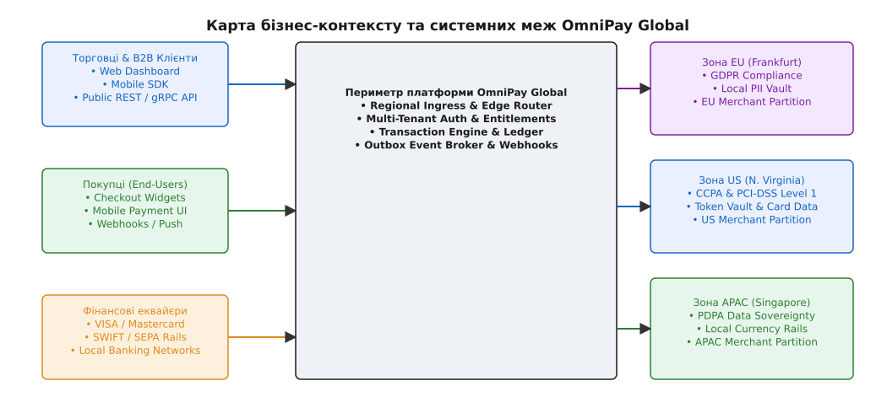
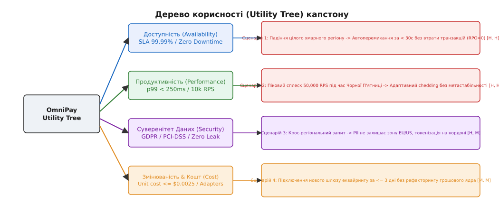
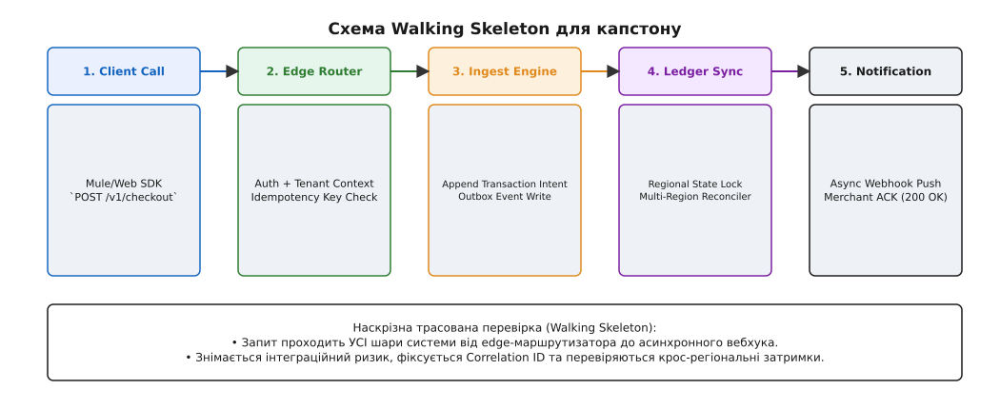

# Капстон, крок 1: постановка й рамка системи

<preknowlist>
- [Якісні атрибути](root:sf-apps/quality-attributes) — нефункційні вимоги («-ilities») та підхід до їх квантифікації.
- [Сценарії атрибутів](root:sf-apps/attribute-scenarios) — форма SEI: стимул, джерело, середовище, артефакт, відповідь та міра відповіді.
- [Дерево корисності](root:progarch/dh-utility-tree) — ієрархічний інструмент зважування архітектурних вимог за важливості та ризиком.
- [Walking skeleton](root:sf-apps/walking-skeleton) — найтонший наскрізний робочий зріз для ранньої мітигації інтеграційних ризиків.
- [Зворотні й незворотні рішення](root:sf-apps/reversible-irreversible-decisions) — калібрування темпу й консенсусу під ціну відкату (one-way / two-way doors).
</preknowlist>

П'ятнадцятихвилинна аварія монолітного платіжного сервера OmniPay під час останнього розпродажу Black Friday коштувала компанії 450 000 доларів США прямих втрат від незавершених транзакцій та вилилася у виплату штрафних санкцій за порушення угоди про рівень обслуговування (англ. *Service Level Agreement*, SLA) для п'яти найбільших enterprise-клієнтів. Сервер у Франкфурті впав через вичерпання пулу з'єднань з базою даних, бо запит на авторизацію платежу з Нью-Йорка чекав на міжконтинентальний синхронний виклик перевірки ліміту в Сінгапурі, блокуючи транзакційні потоки по всьому світу. Спроба розробників «просто додати кешування» виявилася тупиком: регулятор ЄС розцінив збереження карткових даних американських громадян на німецьких кеш-вузлах як порушення суверенітету даних. Саме в цей момент керівництво фінансової платформи ухвалює рішення про повне архітектурне перепланування системи для виходу на мільйон активних торговців у трьох регіонах світу.

Усі попередні модулі цього курсу будувалися навколо навчальної платформи розумного дому Digital Homes (DH). Вона слугувала навчальним риштованням: вчила мислити межами контекстів, обирати тактики стійкості, будувати контракти й розраховувати економіку рішень під наглядом покрокових підказок. Але в реальному репертуарі архітектора навчальна риштовина знімається. На п'яти кроках фінального капстон-проєкту більше немає готових підказок нитки. Натомість є складний, реалістичний B2B-домен, жорсткі нормативні обмеження, суперечливі вимоги стейкхолдерів та потреба провести систему через усі масштаби — від рядка коду до глобальної планетарної інфраструктури. На цьому першому кроці ми формалізуємо бізнес-контекст, будуємо дерево корисності, виділяємо топ-7 архітектурних драйверів та проєктуємо найтонший наскрізний робочий зріз (Walking Skeleton).

## 1. Постановка проблеми та зняття навчальної риштовини

Проєктування програмної архітектури у реальному світі — це не вибір «найкращого фреймворку» і не малювання красивих діаграм без прив'язки до чисел. Це розв'язання крайової задачі з жорсткими математичними, фінансовими та юридичними обмеженнями. 

Протягом вивчення курсу ми спостерігали, як розвивалася платформа Digital Homes — від однофайлового скрипта контролю реле на одноплатнику до розподіленого модульного моноліту та хмарного сервісу. DH була ідеальним навчальним тренажером, бо її домен (датчики, актуатори, кімнати, автоматизації) є інтуїтивно зрозумілим. Проте навчальний приклад за своєю природною структурою пом'якшує кути: у ньому можна було спростити правовий режим, пробачити короткочасний витік даних або заплющити очі на хмарний рахунок за мережевий трафік. У навчальному середовищі інженер завжди має «безпечну сітку» — авторів курсу, які розставили орієнтири, заздалегідь підказали потрібний патерн та сформулювали варіантні блоки.

У фінальному капстон-проєкті ця підтримуюча риштовина повністю знімається. Архітектор залишається сам на сам із сирими, неструктурованими бізнес-вимогами, юридичними заборонами та непереборними фізичними законами. Тут більше немає «підказок нитки»: ніхто не каже наперед, чи варто застосовувати поділ на мікросервіси, яку базу даних обрати або де провести межу консистентності. Кожне рішення має бути виведене з фундаментальних первинних причин (англ. *First Principles*) та обґрунтовано в артефактах оцінки.

Система OmniPay Global розширюється з одного дата-центру до трьох глобальних регіонів: Європейського союзу (EU-Central, Франкфурт), Північної Америки (US-East, Вірджинія) та Азіатсько-Тихоокеанського регіону (APAC, Сінгапур). Поточний транзакційний обсяг становить 100 000 активних торговців, а цільовий масштаб наступного року — **1 000 000 торговців** із піковим навантаженням до **10 000 транзакцій запису на секунду (RPS)** та **50 000 аналітичних і читацьких запитів на секунду**. Загальний річний обсяг оброблюваних платежів перевищує 12 мільярдів доларів США.


*Зовнішні актори системи, центральний периметр платформи OmniPay та ізольовані суверенні регіональні зони з відповідними регуляторними вимогами.*

Головна відмінність капстон-етапу від попередніх навчальних розділів полягає в тому, що архітектурні вимоги тут не подаються у вигляді готових інструкцій. Вони видобуваються з аналізу бізнес-моделі, конфліктних вимог стейкхолдерів та непереборних законів фізики (затримка поширення сигналу в оптичному волокні між континентами становить від 120 до 280 мс RTT). 

> 🔧 **Навіщо це.** Без формалізованої постановки межових умов на кроці 1 будь-які подальші рішення щодо розбиття на мікросервіси чи вибору баз даних перетворюються на безпідставне вгадування. Чітка рамка драйверів перетворює архітектуру з дискусії про смаки на обчислюваний процес.

## 2. Бізнес-контекст, межі системи та первинні обмеження

Платформа OmniPay працює у домені B2B-фінансових послуг та обробки транзакцій. Вона надає торговцям (Merchants) та маркетплейсам можливість приймати платежі від покупців (End-Users) по всьому світу, проводити мультивалютний розрахунок (Settlement), вести транзакційний журнал (Ledger) та надсилати сповіщення через вебхуки.

Детальний аналіз тарифних планів, нормативних обмежень та юридичних юрисдикцій наведено у вставці [🔌 Специфікація бізнес-контексту та матриці корисності OmniPay](root:progarch/capstone-setup/comp-capstone-context-matrix.md).

### Чотири первинні системні обмеження (Constraints)

Перш ніж квантифікувати якісні атрибути, архітектор має зафіксувати **необхідні обмеження** — рамки, порушення яких означає юридичну або фінансову смерть проєкту:

1. **Фінансова цілісність та абсолютна відсутність втрат (RPO = 0):** Фінансовий журнал (Ledger) будується за принципом подвійного запису (англ. *Double-Entry Bookkeeping*). Втрата хоч однієї проводки або подвійне списання грошей (Double-Spending) через мережевий повтор запиту є неприпустимою. Точка відновлення даних (англ. *Recovery Point Objective*, RPO) для транзакцій дорівнює строго 0. Кожен запис у журнал має бути підтверджений скиданням на диск (WAL flush) до того, як клієнт отримає код `200 OK`.
2. **Нормативний суверенітет даних (Data Sovereignty Boundaries):**
   - **EU (GDPR):** Персональні дані європейських громадян (PII) заборонено експортувати за межі ЄС у незашифрованому вигляді. Збереження IP-адрес чи імен покупців у базах США без згоди є прямим порушенням GDPR Статей 44–49.
   - **US (CCPA / PCI-DSS Level 1):** Номери платіжних карток (PAN) повинні ізолюватися у спеціальному сховищі токенів (Token Vault). Жоден загальний мікросервіс не має права зберігати сирі карткові дані, щоб не поширювати суворий контур аудиту PCI-DSS на всю інфраструктуру.
   - **APAC (PDPA):** Регіональний журнал транзакцій має зберігатися локально в Сінгапурі, а фінансові звіти повинні бути доступні місцевим аудиторам.
3. **Строге обмеження вартості інфраструктури (Unit Cost Constraint):** Вартість хмарної інфраструктури на одну успішно оброблену транзакцію не повинна перевищувати **0.0025 долара США** (0.25 цента). Архітектурне рішення, яке вимагає надмірної міжконтинентальної реплікованої пам'яті чи неконтрольованого мережевого трафіку (Egress), вбиває маржинальність бізнесу. При обсязі 10 000 RPS хмарний рахунок не повинен перевищувати 65 000 доларів на місяць.
4. **Багатоорендна тарифна диференціація (Tenant Tiering):** Платформа обслуговує три класи клієнтів:
   - *Enterprise Tier* (40% обсягу): SLA доступності 99.99% (простій ≤ 52.56 хвилини на рік), ізольовані ресурси, гарантована латентність p99 < 150 мс.
   - *Standard Tier* (45% обсягу): SLA 99.9% (простій ≤ 8.76 години на рік), спільні кластери ресурсів, латентність p99 < 300 мс.
   - *Self-Service Tier* (15% обсягу): SLA 99.0%, жорсткі ліміти навантаження (Rate Limiting) та адаптивне скидання трафіку під час піків.

### Обчислення на серветці (Back-of-the-Envelope Calculations)

Для оцінки реалістичності навантаження проведемо первинні орієнтовні розрахунки:

- **Транзакційний обсяг запису:** `10 000 RPS × 2 KB` (середній розмір payload запису з метаданими) = `20 MB/сек` вхідного мережевого потоку.
- **Денний обсяг даних транзакційного логу:** `20 MB/сек × 86 400 сек` = `1.728 TB/день` первинних append-only даних. За рік накопичується близько `630 TB` даних без урахування реплікації.
- **Читацький обсяг запитів:** `50 000 RPS × 5 KB` (виписки, статуси) = `250 MB/сек` вихідного мережевого потоку (`21.6 TB/день`).
- **Мережева економіка міжконтинентального Egress:** Якщо припустити наївне рішення, де кожен транзакційний запит із ЄС робить 2 міжконтинентальні синхронні виклики до США, то при вартості $0.02 за GB міжрегіонального трафіку AWS Egress рахунок лише за мережу становитиме `21.6 TB/день × $0.02/GB × 30 днів ≈ $13 000/місяць`. Це становить 20% від усього допустимого бюджету інфраструктури, що доводить економічну недоцільність синхронної міжконтинентальної реплікації кожної транзакції.

## 3. Формалізація якісних атрибутів та Дерево Корисності (Utility Tree)

Для перетворення абстрактних бажань стейкхолдерів («система має бути швидкою та надійною») на вимірювані архітектурні вимоги використовується формалізований формат сценаріїв якості SEI (Software Engineering Institute):

```text
[Джерело стимулу] → [Стимул] → [Середовище] → [Артефакт] → [Відповідь] → [Міра відповіді]
```

### Формування сценаріїв за основними атрибутами

1. **Доступність та Стійкість (Availability & Resilience):**
   - *Сценарій:* Під час пікового навантаження повністю виходить з ладу один із трьох хмарних регіонів (наприклад, US-East).
   - *Відповідь:* Edge-маршрутизатор перенаправляє вхідний трафік на резервний регіон за ≤ 30 секунд. Транзакції Enterprise-клієнтів продовжують оброблятися без втрат (RPO=0, RTO < 30с).
2. **Продуктивність та Затримка (Performance & Latency):**
   - *Сценарій:* Покупець виконує покупку на сайті маркетплейсу в межах одного регіону.
   - *Відповідь:* Час відповіді API від моменту прийому запиту на шлюзі до повернення підтвердження (p99) не перевищує 150 мс для Enterprise Tier та 300 мс для Standard Tier.
3. **Масштабованість (Scalability & Elasticity):**
   - *Сценарій:* Раптовий сплеск навантаження збільшує трафік з 2 000 до 50 000 RPS під час розпродажу.
   - *Відповідь:* Система адаптивно скидає навантаження (Load Shedding) для Self-Service клієнтів, зберігаючи стабільну затримку та 0% помилок для Enterprise Tier.
4. **Змінюваність та Екосистема (Modifiability):**
   - *Сценарій:* Розробники додають інтеграцію з новим платіжним провайдером у Південній Америці (наприклад, Pix).
   - *Відповідь:* Новий адаптер додається у вигляді окремого модуля без перезбірки й рефакторингу транзакційного ядра Ledger. Час розробки ≤ 3 людино-днів.
5. **Спостережуваність та Операційність (Observability & Operability):**
   - *Сценарій:* Під час обробки платежу виникає помилка в асинхронному вебхуку на стороні банку.
   - *Відповідь:* Система транслює `Traceparent` скрізь усі мікросервіси. Інженер знаходить повне дерево викликів за `Correlation ID` за ≤ 10 секунд.
6. **Економічна ефективність (Cost Efficiency):**
   - *Сценарій:* Транзакційний обсяг зростає у 5 разів за рік.
   - *Відповідь:* Вартість залізо-годин на одну транзакцію масштабується сублінійно, не перевищуючи встановлений поріг у $0.0025.


*Дерево корисності платформи OmniPay: декомпозиція якісних атрибутів на конкретні сценарії із квадрантом пріоритезації (Важливість для бізнесу, Архітектурний ризик).*

На основі розроблених сценаріїв будується **Дерево корисності (Utility Tree)**. Кожен сценарій отримує двомірний пріоритет `(H/M/L, H/M/L)`, де перша літера означає важливість для бізнесу (англ. *Business Importance*), а друга — архітектурний ризик реалізації (англ. *Architectural Risk*).

Історичний аналіз того, як провідні платіжні системи світу проходили шлях від моноліту до мультирегіональних комірок, розібрано у вставці [📜 Історія мультирегіонального масштабування платіжних платформ](root:progarch/capstone-setup/hist-fintech-multiregion-scaling.md).

### Матриця компромісів (Trade-off Matrix)

Спроба одночасно досягти максимальних показників у всіх атрибутах є неможливою. Архітектор фіксує точки компромісу (Trade-off Points):

- *Компроміс 1 (Суверенітет vs Глобальна консистентність):* Ми відмовляємося від глобальної стійкої консистентності (Strong Consistency) між континентами на користь суверенітету даних та автономності регіональних комірок.
- *Компроміс 2 (Латентність vs Фінансова цілісність):* Для досягнення p99 < 150 мс ми відмовляємося від розподіленого комміту 2PC між банками у гарячому потоці, застосовуючи асинхронні патерни Outbox та Saga.
- *Компроміс 3 (Вартість vs Ізоляція):* Повна ізоляція баз даних надається лише Enterprise Tier, тоді як Standard та Self-Service ділять спільні ресурси через багатоорендні схеми.

## 4. Виділення Топ-7 Архітектурних Драйверів та їхній зв'язок із тактиками

Архітектурні драйвери — це невеликий набір найсуворіших вимог (сценаріїв з вагою `(H, H)` та `(H, M)`), під які згинається вся форма майбутньої системи. Для платформи OmniPay виділено сім головних драйверів:

1. **Драйвер 1: Мультирегіональний суверенітет даних та партиціювання [H, H].** Заборона виходу PII за межі юрисдикції вимагає строгого регіонального шардингу баз даних та відмови від централізованого зберігання персональних даних. *Тактика: Sharding & Data Isolation.*
2. **Драйвер 2: Гарантія цілісності транзакційного журналу (Ledger) без подвійного списання [H, H].** Вимагає атомарного запису у локальний append-only журнал та надійної перевірки ідемпотентності на вхідному периметрі. *Тактика: Transactional Outbox & Idempotent Guard.*
3. **Драйвер 3: Крос-регіональний бюджет затримки та асинхронні Read-моделі [H, M].** Оскільки міжконтинентальний синхронний виклик додає > 200 мс, усі читацькі операції (баланси, історія) повинні обслуговуватися з локальних матеріалізованих в'ю (Eventual Consistency), а синхронні операції обмежуватися межами однієї комірки. *Тактика: CQRS & Materialized Views.*
4. **Драйвер 4: Висока доступність та коміркова ізоляція відмов (Cell-based Isolation) [H, H].** Система повинна розбиватися на автономні комірки (Cells). Збій у комірці А не повинен впливати на клієнтів у комірці Б. Радіус вибуху аварії обмежується часткою `1 / N`. *Тактика: Cell-based Architecture & Bulkhead.*
5. **Драйвер 5: Розширюваність платіжних адаптерів (Plugin Architecture) [M, M].** Швидке підключення нових банків-еквайєрів вимагає ізольованого шарніра (Ports & Adapters / Hexagonal Architecture). *Тактика: Plugin & Hexagonal Adapters.*
6. **Драйвер 6: Реал-тайм обліковування витрат та метрик орендарів (Multi-Tenant Metering) [M, H].** Фіксація використання ресурсів кожним орендарем для точного білінгу та запобігання проблемам «галасливого сусіда» (англ. *Noisy Neighbor*). *Тактика: Rate Limiting & Metering Pipeline.*
7. **Драйвер 7: Еволюційний перехід без зупинки продакшну (Zero-Downtime Migration) [H, H].** Існуючий моноліт V1 обробляє гроші просто зараз. Перехід на нову мультирегіональну архітектуру має здійснюватися еволюційно за патерном Strangler Fig без відключення клієнтів. *Тактика: Strangler Fig & Branch-by-Abstraction.*

Взаємозв'язок між бізнес-драйверами та архітектурними обмеженнями визначає всю топологію майбутніх сервісів. Наприклад, Драйвер 1 (суверенітет) та Драйвер 4 (коміркова ізоляція) диктують відмову від єдиного глобального реляційного кластера на користь автономних регіональних комірок, які синхронізують лише підсумкові агреговані баланси.

## 5. Walking Skeleton: Побудова найтоншого наскрізного зрізу

Відповідно до дисципліни [рішень під невизначеністю](root:sf-apps/deciding-under-uncertainty), першим кроком перевірки архітектурної гіпотези є побудова **Walking Skeleton** — найтоншого наскрізного ланцюжка, що проходить крізь усі шари майбутньої системи.


*Наскрізний ланцюжок трасування запиту у Walking Skeleton: від прийому на Edge-маршрутизаторі до асинхронної публікації події.*

Walking Skeleton не містить повної бізнес-логіки розрахунку податків чи складного роутингу платежів. Його завдання — вирішити головний інтеграційний ризик: перевірити, чи здатна система прийняти запит, прокинути наскрізний `Trace-ID`, валідувати ідемпотентний ключ, записати намір у транзакційний журнал (Outbox) та згенерувати асинхронну подію.

Робочу реалізацію тестового харнесу Walking Skeleton мовами C та C++ з підтримкою перевірки дублікатів та журналу Outbox наведено у вставці [⚙️ Наскрізний харнес Walking Skeleton: ендпоінти та простеження запиту](root:progarch/capstone-setup/proj-capstone-skeleton-harness.md).

```text
[Client Request]
    │  (POST /v1/checkout + Header: Traceparent & Idempotency-Key)
    ▼
[Edge Router & Auth Guard]
    │  (Витяг контексту орендаря, генерація/прокидання Trace-ID)
    ▼
[Idempotency Guard] ──(Знайдено дублікат)──> [Повернення збереженої відповіді 200 OK]
    │  (Новий ключ)
    ▼
[Ingestion Engine & Local Outbox]
    │  (Атомарний append-only запис транзакції у регіональний журнал)
    ▼
[Async Event Emitter]
    │  (Публікація події у брокер -> підтвердження клієнту 200 OK)
```

Побудова цього скелета на першому тижні дозволяє переконатися, що міжсервісні контракти працюють, затримка на краї вимірюється об'єктивно, а наскрізна спостережуваність зафіксована у коді. Інженерна команда вимірює базову латентність порожнього ланцюжка (Overhead Latency), яка на даному етапі не повинна перевищувати 8 мс.

## 6. Рамка прийняття рішень та дорожня карта п'яти кроків капстону

Формалізація бізнес-контексту, дерева корисності та Walking Skeleton створює каркас, на якому будуються всі наступні чотири кроки капстон-синтезу:

1. **Крок 1 (поточний — `capstone-setup`):** Постановка проблеми, бізнес-контекст, якісні атрибути, дерево корисності, 7 драйверів та Walking Skeleton.
2. **Крок 2 (`capstone-shape-data`):** Форма застосунку та дані: C4-діаграми контейнерів, межі контекстів, вибір моделей баз даних (OLTP vs Event-Driven), моделі консистентності (Strong vs Eventual).
3. **Крок 3 (`capstone-services-nodes`):** Сервіси та критичні вузли: декомпозиція на комірки, саги та розподілені транзакції, вузли автентифікації, грошового леджера, часу та вебхуків.
4. **Крок 4 (`capstone-scale-secure-ops`):** Тактики стійкості, масштаб, безпека й експлуатація: захист від перевантажень (Load Shedding), мультирегіональні топології, Threat Modeling, PCI-DSS токенізація, SLO й CI/CD.
5. **Крок 5 (`capstone-org-evolution`):** Організація й еволюція: Закон Конвея й топологія команд, економіка інфраструктури (FinOps), план еволюційної міграції з моноліту V1 та закриття журналу ADR.

Для фіксації всіх суттєвих виборів на цьому й наступних кроках заводиться **Журнал архітектурних рішень (ADR)** проєкту OmniPay. Кожна розвилка оцінюється крізь призму ціни відкату ([one-way / two-way doors](root:sf-apps/reversible-irreversible-decisions)), а результати виборів фіксуються письмово.

Постановка завершена. Рамку встановлено, межові умови визначено, а наскрізний скелет перевірено. Ми готові перейти до Кроку 2 — проєктування форми застосунку та топології даних.
