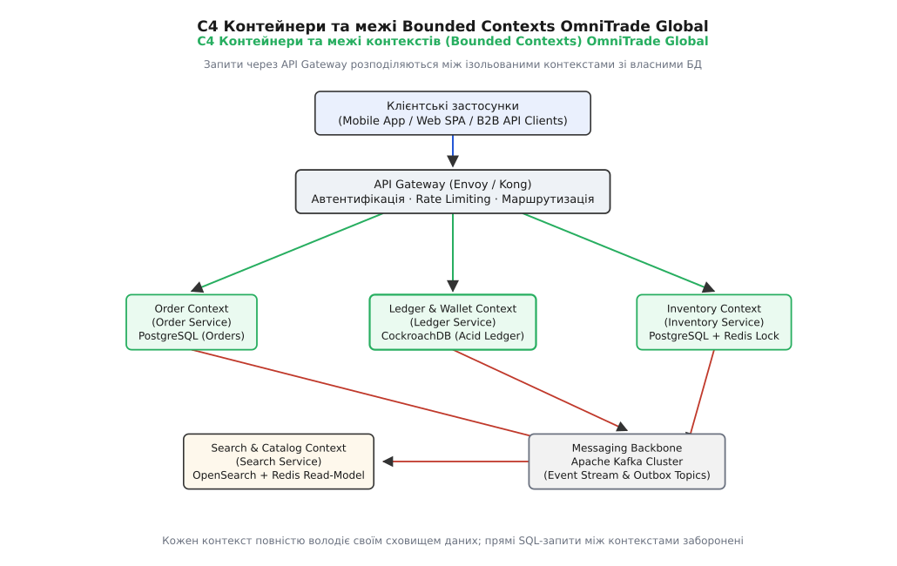
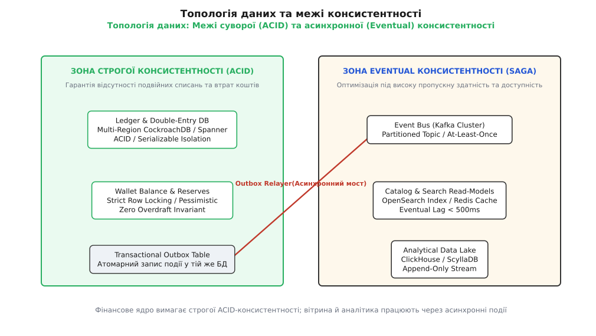
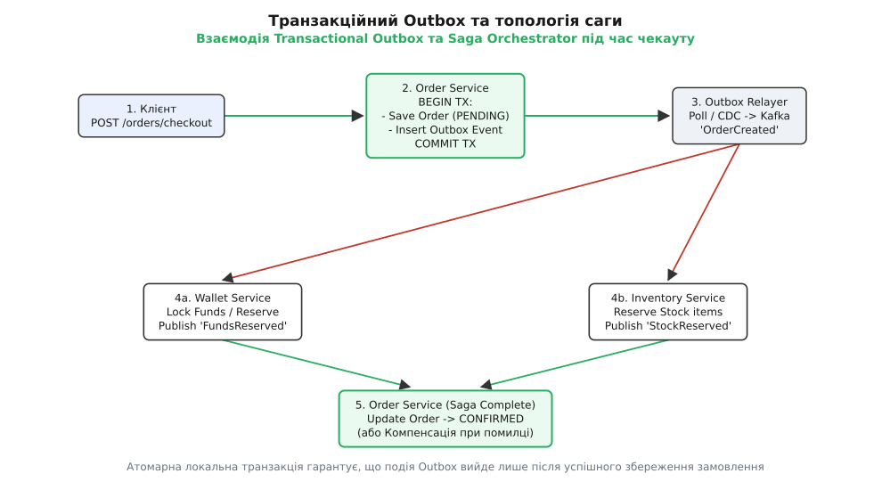

# Капстон, крок 2: форма застосунку та топологія даних

<preknowlist>
- [Модель C4](book:programming/architecture-discipline/c4-model) — чотири рівні деталізації для опису та координації архітектури.
- [Обмежений контекст (Bounded Context)](book:programming/software-design/bounded-context) — явні межі доменної моделі та мови.
- [Гексагональна архітектура](root:progarch/application-shape/dh-v2-hexagon) — ізоляція ядра застосунку від адаптерів інфраструктури.
- [Transactional Outbox](root:progarch/messaging-and-eip/dh-handover-saga) — гарантія атомарної публікації подій разом із мутацією БД.
</preknowlist>

Спроба збудувати глобальну платіжно-торгівельну платформу OmniTrade Global на єдиній монолітній базі даних PostgreSQL розвалюється в той момент, коли навантаження сягає 15 000 чекаут-транзакцій на секунду у трьох географічних регіонах (ЄС, США, АТ-Регіон). Фінансовий модуль леджера починає блокувати таблиці товарного каталогу, повнотекстовий пошук зжирає операційну пам'ять СУБД, а міжрегіональні затримки мережі перетворюють будь-яку спробу провести синхронний двофазний коміт (2PC) на нескінченне очікування. На другому кроці розробки капстон-проєкту архітектор переходить від базової постановки вимог до побудови конкретної форми застосунку: виділення меж обмежених контекстів (Bounded Contexts), проєктування топології баз даних та визначення суворих і послідовних меж консистентності.

Рішення, прийняті на цьому етапі, є найбільш незворотними у всій розробці. Якщо змінити код внутрішнього сервісного класу можна за кілька годин, то розділення монолітної бази даних під тиском мільйонів користувачів або міграція від асинхронної консистентності до суворої ACID вимагає місяців небезпечних інженерних дій.

---

## 1. Від атрибутів якості до форми застосунку: C4 Container View та межі контекстів

Першим кроком перетворення вимог на працюючу систему є нарізка системи на обмежені контексти (Bounded Contexts) за методологією предметно-орієнтованого проєктування (Strategic DDD). Головне завдання архітектора на цьому етапі — не допустити створення «розподіленого моноліту» (Distributed Monolith), у якому мікросервіси зв'язані синхронними викликами і спираються на спільні SQL-таблиці.

Для платформи OmniTrade Global виділяються п'ять ключових автономних контекстів, кожен з яких володіє власною бізнес-моделлю та унікальною мовою (Ubiquitous Language):

1. **Order Context (Контекст замовлень):** Керує життєвим циклом оформлення покупки (Checkout), формує стан замовлення (`PENDING`, `CONFIRMED`, `CANCELLED`, `FULFILLED`) та координує виконання бізнес-сценарію.
2. **Ledger & Wallet Context (Контекст леджера та гаманців):** Відповідає за фінансовий облік, баланси користувачів та продавців, обробку мутацій коштів. Для цього контексту головним атрибутом якості є **100% математична точність та гарантія відсутності подвійних списань**.
3. **Inventory Context (Контекст інвентарю та складського обліку):** Відповідає за фізичну наявність товарів, швидке тимчасове резервування одиниць під час чекауту та списки доступних залишків.
4. **Catalog & Search Context (Контекст каталогу та пошуку):** Забезпечує повнотекстовий пошук, фільтрацію за параметрами, категоріями та рекомендації для покупців. Працює у режимі високого читацького навантаження (Read-Heavy, співвідношення читання до запису 100:1).
5. **Analytics & Audit Context (Контекст аналітики та аудиту):** Накопичує події системи для побудови фінансових звітів, виявлення шахрайських дій (Fraud Detection) та спостережуваності.


*Контейнерна C4-архітектура системи: кожен обмежений контекст володіє власною базою даних та спілкується з іншими через API-шлюз або асинхронний брокер Kafka.*

### Моделювання міжконтекстних стосунків (Context Mapping)

Для координації взаємодії між виділеними контекстами застосовуються п'ять формалізованих шаблонів Context Mapping:

* **Customer-Supplier (Замовник-Постачальник):** `Order Context` виступає замовником послуг від `Wallet Context` та `Inventory Context`. Зміни у вимогах замовлень пріоритетизуються у планах розробки сервісу гаманців.
* **Open Host Service / Published Language (OHS/PL):** `Catalog Context` надає стабільний GraphQL/gRPC-інтерфейс із чітко версіованими Прото-схемами (`Published Language`) для використання зовнішніми фронтендами та мобільними застосунками.
* **Anti-Corruption Layer (ACL, Запобіжний шар):** `Ledger Context` використовує шар ACL для ізоляції внутрішньої доменної моделі подвійної бухгалтерії від зовнішніх платіжних шлюзів (Stripe, PayPal, SEPA). Запобіжний шар трансформує зовнішні структури у внутрішні доменні команди.
* **Separate Ways (Окремі шляхи):** `Analytics Context` повністю відокремлений від оперативної обробки транзакцій і вичитає дані асинхронно з логів Kafka, не чинячи жодного впливу на OLTP-потік.

### Дизайн доменних подій та управління схемами (Schema Registry)

Усі міжконтекстні зв'язки будуються на основі імутабельних доменних подій. Для забезпечення зворотної сумісності (Backward Compatibility) при еволюції сервісів використовується **Schema Registry** на базі Google Protocol Buffers (Protobuf). Подія виглядає як строго структурований пакет:

```json
{
  "event_id": "evt-8801-99ab-cdef",
  "event_type": "OrderCreated",
  "aggregate_id": "ord-5501-1234",
  "timestamp_utc": "2026-08-18T10:30:00Z",
  "version": 2,
  "payload": {
    "buyer_id": "usr-1092",
    "seller_id": "mch-4401",
    "currency": "USD",
    "total_cents": 14999,
    "items": [
      { "sku": "SKU-9901-XL", "quantity": 1, "price_cents": 14999 }
    ]
  }
}
```

Правила еволюції схем забороняють видалення або перейменування існуючих полів у топіках Kafka. Додавання нових полів дозволяється виключно як опціональні (`optional`), що гарантує відсутність поломок у застарілих споживачах.

### Інтеграційні шви та правило ізоляції баз даних

Фундаментальним інваріантом форми застосунку є **повна відсутність спільних сховищ даних між контекстами**. Сервіс замовлень не має права виконувати прямі SQL-запити до таблиць леджера чи інвентарю. Усі міжконтекстні зв'язки будуються виключно через два типи явних контрактів:

* **Синхронний Edge-трафік (gRPC / HTTPS):** Використовується на межі системи (API Gateway) для первинного прийому запитів від клієнтських застосунків, перевірки токенів авторизації та швидкого читання некритичних даних.
* **Асинхронні доменні події (Domain Events via Kafka):** Використовуються для міжсервісної координації та передачі фактів про події, що вже відбулися у системі (`OrderCreated`, `FundsReserved`, `InventoryDepleted`).

> 🔧 **Навіщо це.** Ізоляція баз даних за межами контекстів унеможливлює неявний зсув зчеплення (Coupling Drift). Команда леджера може повністю змінити схему своїх SQL-таблиць або перейти з PostgreSQL на CockroachDB, не зламавши жодного рядка коду в сервісі замовлень чи пошуку.

---

## 2. Топологія даних та моделі зберігання: Polyglot Persistence

У сучасних високонавантажених системах підхід «один тип СУБД для всього проєкту» виявляється нежиттєздатним. Спроба зберігати фінансовий леджер, повнотекстовий індекс каталогу та мільярди подій телеметрії в єдиній базі даних призводить до важких компромісів між продуктивністю, ціною та надійністю.

Для OmniTrade Global застосовується стратегія **Polyglot Persistence (Багатоваріантне зберігання)**, де для кожного Bounded Context обирається СУБД, оптимізована під його конкретний профіль навантаження та інваріанти:

```text
[Ledger Context]    → Multi-Region CockroachDB (ACID / Distributed SQL)
[Order Context]     → PostgreSQL (Partitioned Relational + Outbox Table)
[Inventory Context] → PostgreSQL + Redis Cluster (Distributed Redlock)
[Catalog Context]   → OpenSearch (Full-Text Index) + Redis (Read-Model Cache)
[Analytics Context] → ClickHouse (Columnar Append-Only Store)
```


*Розподіл баз даних системи за межами консистентності: фінансове ядро спирається на сувору ACID-транзакційність, тоді як вітрина й аналітика працюють через асинхронні прочитання.*

### Деталізація мульти-регіональної реплікації та ключів партиціювання

Оскільки платформа функціонує в трьох регіонах (ЄС, США, АТ-Регіон), шар зберігання даних має підтримувати регіональну локальність (Data Locality). У CockroachDB застосовується шардинг та реплікація на основі консенсусу Raft:

* **Регіональні таблиці (Regional Tables):** Таблиці `wallet_accounts` шардуються за ключем `region_code`. Усі транзакції користувачів ЄС обробляються Raft-групою, локалізованою в дата-центрах Франкфурта та Амстердама, що забезпечує затримку запису `E (Else) -> L (Latency)` менше 15 мс.
* **Глобальні таблиці (Global Tables):** Довідники валют та системних комісій реплікуються на всі регіони у режимі `READ-DOMINATED`, де читання виконується локально за 1 мс, а записи вимагають міжрегіонального кворуму.
* **Стратегія партиціювання ключем:** Щоб запобігти виникненню гарячих партицій (Hotspot Partitions), ключі первинного доступу формуються за допомогою комбінованого хекш-префікса: `hash(tenant_id) + tenant_id + entity_id`.

### Застосування таксономії PACELC до вибору СУБД

Під час вибору баз даних для кожного контексту архітектор керується не маркетологічними обіцянками вендорів, а математичною моделлю PACELC, яка розширює теорему CAP. Детальний аналіз виникнення цієї моделі та її еволюції наведено у вставці [Еволюція від CAP до моделі PACELC](root:progarch/legacy-and-evolution/capstone-shape-data/hist-pacelc-lineage.md).

Згідно з моделью PACELC, компроміси між консистентністю, доступністю та затримкою діляться на два суворих режими:

1. **Зона PC/EC (Strong Consistency / Availability Deficit):**
   * **Де застосовується:** `Ledger & Wallet Context`.
   * **Принцип:** Якщо виникає розрив мережі (**P**artition), система обирає консистентність (**C**onsistency) і відмовляє у прийомі нових транзакцій некорумпованим вузлам, які втратили кворум. Коли мережа працює штатно (**E**lse), система обирає консистентність (**C**onsistency) замість затримки (**L**atency), чекаючи синхронного підтвердження від більшості кворумних реплік (`fsync` + Quorum Consensus).
   * **Технологія:** Multi-Region CockroachDB зі строгим рівнем ізоляції `SERIALIZABLE`.

2. **Зона PA/EL (Eventual Consistency / High Availability):**
   * **Де застосовується:** `Catalog & Search Context`, `Analytics Context`.
   * **Принцип:** При розриві мережі (**P**) система віддає перевагу доступності (**A**vailability) і повертає покупцям останні відомі знімки товарів із кешу, навіть якщо вони трохи застаріли. У штатному режимі (**E**) система оптимізує затримку (**L**atency), застосовуючи асинхронну реплікацію з lag < 500 мс.
   * **Технологія:** OpenSearch для пошуку та Redis для денормалізованих Read-Models.

---

## 3. Межі узгодженості: де строго (ACID), де eventual (Saga/Outbox)

Найпоширенішою помилкою початківців є спроба поширити сувору ACID-консистентність на весь транзакційний потік системи. Намагання зв'язати створення замовлення, списання з гаманця та резервування на складі в єдину розподілену транзакцію через протокол двох фаз (Two-Phase Commit, 2PC / XA) призводить до негативних наслідків:
* Доступність системи падає до добутку доступностей усіх вузлів (`A_sys = A1 · A2 · A3`).
* Блокування SQL-рядків утримуються протягом усього часу мережевого обміну між мікросервісами (десятки або сотні мілісекунд), що викликає масові Deadlocks і вичерпання пулу з'єднань.

Тому у системі OmniTrade Global застосовується **гібридна модель консистентності**: строго всередині контексту та послідовно (Eventual) між контекстами.

### Внутрішньо-контекстна консистентність: Подвійна бухгалтерія

Усередині `Ledger Context` будь-яка зміна балансу виконується як сувора ACID-транзакція за принципом **Подвійної бухгалтерії (Double-Entry Bookkeeping)**. Баланс користувача ніколи не зберігається як одне мутабельне число, яке перезаписується операцією `UPDATE`. Кожна фінансова дія створює два незмінні записи (Дебет і Кредит), гарантуючи абсолютний інваріант:

```
∑ Debit - ∑ Credit = 0    [інваріант подвійної бухгалтерії: сума дебету дорівнює сумі кредиту]
```

Якщо під час виконання транзакції виникає спроба утворити від'ємний баланс, СУБД миттєво відхиляє транзакцію на рівні SQL-інваріанту `CHECK (balance_cents >= 0)`.

### Розподілене блокування залишків (Distributed Redlock)

У `Inventory Context` виникає проблема високої конкуренції (High Contention) за останні одиниці популярних товарів. Для запобігання ситуації, коли на 5 наявних ноутбуків одночасно оформлюється 500 замовлень, використовується патерн розподіленого блокування **Redlock** на кластері Redis з лізингом (Lease Time = 5000 мс) та фехтувальними токенами (Fencing Tokens):

```
1. Client -> Redis: SET lock:sku-9901 token-uuid-77 NX PX 5000
2. IF OK: Перевірка залишка в PostgreSQL -> Резервування -> COMMIT
3. Release lock via Lua script (перевірка token-uuid-77)
```

### Міжконтекстна консистентність: Transactional Outbox та Saga Orchestration

Для координації чекауту між контекстами застосовується комбінація двох патернів: **Transactional Outbox** (для безпечної публікації подій без подвійного запису) та **Saga Orchestrator** (для проведення асинхронного ланцюжка компенсацій).


*Послідовність виконання чекауту: замовлення зберігається в стані PENDING разом із подією Outbox у єдиній транзакції БД, після чого Saga-оркестратор проводитиме асинхронне резервування коштів та товарів.*

Повний алгоритм обробки чекауту працює за наступними кроками:

1. **Атомарний початок (Order Context):** Застосунок відкриває локальну SQL-транзакцію у PostgreSQL замовлень, зберігає замовлення у стані `PENDING` і **в цій же транзакції** вставляє рядок у таблицю `outbox_events`.
2. **Асинхронний релей (Outbox Relayer):** Окремий фоновий процес вичитує таблицю Outbox і публікує подію `OrderCreated` у Kafka. Якщо процес впаде — після перезапуску він повторно відправить подію (гарантія **At-Least-Once**).
3. **Ідемпотентне виконання (Wallet & Inventory Contexts):** Сервіси гаманців та інвентарю отримують подію `OrderCreated`. Завдяки таблиці дедуплікації `processed_messages`, вони обробляють кожну подію строго один раз, виключаючи ризик подвійного резервування.
4. **Компенсаційний сценарій (Saga Compensation):** Якщо `Inventory Context` відповідає, що товар закінчився, Saga Orchestrator ініціює компенсаційну подію `CancelWalletReserve`, яка повертає заблоковані кошти на гаманець покупця.

Повна практична реалізація цього патерну на мовах C++, C та Go з обробкою ключів ідемпотентності наведена у вставці [Реалізація Transactional Outbox та ідемпотентного споживача](root:progarch/legacy-and-evolution/capstone-shape-data/proj-ledger-outbox.md).

---

## 4. Дисципліна архітектурних рішень: ADR на кожній розвилці

Жодне ключове рішення щодо топології даних або меж консистентності не повинно лишатися у вигляді усних домовленостей чи прихованого коду. Відсутність формальної фіксації причин і компромісів є головним джерелом ерозії архітектури: за рік нова команда скасує ізоляцію баз даних чи додасть прямий SQL-JOIN між замовленнями й леджером, не розуміючи, чому це було заборонено.

Кожна архітектурна развилка фіксується у вигляді формалізованого Запису Архітектурного Рішення (Architectural Decision Record, ADR). Для кроку «Форма та дані» оформлено три фундаментальні ADR, повний каталог яких доступний у вставці [Каталог ADR: Топологія даних та межі консистентності](root:progarch/legacy-and-evolution/capstone-shape-data/api-adr-capstone-data-shape.md):

* **ADR-001:** Перехід від монолітної PostgreSQL до стратегії **Polyglot Persistence** для виділених Bounded Contexts.
* **ADR-002:** Запровадження **Подвійної бухгалтерії (Double-Entry Bookkeeping)** та суворої ACID-ізоляції `SERIALIZABLE` для фінансового леджера.
* **ADR-003:** Відмова від розподілених двофазних комітів (2PC/XA) на користь **Transactional Outbox + Saga Orchestration** з ідемпотентними споживачами.

### Автоматичний контроль відповідності (Fitness Functions)

Для захисту прийнятих ADR від поступової руйнації розробниками, у проєкт інтегруються автоматичні архітектурні тести (Fitness Functions на базі ArchUnit / dependency-cruiser):

1. **Заборона на імпорт СУБД-драйверів чужих контекстів:** Тест перевіряє, що `Order Service` не має у своїх залежностях драйвера CockroachDB леджера.
2. **Заборона прямого виклику модифікуючих HTTP/gRPC методів:** Тест перевіряє, що сервіс замовлень не викликає метод `WalletService.Debit()` напряму в синхронному потоці HTTP-обробника, змушуючи використовувати Outbox і чергу подій.

---

## 5. Матриця верифікації компромісів та підготовка до Кроку 3

Щоб переконатися, що збудована форма застосунку та топологія даних здатні витримати реальні аварії у продакшні, архітектор проведення стрес-аналіз системи на трьох критичних сценаріях відмов:

| Сценарій відмови / Аварії | Механізм захисту та компенсації | Результат для бізнесу |
| :--- | :--- | :--- |
| **Розрив мережі між регіонами США та ЄС під час чекауту** | `Ledger Context` (CockroachDB / PC) блокує записи без кворуму; `Order Context` переходить у режим прийому замовлень у чергу. | Гроші покупців не корумпуються; замовлення приймаються в стан `PENDING` і обробляються після відновлення зв'язку. |
| **Повторна доставка вебхука оплати (At-Least-Once duplicate)** | `Processed Messages Table` з унікальним індексом по `event_id` у споживачі леджера. | Повторний виклики ігнорується СУБД; баланс списується строго один раз. |
| **Падіння брокера Kafka під час запису замовлення** | `Transactional Outbox` зберігає подію в SQL-таблиці разом із замовленням у межах однієї ACID-транзакції. | Подія не втрачається і буде опублікована в Kafka одразу після її відновлення. |

### Матриця підсумкових компромісів топології даних OmniTrade Global

```text
+---------------------+-----------------------+---------------------+------------------------+
| Bounded Context     | Модель зберігання     | Режим PACELC        | Механізм консистентності|
+---------------------+-----------------------+---------------------+------------------------+
| Ledger & Wallet     | CockroachDB (Distributed)| PC / EC (Strong)  | Strict ACID / Double-Entry|
| Order Fulfillment   | PostgreSQL (Partitioned) | PC / EC (Local)     | Transactional Outbox   |
| Inventory Reserve   | PostgreSQL + Redis    | PC / EC (Locking)   | Distributed Redlock    |
| Catalog & Search    | OpenSearch + Redis    | PA / EL (Eventual)  | CQRS Async Read-Model  |
| Analytics & Audit   | ClickHouse (Columnar) | PA / EL (Eventual)  | Kafka CDC Stream       |
+---------------------+-----------------------+---------------------+------------------------+
```

Зафіксувавши форму застосунку, межі контекстів, топологію баз даних та транзакційні патерни, архітектор створив міцний фундамент системи. На наступному кроці — **«Капстон, крок 3: Сервіси й вузли»** — цей каркас буде наповнено конкретною сервісною топологією, стратегіями декомпозиції, міжсервісними контрактами та механізмами захисту критичних вузлів.
