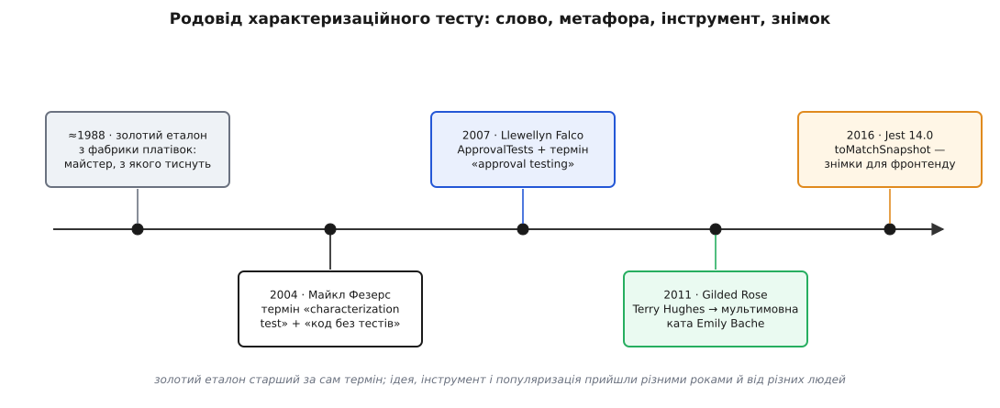

# 📜 Родовід характеризаційного тесту: слово, метафора, інструмент, знімок

Прийом, який ти щойно розібрав, здається позачасовим — ніби «захопи вихід і звіряй далі» існувало завжди. Насправді в нього є родовід, і найдивніше в цьому родоводі те, що його частини народилися в різних світах і в різні десятиліття, а потім зрослися в одне. Було **слово**, яким один інженер звузив ціле поняття. Була **метафора**, яку принесли з фабрики платівок. Був **інструмент**, що перетворив ідею на бібліотеку. Була **вчителька**, яка рознесла прийом по світу через маленьку вправу. І був **день**, коли той самий прийом під новою назвою дістався мільйонів людей, які й не чули перших трьох імен. Розплітати ці нитки варто не з любові до дат, а тому, що зліплювати їх — типова помилка: гадати, ніби знімок вигадали в JavaScript, ніби золотий еталон — то Фезерсова вигадка, ніби «характеризаційний» і «схвальний» — одне слово.


*Чотири шари одного роду: темний — ідея й термін, синій — інструмент, зелений — популяризація, бурштиновий — вихід у широкий загал. Зверни увагу, що метафора золотого еталона старша за сам термін на добрих півтора десятиліття.*

## Слово, яке звузило означення (2004)

Почнемо зі слова, бо саме воно зробило з розрізнених практик техніку з іменем. У 2004 році у видавництві Prentice Hall (серія Роберта Мартіна) вийшла книжка «Working Effectively with Legacy Code» Майкла Фезерса (Michael Feathers). Там і зʼявився термін **характеризаційний тест (англ. *characterization test*)** — тест, що не судить код, а *описує*, характеризує його теперішню поведінку. Це не було відкриттям з нічого: тестозорієнтовані команди в світі TDD і JUnit уже роками імпровізували щось таке, обкладаючи страшний код перевірками. Фезерс дав розсипаній практиці назву, механіку й місце в дисципліні — і саме тому дату відлічують від нього.

Але гучнішим за термін виявилося інше — різке, майже провокативне означення. **Успадкований код (англ. *legacy* — «спадок, спадщина») Фезерс переозначив як просто код без тестів.** Його власне формулювання коротке: «legacy code is simply code without tests» (Feathers, 2004). Доти «legacy» означало «старе, чуже, дороге на утримання»; Фезерс відрубав усі ці відтінки й лишив один операційний критерій — є сітка тестів чи нема. Означення посварило індустрію: багато хто заперечував, що спадковість — це ще й забута бізнес-логіка, згаслі автори, зужита архітектура. Фезерс не сперечався про словники; він показував важіль. Код без тестів не можна міняти безпечно, хоч би який він був чистий, — а отже, саме відсутність сітки, а не вік, робить правку стрибком наосліп. У тій самій книжці він дав інженерії й друге робоче слово — **шов (англ. *seam*)**, точку, де поведінку можна підмінити, не чіпаючи коду навколо; але для нашого родоводу головний його внесок — це **термін** і **означення**.

Статус цих фактів — усталений: авторство терміна за Фезерсом фіксують і довідники, і сама книжка, що досі в друці.

## Золотий еталон приходить із фабрики платівок

Друга половина прийому старша за Фезерса й прийшла зовсім з іншого цеху. Коли вихід коду — не одне число, а ціла сторінка, характеризацію масштабують золотим еталоном; і от **золотий еталон (англ. *golden master*, також *gold master*)** — метафора не з програмування, а з виробництва звуку. У грамофонній справі *майстер* — це затверджений оригінал-диск, з якого штампують, «тиснуть» усі копії платівки: одна освячена матриця, і кожен відбиток мусить збігтися з нею. Пізніше, у добу компакт-дисків, це слово перекочувало в софт: «золотим майстром» звали фінальний білд, готовий до тиражування (**англ. *release to manufacturing*, RTM**) — ту єдину версію, що йшла на завод. У писемних джерелах цей термін фіксують приблизно з кінця 1980-х (найраніше свідчення Оксфордського словника — 1988 рік).

Тепер видно, чому метафора так природно лягла на тести. Її серце — «одна затверджена копія, з якою байт-у-байт звіряють усе подальше». Це рівно те, що потрібне, коли перевіряти очима сотні рядків виходу неможливо: захопи один раз, схвали, а далі щопрогону тисни й порівнюй із матрицею. Фезерсів навмисно-хибний `assert` тримав одне значення; ідея грамофонного майстра дала спосіб тримати цілий вихід. Тож золотий еталон не Фезерс придумав — цю пресформу з фабрики платівок, старшу за його книжку років на пʼятнадцять, просто приварили до його ідеї, щоб та витримала великий вихід. Одна родина, але побачена з іншого кута — з боку **розміру виходу**, а не наявності тестів.

Статус — усталений: походження терміна від індустрії звукозапису задокументоване, як і його значення «фінальна матриця під тираж».

## Схвалення замість ствердження: Llewellyn Falco (≈2007)

Метафора — це ще не інструмент. Щоб «захопи-і-звіряй» стало натиском однієї команди, потрібен був хтось, хто зашиє його в бібліотеку. Приблизно у 2007 році американський розробник Llewellyn Falco (Люеллін Фалко) зробив саме це — написав **ApprovalTests** і назвав підхід **тестуванням схваленням (англ. *approval testing*)**. Термін «approval testing» — його карбування.

Концептуальний хід тут тонкий і вартий того, щоб його помітити. Звичайний тест каже `assert(очікуване, справжнє)` — ти мусиш знати очікуване наперед. Falco перевернув це на **схвалення**: перший прогін просто *захоплює* результат у файл-«отриманий» (`received`), людина один раз дивиться на нього й, якщо той схожий на правду, *схвалює* — перейменовує в «затверджений» (`approved`); далі кожен прогін лише порівнює свіже з затвердженим. Ствердження замінили на схвалення — і завдяки цьому перевіряти можна не лише числа, а будь-який складний обʼєкт, цілу сторінку, дерево, звіт. ApprovalTests від початку робили поліглотним: з роками зʼявилися реалізації під .NET, Java, Ruby, PHP, Python і ще довгий ряд мов — по суті, універсальна бібліотека золотого еталона.

Тут важливо не змазати шар. Фезерс дав **ідею й термін**; Falco дав **інструмент і свій термін** — не синонім Фезерсового, а сусідній кут тієї ж родини. «Характеризаційний» описує *навіщо* (пришпилити поведінку успадкованого коду); «схвальний» описує *як* (через захоплення й людське схвалення, замість ручного `assert`). Їх легко сплутати, бо на практиці вони обіймаються, — але народилися вони в різних головах і з різних потреб. Статус — усталений: Falco задокументований як автор ApprovalTests і карбувальник назви.

## Emily Bache — та, хто навчила прийому

Інструмент лежить мертвим, поки хтось не покаже, як ним жити. Цю роль узяла на себе Emily Bache (Емілі Беш) — британка, що працює з Гетеборга у Швеції, консультантка й технічна тренерка (метод Samman), авторка книжок і відеокурсів. Беш не винаходила ні характеризаційних, ні схвальних тестів; її внесок — **популяризація**: вона роками пояснює, показує наживо й доводить прийом до тисяч інженерів через тренінги та коротку вправу-«ката».

Тією вправою став **Gilded Rose** — тепер канонічна ката для навчання рефакторингу під сіткою. Тут родовід теж вартий точності, бо його часто плутають. Саму кату склав **Terry Hughes (Террі Гʼюз)**, і оригінал був на C#. У 2011 році **Bobby Johnson (Боббі Джонсон)** розписав її у блозі («Refactor This: The Gilded Rose Kata») і навіть радив робити вправу в оригінальному заплутаному C#, бо саме так дістаєш чесний досвід зустрічі з успадкованим кодом. А **Emily Bache** переклала код на десятки мов (нині — понад шістдесят), додала стартовий провальний тест і приладнала текстове тестування схваленням (через TextTest) — і саме її мультимовний репозиторій зробив кату тим, чим вона є сьогодні. Тобто: **склав** — Гʼюз, **розписав і оправив** — Джонсон, **рознесла світом як навчальну вправу** — Беш. Три різні дії, три різні люди; злити їх в одне ім’я — типова недбалість переказу.

Статус — усталений: авторство Террі Гʼюза прямо зазначене в самому репозиторії ката, а версія Беш є де-факто стандартною.

## Знімок для мільйонів: Jest 14.0 (2016)

І нарешті — день, коли прийом вихлюпнувся далеко за межі спільноти legacy-коду. 27 липня 2016 року Facebook разом із командою React випустив **Jest 14.0** із заголовком «React Tree Snapshot Testing» і новим методом `toMatchSnapshot`. Так зʼявилися **знімкові тести (англ. *snapshot testing*)** — і механіка в них рівно та сама, що й у золотого еталона: перший прогін записує знімок поруч, наступні звіряють із ним.

Історична вага цього дня подвійна. З одного боку — тріумф: та сама ідея, що визрівала у Фезерса й Falco для страшного успадкованого коду, тепер, вбудована в найпопулярніший тест-раннер фронтенду, дісталася мільйонів розробників, які ніколи не читали «Working Effectively with Legacy Code». Прийшла вона до світу компонентів фактично **своїм шляхом** — не як відгалуження Фезерса, а як незалежне перевідкриття тієї ж думки під потребу React-дерев. З іншого боку — розчинення: назва «snapshot» від’єднала прийом від його дисципліни. Багато хто почав знімкувати геть усе рефлекторно, обріс велетенськими крихкими `.snap`-файлами й раз у раз чавив `jest -u`, наосліп перезатверджуючи зміни, — тобто наступав рівно на ту пастку, від якої характеризаційна школа застерігала змалку: заморозити шум і штампувати оновлення без погляду. Мейнстрим зробив прийом усюдисущим — і водночас притупив його.

Статус — усталений: реліз Jest 14.0 і поява `toMatchSnapshot` датовані офіційним записом у блозі проєкту.

## Що кому належить

Зведімо родовід докупи так, щоб більше не плутати шарів. Один рід — але чотири різні кути: **навіщо** (пришпилити успадковане), **звідки метафора** (пресформа з фабрики), **чим робити** (бібліотека схвалення), **як навчити** (ката) і **де воно стало масовим** (фронтенд):

```
ІДЕЯ + ТЕРМІН «characterization test»,
   означення «legacy = код без тестів»   →  Майкл Фезерс, 2004 (книжка WELC, Prentice Hall)
МЕТАФОРА «golden master»                  →  фабрика платівок → софт-реліз, ≈1988 (запозичена)
ІНСТРУМЕНТ + ТЕРМІН «approval testing»    →  Llewellyn Falco, бібліотека ApprovalTests, ≈2007
ПОПУЛЯРИЗАЦІЯ (ката як вправа)            →  Emily Bache; сама ката Gilded Rose — Terry Hughes,
                                             розписав Bobby Johnson, 2011
ВИХІД У ЗАГАЛ як «snapshot»               →  Jest 14.0, Facebook + React, 27.07.2016 (toMatchSnapshot)
```

Прочитати цей стовпчик згори вниз — значить побачити, як народжується техніка взагалі: спершу хтось дає їй **слово**, потім із сусіднього ремесла позичають **образ**, далі хтось кує **інструмент**, за ним приходить **учитель**, і аж наприкінці велика платформа робить її **звичкою** для всіх — часто вже без пам’яті про перші три кроки. Тому, коли наступного разу почуєш, що «снепшоти — це щось джаваскриптове», або що «approval і characterization — те саме», або що «золотий еталон вигадав Фезерс», ти знатимеш, котру нитку висмикнули з клубка й куди її треба вернути. Усі пʼять фактів у цьому родоводі — усталені й добре задокументовані; спірного тут нема, є лише те, що легко переплутати.
