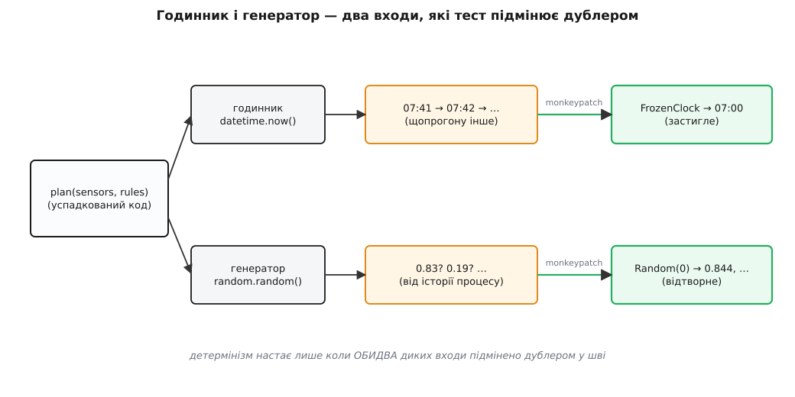
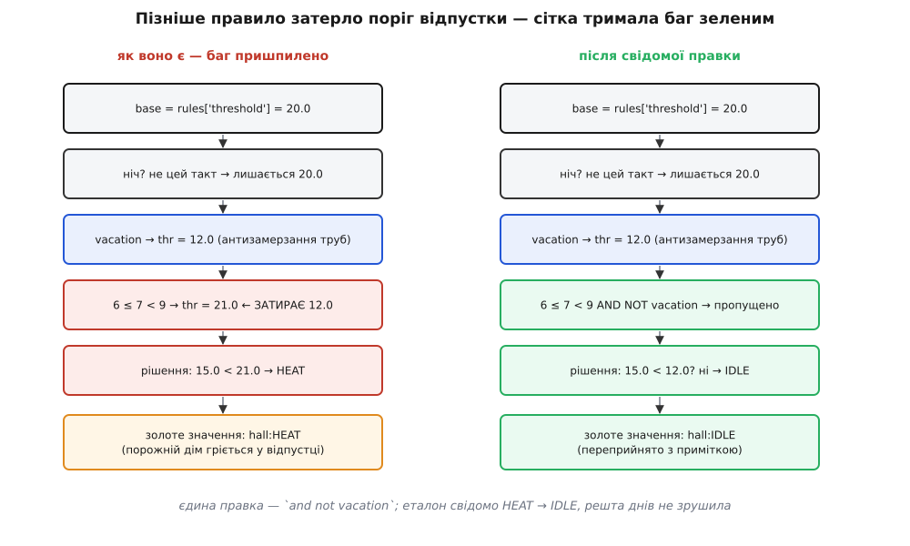

# ⚙️ Сітка над планувальником Digital Homes: повний прогін

Настав час зробити руками все, про що ми говорили, — на живому коді, який кладеться на диск і запускається. Візьмемо найгіршу функцію Digital Homes: планувальник, що з показників давачів і правил користувача вирішує, кому яку команду слати. Її ніхто не проєктував цілісно — вона наросла з десятка «ще одного `if`», автори пішли, тестів нема. І саме її сьогодні треба причесати. Пройдемо всі п'ять ходів по черзі: пришпилимо теперішню поведінку, накриємо довгий вихід золотим еталоном, добудуємо сітку по покриттю, відрефакторимо клубок під зеленим, а наприкінці спіймаємо на гарячому давню ваду — дім у відпустці все одно вмикав обігрів — і виправимо її свідомо. Наскрізна нитка одна: **сітка ловить зміну, а не правильність**, і кожен хід або спирається на це, або на цьому спотикається.

## Клубок, який треба причесати

Ось він, `plan`, — такий, як його знайшли в проді. Дивитися боляче, і це нормально: страшний код і є ціль вправи. Одна функція вирішує все — нічний поріг, відпустку, ранкове прогрівання, збій давача, охолодження, світло за рухом — і робить це впереміш, гілка на гілці.

```py
# scheduler.py — успадкований планувальник Digital Homes.
# Розрісся накопиченням «ще одного if». Тестів нема, автори пішли.
import random
from datetime import datetime


def plan(sensors, rules):
    out = []
    h = datetime.now().hour                       # ← дикий вхід: стінний годинник
    base = rules.get("threshold", 20.0)
    for room in sensors:
        s = sensors[room]
        t = s.get("temp")
        thr = base
        if rules.get("night") and (h >= 23 or h < 6):
            thr = base - 2.0
        if rules.get("vacation"):
            thr = 12.0                            # відпустка: лише антизамерзання труб
        if 6 <= h < 9:
            thr = rules.get("morning", 21.0)      # ранкове прогрівання (дописане згодом)
        if t is None or t != t:                   # None або NaN — давач мовчить
            out.append(room + ":IDLE")
            continue
        if t < thr:
            if random.random() < 0.25:            # ← дикий вхід: «комфортний» буст
                out.append(room + ":HEAT+")
            else:
                out.append(room + ":HEAT")
        elif t > thr + 3.0:
            out.append(room + ":COOL")
        else:
            out.append(room + ":IDLE")
        if s.get("motion") and s.get("lux", 999) < 20:
            out.append(room + ":LIGHT")
    return out
```

Перш ніж чіпати, познач очима два **диких входи**, підкреслені в коментарях. `datetime.now()` тягне поточну годину прямо з системного годинника, а `random.random()` смикає глобальний генератор — і обидва вплетені в саме тіло рішення, без жодного шва. Через них та сама функція на тих самих аргументах видасть **різне** о сьомій ранку й о другій дня, і різне двічі поспіль тієї самої секунди. Запам'ятай ці два місця: вони — головна перешкода на всьому шляху, і саме навколо них крутитиметься другий хід. Читати чужий клубок треба [не ламаючи його наосліп](root:sf-apps/legacy-archaeology) — спершу відбиток, потім скальпель.

## План нападу: п'ять ходів

Ідея цілого прогону вкладається в п'ять рухів, і порядок тут не косметичний — кожен спирається на попередній:

```text
1. пришпилити кілька входів навмисним падінням   → мати перший цвях у стіні
2. накрити довгий вихід золотим еталоном,
   спершу приборкавши час і випадок дублером      → сітка стає відтворною
3. прогнати під покриттям, добити темні гілки     → сітка накриває ВСЕ, що чіпатимемо
4. відрефакторити клубок під зеленою сіткою        → форма інша, поведінка ціла
5. знайти пришпилений баг і свідомо змінити
   золоте значення з приміткою                     → баг лагодимо ОКРЕМИМ ходом
```

Жоден із цих ходів не вимагає, щоб ми **розуміли** `plan` до кінця. У цьому вся сила: сітку чіпляють на код такий, як він є, а розуміння приходить пізніше — під час четвертого ходу, коли клубок уже під страховкою.

## Хід 1. Пришпилити рішення навмисним падінням

Почнемо з найлегшого — з одного входу, де відповідь одна й та сама будь-коли. Ми не знаємо, що `plan` поверне на `22 °C` у вітальні, тож і не вгадуємо: пишемо `assert` зі свідомо хибним очікуванням і хай падіння саме продиктує правду.

```py
# test_plan.py
from scheduler import plan


def test_warm_room_pinned():
    assert plan({"hall": {"temp": 22.0}}, {"threshold": 20.0}) == ["ГАРАЖ"]   # свідома дурниця
```

Проганяємо `pytest -q` і читаємо не «впало», а що саме `pytest` надрукував поруч:

```text
>       assert plan({"hall": {"temp": 22.0}}, {"threshold": 20.0}) == ["ГАРАЖ"]
E       AssertionError: assert ['hall:IDLE'] == ['ГАРАЖ']
E         At index 0 diff: 'hall:IDLE' != 'ГАРАЖ'
```

Ось воно — `['hall:IDLE']`. Копіюємо фактичне у очікуване, і цвях забито:

```py
def test_warm_room_pinned():
    assert plan({"hall": {"temp": 22.0}}, {"threshold": 20.0}) == ["hall:IDLE"]
```

Той самий фокус на ще двох входах, кожен з яких свідомо влучає в гілку без диких входів — тепла кімната під охолодження й німий давач:

```py
def test_hot_room_pinned():
    assert plan({"hall": {"temp": 30.0}}, {"threshold": 20.0}) == ["hall:COOL"]


def test_silent_sensor_pinned():
    assert plan({"hall": {"temp": float("nan")}}, {}) == ["hall:IDLE"]   # NaN → мовчання
```

Три зелені цвяхи, і жодного судження про правильність: може, `22 °C` мала б давати не `IDLE`, а щось інше — байдуже, ми фіксуємо звичку, не намір.

А тепер спробуймо пришпилити **холодну** кімнату — і сітка вперше вкусить нас за руку:

```py
def test_cold_room_pinned():
    assert plan({"hall": {"temp": 15.0}}, {"threshold": 20.0}) == ["hall:HEAT"]
```

Прогони цей тест п'ять разів. Він зеленітиме то на `["hall:HEAT"]`, то падатиме на `["hall:HEAT+"]` — бо `15 °C` заводить у гілку обігріву, а там `random.random()` кидає монету щоразу нову. Ще підступніший сусід:

```py
def test_edge_room_pinned():
    assert plan({"hall": {"temp": 20.5}}, {"threshold": 20.0, "morning": 21.0}) == ["hall:IDLE"]
```

Цей пройде в тебе на машині о третій дня (поріг `20.0`, `20.5` — то `IDLE`) і **впаде на CI о восьмій ранку**, бо між шостою й дев'ятою вмикається ранкове прогрівання, поріг стрибає на `21.0`, і `20.5 < 21.0` дає вже `HEAT`. Тест, що залежить від годинника стінного й від монетки, — не сітка, а сигналізація, що виє від вітру. Поки ці два диких входи живі, характеризувати довгий вихід марно. Отже, наступний хід визначено не примхою, а необхідністю.

## Хід 2. Довгий вихід — золотий еталон, спершу приборкавши час і випадок

Дім живе не одним рішенням, а добою правил: ранок, порожній день, спека, відпустка, глуха ніч. Виписувати кожен рядок такого виходу окремим `assert` — божевілля; його ловлять **цілим шматком** у золотий еталон. Але спершу, як показав перший хід, треба вбити недетермінізм — інакше еталон тремтітиме щопрогону.

Обидва диких входи розчіпляємо тим самим прийомом, що й скрізь у курсі, — [шов і дублер у нього](root:progarch/seams-and-boundaries): шов дає точку підміни, дублер — передбачуване замість справжнього. У Python найчистіший шов тут — **атрибут модуля**: код кличе `datetime.now()` й `random.random()` за іменами, що живуть у просторі імен `scheduler`, тож `monkeypatch` підмінює саме ці імена, **не торкаючись ані рядка** `plan`. Годинник застигає на фіксованій даті, генератор — на сталому зерні.


*Годинник і генератор — два дикі входи, крізь які в функцію тече недетермінізм. Тест підмінює обидва дублером у шві-атрибуті модуля; лише тоді вихід стає відтворним.*

```py
# conftest.py — дублери для ВСІХ характеризаційних тестів планувальника
import random
from datetime import datetime
import scheduler


class FrozenClock:
    """Дублер годинника: .now() завжди віддає ту саму мить."""
    def __init__(self, moment):
        self._moment = moment
    def now(self):
        return self._moment


def freeze(monkeypatch, hour, seed=0):
    # ВАЖЛИВО: FrozenClock будуємо зі СПРАВЖНЬОГО datetime, а не з уже підміненого —
    # інакше на другому виклику підсунемо самі собі зіпсоване ім'я (див. пастки).
    monkeypatch.setattr(scheduler, "datetime", FrozenClock(datetime(2026, 1, 15, hour, 0)))
    monkeypatch.setattr(scheduler, "random", random.Random(seed))   # зерно 0 → відтворно
```

Тепер «доба правил» — це таблиця сценаріїв, кожен зі своєю годиною й своїм зерном; рендеримо всі підряд в один текст і звіряємо з одним затвердженим файлом. Ось характеризаційний тест золотим еталоном — ліворуч ручний Python (щоб видно було механіку до останнього байта), праворуч той самий задум знімком Jest, де інструмент уже вбудував «захопи раз, порівнюй далі»:

:::tabs
```py
# test_golden.py
from pathlib import Path
import random
from datetime import datetime
import pytest
import scheduler
from conftest import FrozenClock

DAY = [
    ("холодний ранок, дім прокидається", 7,
     {"hall": {"temp": 15.2, "motion": True, "lux": 8}, "bed": {"temp": 16.0}},
     {"threshold": 20.0, "night": True, "morning": 21.0}),
    ("робочий день, нікого вдома", 14,
     {"hall": {"temp": 20.5}, "bed": {"temp": 23.0}}, {"threshold": 20.0}),
    ("спекотний полудень", 13,
     {"hall": {"temp": 26.0, "motion": True, "lux": 300}}, {"threshold": 20.0}),
    ("відпустка, прохолодний ранок", 7,
     {"hall": {"temp": 15.0}, "bed": {"temp": 14.0}},
     {"threshold": 20.0, "vacation": True, "morning": 21.0}),
    ("ніч, давач вітальні мовчить", 2,
     {"hall": {"temp": float("nan")}, "bed": {"temp": 17.0}},
     {"threshold": 20.0, "night": True}),
    ("відпустка, мороз", 3,
     {"hall": {"temp": 8.0}}, {"threshold": 20.0, "vacation": True}),
]


def render_day(monkeypatch):
    lines = []
    for label, hour, sensors, rules in DAY:
        monkeypatch.setattr(scheduler, "datetime", FrozenClock(datetime(2026, 1, 15, hour, 0)))
        monkeypatch.setattr(scheduler, "random", random.Random(0))   # зерно на кожен сценарій
        lines.append(f"=== {label} ({hour:02d}:00) ===")
        lines += scheduler.plan(sensors, rules)
    return "\n".join(lines)


def test_day_matches_golden(monkeypatch):
    got = render_day(monkeypatch)
    approved = Path(__file__).parent / "golden" / "day.approved.txt"
    if not approved.exists():                       # перший прогін — нема з чим звіряти
        approved.with_suffix(".received.txt").write_text(got, encoding="utf-8")
        pytest.fail("нема еталона: переглянь day.received.txt і, якщо ок, перейменуй у .approved")
    assert got == approved.read_text(encoding="utf-8")
```
```ts
// scheduler.golden.test.ts — той самий задум знімком Jest
import { renderDay, DAY } from "./scheduler_day";

test("день правил DH — золотий еталон", () => {
  // Jest дає обидва дублери з коробки: фейковий годинник і кероване зерно
  const out = renderDay(DAY, {
    clockAt: new Date("2026-01-15T00:00:00"),   // застиглий час (jest.setSystemTime)
    seed: 0,                                     // сталий генератор
  });
  // перший прогін ЗАПИСУЄ .snap поруч; наступні — звіряють байт у байт
  expect(out).toMatchSnapshot();
  // свідома зміна поведінки згодом → jest -u перезатверджує знімок
});
```
:::

Перший прогін падає з наміром: еталона ще нема, тест лишає `day.received.txt`, людина його **один раз** проглядає очима й, якщо схоже на правду, перейменовує в `day.approved.txt`. Ось що там застигло:

```text
=== холодний ранок, дім прокидається (07:00) ===
hall:HEAT
hall:LIGHT
bed:HEAT
=== робочий день, нікого вдома (14:00) ===
hall:IDLE
bed:IDLE
=== спекотний полудень (13:00) ===
hall:COOL
=== відпустка, прохолодний ранок (07:00) ===
hall:HEAT
bed:HEAT
=== ніч, давач вітальні мовчить (02:00) ===
hall:IDLE
bed:HEAT
=== відпустка, мороз (03:00) ===
hall:HEAT
```

Тепер придивись до передостаннього блоку — «відпустка, прохолодний ранок» видає `hall:HEAT` і `bed:HEAT`. Порожній дім, господарі за тисячу кілометрів, а обігрів гріє обидві кімнати до комфортних градусів. Це виглядає підозріло, і чуйка не бреше — але **зараз ми його не чіпаємо**. Золотий еталон не судить; він фіксує. Підозра почекає до п'ятого ходу; поки що вона просто застигла в еталоні разом з рештою, чесно, як є.

> 🔧 **Навіщо це.** `FrozenClock` і `random.Random(0)` — це [дублери в чистому вигляді](root:progarch/test-doubles-when): підставні предмети, що повертають передбачуване замість справжнього часу й випадковості. Без них золотий еталон технічно неможливий — не можна порівнювати з застиглим знімком те, що змінюється саме від факту порівняння (інша секунда — інша година — інший поріг). Тому детермінізм тут не «покращення тесту», а **передумова** самого прийому: спершу приборкай усі дикі входи, і лише тоді захоплюй вихід. Пропустиш бодай один — і сітка виє від вітру, а команда за тиждень її вимикає.

## Хід 3. Покриття показує темну гілку

Шість сценаріїв — багато чи мало? Читати всі гілки `plan` очима ми зумисне не будемо. Напрям задає не читання, а **покриття**: проганяємо все, що вже є, під інструментом і дивимось, куди сітка ще не дістала.

```text
$ pytest --cov=scheduler --cov-report=term-missing -q
Name           Stmts   Miss Branch BrPart  Cover   Missing
------------------------------------------------------------
scheduler.py      23      0     16      1    98%   25->26
```

Один-єдиний темний слід — гілка `25->26`, тобто істинна вітка `if random.random() < 0.25`, рядок `out.append(room + ":HEAT+")`. Зрозуміло чому: зерно `0` дає першими кидками `0.844` і `0.758`, обидва більші за `0.25`, тож «комфортний» буст під цим зерном не випав жодного разу. Гілка є, а сітка її не тримає — отже, під час рефакторингу її можна зачепити непомітно. Закриваємо прицільно: застигаємо годинник на простий денний поріг і **примушуємо** кидок бути малим, підмінивши сам `random` дублером, що завжди віддає `0.1`.

```py
def test_boost_branch_pinned(monkeypatch):
    monkeypatch.setattr(scheduler, "datetime", FrozenClock(datetime(2026, 1, 15, 14, 0)))
    monkeypatch.setattr(scheduler.random, "random", lambda: 0.1)     # 0.1 < 0.25 → буст напевно
    assert scheduler.plan({"hall": {"temp": 15.0}}, {"threshold": 20.0}) == ["hall:HEAT+"]
```

Прогін під покриттям тепер зелений і **суцільний**: жодної незасвіченої гілки в ділянці, яку збираємось чіпати. І тут-таки нагадаймо собі те, від чого курс не втомлюється застерігати: це `98%` не означають, що `plan` правильний. Вони означають рівно одне — ми **помітимо**, коли він зміниться. Покриття тут компас, а не медаль; воно показало, де в сітці дірка, і ми її залатали, ні на йоту не наблизившись до питання «а чи вірні ці рішення взагалі».

## Хід 4. Рефакторинг під зеленою сіткою

Аж тепер, коли ділянка вся під сіткою, беремося за ніж — [дрібними оборотними ходами](root:progarch/refactoring-safe). Клубок розчіплюємо на дві чесні функції: `_threshold` рахує поріг з правил і години, `_climate` перекладає температуру й поріг у команду. Головна дисципліна ходу — **нічого не міняти по суті**: баг відпустки переїжджає в `_threshold` таким, як був, дикі входи так само лишаються іменами модуля (щоб той самий `monkeypatch` і далі кусав), а `HEAT+`, `LIGHT` та `continue` на німому давачі відтворюються один-в-один.

```py
# scheduler.py — після рефакторингу. ПОВЕДІНКА та сама (баг теж на місці).
import random
from datetime import datetime


def _threshold(rules, h):
    thr = rules.get("threshold", 20.0)
    if rules.get("night") and (h >= 23 or h < 6):
        thr -= 2.0
    if rules.get("vacation"):
        thr = 12.0                                # антизамерзання
    if 6 <= h < 9:
        thr = rules.get("morning", 21.0)          # ← той самий баг переїхав сюди БЕЗ змін
    return thr


def _climate(t, thr):
    if t is None or t != t:
        return "IDLE"
    if t < thr:
        return "HEAT+" if random.random() < 0.25 else "HEAT"
    if t > thr + 3.0:
        return "COOL"
    return "IDLE"


def plan(sensors, rules):
    out = []
    h = datetime.now().hour                        # ім'я модуля лишилось — шов цілий
    for room, s in sensors.items():
        thr = _threshold(rules, h)
        t = s.get("temp")
        if t is None or t != t:                    # німий давач — і світло не чіпаємо
            out.append(room + ":IDLE")
            continue
        out.append(room + ":" + _climate(t, thr))
        if s.get("motion") and s.get("lux", 999) < 20:
            out.append(room + ":LIGHT")
    return out
```

Проганяємо весь набір — три пришпилені входи, буст-гілку й золотий еталон. **Усе зелене, еталон збігається байт у байт.** Ось заради чого городили город: ми переклали кишки функції, а сітка мовчить, і це мовчання — не удача, а доказ, що жодне спостережне рішення не зрушило. Форма інша, поведінка ціла. Той самий баг відпустки, який ми помітили, спокійно тримається зеленим — і тепер, коли код нарешті читабельний, ми **бачимо** його механізм: рядок `if 6 <= h < 9:` затирає щойно виставлений відпусткою поріг `12.0` на комфортні `21.0`, зовсім не питаючи, чи дім у відпустці. Розуміння, якого не було на початку, прийшло само — під сіткою, поки ми рефакторили. Клубок, який ми не наважувалися чіпати, тепер розчеплений на дві функції, що [цілять у ту саму форму, до якої курс вів чистий планувальник](root:progarch/dh-v1-modules), — поріг окремо, клімат окремо, збірка окремо.

## Хід 5. Баг на гарячому: свідома зміна золотого значення

Сітка відпрацювала своє: код зрозумілий, вада видна. Настав час її полагодити — **окремим, свідомим ходом**, а не тишком під час рефакторингу. Правка одна: ранкове прогрівання не сміє чіпати відпустку.

```diff
-    if 6 <= h < 9:
+    if 6 <= h < 9 and not rules.get("vacation"):   # ранок не перебиває відпустку
         thr = rules.get("morning", 21.0)
```

Проганяємо — і золотий еталон **червоніє**, точно й лише там, де мусив:

```diff
  === відпустка, прохолодний ранок (07:00) ===
- hall:HEAT
- bed:HEAT
+ hall:IDLE
+ bed:IDLE
  === ніч, давач вітальні мовчить (02:00) ===
```

Два рядки — і жодного більше. Решта доби не ворухнулась: ранок звичайного дому так само гріється, а найважливіше — «відпустка, мороз» за `8 °C` **лишилась `hall:HEAT`**, бо антизамерзання труб за порогом `12.0` вціліло; ми прибрали комфортне прогрівання порожнього дому, не чіпаючи захисту від морозу. Оце і є вся різниця між зміною спостережної поведінки й тихою поломкою: сітка показала пальцем рівно на дві клітини, які ми свідомо міняємо.


*Пізніше дописане правило ранку затирало поріг відпустки — і сітка сумлінно тримала цей баг зеленим, бо стереже сталість, а не правильність. Свідома правка фліпає рівно два золоті значення; переприймаємо їх з приміткою.*

Тепер найважливіший жест усього прогону — **переприйняти еталон з причиною**. Мовчазний `jest -u` чи бездумне перейменування `.received` у `.approved` тут було б злочином: воно стерло б слід того, що поведінка змінилась, і завтра ніхто б не довів, чи це виправлення, чи регрес. Тому міняємо золотий файл руками й лишаємо примітку — у самому еталоні коментарем, а розлого в комміті:

```text
=== відпустка, прохолодний ранок (07:00) ===
# 2026-07-11: HEAT→IDLE свідомо. Баг: ранкове прогрівання затирало поріг відпустки,
# тож порожній дім грівся до комфорту. Виправлено (scheduler.py: `and not vacation`).
# Антизамерзання (сценарій «відпустка, мороз») навмисно ЛИШЕНО HEAT.
hall:IDLE
bed:IDLE
```

І тут, наприкінці, характеризаційна сітка чесно показує свою межу. Вона жодного разу не сказала нам, що `HEAT` у відпустці — це погано; про правильність вона не знає нічого. Усе, що вона зробила, — заморозила поведінку так міцно, що коли ми **самі** вирішили її змінити, зміна не змогла проскочити непоміченою. Баг знайшли очі й голова, коли рефакторинг зробив код читабельним; сітка лише не дала полагодити його наосліп. Це поділ праці: **сітка стереже сталість, людина відповідає за правильність** — і плутати ці дві ролі якраз і є найтиповіша помилка з усіх.

## Складність і пастки

**Дублер, збудований з уже підміненого імені.** Найпідступніша пастка ховається в самому шві. У `conftest` ми навмисне будуємо `FrozenClock(datetime(...))` зі **справжнього** `datetime`, імпортованого в тестовий модуль. Спокуса — зробити «економніше» й побудувати фіксований час усередині циклу, що вже перезаписав `scheduler.datetime`; на другому обертку `datetime(...)` покличе не клас, а щойно підставлений `FrozenClock` — і все впаде з `TypeError: object is not callable`. Те саме з `random.Random(0)`, якщо будувати його з уже підміненого `scheduler.random`. Правило: **дублер завжди ліпи зі справжнього імені, не з того, яке саме заступаєш.**

**Шов-атрибут ламається від «покращення» сигнатури.** Хтось із добрих намірів вирішить відкрити шов «чистіше» — параметром зі значенням за замовчуванням:

```py
def plan(sensors, rules, clock=datetime, rng=random):   # ← виглядає охайніше
    h = clock.now().hour
```

І `monkeypatch.setattr(scheduler, "datetime", ...)` тихо перестане діяти. Причина тонка: значення за замовчуванням обчислюються **один раз**, коли `def` виконується під час імпорту, і намертво прив'язуються до тих `datetime`/`random`, що були тоді; пізніша підміна імені модуля вже нічого не змінить. Саме тому в четвертому ході дикі входи **лишилися** зверненнями до імен модуля (`datetime.now()`, `random.random()`), а не заповзли в параметри: так той самий `monkeypatch` кусає і після рефакторингу. Якщо параметри таки потрібні, тоді й доводиться передавати дублери аргументами в кожному виклику тесту — інший шов, інша дисципліна.

**Золотий еталон пришпилює й те, чого ти не обіцяв.** Наш вихід випадково закодував купу дрібниць: порядок кімнат (з порядку вставлення в `dict`), формат рядка `room:CMD`, те, що `HEAT+` пишеться з плюсом, а німий давач дає саме `IDLE` без світла. Жодну з цих дрібниць ми свідомо не проєктували — та [за законом Гайрама їх усі вже хтось спожив](root:progarch/what-makes-irreversible/math-hyrum-law.md): парсер логів чіпляється за двокрапку, дашборд сортує за порядком кімнат. Еталон замкнув їх у контракт разом із суттю. Це і сила його (ловить будь-яку зміну), і тягар (червоніє від косметичних правок форматування). Тому характеризаційний еталон — **риштування**: як тільки код зрозумілий, ці випадкові пришпилення по одному заміняють на прицільні перевірки наміру.

**Недетермінізм, який ти не помітив.** Годинник і `random` — очевидні дикі входи, бо ми їх підкреслили. Але їх буває більше й тихіших: порядок обходу `set` чи старого `dict`, `hash()` рядків між запусками процесу (`PYTHONHASHSEED`), плавучий дріб, що по-різному округлюється, локаль у форматуванні дати чи числа, шлях файлової системи. Кожен — прихована ниточка до зовнішнього світу, і золотий еталон, накритий поверх бодай однієї незамороженої, стає тим самим «червоним від вітру». Перед першим схваленням варто спитати про кожне поле виходу: **звідки взялося це значення і чи буде воно таким завтра о іншій годині на іншій машині?**

**Пришпилив баг — і забув, що це баг.** Сітка однаково спокійно тримає зеленим і правильне число, і помилкове. Небезпека не в тому, що вона береже баг, — це її робота, — а в тому, що зелене поле присипляє: пришпиливши підозрілий `HEAT` у відпустці, легко видихнути «працює» й піти далі. Тому підозрілі значення варто помічати **тієї ж миті**, коли вони застигають в еталоні (ми лишили нотатку про відпустку ще на другому ході), а не сподіватись, що згадаєш про них колись потім. Характеризація дає страховку рефакторити; вона не звільняє від обов'язку зрештою полагодити те, що вона вірно зберегла.

**На якому рівні напинати сітку.** Ми накрили цілу функцію `plan`, і для цього клубка це влучний рівень: вхід — прості словники, вихід — список рядків, дикі входи — двоє й обидва досяжні `monkeypatch`. Але якби `plan` сама лізла в базу за правилами й слала команди по мережі, характеризувати її «як є» довелось би [на іншій межі — чи то обгорнувши, чи то піднявши сітку на HTTP-стик](root:progarch/test-boundaries), відкривши там більше швів. Рівень сітки — не даність коду, а рішення: постав її там, де входи детерміновані, а вихід спостережний, і не вище.
