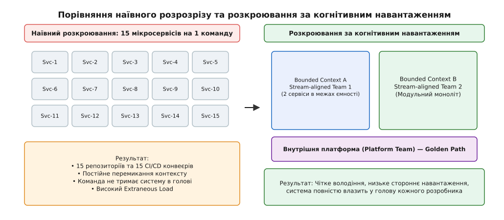
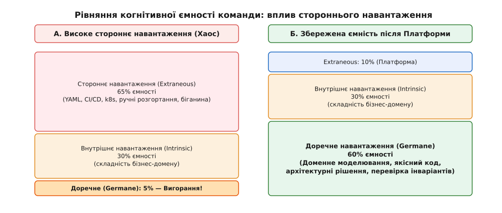
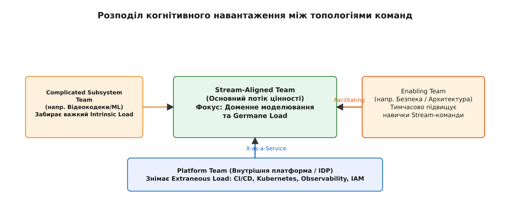
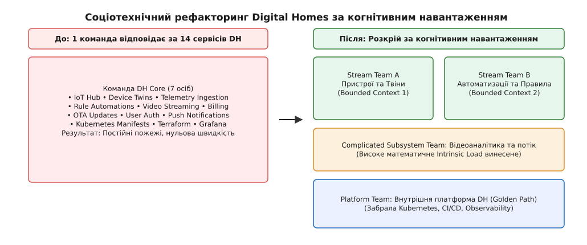

# Когнітивне навантаження як критерій розкрою

<preknowlist>
- [Закон Конвея](topic:programming/conways-law) — структура системи копіює структуру комунікаційних шляхів організації.
- [Обмежений контекст](topic:programming/bounded-context) — межа, у якій доменна модель зберігає єдину мову й суперечностей немає.
- [Мікросервіси](topic:programming/microservices) — автономні сервіси з незалежним деплоєм та власною базою даних.
- [Inverse Conway maneuver](topic:programming/inverse-conway) — свідоме проєктування команд під бажану цільову архітектуру.
</preknowlist>

У команді розробки Digital Homes сім інженерів підтримують чотирнадцять окремих мікросервісів. Формально кожен сервіс видається ідеальним: 2 000–3 000 рядків коду, окрема база даних, власна доменна сутність (`DeviceService`, `AutomationService`, `TelemetryService`, `BillingService`, `VideoService`, `NotificationService`, `OTAUpdateService`). Проте випуск найпростішої фічі — наприклад, додавання нового типу сенсора витоку води — розтягується на три тижні. Інженер змушений відкривати шість Git-репозиторіїв, синхронізувати зміни в трьох gRPC-протоколах, виправляти п'ять конвеєрів CI/CD і власноруч правувати маніфести Kubernetes. Чергування on-call перетворюється на нічне пекло: у разі збою ніхто в команді не здатний осягнути, яка саме мережева взаємодія зламалася. Код сервісів маленький, але система розвалюється під власною вагою.

Ця криза виникає через фундаментальне непорозуміння: межі сервісів провели за технічним розміром коду та чистотою сутностей, повністю ігноруючи скінченну ємність мозоку інженерів, які цю систему тримають.

---

## 1. Пастка «мікро» та межі людської робочої пам'яті

Найпоширеніша помилка першої хвилі мікросервісної архітектури полягала у спробі визначити розмір сервісу за фізичними метриками коду або за принципом «один клас — один сервіс». Інженери рахували рядки коду (LOC), кількість таблиць у базі даних або кількість ендпойнтів API, намагаючись зробити сервіси якомога дрібнішими. Назву «мікросервіс» сприйняли як вимогу до фізичного мінімалізму.

Проте системна складність нікуди не зникає — вона лише змінює агрегатний стан. Коли велику монолітну систему розрізають на двадцять дрібних шматочків, внутрішньомодульні виклики у спільній пам'яті перетворюються на мережеві виклики HTTP/gRPC. Місцеві інваріанти стають вимогами до кінцевої узгодженості, а виклики функцій — серіалізацією JSON та розподіленими трасуваннями. Якщо кожен з двадцяти сервісів став простішим усередині, то **простір між сервісами** став у десятки разів складнішим і балакучішим.



*Наївний розрозріз на 15 дрібних сервісів змушує одну команду жити в постійному інфраструктурному шумі. Соціотехнічне розкроювання групує домени під ємність команди та спирається на платформний Golden Path.*

Тут діє фундаментальне психофізіологічне обмеження: людська робоча пам'ять (англ. *working memory*, від лат. *labor* — праця та *memoria* — пам'ять) має суворо обмежений обсяг. Класичні дослідження Джорджа Міллера оцінювали ємність пам'яті як 7±2 елементи, проте сучасні праці Нельсона Коуена довели, що для активної свідомості ця межа становить лише **4±1 концептуальних блоки** (сутностей або зв'язків).

У розробці програмного забезпечення ментальний блок — це не просто рядок коду чи назва функції. Це повна ментальна модель компонента:
- Доменні бізнес-правила, обмеження та інваріанти.
- Поведінка системи під час мережевих збоїв та таймаутів.
- Конфігураційні файли, ролі доступу та інфраструктурні залежності.
- Процедури моніторингу, трасування та регламенти чергування on-call.
- Залежності від суміжних API та матриця зворотної сумісності.

Коли команда з 6–8 осіб змушена відповідати за 14 мікросервісів, сумарна кількість ментальних блоків, потрібних для безпечного внесення змін, сягає кількох десятків. Окремий інженер фізично не здатний утримати таку систему в голові. Внесення змін починає супроводжуватися острахом: інженери перестають розуміти побічні наслідки своїх дій, PR висять днями через брак контексту у рев'юерів, а будь-яке відволікання вимагає 30–45 хвилин на повернення ментального контексту.

Метрика «кількість рядків коду» виявилася фальшивим орієнтиром. **Справжньою межею розміру та кількості сервісів є когнітивне навантаження інженерної команди.**

---

## 2. Три грані когнітивного навантаження в інженерії

Термін «когнітивне навантаження» (англ. *cognitive load*, від лат. *cognitio* — пізнання) прийшов у системну архітектуру з педагогічної психології Джону Свеллера. Перехід цієї концепції від навчання школярів до операційної моделі розробки завдячує працям Дена Норта, Меттью Скелтона та Мануеля Пайса; докладніше цей шлях розкрито у [вивченні історії від психології Свеллера до Team Topologies](root:progarch/conway-and-teams/cognitive-load-as-boundary/hist-sweller-to-team-topologies.md).

Скелтон і Пайс адаптували класичні три типи навантаження Свеллера до щоденного життя інженерних команд. У будь-який момент часу сумарна ємність робочої пам'яті команди описується рівнянням:

```
Ємність пам'яті команди = Внутрішнє (Intrinsic) + Стороннє (Extraneous) + Доречне (Germane)
```

де кожна складова відповідає за окремий тип ментальних зусиль:

1. **Внутрішнє навантаження (Intrinsic Load, від лат. *intrinsecus* — усередині):** складність, притаманна самому бізнес-домену та алгоритмам проблеми. Наприклад, у Digital Homes це розрахунок тарифів електроенергії, алгоритми обробки відеопотоку або машини станів Zigbee-пристроїв. Внутрішнє навантаження не можна знищити рефакторингом інфраструктури — це суть справи, за яку бізнес отримує гроші.
2. **Стороннє навантаження (Extraneous Load, від лат. *extraneus* — зовнішній, чужий):** паразитні зусилля, витрачені на боротьбу з інструментами, інфраструктурою та рутинними процедурами. Це ручне написання YAML-маніфестів Kubernetes, налагодження зламаного конвеєра CI/CD, боротьба з нестикованими версіями бібліотек, складна процедура розгортання та ручне створення топіків у брокері повідомлень. Це **чисте сміття**, яке не створює жодної цінності для користувача.
3. **Доречне навантаження (Germane Load, від лат. *germanus* — справжній, належний):** ментальна енергія, потрачена на створення доменної моделі, проєктування чистих інтерфейсів, пошук кращих архітектурних рішень та захист інваріантів. Саме ця робота створює якісний продукт і стійку систему.



*Коли стороннє навантаження забирає 65% ємності мозоку, на доречну доменну роботу лишаються лічені відсотки. Платформний Golden Path зрізає сторонній шум і повертає простір для продуктового дизайну.*

Оскільки загальна когнітивна ємність людського мозоку фіксована, існує пряма конкуренція між цими трьома складовими. Якщо стороннє навантаження забирає 60% ресурсів команди (через недозрілі інструменти та хаос у репозиторіях), а внутрішня складність домену вимагає 35%, то на доречне навантаження залишається лише 5%.

У такому стані команда не здатна думати про якість коду чи проєктування меж. Інженери працюють у режимі постійного «гасіння пожеж», припускаються безглуздих помилок на prod і швидко вигорають.

Глибинний аналіз усіх трьох складових із конкретними прикладами у коді, домені та інфраструктурі зібрано у [структурному порівнянні граней когнітивного навантаження](root:progarch/conway-and-teams/cognitive-load-as-boundary/comp-cognitive-load-facets.md).

---

## 3. Когнітивне навантаження як первинний критерій розкрою

Усвідомлення обмеженості когнітивної ємності змінює первинне питання архітектурного розкрою. Замість того щоб питати: *«Чи є ця сутність окремим мікросервісом?»* або *«Чи має цей сервіс бути меншим за 5 000 рядків коду?»*, архітектор мусить спитати:

> **«Чи здатна ОДНА інженерна команда повністю володіти, розвивати, розгортати та експлуатувати цей компонент без перевищення своєї когнітивної ємності?»**

Цей підхід пов'язує розкрій коду з парадигмою **«You Build It, You Run It» (YBIYRI)**. Володіння сервісом означає не лише написання коду в `src/`. Воно включає:
- Повне розуміння доменних бізнес-правил та обмежень.
- Проєктування та підтримку схем баз даних і міграцій.
- Налаштування та підтримку конвеєра CI/CD.
- Моніторинг, трасування, алертінг та чергування on-call 24/7.
- Управління еволюцією API та зворотною сумісністю.

Якщо один сервіс (або група з 10 мікросервісів) вимагає більше знань та операційних зусиль, ніж здатна нести одна Stream-aligned команда, межу відповідальності проведено **неправильно**.

```
[ Наївна оптимізація коду ]   →  Ріжемо на 20 сервісів  →  Вибух Extraneous Load  → Команда вигорає
[ Соціотехнічний розкрій ]  → Оцінюємо ємність мозоку → Одне володіння = 1 Context → Швидкий потік (Fast Flow)
```

Звідси випливає радикальний висновок для вибору між мікросервісами та модульним монолітом:

1. **Багато дрібних мікросервісів на одну команду — це архітектурна помилка.** Поділ єдиного обмеженого контексту на 5 дрібних сервісів у межах однієї команди не зменшує складність, а створює гігантське **стороннє навантаження** (5 репозиторіїв, 5 CI/CD, мережева затримка між ними, складне трасування). Для однієї команди краще мати один **Модульний Моноліт** з чіткими внутрішніми межами або 2–3 автономні сервіси.
2. **Величезний моноліт на 15 команд без меж — це також помилка.** Коли 100 інженерів пишуть у один репозиторій без поділу володіння, **внутрішнє та комунікаційне навантаження** перевищує межі: постійні конфлікти злиття (merge conflicts), зламані білди та невизначена відповідальність за інваріанти.
3. **Ідеальна межа розкрою** проходить там, де [обмежений контекст](topic:programming/bounded-context) природно лягає на ємність однієї Stream-aligned команди, а простір між контекстами є вузьким, небалакучим і не вимагає спільних транзакцій.

> 🔧 **Навіщо це.** Коли на рев'ю архітектури хтось пропонує: «Давайте винесемо сервіс сповіщень, сервіс SMS та сервіс email в окремі 3 репозиторії», ви оцінюєте не естетику коду, а рахунок за когнітивне навантаження. Спитайте: хто буде чергувати on-call за ці 3 репо? Скільки CI/CD ми додамо? Якщо відповідь — «та сама наша команда з 4 людей», то цей розрозріз — шкідливе подвоєння стороннього навантаження. Залиште їх модулями всередині одного сервісу, доки не з'явиться окрема команда.

---

## 4. Три режими взаємодії команд та їхня когнітивна ціна

Розкрій системи вимагає спроєктувати не лише внутрішні межі сервісів, а й **спосіб перемовин між командами**, які ними володіють. У концепції Team Topologies визначено три режими взаємодії між командами, кожен з яких має принципово різну когнітивну ціну:

### 1. Режим Співпраці (Collaboration)
Дві команди працюють разом над спільною межею або новим API протягом обмеженого часу (наприклад, 2–4 тижні).
- **Когнітивна ціна:** Дуже висока. Вимагає частих зустрічей, спільного проектування, обговорення деталей та вирівнювання ментальних моделей.
- **Коли застосовувати:** Лише під час дослідницьких фаз (Discovery), коли межа між двома доменами ще незріла і потребує спільного нащупування.
- **Ризик:** Постійна співпраця (Collaboration як постійний стан) означає, що межу проведено неправильно. Команди злипаються в одну неформальну мега-команду з гігантським комунікаційним навантаженням.

### 2. Режим «X-як-Сервіс» (X-as-a-Service)
Одна команда надає компонент, сервіс або платформу як чітко документовану послугу для інших команд.
- **Когнітивна ціна:** Вкрай низька. Споживачам не потрібно знати внутрішній устрій сервісу — вони лише використовують стабільне API, SDK або інфраструктурний портал.
- **Коли застосовувати:** Зрілі межі між Stream-командами та Платформою (Platform Team), або між двома Stream-командами, чиї домени стабільні.
- **Вимога:** Вимагає від команди-постачальника високої дисципліни версіонування та документації, щоб споживачі не ходили в Slack за роз'ясненнями.

### 3. Режим Сприяння (Facilitating)
Одна команда (найчастіше Enabling Team — команда фасилітації чи безпеки) допомагає іншій опанувати нові навички, інструменти чи підходи.
- **Когнітивна ціна:** Помірне тимчасове навантаження. Збільшує ємність Stream-команди на майбутнє без постійного розширення штату.
- **Коли застосовувати:** Впровадження нової бази даних, підходів безпеки (SecOps) чи платформних Golden Paths.

```
[ Collaboration ]   → Високий зв'язок, дослідження меж  (Тимчасово!)
[ X-as-a-Service ]  → Низький зв'язок, стабільний контракт (Цільовий стан!)
[ Facilitating ]    → Навчання та передача досвіду       (Тимчасово!)
```

Правильна соціотехнічна архітектура прагне звести більшість постійних взаємодій до режиму **X-as-a-Service**, мінімізуючи комунікаційне навантаження між Stream-aligned командами.

---

## 5. Важелі управління когнітивним навантаженням

Коли аудит показує, що команда перебуває у зоні перевантаження (індекс когнітивного навантаження перевищує допустиму норму), в архітектора є три основні важелі впливу.



*Stream-aligned команда фокусується на доменній цінності. Платформа (Platform Team) забирає стороннє інфраструктурне навантаження, а Complicated-Subsystem команда бере на себе важку математичну чи вузькоспеціалізовану логіку.*

### Важіль 1: Зниження стороннього навантаження через Platform Engineering

Найшвидший і найдешевший спосіб вивільнити ментальну ємність команди — це не розрізати код далі, а **очистити її інженерне середовище від інфраструктурного шуму**.

Для цього в організації створюється **Платформна команда (Platform Team)**. Вона розглядає внутрішню інфраструктуру як продукт для інших розробників. Платформа будує так званий **«Золотий шлях» (Golden Path або Paved Road)**:
- Готові шаблони сервісів, де спостережність (Traces, Metrics, Logs), аутентифікація, конфігурації та CI/CD уже налаштовані за еталонними стандартами.
- Внутрішній портал розробника (Internal Developer Platform — IDP, наприклад Backstage), який дозволяє створити новий сервіс, виділити базу даних або розгорнути staging-середовище в один клік без написання купи маніфестів Kubernetes.

Коли платформна команда зрізає стороннє навантаження з 60% до 10%, у Stream-aligned команди миттєво вивільняється 50% когнітивної ємності. Вони можуть продовжувати спокійно підтримувати свої домени, не звертаючись до шкідливого розрозрізу коду.

### Важіль 2: Виділення складності у Complicated-Subsystem Team

Якщо джерелом перевантаження є не інфраструктура, а **висока внутрішня складність (Intrinsic Load)** — наприклад, математика опрацювання відеопотоків, складний аналіз часових рядів чи власна криптографія, — намагатися навчити цієї математики всіх інженерів продуктової команди марно.

Рішенням за Team Topologies є виділення **Команди складної підсистеми (Complicated-Subsystem Team)**:
- Ця команда складається з вузьких фахівців (наприклад, інженерів з обробки відео або математиків).
- Вона повністю забирає на себе складну підсистему, ховаючи її за чітким, стабільним і просто сформульованим API.
- Для основної Stream-aligned команди цей складний вузол перетворюється на готовий чорний ящик, взаємодія з яким вимагає мінімуму когнітивних зусиль.

### Важіль 3: Реорганізація меж домену та об'єднання сервісів (Merge)

Якщо одна команда володіє кількома дотепер розрізаними мікросервісами і страждає від постійних міжрепозиторних правок, правильним архітектурним кроком є **зворотне об'єднання (Merge)**:
- Два чи три дрібні мікросервіси, які постійно змінюються разом (сильне [зчеплення за змінами](topic:programming/change-coupling)), зливаються в один сервіс або Модульний Моноліт.
- Мережеві виклики gRPC замінюються на звичайні виклики функцій у пам'яті.
- Викреслюється зайва інфраструктура, а межа відповідальності стає єдиною й монолітною для цієї команди.

---

## 6. Практичний аудит та оцінка когнітивного навантаження

Оцінка когнітивного навантаження не повинна спиратися на суб'єктивні відчуття головуючого інженера. Вона вимагає регулярного аудиту, який поєднує опитування команди та якісну Git-телеметрію.

### Головні індикатори перевищення когнітивного навантаження:

1. **PR Lead Time (Тривалість життя PR):** Pull Request висить у статусі очікування рев'ю понад 48 годин. Це означає, що колеги не мають вільної когнітивної ємності, щоб вникнути в чужий складний контекст.
2. **Cross-Repo Change Ratio (Частка міжрепозиторних правок):** Понад 30% фіч вимагають одночасного внесення правок у 2 або більше репозиторіїв. Це явний сигнал того, що межа сервісів порізала єдиний контекст і створила паразитне зчеплення.
3. **On-call Anxiety (Страх чергування):** Розробники бояться чергувати on-call, оскільки у 50% випадків сповіщення стосуються сервісів, внутрішнього устрою яких вони не розуміють.
4. **Key-Person Dependency (Незамінні люди):** У команді є сервіси, торкатися коду яких дозволено лише одній конкретній людині («артефакт Василя»).

Діагностику здійснюють за допомогою розрахунку **Cognitive Load Index (CLI)**, формула якого враховує баланс доменного, стороннього та комунікаційного навантаження:

```
Score_Domain = (Q1 + Q2 + Q3 + Q4) / 4
Score_Extraneous = (Q5 + Q6 + Q7 + Q8) / 4
Score_Comm = (Q9 + Q10 + Q11 + Q12) / 4

CLI_base = (0.35 · Score_Domain) + (0.45 · Score_Extraneous) + (0.20 · Score_Comm)
```

Повний практичний інструментарій з опитувальником, розбором метрик та готовим Python-скриптом аналізу Git-репозиторіїв наведено в [практичному аудиті когнітивного навантаження команди](root:progarch/conway-and-teams/cognitive-load-as-boundary/proj-cognitive-load-audit.md).

---

## 7. Архітектурні фітнес-функції для контролю когнітивних меж

Щоб запобігти непомітному накопиченню когнітивного навантаження у міру еволюції продукту, зріла архітектурна практика впроваджує **автоматизовані архітектурні фітнес-функції (Architectural Fitness Functions)**.

Фітнес-функції перевіряють соціотехнічний стан системи на кожному етапі конвеєра CI/CD:

1. **Контроль кількості репозиторіїв на команду:** Автоматичний скрипт CI перевіряє співвідношення активних репозиторіїв до кількості розробників у метаданих команди. Якщо відношення перевищує 1.5, білд видає застереження про когнітивне перевантаження.
2. **Аналіз парного зачеплення змін (Change Coupling Guard):** Аналітичний моніторинг Git аналізує останні 100 комітів. Якщо два окремі сервіси модифікуються в одному коміті частіше, ніж у 35% випадків, CI генерує архітектурне попередження про необхідність об'єднання меж (Merge).
3. **Автоматична перевірка меж за допомогою ArchUnit / ArchGuard:** Тести архітектурної відповідності перевіряють, що модулі усередині сервісу не звертаються до приватних класів сусідніх контекстів повз виділені фасадні контракти.

```
[ Git Commits & PRs ] ──> [ ArchUnit / Fitness Script ] ──> [ CLI Alert if Coupling > 0.35 ]
```

Завдяки автоматизованим фітнес-функціям соціотехнічний стан системи контролюється не суб'єктивними думками на ретроспективах, а безперервною інженерною телеметрією.

---

## 8. Соціотехнічний порочний цикл (Sociotechnical Debt Dynamics)

Нехтування когнітивним навантаженням викликає небезпечну самопосилювану спіраль архітектурної деградації — **соціотехнічний борговий цикл**:

```
Перевищення когнітивної ємності
 └──> Брак часу на роздуми та дизайн (Germane Load = 0)
       └──> Швидкі «брудні» рішення та костилі (Hacks)
             └──> Зростання сторонньої складності (Extraneous Load)
                   └──> Подальше зниження свободи мозоку розробника!
```

1. Коли стороннє навантаження з'їдає весь вільний ресурс робочої пам'яті, інженери втрачають можливість проводити системний рефакторинг або проєктувати чисті доменні інваріанти.
2. Під тиском дедлайнів команда вимушена застосовувати найпростіші локальні рішення — дописувати `if`-комахи, обходити шари адаптерів, створювати прямі виклики до чужих баз даних.
3. Ці швидкі хаки створюють нове стороннє навантаження та приховане зчеплення (Coupling).
4. Наступна фіча вимагає ще більше ментальних зусиль для аналізу побічних ефектів, замикаючи соціотехнічний борговий цикл.

Єдиним способом розірвати це замкнене коло є вольове архітектурне втручання: тимчасове сповільнення продуктового потоку заради **платформізації або об'єднання зчеплених сервісів**.

---

## 9. Соціотехнічний рефакторинг Digital Homes

Повернімося до кризи в Digital Homes, з якої почалася стаття. Сім інженерів розривалися між 14 мікросервісами, витрачаючи 70% часу на гасіння інфраструктурних пожеж та чергування on-call.

Архітектурна група провела соціотехнічний рефакторинг системи, поставивши **когнітивне навантаження команд як первинний критерій розкрою**:



*Трансформація Digital Homes: виділення Platform Team зрізало інфраструктурний шум, Complicated Subsystem забрала математику відео, а дві Stream-aligned команди отримали автономні доменні межі.*

### Крок 1: Зняття стороннього навантаження (Platform Team)
Створено платформну команду з 2 інженерів. Вона розгорнула для Digital Homes внутрішній платформний портал та Golden Path на базі Kubernetes та Helm:
- Сервіси розгортаються за єдиним стандартом.
- Прочісування логів, трасування OpenTelemetry та алертінг у Slack працюють «з коробки».
- Спільні інфраструктурні сервіси (`BillingService`, `NotificationService`, `AuthService`) винесені на загальнокорпоративний рівень і надаються як X-as-a-Service.

### Крок 2: Виділення складності (Complicated Subsystem)
Сервіс `VideoService` (декодування відеопотоків H.265, виявлення руху, аналіз кадрів) вимагав унікальних знань обробки сигналів та C++-бібліотек. Його винесли в окрему підсистему під опіку спеціалізованої команди **Video Engine Team**. Для решти системи він став простим gRPC-сервісом, який віддає готові події «помічено рух».

### Крок 3: Перенарізання доменних меж (Stream-aligned Teams)
Команду з 7 інженерів розділили на дві автономні Stream-aligned команди, узгодивши їхні межі з обмеженими контекстами:

- **Team A (Device Core):** відповідає за контексти `IoT Hub`, `Device Twins` та `Telemetry Ingestion`. Їхній код згруповано у два стабільні сервіси. Вони володіють усім, що стосується фізичного заліза й стану пристроїв.
- **Team B (Smart Automations):** відповідає за контекст `Rule Engine` та сценарії автоматизації. Вони споживають події стану пристроїв через асинхронну шину повідомлень і не турбуються про механіку розшифровки Zigbee-пакетів.

### Деталізований контракт між Stream-командами DH:
Щоб мінімізувати когнітивне навантаження між Team A та Team B, взаємодія побудована на асинхронних подіях зміни стану (Event-Driven Architecture) замість синхронного RPC:

```json
{
  "eventId": "evt_9876543210",
  "eventType": "device.state_changed",
  "timestamp": "2026-08-18T10:15:00Z",
  "deviceId": "dev_door_front_01",
  "homeId": "home_442",
  "payload": {
    "property": "contact",
    "value": "open",
    "previousValue": "closed"
  }
}
```

Завдяки цьому асинхронному контракту Team B (Smart Automations) не мусить бігати мережею з питанням «а який стан дверей?» і не тримає в голові внутрішню схему бази даних пристроїв Team A. Контракт є вузьким, адитивним і працює у режимі **X-as-a-Service**.

### Результат соціотехнічного рефакторингу:

| Параметр аналізу | Стан до рефакторингу | Стан після рефакторингу |
| :--- | :--- | :--- |
| **Співвідношення сервісів і команд** | 14 сервісів / 1 команда | 2–3 сервіси / 1 Stream-команда |
| **Час випуску нової фічі (Lead Time)** | 3 тижні | 2 дні |
| **Частка стороннього навантаження (Extraneous)** | 65% (хаос у K8s / CI/CD) | 12% (Golden Path від платформи) |
| **Час повернення контексту після переключення** | 45 хвилин | < 5 хвилин |
| **Чергування on-call** | Нічні аварії, паніка | 0 нічних сповіщень, спокій |

Розрозріз системи пройшов не за лінійкою коду і не за фантазіями про «мікро», а за **природними швами когнітивної ємності людей**.

---

## 10. Крайові випадки та ризики соціотехнічного розкрою

Свідомий розкрій системи за когнітивним навантаженням вимагає від архітектора обережності та урахування чотирьох поширених ризиків:

1. **Передчасна платформізація (Premature Platforming):** Спроба створити Платформну команду на самому початку стартапу, коли продукт іще шукає свою ринкову нішу (Product-Market Fit). На цьому етапі інфраструктурне стороннє навантаження є мінімальним, і створення окремої платформи забирає цінні інженерні ресурси у бізнес-продукту.
2. **Синдром кустарних платформ (Bespoke Platform Trap):** Платформна команда починає будувати надмірно складні власні абстракції поверх Kubernetes чи хмарних сервісів, які самі по собі стають джерелом додаткового стороннього навантаження для Stream-команд. Платформа має бути простішою за підлежачу інфраструктуру, а не складнішою за неї.
3. **Передчасне дроблення команд (Premature Team Splitting):** Розділення невеликої команди з 4 людей на дві по 2 особи «під майбутній масштаб». Двоє інженерів не мають достатньої ємності для забезпечення стійкого володіння сервісом (Bus Factor = 1, відпустки та хвороби повністю блокують роботу). Оптимальний розмір Stream-aligned команди становить 5–8 осіб.
4. **Нехтування еволюцією домену:** Когнітивне навантаження не є статичним. У міру зростання системи домен, який 3 роки тому легко вміщався у 1 сервіс, може розростися й потребувати поділу. Аудит CLI необхідно проводити систематично під час кожного великого планування або реорганізації.

---

## 11. Соціотехнічний баланс: система та її творці

Головний урок когнітивного розкрою полягає у зміні фундаментального світогляду архітектора: **програмна система не існує у вакуумі ізольованих серверів. Вона існує лише в нерозривному зв'язку з людьми, які її будують та експлуатують.**

Закон Конвея стверджує, що структура системи відображає структуру комунікацій організації. Когнітивне навантаження додає до цього закон фізичного обмеження: **архітектура системи не може бути складнішою, ніж ментальна модель, яку здатна утримати в голові її інженерна команда.**

Коли ви будуєте соціотехнічний баланс, ви гарантуєте, що кожен інженер має достатній ментальний простір для створення елегантних абстракцій, надійних контрактних тестів та якісного доменного дизайну. Система перестає бути джерелом виснаження та стає керованим, прозорим інструментом створення бізнес-цінності.

Спроба ігнорувати людський фактор на користь теоретичної чистоти мікросервісів чи нескінченного дроблення коду завжди закінчується однаково: вибухом стороннього навантаження, втратою контролю над інваріантами та вигоранням інженерів. Проєктуйте межі контекстів і сервісів так, щоб вони відповідали ємності робочої пам'яті ваших команд — і тоді система поверне вам швидкістю, якістю та стійкістю.
