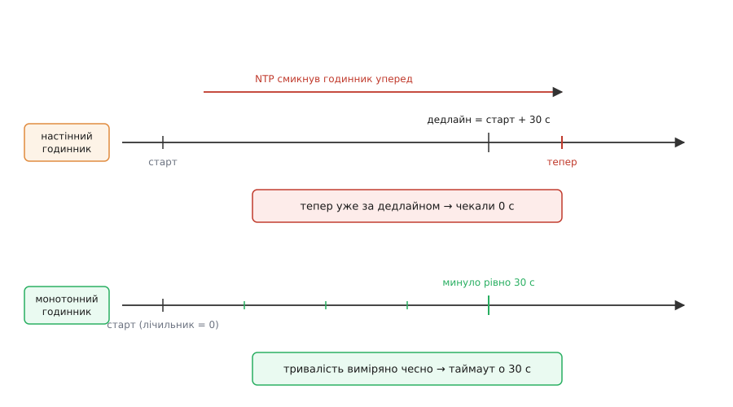
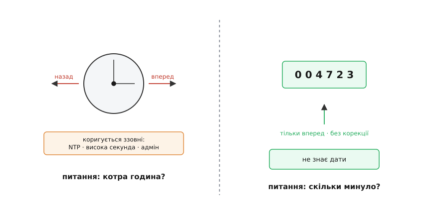
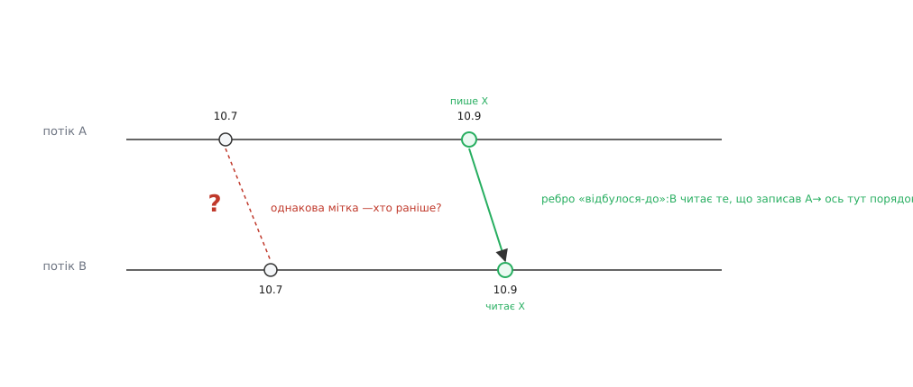
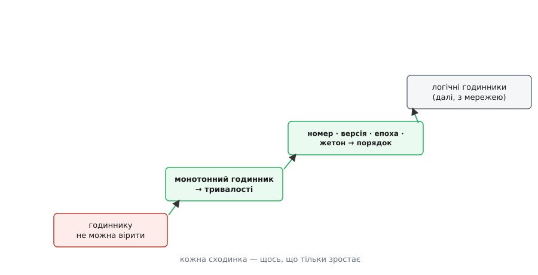

# Годинник і монотонність у конкурентності

<preknowlist>
- [Дрейф годинників](book:communications/clock-offset-drift) — кварц у кожній машині цокає трохи інакше, тож «настінний» годинник увесь час то спішить, то відстає, і його доводиться підправляти ззовні.
</preknowlist>

Увесь цей модуль був про те, як улаштувати конкурентне виконання: потоки й замки, актори з поштовими скриньками, канали CSP, цикл подій із таймерами, пул потоків, backpressure. І в кожному з цих механізмів, якщо придивитися, ховається час. Таймаут. Дедлайн. Пауза перед повторною спробою. Порядок, у якому прийшли повідомлення. Ми весь час запитуємо «котра година?» і «скільки вже минуло?» — і робимо це так звично, що не помічаємо пастки.

А пастка коштує падінь. Ось характерний баг, на якому валилися справжні сервіси: тридцятисекундний таймаут, що спрацьовує **миттєво** — або програма, що падає, бо тривалість вийшла **від'ємною**. На новорічну ніч 2017-го частина DNS-системи Cloudflare, написана мовою Go, відняла один момент часу від іншого — і дістала від'ємне число там, де різниця часу не може бути меншою за нуль. Це від'ємне значення потрапило у функцію випадкового вибору, яка на від'ємний аргумент відповідає падінням, — і процес панікнув. Причина, як згодом написали самі інженери, — сама віра, що час не може йти назад.

Розберімо по-фейнманівськи, від першопричини, **чому** час у конкурентній програмі так підступний, — і побачимо, що весь клубок розв'язується однією простою ідеєю.

## Два запитання, які ми плутаємо

Годинник — це, зрештою, лічильник, що цокає. Але ми питаємо в нього дві геть різні речі, і саме на їхньому змішуванні виростає баг.

Перше запитання: **котра зараз година?** Його ставлять, щоб узгодитися зі світом — з людиною, що читає лог, із календарем, з іншою машиною. Відповідь має бути прив'язана до спільного часу всієї планети.

Друге запитання: **скільки часу минуло** між двома подіями, або **що сталося раніше?** Його ставлять усередині програми: чи вичерпався таймаут, скільки тривала операція, у якому порядку лягли записи. Тут спільний час планети байдужий — важить лише різниця й черговість.

Це два різні виміри, і для них потрібні **два різні інструменти**. Спроба відповісти на друге запитання приладом, зробленим для першого, — і є той негативний час у Cloudflare.

## Настінний годинник бреше

Прилад для першого запитання — **настінний годинник** (англ. *wall-clock time* — той, що «на стіні»: показує громадянський час, дату й хвилини). Саме його повертає звичне `now()` у більшості мов, і саме він показує «15:42, 1 січня». Операційна система тримає його узгодженим зі світовим часом UTC (фр. *Temps Universel Coordonné* — навмисне несиметрична абревіатура компромісу між англійською й французькою) через протокол NTP (англ. *Network Time Protocol*) — фонову службу, що звіряє наш годинник з еталонними серверами.

І ось у чому корінь біди. Кварц кожної машини трохи [дрейфує](book:communications/clock-offset-drift) — то спішить, то відстає. Щоб настінний годинник не розійшовся з реальністю, система **безперервно підправляє** його до еталона. А підправляти — означає **зсувати**: і вперед, і **назад**. NTP може смикнути годинник назад на пів секунди, бо той забіг наперед. Адміністратор може перевести його руками. Літній час стрибає на годину. Раз на кілька років у UTC вставляють **високосну секунду** — зайву `23:59:60`, щоб атомний час не втік від обертання Землі.

Висновок жорсткий: **між двома читаннями настінного годинника час може піти назад.** Тому будь-який код, що міряє тривалість відніманням двох `now()`, збудований на піску. Стрибнув годинник назад між `старт` і `фініш` — різниця від'ємна. Стрибнув уперед — тривалість роздута. А тепер згадай той дедлайн:

```
дедлайн = now() + 30с        # порахували момент у майбутньому
while now() < дедлайн:        # чекаємо, поки настінний час дійде до нього
    ...
```

Перевів адміністратор годинник на добу вперед — і `now()` уже за дедлайном: чекали нуль секунд. Смикнув NTP назад — і цикл висітиме зайву вічність.



*Один і той самий дедлайн на двох годинниках. Настінний стрибок ламає очікування — воно спрацьовує миттєво; монотонний лічильник міряє тривалість незворушно.*

Саме на такому зашпортнулася половина інтернету 30 червня 2012-го, коли висока секунда збила таймери в ядрі Linux і сервіси по всьому світу закрутилися на сто відсотків процесора. [Ланцюг цих аварій — від 2012-го через Cloudflare до рішення взагалі скасувати високосну секунду — вартий окремої розповіді](root:progarch/concurrency-and-clocks/hist-leap-second-outages.md): це найкращий доказ, що настінний час — не для вимірювань. Досить сказати, що вся індустрія раз за разом наступала на ті самі граблі.

## Монотонний годинник — тільки вперед

Прилад для другого запитання — **монотонний годинник** (гр. *mónos* — один + *tónos* — тон, натяг; монотонний той, що змінюється лише в один бік). Це лічильник, що почав рахувати від якогось довільного моменту — зазвичай від увімкнення машини — і **тільки збільшується**. Його ніхто не коригує до еталона, він не знає про UTC, про високосні секунди, про переведення стрілок. NTP може хіба що плавно підправити **темп** його цокання, але ніколи не смикне назад.

За це доводиться платити: монотонний годинник **не скаже тобі дату**. Його нуль нічого не означає — сьогодні це «12309 секунд від завантаження», завтра після перезапуску відлік почнеться наново. Одне-єдине його читання — беззмістовне. Але **різниця** двох читань — чесне, ніколи не від'ємне число секунд. А це рівно те, чого просить таймаут, дедлайн і тривалість.

Кожна серйозна мова дає обидва годинники під різними іменами — треба лише свідомо брати правильний. Ось той самий вимір тривалості: спершу так, як робити **не можна**, потім як треба.

:::tabs
```py
# НЕПРАВИЛЬНО: настінний час — його скоригує NTP, і тривалість збрешеться
start = time.time()               # секунди від епохи; NTP їх посуває
work()
elapsed = time.time() - start     # може вийти від'ємним або роздутим

# ПРАВИЛЬНО: монотонний годинник — тільки вперед, корекція його не чіпає
start = time.monotonic()
work()
elapsed = time.monotonic() - start  # чесні секунди, хай там що з годинником
```
```go
// Від Go 1.9 правильний вибір — уже за замовчуванням:
start := time.Now()            // несе І настінне, І монотонне читання водночас
work()
elapsed := time.Since(start)   // віднімання бере монотонне — стрибок не страшний

// Пастка: .Round(0) чи серіалізація СКИДАЮТЬ монотонну складову,
// лишаючи голий настінний час — і тоді різниця знову може стрибнути назад.
```
:::

Той самий поділ живе під різними іменами всюди. У C++ — `std::chrono::steady_clock` (монотонний) проти `system_clock` (настінний). У Rust — окремі типи `Instant` проти `SystemTime`: вони **різні**, тож випадково відняти одне від одного просто не дасть компілятор. У Java — `System.nanoTime()` (лише для тривалостей) проти `currentTimeMillis()`. У JavaScript — `performance.now()` проти `Date.now()`. Правило скрізь однакове: **тривалість — монотонним, дату — настінним**, і не плутати стовпці.

Показово, як розв'язали цю пастку в Go. Після хвилі падінь на кшталт того, новорічного, у версії 1.9 (2017) зробили так, що `time.Now()` тихо несе **обидва** читання одразу, а віднімання й порівняння самі беруть монотонне. Правильний прилад став **типовим**, щоб на нього не треба було свідомо перемикатися. Те саме зробив і Python, увівши `time.monotonic()` окремою функцією саме проти цього класу помилок.



*Два прилади під одним словом «годинник». Лівий відповідає «котра година?» і за це має право стрибати; правий відповідає «скільки минуло?» і за це ніколи не йде назад.*

> 🔧 **Навіщо це.** Правило коротке й рятує від цілого класу нічних інцидентів: **усе, що є тривалістю, міряй монотонним годинником.** Таймаут запиту, дедлайн операції, пауза між повторами (backoff), обмежувач частоти, час життя запису в кеші, будь-який бенчмарк — усе це різниця двох моментів, і настінному годиннику тут не місце. Настінний бери лише там, де показуєш людині дату або домовляєшся про час зі світом, — і завжди пам'ятай, що він може стрибнути.

## Годинник — не суддя порядку

Тепер друга грань тієї самої проблеми, тонша. Здавалося б: якщо годинник точний, то й **порядок** подій він розсудить — у кого мітка часу менша, той і був раніше. Це оманливо навіть на одній машині.

Уяви два потоки, кожен ставить своїй події мітку через `now()`. По-перше, роздільність годинника скінченна — обидві мітки легко можуть збігтися до останньої цифри, і «хто раніше» зникає. По-друге, і головне: навіть якби годинник був нескінченно точний і спільний, він **усе одно не впорядкував би** ці дві події. Бо якщо між ними немає зв'язку «відбулося-до» — жоден потік не чекав на інший, не брав того самого замка, не читав того, що записав інший, — то вони **справді одночасні**. Немає факту, «котра раніше», який програма могла б прочитати, бо нічого цей порядок не встановлювало.

Звідси висновок, що суперечить інтуїції: **порядок у конкурентній програмі не читають з годинника — його виготовляють синхронізацією.** Це саме те, [що ми вже бачили](book:programming/data-races-locks): відношення «відбулося-до» створює замок, атомарна операція з бар'єром пам'яті, надсилання в канал і читання з нього, черга повідомлень актора. Ти вже знаєш це з цього ж модуля: канал видає повідомлення в порядку надсилання, поштова скринька актора серіалізує їх одне за одним — **порядок задає сам механізм**, а не позначка часу на них. Годинник — не примітив синхронізації; він міряє час, але не творить черговості.



*Мітки часу двох незалежних потоків не дають надійного порядку — вони можуть збігтися чи переставитися. Порядок з'являється лише там, де є ребро «відбулося-до», проведене синхронізацією.*

> 🔧 **Навіщо це.** Практичне правило-близнюк до першого: **ніколи не впорядковуй події за міткою часу** — ні між потоками, ні пізніше між сервісами. Саме тому журнал подій носить наскрізні номери-зсуви, а не час; рядок у базі носить версію; розподілений замок видає **жетон-загорожу** (англ. *fencing token*) — число, що росте з кожною видачею, аби відсіяти застряглого старого власника. Хто впорядковує за годинником — той рано чи пізно переплутає причину з наслідком.

## Монотонність — спільна форма ліків

Придивися тепер до обох рецептів разом — і побачиш, що це один рецепт. Для тривалості ми взяли лічильник, що **тільки росте** (монотонний годинник). Для порядку й свіжості — знову лічильник, що **тільки росте** і яким **ти сам керуєш**: номер послідовності, версія, епоха (гр. *epokhḗ* — зупинка, момент відліку), номер покоління, той самий фенсинг-жетон.

Ось де змикається назва теми. **Монотонність** — це і є спільна форма ліків. Щойно тобі в конкурентності потрібен порядок або відповідь на питання «це ще актуальне?», ти не тягнешся до настінного годинника, який може збрехати, — ти **карбуєш щось монотонне**, одну-єдину величину, що ніколи не йде назад, і будуєш гарантію на ній. Це надійніше за фізичний час, бо не залежить від NTP, кварцу й адміністратора: величину контролюєш ти.



*Одна ідея на всіх рівнях: коли часу вірити не можна, будуй те, чому вірити можна, — величину, що тільки зростає.*

Ця сама звичка масштабується далі, ніж одна машина. [Робочий приклад, де дедлайн, backoff і обмежувач частоти зроблені на монотонному годиннику, а замок — на фенсинг-жетоні](root:progarch/concurrency-and-clocks/proj-monotonic-deadline.md), показує карбування монотонності в коді впритул: як провести спільний бюджет часу крізь ланцюжок викликів і як відсіяти застряглого власника замка. А коли далі в курсі з'явиться **мережа** і спільного годинника не стане взагалі, той самий інстинкт виросте в [логічні годинники](book:algorithms/lamport-clocks) — монотонний лічильник на кожному вузлі, що відновлює причинність без жодного фізичного часу. Це вже наступні модулі; тут важливо, що зерно посаджено на одній машині.

## Що лишається в руках

Дві прості дисципліни, і обидві — про те, щоб не довіряти настінному годиннику зайвого.

Перша: **будь-яку тривалість** — таймаут, дедлайн, паузу-backoff, обмеження частоти, час життя в кеші, бенчмарк — міряй **монотонним** годинником. Настінний лиши для одного: показати людині дату чи домовитися про час зі світом, — і завжди чекай, що він стрибне.

Друга: **будь-який порядок** чи свіжість — ніколи не визначай за мітками часу конкурентних учасників. Карбуй монотонну величину, якою керуєш сам (номер, версію, епоху, жетон), або дай черговість самому механізму синхронізації.

Обидві дисципліни — одна ідея під двома масками: коли самому часові вірити не можна, ти будуєш ту єдину гарантію, яку збудувати можна, — щось, що **тільки зростає**. Тримаючи в руках цей монотонний важіль, ми готові поставити конкурентності останнє запитання цього модуля: а **чим** її, власне, вимірювати — і що ті виміри означають.
