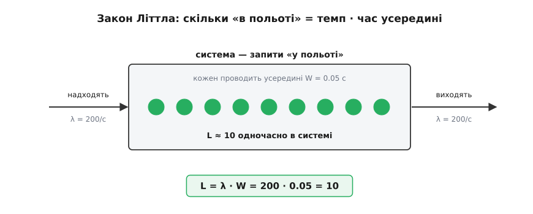
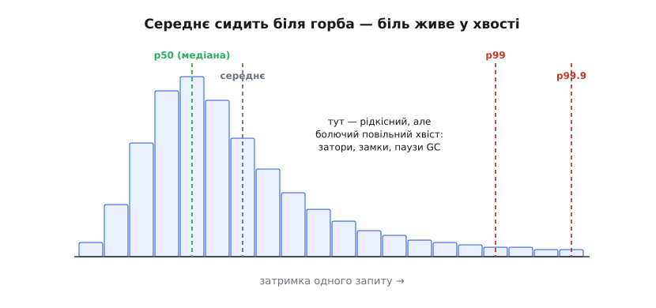
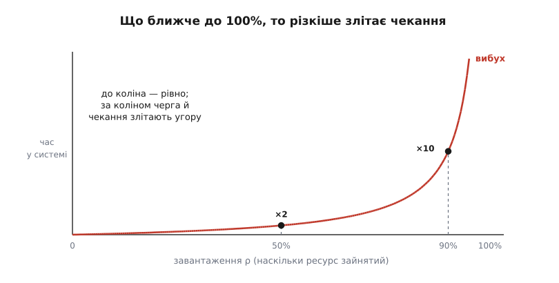
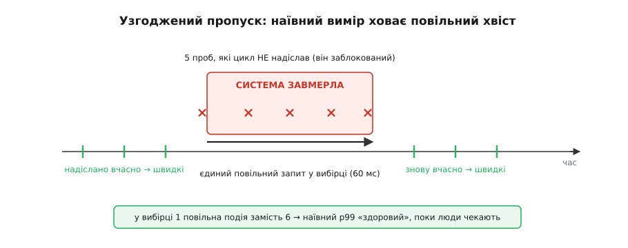

# Чим вимірюємо конкурентність

<preknowlist>
- [Перцентилі й хвости](topic:math/percentiles-quantiles) — p99 = значення, під яке вкладаються 99 вимірів зі ста; чому середнє ховає рідкісний, але болючий повільний хвіст.
</preknowlist>

Весь цей модуль ми будували машинерію конкурентності — потоки й замки, актори й канали, цикл подій, async, пули, протитиск — і врешті обрали рантайм під Digital Homes. Лишилося питання, від якого нікуди не дітися: а звідки ти знатимеш, що обране справді працює?

Підступність конкурентності в тому, що в коді її не видно. Функція, яку ти щойно написав, читається однаково — і коли її смикає один запит на секунду, і коли тисяча запитів навалюються разом і починають битися за той самий замок, за той самий пул, за ту саму чергу. Різниця не в тексті програми, а в її поведінці під навантаженням. А поведінка під навантаженням — це числа. Тож остання розмова модуля — про прилади: що навести на живу конкурентну систему, щоб побачити, здорова вона чи вже задихається.

Одразу відмежуймося. Раніше в курсі була [спостережність як тестованість](root:progarch/observability-as-testability) — там ішлося про те, ЯК система звітує про себе: логи, метрики, трасування, SLO. Тут інше питання — не «як зібрати сигнал», а ЩО САМЕ вимірюють у конкурентності: які нечисленні числа насправді описують одночасну роботу і як вони брешуть.

## Три величини, і вони не вільні одна від одної

Здавалося б, вимірів безліч. Насправді все зводиться до трьох.

- **Пропускна здатність** (англ. *throughput*) — скільки одиниць роботи за секунду проходить крізь систему. Позначмо темп надходження (він же темп виходу, коли система стабільна) через λ.
- **Затримка** (англ. *latency*, з лат. *latere* — «бути прихованим») — скільки часу одна одиниця проводить у системі від входу до виходу. Позначмо W.
- **Заповненість** — скільки одиниць перебуває в системі *водночас*, «у польоті». Позначмо L. Оце L і є конкурентність у числі: не «скільки в тебе ядер», а скільки роботи справді триває просто зараз.

Найкрасивіше — що ці три не незалежні. Уяви крамницю: якщо щосекунди заходять 200 покупців і кожен проводить усередині 0.05 секунди, скільки їх у крамниці будь-якої миті? За секунду ввійшло 200, але кожен пробув лише двадцяту частку секунди — отже, у кожен момент усередині приблизно 200 · 0.05 = 10 людей. Це не оцінка й не емпірика, це тотожність:

```
L = λ · W
```

Її звуть **законом Літтла**: формулу роками вживали як народну мудрість, аж поки 1961 року Джон Літтл не дав їй перший загальний доказ. І доказ цей приголомшливий тим, чого в ньому НЕМА: жодних припущень про те, як саме розподілені надходження чи час обслуговування, яка дисципліна черги. Аби система була стабільна — рівність тримається завжди. [Звідки взялася сама звичка міряти навантаження — від телефонних станцій до доказу Літтла](root:progarch/concurrency-observability/hist-queueing-birth.md) — окрема коротка розповідь; формальний бік — у [законі Літтла](topic:math/littles-law).



*Три величини конкурентності зв'язані однією тотожністю: скільки роботи «в польоті» = темп надходження, помножений на час, який кожна одиниця проводить усередині.*

Чому це важить саме тут. Закон Літтла зшиває предмет усього модуля — конкурентність L — із двома речами, які відчуває користувач: темпом λ і затримкою W. І це важіль. Щоб W не росла, коли λ підіймається, треба обмежити L — не дати системі набирати нескінченно багато роботи «в польоті». Саме це роблять розмір [пулу потоків](topic:programming/thread-pool) і [протитиск](topic:programming/backpressure-local), які ми проходили: вони ставлять стелю на L. Обернімо рівність — і дістанемо стелю пропускної:

```
λ = 200 запитів/с        (стабільно: скільки ввійшло, стільки й вийшло)
W = 0.05 с               (кожен проводить усередині 50 мс)
L = λ · W = 200 · 0.05 = 10 одиниць «у польоті» одночасно

той самий закон навпаки — стеля темпу для обмеженого пулу:
пул = 8 робітників        (L не може перевищити 8)
λ_макс = L / W = 8 / 0.05 = 160 запитів/с
```

Проси в цього пула більше за 160/с — і робота почне накопичуватися в черзі перед ним, а W поповзе вгору. Один рядок арифметики сказав те, на що інакше пішов би цілий день навантажувального тесту.

> 🔧 **Навіщо це.** Закон Літтла — найдешевший прилад у наборі: маючи будь-які два числа з трьох, третє дістаєш без експерименту. Черга перед сервісом підозріло глибока? Помнож темп на затримку — і побачиш, скільки роботи мало б бути «в польоті»; якщо реальність більша, десь застрягло. Це ще й перевірка приладів на брехню: виміряне лічильником L мусить дорівнювати λ·W — розбіжність означає, що якийсь із трьох приладів бреше.

## Середнє — брехун, дивись у хвіст

Друга величина, затримка, ховає пастку. Спокуса — згорнути її в одне число: «середня затримка 40 мс». Але затримка — не число, а розподіл. Одні запити пролітають за 5 мс, інші застрягають на пів секунди, і середнє розмиває цю різницю в безпорадну кашу.

А в конкурентності хвіст цього розподілу — не дрібниця, а найголовніше. Бо саме конкурентність його й роздуває: одному запиту не пощастило — застряг за замком, який тримає сусід; інший потрапив під паузу збирача сміття; третій прийшов у мить, коли черга була повна. Кожна така пригода зачіпає НЕ всі запити, а декотрі — і саме вони летять у хвіст. Тому дивляться не на середнє, а на [перцентилі](topic:math/percentiles-quantiles): p99 — межа, під яку вкладаються 99 запитів зі ста, p99.9 — 999 з тисячі.



*Середнє сидить біля горба розподілу, а біль користувача — у правому хвості, куди конкурентність зганяє нещасливі запити: затори, чекання на замку, паузи збирача сміття.*

І тут конкурентність підкидає особливо злий поворот. Уяви запит, який усередині розгалужується на сто дрібних викликів (типова картина, коли одна дія чіпає багато частин системи) і мусить дочекатися їх усіх. Він рухається зі швидкістю найповільнішого з тієї сотні. Якщо кожен окремий виклик має цілком пристойний p99 — «раз на сто буває повільним», — то серед сотні викликів майже напевно знайдеться бодай один повільний. Хвіст окремої частини стає ТИПОВОЮ поведінкою цілого. Цей ефект Джефф Дін і Луїс Андре Барросо назвали «хвостом на масштабі» (*The Tail at Scale*, 2013): у великій розгалуженій системі навіть рідкісні затримки зачіпають помітну частку запитів. Ось чому p99 сервісу диктується p99 його складників — і чому середнє тут не просто неінформативне, а оманливе.

> 🔧 **Навіщо це.** Ціль надійності — SLO, яку ми вішали на дерево корисності ще в першому модулі, — завжди пишуть на перцентилі, не на середнє: «99% команд швидше за 300 мс». Бо користувач живе не в середньому, а у власному запиті; якщо той запит потрапив у хвіст, йому байдуже, що комусь було швидко. Мірятимеш середнє — матимеш зелений графік і сердитих людей.

## Чому двигун не крутять на 100%

Третій прилад — завантаження (англ. *utilization*), позначмо ρ: яку частку часу ресурс зайнятий. І тут криється найпротиінтуїтивніше в усій темі.

Здоровий глузд каже: 100% завантаження — це ефективно, ми викручуємо із заліза все. Насправді 100% завантаження — це «ось-ось упаде». Бо коли ρ повзе до одиниці, час у системі росте не рівно, а вибухово. Груба, але правильна за формою оцінка з теорії черг: час у системі пропорційний 1/(1−ρ).

```
завантаження ρ    середній час у системі (× час обслуговування однієї одиниці)
0.50              1 / (1 − 0.50) =   2×
0.80              1 / (1 − 0.80) =   5×
0.90              1 / (1 − 0.90) =  10×
0.99              1 / (1 − 0.99) = 100×
```

Придивись до чисел. Від 50% до 90% ти нібито «дозавантажив» ресурс менш ніж удвічі — а чекання зросло вп'ятеро. Ще від 90% до 99% — і воно збільшилося ще вдесятеро. Це і є коліно кривої: до нього все спокійно, за ним — обрив.



*До коліна завантаження додає роботи майже задарма; за коліном кожен відсоток коштує вибухового зростання черги й чекання. Тому конкурентну систему не тримають на 100%.*

[Чому саме 1/(1−ρ) і звідки береться це коліно](root:progarch/concurrency-observability/math-utilization-wait.md) — виводимо окремо. Практичний висновок простий: 100% на графіку зайнятості — не привід радіти, а привід тривожитися.

Але завантаження — прилад запізнілий. Коли ρ уперлося в 100%, вибух уже стався. Тому насправді стежать не за ним, а за випереджальним сигналом — **насиченістю**: наскільки глибоко росте черга перед ресурсом. Черга, що подовжується, — це пряме, видиме свідчення, що надходження обганяє обслуговування (темп входу перевищив темп виходу) і W ось-ось злетить. Глибина черги — чи не найважливіше окреме число в конкурентній системі, і саме воно вмикає протитиск: коли черга росте, система мусить почати відмовляти або гальмувати джерело, а не мовчки набирати роботу, якої не подужає.

> 🔧 **Навіщо це.** Автомасштабування, що реагує на «CPU 90%», завжди спізнюється — на 90% чекання вже вп'ятеро довше за норму. Автомасштабування, що реагує на глибину черги, ловить біду, поки вона ще попереду. Правило: завантаження кажи постфактум, а рішення приймай за насиченістю.

## Прилади, специфічні саме для конкурентності

Три величини й завантаження — універсальні. Поверх них є жменя сигналів, що кажуть не «погано взагалі», а *де саме* конкурентність б'ється сама з собою — і кожен лягає на той рантайм, який ти обрав у [рішенні модуля](root:progarch/runtime-choice):

- **Глибина черги / беклог** — той самий сигнал насиченості. Росте — ти падаєш позаду.
- **Насиченість пулу** — скільки робітників зайнято зі скількох і скільки задач чекає на вільного. Пул, де всі зайняті, а черга росте, — це L, що вперлося в стелю.
- **Суперництво за замки** (англ. *contention* — «змагання») — сумарний час, який потоки провели, чекаючи на замок, і частота перемикань контексту. Багато перемикань і довге чекання на замку означають, що потоки не працюють, а штовхаються.
- **Лаг циклу подій** — для рантайму на [циклі подій](topic:programming/event-loop): скільки минуло між «мало виконатися» і «виконалося». Якщо хтось заблокував цикл синхронною роботою, лаг стрибає, і за ним стоїть уся черга подій.

Спільне тут одне: майже кожен із цих приладів — це прихована черга або прихована затримка. І тривалість завжди міряють монотонним годинником, а не настінним, — як ми щойно бачили в [розмові про годинники](root:progarch/concurrency-and-clocks): настінний може стрибнути назад посеред виміру й дати від'ємну затримку. Як завести всі ці сигнали в конвеєр команд Digital Homes — глибину черги, насиченість пулу, лаг циклу, живу перевірку L = λ·W і алерт на ріст черги — [зібрано окремим кроком-проєктом](root:progarch/concurrency-observability/proj-dh-concurrency-signals.md).

## Пастка виміру: узгоджений пропуск

І наостанок — найпідступніше, бо тут бреше не система, а сам твій прилад.

Уяви найпростіший навантажувальний тест чи запис затримок: надіслати запит, дочекатися відповіді, записати, скільки зайняло, надіслати наступний. Ниточка логіки здається бездоганною. Але сховай у ній затик: система на мить завмерла на 60 мілісекунд. Що робить твій цикл? Він теж стоїть — чекає на ту одну відповідь. А отже, НЕ надсилає ті п'ять запитів, що мали піти під час затику й кожен виміряв би довге чекання. Затик проковтнув рівно ті проби, які були б повільними, — і у вибірці лишилася одна повільна подія замість шести. Твій p99 сяє здоров'ям, поки живі користувачі сидять і чекають.

Цю ваду виміру Гіл Тене (Azul Systems) назвав **узгодженим пропуском** (англ. *coordinated omission* — «узгоджене упущення»): вимірювач мимоволі «змовляється» із системою й пропускає саме викиди. Ліки — дати пробам розклад і рахувати затримку від *запланованого* моменту відправлення, а не від тієї миті, коли черга нарешті дійшла:

:::tabs
```go
// Наївно: надіслати, дочекатися, тоді надіслати наступний.
// Якщо система завмерла — ми просто НЕ шлемо проби, що мали б бути повільними.
for i := 0; i < n; i++ {
    t0 := time.Now()
    doRequest()                  // затик тут спиняє й сам вимірювальний цикл
    record(time.Since(t0))       // у вибірці лише те, що встигли надіслати
}

// Правильно: у проб є ГРАФІК. Затримку рахуємо від planned-часу,
// а не від миті, коли черга нарешті до неї дійшла.
interval := time.Second / time.Duration(rps)
start := time.Now()
for i := 0; i < n; i++ {
    planned := start.Add(time.Duration(i) * interval)
    doRequest()
    record(time.Since(planned))  // включає й час, що проба прочекала в затику
}
```
```py
# Наївно: надіслати, дочекатися, тоді надіслати наступний.
# Якщо система завмерла — ми просто НЕ шлемо проби, що мали б бути повільними.
for _ in range(n):
    t0 = perf_counter()
    do_request()                  # затик тут спиняє й сам вимірювальний цикл
    record(perf_counter() - t0)   # у вибірці лише те, що встигли надіслати

# Правильно: у проб є ГРАФІК. Затримку рахуємо від planned-часу,
# а не від миті, коли черга нарешті до неї дійшла.
interval = 1 / rps
start = perf_counter()
for i in range(n):
    planned = start + i * interval
    do_request()
    record(perf_counter() - planned)  # включає й чекання проби в затику
```
:::



*Наївний вимір «надіслав — дочекався — надіслав» під час затику не надсилає саме повільні проби — і у вибірці лишається одна повільна подія замість шести. Хвіст зникає з графіка, але не з досвіду користувача.*

> 🔧 **Навіщо це.** Дашборд може брехати на твою користь — і це небезпечніше за відверту помилку, бо тішить. Будь-яка цифра затримки, знята за схемою «надіслав — дочекався — надіслав», занижує хвіст рівно там, де болить найдужче. Тому серйозні інструменти (HdrHistogram, wrk2 того ж Тене) виправляють узгоджений пропуск, а не вдають, що його нема.

## Набір інструментів

Отже, весь прилад конкурентності зводиться до невеликого, зв'язаного набору. Три величини — пропускна, затримка (як розподіл, не середнє) і заповненість — тримаються купи законом Літтла. Завантаження каже, наскільки ти близько до коліна; насиченість, тобто глибина черги, — випереджальний сигнал біди й спусковий гачок протитиску; сигнали суперництва кажуть, де саме конкурентність буксує. Наведи це на конвеєр Digital Homes — і побачиш, тримається обраний рантайм чи ні, ще до того, як зателефонує перший роздратований мешканець. Головна умова — міряти чесно: хвіст, а не середнє, і без узгодженого пропуску.

Модуль ми відкрили тим, що конкурентність — це не паралелізм, а спосіб упорядкувати роботу, що триває водночас. Тепер у нас є, чим цю роботу побачити. Далі курс переходить від «як усе рухається одночасно в одній машині» до питання, що станеться, коли процес перезапуститься, а робота має пережити цей перезапуск, — до сховища.
