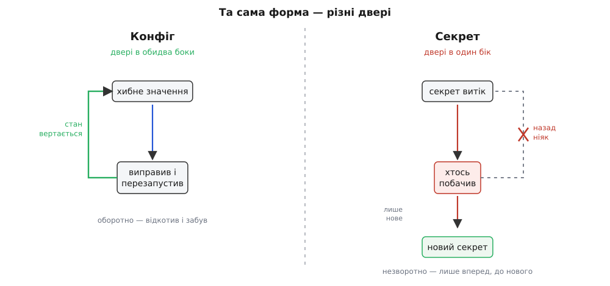

# Конфіг проти секретів

<preknowlist>
- [Дванадцять факторів (The Twelve-Factor App)](book:programming/twelve-factor) — конфіг зберігають у середовищі, окремо від коду: той самий артефакт їде в усі світи, а різне заходить ззовні при запуску. Секрети їдуть тим самим каналом — і саме тому їх легко сплутати з рештою конфігу.
</preknowlist>

Розбираючи [конфігурацію](book:programming/config-design), ми провели одну межу — між кодом і конфігом — і мимохідь зачепили другу: одним абзацом там сказано, що «секрети — не звичайний конфіг». Цей крок робить ту другу межу головною. Бо вона підступніша за першу: конфіг і секрет **на вигляд однакові**, а поводитися з ними доводиться протилежно.

Подивись на два рядки, що заходять у застосунок тим самим каналом — змінними середовища:

```
DB_HOST     = prod-db.internal
DB_PASSWORD = 7Kd9-x2Lm4pQ...
```

Обидва — рядки. Обидва різняться між світами: на твоїй машині одні, у проді інші. Обидва їх упорскує платформа при запуску. За [дванадцятьма факторами](book:programming/twelve-factor) обидва — конфіг, той самий пласт «середовище». Формою — близнюки. То навіщо ділити те, що виглядає однаково?

Бо вони однакові за формою й **протилежні за наслідком помилки**. Переплутав хост — застосунок сходив не туди, ти виправив значення, перезапустив, і по всьому. Виказав пароль — і його вже **хтось бачив**; забрати це назад не можна ніколи. Уся стаття — про те, чому ця різниця в наслідку така велика, де саме проходить лінія між конфігом і секретом, і як міняється поводження, щойно ти цю лінію переступив.

## Однакові на вигляд, протилежні за наслідком

Найперше — вловити асиметрію, бо з неї виводиться геть усе інше.

Помилка в конфізі **оборотна й місцева**. Задав не той порт, не ту адресу, надто балакучий рівень логів — наслідок обмежений цим запуском, а ліки прості: підстав правильне значення й перезапусти. Був стан поганий — став добрий, наче нічого й не було. Це та сама [оборотність рішення](root:progarch/what-makes-irreversible), про яку ми говорили в модулі про невизначеність: двері, крізь які легко повернутися назад.

Виказаний секрет — двері в один бік. Пароль, ключ до чужого сервісу, токен, приватний ключ шифрування — щойно значення побачили не ті очі, ти не можеш зробити так, **щоб його не бачили**. Копію вже зняли, запам'ятали, зберегли. Ти можеш скільки завгодно видаляти файл, чистити логи, міняти права — тих, хто вже підгледів, це не стосується. Тому й ліки інші: не «прибрати назад», а **знецінити** — зробити старий секрет непотрібним, замінивши його новим (про це за хвилину). Помилка конфігу коштує перезапуску; витік секрета коштує заміни всього, що тим секретом захищалося.



*Та сама форма — рядок у середовищі, — але різні двері. Конфіг: помилку відкотив і забув. Секрет: витік не відкочується; єдиний рух — уперед, до нового значення, після чого старе стає сміттям.*

Звідси й точне визначення. **Секрет (лат. *secretus* — відокремлений, потаємний)** — це не «трохи чутливе значення», а таке, що дає **здатність діяти**: хто його має, той може читати чужі дані, видати себе за твою систему, витратити твої гроші. Володіння = сила. Звичайний конфіг лише **налаштовує** поведінку; секрет **відмикає** її.

Практичний тест, щоб відрізнити одне від одного, простий і трохи жорстокий. Не питай «чи це рядок, що різниться між середовищами» — ним є обидва. Питай: **що станеться, якщо це значення завтра з'явиться на білборді над трасою?** Адреса бази на білборді — знизаєш плечима (ну, хтось дізнався внутрішнє ім'я). Пароль до бази на білборді — аврал, усе кидай, міняй негайно. Оте «аврал» і є ознака секрета. Значення, витік якого — лише незручність, — конфіг; значення, витік якого — компрометація, — секрет, і ставитися до нього треба за найгіршим сценарієм.

> 🔧 **Навіщо це.** Ця межа визначає, як ти взагалі проєктуєш поводження зі значенням. Конфіг можна класти у файл у репозиторії, друкувати в лог при старті, показувати в діагностиці — з ним нічого не станеться. Зроби те саме з секретом — і кожна з цих «зручностей» стає точкою витоку. Провести лінію заздалегідь — значить один раз вирішити, що можна показувати вільно, а що вимагає окремого, обережного шляху, замість вгадувати це вроздріб на кожному значенні о третій ночі під час інциденту.

## Що робить секрет секретом: радіус ураження

Секрети між собою нерівні, і плутати їх — теж помилка. Різниця — у **радіусі ураження**: скільки всього дістанеться зловмиснику разом із цим одним значенням.

На одному кінці — токен лише на читання одного чужого API: витік прикрий, але шкода замкнена в тому, що той токен дозволяв. Далі — пароль до бази: це вже **всі дані** застосунку. Ще далі — приватний ключ TLS або ключ, яким система підписує свої повідомлення: з ним зловмисник не просто читає, а **видає себе за твою систему** — підписує від твого імені, розшифровує твій трафік. І на самому краю — майстер-ключ, яким зашифровані решта секретів у сховищі: один цей ключ відмикає все інше за раз.


*Не всі секрети однакові. Що нижче драбиною, то ширший радіус: від одного API до всіх даних, далі — до підробки цілої системи, і аж до майстер-ключа, що відмикає всі інші секрети. Захищати кожен варто пропорційно тому, що за ним стоїть.*

За цією драбиною стоїть проста причинна вкладеність: секрет часто захищає **дані**, ключ захищає **секрет**, а майстер-ключ захищає **ключі**. Пароль стереже базу; [шифрування у спокої](book:programming/encryption-at-rest) стереже сам пароль на диску сховища; а ключ того шифрування — остання таємниця, від якої залежить решта. Тому найглибший секрет системи — не той, яким користуються найчастіше, а той, компрометація якого тягне за собою всі інші.

## Життя секрета: чотири правила з одної причини

Уся дисципліна поводження з секретом виводиться з одного факту — «виказаний секрет знецінюється, а не відкочується». З нього випливають чотири правила, і кожне — не примха, а прямий наслідок.

**Перше: секрет ніколи не потрапляє в контроль версій.** Причина — у природі git: історія незмінна за задумом. Записав пароль у `config.yaml`, закомітив — і навіть якщо завтра видалиш той рядок новим комітом, старий коміт нікуди не дівається. Секрет лишається в історії назавжди, доступний кожному, хто колись клонував репозиторій, і кожному, хто дістане до нього доступ потім. `git rm` тут не рятує — рятує лише ротація. Індустрія вивчила це найдорожчим способом: коли розробники почали масово [заливати ключі просто в публічні репозиторії](root:progarch/config-secrets-boundary/hist-secrets-in-git.md), боти навчилися вихоплювати їх із потоку комітів за секунди. Саме тому секрети йдуть **не через файл у репозиторії, а через середовище або окреме сховище** — той пласт, якого у git фізично немає. У репозиторій кладуть лише зразок без значень (`config.example.yaml` із порожнім `DB_PASSWORD=`), щоб було видно, які змінні потрібні, а не самі таємниці.

**Друге: якнайменше копій, якнайменше видно.** Кожне місце, де секрет лежить відкритим текстом, — окрема точка витоку. Тому його читають **раз** і тримають в одному місці ([незмінним](book:programming/immutability), а не розкиданим по половині коду); ніколи не пишуть у лог, не вставляють у повідомлення про помилку, не кладуть у параметри URL і не показують у діагностиці. «Залогуй конфіг при старті, щоб було видно, з чим піднялися» — здорова звичка для конфігу й пряма пожежа для секретів: пароль у логах — це пароль, доступний кожному, хто читає логи, тобто пів команди й система збору логів на додачу.

**Третє: доступ за потребою.** Не кожен сервіс і не кожна людина мусять читати кожен секрет. Токен, яким хаб автентифікується в хмарі, не потрібен сервісу білінгу; пароль до бази платежів не потрібен вузлу сповіщень. Що вужче коло тих, хто бачить секрет, то менший шанс витоку й то менший радіус, коли одну ланку зламали. Це той самий принцип найменших привілеїв, що керує всією безпекою: давай рівно стільки доступу, скільки треба для роботи, і ні краплі більше.

**Четверте: ротація як вбудована здатність.** Оскільки повністю запобігти витокам не вийде, секрети роблять **пережитними**: короткочасними або легко замінними, щоб украдений сам собою протух або щоб його можна було миттю замінити. Ротація (лат. *rotare* — обертати) — це і є перетворення незворотного витоку на переживану подію: скомпрометований секрет знецінюється, щойно на його місце стає новий. Але це працює лише тоді, коли **застосунок уміє підхопити новий секрет без перезбірки**. Якщо заміна пароля вимагає нового релізу, то в реальну мить витоку, коли лічильник іде на хвилини, ротація не станеться — надто дорого й повільно. Тому здатність оновити секрет на льоту закладають **наперед, як частину дизайну**, а не доробляють у паніці; ми вже бачили це в модулі про незворотність, коли [проєктували ротацію ключа як заплановану оборотність](root:progarch/what-makes-irreversible/proj-key-rotation.md).

> 🔧 **Навіщо це.** Ротація — це різниця між поганим днем і катастрофою. Витік станеться рано чи пізно — забутий у логах токен, скомпрометований ноутбук, помилковий коміт. Якщо секрети ротуються за проєктом, реакція проста: випустив нове значення, старе знецінив, поніс наслідки одного інциденту. Якщо ротації не передбачили, той самий витік означає аварійний реліз під тиском, простій, а часто — секрет, який так і лишають, бо міняти його страшно й ніколи. Вбудована ротація перетворює незворотну подію на рутинну операцію.

## Як застосунок бере секрет: посилання, не значення

Із цих правил випливає й механіка споживання. Якщо секрет не сміє лежати в репозиторії чи в образі, то що там лежить замість нього? — **Посилання.** Конфіг містить не саме значення, а адресу, за якою його взяти: ім'я в сховищі секретів. Справжнє значення застосунок дістає **на старті**, підставляючи його замість посилання, і тримає вже тільки в пам'яті процесу.

:::tabs
```ts
// У конфізі — тільки ПОСИЛАННЯ на секрет, ніколи саме значення.
const manifest = {
  dbHost: "prod-db.internal",                 // звичайний конфіг — так і лежить у файлі
  dbPassword: { secret: "dh/db/password" },   // секрет — лише адреса у сховищі
};

// На старті резолвер міняє посилання на справжнє значення.
async function resolve(m: typeof manifest, store: SecretStore) {
  return {
    dbHost: m.dbHost,
    dbPassword: await store.get(m.dbPassword.secret), // значення з'являється лише тут, у пам'яті
  };
}
// dbPassword не існує ні в git, ні в образі — тільки в цій структурі, тільки після старту.
```
```py
# У конфізі — тільки ПОСИЛАННЯ на секрет, ніколи саме значення.
manifest = {
    "db_host": "prod-db.internal",                  # звичайний конфіг — так і лежить у файлі
    "db_password": {"secret": "dh/db/password"},    # секрет — лише адреса у сховищі
}

# На старті резолвер міняє посилання на справжнє значення.
def resolve(m, store):
    return {
        "db_host": m["db_host"],
        "db_password": store.get(m["db_password"]["secret"]),  # значення лише тут, у пам'яті
    }
# db_password не існує ні в git, ні в образі — тільки в поверненій структурі, тільки після старту.
```
:::


*Секрет не лежить ні в репозиторії, ні в образі — там лише посилання. Справжнє значення живе у сховищі, а в застосунок потрапляє тільки в пам'ять і тільки на старті. При ротації сховище дає нове значення, і процес перечитує його — без нової збірки.*

Куди саме веде посилання й як влаштоване саме сховище — окрема тема з власними механізмами: змінна середовища, яку впорскує платформа, чи виділене [сховище секретів із ротацією](book:programming/secrets-management), що видає короткочасні значення на запит. Нам тут важлива сама форма: код бачить значення секрета лише **в пам'яті, лише після старту, лише там, де воно справді потрібне** — а не в тексті, не в образі й не в логах.

## Сіра зона: коли конфіг стає чутливим

Було б зручно, якби кожне значення чітко ділилося на «конфіг» і «секрет», та межа буває розмита. Внутрішнє доменне ім'я саме собою не відмикає нічого, але видає зловмиснику карту твоєї мережі. Персональні дані в конфізі — не «сила діяти», але їх витік — це вже юридична й репутаційна пожежа. А адреса вебхука з вшитим у неї токеном виглядає як звичайний URL — і є повноцінним секретом, що прикинувся конфігом.

Правило для цієї зони випливає з тієї ж асиметрії, що й уся стаття: **вагаєшся — поводься як із секретом.** Ціна помилок нерівна. Перестрахувався й сховав звичайний конфіг у сховище — заплатив трохи зайвим клопотом. Недооцінив і лишив секрет на видноті — заплатив компрометацією. Коли наслідки настільки різні, на непевному значенні варто схилятися в бік обережності.

Є й дзеркальна пастка — оголосити секретом те, що ним не є. Замкнути рівень логів чи розмір пулу за сімома замками сховища — це зайве тертя, від якого люди починають шукати обхідні шляхи, а обхідні шляхи навколо безпеки небезпечніші за саму «незручність». Тож лінію тримають в обидва боки: секрети — окремим суворим шляхом, звичайний конфіг — простим і зручним, а сіру зону відносять до секретів лише тоді, коли ціна помилки того варта.

## Межа в Digital Homes

Повернімося до [Digital Homes](root:progarch/what-makes-irreversible) і прокладімо цю лінію крізь конкретну систему. Хаб має купу налаштувань, і на вигляд усі вони — однакові рядки в конфізі:

```
адреса MQTT-брокера        → конфіг   (куди слати покази)
період опитування, 30 с    → конфіг   (як часто читати давачі)
рівень логів               → конфіг   (як голосно звітувати)
хост бази даних            → конфіг   (де сховище)
─────────────────────────────────────
токен хаба до хмари DH      → СЕКРЕТ   (ним хаб доводить хмарі, що він — це він)
пароль до бази              → СЕКРЕТ   (відмикає всі дані домів)
ключ спарювання пристрою    → СЕКРЕТ   (ним новий давач приєднують до хаба)
приватний ключ TLS          → СЕКРЕТ   (ним хаб підписується й шифрує зв'язок)
```

Перша половина — просто налаштування: витік періоду опитування нікому не зашкодить. Друга — здатність діяти: маючи токен хаба до хмари, чужий видасть себе за будь-який дім і командуватиме ним.

Тепер уяви типову необережність. Розробник DH, щоб швидше налагодити зв'язок хаба з хмарою, вписав токен просто в `config.prod.yaml` і закомітив «на хвилинку». Тепер цей токен — назавжди в історії репозиторію, видимий кожному контриб'ютору; а якщо репозиторій колись стане публічним чи витече, його підхоплять ті самі боти, що прочісують коміти. Полагодити це видаленням рядка не можна — секрет уже в історії. Єдиний справжній вихід — **зротувати токен на всіх хабах**: випустити нові, старі знецінити. І ось тут окупається те, що здатність до ротації заклали наперед: якщо хаби вміють підхопити новий токен без нової прошивки, інцидент лишається одноденним клопотом, а не тижнем аварійних оновлень тисячі пристроїв. Повний завантажувач конфігу DH — той, що ділить значення на прості й секретні, тягне секрети зі сховища за посиланням і вміє перечитати їх при ротації — зібрано в [робочому прикладі](root:progarch/config-secrets-boundary/proj-dh-secret-loader.md).

## Що лишається в руках

Чотири правила поводження із секретом — геть із контролю версій, якнайменше копій, доступ за потребою, ротація без перезбірки — на позір різні, а по суті це один наслідок, розписаний на чотири випадки. І наслідок той самий, що ми вели від першого рядка: конфіг ти тримаєш заради зручності, секрет — заради виживання. Зручність прощає помилку, виживання — ні; саме тому те, що для конфігу є здоровою звичкою — покласти у файл, залогувати при старті, показати в діагностиці, — для секрета обертається точкою витоку, а витік відчиняє двері лише в один бік.

Провести цю лінію наперед, тестом білборда, а не навпомацки о третій ночі під час інциденту, — і значить один раз, поки є час, спокійно вирішити, з якого боку живе кожне значення. Та сама дисципліна «поводься за найгіршим наслідком» веде далі: коли ми проєктуватимемо, що система показує назовні в помилках і на межах API, питання стане те саме — що можна виказати вільно, а що коштує надто дорого.
