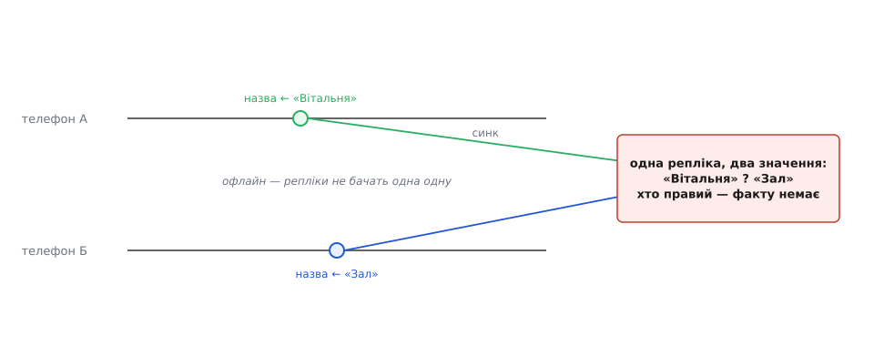
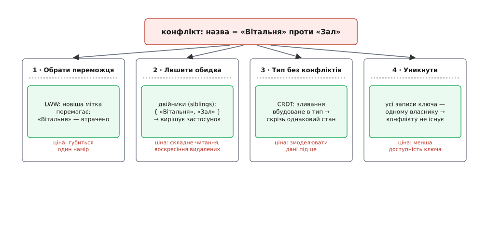
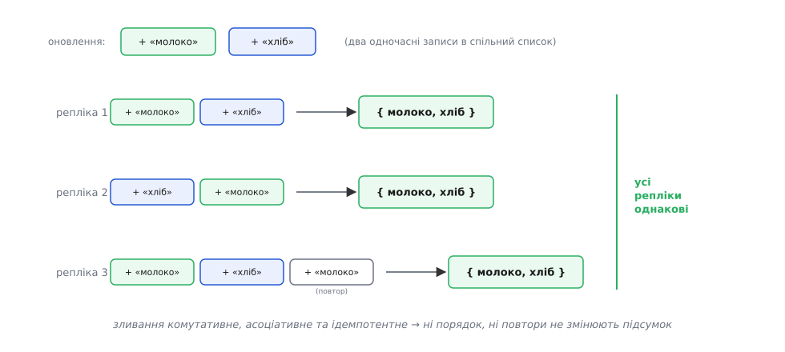
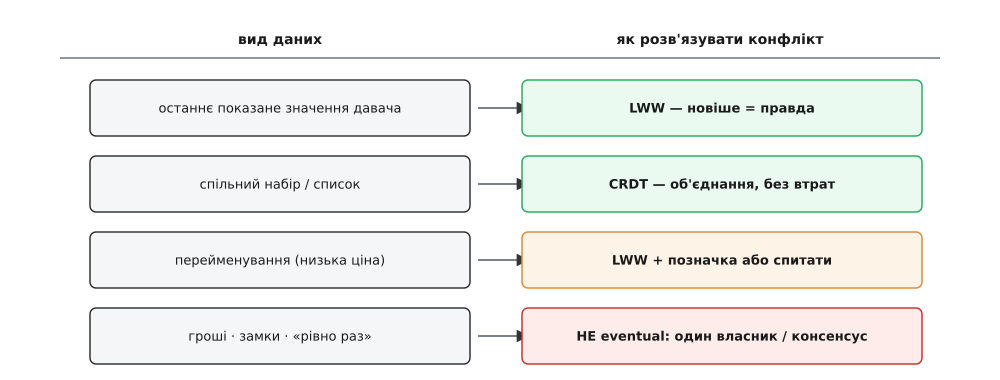

# Стратегії розв'язання конфліктів

<preknowlist>
- [Векторні годинники](topic:sf-distributed/vector-clocks) — як репліка відрізняє одночасні (незалежні) записи від причинно впорядкованих: кожна версія носить лічильник-вектор, і з нього видно, чи бачив один запис інший.
</preknowlist>

Мультилідерна реплікація, яку ми щойно розібрали, купує доступність і низьку затримку однією поступкою: вона дозволяє кільком вузлам приймати записи в **той самий ключ** одночасно. Рахунок за цю покупку приходить зараз.

Уяви двох членів родини в домі Digital Homes. Одна людина в підвалі, де хмара недосяжна, перейменовує вітальню на «Вітальня». Друга того ж вечора на терасі зі слабким Wi-Fi перейменовує ту саму кімнату на «Зал». Кожен телефон записав локально й показав власнику успіх. Згодом зв'язок вертається, репліки обмінюються змінами — і зустрічаються два записи в один ключ, жоден із яких не бачив іншого. Котрий правильний?

Тут криється перша й найважливіша думка теми: **правильної відповіді немає — і це не збій, а природа зробленого вибору.** Обидва записи легітимні, обидва користувачі мали рацію у свій момент. Питання не в тому, «як не допустити конфлікту» — ти свідомо дозволив його, коли обрав мультилідерну схему заради доступності. Питання інше й вужче: **як зробити, щоб усі репліки зійшлися на ОДНОМУ підсумку — тому самому на кожній із них — не домовляючись між собою в мить запису.** У цієї мети є назва — **сходження** (англ. *convergence*): хай яким шляхом і в якому порядку зміни доповзуть до кожної репліки, кінцевий стан скрізь однаковий.



*Конфлікт — це два **одночасні** записи в один елемент: жоден автор не знав про інший. Немає факту «хто раніше», який репліка могла б просто прочитати.*

## Що таке конфлікт насправді

Придивімося до слова «одночасні», бо на ньому все тримається. Два записи конфліктують не тоді, коли збіглися в часі за настінним годинником, — [настінний час, як ми вже знаємо з модуля про конкурентність, бреше і стрибає](root:progarch/concurrency-and-clocks), тож на нього тут покладатися не можна. Записи конфліктують, коли **жоден із них не бачив іншого**: ні той телефон не знав про зміну другого, ні навпаки. Якщо ж одна зміна зроблена поверх значення, яке вже містило другу, — конфлікту немає, це звичайне послідовне оновлення, і пізніша чесно заступає ранішу.

Відрізнити ці два випадки — окрема інженерна задача, і розв'язують її не годинником, а **версійним маркером**: кожна репліка тримає при значенні щось на кшталт лічильника-вектора, з якого видно, чи «нащадок» один запис іншому, чи вони — незалежні гілки. Точну механіку [версійних (векторних) годинників](topic:sf-distributed/vector-clocks) курс формалізує зовсім скоро; тут нам досить самої ідеї: **система вміє сказати, що два записи конфліктні**, і саме тоді постає питання — що з ними робити.

Форма цієї задачі, до речі, знайома кожному, хто зливав гілки в git. Там теж є спільний предок і дві розбіжні версії, і система або зливає їх сама, або каже «конфлікт, розберися». [Триходове злиття](topic:sf-release/version-control/math-three-way-merge.md) — база плюс дві розбіжності — це рівно той самий силует, тільки на файлах коду. Різниця в тому, що git може зупинитися й покликати людину, а репліка бази під навантаженням мусить дати відповідь **сама, детерміновано й миттєво**.

Далі — чотири родини відповідей. Це не драбина від гіршого до кращого; це чотири інструменти під різні значення слова «правильно».



*Ті самі два записи — чотири способи їх звести. Кожен має свою ціну, і вибирають його під те, що для цих даних означає «коректно».*

## Стратегія 1: обрати переможця (last-write-wins)

Найпростіше — оголосити переможцем один запис і викинути другий. Класичне правило — **«перемагає останній запис»** (англ. *last-write-wins*, LWW): у кожного значення є мітка часу, більша мітка виграє. Дешево до неможливості: жодного зайвого стану, злиття — це одне порівняння, і його можна робити будь-де. Саме так за замовчуванням розв'язує конфлікти Cassandra — кожна комірка носить мітку, і пізніша заступає ранішу.

Але «останній за чиїм годинником?» — і тут відкривається пастка. Годинники вузлів дрейфують і стрибають, дві мітки легко збігаються до останньої цифри або навіть інвертуються. Тому наївний LWW нестабільний: дві репліки можуть **по-різному** вирішити, хто останній, і розійтися назавжди — а сходження ми якраз і хочемо гарантувати. Ліки прості: доклей до порівняння **детермінований тайбрейк** — за рівних міток перемагає, скажімо, більший ідентифікатор вузла. Тоді будь-яка репліка, дивлячись на ті самі дві версії, обирає ту саму переможницю.

:::tabs
```ts
type Reg<T> = { value: T; ts: number; node: string };

// злиття двох версій одного ключа — детерміноване й на будь-якому вузлі однакове
function merge<T>(a: Reg<T>, b: Reg<T>): Reg<T> {
  if (a.ts !== b.ts) return a.ts > b.ts ? a : b;  // новіша мітка перемагає
  return a.node > b.node ? a : b;                  // рівні мітки — стабільний тайбрейк за вузлом
}
```
```py
from dataclasses import dataclass

@dataclass
class Reg:
    value: object
    ts: int
    node: str

def merge(a: Reg, b: Reg) -> Reg:
    if a.ts != b.ts:
        return a if a.ts > b.ts else b     # новіша мітка перемагає
    return a if a.node > b.node else b      # рівні мітки — стабільний тайбрейк за вузлом
```
:::

Тайбрейк рятує сходження, але не рятує **дані**. LWW за побудовою **втрачає** один із двох реальних намірів: «Зал» переміг — «Вітальня» зникла безслідно, ніби її не було. Для назви кімнати це прикро, але переживно. Для спільного списку покупок, якщо зберігати список одним значенням, LWW тихо викине половину — бо «останній» перезапис несе лише те, що бачив його автор.

> 🔧 **Навіщо це.** LWW — правильний вибір там, де «новіше» і є істина, а старіше нікому не потрібне. Останнє показане значення давача — температура, вологість, рівень заряду — саме таке: свіже показання **заступає** старе за визначенням, і губити попереднє не шкода. Для одного скалярного поля, де семантика — «актуальне значення», LWW не просто припустимий, а найдоречніший. Тримайся від нього подалі лише там, де кожен із конкурентних записів несе окрему цінність, яку не можна мовчки стерти.

## Стратегія 2: лишити обидва (двійники)

Якщо викидати намір не можна — не викидай. Репліка, побачивши конфлікт, **не обирає**, а зберігає обидві версії поруч як **двійники** (англ. *siblings*) і віддає їх нагору — застосунку чи користувачу — на найближчому читанні. Рішення відкладено до місця, де живе **семантика**: лише там знають, що «Вітальня» і «Зал» — це одна кімната, і чи спитати людину, чи взяти обидві назви, чи склеїти за доменним правилом.

Канонічний приклад — кошик Amazon у системі Dynamo. Там конфліктні версії кошика зливали **об'єднанням**: операція «додати в кошик» не губилася ніколи, бо додане з обох гілок лишалося. Ціна цього рішення повчальна: видалення могло **воскреснути**. Якщо на одній репліці товар прибрали, а на іншій кошик паралельно змінили, об'єднання поверне прибраний товар назад — покупець знову бачить те, що викинув. Видалення в такій моделі — найскладніший випадок, бо «нема елемента» і «елемент був та зник» об'єднанням не відрізниш.

> 🔧 **Навіщо це.** Двійники купують головне — **жодної тихої втрати**: усе, що написали користувачі, доживає до розв'язання. Платиш за це двома речами. По-перше, читання ускладнюється: кожен, хто бере значення, має вміти отримати не одне, а кілька й дати їм раду. По-друге, якщо не розв'язувати конфлікти активно, двійники плодяться без меж. Тож ця стратегія доречна там, де втрата даних дорожча за складність — і де є кому (застосунку або людині) розумно злити.

## Стратегія 3: тип, що не вміє конфліктувати (CRDT)

Тепер найхитріший хід. Дві попередні стратегії розв'язують конфлікт **після** того, як він стався. А що, як дібрати такі дані, у яких злиття вбудоване **в саму структуру** — і будь-які дві репліки, що бачили ті самі оновлення, обчислять однаковий стан **незалежно від порядку**, без жодного координатора й без питань до людини?

Це і є [безконфліктний тип даних, CRDT](topic:sf-distributed/crdt) (англ. *conflict-free replicated data type*). Секрет — в алгебрі злиття. Операція «злити два стани» має бути **комутативною** (порядок двох не важить), **асоціативною** (групування кількох не важить) та **ідемпотентною** (повтор нічого не змінює). Якщо злиття таке, то хай оновлення приходять у якому завгодно порядку, хай [мережа їх дублює й переставляє](root:progarch/duplicates-and-reorder) — кінцевий стан на всіх репліках сходиться.



*Ті самі оновлення в різному порядку й з повтором дають той самий підсумок. Ці три властивості злиття — і є вся магія сходження без координації.*

Інтуїцію дають найпростіші приклади. Множина-лише-на-додавання зливається **об'єднанням** — і два додавання ніколи не конфліктують. Лічильник тримає окреме число на кожен вузол, а спільне значення — їхня сума; два інкременти на різних вузлах просто складаються. Навіть LWW-реєстр із детермінованим тайбрейком — це вже крихітний CRDT. А спільний список покупок кладеться на **OR-Set** (англ. *observed-remove set* — множина зі спостереженим видаленням): вона позначає кожне додавання унікальним тегом, а видаляє лише **бачені** теги — і тому додавання й видалення більше не воюють, а воскресіння з історії про кошик Dynamo просто не стається.

> 🔧 **Навіщо це.** CRDT переносить ціну **з часу виконання на час проєктування**. Ти не пишеш резолвер конфліктів і не смикаєш користувача — натомість один раз моделюєш дані так, щоб вони зливалися самі, і далі вони сходяться завжди й безкоштовно. Плата — саме це моделювання: не кожні дані природно лягають у лічильник, множину чи реєстр, а видалення й порядок мають свої тонкощі. Там, де дані лягають (лічильники, набори, прапорці, спільні документи), CRDT — найспокійніший з усіх варіантів; там, де ні, — його не притягнеш силою.

## Стратегія 4: уникнути конфлікту

Найдешевший конфлікт — той, якого не було. Якщо в **той самий ключ** ніколи не пишуть двоє одночасно, розв'язувати нічого. Досягають цього **власністю**: кожному ключу призначають один домашній вузол-лідер, і всі записи цього ключа маршрутизують туди. Для ключа це знову однолідерна схема — конкурентних записів немає за побудовою. У Digital Homes кожен **дім** може належати одному регіону-власнику: перейменування кімнати завжди йде до власника дому, і два телефони, хоч би де були, б'ються за той самий рядок в одному місці, де їх серіалізують по черзі.

Ціна теж чесна. Власник ключа впав — ключ недоступний, поки не оберуть нового (а на переобранні конфлікт може повернутися). Транзакції між ключами різних власників стають дорогими. Але для великого класу даних це найздоровіший дефолт: **перш ніж тягтися до резолвера, спитай, чи не можна взагалі уникнути конфлікту, закріпивши власника.** Часто можна.

> 🔧 **Навіщо це.** Уникнення — не боягузтво, а часто найдешевша правильна відповідь. Дані, які мають єдиного природного власника (профіль дому, конфіг конкретного пристрою), не варто пускати в мультилідерну гонку лише тому, що інфраструктура це дозволяє. Мультилідерність і leaderless — інструмент під дані, де писати мусять звідусіль; там, де писати може одне місце, найпростіше так і лишити.

## Як обрати

Головна помилка — шукати одну стратегію на всю систему. Її немає. Резолвер добирають **на кожен вид даних окремо**, під те, що для цих даних означає «коректно».



*Не якість, а відповідність: під кожен вид даних — той резолвер, чия семантика збігається з тим, що для цих даних правильно.*

Пройдімося мапою на прикладі DH. Останнє показане значення давача — **LWW**: новіше показання і є правда. Спільний набір чи список — сцена «вечір кіно», перелік запрошених гостей — **CRDT**: об'єднання без втрат і без воскресінь. Перейменування кімнати — низька ціна помилки, тож **LWW з видимою позначкою «перейменовано»** або тихе питання користувачу цілком достатні. А ось гроші, замки дверей, будь-яке «виконати рівно раз» — це **зовсім інша ліга**: тут кінцева узгодженість із її «колись зійдемося» неприйнятна, бо відчинені о третій ночі двері назад не «зіллєш». Для таких даних не розв'язують конфлікт постфактум, а **не допускають розбіжності взагалі** — через єдиного власника або [справжній консенсус](topic:sf-distributed/consensus-problem), який дорого, але гарантовано дає одну узгоджену відповідь.

Наскрізна думка проста: **добери резолвер під значення слова «правильно» для цих даних.** LWW, двійники, CRDT та уникнення — не сходинки якості, а різні інструменти під різні істини. Плутанина починається, коли єдину стратегію накидають на все підряд.

Лишається одна практична деталь. Резолвер каже, **як** звести дві версії, але хтось має ці версії донести одна до одної й **застосувати правило скрізь**. Це робить фонова [анти-ентропія](topic:sf-distributed/anti-entropy-repair) — репліки активно вишукують розбіжності й вирівнюють їх, а не чекають випадкового читання. Правило злиття — це закон; анти-ентропія — машина, що розвозить цей закон по всіх вузлах, аж поки система [зрештою не стане узгодженою](topic:sf-distributed/eventual-consistency).

Історію того, як індустрія дійшла від ручних процедур злиття до типів, що зливаються самі, — від системи Bayou через Dynamo до формалізації CRDT — [варто прочитати окремо](root:progarch/conflict-resolution-strategies/hist-conflict-resolution-lineage.md): це рідкісний приклад, де академічна ідея дозріла в живий інструмент. А [робочий розбір, де LWW-реєстр, двійники й OR-Set реалізовані поруч і прогнані тестом на сходження](root:progarch/conflict-resolution-strategies/proj-merge-convergence.md), показує впритул, як порядок доставлення перестає впливати на підсумок — і де LWW мовчки губить те, що OR-Set береже.

Ми навчилися зводити розбіжні репліки до одного стану. Але кожна з цих стратегій прийняла одне мовчазне припущення — що трохи розбіжності на шляху до сходження допустимо. Наступний крок ставить це під питання прямо: **скільки саме неузгодженості система показує назовні, і чим за строгість доводиться платити** — цим займуться моделі консистентності й [теорема CAP](topic:sf-distributed/cap-theorem).
