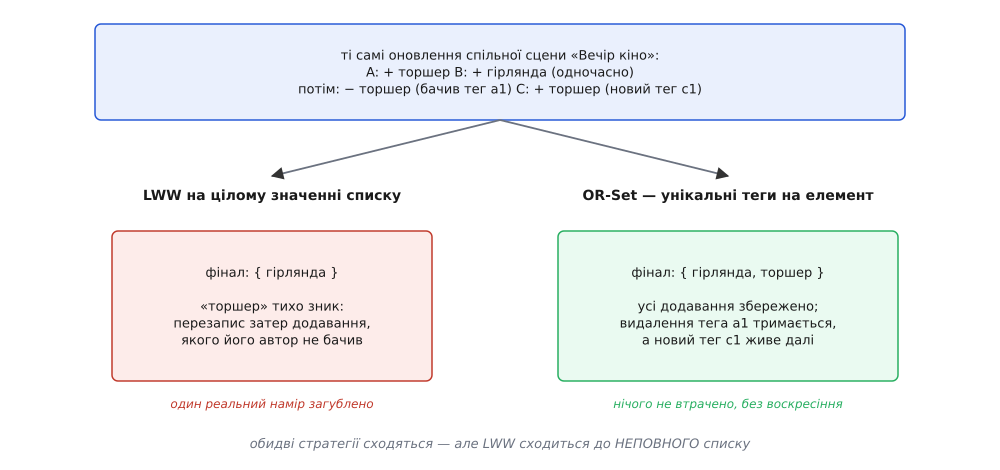

# ⚙️ Три реєстри під одним іспитом: LWW, двійники й OR-Set на тесті сходження

Стратегії на папері переконливі, але папір бреше легше за код. Тому зберемо три з них поруч — **LWW-реєстр**, **двійники** й **OR-Set** — кожну зі своєю функцією `merge()`, і поставимо їм спільний, навмисно недоброзичливий іспит. Візьмемо кілька однакових оновлень спільного списку, доставимо їх трьом «репліках» у **випадкових порядках і з повторами** й ствердимо, що фінальний стан скрізь один і той самий. А тоді придивимося до того, що цей іспит **не** ловить — бо саме там і криється найкорисніший урок.

Приклад беремо з дому Digital Homes, де він живий щодня. Є спільна сцена «Вечір кіно» — набір світильників, які вмикаються одним дотиком. Одна людина з підвалу додає в сцену торшер, друга тієї ж миті з тераси додає гірлянду; жоден телефон не бачив чужої зміни. Згодом хтось торшер із сцени прибирає, а ще згодом інша людина, не знаючи про це, вертає торшер назад. Чотири оновлення, три офлайн-пристрої — і питання, на яке має відповісти `merge()`: що опиниться в сцені, коли все нарешті зійдеться?

## Чому взагалі можна перевіряти злиття тестом

Секрет — у формі `merge()`. Якщо злиття поводиться як **з'єднання в напівґратці** (англ. *semilattice join*) — бере два стани й повертає їхню найменшу спільну верхню межу — і має три властивості, то підсумок не залежить ні від маршруту, ні від повторів:

```
комутативність:   merge(a, b) = merge(b, a)          → порядок двох не важить
асоціативність:   merge(merge(a, b), c) = merge(a, merge(b, c))   → групування не важить
ідемпотентність:  merge(a, a) = a                    → повтор нічого не додає
```

Разом ці три означають рівно те, що нам треба: хоч у якому порядку [мережа перемішає й продублює](root:progarch/duplicates-and-reorder) оновлення, кожна репліка згорне їх в один і той самий стан. Звідси й форма іспиту. Тасуємо оновлення — перевіряємо комутативність. Дублюємо навмання — перевіряємо ідемпотентність. Згортаємо їх зліва по одному, але щоразу з іншим порядком — щоразу інакше розставляючи дужки, тобто зачіпаючи й асоціативність. Якщо після сотень таких доставлень усі репліки сіли на **один** стан — три закони тримаються не лише на папері.

## Три реєстри, три злиття

Кожен реєстр — це пара «стан + `merge()`». Реалізуймо їх так, щоб різниця в поведінці випливала прямо з коду, а не зі слів про нього.

**LWW-реєстр** тримає **все значення списку** одним куснем разом із міткою часу й ідентифікатором вузла. Злиття — одне порівняння: перемагає більша мітка, а за рівних міток — стабільний тайбрейк за вузлом (без нього дві репліки могли б обрати різних переможців і розійтися назавжди).

:::tabs
```ts
// ── 1. LWW-реєстр: усе значення списку + мітка часу й вузол ──
type LWW = { val: Set<string>; ts: number; node: string };

function lwwMerge(a: LWW | null, b: LWW | null): LWW | null {
  if (!a || !b) return a ?? b;
  if (a.ts !== b.ts) return a.ts > b.ts ? a : b;   // новіша мітка перемагає
  return a.node >= b.node ? a : b;                 // рівні мітки — стабільний тайбрейк
}
```
```py
# ── 1. LWW-реєстр: усе значення списку + мітка часу й вузол ──
def lww_merge(a, b):
    if a is None: return b
    if b is None: return a
    if a["ts"] != b["ts"]:
        return a if a["ts"] > b["ts"] else b        # новіша мітка перемагає
    return a if a["node"] >= b["node"] else b        # рівні мітки — стабільний тайбрейк
```
:::

**Двійники** нічого не викидають: побачивши дві розбіжні версії, репліка тримає **обидві** поруч. Щоб відрізнити справді одночасні версії від тих, де одна написана поверх іншої, кожна версія носить **версійний вектор** — лічильник на вузол, з якого видно, чи «нащадок» одна версія іншій. Злиття бере об'єднання всіх версій і викидає ті, що їх хтось **строго домінує**; незалежні виживають обидві — як двійники, які вже зводить застосунок.

> 🔧 **Навіщо це.** Версійний вектор тут — не прикраса, а єдиний спосіб чесно сказати «ці дві версії одночасні». Механіку [векторних годинників](topic:algorithms/vector-clocks) курс формалізує окремо; тут досить, що `dominates(x, y)` відповідає «x бачив усе, що y, і ще щось».

:::tabs
```ts
// ── 2. Двійники: набір версій, кожна з версійним вектором ──
type VV = Record<string, number>;
type Version = { list: string[]; vv: VV };

const at = (v: VV, n: string) => v[n] ?? 0;

function dominates(x: VV, y: VV): boolean {       // x строго новіший за y?
  const keys = new Set([...Object.keys(x), ...Object.keys(y)]);
  let ge = true, gt = false;
  for (const k of keys) {
    if (at(x, k) < at(y, k)) ge = false;
    if (at(x, k) > at(y, k)) gt = true;
  }
  return ge && gt;
}

function sibMerge(a: Version[], b: Version[]): Version[] {
  const both = [...a, ...b], live: Version[] = [], seen = new Set<string>();
  for (const v of both) {
    const k = JSON.stringify(Object.entries(v.vv).sort());
    if (seen.has(k)) continue;                          // дубль тієї самої версії
    if (both.some((w) => dominates(w.vv, v.vv))) continue;  // хтось новіший — відкинути
    seen.add(k); live.push(v);
  }
  return live;
}
```
```py
# ── 2. Двійники: набір версій, кожна з версійним вектором ──
def dominates(x, y):                 # x строго новіший за y?
    keys = set(x) | set(y)
    ge = all(x.get(k, 0) >= y.get(k, 0) for k in keys)
    gt = any(x.get(k, 0) >  y.get(k, 0) for k in keys)
    return ge and gt

def sib_merge(a, b):
    both = a + b
    live, seen = [], set()
    for v in both:
        k = tuple(sorted(v["vv"].items()))
        if k in seen:                                     # дубль тієї самої версії
            continue
        if any(dominates(w["vv"], v["vv"]) for w in both):  # хтось новіший — відкинути
            continue
        seen.add(k); live.append(v)
    return live
```
:::

**OR-Set** (англ. *observed-remove set*) — найтонший із трьох, бо ховає всю розумність у теги. Кожне додавання елемента дістає **унікальний тег**; видалення знімає лише **ті теги, які репліка справді бачила**. Елемент живий, поки має бодай один доданий і ще не знятий тег. Злиття — поелементне об'єднання доданих тегів і об'єднання знятих. Ось чому паралельне додавання переживає видалення: воно кладе **новий** тег, якого видалення не бачило й зняти не могло, — і це не воскресіння, а чесно новий запис.

:::tabs
```ts
// ── 3. OR-Set: на елемент — теги додавань і теги знятих (тумбстоуни) ──
type ORSet = { add: Record<string, Set<string>>; rem: Record<string, Set<string>> };

function orMerge(a: ORSet, b: ORSet): ORSet {
  const out: ORSet = { add: {}, rem: {} };
  for (const s of [a, b])
    for (const kind of ["add", "rem"] as const)
      for (const [e, tags] of Object.entries(s[kind])) {
        out[kind][e] ??= new Set();
        for (const t of tags) out[kind][e].add(t);
      }
  return out;
}

// елемент живий, поки має бодай один доданий, але не знятий тег
function orValue(s: ORSet): Set<string> {
  const live = new Set<string>();
  for (const [e, tags] of Object.entries(s.add)) {
    const rem = s.rem[e] ?? new Set<string>();
    if ([...tags].some((t) => !rem.has(t))) live.add(e);
  }
  return live;
}
```
```py
# ── 3. OR-Set: на елемент — теги додавань і теги знятих (тумбстоуни) ──
def or_merge(a, b):
    out = {"add": {}, "rem": {}}
    for s in (a, b):
        for kind in ("add", "rem"):
            for e, tags in s[kind].items():
                out[kind].setdefault(e, set()).update(tags)
    return out

# елемент живий, поки має бодай один доданий, але не знятий тег
def or_value(s):
    return {e for e, tags in s["add"].items()
            if tags - s["rem"].get(e, set())}
```
:::

## Ті самі оновлення — трьома мовами реєстрів

Тепер запишемо сценарій «Вечір кіно» **як стани-дельти** для кожного реєстру. Кожне оновлення — це маленький стан, який репліка вливає в себе злиттям; тег `a1`/`b1`/`c1` — унікальний ідентифікатор конкретного запису.

:::tabs
```ts
const lwwFrags: LWW[] = [
  { val: new Set(["торшер"]),   ts: 1, node: "A" },   // A: увесь список = {торшер}
  { val: new Set(["гірлянда"]), ts: 1, node: "B" },   // B одночасно: увесь список = {гірлянда}
];
const sibFrags: Version[][] = [
  [{ list: ["торшер"],   vv: { A: 1 } }],
  [{ list: ["гірлянда"], vv: { B: 1 } }],
];
const orFrags: ORSet[] = [
  { add: { торшер:   new Set(["a1"]) }, rem: {} },      // A: +торшер (тег a1)
  { add: { гірлянда: new Set(["b1"]) }, rem: {} },      // B: +гірлянда (тег b1)
  { add: {}, rem: { торшер: new Set(["a1"]) } },        // −торшер, бачив лише тег a1
  { add: { торшер:   new Set(["c1"]) }, rem: {} },      // C: +торшер знову (новий тег c1)
];
```
```py
lww_frags = [
    {"val": {"торшер"},   "ts": 1, "node": "A"},   # A: увесь список = {торшер}
    {"val": {"гірлянда"}, "ts": 1, "node": "B"},   # B одночасно: увесь список = {гірлянда}
]
sib_frags = [
    [{"list": ["торшер"],   "vv": {"A": 1}}],
    [{"list": ["гірлянда"], "vv": {"B": 1}}],
]
or_frags = [
    {"add": {"торшер":   {"a1"}}, "rem": {}},                  # A: +торшер (тег a1)
    {"add": {"гірлянда": {"b1"}}, "rem": {}},                  # B: +гірлянда (тег b1)
    {"add": {},                   "rem": {"торшер": {"a1"}}},  # −торшер, бачив лише тег a1
    {"add": {"торшер":   {"c1"}}, "rem": {}},                  # C: +торшер знову (новий тег c1)
]
```
:::

Зверни увагу на асиметрію вже тут. LWW змушений кодувати «додавання» як **знімок усього списку** — бо іншого місця, крім цілого значення, у нього немає; тож знімок A несе лише те, що A бачив. OR-Set натомість кодує кожну дію окремо, за її власним тегом. Ця різниця в записі й вирішить фінал ще до того, як спрацює хоч одне злиття.

## Іспит на сходження

Харнес доставляє одні й ті самі фрагменти багатьом «репліках», щоразу в новому випадковому порядку й із випадковими повторами, і рахує, **скільки різних фінальних станів** вийшло. Один стан на всі репліки — сходження тримається; більше одного — десь злиття не є справжнім join.

:::tabs
```ts
const shuffle = <T,>(xs: T[]) =>
  xs.map((x) => [Math.random(), x] as const).sort((p, q) => p[0] - q[0]).map((p) => p[1]);

// канонічний «відбиток» стану — щоб порівнювати репліки попри порядок усередині структур
const lwwKey = (s: LWW | null) => s ? JSON.stringify([[...s.val].sort(), s.ts, s.node]) : "∅";
const sibKey = (s: Version[]) =>
  JSON.stringify(s.map((v) => [[...v.list].sort(), Object.entries(v.vv).sort()]).sort());
const dump = (m: Record<string, Set<string>>) =>
  Object.entries(m).map(([e, t]) => [e, [...t].sort()]).sort();
const orKey = (s: ORSet) => JSON.stringify([dump(s.add), dump(s.rem)]);

function converge<S, F>(
  merge: (s: S, f: F) => S, empty: S, frags: F[],
  key: (s: S) => string, replicas = 1000,
): number {
  const seen = new Set<string>();
  for (let r = 0; r < replicas; r++) {
    const repeats = shuffle(frags).slice(0, Math.floor(Math.random() * (frags.length + 1)));
    const order = shuffle([...frags, ...repeats]);   // випадковий порядок + повтори
    let st = empty;
    for (const f of order) st = merge(st, f);
    seen.add(key(st));
  }
  return seen.size;                                   // 1 ⟺ усі репліки зійшлися
}

console.assert(converge(lwwMerge, null, lwwFrags, lwwKey) === 1, "LWW не зійшовся");
console.assert(converge(sibMerge, [],   sibFrags, sibKey) === 1, "двійники не зійшлися");
console.assert(converge(orMerge, { add: {}, rem: {} }, orFrags, orKey) === 1, "OR-Set не зійшовся");
```
```py
import random

def lww_key(s):
    return "∅" if s is None else (tuple(sorted(s["val"])), s["ts"], s["node"])
def sib_key(s):
    return tuple(sorted((tuple(sorted(v["list"])), tuple(sorted(v["vv"].items()))) for v in s))
def _dump(m):
    return tuple(sorted((e, tuple(sorted(t))) for e, t in m.items()))
def or_key(s):
    return (_dump(s["add"]), _dump(s["rem"]))

def converge(merge, empty, frags, key, replicas=1000):
    seen = set()
    for _ in range(replicas):
        repeats = random.sample(frags, k=random.randint(0, len(frags)))
        order = frags + repeats
        random.shuffle(order)                     # випадковий порядок + повтори
        st = empty
        for f in order:
            st = merge(st, f)
        seen.add(key(st))
    return len(seen)                              # 1 ⟺ усі репліки зійшлися

assert converge(lww_merge, None, lww_frags, lww_key) == 1, "LWW не зійшовся"
assert converge(sib_merge, [],   sib_frags, sib_key) == 1, "двійники не зійшлися"
assert converge(or_merge, {"add": {}, "rem": {}}, or_frags, or_key) == 1, "OR-Set не зійшовся"
```
:::

Усі три `assert` проходять. І це перший, оманливо-заспокійливий результат: **кожен** з трьох реєстрів сходиться. Хоч як тасуй і дублюй — LWW щоразу дає той самий стан, двійники той самий, OR-Set той самий. Якби ми зупинилися тут і повісили зелену галочку «репліки узгоджені», ми б проґавили головне.

## Що іспит проґавив

Додаймо один рядок — подивімося не на **кількість** станів, а на їхній **вміст**:

:::tabs
```ts
const lww = lwwFrags.reduce(lwwMerge, null as LWW | null);
const sib = sibFrags.reduce(sibMerge, [] as Version[]);
const or  = orFrags.reduce(orMerge, { add: {}, rem: {} } as ORSet);

console.log("LWW      →", [...(lww?.val ?? [])]);   // [ 'гірлянда' ]        ← торшер зник
console.log("двійники →", sib.map((v) => v.list));  // [ ['торшер'], ['гірлянда'] ]
console.log("OR-Set   →", [...orValue(or)]);        // [ 'торшер', 'гірлянда' ]
```
```py
from functools import reduce
lww = reduce(lww_merge, lww_frags, None)
sib = reduce(sib_merge, sib_frags, [])
orr = reduce(or_merge, or_frags, {"add": {}, "rem": {}})

print("LWW      →", sorted(lww["val"]))            # ['гірлянда']            ← торшер зник
print("двійники →", [v["list"] for v in sib])      # [['торшер'], ['гірлянда']]
print("OR-Set   →", sorted(or_value(orr)))         # ['гірлянда', 'торшер']
```
:::

```
LWW      →  { гірлянда }              ← «торшер» тихо загублено
двійники →  { торшер } | { гірлянда }  ← обидва збережено, зводить застосунок
OR-Set   →  { гірлянда, торшер }      ← усе збережено, видалення без воскресіння
```

Ось де три однаково-«зелені» реєстри розходяться в тому, що для сцени по-справжньому важить. **LWW** зійшовся бездоганно — на списку, з якого зник торшер: два одночасні знімки затерли один одного, і додавання, якого переможець не бачив, випарувалося без сліду. **Двійники** зберегли обидві версії й чесно віддали їх нагору — жодної втрати, але ціною того, що зводити мусить хтось вище. **OR-Set** сам дав те, чого чекала людина: торшер із тегом `a1` знято, а торшер із новим тегом `c1` живий, тож у сцені є і гірлянда, і торшер — і видалення при цьому не воскресло.



*Однакові входи, різні підсумки. Обидві стратегії сходяться — але сходяться до різного, і тест на однаковість станів цієї різниці не бачить.*

Звідси головна думка розбору, і вона незручна: **сходження — не те саме, що коректність.** Тест на сходження перевіряє лише, що репліки згодні **між собою**, а не що вони згодні на **правильному**. Зелений результат тут необхідний, але не достатній: окремо треба стверджувати, що фінал зберігає те, що семантика цих даних вимагає зберегти. Саме тому вибір реєстру — це не «який алгоритм правильніший», а «що для цієї сцени означає не втратити нічого».

## Складність і пастки

Код короткий, але кожен реєстр приховує рахунок, який проступає лише під навантаженням.

**Тумбстоуни OR-Set ростуть і не чистяться наївно.** Знятий тег не можна просто забути: якщо викинути `rem`-запис про `a1`, то будь-яка репліка, що досі несе доданий `a1`, при наступному злитті поверне торшер — рівно те воскресіння, якого OR-Set і уникає. Тому набір знятих тегів лише росте, і це прямий податок на пам'ять. У проді його підрізають узгодженням: тег, знятий і **побачений усіма** репліками, більше не потрібен нікому й безпечно збирається — але це окрема, обережна процедура, а не `delete` під час звичайного злиття.

**Двійники плодяться, поки їх не зводять.** `merge` за побудовою не дає версіям зникнути — схлопнути набір може лише новий запис, чий версійний вектор домінує всіх наявних. Якщо застосунок не зводить двійники активно, репліка тягне дедалі ширше віяло версій, а сам версійний вектор росте з кількістю вузлів, що колись писали. Двійники купують «жодної тихої втрати» ціною складнішого читання й цього необмеженого росту.

**LWW сходиться впевнено й до неправди.** Тайбрейк за вузлом гарантує, що всі репліки оберуть **того самого** переможця, — але «переможець» означає «більша мітка часу», а мітки дає настінний годинник, який дрейфує й стрибає. Загублений запис міг бути насправді пізнішим — LWW цього не знає й знати не може. Для одного скалярного поля, де «новіше = правда», це прийнятно; для списку, де кожне додавання окреме, LWW структурно неспроможний, бо тримає ціле значення там, де треба зберігати елементи нарізно.

**Уся коректність OR-Set висить на унікальності тегів.** Тег мусить бути справді неповторним — зазвичай пара `(вузол, локальний-лічильник)` або UUID, — і його **ніколи** не переприсвоюють. Досить двом незалежним додаванням випадково поділити тег — і правило «знімаю лише бачене» ламається: видалення одного зачепить інше. Тег породжується локально, монотонно, і в цьому вся його сила.

І остання, тонша пастка — у самій постановці іспиту. Ми доставляли **стани-дельти** й зливали їх, тобто будували стан-базовані (англ. *state-based*) реєстри, де ідемпотентність вбудована й повтор нешкідливий за визначенням. Операційний (англ. *op-based*) варіант доставляв би самі операції («додай торшер»), і тоді ідемпотентність із безкоштовної стає **вимогою до транспорту**: та сама операція, [доставлена двічі](root:progarch/duplicates-and-reorder), не сміє спрацювати двічі. Вибираючи між двома стилями, ти насправді вибираєш, **де** платити за повтори — у структурі даних чи в каналі доставлення.
