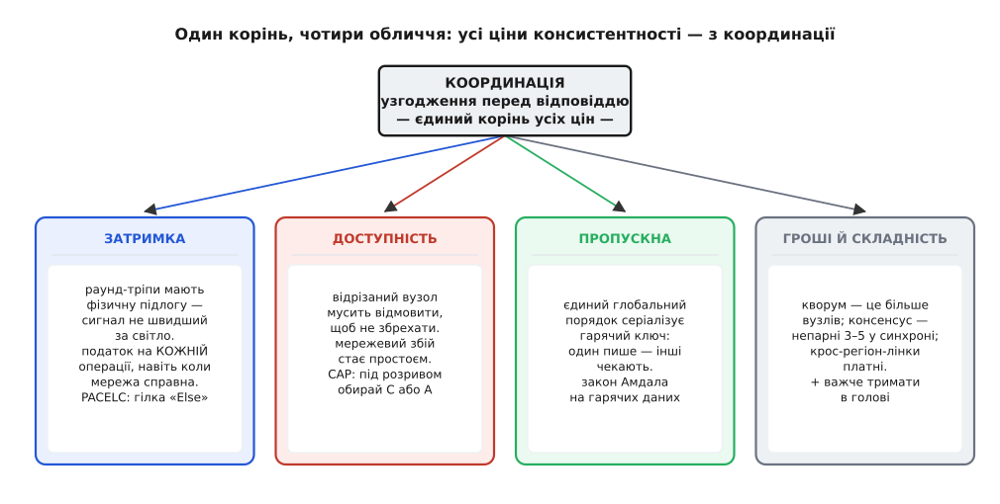
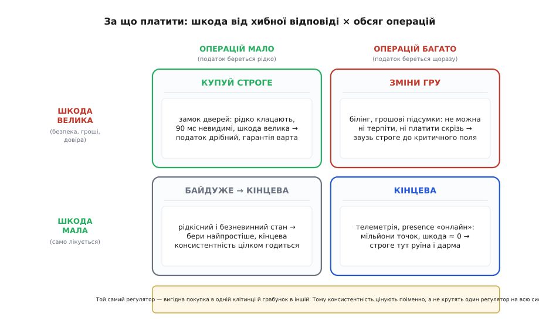
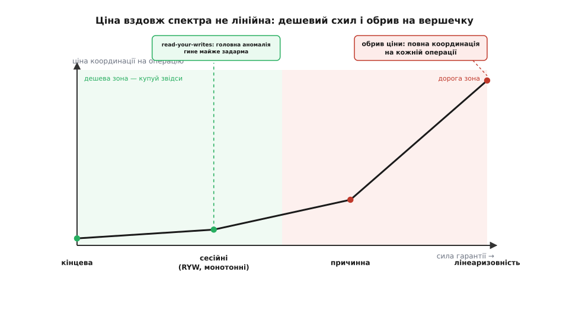

# Ціна консистентності як trade-off

<preknowlist>
- [CAP і PACELC](topic:sf-distributed/cap-theorem) — під розривом мережі система обирає між консистентністю й доступністю; PACELC додає головне для цього кроку: навіть коли мережа ціла, консистентність купується затримкою.
- [Спектр консистентності](topic:sf-distributed/consistency-models) — від строгої (лінеаризовність) через причинну й сесійні гарантії до кінцевої; це шкала з багатьма поділками, а не вимикач «увімк/вимк».
- [Очікуване значення](topic:math-probability/mean-variance) — ймовірність, помножена на наслідок; чим міряють «очікувану» шкоду від події, що трапляється лише інколи.
</preknowlist>

Минулого кроку ми пройшлися по даних Digital Homes і кожному повісили ярлик: стан замка — **строго**, телеметрія з давачів — «**зрештою**», твін дому — десь між. Розмітили здебільшого чуттям: тут «страшно помилитися», там «та нехай трохи відстане». І щойно ярлики розвішані, у голові починає свербіти одна спокуслива думка. Неконсистентність — це ж баг: у [твіні на репліках](root:progarch/dh-replicas) ми на власні очі бачили, як користувач гасить обігрівач, а застосунок за пів секунди показує його ввімкненим. Баг. То **навіщо весь цей поділ** — чому просто не зробити скрізь строго, щоб такого не траплялося ніде, і спати спокійно?

Цей крок — відповідь на те свербіння. «Строго» — не безкоштовний запобіжник, який розумно виставити на максимум усюди. Це **покупка**. У неї є цінник, і платиш ти його не раз, а на **кожній операції**, довіку. Зробімо цей цінник видимим — і «строго скрізь» перестане виглядати обережністю, а почне виглядати тим, чим і є: нечитаним рахунком.

## Один корінь усіх цін — координація

Спершу докопаймося, чому консистентність узагалі хоч щось коштує. Корінь один. Щоб **пообіцяти**, що читання поверне найсвіжіший запис, вузол перед відповіддю мусить бути **певен**, що ніхто інший не тримає новішого значення, про яке він не знає. А єдиний спосіб стати певним — **запитати інших**. Спитати лідера; зібрати [кворум](topic:sf-distributed/quorum-and-leaderless) підтверджень; прогнати раунд консенсусу. Строга консистентність — це, по суті, **узгодження перед відповіддю**, тобто **координація** (лат. *co-* «разом» + *ordinare* «впорядковувати»). Усе, що ця гарантія коштує, витікає з цього єдиного акту — поговорити з іншими, перш ніж відповісти.

Кінцево-консистентний вузол цю розмову **пропускає**: відповідає зі своєї копії негайно, а розбіжності доганяє потім, у фоні. Він дешевий саме тому, що на гарячому шляху **не координується**. Отже, увесь наш trade-off зводиться до одного питання: **скільки координації ти вимагаєш перед відповіддю** — а координація не буває безкоштовною. Пройдімо рахунок від цього кореня.

## Чотири обличчя рахунку

З одного кореня падає чотири різні витрати — та сама координація, обернена чотирма боками.


*Єдиний корінь, чотири обличчя рахунку. Кожна витрата — це та сама координація, побачена з іншого боку: час на раунд-тріпи, відмова під розривом, серіалізація гарячого ключа й залізо з людськими зусиллями на додачу.*

**Затримка — податок, який капає завжди, навіть коли все справне.** Координація — це раунд-тріпи мережею, а раунд-тріп бере час, і в цього часу є **фізична підлога**: сигнал не летить швидше за світло, тож кругова затримка росте з **відстанню** між репліками. У межах одного дата-центру — частки мілісекунди. Через континент — десятки мілісекунд. Європа ↔ США — близько 80–100 мс на раунд-тріп; Європа ↔ Азія — ще більше. Строге читання чи запис, що мусить дочекатися далекої репліки, платить цю «відстань поділити на швидкість світла» **на кожній операції**. Це те обличчя, яке всі забувають, бо воно кусає, **коли нічого не зламано**: ні розриву, ні збою, мережа ідеальна — а консистентність усе одно коштує затримки. Саме цю думку 2012 року виокремив Даніел Абаді під назвою **PACELC**: під розривом (*Partition*) обирай A або C; а як ні (*Else*) — обирай між Затримкою (*Latency*) і Консистентністю. «Else», де строга консистентність безкоштовна, не існує.

**Доступність — рахунок, який приходить, коли мережа рветься.** [Часткова відмова](root:progarch/partial-failure) — не виняток, а норма: кабель ріжуть, лінк мигає. І коли вузол відрізано від тих, з ким він мусить координуватися, перед ним розвилка: відповісти з того, що знає сам (ризикнути збрехати застарілим — порушити консистентність), або **відмовитися відповідати** (лишитися консистентним — порушити доступність). Строго-консистентна система за визначенням обирає відмовити: радше зупиниться, ніж віддасть можливо-хибну відповідь. Тобто строга консистентність **перетворює мережеву гикавку на простій**. Це і є теорема CAP (Ерік Бревер сформулював її як гіпотезу 2000 року, а Сет Ґілберт і Ненсі Лінч довели 2002-го) — тільки тепер «доступність» не літера, а «скільки хвилин на рік твої користувачі бачать помилку, поки мережа кашляє», і в цих хвилин є ціна в євро.

**Пропускна здатність — податок серіалізації.** Щоб тримати **один глобальний порядок**, конфліктні операції доводиться **серіалізувати** — проганяти крізь одного лідера, замок, консенсус-журнал. Серіалізація означає, що гарячий елемент стає вузьким горлом: два записи в той самий ключ не можуть летіти вільно вдвох, один чекає. Чим гучніше ти вимагаєш єдиного узгодженого порядку, тим менше паралелізму лишається на гарячих даних — і тут знову кусає [закон Амдала](topic:sf-algorithms/amdahls-law): серіалізована частка обмежує прискорення згори. Строга гарантія на гарячому ключі душить записи-за-секунду й розганяє чергу під навантаженням.

**Гроші й складність — витрата, яку видно в рахунку хмари.** Кворум — це **більше реплік**; стійкий до відмов консенсус хоче непарного числа вузлів, 3, краще 5, і всіх — у синхроні; крос-регіон-трафік лічильник міряє й виставляє. Один асинхронний фоловер дешевший за п'ятьох синхронних виборців. А тонша ціна — **людська**: сильно скоординовану систему важче тримати в голові, у неї більше режимів відмови, а інженерні години — теж валюта.

Чотири лінії в одному рахунку. Хто каже «та зробімо це консистентним» — підписує всі чотири одразу.

## Скільки коштує затримка: строге читання в числах

**Умова.** Твін DH живе на трьох репліках у різних регіонах: Франкфурт, Вірджинія, Сінгапур (N = 3). Строге читання через кворум вимагає, щоб зони читання й запису перетнулися: R + W > N, скажімо W = 2 і R = 2 — отже кожна строга операція мусить почути відповідь від **двох вузлів із трьох**. Для клієнта біля Франкфурта найближча репліка — місцева (< 1 мс), а друга-за-близькістю — Вірджинія, ~90 мс туди-назад.

```
кінцева консистентність:  читання з найближчої репліки              ≈ 1 мс
строга (кворум 2 з 3):    чекає на 2-й підтвердний вузол (Вірджинія) ≈ 90 мс
податок за гарантію:      90 / 1                                     = 90×
```

**Висновок.** Ті самі дані, той самий запит — строгий коштує в ~90 разів довше, і цей податок береться на **кожній** строгій операції, за цілком справної мережі. Для клацання замка, яке користувач робить двічі на день, 90 мс невидимі — купуй гарантію не вагаючись. Для телеметрії, що тече щосекунди з пів мільйона домів, помножити кожну точку на 90 — руїна, і купує вона рівно нічого, чого хтось здатен помітити. Отут і проступає справжнє питання: **ціна не однакова на різних даних**.

## Ціна не однакова — вона поіменна

Помилка за «зробімо скрізь строго» — припущення, що **шкода від однієї неконсистентності всюди однакова**. А вона гуляє в шалених межах залежно від даних.

- Стан замка збрехав: «застосунок каже замкнено, а двері відчинені» — це провал безпеки й довіри. Шкода **велика**.
- Температура в кімнаті відстала на секунду: показує 21.4 замість 21.6 — наступний тік виправить, ніхто не постраждав. Шкода **≈ нуль**.

Одне слово «неконсистентність» — і два різні світи наслідків. Тому чесне питання про кожен елемент даних — це той самий інструмент очікуваної вартості, який ми вже носимо з кроку про [вартість зволікання](root:progarch/cost-of-delay): **очікувана шкода аномалії = P(аномалія) · шкода(аномалія)**. І зважуєш ти **саме її** — рідкісну, іноді дешеву подію — проти податку координації, який платиш на **100 % операцій**, чи трапилася б та аномалія бодай раз.

```
купувати строгу гарантію на цей елемент — лише якщо:

   P(аномалія) · шкода(аномалія)   >   податок · частка операцій
   └─ рідко, іноді дешево ─┘             └─ завжди, на кожній ─┘
```

Прочитай цю нерівність — і рефлекс гине сам. Для телеметрії ліва частина ≈ 0 (шкода нульова), а права — величезна (мільйони операцій): купувати строге безглуздо. Для замка ліва частина велика (реальний інцидент безпеки), а права — крихітна (клацань мало, і 90 мс ніхто не відчув): купувати треба. **Та сама гарантія** — вигідна покупка на одному елементі й грабунок на іншому. Ось чому минулого кроку ми різали DH поіменно, а не крутили один регулятор на всю систему: тепер економіка за тим поділом — на видноті.


*Дві осі — обсяг операцій і шкода від хибної відповіді — кажуть, за що платити. Велика шкода, малий обсяг (замок) — купуй строге, податок дрібний. Нульова шкода, величезний обсяг (телеметрія) — кінцева, строге тут руїна й дарма. Найгостріший кут — велика шкода й великий обсяг (грошові підсумки): не можна ні терпіти, ні платити скрізь, тож строгу зону звужують до критичного поля.*

Найгостріший кут — коли й шкода велика, й обсяг великий — той самий, що й у [вартості зволікання](root:progarch/cost-of-delay): дурне питання «строго чи ні?» тут пастка, а правильний хід — **зсунути задачу з кута**. Звузити строгу зону до одного критичного поля (не весь запис білінгу строгий, а лише підсумок до сплати); знизити обсяг строгого шляху; або взяти дешевшу гарантію, що прибирає саме цю шкоду. Проранжувати всі дані DH за цією нерівністю — не на око, а таблицею з їхніми P, шкодою, обсягом і RTT — [винесено в маленьку модель](root:progarch/consistency-cost-tradeoff/proj-consistency-price-model.md), яка сама скаже, що тримати строго, а що «зрештою».

## Шкала, а не вимикач: купуй найслабшу гарантію, що прибирає аномалію

Лишився ще один рефлекс, і він теж коштує грошей: думати, що вибір **бінарний** — строго або кінцево. Спектр, який ми пройшли, — це **шкала** з багатьма поділками, і, головне, **ціна вздовж неї не лінійна**. Обрив — аж на самому вершечку. Повна **лінеаризовність** (один глобальний порядок, узгодження перед кожною відповіддю) вимагає координації на кожній операції — увесь податок сповна. Але **трохи нижче** сидять куди дешевші гарантії, що прибирають ту саму аномалію, яка справді болить, за частку ціни:

- **Сесійні гарантії** — read-your-writes, монотонні читання (ми стрілися з ними в [реплікаційному лагу](topic:sf-distributed/replication-lag)). Щоб убити баг стейл-обігрівача, глобальний консенсус **не потрібен** — потрібна одна обіцянка: користувач бачить **свій власний** запис. Досягається вона тим, що читання цього користувача спрямовують туди, куди ліг його запис (прилипання до лідера або токен версії). Це облік на рівні сесії, без загальносистемної згоди. **Дешево.** І прибирає рівно ту аномалію, що зламала довіру, — не більше.
- **Причинна консистентність** — зберігає порядок причина → наслідок, лишається доступною під розривом і коштує далеко менше за глобальний порядок.

Отже розумний хід майже ніколи не «викрути на лінеаризовність». Він такий: **назви аномалію, що справді коштує тобі грошей, і купи найслабшу гарантію зі шкали, яка її прибирає**. Кожен крок униз по шкалі скидає координацію, а з нею — ціну. Стейл-обігрівачу треба read-your-writes, а не лінеаризовність, — а read-your-writes лежить далеко внизу дешевого схилу, і близько не біля обриву.


*Ціна вздовж спектра не лінійна: дешевий пологий схил ліворуч і обрив на вершечку. Сесійні гарантії прибирають найболючішу аномалію (свій запис видно одразу) майже задарма — задовго до дорогої зони. Повна лінеаризовність бере повний податок координації на кожній операції; вибиратися туди варто, лише коли аномалію не прибирає жодна дешевша поділка.*

Звідки береться фізична підлога затримки, як вивести цю нерівність «купувати гарантію» до беззбитковості на операцію й чому ціна на шкалі стрибає саме нагорі — [винесено в окремий розбір](root:progarch/consistency-cost-tradeoff/math-consistency-cost.md).

> 🔧 **Навіщо це.** На рев'ю, коли хтось пропонує «зробімо X консистентним», не кивай — **читай рахунок**. Три питання на кожен шматок стану. Перше: що коштує тут хибна чи застаріла відповідь, помножене на те, як часто вона трапиться (очікувана шкода)? Друге: яка **найслабша** гарантія зі шкали прибирає саме цю аномалію? Третє: що ця гарантія бере з мене на **кожній** операції — затримкою, доступністю, пропускною, грошима? Піднімайся по шкалі рівно доти, доки ціна гарантії на операцію не переросте очікувану шкоду, яку вона відвертає. За замовчуванням стій на дешевому кінці; плати за силу лише там, де аномалія справді дорога, а трапляється рідко — щоб податок лишався малим. «Строго скрізь» — це не обережність, це нечитаний рахунок.

## Куди це нас ставить

Тепер trade-off має точну форму, а не гасло. Консистентність купується **координацією**, а координація виставляє рахунок чотирма валютами: затримкою (завжди), доступністю (під розривом), пропускною (на гарячих даних) і грошима. Ціна **поіменна, не посистемна** — бо шкода від неконсистентності стрибає від катастрофи до нуля залежно від даних. А спектр — це шкала з обривом на вершечку, тож найдешевші ліки — зазвичай сесійна гарантія, а не повна сила.

Ми навчилися **читати цінник**. Наступний крок наводить цю саму лінзу на топологію реплік — [яку модель реплікації обрати](root:progarch/replication-choice), — коли за кожним варіантом уже видно, чим саме він платить.
