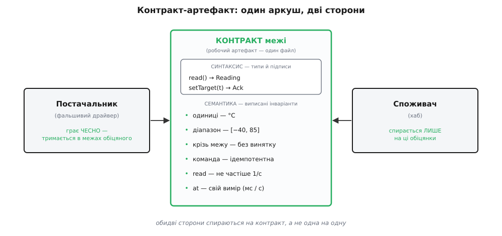

# ⚙️ Виписати межу до дна: робочий контракт драйвера в Digital Homes

Кістяк цієї межі ми щойно накидали на дошці: `read()` віддає `Reading`, показ у [−40, 85], «не частіше ніж раз на секунду», «без винятку крізь межу». Чотири рядки — і вже видно головне. Але на дошці лишається дошка, а в репозиторій ти кладеш **файл**, і в тому файлі межі виявляється помітно більше, ніж уміщує начерк. У ньому — кожна операція, а не одна (термостат не лише **звітує** температуру, він ще й **приймає** команду); кожен DTO; збій, виписаний окремим типом; і та частина, яку пропускають найчастіше, — інваріанти, записані **словом**, поруч із типами, на тій самій сторінці, з якої їх читають обидві сторони.

Зберімо цей файл повністю — робочий артефакт межі «хаб ↔ драйвер пристрою», такий, який справді комітять. А тоді доведімо запускним кодом дві дрібні, але вирішальні речі: що фальшивий драйвер може грати цей контракт **чесно**, і що споживач може спертися **лише** на нього. Зверни увагу, чого тут **не** буде: це не техніка тестування — систематична двобічна перевірка сторін проти спільного еталона чекає нас наступним кроком. Тут ремесло інше й передумовне до неї: зробити межу настільки явною, щоб ті дві перевірки взагалі стали можливі.

## Ідея: контракт має два поверхи, і артефакт записує обидва

Придивися, з чого складається обіцянка межі, і побачиш два поверхи. Верхній, видимий — **синтаксис**: імена операцій і форма даних. `read(): Reading`, `setTarget(tempC): Ack`. Його ловить компілятор, його видно з підпису. Нижній, схований — **семантика**: у яких одиницях те число, у яких межах воно законне, що буде на збої, як часто дозволено кликати, чи безпечно повторити. Компілятор про це мовчить; а саме тут живе дев'ять десятих контракту.

Начерк на дошці показує верхній поверх і мовчазно тримає нижній у голові автора. Артефакт натомість **записує обидва в одному місці** — щоб нижній не довелося відновлювати з поведінки запущеного драйвера. Бо якщо його там нема, його реконструюють: споживач подивиться, що покази приходять з одним знаком після коми, вирішить, що так буде завжди, — і ось уже випадкова дрібниця стала опорою, точнісінько як у [законі Гайрама](root:progarch/what-makes-irreversible/math-hyrum-law.md), де за достатньої кількості користувачів усе спостережне рано чи пізно стає чиєюсь опорою. Виписати семантику словом — це не бюрократія, а спосіб не дати межі розповзтися до всього, що видно.

Тому артефакт — це один файл, який **і є** межею: типи плюс блок виписаних інваріантів. Постачальник і споживач імпортують саме його; жодна сторона не читає іншу, обидві читають файл. Той самий [шов](root:progarch/seams-and-boundaries), який ми колись відкрили в політиці термостата, тепер має записану на ньому угоду — і драйвер сідає в цей шов, обіцяючи рівно те, що у файлі.


*Один аркуш, дві сторони. Синтаксис — верхівка; під ним, тим самим шрифтом, виписана семантика: одиниці, діапазон, поведінка на збої, частота, час. Постачальник тримається в цих межах, споживач спирається лише на них — і між собою вони не пов'язані нічим.*

## Синтаксис межі: типи, що не брешуть про форму

Почнімо з верхнього поверху — типів. Тут дві свідомі ухвали, і кожну варто назвати. Перша: показ — не голе число, а [розрізнене об'єднання](root:sf-apps/type-driven-design) (форма, де значення — це або одна гілка, або інша, і третього не дано; так незаконний стан стає неможливо записати). `Reading` — це або успіх із температурою, або типізований збій; проміжного «число, але, можливо, помилка» не існує, бо його ніде висловити. Друга ухвала прямо звідси: збій — не виняток, що летить повз тип, а **значення**, яке той тип містить. Ми вже бачили, [як помилка проходить крізь шари](root:progarch/errors-through-layers) саме значенням, а не стрибком керування; тут той самий вибір, піднятий у ранг пункту контракту. І множину причин збою ми робимо **закритою** — рівно `offline | timeout`, і не більше: нижче побачимо, як ця закритість оплачується на боці споживача.

Форму даних, що перетинає стик, називають окремим словом — [DTO](root:sf-apps/dto); `Reading` і `Ack` — саме вони. Ось артефакт, дві його ідіоматичні подоби:

:::tabs
```ts
// device-driver.ts — АРТЕФАКТ КОНТРАКТУ межі «хаб ↔ драйвер пристрою».
// Обидві сторони імпортують САМЕ цей файл і спираються лише на нього.
export type Celsius = number;

// Збій межі — завжди одне з ЦИХ значень, і не інше (множина ЗАКРИТА).
export type Fault = "offline" | "timeout";

// DTO показу — розрізнене об'єднання: успіх АБО типізований збій-як-значення.
export type Reading =
  | { ok: true;  tempC: Celsius; at: number }   // at — момент зчитування, epoch-МС
  | { ok: false; reason: Fault };

// Команда звітує так само — значенням, не винятком.
export type Ack =
  | { ok: true }
  | { ok: false; reason: Fault };

export interface DeviceDriver {
  read(): Promise<Reading>;                 // читання заліза — асинхронне
  setTarget(tempC: Celsius): Promise<Ack>;  // команда: виставити цільову t°
}
```
```py
# device_driver.py — АРТЕФАКТ КОНТРАКТУ межі «хаб ↔ драйвер пристрою».
# Обидві сторони імпортують САМЕ цей модуль і спираються лише на нього.
from dataclasses import dataclass
from typing import Literal, Protocol, Union

Celsius = float
Fault = Literal["offline", "timeout"]   # збій межі — лише одне з ЦИХ (множина ЗАКРИТА)

# DTO показу — розрізнене об'єднання: успіх АБО типізований збій-як-значення.
@dataclass(frozen=True)
class Ok:
    temp_c: Celsius
    at: float                # момент зчитування, epoch-СЕКУНДИ

@dataclass(frozen=True)
class Err:
    reason: Fault            # збій — значення, не виняток

Reading = Union[Ok, Err]

# Команда звітує так само — значенням.
@dataclass(frozen=True)
class Accepted: ...

@dataclass(frozen=True)
class Rejected:
    reason: Fault

Ack = Union[Accepted, Rejected]

class DeviceDriver(Protocol):
    def read(self) -> Reading: ...                     # читання заліза
    def set_target(self, temp_c: Celsius) -> Ack: ...  # команда: цільова t°
```
:::

Дві мови — не переклад слово в слово, а два ідіоми того самого контракту. TypeScript висловлює розрізнене об'єднання через об'єктні типи з тегом `ok` — так пише весь екосистемний код; Python — через заморожені `dataclass` і `Union`, які потім розбирають зіставленням зі зразком. У TS `read` асинхронний (`Promise`), бо в Node звернення до заліза — це ввід-вивід; у Python драйвери частіше блокувальні й синхронні. Кожна тримається свого ремесла — і саме тому обидві правдиві.

Чому в контракті взагалі є `setTarget`, а не самий `read`? Бо справжня межа термостата — це читання **і** команда, а не лише звіт. І важливіше: поки операцій тільки читання, слово «ідемпотентність» нема до чого причепити — повторюваність має сенс лише там, де є що повторювати. Команда приносить у контракт цілий пункт, якого начерк не мав.

## Семантика межі: інваріанти, виписані словом

Тепер нижній поверх — і це серце всієї вправи. Те, чого типи вгорі не сказали, ми виписуємо **явно**, тим самим шрифтом, у тому самому файлі. Це не коментар «для краси» — це решта контракту, без якої підписи вгорі порожні:

```
// ── ІНВАРІАНТИ МЕЖІ ─────────────────────────────────────────────────────────
// Те, чого типи вгорі НЕ кажуть. Оце і є контракт; підписи — лише його край.
//
//  I-1  Одиниці.        tempC — градуси Цельсія. Не Фаренгейт, не мілі-°C.
//  I-2  Діапазон.       За ok:true  −40 ≤ tempC ≤ 85 (промислова смуга −40…85 °C).
//  I-3  Без винятку.    read і setTarget НЕ кидають крізь межу. Збій — завжди
//                       значення { ok:false, reason }, reason ∈ { offline, timeout }.
//  I-4  Ідемпотентність. setTarget(x) двічі поспіль = setTarget(x) раз: той самий
//                       кінцевий стан, повтор безпечний (тому таймаут можна ретраїти).
//  I-5  Частота.        read кликати не частіше ніж раз на секунду — борг ВИКЛИКАЧА;
//                       порушив передумову — драйвер вільний віддати timeout.
//  I-6  Час.            at — момент зчитування (TS: epoch-МС, Py: epoch-с); монотонно
//                       не спадає між успішними read. Період НЕ гарантовано; точність
//                       (скільки знаків у tempC) НЕ гарантована.
```

Пройдімо ці шість рядків повільно, бо кожен затуляє конкретну діру, крізь яку в живих системах тече кров.

**I-1 і I-2 — одиниці й діапазон.** Тип `number` каже «якесь число»; він однаково прийме 21.4 °C, 70.5 °F і 21400 мілі-°C. Домовитися про одиницю треба **словом**, бо синтаксис на це сліпий, а сторони мусять на це спиратися. Діапазон [−40, 85] теж не з повітря: −40…+85 °C — це класична **промислова** робоча смуга напівпровідникових деталей (комерційна вужча, 0…70 °C), тож пристрій, розрахований на дім і вулицю, живе саме в ній ([огляд температурних класів](https://www.electronics-cooling.com/2004/02/the-temperature-ratings-of-electronic-parts/)). І цифри тримаються заліза: типовий 1-Wire DS18B20 фізично міряє −55…+125 °C, але точність ±0.5 °C гарантована лише до +85 °C ([даташит Analog Devices](https://www.analog.com/en/products/ds18b20.html)) — вище число ще приходить, та довіряти йому вже не варто. Тому контракт обіцяє **не** сирий діапазон датчика, а вужчу смугу, за яку може відповідати. Обіцяй те, за що ручаєшся, — не те, на що спроможне залізо.

**I-3 — без винятку крізь межу.** Це той самий вибір «збій як значення», але піднятий у ранг обіцянки: хоч би що сталося з пристроєм, назовні полетить `Reading`/`Ack`, а не викид. Разом із закритістю множини `reason` це дає споживачеві сильну гарантію: збоїв рівно два, обидва названі, і жодного «а ще буває отаке» не вигулькне.

**I-4 — ідемпотентність команди.** `setTarget(21)`, покликаний двічі поспіль, лишає той самий кінцевий стан, що й один раз. І ось навіщо це насправді, а не для симетрії. Оскільки за I-3 команда може повернути `timeout`, викликач не знає напевно, чи наказ дійшов, — і єдиний безпечний хід тоді **повторити** його. Повтор безпечний **лише** тому, що команда ідемпотентна. Отже I-4 і I-3 працюють у парі: збій-як-значення дозволяє ретрай, ідемпотентність робить ретрай нешкідливим. Обіцяти одне без другого — заманити споживача в пастку.

**I-5 і I-6 — частота й час.** «Не частіше ніж раз на секунду» — це [передумова](root:sf-release/design-by-contract), борг викликача; порушив — драйвер у своєму праві відповісти `timeout`. А в I-6 захований найтихіший, найпідступніший пункт: `at` монотонний, **але період не гарантовано**, і кількість знаків у `tempC` — теж. Саме ці дві мовчанки й ловлять споживача: побачивши тридцять секунд між показами, він виведе «період = 30 с»; побачивши один знак, виведе «точність = 0.1». Контракт свідомо каже: **ні того, ні того я не обіцяв.** Що з цим робить дисциплінований споживач — за хвилину.

> 🔧 **Навіщо це.** Виписати I-1..I-6 словом коштує п'ять хвилин і виглядає надлишковим, поки все працює. Але кожен із цих рядків — це баг, який інакше чекав би на ніч перед релізом: переплутані одиниці, число поза діапазоном, викид на порваному дроті, подвійно виконаний наказ, збитий розклад. Записати семантику явно — означає перенести ці баги на день, коли ти пишеш саму межу, і зробити їх перевірними ще до того, як з'явиться друга сторона.

## Фальшивий драйвер, що грає чесно

Артефакт готовий; випробуймо його першою половиною — постачальником. Нам не потрібне залізо, щоб перевіряти хаб, тож напишімо **фальшивий драйвер**. Уся його чеснота — в одному: тримати I-1..I-6 і не показувати нічого понад обіцяне. Це той самий [дублер](root:progarch/test-doubles-when), що його вставляють у шов замість справжньої сторони, і єдина його цінність у тому, що він грає той самий контракт, який грала б реальність.

:::tabs
```ts
// fake-device.ts — фальшивий драйвер, що ЧЕСНО грає контракт вище.
// Не читає заліза; існує, щоб проти нього перевіряли хаб. Чеснота — тримати I-1..I-6.
import type { DeviceDriver, Reading, Ack, Celsius, Fault } from "./device-driver.ts";

export class FakeDevice implements DeviceDriver {
  private i = 0;
  private targetC: Celsius = 20;
  writes = 0;                       // лічильник фізичних записів — для аудиту, НЕ контракт

  // сценарій: майбутнє tempC або збій; крутиться по колу
  constructor(
    private script: Array<Celsius | Fault> = [21.4, "timeout", 22, "offline", 19.998],
  ) {}

  async read(): Promise<Reading> {
    const step = this.script[this.i++ % this.script.length];
    if (step === "offline" || step === "timeout") {
      return { ok: false, reason: step };              // I-3: збій — ЗНАЧЕННЯ, не викид
    }
    const tempC = Math.min(85, Math.max(-40, step));   // I-2: чесно затискає в межі
    return { ok: true, tempC, at: Date.now() };        // I-6: at у МС
  }

  async setTarget(tempC: Celsius): Promise<Ack> {
    if (tempC === this.targetC) return { ok: true };   // I-4: уже там — запис НЕ повторюємо
    this.targetC = tempC;
    this.writes++;                                     // фізичний запис стався РІВНО раз
    return { ok: true };
  }

  get target(): Celsius { return this.targetC; }       // аудитове вікно у фейк — НЕ контракт
}
```
```py
# fake_device.py — фальшивий драйвер, що ЧЕСНО грає контракт.
# Не читає заліза; існує, щоб проти нього перевіряли хаб. Чеснота — тримати I-1..I-6.
import time
from device_driver import Reading, Ok, Err, Ack, Accepted, Celsius

class FakeDevice:
    def __init__(self, script=None):
        self._script = script or [21.4, "timeout", 22.0, "offline", 19.998]
        self._i = 0
        self._target: Celsius = 20.0
        self.writes = 0                       # лічильник фізичних записів — аудит, НЕ контракт

    def read(self) -> Reading:
        step = self._script[self._i % len(self._script)]
        self._i += 1
        if step in ("offline", "timeout"):
            return Err(reason=step)                     # I-3: збій — значення, не викид
        temp_c = min(85.0, max(-40.0, step))            # I-2: чесно затискає в межі
        return Ok(temp_c=temp_c, at=time.time())        # I-6: at у секундах

    def set_target(self, temp_c: Celsius) -> Ack:
        if temp_c == self._target:
            return Accepted()                           # I-4: уже там — не повторюємо запис
        self._target = temp_c
        self.writes += 1                                # фізичний запис стався рівно раз
        return Accepted()

    @property
    def target(self) -> Celsius:                        # аудитове вікно — НЕ контракт
        return self._target
```
:::

Кожен рядок тіла — це інваріант у дії, не для окраси. Затиск `min(85, max(-40, …))` — це I-2, зроблений руками: навіть якщо сценарій підсуне 200, назовні вийде 85, бо фейк радше збреше про значення, ніж про **межу**. Гілка збою повертає значення, а не кидає, — це I-3. `setTarget`, що не чіпає таргет удруге, коли він уже той самий, — це I-4, і водночас та сама ідемпотентність реле, яку ми колись вписали в `RealHeater.on()`, щоб не смикати залізо дарма. А `writes` і `target` — це не частина контракту; це вікно всередину фейка, крізь яке його чесність зараз перевіримо. Позначмо це чітко: споживач цих полів не бачить і бачити не сміє.

## Пробник чесності: чи драйвер тримає слово

Тепер перевіримо самого фейка — не хаб, а те, чи він **справді** грає I-1..I-6. Це ще не контрактні тести (систематична двобічна перевірка сторін проти спільного еталона — наступний крок курсу) і аж ніяк не готовий фреймворк на кшталт Pact. Це саморобний **пробник**: він читає обіцянки назад із будь-якого драйвера й падає, щойно той збрехав. Зерно тієї великої ідеї, посаджене вручну.

:::tabs
```ts
// honesty-check.ts — чи ЧЕСНО драйвер грає контракт? НЕ контрактні тести й не Pact:
// пробник, що читає I-1..I-6 назад із драйвера й падає, якщо той збрехав.
import assert from "node:assert/strict";
import type { DeviceDriver } from "./device-driver.ts";
import { FakeDevice } from "./fake-device.ts";

const FAULTS = new Set(["offline", "timeout"]);

// Крізь контракт видно лише read → перевіряємо I-2/I-3/I-6 «чорною скринькою».
async function readHonoursContract(d: DeviceDriver): Promise<void> {
  for (let n = 0; n < 100; n++) {
    let r;
    try { r = await d.read(); }
    catch (e) { assert.fail(`I-3 зламано: read кинув крізь межу — ${e}`); }

    if (r.ok) {
      assert.ok(r.tempC >= -40 && r.tempC <= 85, `I-2: tempC поза [−40,85]: ${r.tempC}`);
      assert.ok(r.at > 1e12, `I-6: at не схоже на epoch-мс: ${r.at}`);   // мс, не секунди!
    } else {
      assert.ok(FAULTS.has(r.reason), `I-3: reason поза закритою множиною: ${r.reason}`);
    }
  }
}

// I-4 — про ПРИХОВАНИЙ ефект, якого read не показує; тут треба вікно у фейк.
async function commandIsIdempotent(f: FakeDevice): Promise<void> {
  await f.setTarget(21);
  const w1 = f.writes;
  await f.setTarget(21);                       // той самий таргет, ще раз
  assert.equal(f.target, 21, "I-4: кінцевий стан має бути 21");
  assert.equal(f.writes, w1, "I-4: повтор не мав чіпати залізо вдруге");
}

const fake = new FakeDevice();
await readHonoursContract(fake);
await commandIsIdempotent(fake);
console.log("контракт дотримано: I-1..I-6 чесні ✓");
```
```py
# honesty_check.py — чи ЧЕСНО драйвер грає контракт? НЕ контрактні тести й не Pact:
# пробник, що читає I-1..I-6 назад із драйвера й падає, якщо той збрехав.
from device_driver import DeviceDriver, Ok, Err
from fake_device import FakeDevice

FAULTS = {"offline", "timeout"}

# Крізь контракт видно лише read → перевіряємо I-2/I-3/I-6 «чорною скринькою».
def read_honours_contract(d: DeviceDriver) -> None:
    for _ in range(100):
        try:
            r = d.read()
        except Exception as e:                     # I-3: read НЕ сміє кинути крізь межу
            raise AssertionError(f"I-3 зламано: read кинув — {e}")
        match r:
            case Ok(temp_c=t, at=at):
                assert -40 <= t <= 85, f"I-2: temp_c поза [−40,85]: {t}"
                assert at > 1e9, f"I-6: at не схоже на epoch-с: {at}"   # секунди, не мс!
            case Err(reason=reason):
                assert reason in FAULTS, f"I-3: reason поза закритою множиною: {reason}"

# I-4 — про ПРИХОВАНИЙ ефект, якого read не показує; тут треба вікно у фейк.
def command_is_idempotent(f: FakeDevice) -> None:
    f.set_target(21.0)
    w1 = f.writes
    f.set_target(21.0)                             # той самий таргет, ще раз
    assert f.target == 21.0, "I-4: кінцевий стан має бути 21"
    assert f.writes == w1, "I-4: повтор не мав чіпати залізо вдруге"

if __name__ == "__main__":
    fake = FakeDevice()
    read_honours_contract(fake)
    command_is_idempotent(fake)
    print("контракт дотримано: I-1..I-6 чесні ✓")
```
:::

Придивися, що пробник ділиться надвоє за однією тонкою межею — **що взагалі видно крізь контракт**. Інваріанти показу — I-2, I-3, I-6 — перевіряються **чорною скринькою**: сто разів кличемо `read`, і кожен результат мусить лягти в обіцянку — або успіх у межах, або збій із закритої множини, і жодного викиду. Для цього не треба знати нутро драйвера, досить контрактної поверхні. А от I-4 — про **прихований ефект**: `read` повертає температуру, не таргет, тож ідемпотентність команди крізь контрактну поверхню **не побачиш**. Щоб її перевірити, доводиться зазирнути у фейк через аудитове вікно `writes`/`target` — і це чесно, бо ми перевіряємо сам фейк, а не продакшен-споживача. Урок ширший за код: одні інваріанти видно з поверхні межі, інші — про сховані наслідки, і до других потрібен окремий шов у дублера.

І зверни увагу на дрібницю, що сама себе доводить: у TypeScript поріг правдоподібності `at` — `> 1e12` (мілісекунди), у Python — `> 1e9` (секунди). Різні числа для того самого «моменту часу» — це I-6 на власні очі: одиниця `at` різна за платформою, тож якби контракт її не назвав, споживач сплутав би секунди з мілісекундами й помилився в тисячу разів. Пробник не просто перевіряє інваріант — він мимохідь показує, навіщо той інваріант узагалі виписаний.

## Споживач, що спирається лише на обіцяне

Друга половина — хаб, що читає драйвер. Його мистецтво все в одному: **не спертися на жодну дрібницю поза I-1..I-6**. Пригадай необачного споживача, який форматував число, покладаючись на знаки драйвера, і планував наступний показ як `at + 30 секунд`, — обидва припущення контракт не давав, і обидва одного дня зламалися б. Ось як пише дисциплінований:

:::tabs
```ts
// hub-consumer.ts — споживач, що спирається ЛИШЕ на I-1..I-6 і ні на що поза ними.
import type { DeviceDriver, Fault } from "./device-driver.ts";

const MIN_PERIOD_MS = 1_000;                     // I-5: не частіше 1/с — НАШ борг

function label(reason: Fault): string {
  switch (reason) {                              // I-3: множина ЗАКРИТА → розбір вичерпний
    case "offline": return "пристрій офлайн";
    case "timeout": return "пристрій не встиг";
    default: { const _never: never = reason; return _never; }  // забудеш гілку — не збереться
  }
}

async function poll(driver: DeviceDriver, show: (s: string) => void): Promise<void> {
  const r = await driver.read();                 // I-3: воно не кине — обробляємо ЗНАЧЕННЯ
  if (!r.ok) {
    show(label(r.reason));
  } else {
    // I-1+I-2: tempC — це °C у [−40,85]. Формат — НАШ, на межі: I-6 мовчить про точність,
    // тож кількість знаків драйвера ми НЕ пускаємо назовні, а нав'язуємо свою.
    show(`${r.tempC.toFixed(1)} °C`);
  }
  // I-6: період НЕ гарантовано → розклад ведемо від СВОГО годинника, а не з r.at
  // (вивести період із at — то опертися на випадковість, тобто на кільце Гайрама).
  setTimeout(() => poll(driver, show), MIN_PERIOD_MS);
}
```
```py
# hub_consumer.py — споживач, що спирається ЛИШЕ на I-1..I-6.
import time
from device_driver import DeviceDriver, Ok, Err

MIN_PERIOD_S = 1.0                                # I-5: не частіше 1/с — наш борг

def render(r) -> str:
    match r:                                      # I-3: множина закрита → розбір вичерпний
        case Err(reason="offline"): return "пристрій офлайн"
        case Err(reason="timeout"): return "пристрій не встиг"
        case Ok(temp_c=t):
            # I-1+I-2: t — °C у [−40,85]. Формат НАШ, на межі (I-6 мовчить про точність).
            return f"{t:.1f} °C"
        case _:
            raise AssertionError("нечинний Reading — контракт зламано")

def run(driver: DeviceDriver, show) -> None:
    while True:
        show(render(driver.read()))               # read не кине — обробляємо значення
        time.sleep(MIN_PERIOD_S)                  # розклад від СВОГО годинника, не з at
```
:::

Тут кожен рядок — це відмова від опори поза контрактом, і за неї платять готівкою. **Формат — на межі.** `toFixed(1)` і `{t:.1f}` не читають, скільки знаків дав драйвер, — вони **нав'язують** один, бо I-6 про точність мовчить. Отже, заміниш драйвер на точніший — зовні нічого не попливе: споживач ніколи й не залежав від його знаків. **Розклад — від свого годинника.** Наступний показ планується через `MIN_PERIOD_MS`, а не через `at + щось`; `at` — це мітка **моменту зчитування**, і виводити з неї період означало б спертися на «кожні 30 секунд», яких контракт не обіцяв. **Розбір збою — вичерпний.** Оце найгарніший зиск. Оскільки за I-3 множина `reason` закрита, TypeScript через гілку `never` **не дасть зібратися**, якщо ти забув випадок, а Python лишає чесний `case _` на «контракт зламано». Закритість, яку ми свідомо вписали в тип, тут обертається на компіляторову сторожу: споживач вичерпав рівно те, що межа пообіцяла, — ні більше, ні менше. Спертися вузько виявилося не аскезою, а силою.

## Складність і пастки

Артефакт зібрано, обидві половини перевірено — але сам жанр «виписати контракт» має гострі краї, і кожен варто назвати.

**Слово розійшлося з кодом.** Виписати I-2 «[−40, 85]» у коментарі — і тут-таки затиснути в коді до `max(-50, …)`. Тепер файл бреше двома голосами, і читач не знає, якому вірити. Це головна хвороба «виписаних словом» інваріантів: проза й код розповзаються нечутно, бо ніщо їх не зшиває. Саме тому пробник чесності — не примха: він прив'язує слово до коду, перетворюючи кожен інваріант із побажання на перевірюване твердження. Виписав інваріант — залиш поруч і те, що впіймає його порушення, інакше за півроку коментар описуватиме драйвер, якого вже нема.

**Фейк, чесніший за залізо.** Наш `FakeDevice` завжди повертає охайні числа. Але справжність незугарніша: DS18B20 має налаштовну роздільність 9–12 біт — від 0.5 до 0.0625 °C на крок ([даташит](https://www.analog.com/en/products/ds18b20.html)), — тож кількість «знаків після коми» це взагалі конфіг, а не константа; а ядро Linux через `w1_therm` віддає температуру не дробом, а цілими мілі-градусами (`t=19000` — це 19 °C), як ми вже бачили в [розборі шва](root:progarch/seams-and-boundaries). Фейк, що вміє лише гарно, ніколи не наведе споживача на думку `.toFixed`, — і зелений пробник доведе тобі рівно «на ідеальному залізі працює». Чесний фейк мусить уміти бути таким самим незручним, як реальність: підсунути 19.9375, віддати `timeout` посеред серії, повернути число на самому краю −40. Інакше він тестує мрію, а не межу.

**Хто СТЕРЕЖЕ інваріант.** Затиск у фейку тримає I-2 **зсередини постачальника** — але це лише один бік. Що буде, коли справжній драйвер віддасть 900, а споживач отримає команду `setTarget(1000)`? Оголосити інваріант у коментарі — ще не поставити на стику сторожа, який його впильнує. Хто саме перевіряє вхід і вихід на самій межі, де і як — це вже [інваріанти й валідація на межі](root:progarch/invariants-and-validation), наступний крок цього розділу. Тут важливе одне: **виписаний інваріант без сторожа — це побажання, а не гарантія**; артефакт його **оголошує**, а стереже його вже валідація на стику.

**Ідемпотентність — про ефект, не про дозвіл смикати.** I-4 легко прочитати як «команду можна слати скільки завгодно». Ні. Ідемпотентність каже лише, що **кінцевий стан** після повторів той самий, — саме це й робить безпечним ретрай після таймауту. Вона не скасовує I-5 (частота лишається обмеженою), не обіцяє, що дротом не піде два повідомлення замість одного, і не робить повтор безкоштовним. Ідемпотентний ≠ дешевий; ідемпотентний = **безпечний повторити**, і рівно тому цінний у парі зі збоєм-як-значенням.

**Забагато обіцяв.** Найтихіша пастка артефакта — покласти у DTO зайве поле «щоб було». Виставив `at` назовні — і хтось виведе з нього період; лишив сирі знаки — і хтось прочитає точність. Кожне видиме поле рано чи пізно стає обіцянкою, якої ти не давав, але вже не звузиш. Тому чесний артефакт **вузький**: у ньому рівно те, що обіцяють I-1..I-6, і ні атома більше. Що менше ти показав, то більше лишив собі свободи переробити нишком, — і то тонше кільце між тим, що оголошено, і тим, на що обіперлися.

Звідси й підсумок усієї вправи. Артефакт — це не документ **про** межу, а сама межа: файл, який імпортують обидві сторони. Виписати в ньому семантику словом, поруч із типами, — це те, що взагалі дозволяє перевірити кожну сторону **окремо**: постачальника пробником на чесність, споживача — на те, чи не сперся він на зайве. А коли обидві сторони тримаються одного явного аркуша й нічого одна від одної не потребують, — увесь дальший модуль стає можливим: контрактні тести перевірятимуть, чи кожна грає угоду, дублери підставлятимуть угоду замість сусіда, а рефакторинг за межею буде безпечним, поки аркуш цілий.
