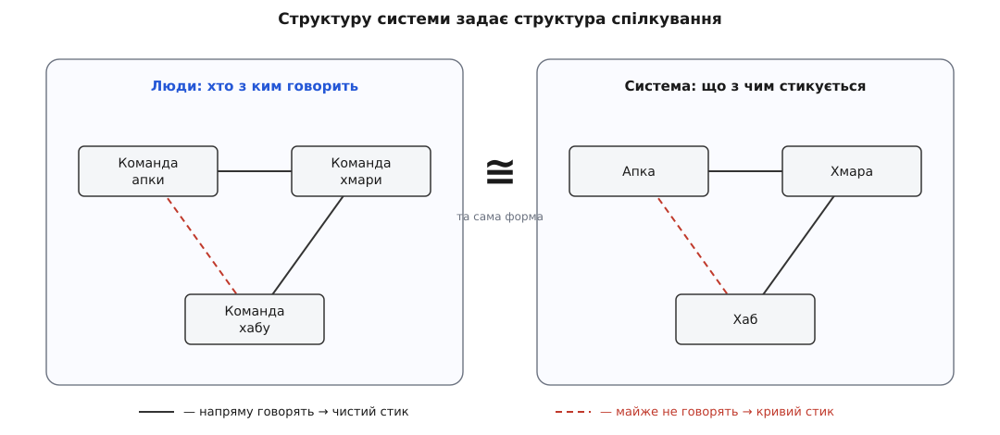
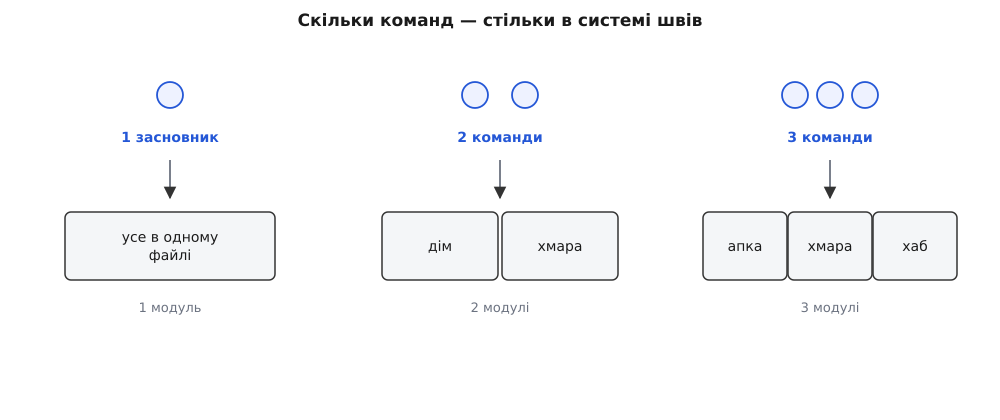

# Закон Конвея як анонс

<preknowlist>
- [Зчеплення і зв'язність](topic:programming/coupling-cohesion) — система складається з частин, що стикуються через інтерфейси; там, де дві частини мусять працювати разом, між ними завжди є узгоджена межа.
</preknowlist>

Весь цей модуль тримався на одній тихій ідеї. Архітектура живе не в коді й не в діаграмі — вона живе в головах людей, і туди її доводиться **доносити**. Тому ми вчилися її показувати: малювали [систему в кількох в'ю](root:progarch/dh-v2-views), щоб кожен бачив те саме; записували рішення в журнал і design-doc, щоб домовленість не вивітрилась; виносили її на рев'ю; зрештою вчилися [впливати без наказу](root:progarch/influence-without-authority) — переконувати тих, кому не можеш звеліти. Наскрізний мотив усього цього — **спілкування**: архітектура стає реальною рівно настільки, наскільки люди про неї поговорили й дійшли згоди.

І весь модуль ми поводилися зі спілкуванням як з інструментом архітектора — способом рознести готовий задум по головах. А тепер — розворот, яким цей модуль і хочеться закрити. Що, як спілкування не просто **розносить** задум, а **ліпить** його? Що, як форму системи наперед задає не найрозумніша діаграма, а те, хто з ким у команді взагалі розмовляє?

## Чому форма системи повторює форму розмов

Розберімо це від першопричини, без містики. Візьміть будь-які дві частини системи, які мусять працювати разом, — скажімо, апку й хмару. Щоб вони зістикувались, хтось має **домовитися про інтерфейс** між ними: які виклики, які поля, хто за що відповідає, що буде при помилці. А домовитися про інтерфейс означає, що люди, які пишуть апку, і люди, які пишуть хмару, мусять сісти й поговорити. Іншого шляху немає: [чистий стик між двома частинами](topic:programming/coupling-cohesion) — це завжди застигла згода двох груп людей.

Тепер прокрутіть це через цілу організацію. Там, де дві групи говорять щодня, між їхніми частинами виростає багатий, обдуманий, добре підігнаний інтерфейс — бо його довго обговорювали. А там, де дві групи майже не перетинаються, стик між їхніми частинами виходить тонким, кривим або взагалі відсутнім — бо його ніхто до пуття не узгодив. Хочеш ти цього чи ні, **граф «хто з ким говорить» відбивається на графі «що з чим з'єднано»**. Система набуває форми, яка є копією того, як усередині організації течуть розмови.

*Права картинка — не окреме рішення, а тінь лівої. Навіть «дірка» переноситься: команди апки й хабу говорять рідко — і прямий стик між апкою та хабом виходить кривим.*

> 🔧 **Навіщо це.** Це найдешевший детектор майбутніх проблем в архітектурі, який узагалі є. Хочеш угадати, де в системі будуть найкрихкіші стики? Не дивись у код — подивись, які дві команди сидять на різних поверхах, у різних часових поясах чи просто в холодних стосунках. Саме на межі між ними інтерфейс вийде найтоншим і найгірше проговореним. Закон Конвея перетворює соціальну карту офісу на карту технічних ризиків — ще до першого рядка коду.

## Звідки взявся закон

Це спостереження не нове. Ще 1967 року американський програміст **Мелвін Конвей** (Melvin E. Conway) написав статтю «Як винаходять комітети?» (*How Do Committees Invent?*) і подав її до *Harvard Business Review*. Там її відхилили — мовляв, тезу не доведено. Вийшла вона аж наступного року, у квітні 1968-го, у комп'ютерному часописі *Datamation*. Формулювання Конвея було сухе, майже теоремне: організації, які проєктують системи, приречені видавати проєкти, чия структура копіює структуру спілкування самих цих організацій.

Назву «закон Конвея» закріпив пізніше Фред Брукс (Fred Brooks), згадавши це спостереження у своїй класичній «Міфічній людино-місяці» (*The Mythical Man-Month*, 1975). А найпам'ятніше формулювання дав уже інший — Ерік Реймонд (Eric S. Raymond) у «Словнику хакера», стиснувши приклад із Конвеєвої статті до жарту: **«Якщо над компілятором працюють чотири групи — вийде чотирипрохідний компілятор.»** Смішно, бо правда: кількість проходів визначив не аналіз задачі, а те, що людей поділили на чотири бригади. Жарт, звісно, згущує — ніхто не саджає рівно по бригаді на прохід; але згущує він **справжню** силу, а не вигадану.

## Це сила, а не курйоз

Легко відмахнутися: цікаве спостереження, буває. Але закон Конвея — не курйоз, а **сила**, і діє вона сама, без чийогось наміру. Причина проста: збіг із формою спілкування — це просто **найдешевший шлях**. Проєкт, у якому кожна команда відповідає за свій шматок і стикується із сусідами рівно там, де й так із ними говорить, ліпиться майже без тертя. Будь-який інший — де команда мусить весь час узгоджувати внутрішній устрій свого шматка з трьома чужими, — вимагає стількох розмов, що організація тихо зісковзує назад, до форми, яка збігається з її спілкуванням. Ніхто цього не вирішує. Воно **складається саме**.

І тут варто впізнати старого знайомого. На самому початку курсу ми домовилися, що [архітектура складається сама, коли її не обирають свідомо](root:progarch/what-is-architecture) — код, що просто ліг як ліг, усе одно щось вирішив. Закон Конвея — той самий закон, тільки на поверх вище: тепер сама собою складається не форма коду, а форма **організації**, відбита в системі. І що більша фірма, то жорсткіша ця сила — бо [кількість каналів спілкування росте страшенно швидко](topic:programming/communication-paths): десятеро людей — це вже сорок п'ять можливих пар (10·9/2), і всім поговорити з усіма фізично нема коли. Спілкування стає вузьким місцем, а отже — і межею того, якою система взагалі може бути.

## Що це означає для Digital Homes

Поки що закон Конвея з DH ласкавий — бо організації як такої ще нема. За [нашою системою](root:progarch/dh-v2-views) стоїть один засновник, одна голова. Один вузол у графі спілкування — і система відповідно вийшла одним шматком: пригадайте v0, де хаб, логіка й конфіг жили в одному файлі. Це не випадковість і не неохайність — це закон Конвея у виродженому випадку: один розум не має внутрішніх меж спілкування, тож і система не має внутрішніх швів.

Але DH росте — і саме тут анонс стає попередженням. Наймуть окрему команду на мобільну апку, окрему — на хмару, окрему — на прошивку хаба. І тієї ж миті контейнерна в'ю, яку ми малювали, — апка, хмара, хаб — почне тверднути **вздовж меж між командами**. Стик апка↔хмара стане чітким і доглянутим, бо ці двоє щодня перемовляються. А стик між командою апки й командою прошивки — тими, хто сидить найдалі одне від одного, — вийде найкривішим; згадайте пунктирну червону лінію на дзеркалі.

*Число швів у системі тягнеться за числом команд, а не за задачею. Ось чому вибір, скільки й яких завести команд, — це вже архітектурне рішення, хоч ухвалює його відділ кадрів.*

І ось у чому небезпека, вже знайома нам за формою. Якщо ніхто не вирішує структуру команд **свідомо, з думкою про систему**, то її вирішить за вас випадок. Хто кого встиг найняти, хто з ким дружить, який відділ історично «володіє» сервером — усе це тихо проступить у DH як його архітектура. Це та сама пастка неявного рішення, з якої почався курс, тільки тепер незворотність куди більша: перемалювати межу між модулями важко, а перемалювати межу між **командами живих людей** — важко вдесятеро.

## Тому ж законом можна й скористатися

Якщо організація ліпить систему, то стрілку можна повернути. Хочеш певної архітектури — **збери команди так**, щоб вони природно її й видали. Прагнеш, щоб хаб був самодостатнім і жив без хмари? Постав окрему команду, яка володіє хабом цілком, і не змушуй її щохвилини бігати узгоджувати внутрішній устрій із хмарною. Форма спілкування, яку ти навмисне задав, проступить у системі як бажана форма. Цей навмисний хід — [зворотний маневр Конвея](topic:programming/inverse-conway): не боротися із законом, а осідлати його. Тут ми його лише називаємо; окремий модуль наприкінці курсу присвячений цілком тому, як кроїти команди під архітектуру.

> 🔧 **Навіщо це.** Найчастіше пересаджувати людей тобі ніхто не дасть — зате закон можна читати навпаки, як діагноз. Коли якийсь стик у системі ламається знову й знову, попри всі виправлення, спитай не «що не так із кодом», а «чи ці дві команди взагалі говорять». Дуже часто справжній ремонт — не ще один патч, а постійний канал між двома групами: спільний чат, регулярна синхронізація, одна людина-місток. Полагодили розмову — випрямився й стик.

## Чому цей анонс — саме тут

Тепер видно, навіщо закон Конвея стоїть наприкінці модуля **про комунікацію**, а не десь у розділі про організацію. Бо він зшиває докупи весь модуль. Усе, що ми тут робили, — в'ю, журнали рішень, рев'ю, [вплив без наказу](root:progarch/influence-without-authority) — це не просто способи **продати** архітектуру. Це вправи над тим самим спілкуванням, яке, за Конвеєм, і є формою, у яку застигне система. Коли ти зводиш людей на рев'ю, коли пробиваєш спільний словник у design-doc, коли переконуєш дві команди узгодити межу — ти не лише доносиш архітектуру. Ти тихенько її **редагуєш**, бо міняєш те, хто з ким і про що говорить.

Це і є місток, яким модуль виходить до решти курсу: від «як показати архітектуру» — до «організація сама і є архітектура». Повну версію закону, окремою статтею, можна прочитати [вже зараз](topic:programming/conways-law); а по-справжньому — з топологіями команд, когнітивним навантаженням і мапою команд DH проти мапи контекстів — курс візьметься за це аж наприкінці, коли буде що кроїти. Поки досить побачити головне: діаграма, яку ти малюєш, і схема розсадки твоєї команди — це та сама діаграма, ти просто ще не помітив.

А наступний крок скромніший і ближчий: перш ніж рушати далі, зберемо весь цей модуль в одну ниточку — простежимо одне-єдине рішення в DH від першої розмови до рядка коду, наскрізним слідом.
