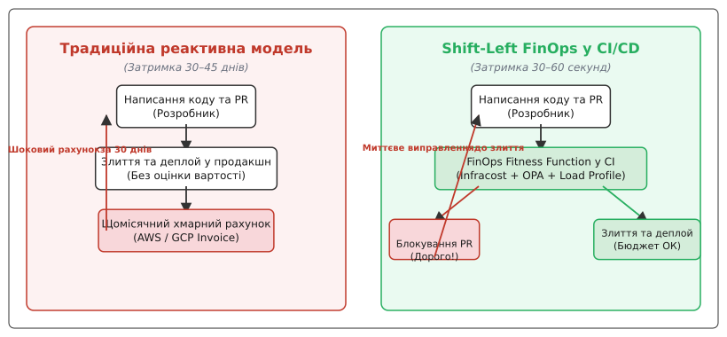
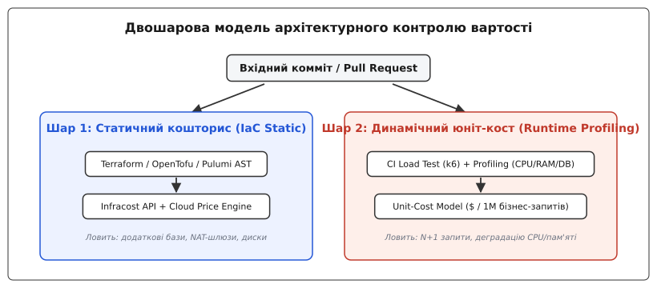
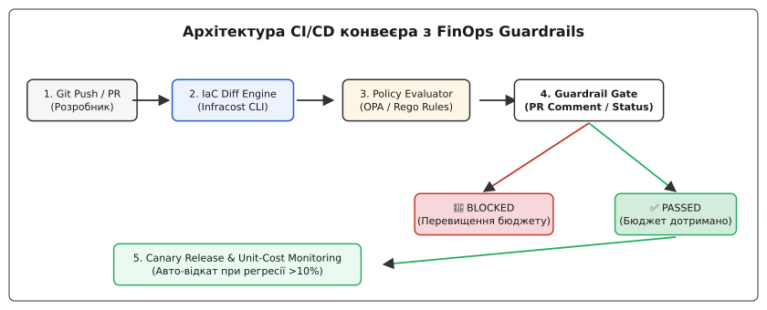

# Вартість як fitness-функція в CI

<preknowlist>
- [Cloud cost як архітектурний драйвер](root:progarch/cost-and-lock-in/cloud-cost-model) — юніт-економіка, розкладання хмарного рахунку на метрики навантаження та фінансові важелі.
- [Фітнес-функції](root:progarch/mindset/fitness-functions) — автоматизовані архітектурні перевірки в CI/CD конвеєрі для запобігання ерозії системи.
- [FinOps-важелі](root:progarch/cost-and-lock-in/finops-levers) — право власності на витрати, розміркування серверів, зарезервовані потужності та автомасштабування.
</preknowlist>

Невдалий пул-реквест у мікросервісі обробки телеметрії Digital Homes змінює розмір індексів у PostgreSQL та додає виклик `JSONB_TO_RECORDSET` на кожен вхідний запит. У тесті на staging сервіс пройшов усі unit- та інтеграційні тести, оскільки функціональні вимоги справджуються: сервіс повертає правильні дані з кодом відгуку `200 OK`. Проте після розгортання в продакшн навантаження на процесори бази даних RDS зросло з 15% до 85%, змусивши плагін автомасштабування підняти клас екземпляра з `db.r6g.xlarge` ($0.48/год) до `db.r6g.8xlarge` ($3.84/год) із додаванням трьох читацьких реплік. За місяць непомічена зміна на 5 рядків коду згенерувала незапланований рахунок на $14,200 — і команда дізналася про це лише під час щомісячного фінансового звіту (Cloud Invoice), коли код уже три тижні працював у продакшені.

Ця ситуація демонструє фундаментальну проблему традиційної інженерної практики: **асиметрію часових петель зворотного зв'язку** (англ. *feedback loop asymmetry*). Помилки синтаксису розробник бачить за секунди в IDE; дефекти функціональності ловляться за хвилини під час виконання юніт-тестів у CI; але фінансові наслідки невдалих архітектурних рішень стають видимими лише через 30–45 днів, коли хмарний провайдер формує фінальний рахунок. Щоб закрити цю прірву, зріла архітектурна дисципліна висуває концепцію **Shift-Left FinOps**: перенесення фінансового аналізу безпосередньо в конвеєр CI/CD, де **вартість виступає як автоматизована архітектурна fitness-функція** (англ. *architectural fitness function*).

## 1. Пастка пізнього фінансового зворотного зв'язку

У традиційній системі управління інфраструктурою вартість вважається зоною відповідальності відокремленого фінансового відділу або Ops-команди, які аналізують хмарні рахунки post-factum. Такий підхід створює реактивну петлю зворотного зв'язку з величезним часовим запазнюванням. Коли фінансовий аналітик або DevOps-інженер помічає аномальне зростання витрат у консолі AWS Cost Explorer чи GCP Billing, контекст розробника, який написав марнотратний код, уже повністю втрачено. Інженер давно працює над іншими завданнями, і спроба з'ясувати, який саме комміт трьохтижневої давнини спричинив зростання рахунку, перетворюється на складне та дороге розслідування.

```
Традиційний реактивний цикл:
[ PR злито ] ──(30 днів)──> [ Рахунок AWS ] ──(7 днів)──> [ Аналіз FinOps ] ──(14 днів)──> [ Хотфікс ]
  ▲                                                                                         │
  └────────────────────────────── (60 днів витрат у порожнечу) ─────────────────────────────┘
```

Головна небезпека реактивного підходу полягає в тому, що сучасні хмарні платформи за своєю природою розроблені для **автоматичного приховування інженерних дефектів за допомогою фінансових ресурсів**. Коли код стає повільнішим або створює підвищене навантаження на систему, автомасштабування (Auto-scaling Groups, Kubernetes Horizontal Pod Autoscaler, DynamoDB Auto-scaling) мовчки підключає додаткові серверні потужності, компенсуючи алгоритмічну неефективність новими грошовими витратами. Система зберігає високий рівень доступності та низький час відгуку, але робить це ціною вибухового зростання щомісячного рахунку.

У цій точці виникають три класичні архітектурні антипатерни хмарної економіки:

1. **Необмежене автомасштабування (Unbounded Auto-scaling):** Відсутність жорстких фінансових та ресурсних стель перетворює алгоритмічну помилку складності `O(N²)` на незаплановані витрати у тисячі доларів. Автомасштабування рятує систему від відмови (outage), але створює прихований фінансовий інцидент.
2. **Тихий дрейф ресурсів-сиріт (Orphan Resources & Silent Creep):** Під час виконання експериментів або тестових розгортань у хмарі створюються додаткові компоненти (EBS-томи, утилізовані Elastic IP, NAT-шлюзи, додаткові індекси у базах даних). Після завершення тесту основні екземпляри видаляються, але супутні ресурси залишаються та мовчки генерують витрати протягом місяців.
3. **Протікання абстракцій мережевого трафіку (Cloud Network Abstraction Leak):** На локальному ноутбуці розробника або у тестовому середовищі виклики між сервісами є безкоштовними. Проте у хмарі виклик між різними зонами доступності (Cross-AZ Traffic) або між регіонами (Cross-Region Egress) тарифікується за кожен гігабайт переданих даних. Неоптимальна архітектура розміщення сервісів може генерувати рахунки за трафік, які перевищують вартість самих обчислювальних серверів.

### Анатомія фінансового богу та протікання абстракцій у мікросервісах

У складних мікросервісних архітектурах фінансовий збій рідко виникає як один великий дефект. Частіше це результат каскадного протікання абстракцій між кількома шарами системи. Розгляньмо типовий сценарій:

- Розробник додає новий поля у DTO та вмикає додаткову серіалізацію JSON у високонавантаженому сервісі обробки подій.
- Використання процесора на кожен запит зростає лише на 0.8 мс. Для одного запиту це непомітно.
- Проте при обсязі 200 мільйонів запитів на добу сумарний додатковий процесорний час становить 160,000 секунд на день (понад 44 vCPU-години щодня).
- Плагін Kubernetes HPA реагує на зростання середнього CPU Utilization вище 70% та збільшує кількість подів із 20 до 50.
- Додаткові поди вичерпують пул з'єднань до бази даних (Database Connection Pool Exfiltration), змушуючи базу створювати нові процеси обробки та піднімати використання пам'яті.
- База даних входить у стан swap і починає активний обмін з диском, вичерпуючи ліміти IOPS Burst Balance, що змушує DevOps-інженерів перевести диски у дорогий режим Provisioned IOPS.

У результаті незначна зміна у серіалізації JSON на 5 рядків коду призводить до каскадного подорожчання обчислювального кластера, бази даних та мережевого транзиту. Без автоматизованої фітнес-функції у CI виявити причинно-наслідковий зв'язок між цими подіями після отримання щомісячного рахунку стає майже неможливим.


*Еволюція зворотного зв'язку: перенесення оцінки вартості з щомісячних рахунків у CI/CD конвеєр.*

Оцінка вартості в рамках фітнес-функції відповідає чотирьом класичним критеріям архітектурного тестування:
- **Автоматизованість (Automated):** Перевірка виконується машиною у конвеєрі без участі людини.
- **Безперервність (Continuous):** Оцінка відбувається при кожному створенні або оновленні Pull Request.
- **Цілісність (Holistic):** Вимірюється загальний вплив зміни на весь кошторис сервісу та його залежностей.
- **Об'єктивність (Measurable):** Результат виражається у точних точних числах — абсолютній зміні кошторису в USD та відносній зміні юніт-вартості у відсотках.

## 2. Двошарова модель фітнес-функції вартості

Контроль вартості у CI неможливо звести до одного інструменту, оскільки фінансові витрати виникають із двома принципово різними механізмами: від **явних змін інфраструктурної конфігурації** та від **неявних алгоритмічних деградацій коду**. Тому зріла архітектура будує двошарову модель перевірки.


*Двошарова модель фітнес-функцій: поєднання статичного контролю інфраструктурного наміру (IaC) та динамічного профілювання юніт-вартості.*

### Шар 1. Статична фітнес-функція (Static IaC Cost Guardrails)

Статичний шар аналізує декларативний код інфраструктури (Infrastructure as Code — IaC): Terraform, OpenTofu, CloudFormation, Pulumi, Kubernetes Manifests чи Helm-чарти. Його головна мета — зупинити марнотратні інфраструктурні рішення **ще до того, як ресурси будуть фізично створені у хмарі**.

Під час створення або оновлення Pull Request інструмент статичного аналізу (наприклад, Infracost CLI) виконує такі кроки:
1. Синтаксичний аналіз модифікованих файлів конфігурації HCL/YAML та генерація абстрактного синтаксичного дерева (AST).
2. Побудова графа залежностей та зіставлення нових файлів стану із базовим станом (State File) з гілки `main`.
3. Зіставлення декларованих ресурсів із розширеним каталогом цін хмарного провайдера через Cloud Pricing API (AWS Price List API, GCP Catalog API, Azure Retail Prices API).
4. Обчислення прогнозної щомісячної вартості кожного ресурсу, враховуючи атрибути конфігурації (клас інстансу, обсяг диска, коефіцієнт зарезервованих операцій IOPS, наявність Multi-AZ).

Результатом роботи цього шару є точний розрахунок абсолютного та відносного зсуву кошторису:

```
Δ Cost_monthly = Cost_new - Cost_baseline
```

Статична фітнес-функція миттєво виявляє та блокує такі типові помилки інфраструктурного проєктування:
- Випадковий деплой дорогого екземпляра Managed Kafka, Redis Cluster або NAT Gateway для тестового середовища;
- Перехід бази даних з однозонового варіанта у Multi-AZ конфігурацію без узгодженого бюджету;
- Збільшення зарезервованої швидкодії дискових накопичувачів EBS (io2 / gp3 Provisioned IOPS) до невиправдано високих значень;
- Створення додаткових читацьких реплік бази даних замість оптимізації індексів.

Проте статичний аналіз має очевидні обмеження. Він є **абсолютно сліпим до змін у коді застосунку**. Якщо розробник додає алгоритм, який створює мільйони непотрібних HTTP-викликів або навантажує CPU на 100%, конфігурація Terraform залишається абсолютно чистою, і статична фітнес-функція видасть позитивний вердикт. Крім того, статичний аналіз важко обчислює витрати для серверлесс-компонентів (AWS Lambda, Google Cloud Run) та ресурсів із динамічним навантаженням, де підсумковий рахунок повністю залежить від обсягу трафіку в рантаймі.

### Шар 2. Динамічна фітнес-функція (Dynamic Unit-Cost Profiling)

Динамічний шар оцінює фінансову ефективність коду під час його безпосереднього виконання у рантаймі. Він вирішує завдання, які недоступні статичному аналізу: вимірює, скільки реальними грошима коштує виконання однієї бізнес-операції (обробка одного пакета телеметрії смарт-хаба, обчислення одного маршруту, авторизація одного користувача).

Динамічна фітнес-функція поєднує автоматизоване навантажувальне тестування у CI/CD (за допомогою k6, Locust чи Apache JMeter) із профілюванням системних ресурсів. Під час виконання CI-пайплайну нова версія сервісу розгортається в ізольованому тестовому середовищі та піддається каліброваному навантаженню у 1000 стандартних запитів.

Під час тестування низькорівневі агенти збору телеметрії вимірюють ключові фізичні показники виконання:
- Загальний час використання процесора (`User CPU time` + `System CPU time` у мілісекундах);
- Обсяг виділеної та утримуваної пам'яті (`Resident Set Size` / `Allocated Heap` у мегабайтах);
- Кількість операцій читання та запису до бази даних (`DB Read/Write Query Count`);
- Обсяг вихідного мережевого трафіку (`Network Egress Bytes`).

На основі зібраних фізичних метрик та каталогу тарифів хмари обчислюється підсумковий **вартісний профіль транзакції** (Unit Cost):

```
Unit Cost = (CPU_ms · Price_CPU) + (RAM_MB_sec · Price_RAM) + (DB_queries · Price_DB_query) + (Network_MB · Price_Egress)
```

Якщо внаслідок неоптимальної роботи з пам'яттю або появи алгоритмічного дефекту юніт-вартість транзакції зростає, наприклад, із `$0.0000012` до `$0.0000085` (зростання на 608%), динамічна фітнес-функція сигналізує про фінансову регресію й зупиняє розгортання, навіть якщо час відгуку сервісу вклався у допущені ліміти завдяки потужному тестовому процесору.

### Стратегії бенчмаркінгу та вибір навантажувальних профілів для CI

Щоб динамічна фітнес-функція давала відтворювані та надійні результати у середовищі CI, навантажувальне тестування повинно відповідати трьом суворим методологічним вимогам:

1. **Ізоляція зовнішніх залежностей (Mocking & Dependency Stubbing):** Виклики до сторонніх API (Stripe, Twilio, OpenAI) або важких баз даних під час CI-тесту замінюються високопродуктивними заглушками (Mocks/WireMock). Це гарантує, що вимірюється саме вартісний профіль кодової бази сервісу, а не затримки зовнішніх мереж.
2. **Фільтрація прогреву рантайму (JVM / JIT Warm-up Removal):** У мовах із віртуальними машинами (Java, C#, Node.js) перші сотні запитів витрачають додатковий CPU на JIT-компіляцію та завантаження класів. Скрипт профілювання відкидає перші 200 запитів як фазу прогреву (warm-up phase) і обчислює юніт-вартість лише на стабілізованому плато виконання.
3. **Статистична відтворюваність (Outlier Filtering):** Вимірювання виконуються у серії з 5 ітерацій, після чого застосовується фільтрація аномальних викидів (наприклад, за критерієм три-сигма) для усунення впливу суміжних процесів на CI-воркері.

Детальний математичний апарат розкладання витрат, обчислення маржинальної вартості та оцінки статистичної значущості відхилень наведено у [математичній моделі атрибуції юніт-косту та маржинальних витрат](root:progarch/cost-and-lock-in/cost-as-fitness-function/math-unit-cost-attribution.md).

| Характеристика | Шар 1. Статична фітнес-функція | Шар 2. Динамічна фітнес-функція |
| :--- | :--- | :--- |
| **Об'єкт аналізу** | Інфраструктурний код (Terraform, Pulumi, K8s) | Код застосунку (Go, Java, Python, C++) |
| **Точка перевірки** | Аналіз PR до створення ресурсів (Pre-Apply) | CI Load Test / Canary Deployment |
| **Основний інструмент** | Infracost CLI, Open Policy Agent (OPA) | k6, Prometheus metrics, Custom Profiler |
| **Що виявляє** | Пряме подорожчання конфігурації | Неоптимальні алгоритми, N+1, витоки пам'яті |
| **Швидкість відгуку** | 5–15 секунд | 2–5 хвилин |
| **Точність для Serverless** | Низька (потребує оцінки трафіку) | Абсолютна (вимірює реальне виконання) |

## 3. Архітектура конвеєра CI/CD із FinOps-вартовими

Щоб фітнес-функція вартості діяла як надійний та прозорий архітектурний запобіжник, вона інтегрується у CI/CD конвеєр у вигляді **FinOps-вартового** (англ. *FinOps Guardrail*). Це автоматизована система, яка супроводжує код на всіх етапах його проходження від локального комміту до виробничого середовища.


*Наскрізний процес контролю вартості у CI/CD: від аналізу комміту до канаркового моніторингу юніт-косту.*

Конвеєр обробки складається з п'яти послідовних кроків:

1. **Крок 1. Git Push та тригер PR:** Розробник публікує нову гілку та створює Pull Request у системі контролю версій (GitHub, GitLab, Bitbucket).
2. **Крок 2. Генерація Diff-кошторису:** Infracost CLI автоматично зчитує зміни у конфігурації IaC, будує базовий кошторис гілки `main` та кошторис поточного PR, формуючи машиночитаний JSON-документ зі структурованим розкладом витрат.
3. **Крок 3. Оцінка політик OPA (Policy Engine):** Двигун Open Policy Agent аналізує JSON-звіт Infracost та результати профілювання на відповідність корпоративним Rego-правилам та бюджетним лімітам домену.
4. **Крок 4. Вердикт та зворотний зв'язок у PR:** Бот публікує детальну таблицю витрат у коментарях PR та встановлює відповідний статус перевірки (Commit Status Check):
   - **`PASSED`** — приріст витрат у межах норми (наприклад, `< $50/міс` та `< 10%`);
   - **`WARNING`** — значний приріст, що вимагає пояснення в описі PR або посилання на ADR;
   - **`BLOCKED`** — критичне перевищення ліміту (наприклад, `> $200/міс`), що автоматично блокує можливість злиття (Merge Block).
5. **Крок 5. Канарковий моніторинг юніт-косту (Canary Gate):** Після успішного злиття під час канаркового розгортання (Canary Deployment) у продакшн система профілювання спостерігає за реальним вартісним профілем коду на 5% живого трафіку. При виявленні аномального зростання юніт-косту понад 15% спрацьовує автоматичний відкат (Canary Rollback).

### Атрибуція витрат у мульти-тенантних Kubernetes кластерах

При розгортанні мікросервісів у спільних контейнерних кластерах Kubernetes (Multi-tenant Clusters) виникає складне архітектурне питання: як статична фітнес-функція оцінює зміну кошторису, якщо розробник змінює лише конфігурацію ресурсних запитів у маніфесті Pod (`resources.requests` та `resources.limits`)?

У цьому разі фітнес-функція спирається на метрики OpenCost / Kubecost API. Зміна декларацій `requests.cpu` з `200m` до `1000m` та `requests.memory` з `512Mi` до `2Gi` трансформується у грошовий еквівалент на основі вартості вузла кластера:

```
Pod Cost = (CPU_requests / Node_CPU_capacity) · Node_Monthly_Cost + (RAM_requests / Node_RAM_capacity) · Node_Monthly_Cost
```

Якщо новий маніфест вимагає виділення додаткової частки вузла, яка збільшує умовний кошторис поди на $45/місяць, статичний вартовий у CI фіксує це як інфраструктурний приріст і оцінює його за загальними правилами Guardrails.

Принциповим елементом цієї архітектури є **прозорість та наочність зворотного зв'язку**. Замість того щоб просто відхилити PR з незадовільною помилкою, FinOps-бот будує наочну маркдаун-таблицю, де кожен модифікований ресурс розкладено до рівня конкретних цінових компонентів. Це дозволяє інженерній команді миттєво побачити, яка саме нова настройка (наприклад, додавання 500 ГБ Provisioned IOPS для диска) створила основний приріст витрат.

Повні JSON-схеми звіту, Rego-правила OPA та матрицю конфігураційних лімітів узагальнено в [специфікації та правилах FinOps-політик Infracost та OPA](root:progarch/cost-and-lock-in/cost-as-fitness-function/api-infracost-policy.md).

Готовий робочий код CI/CD конвеєра для GitHub Actions та Python-скрипт оцінки метрик наведено у [робочій реалізації автоматизованого FinOps-конвеєра у CI/CD](root:progarch/cost-and-lock-in/cost-as-fitness-function/proj-cost-guardrail-pipeline.md).

## 4. Культура, процеси та протидія «алертній втомі»

Найбільшим ризиком при впровадженні фітнес-функцій вартості є **алертна втома** (англ. *alert fatigue*) та спротив з боку інженерних команд. Якщо CI-конвеєр починає суворо блокувати кожен PR через найменше збільшення витрат на пару доларів, розробники починають сприймати FinOps як бюрократичний гальмовий багнет, який руйнує швидкість поставки коду (developer velocity).

Щоб побудувати здорове інженерне середовище, зріла архітектурна практика спирається на чотири процесні запобіжники:

### 1. Гнучка градація лімітів (Soft vs Hard Guardrails)

Не всі витрати є однаково шкідливими. Додавання інфраструктурних ресурсів для забезпечення нового бізнес-функціоналу є абсолютно природним і виправданим кроком. Тому політика CI розділяє м'які та жорсткі межі реагування:
- **М'яка межа (Soft Limit, наприклад +$50/міс або +5%):** CI генерує інформаційне повідомлення у коментарях PR, привертаючи увагу команди, але не блокує злиття.
- **Жорстка межа (Hard Limit, наприклад +$200/міс або +15% від базового бюджету сервісу):** CI блокує можливість злиття до отримання явного схвалення від Tech Lead або FinOps-архітектора.

### 2. Механізм екстреного обходу (Emergency Bypass Process)

Якщо у продакшені стався критичний інцидент (P0/P1 Outage), і для його негайного усунення потрібно терміново підняти обсяг ресурсів або додати новий екземпляр бази даних, інженер не повинен чекати проходження довгих процедур фінансового погодження.

Для таких ситуацій у CI закладається чітко регламентований механізм обходу через додавання спеціальної GitHub-мітки `cost-bypass-approved`. При виявленні цієї мітки CI-бот знімає жорстке блокування та дозволяє злити PR. Проте ця дія автоматично активує тригер у системі управління завданнями (Jira/Linear), створюючи квиток обов'язкового post-mortem аналізу, який команда мусить закрити протягом 48 годин після усунення аварії.

```
Схема процесу обходу (Bypass Lifecycle):
[ P1 Аварія ] ──> [ Додавання мітки cost-bypass-approved ] ──> [ CI пропускає PR ] ──> [ Авто-квиток Post-Mortem (48 год) ]
```

### 3. Зв'язок із записами архітектурних рішень (ADR Integration)

Збільшення витрат на інфраструктуру часто є свідомим архітектурним компромісом (trade-off). Наприклад, команда вирішує впровадити Redis-кеш для зниження часу відгуку системи з 500 мс до 15 мс. Це рішення збільшує щомісячний кошторис на $150, але суттєво покращує атрибут якості `Performance`.

У цьому разі блокування CI знімається не через аварійний bypass, а через вказівку посилання на відповідний **Запис архітектурного рішення** (Architecture Decision Record — ADR) у тексті Pull Request. Перевірочний бот валідує наявність посилання на ADR у репозиторії й автоматично переводить статус перевірки у стан `PASSED`.

### 4. Культура «Кожен долар має власника» (Cost Ownership)

Фітнес-функція у CI обов'язково перевіряє наявність обов'язкових фінансових тегів на всіх нових та модифікованих ресурсах: `Owner`, `CostCenter`, `Environment`, `Service`.

Якщо розробник створює новий екземпляр бази даних або S3-бакет без вказівки тегу команди-власника (`CostCenter: data-team`), CI блокує PR **незалежно від вартості ресурсу**, навіть якщо він коштує 10 центів на місяць. Це правило запобігає виникненню «сирітських» ресурсів у хмарі та гарантує 100% атрибуцію витрат до конкретних інженерних доменів.

### Ключові метрики ефективності FinOps у CI (FinOps Adoption Metrics)

Для оцінки успішності впровадження фітнес-функцій вартості інженерні менеджери відстежують три метрики на рівні всієї організації:

- **Коефіцієнт блокування PR (PR Block Ratio):** Відсоток PR, заблокованих фінансовим вартовим. Оптимальне значення становить 2–5%. Значення > 10% вказує на занадто суворі порогові значення, а < 0.5% — на недуже дієві політики.
- **Середній час усунення попередження (Mean Time to Resolve Cost Warning):** Час, який витрачає розробник на оптимізацію коду або інфраструктури після отримання зауваження від CI-бота (орієнтир: < 30 хвилин).
- **Динаміка юніт-вартості продукту (Product Unit Cost Trend):** Помісячний графік зміни юніт-вартості ключових бізнес-транзакцій. Зріла FinOps-культура демонструє стійкий тренд до зниження юніт-вартості при зростанні загального масштабу системи.

> 🔧 **Навіщо це.**
> Інтеграція вартості як фітнес-функції у CI/CD перетворює фінансові витрати з реактивної проблеми на прозорий атрибут якості коду. Вона виявляє алгоритмічні та конфігураційні дефекти ще до потрапляння в продакшн, зберігає сотні тисяч доларів хмарного бюджету та виховує в розробників зріле архітектурне мислення, де швидкість коду й вартість його виконання оцінюються як єдине ціле.
