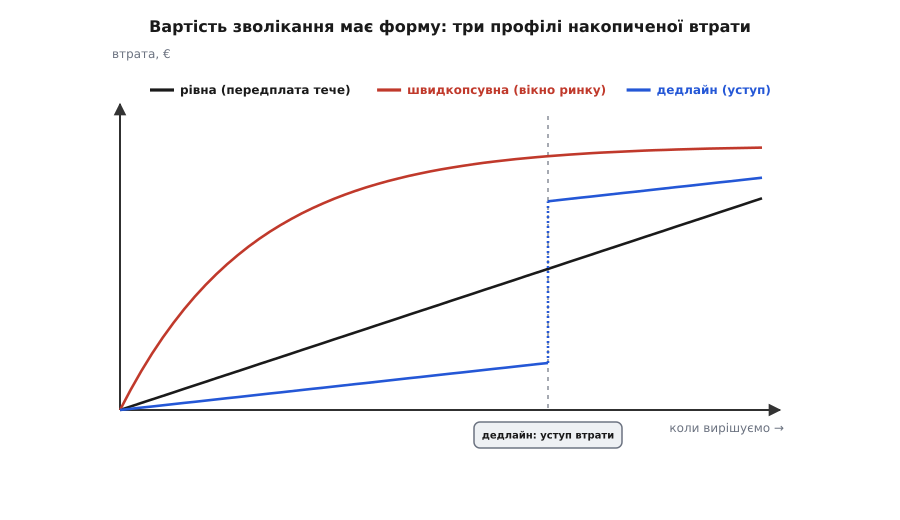
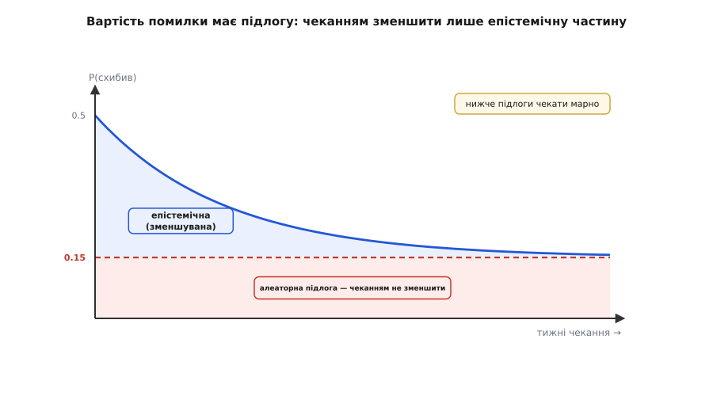
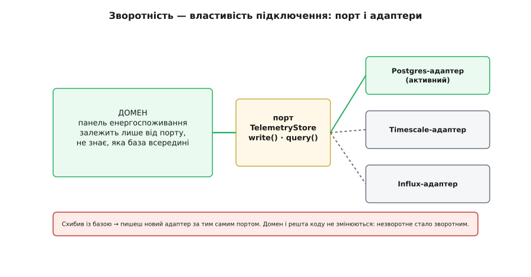
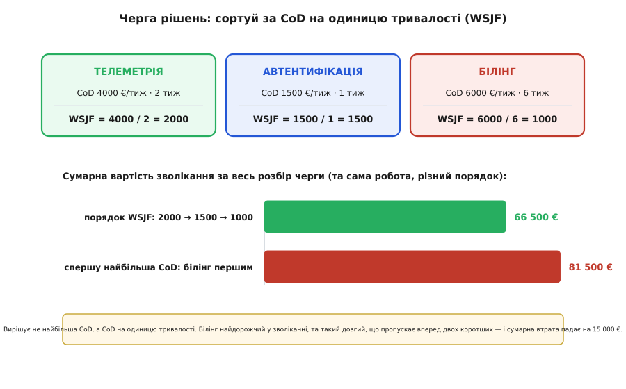

# Вартість зволікання проти вартості помилки

<preknowlist>
- [Середнє й дисперсія](book:math/mean-variance) — очікуване значення: імовірність, помножена на наслідок, і підсумована; «середній результат» як зважена сума можливих кінцівок.
- [Похідна](book:math/derivative) — миттєва швидкість зміни величини; нам знадобиться читати «нахил» кривої вартості й «граничну» вартість наступного тижня.
</preknowlist>

Базова версія цього кроку дала нам робочий каркас: над кожним рішенням у невизначеності цокають **два лічильники** — очікувана вартість помилки (ймовірність схибити, помножена на ціну переробки) і вартість зволікання (гроші за тиждень простою). Ми звели їх на одну шкалу, побачили U-подібну криву сумарної вартості з мінімумом на [останньому відповідальному моменті](book:programming/last-responsible-moment), розклали ситуації на чотири клітинки й вивели головний прийом: не обирати «А чи Б», а дешевими структурними ходами зсунути рішення в лагіднішу клітинку.

Той каркас — правда, але правда спрощена. У ньому обидва лічильники вдавали простими числами: зволікання — стала швидкість, помилка — одне P, що плавно спадає. Насправді **кожен із них має приховану будову**, і майстерність архітектора починається саме там, де ця будова стає видно. Вартість зволікання має **форму в часі**, а не лише величину. Вартість помилки складається з двох різних матерій, і чекання гризе лише одну з них. Зворотність, за яку ми ховаємо рішення, — не дар природи, а **властивість, яку виготовляють руками**, і в неї є своя ціна. А коли рішень багато, вони шикуються в чергу, і черга має власну арифметику. Розберімо все це по черзі — не щоб ускладнити каркас, а щоб побачити, за які саме важелі він насправді тягнеться.

## Вартість зволікання має форму, а не лише швидкість

У базовому прикладі зволікання Digital Homes текло рівно: 4 000 € щотижня, тиждень у тиждень. Це найпростіша з можливих форм, і саме тому вона оманлива — вона вдає, ніби вартість зволікання це одне число. Насправді це **функція часу**: скільки цінності вже втрачено, якщо ухвалити рішення в мить t. І форма цієї функції змінює геть усе — де лежить оптимум, чи є він узагалі, як пізно взагалі можна тягти.

Придивімося до трьох профілів, що трапляються найчастіше.


*Накопичена втрата залежно від того, коли вирішуємо. Рівний профіль (передплата тече) дає пряму: кожен тиждень однаково дорогий. Швидкопсувний (вікно ринку зачиняється) втрачає найбільше в перші тижні, потім майже нема чого втрачати. Дедлайн майже нічого не коштує до самої дати, тоді бере уступом. Три форми штовхають найкращий момент рішення в різні боки.*

**Рівний профіль (передплата тече).** Втрата росте лінійно: похідна стала, кожен тиждень коштує стільки ж, скільки попередній. Це наш базовий випадок — недоотримана підписка, оренда серверів, зарплата команди, що чекає. Тут U-крива поводиться так, як ми її вивели: гранична вартість зволікання — горизонтальна пряма, і вона перетинає спадну граничну цінність інформації в одній точці. Оптимум — м'який, посередині.

**Швидкопсувний профіль (вікно ринку зачиняється).** Крива втрати **увігнута**: круто вгору спочатку, потім полого. Так поводиться першість на ринку — перший місяць без фічі коштує левову частку можливого, бо саме тоді її перехоплюють конкуренти й закріплюють клієнтів; за пів року втрачати вже майже нічого, ринок і так поділений. Гранична вартість зволікання тут **спадна**: найдорожчі — перші тижні. І це перевертає звичну логіку: коли перший тиждень чекання найдорожчий, оптимум зсувається **раніше**, до негайного рішення. Терпіння, що було чеснотою в рівному профілі, тут стає розкішшю, якої не можна собі дозволити.

**Дедлайн (уступ).** Крива майже пласка, тоді бере **вертикальним уступом** на певній даті. Так виглядає будь-який твердий строк: регуляторна дата, слот на виставці, пункт контракту про пеню, демо для інвестора. До дати зволікання коштує сущі копійки — легка фонова цівка. На даті воно коштує все одразу. Тут гранична вартість зволікання близька до нуля майже весь час і **стрибає до нескінченності** на стіні. Оптимум лягає **впритул перед стіною**: тягни майже безкоштовно, а тоді мусиш вирішити, і вже не важить, добрав ти інформації чи ні.

Прорахуймо цей уступ на числах, бо він ховає найважливіший висновок про [останній відповідальний момент](book:programming/last-responsible-moment). Нехай база даних Digital Homes ще й прив'язана до строку: DH пообіцяла першому корпоративному пілотові живу панель до демо на восьмому тижні. До того зволікання — звичні 4 000 €/тиждень недоотриманої підписки. Проґавити демо — втратити пілот і референс-клієнта разом: разовий удар ≈ 150 000 €.

```
вирішити зараз (t=0):   0.5 · 60000                         = 30 000 €
чекати до LRM (t≈2):    2·4000 + 0.34·60000  = 8000 + 20400 = 28 400 €
чекати 6 тижнів (t=6):  6·4000 + 0.20·60000  = 24000 + 12000 = 36 000 €
чекати 10 тижнів:       150000 + 10·4000 + 0.15·60000
                        = 150000 + 40000 + 9000            = 199 000 €
```

Останній рядок — не помилка масштабу, а сама природа уступу. Поки план тримається **лівіше** стіни (t < 8), працює звична економіка інформації: оптимум — на ≈2 тижнях, як ми порахували в розборі [цінності інформації](root:progarch/cost-of-delay/math-value-of-information.md). Але щойно план переступає стіну, до вартості додається її висота цілком — і будь-яка вигода від зібраних даних поруч із нею зникає. Звідси точний зміст слова «можливий» проти «відповідальний»: **останній можливий момент** тут — восьмий тиждень (фізична стіна), а **останній відповідальний момент** — ≈2 тижні (економічне дно). Дедлайн не рухає економічного дна; він лише ставить **тверду стелю** над тим, як пізно ти взагалі смієш опинитися. Якби економічне дно припало на дванадцятий тиждень, стіна на восьмому обрубала б його — вирішуй до восьмого, хоч інформація ще й окуповувалась би. Форма зволікання не просто підказує момент — вона інколи **накладає межу**, поза якою жодна арифметика вже не діє.

> 🔧 **Навіщо це.** Перш ніж рахувати U-криву, спитай, якої форми твоє зволікання. Рівне — рахуй оптимум спокійно. Швидкопсуване — підозрюй, що вирішувати треба вже, бо найдорожчі саме перші тижні. Дедлайн — знайди стіну першою дією й познач її в календарі червоним: вона обрубає всі розумування про «ще трохи даних». Найгірша помилка тут — застосувати логіку рівного профілю (м'який оптимум посередині) там, де насправді стіна або швидкопсувне вікно.

## Вартість помилки теж має будову: що зменшуване, а що ні

Тепер перевернімо той самий камінь з іншого боку. У каркасі P(схибив) спадала гладко — від ½ до ⅕ за шість тижнів пілота, — ніби чекання рівномірно розчиняє всю невизначеність. Але невизначеність **не однорідна**. У ній живуть дві різні речовини, і чекання роз'їдає лише одну.

Перша — **епістемічна невизначеність** *(гр. epistēmē — знання)*: те, чого ми просто ще не знаємо, але могли б дізнатися. Скільки насправді буде запису на секунду. Яка справжня кардинальність міток. Якої форми будуть запити панелі. Усе це вже існує як факт про світ — ми лишень його не бачили. Місяць пілота світить туди ліхтарем, і незнане стає знаним. Ось цю речовину чекання й гризе.

Друга — **алеаторна невизначеність** *(лат. alea — гральна кістка)*: власна випадковість майбутнього, якої **немає чого дізнаватися зараз**, бо вона ще не сталася. Постачальник бази може за півроку розвернути продукт. Навантаження може стрибнути вдесятеро наступного кварталу, коли підключиться велика мережа осель. Може вийти нова база, кращої архітектури. Може змінитися сам напрям продукту. Жоден пілот сьогодні не виміряє того, що ще не кинуто. Скільки не чекай цього тижня — про майбутній кидок кості дізнаєшся тільки тоді, коли він упаде.

Тож чесна модель — не одне спадне P, а **сума двох доданків**:

```
P(схибив; t) = P_підлога  +  P_зменшуване · e^(−t/τ)
               └ алеаторна   └ епістемічна, тане з чеканням
                 (стала)
```


*Ймовірність схибити розкладається на дві частини. Синій клин над підлогою — епістемічна невизначеність: чекання її з'їдає, і саме за неї варто платити зволіканням. Червона смуга під підлогою — алеаторна: власна випадковість майбутнього, якої жоден обсяг пілотних даних не зменшить. Нижче підлоги чекати марно, скільки терпіння не вклади.*

Розклавши так числа Digital Homes, ми нарешті бачимо, **що́** саме коштувало нам ті 0.5 і 0.2. Нехай із половинної ймовірності схибити 0.15 — незменшувана підлога (постачальник, майбутній стрибок навантаження), а 0.35 — епістемічний клин (наше сьогоднішнє незнання профілю). Шість тижнів пілота випалюють клин майже дощенту, лишаючи ≈0.05, і разом виходить 0.15 + 0.05 = 0.20 — рівно ті ⅕, що ми брали на віру. Але тепер зрозуміло, що ⅕ — не «майже певність», а **майже сама підлога**: далі неї чекання не проб'є, хоч півроку спостерігай.

Це дає точнішу стелю, ніж ми знали. У [розборі цінності інформації](root:progarch/cost-of-delay/math-value-of-information.md) ми вивели EVPI — цінність ідеального ясновидіння — і вона дорівнювала p·C_fix = 30 000 €. Ясновидець, за визначенням, називає **всю** істину, включно з майбутнім кидком кості, тож він знімає й алеаторну частку. Але **чекання — не ясновидіння**. Скільки не сиди, воно випалює лише епістемічний клин, а підлога лишається. Отже в чекання **своя, нижча стеля**:

```
стеля будь-якого ясновидіння (EVPI):   0.50 · 60000          = 30 000 €
стеля будь-якого ЧЕКАННЯ:              (0.50 − 0.15) · 60000  = 21 000 €
                                        └ лише епістемічний клин
незменшувана чеканням помилка:          0.15 · 60000          =  9 000 €
```

Дев'ять тисяч очікуваної помилки ти понесеш **хоч що роби чеканням** — це ціна власної випадковості світу, і купити її зняття пілотом не можна за жодні гроші. Тому й реальна розвідка (EVSI) не просто «менша за EVPI» — вона придавлена ще й цією підлогою знизу. Пам'ятаєш експеримент із калькулятора, де незнищенна підлога 0.10 миттю перекидала припис на «вирішуй зараз»? [Ту пастку ми бачили в моделі](root:progarch/cost-of-delay/proj-cod-model.md) — тепер видно її корінь: підлога робить початковий нахил P надто пологим, гранична цінність першого ж тижня падає нижче вартості зволікання, і чекати немає сенсу від самого початку.

> 🔧 **Навіщо це.** Коли команда каже «зачекаймо й подивимось», перше питання — не «скільки чекати», а «якого роду наша невизначеність». Якщо вона переважно епістемічна (не знаємо свого профілю навантаження — а він уже існує), чекання чи спайк справді її зіб'ють, і торг має сенс. Якщо переважно алеаторна (боїмося, що постачальник розвернеться, ринок стрибне, вимоги зміняться), чекання — чисті витрати: ти платиш зволіканням за знання, якого нізвідки взяти. Розрізнити ці дві речовини — половина рішення; надто часто команди місяцями «збирають дані» про те, що є кидком кості, а не фактом, який лежить і чекає, щоб його виміряли.

## Зворотність — властивість, яку виготовляють, а не знаходять

У каркасі перший важіль звучав як заклинання: «сховай рішення за інтерфейсом, і незворотне стане зворотним». Час розібрати, **чому** це працює й **скільки** коштує, бо саме тут абстрактна економіка стає конкретною архітектурою.

Спершу — чому «поставити базу» взагалі буває однобічними дверима. Не сама база незворотна. Незворотним її робить **спосіб, у який вона вростає в код**. Коли схему конкретної бази, її діалект запитів, її дрібні примхи розтягнуто по всьому продукту — панель знає назви колонок, звіти знають синтаксис саме цього SQL, фонові задачі покладаються на саме цю поведінку індексів, — тоді підмінити базу означає торкнутися кожного з тих місць. Терабайти даних — лише половина болю; друга половина в тому, що чужа модель **протекла** в сотню закутків. Ось де народжується незворотність: не в акті вибору, а в **розмазуванні** його наслідків.

Отже прийом очевидний, щойно названо хворобу: не дати чужій моделі протекти. У цього є точні архітектурні імена.

**Порти й адаптери** *(англ. ports and adapters, також [гексагональна архітектура](book:programming/hexagonal-architecture); увів Алістер Кокберн, середина 1990-х, назву «порти й адаптери» дав 2005-го).* Домен спілкується не з базою, а з **портом** — вузьким інтерфейсом «запиши телеметрію / дай за період». Кожна конкретна база — **адаптер** за тим портом. Домен ніколи не бачить бази; він бачить лише порт. Схибив із вибором — пишеш новий адаптер, а домен і решта коду не ворухнуться.


*Домен залежить від порту, а не від бази. Кожна база — окремий адаптер за тим самим портом; активний нині Postgres, поруч напоготові інші. Помилка з базою локалізується в один адаптер — замість того, щоб розповзтися по всьому коду. Так незворотне рішення стає зворотним не в теорії, а в структурі.*

Ось той самий порт і адаптер у коді. Показую двома мовами, бо суть — не в синтаксисі, а в тому, що домен приймає **будь-що**, аби воно вміло `write` та `query`; TypeScript оголошує цей контракт явним `interface`, а Go цікавий тим, що адаптер задовольняє інтерфейс **неявно** — просто маючи потрібні методи, навіть не згадуючи його імені:

:::tabs
```ts
// Порт — єдина річ, від якої залежить домен.
export interface TelemetryStore {
  write(r: Reading): Promise<void>;
  query(home: HomeId, from: Date, to: Date): Promise<Series>;
}

// Адаптер #1 — Postgres. Домен його ніколи не бачить.
export class PostgresStore implements TelemetryStore {
  constructor(private db: PgPool) {}

  async write(r: Reading): Promise<void> {
    await this.db.query(
      "insert into readings(home, ts, metric, value) values ($1,$2,$3,$4)",
      [r.home, r.ts, r.metric, r.value],
    );
  }

  async query(home: HomeId, from: Date, to: Date): Promise<Series> {
    const rows = await this.db.query(
      "select ts, value from readings where home=$1 and ts between $2 and $3 order by ts",
      [home, from, to],
    );
    return rows.map((x) => ({ ts: x.ts, value: x.value }));
  }
}

// Домен бере будь-який store — і не знає, який саме.
export class EnergyPanel {
  constructor(private store: TelemetryStore) {}

  daily(home: HomeId, day: Date): Promise<Series> {
    return this.store.query(home, startOfDay(day), endOfDay(day));
  }
}
```
```go
// Порт — інтерфейс. Домен залежить лише від нього.
type TelemetryStore interface {
    Write(ctx context.Context, r Reading) error
    Query(ctx context.Context, home HomeID, from, to time.Time) (Series, error)
}

// Адаптер #1 — Postgres. Задовольняє інтерфейс НЕЯВНО:
// має потрібні методи — отже вже TelemetryStore, без жодного "implements".
type PostgresStore struct{ db *pgxpool.Pool }

func (s *PostgresStore) Write(ctx context.Context, r Reading) error {
    _, err := s.db.Exec(ctx,
        `insert into readings(home, ts, metric, value) values ($1,$2,$3,$4)`,
        r.Home, r.TS, r.Metric, r.Value)
    return err
}

func (s *PostgresStore) Query(ctx context.Context, home HomeID, from, to time.Time) (Series, error) {
    rows, err := s.db.Query(ctx,
        `select ts, value from readings where home=$1 and ts between $2 and $3 order by ts`,
        home, from, to)
    if err != nil {
        return nil, err
    }
    defer rows.Close()

    var out Series
    for rows.Next() {
        var p Point
        if err := rows.Scan(&p.TS, &p.Value); err != nil {
            return nil, err
        }
        out = append(out, p)
    }
    return out, rows.Err()
}

// Домен бере будь-який TelemetryStore — і не знає, який саме.
type EnergyPanel struct{ store TelemetryStore }

func (p *EnergyPanel) Daily(ctx context.Context, home HomeID, day time.Time) (Series, error) {
    return p.store.Query(ctx, home, startOfDay(day), endOfDay(day))
}
```
:::

Порт зупиняє протікання **виклику** — домен більше не викликає базу напряму. Але є ще й друге, підступніше протікання: чужа модель даних. Якщо `Reading` та `Series` у сигнатурах порту — це насправді рядки Postgres, лише перейменовані, база все одно протекла, просто через тип. Ліки від цього — **шар проти псування** *(англ. anti-corruption layer; [Ерік Еванс, «Domain-Driven Design», 2003](book:programming/anti-corruption-layer)).* Він стоїть на межі й **перекладає** чужу модель на власну домену: назовні — таблиці й діалект бази, усередину — чисті доменні поняття «оселя», «показник», «ряд у часі». Тоді підміна бази справді впирається лише в новий адаптер, а не в переписування типів по всьому продукту. Саму механіку такої підміни — розширити-стиснути, паралельний запис, засипання старих даних — ми вже проходили у [кроці про те, що робить рішення незворотним](root:progarch/what-makes-irreversible); порт і шар проти псування — це те, що робить ту механіку **можливою** дешево.

Тепер — ціна, бо в каркасі важіль виглядав безкоштовним, а він не такий. Інтерфейс над **єдиною** реалізацією — це **ставка на вісь майбутньої зміни**. Ти платиш зайвим шаром (проєктування, ще один рівень непрямості, трохи більше коду) в обмін на дешеву підміну — але дешевою стане підміна лише **вздовж тієї осі, яку ти вгадав**. Сховав за портом вибір **сховища** — і легко міняєш Postgres на Timescale. А якщо справжня зміна прийде не по осі сховища, а по осі **форми запиту** (панель раптом захоче не ряди в часі, а згортки по регіонах у реальному часі), твій акуратний порт «запиши/дай за період» не поможе — він абстрагував не ту вісь. Це класична пастка передчасної абстракції: страховку куплено, та не від тієї пригоди, що станеться.

Звідси чесне правило, коли важіль зворотності окупається. Порт коштує приблизно пів тижня проєктування (≈2 000 €) плюс дрібний постійний податок на непрямість; натомість він валить ціну виправлення з 60 000 € до ≈8 000 €. Приведімо це до тих самих двох лічильників: важіль варто смикати, коли

```
зекономлена очікувана помилка   >   ціна самого шва
P · (C_fix,було − C_fix,стане)  >   вартість порту

0.5 · (60000 − 8000) = 26 000 €  >  ≈ 2 000 €   → однозначно варто
```

Двадцять шість тисяч зекономленої очікуваної помилки за дві тисячі шва — угода очевидна. Але якби ціна виправлення й так була низька (скажімо, база вже за тонким адаптером, C_fix = 5 000 €), шов заощаджував би копійки й ускладнення не окупалося б. І — головне застереження — вся ця арифметика чинна лише коли **шов збігається з віссю ймовірної зміни**. Здешевлюй помилку там, де вона і дорога, і ймовірна, і де ти вгадав, **уздовж чого** вона прийде.

> 🔧 **Навіщо це.** Не абстрагуй за звичкою «а раптом зміниться». Кожен інтерфейс — це ставка на конкретну вісь майбутньої зміни, оплачена ускладненням тут і зараз. Став цю ставку лише там, де помилка водночас дорога (велике C_fix), ймовірна (велике P) і передбачувана за напрямом (ти знаєш, уздовж чого вона прийде — сховище? постачальник? формат?). Порт навколо рішення, у якому ти майже певен або яке дешево відкотити й так, — це не гнучкість, а зайвий шар, за який потім платитимеш кожним читанням коду.

## Останній відповідальний момент рухається — і його рухають навмисне

Ми вже двічі торкнулися різниці між «можливим» і «відповідальним» моментом — на дедлайні-стіні. Тепер розкриймо її до кінця, бо в ній ховається найглибший поворот усієї теми.

**Останній можливий момент** — це коли фізично більше не можна тягти: настала дата, вичерпався бюджет, наступна робота вже впритул уперлася й стоїть. **Останній відповідальний момент** — це раніша мить: та, після якої зволікання починає **руйнувати варіанти** швидше, ніж додає знання. Слово «відповідальний» тут дослівне: за нею тягти — **безвідповідально**, бо кожен наступний тиждень коштує більше, ніж приносить. Аматор їде до останнього можливого («ще ж не горить!») і раз у раз врізається у стіну без запасу. Майстер вирішує на останньому відповідальному — з економічного дна, а не з краю прірви.

Але ось поворот, якого каркас не показував: **останній відповідальний момент — не дата в календарі, а точка на кривій, і крива не прибита цвяхами.** Згадаймо, де саме він лежить: там, де гранична вартість зволікання (нахил лівого доданка) зрівнюється з граничною цінністю інформації (нахил правого). Обидва нахили залежать від наших чисел — а числа ми можемо **зсувати**. Отже три важелі каркаса не просто «зменшують вартість» — вони фізично **пересувають дно U-кривої**, і в різні боки:

**Здешевлення помилки (C_fix ↓) тягне момент РАНІШЕ.** Гранична цінність інформації дорівнює C_fix, помноженому на швидкість падіння P. Урізав C_fix портом — і вся права частина стиснулася: інформація тепер варта менше, бо помилка й так дешева. Дно зсувається вліво, аж до «вирішуй зараз». Це той самий здоровий глузд, що й у клітинці «дешева помилка»: коли схибити не страшно, нема сенсу платити зволіканням за знання — тицяй пальцем і рухайся, відкотиш адаптером.

**Розблокування команди (CoD ↓) тягне момент ПІЗНІШЕ.** Підпер нерозв'язане місце [walking skeleton](book:programming/walking-skeleton) — тонким наскрізним зрізом, що вже несе цінність, — і ліва частина (нахил зволікання) обвалилася майже до нуля. Тепер чекати майже безкоштовно, тож дно U-кривої відповзає далеко вправо: можеш дозволити собі збирати справжні дані тижнями, і за це майже не платиш.

Ось тепер видно, **чому** прийом «зміни гру» з базового кроку такий сильний — механічно, а не гаслом. Він смикає **обидва** важелі разом. Порт робить майбутній вибір бази дешевим, щоб схибити (C_fix ↓ → рішення перестає бути страшним). Скелет на звичайному Postgres знімає блок (CoD ↓ → чекати стало безкоштовно). А безкоштовне чекання на **справжньому продакшн-трафіку** — це найякісніший з можливих пілотів: він гризе епістемічний клин швидше й глибше за будь-який штучний спайк, збиваючи P нижче, ніж пасивне сидіння дало б будь-коли. Дно U-кривої відповзає в майбутнє, а сама U-крива тим часом сплощується — і коли останній відповідальний момент нарешті настає, рішення про базу вже майже вирішене за тебе виміряним трафіком. Ти не вгадав кращий момент на застиглій кривій — ти **переформував криву** так, що момент перестав бути проблемою.

## Від одного рішення до черги: WSJF

Досі ми дивилися на одне рішення в ізоляції. Реальна архітектура так не живе. У Digital Homes одночасно чекають на розв'язання база телеметрії, вибір постачальника автентифікації, інтеграція білінгу — і всі троє тягнуть за один дефіцитний ресурс: увагу єдиного архітектора. Коли рішень багато, а розв'язувати їх доводиться по черзі, постає нове питання, якого в задачі про одне рішення просто не було: **у якому порядку?**

Спокуса — брати спершу те, у якого найбільша вартість зволікання: болить найдужче, гасімо найгарячіше. Це майже завжди хибно. Бо велика вартість зволікання в довгого рішення все одно може поступитися малій вартості зволікання в короткого — якщо коротке звільнить архітектора вже завтра, а довге триматиме його місяць. Важить не сама вартість зволікання, а **вартість зволікання на одиницю тривалості**:

```
WSJF = вартість зволікання ÷ тривалість
       (англ. weighted shortest job first — «зважений найкоротший спершу»)
```

Порахуймо на трьох рішеннях Digital Homes. У кожного — своя швидкість зволікання (скільки болить щотижня, поки не розв'язане) і своя тривалість (скільки забере сам розбір: спайк, порівняння, ухвала).


*Три рішення в черзі до одного архітектора. Білінг має найбільшу вартість зволікання (6 000 €/тиж), але він і найдовший (6 тижнів), тож його WSJF найнижчий. Розв'язуючи в порядку WSJF (телеметрія → автентифікація → білінг), сумарна вартість зволікання за весь розбір — 66 500 €; беручи спершу найгучніший білінг — 81 500 €. Та сама робота, різний порядок, різниця 15 000 €.*

```
рішення          CoD €/тиж   тривалість   WSJF = CoD/трив.
телеметрія         4000         2 тиж         2000   ← найвищий
автентифікація     1500         1 тиж         1500
білінг             6000         6 тиж         1000   ← найнижчий
```

Сумарна вартість зволікання за весь розбір черги — це сума по кожному рішенню: скільки воно набігало щотижня, помножене на тиждень, коли його нарешті розв'язали (бо доти воно текло). Порівняймо два порядки:

```
порядок WSJF (телеметрія → автентифікація → білінг):
  телеметрія  готова на тижні 2:  4000·2  =  8 000
  автентиф.   готова на тижні 3:  1500·3  =  4 500
  білінг      готовий на тижні 9: 6000·9  = 54 000
                                    разом  = 66 500 €

«спершу найбільша CoD» (білінг → телеметрія → автентифікація):
  білінг      готовий на тижні 6: 6000·6  = 36 000
  телеметрія  готова на тижні 8:  4000·8  = 32 000
  автентиф.   готова на тижні 9:  1500·9  = 13 500
                                    разом  = 81 500 €
```

П'ятнадцять тисяч різниці — з нічого, лише з порядку. Найгучніший білінг, поставлений першим, змусив двох коротших чекати всі свої шість тижнів, і їхнє зволікання набігло дужче, ніж зекономив ранній білінг. WSJF ставить білінг **останнім** саме тому, що він довгий: поки він тягнеться, хай тече дешевше зволікання коротких, а не навпаки.

Це не евристика й не мода — це **доведена оптимальність**. Правило «сортуй за відношенням ваги до тривалості» першим довів Воллес Сміт 1956 року в одній із перших праць теорії розкладів: такий порядок мінімізує сумарну зважену вартість очікування, і жоден інший його не б'є. Дональд Райнертсен переніс цей результат із теорії розкладів у потік розробки продукту, а фреймворк SAFe зробив WSJF = CoD/тривалість своїм щоденним прийомом пріоритезації. Саме виведення — чому відношення, а не сама вага, і чому обмін сусідніх робіт місцями завжди веде до цього порядку — [винесено в окремий розбір](root:progarch/cost-of-delay/math-wsjf.md), бо воно варте власного крокового доказу.

Лишається одна тонкість, що змикає чергу з рештою теми. Звідки в телеметрії така велика вартість зволікання? Не сама база стільки коштує — коштує те, що **вона блокує**: без сховища немає панелі, без панелі немає виручки й тікає перший клієнт. Тобто справжня вартість зволікання рішення включає **все, що стоїть униз по залежностях від нього**. Рішення на критичному шляху, від якого чекають п'ятеро, несе не свою вартість зволікання, а суму п'ятьох. Ось чому телеметрія гаряча, а якийсь ізольований вибір формату лога — ні, хоч обидва «нерозв'язані»: перший тримає чергу, другий нікому не заважає.

> 🔧 **Навіщо це.** Коли на дошці купа нерозв'язаних архітектурних рішень, не хапайся за те, що найгучніше болить. Оціни кожному два числа — швидкість зволікання (скільки коштує щотижня, поки висить, з урахуванням усього, що воно блокує) і тривалість розбору — і бери за спаданням їхнього відношення. Мале й швидке рішення, що розблоковує трьох, майже завжди має йти поперед великого й повільного, хай яке те велике гучне. Порядок черги — теж архітектурне рішення, і воно коштує реальних грошей.

## Тримати варіанти відкритими: множинні ставки й реальні опціони

Є ще одна стійка ілюзія в самій постановці «чекати проти вирішувати»: ніби вибір лише один — або завмерти при одному варіанті, або кинутися в один варіант. Насправді є третя стійка — **не звужуватися до одного варіанта взагалі**, а якийсь час нести кілька паралельно й звузитися пізно, коли світ уже підказав переможця.

Це не імпровізація, а визнана дисципліна. Тойота проєктує машини **множинно-варіантно** *(англ. set-based concurrent engineering)*: замість гнати один варіант ітераціями, інженери тримають цілий **набір** альтернатив і поступово відсікають гірші, коли надходять дані, лишаючи вибір відкритим до останнього. У праці «Другий парадокс Тойоти: як відкладання рішень робить кращі авто швидше» (Аллен Ворд, Джеффрі Лайкер, Джон Крістіано, Дурвард Собек; *Sloan Management Review*, весна 1995) це названо парадоксом, бо на позір спосіб марнотратний — тримати живими кілька варіантів дорожче, ніж один. Та виходить дешевше й швидше: рання ставка на єдиний варіант обертається дорогими переробками, коли він не злітає, а набір таких переробок не знає.

Економічно це — купівля **опціону**. Термін **реальні опціони** *(англ. real options)* увів Стюарт Маєрс (MIT, 1977), перенісши оцінку фінансових опціонів на нефінансові рішення: право (але не обов'язок) вчинити щось у майбутньому має ціну саме тоді, коли майбутнє непевне. Тримати поруч із бойовим Postgres-адаптером ще й теплий, протестований Timescale-адаптер коштує зайвого адаптера — але купує **право** перемкнутися одним рухом, щойно виміряний трафік скаже, що Postgres тріщить. І це право тим цінніше, чим вища невизначеність і дорожча помилка — тобто рівно в тій клітинці «дорого схибити», де каркас велів купувати інформацію.

Коли множинна ставка окупається, видно з тих самих двох лічильників. Вона варта заходу, коли невизначеність висока (є що дізнаватися), помилка дорога (є що страхувати), а **тримати варіанти паралельно дешево** (адаптери тонкі, за спільним портом — знову той самий порт!). Коли ж помилка дешева або варіанти дорого тримати живими, опціон не окупається — просто обери один і рушай. Digital Homes лягає в перший випадок ідеально: панель їде на скелеті-Postgres і вже приносить гроші, тонкий Timescale-адаптер стоїть напоготові за портом, і рішення про базу — це не «А чи Б наосліп сьогодні», а «дочекайся, поки продакшн назве переможця, тоді перемкни адаптер». Ти не вгадуєш — ти тримаєш опціон, поки він дешевий, і виконуєш його, коли невизначеність спала сама.

## Межові умови: коли U-крива вироджується

Будь-яка модель найкорисніша там, де вона **ламається**, — бо кути показують, за що вона насправді відповідає. Пройдімо кути U-кривої по черзі; у кожному один із доданків зникає або вибухає, і припис різко спрощується.

**Вартість зволікання = 0 (ніхто не чекає).** Лівий доданок зникає, лишається сама спадна вартість помилки. U-крива вироджується в монотонний спуск: чекай, скільки триматиме інформація, аж до **останнього можливого** моменту. Це чистий опціон без плати за утримання. Але стережися прихованого зволікання: «ніхто не чекає» майже завжди означає «не бачу, хто чекає». Світ рухається під ногами (вимоги дрейфують), а нерозв'язане рішення тихо накопичує **борг рішення** — інші будуються на здогадах про нього, і кожен тиждень робить майбутню ухвалу дорожчою. Справжній нуль зволікання рідкісний; частіше це просто невидиме зволікання.

**Ціна виправлення = 0 (цілком зворотне).** Правий доданок зникає — немає чого оптимізувати. Вирішуй **негайно**, флоатни пізніше, будь-яке обмірковування — чисте марнотратство. Це двобічні двері з базового кроку: назва змінної, дрібна бібліотека за адаптером. Найдорожча помилка тут — узагалі відкрити нараду.

**P не спадає (нема чого вчитися).** Якщо невизначеність суто алеаторна — сама підлога, епістемічного клину нема, — правий доданок пласкии, чекання не збиває нічого. Гранична цінність будь-якого тижня — нуль, гранична вартість — додатна. Вирішуй **зараз**: сидіти означає платити зволіканням за знання, якого нізвідки взяти. Це і є випадок високої підлоги з другого розділу, доведений до краю.

**Вартість зволікання — уступ (дедлайн).** Оптимум перестає бути м'яким дном і стає **стіною**, як ми бачили: тягни майже безкоштовно, а тоді мусиш, і останній відповідальний момент притиснутий до останнього можливого. Тут головна робота — не рахувати дно, а **знати, де стіна**, і лишити перед нею запас.

**Цінність чекання від'ємна.** Найпідступніший кут: чекання може не просто не помагати, а **шкодити**. Варіант псується (база, яку ти вибираєш, застаріває, поки вагаєшся). Вимоги дрейфують під тобою (ти збираєш дані під задачу, якої вже не буде). Параліч плодить **нові** варіанти замість відсікати старі — що довше нарада, то більше «а ще ж можна…», і рішення дедалі важче. У всіх трьох випадках цінність інформації йде в мінус, і сама постановка «почекаймо ще» стає пасткою. Стеля цінності інформації, яку ми звикли бачити додатною, тут пробиває нуль знизу.

**Не можна діяти за сигналом.** Останнє, і воно підсумовує все. Цінність будь-якої розвідки — це [цінність можливості вчинити інакше](root:progarch/cost-of-delay/math-value-of-information.md): дізнався кепське — звернув, дізнався добре — сміливо пішов. Але якщо звернути **не можна** — контракт підписано, база вросла без порту, організація політично не дозволить розвороту, — то знання не варте нічого, хоч яке точне. Порахувати профіль навантаження й не мати змоги на нього зреагувати — це заплатити за карту місцевості, звідки нема виходу. Ось чому важіль зворотності — не один із трьох рівних, а **умова**, за якої решта взагалі має сенс: інформація коштує рівно стільки, скільки коштує свобода вчинити за нею.

## Робити рішення дешевим, а не вгадувати момент

Тепер видно, чому питання під невизначеністю ніколи не було «А чи Б, зараз чи потім». Це питання про **форму** — форму двох кривих, які здаються заданими, а насправді ліпляться руками.

Базовий крок дав каркас; ми пройшли під його підлогою й побачили механіку. Вартість зволікання — не число, а профіль у часі: рівний терпить чекання, швидкопсувний жене вирішувати, дедлайн ставить стіну. Вартість помилки — не одне P, а епістемічний клин над алеаторною підлогою: чекання гризе лише клин, і нижче підлоги торг марний. Зворотність — не дар, а порт із шаром проти псування, куплений за ускладнення й вартий лише там, де шов збігається з віссю зміни. Останній відповідальний момент — не дата, а точка на кривій, яку два важелі совають у різні боки навмисне. Черга рішень має власну оптимальність за WSJF. А там, де невизначеність висока й помилка дорога, часом найкраще не звужуватися взагалі, а тримати дешевий опціон, поки світ не назве переможця.

Усе це — одна думка з багатьох боків. Слабкий архітектор бачить застиглу криву й мучиться, де на ній стати. Сильний бачить, що криву можна **переформувати** — зробити помилку дешевою, щоб схибити, зволікання дешевим, щоб відкласти, а інформацію майже безкоштовною й якіснішою, пустивши справжній трафік. І тоді останній відповідальний момент відповзає в спокійне майбутнє, U-крива сплощується, а правильний вибір здебільшого робиться сам — не тому, що його вгадали, а тому, що рішення зробили дешевим в обидва боки. Далі по курсу ми візьмемо цю ж оптику ширше — як мислити не про одне рішення, а про **ризик** як цілий клас таких кривих; але важіль лишиться той самий: не терпіти форму, яку тобі дали, а виготовити ту, яка тобі потрібна.
