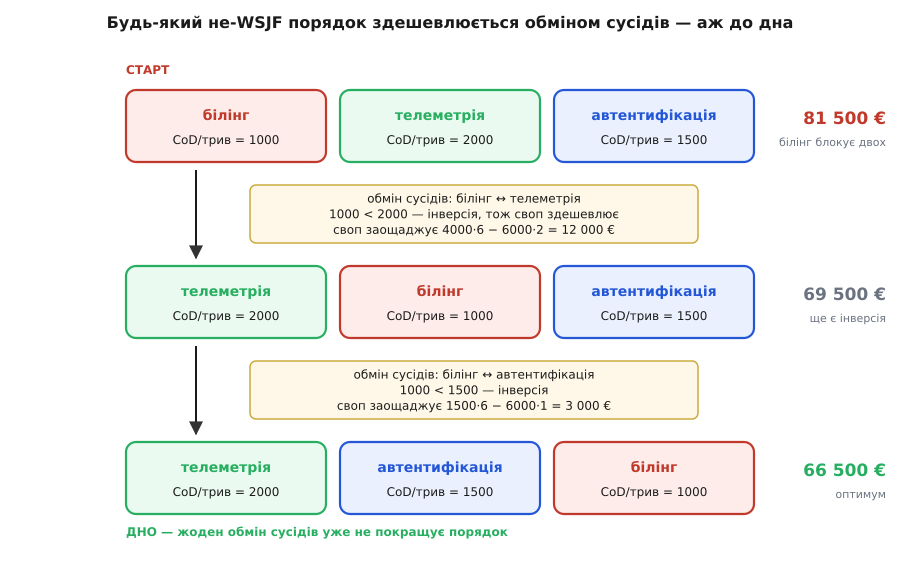

# 🧮 Виведення WSJF: чому чергу сортують за відношенням, а не за вагою

Досі обидва лічильники — вартість зволікання й вартість помилки — стосувалися **одного** рішення. Але архітектор рідко тримає в руках одне. На дошці Digital Homes одночасно висять троє: де зберігати телеметрію, якого взяти постачальника автентифікації, як інтегрувати білінг. Усі троє щотижня точать гроші, поки не розв'язані, і всі троє тягнуть за один-єдиний дефіцитний ресурс — увагу того самого архітектора, який може длубати лише щось одне за раз. Щойно рішень більше за одне, а розв'язувати їх доводиться послідовно, постає питання, якого в задачі про одне рішення просто не існувало: **у якому порядку?**

Відповідь не очевидна, і гроші за неї реальні. Ця вставка виводить її з нуля. Спершу означимо, що саме коштує черга. Тоді на одному-єдиному ході — перестановці двох сусідів — покажемо, чому оптимальний порядок сортується за **відношенням** вартості зволікання до тривалості, а не за самою вартістю зволікання. А наприкінці побачимо, що цей результат — не кмітлива поробка інженера, а теорема, доведена ще 1956 року, яку розробка продукту перевідкрила через півстоліття.

## Що саме коштує черга

Зведімо задачу до голого кістяка. Є один виконавець і `n` рішень. У кожного рішення `j` — дві числові властивості. Перша: **вартість зволікання** `CoD_j`, скільки євро воно точить за тиждень, поки висить нерозв'язаним (уже знайома нам швидкість, гроші за одиницю часу). Друга: **тривалість** `d_j`, скільки тижнів забере сам розбір — спайк, порівняння, ухвала. Рішення розв'язують по черзі, одне за одним; порядок — це перестановка всіх `n`.

Ключова величина — коли кожне рішення нарешті розв'язане. Позначмо `C_j` — **тиждень готовності** рішення `j`: це сума тривалостей самого `j` і всього, що стоїть у черзі **перед** ним. Доти воно висить, а висіти означає точити:

```
C_j — тиждень готовності рішення j
      (сума тривалостей j та всіх рішень, що йдуть раніше)

рішення j набігає CoD_j кожен тиждень від 0 до C_j
   ⇒ його повна втрата від зволікання = CoD_j · C_j
```

Складімо ці втрати по всій черзі — і матимемо ціну цілого порядку:

```
W = Σ_j  CoD_j · C_j          ← сумарна зважена вартість очікування
```

Ось за що ми відповідаємо, коли обираємо послідовність. Зверніть увагу на тонкість, що робить задачу чесною: **уся робота однакова, хоч який порядок**. Сума тривалостей `Σ d_j` не залежить від перестановки — остання ухвала однаково впаде на той самий тиждень. Порядок не міняє, скільки роботи зроблено; він міняє лише, **кого змусили чекати довше**. Тому вся боротьба — за `W`, і тільки за нього.

## Чому не за самою вагою

Перший порив — гасити найгарячіше: бери спершу те рішення, чия вартість зволікання найбільша. Це майже завжди хибно, і ось найпростіша картина, що показує чому. Уяви чергу до однієї каси. Щоб усі разом прочекали найменше, першим пускають того, у кого **одна пачка молока**, а не того, у кого повний візок: короткий обслуговується вмить і звільняє чергу, а довгий тримав би всіх. Тепер додай, що час різних людей коштує по-різному, — і правило уточнюється: першим іде той, у кого **найбільша цінність очікування на хвилину обслуговування**. Швидкий і цінний — наперед; повільний і дешевий — назад.

Рішення в черзі — ті самі покупці. Тривалість `d` — скільки хвилин він займає касу. Вартість зволікання `CoD` — скільки коштує його (і всіх за ним) очікування за тиждень. І тоді видно, звідки береться відношення: велика вартість зволікання **довгого** рішення все одно може поступитися малій вартості зволікання **короткого**, бо коротке звільнить касу вже завтра, а довге триматиме її місяць. Важить не сама вага, а вага, поділена на те, скільки часу вона тримає ресурс. Аналогія має й межу: на відміну від крамниці, тут ніхто не «приходить» — усі рішення вже стоять, і ми вільні впорядкувати їх як завгодно; та й «цінність очікування» — це не нетерплячка покупця, а цілком вимірні гроші, що течуть униз по продукту. Але кістяк той самий.

Це була інтуїція. Тепер доведімо її точно — так, щоб не лишилося місця для «а раптом усе ж вага».

## Обмін сусідів: один хід, з якого випливає все

Візьмімо **будь-який** порядок — хоч який, ще не знаємо оптимальний він чи ні. Виберемо в ньому дві сусідні роботи: `i`, а одразу за нею `j`. Усе, що стоїть перед ними, розв'яжеться до якогось тижня `S` — назвімо це моментом, коли черга доходить до нашої пари. Порахуймо, який внесок ця пара дає в загальне `W`, а тоді переставмо `i` та `j` місцями й порахуймо ще раз. Уся хитрість у тому, що **більше нічого чіпати не треба**.

```
… (усе раніше) … [ i ][ j ] … (усе пізніше) …
                  ↑ черга дійшла сюди на тижні S

порядок  i → j :   CoD_i·(S+d_i)  +  CoD_j·(S+d_i+d_j)
порядок  j → i :   CoD_j·(S+d_j)  +  CoD_i·(S+d_j+d_i)
```

Чому решту черги можна не рахувати? Роботи **перед** парою готові до тижня `S` незалежно від того, як лежить пара, — їхні тижні готовності не зрушилися. А роботи **після** пари? Блок із `i` та `j` займає ту саму загальну ширину `d_i + d_j`, хоч як його переставляй, тож усе, що йде далі, стартує з того самого тижня `S + d_i + d_j`. Отже перестановка двох сусідів міняє в цілому `W` **тільки** внесок цих двох. Віднімемо один від одного:

```
Δ = внесок(i→j) − внесок(j→i)
  = CoD_i·S + CoD_i·d_i + CoD_j·S + CoD_j·d_i + CoD_j·d_j
  − CoD_j·S − CoD_j·d_j − CoD_i·S − CoD_i·d_j − CoD_i·d_i
```

Тепер диво скорочення. `CoD_i·S` і `CoD_j·S` гинуть — стартовий тиждень пари однаковий в обох розкладах. `CoD_i·d_i` і `CoD_j·d_j` теж гинуть — кожна робота однаково платить за **власну** тривалість, хоч перша вона, хоч друга. Лишається дві навхрест-складові:

```
Δ = CoD_j·d_i  −  CoD_i·d_j
```

Прочитаймо це повільно, бо тут уся суть. `CoD_j·d_i` — це те, що **j** втрачає, поки чекає, доки перед ним відпрацює `i` (точить `CoD_j` протягом `d_i` тижнів). `CoD_i·d_j` — дзеркально, те, що **i** втрачає, чекаючи на `j`. Перестановка сусідів — це вибір, **кому з двох дати почекати на іншого**, і `Δ` — різниця цих двох чекань. Порядок `i → j` вигідніший, коли `Δ < 0`:

```
i перед j дешевше   ⟺   CoD_j·d_i  <  CoD_i·d_j
поділимо обидві частини на d_i·d_j (тривалості додатні):
                    ⟺   CoD_i / d_i   >   CoD_j / d_j
```

Ось воно. Вигідніше ставити першим те рішення, у якого **більше відношення вартості зволікання до тривалості**. І тепер видно, звідки взялося відношення, а не сама вага: обмін зіштовхує `CoD_j·d_i` проти `CoD_i·d_j`, де кожну вагу помножено на **чужу** тривалість. Ділення на `d_i·d_j` перетворює це зіткнення на порівняння двох відношень `CoD/d`. Тривалість входить у правило саме тому, що велику вагу довгого рішення «розмазано» по його довжині: воно тримає всіх позаду довго, тож його вагу треба знецінити на його ж тривалість. Коротке гучне рішення б'є довге ще гучніше — якщо його гучність на тиждень вища.

## Від пари до всієї черги

Один обмін показав, який із двох сусідів має йти першим. Але звідси до «весь порядок за спаданням відношення оптимальний» — ще крок, і його варто зробити чисто.

Назвімо відношення `r_j = CoD_j / d_j` — його ще звуть коефіцієнтом WSJF. Твердження: черга, відсортована за **спаданням** `r`, дає найменше можливе `W`. Доведення — від супротивного, і воно на диво коротке. Припустімо, якийсь порядок **не** відсортований за спаданням `r`. Тоді в ньому конче знайдеться пара **сусідів** `a` (раніше) і `b` (пізніше) з `r_a < r_b` — «інверсія», де менше відношення стоїть попереду більшого. Чому конче сусідів? Бо якби **кожна** сусідня пара йшла за незростанням (`r_a ≥ r_b` усюди), уся послідовність була б уже відсортована — а ми припустили, що ні. Отже хоч одна сусідня інверсія є завжди.

Але сусідню інверсію ми вміємо виправляти — обміном, який щойно вивели. За `r_a < r_b` маємо `CoD_a·d_b < CoD_b·d_a`, тобто наш `Δ` для цієї пари додатний: порядок `a → b` коштує **більше**, і перестановка на `b → a` строго здешевлює `W`. Значить, **будь-який** невідсортований порядок можна строго покращити. А отже жоден невідсортований порядок не може бути оптимальним — над ним завжди висить дешевший.

Лишається переконатися, що це не крутиться по колу без кінця. Не крутиться: обмін сусідньої інверсії прибирає **рівно одну** інверсію (саме ту пару) і не чіпає взаємного порядку жодної іншої пари, тож загальне число інверсій щоразу спадає на одиницю. А число інверсій — ціле й від'ємним не буває, отже вічно спадати не може: за скінченну кількість обмінів воно впаде до нуля, і черга стане повністю відсортованою. Кожен крок був строго дешевший за попередній — отже WSJF-порядок і є дном. Коли всі відношення різні, дно **єдине**; коли якісь рівні, роботи всередині такого блоку можна тасувати без зміни `W` — усі такі порядки однаково оптимальні.

Цей прийом — доводити оптимальність порядку, показавши, що будь-який «неправильний» сусідній стик можна вигідно переставити, — зветься **аргументом обміну** *(англ. exchange argument)* і є стандартним знаряддям для жадібних алгоритмів. Тим самим ходом доводять, скажімо, оптимальність правила [«найраніший дедлайн першим»](topic:sf-os/edf-scheduling): там теж беруть довільний розклад, знаходять сусідів у «неправильному» порядку — але вже за дедлайном, не за відношенням, — і показують, що обмін не гіршає розклад. Різні задачі, різний ключ сортування, той самий кістяк доведення.

## Числа Digital Homes: спуск двома обмінами

Прокрутімо це на трьох рішеннях. У кожного — своя швидкість зволікання й тривалість розбору:

```
рішення          CoD €/тиж   тривалість   r = CoD / трив.
телеметрія         4000         2 тиж         2000
автентифікація     1500         1 тиж         1500
білінг             6000         6 тиж         1000
```

Піддаймося спокусі й почнімо з «найгучніша вартість зволікання першою» — білінг (6000/тиж) на чолі. І простежмо, як аргумент обміну сам сповзає до оптимуму.


*Старт — найгучніший білінг попереду; сумарна зважена вартість очікування 81 500 €. Перша сусідня інверсія (білінг 1000 перед телеметрією 2000) виправляється обміном і заощаджує 4000·6 − 6000·2 = 12 000 €. Друга (білінг 1000 перед автентифікацією 1500) — ще 1500·6 − 6000·1 = 3 000 €. На дні порядок телеметрія → автентифікація → білінг: відношення йдуть за спаданням, жодної інверсії не лишилось — це оптимум WSJF, 66 500 €.*

Порахуймо кожен стан руками, щоб числа з фігури були не з повітря. Сумарна зважена вартість очікування — це `Σ CoD_j · C_j`, вага кожного рішення на його тиждень готовності:

```
старт  (білінг → телеметрія → автентифікація):
   білінг      готовий на тижні 6:  6000·6  = 36 000
   телеметрія  готова  на тижні 8:  4000·8  = 32 000
   автентиф.   готова  на тижні 9:  1500·9  = 13 500
                                     W      = 81 500 €

інверсія (білінг перед телеметрією: r 1000 < 2000) → обмін:
після  (телеметрія → білінг → автентифікація):
   телеметрія  готова  на тижні 2:  4000·2  =  8 000
   білінг      готовий на тижні 8:  6000·8  = 48 000
   автентиф.   готова  на тижні 9:  1500·9  = 13 500
                                     W      = 69 500 €   (−12 000)

інверсія (білінг перед автентифікацією: r 1000 < 1500) → обмін:
дно    (телеметрія → автентифікація → білінг):
   телеметрія  готова  на тижні 2:  4000·2  =  8 000
   автентиф.   готова  на тижні 3:  1500·3  =  4 500
   білінг      готовий на тижні 9:  6000·9  = 54 000
                                     W      = 66 500 €   (−3 000)
```

П'ятнадцять тисяч різниці — з нічого, лише з порядку. І кожен крок спуску — це рівно наш `Δ` навхрест: перший обмін заощадив `CoD_тел·d_бр − CoD_бр·d_тел = 4000·6 − 6000·2 = 12 000`, другий `1500·6 − 6000·1 = 3 000`. На дні перевіряємо всі сусідні пари: телеметрія (2000) ≥ автентифікація (1500) ≥ білінг (1000) — жодної інверсії, покращити нічим. Аргумент обміну зупинився саме там, де мав. Найгучніший білінг, поставлений першим, змушував двох коротких чекати всі його шість тижнів; WSJF відсуває його **в кінець** саме тому, що він довгий, — хай поки він тягнеться, тече дешевше зволікання коротких, а не навпаки.

## Симулятор порядку

Правило коротке настільки, що вміщається в кілька рядків: порахувати `W` для довільного порядку — і відсортувати за спаданням `r`. Ось те й те, щоб можна було підставити свої числа. Задача суто організаційна (черга, сортування, порівняння варіантів), тож мова — зі стеку продукту, а не системна:

:::tabs
```python
from dataclasses import dataclass

@dataclass
class Decision:
    name: str
    cod: float          # вартість зволікання, €/тиждень
    dur: float          # тривалість розбору, тижнів

def waiting_cost(order: list[Decision]) -> float:
    """Сумарна зважена вартість очікування Σ CoD_j · C_j."""
    week, total = 0.0, 0.0
    for d in order:
        week += d.dur                 # тиждень готовності цього рішення
        total += d.cod * week         # усе зволікання, що набігло до нього
    return total

def wsjf_order(ds: list[Decision]) -> list[Decision]:
    # спадання відношення CoD/тривалість — правило Сміта
    return sorted(ds, key=lambda d: d.cod / d.dur, reverse=True)

board = [
    Decision("телеметрія",     4000, 2),
    Decision("автентифікація", 1500, 1),
    Decision("білінг",         6000, 6),
]

best = wsjf_order(board)
loud = sorted(board, key=lambda d: d.cod, reverse=True)   # спершу найбільша CoD

print([d.name for d in best], waiting_cost(best))   # …, 66500.0
print([d.name for d in loud], waiting_cost(loud))   # …, 81500.0
```
```ts
interface Decision {
  name: string;
  cod: number;   // вартість зволікання, €/тиждень
  dur: number;   // тривалість розбору, тижнів
}

// Сумарна зважена вартість очікування Σ CoD_j · C_j.
function waitingCost(order: Decision[]): number {
  let week = 0, total = 0;
  for (const d of order) {
    week += d.dur;              // тиждень готовності цього рішення
    total += d.cod * week;      // усе зволікання, що набігло до нього
  }
  return total;
}

// спадання відношення CoD/тривалість — правило Сміта
const wsjfOrder = (ds: Decision[]): Decision[] =>
  [...ds].sort((a, b) => b.cod / b.dur - a.cod / a.dur);

const board: Decision[] = [
  { name: "телеметрія",     cod: 4000, dur: 2 },
  { name: "автентифікація", cod: 1500, dur: 1 },
  { name: "білінг",         cod: 6000, dur: 6 },
];

const best = wsjfOrder(board);
const loud = [...board].sort((a, b) => b.cod - a.cod);   // спершу найбільша CoD

console.log(best.map((d) => d.name), waitingCost(best));  // …, 66500
console.log(loud.map((d) => d.name), waitingCost(loud));  // …, 81500
```
:::

Сортування — один рядок `O(n log n)`; усе інше в задачі не в коді.

## Де доведення спирається на припущення

Будь-яка теорема варта рівно стільки, скільки тримаються її засновки. Наш доказ ішов трьома тихими припущеннями — і кожне окреслює, де WSJF законний, а де вже ні.

**Один виконавець.** Ми ділили один ресурс на одну чергу. Якщо рішення можна розбирати **паралельно** — двоє архітекторів, дві незалежні гілки, — то це вже не одна черга, а розкладання по кількох виконавцях, і задача зі знайомої стає загалом важкою (NP-складною). WSJF там лишається доброю евристикою, але вже не гарантованим оптимумом.

**Стала вартість зволікання.** Ціль `Σ CoD_j · C_j` мовчки припускає, що кожне рішення точить рівно, з незмінною швидкістю. Та вартість зволікання має форму: буває рівна, буває швидкопсувна, буває уступ дедлайну. Коли `CoD` не стала в часі, наша лінійна ціль уже не описує втрату, і сортування за відношенням не конче оптимальне: дедлайни тягнуть радше до правил на кшталт «найраніший дедлайн першим», а довільні профілі роблять задачу відчутно складнішою.

**Незалежність рішень.** Ми вільно тасували сусідів, ніби порядок нічим не скутий. А якщо між рішеннями є **залежності** — білінг не почати, доки не стоїть автентифікація, — то не кожну перестановку взагалі можна зробити, і голе сортування за відношенням може дати недопустимий порядок. Правило Сміта розширюється на залежності (роботи в ланцюгу зливають в один «згусток» і сортують уже згустки), але спершу треба сортувати лише те, що справді розблоковане.

**Відомі, детерміновані тривалості.** Ми брали `d_j` як тверді числа. Коли тривалість розбору — сама здогад із розкидом, сортують за **очікуваним** відношенням; це слабша гарантія, бо реальний розклад може розійтися з очікуваним.

І найглибше застереження, що змикає чергу з рештою теми. Число `CoD_j`, яке ти подаєш у сортування, мусить уже вбирати **все, що рішення блокує вниз по залежностях**. Вартість зволікання телеметрії — це не ціна бази; це панель, виручка й перший клієнт на межі, яких база тримає. Рішення на критичному шляху, від якого чекають п'ятеро, несе не свою вартість зволікання, а суму п'ятьох. Ось де ховається справжня робота — не в сортуванні, а в чесному підрахунку ваги.

> 🔧 **Навіщо це.** Сортування — найлегша частина, воно займає рядок коду. Уся праця — в **чесному числі вартості зволікання**: воно має вбирати все, що рішення блокує, бо саме це, а не «розмір задачі», тече щотижня. І добра новина просто з доведення: важить лише **порядок** відношень, не їхня точність. Тому груба відносна оцінка — «телеметрія разів у п'ять гарячіша за формат лога, а розбирати її вдвічі довше» — впорядкує чергу так само правильно, як точні євро. Схибити можна не в дробах, а в тому, **чиє** зволікання ти полічив.

## Від цеху 1956-го до потоку розробки

Наостанок — звідки цей результат, бо його родовід повчальний сам собою. Правило «сортуй за відношенням ваги до тривалості» першим довів **Вейн Е. Сміт** *(Wayne E. Smith)* 1956 року в статті «Various optimizers for single-stage production» (*Naval Research Logistics Quarterly*, т. 3) — одній із засадничих праць теорії розкладів, написаній у проєкті наукового менеджменту Каліфорнійського університету в Лос-Анджелесі на замовлення Управління військово-морських досліджень США. Сміт розв'язував не архітектуру, а цех: у якому порядку пускати вироби через один верстат, щоб сумарна зважена затримка була найменша. У дослідженні операцій це й досі зветься **правилом Сміта**, або WSPT — *weighted shortest processing time*, «зважений найкоротший час обробки». (Статус: задокументований первинний результат, не спірний.)

Пів століття правило жило в плануванні виробництва. У потік розробки продукту його переніс **Дональд Райнертсен** у книжці «The Principles of Product Development Flow» (2009): він перечитав «вагу» верстатної задачі як **вартість зволікання** — саме йому належить настанова «якщо квантуєш лише одне, квантуй вартість зволікання» — і дав правилу впорядкування нове ім'я, під яким його тепер і знають: **WSJF**, *weighted shortest job first*, «зважений найкоротший спершу». Той самий Δ навхрест, лише мовою черг фіч, а не деталей у цеху.

А фреймворк **SAFe** зробив `WSJF = вартість зволікання ÷ тривалість` щоденним прийомом пріоритезації, з однією практичною поправкою: і вартість зволікання (як суму ділової цінності, критичності за часом і зняття ризику), і розмір роботи там оцінюють **відносно**, грубими балами, а не в точних євро. І це не халтура, а рівно те, що дозволяє наше доведення: оскільки важить лише **впорядкування** відношень, грубих відносних оцінок цілком досить, щоб вишикувати чергу правильно.

Три поверхи — цех 1956-го, потік розробки 2009-го, щоденна дошка команди — і на кожному та сама одна теорема: обмін двох сусідів дешевшає рівно тоді, коли попереду стоїть більше відношення ваги до тривалості.

## Де це працює в темі

Порядок черги рішень — теж архітектурне рішення, і коштує воно, як ми щойно полічили, реальних грошей: тут п'ятнадцять тисяч євро з самого лише порядку. Тому коли на дошці збирається кілька нерозв'язаних рішень, не хапайся за те, що болить найгучніше. Дай кожному два числа — швидкість зволікання (з усім, що воно блокує вниз по залежностях) і тривалість розбору — і бери за спаданням їхнього відношення. Мале й швидке рішення, що розблоковує трьох, майже завжди має йти поперед великого й повільного, хоч яке те велике гучне.

І пам'ятай, де закінчується легка частина. Сортування доведене, дармове й незворушне. Уся невизначеність тепер зібрана в одному місці — у чесному числі вартості зволікання, бо саме воно, а не спритний алгоритм, вирішує, чию чергу ти насправді впорядкував.
