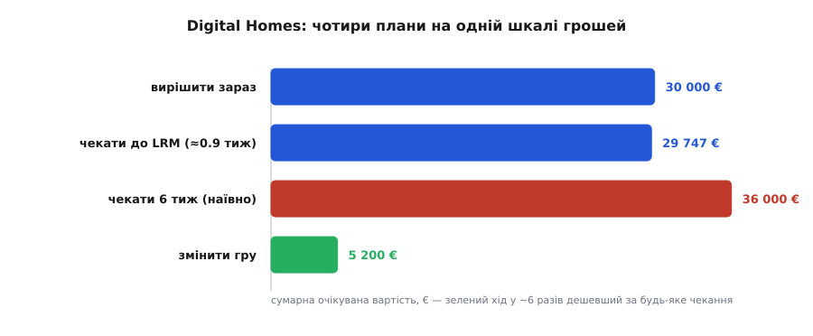

# ⚙️ Проєкт: калькулятор «чекати чи вирішувати»

У статті ми виклали три стовпчики руками: вирішити наосліп зараз — 30 000 €, пасивно почекати шість тижнів — 36 000 €, збити самі числа — 5 200 €. Ручна арифметика відповідає на питання «котрий із трьох», але ховає дві речі, які проступають лише тоді, коли трейдоф стає **функцією**. Перша: «шість тижнів» — це наш здогад, а справжнє дно U-кривої лежить на якомусь точному t, якого ми не рахували. Друга, важливіша: кожне число, що ми згодували — 4 000, 60 000, спад із 0.5 до 0.2 — теж здогад, і ми гадки не маємо, наскільки хитається відповідь, коли здогад трохи інакший. Маленька модель закриває обидві. Її вартість — не те єдине євро, яке вона коронує переможцем, а те, що вона знаходить точний останній відповідальний момент, а тоді, коли ти сіпаєш вхідні числа, показує, дно це насправді чи міраж.

Задача вузька: на вхід — вартість зволікання (€/тиждень), ціну виправлення і те, як P(схибив) спадає з тижнями розвідки; на виході — оптимальний час чекання (дно U-кривої), сумарну вартість на цьому дні й односкладний припис: **вирішуй зараз**, **чекай** або **зміни гру**.

## Ідея: трейдоф як функція одного числа

Увесь обмін живе в одному рядку, який ми вже вивели:

```
сумарна вартість(t) = вартість зволікання · t  +  P(схибив; t) · ціна виправлення
```

Лівий доданок лізе вгору — зволікання накапує; правий сповзає вниз — розвідка збиває P. Сума провисає: U-крива. Її дно — [останній відповідальний момент](topic:sf-apps/last-responsible-moment): та мить, коли наступний тиждень чекання коштує рівно стільки, скільки цей тиждень інформації ще збиває з очікуваної помилки. До дна чекати вигідно, за дном — уже ні.

Щоб це порахувати, треба зробити два модельні вибори, і обидва варто назвати вголос — бо саме в них пізніше й засядуть пастки.

**Форма спаду P.** Беремо експоненту — P(t) = P₀·e^(−t/τ) — найпростішу криву «спадної віддачі»: кожен наступний тиждень збиває P на ту саму частку, що й попередній. Заковика: τ ми не знаємо. Зате маємо один польовий здогад — «шість тижнів пілота збили б P із 0.5 до 0.2» — а одна точка однозначно закріплює τ (з рівняння P_cal = P₀·e^(−t_cal/τ) виходить τ = −t_cal / ln(P_cal/P₀)).

**Пошук дна.** Для експоненти є й формула, але я скануватиму криву на дрібній сітці — три рядки, і працює для **будь-якої** форми P (з підлогою, S-подібної, якої завгодно), а формула лишається як перевірка.

Далі `recommend()` кладе на одну шкалу три плани — вирішити зараз, чекати до дна і (якщо подати структурний хід) змінити гру — і повертає найдешевший разом із прапорцем на випадок, коли дно U-кривої таке пласке, що час вирішення майже не важить.

## Робочий код

:::tabs
```python
import math
from dataclasses import dataclass
from typing import Callable, Optional

Curve = Callable[[float], float]   # P(схибив) як функція тижнів розвідки

def exp_decay(p0: float, t_cal: float, p_cal: float) -> Curve:
    """P(t) = p0·e^(−t/τ); сталу τ підганяємо так, щоб P(t_cal) = p_cal."""
    tau = -t_cal / math.log(p_cal / p0)          # з p_cal = p0·e^(−t_cal/τ)
    return lambda t: p0 * math.exp(-t / tau)

@dataclass
class Trade:
    delay_week: float      # вартість зволікання, €/тиждень
    fix_cost: float        # ціна виправлення, €
    p_wrong: Curve         # P(схибив) від тижнів чекання

@dataclass
class Game:
    weeks: float           # скільки тижнів коштує сам хід «зміни гру» (скелет)
    fix_cost: float        # у скільки впаде ціна виправлення за інтерфейсом
    p_wrong: float         # P(схибив) на пізнішому, вимірянному рішенні

def total_cost(t: float, tr: Trade) -> float:
    """Сумарна очікувана вартість плану «чекати t тижнів, тоді вирішувати»."""
    return tr.delay_week * t + tr.p_wrong(t) * tr.fix_cost

def optimal_wait(tr: Trade, t_max: float = 24.0, step: float = 0.01) -> tuple[float, float]:
    """Дно U-кривої = останній відповідальний момент. Скан — щоб годився
    будь-який спад P, не лише експонента (для неї є й формула, як перевірка)."""
    best_t, best_c = 0.0, total_cost(0.0, tr)
    for i in range(1, int(t_max / step) + 1):
        t = i * step
        c = total_cost(t, tr)
        if c < best_c:
            best_t, best_c = t, c
    return best_t, best_c

def recommend(tr: Trade, game: Optional[Game] = None, weak: float = 0.05):
    now = total_cost(0.0, tr)
    t_star, c_star = optimal_wait(tr)
    plans = [("вирішити зараз", 0.0, now),
             (f"чекати до LRM (t*={t_star:.2f} тиж)", t_star, c_star)]
    if game is not None:
        g = tr.delay_week * game.weeks + game.p_wrong * game.fix_cost
        plans.append(("змінити гру", game.weeks, g))
    name, wk, cost = min(plans, key=lambda p: p[2])
    thin = (now - c_star) < weak * now      # дно ледь нижче за «вирішити зараз»?
    return name, cost, plans, {"t_star": t_star, "saving": now - c_star, "thin": thin}

# ── Digital Homes: де зберігати телеметрію ──────────────────────────────────
dh = Trade(delay_week=4000, fix_cost=60000,
           p_wrong=exp_decay(p0=0.5, t_cal=6, p_cal=0.2))   # зараз монетка; за 6 тиж → 0.2
game = Game(weeks=1, fix_cost=8000, p_wrong=0.15)           # скелет+інтерфейс здешевлюють усе

name, cost, plans, diag = recommend(dh, game)

print("Digital Homes — телеметрія: чекати чи вирішувати?\n")
for label, wk, c in plans + [("чекати 6 тиж (наївно)", 6.0, total_cost(6.0, dh))]:
    print(f"  {label:32}{wk:5.1f} тиж   {c:8.0f} €")
print(f"\n  ПРИПИС: {name.upper()}  →  {cost:.0f} €")
if diag["thin"]:
    print(f"  timing-важіль слабкий: оптимальне чекання економить лише "
          f"{diag['saving']:.0f} € — дно U-кривої майже впритул до «вирішити зараз».")
    print("  зволікання й помилка дорогі водночас → шукай структурний хід.")
```
```ts
type Curve = (weeks: number) => number;          // P(схибив) від тижнів розвідки

function expDecay(p0: number, tCal: number, pCal: number): Curve {
  const tau = -tCal / Math.log(pCal / p0);        // з pCal = p0·e^(−tCal/τ)
  return (t) => p0 * Math.exp(-t / tau);
}

interface Trade {
  delayWeek: number;   // вартість зволікання, €/тиждень
  fixCost: number;     // ціна виправлення, €
  pWrong: Curve;       // P(схибив) від тижнів чекання
}

interface Game {
  weeks: number;       // тижнів на сам хід «зміни гру» (скелет)
  fixCost: number;     // у скільки впаде ціна виправлення за інтерфейсом
  pWrong: number;      // P(схибив) на пізнішому, вимірянному рішенні
}

const totalCost = (t: number, tr: Trade): number =>
  tr.delayWeek * t + tr.pWrong(t) * tr.fixCost;

function optimalWait(tr: Trade, tMax = 24, step = 0.01): [number, number] {
  let bestT = 0, bestC = totalCost(0, tr);
  for (let i = 1; i <= Math.round(tMax / step); i++) {
    const t = i * step;
    const c = totalCost(t, tr);
    if (c < bestC) { bestT = t; bestC = c; }
  }
  return [bestT, bestC];
}

type Plan = { label: string; weeks: number; cost: number };

function recommend(tr: Trade, game?: Game, weak = 0.05) {
  const now = totalCost(0, tr);
  const [tStar, cStar] = optimalWait(tr);
  const plans: Plan[] = [
    { label: "вирішити зараз", weeks: 0, cost: now },
    { label: `чекати до LRM (t*=${tStar.toFixed(2)} тиж)`, weeks: tStar, cost: cStar },
  ];
  if (game) {
    const g = tr.delayWeek * game.weeks + game.pWrong * game.fixCost;
    plans.push({ label: "змінити гру", weeks: game.weeks, cost: g });
  }
  const best = plans.reduce((a, b) => (b.cost < a.cost ? b : a));
  const thin = now - cStar < weak * now;          // дно ледь нижче за «вирішити зараз»?
  return { best, plans, tStar, saving: now - cStar, thin };
}

// ── Digital Homes: де зберігати телеметрію ──────────────────────────────────
const dh: Trade = {
  delayWeek: 4000, fixCost: 60000,
  pWrong: expDecay(0.5, 6, 0.2),                  // зараз монетка; за 6 тиж → 0.2
};
const game: Game = { weeks: 1, fixCost: 8000, pWrong: 0.15 };

const { best, plans, saving, thin } = recommend(dh, game);

console.log("Digital Homes — телеметрія: чекати чи вирішувати?\n");
const rows = [...plans, { label: "чекати 6 тиж (наївно)", weeks: 6, cost: totalCost(6, dh) }];
for (const p of rows)
  console.log(`  ${p.label.padEnd(32)}${p.weeks.toFixed(1).padStart(5)} тиж   ${p.cost.toFixed(0).padStart(8)} €`);
console.log(`\n  ПРИПИС: ${best.label.toUpperCase()}  →  ${best.cost.toFixed(0)} €`);
if (thin) {
  console.log(`  timing-важіль слабкий: оптимальне чекання економить лише ${saving.toFixed(0)} € ` +
    `— дно U-кривої майже впритул до «вирішити зараз».`);
  console.log("  зволікання й помилка дорогі водночас → шукай структурний хід.");
}
```
:::

Обидві версії — та сама модель, кожна ідіоматична для свого краю: Python як скрипт, що рахує й друкує звіт; TypeScript — ті самі чисті функції, які тільки й ждуть, щоб їх причепили до повзунків живого веб-калькулятора. Прогін на числах Digital Homes дає той самий вивід у обох:

```
Digital Homes — телеметрія: чекати чи вирішувати?

  вирішити зараз                    0.0 тиж      30000 €
  чекати до LRM (t*=0.89 тиж)       0.9 тиж      29747 €
  змінити гру                       1.0 тиж       5200 €
  чекати 6 тиж (наївно)             6.0 тиж      36000 €

  ПРИПИС: ЗМІНИТИ ГРУ  →  5200 €
  timing-важіль слабкий: оптимальне чекання економить лише 253 € — дно U-кривої майже впритул до «вирішити зараз».
  зволікання й помилка дорогі водночас → шукай структурний хід.
```

## Що каже модель

Читаємо. Останній відповідальний момент — **≈0.9 тижня**, а не шість. Дочекатися того точного дна коштує 29 747 € — на сміховинні 253 € (менш ніж відсоток) дешевше, ніж вирішити просто зараз. Тому модель і піднімає прапорець «timing-важіль слабкий»: дно U-кривої практично лежить на «вирішити зараз». А «почекати шість тижнів», що на око здавалося очевидним «ну то зберімо ж дані», сідає на 36 000 € — **гірше**, ніж вирішити наосліп, бо це далеко за дном. Тим часом структурний хід стоїть на 5 200 €. Калькулятор коронує «зміни гру», і навіть не близько.


*Ті самі чотири плани, що їх порахувала модель, на одній шкалі грошей. Два сині стовпчики — «вирішити зараз» і «дочекатися дна» — практично однакові: часовий важіль майже не рухає підсумок. Червоний («чекати шість тижнів») ще й довший за «вирішити зараз» — переочікування коштує дорожче за поспіх. Зелений структурний хід — у ~6 разів коротший за будь-яке чекання.*

> 🔧 **Навіщо це.** Головна користь від того, що трейдоф став функцією, — не число на виході, а те, як швидко видно його крихкість. Одне ручне рішення дає ілюзію точності: «36 000, чекати невигідно». Функція за тридцять секунд показує інше — що дно пласке, що припис перевертається від одного м'якого здогаду, що найкращий хід узагалі поза кривою. Модель заробляє свій хліб не тоді, коли впевнено друкує t*, а тоді, коли тим самим t* доводить, що час був не тим важелем.

## Складність і пастки

Небезпека такого інструмента одна: він друкує число до копійки, і ти починаєш його слухатися. Ось три способи, якими він бреше, щойно даси йому волю.

### 1. Сміття на вході — і припис перевертається

Найпідступніший вхід — найм'якіший: здогад «шість тижнів → 0.2». Сіпни його й дивись:

```python
for p_cal in (0.15, 0.20, 0.25):
    t, _ = optimal_wait(Trade(4000, 60000, exp_decay(0.5, 6, p_cal)))
    print(p_cal, round(t, 2))
# 0.15 → 2.04     0.20 → 0.89     0.25 → 0.00
```

Та сама конструкція, змінилася лише оцінка «наскільки добре спрацює розвідка», а припис хитнувся від «чекай два тижні» через «чекай один» до «вирішуй негайно». Чотири значущі цифри, що їх друкує модель, — фальшива точність, прикручена до числа, яке хтось узяв зі стелі. Правило: перш ніж вірити t*, спитай, якою була б відповідь, коли б твій найм'якіший вхід був на третину інакший. Перевернулася — модель каже тобі не «коли вирішувати», а «твоя оцінка і є справжня робота».

### 2. Спад P як «відомий» — а форма кривої теж здогад

Ми ж не лише вгадали τ — ми припустили саму **форму**. У експоненти є прихована обіцянка: P падає до нуля й падатиме вічно. Насправді майже завжди є **підлога** — залишкова невизначеність, якої не зніме жоден обсяг пілотних даних (постачальник ще може змінити продукт; навантаження може стрибнути наступного кварталу). Додай навіть скромну підлогу — і порада експоненти без пам'яті розсипається:

```python
def exp_floor(p0, floor, tau):        # спад до підлоги, не до нуля
    return lambda t: floor + (p0 - floor) * math.exp(-t / tau)

t, _ = optimal_wait(Trade(4000, 60000, exp_floor(0.5, 0.10, 6.55)))
print(round(t, 2))    # → 0.0   (з підлогою 0.10 чекати вже не варто)
```

Незнищенна підлога всього-на-всього 0.10 робить початковий нахил P досить пологим, щоб уже перший тиждень зволікання коштував більше, ніж купує, — вирішуй зараз. Гола експонента системно перебільшує користь чекання, бо вдає, ніби інформація всесильна. Щоразу, коли модель радить «чекай», чесне питання одне: яку підлогу ця крива проігнорувала?

### 3. Ігнорування ходу «зміни гру» — найтихіша пастка, бо вбудована в інструмент

Подай калькуляторові лише А/Б — без структурного ходу — і він цілком задоволений:

```python
name, cost, *_ = recommend(dh)           # без game
print(name, round(cost))     # чекати до LRM (t*=0.89 тиж) 29747
```

Він упевнено каже «чекай 0.9 тижня, плати 29 747» — точно, захищено і на 24 000 € гірше за хід, якого він не бачить. Оптимізатор U-кривої вміє лише совати рішення вздовж осі часу; він ніколи не зійде з тієї осі, щоб здешевити саму помилку (інтерфейс) чи звести зволікання нанівець ([walking skeleton](topic:sf-apps/walking-skeleton) — тонкий наскрізний зріз, що пускає цінність, поки серйозне рішення визріває). Ось навіщо `recommend()` узагалі бере аргумент `game`: калькулятор, що моделює тільки «коли вирішувати», перетворює фальшивий вибір «А чи Б» на припис із виглядом точного. Прапорець «timing-важіль слабкий» — це спосіб самої моделі показати повз себе: коли дно U-кривої лежить на «вирішити зараз», це не сигнал вибрати трохи дешевший із двох поганих стовпчиків, а сигнал, що все питання не те, і відповідь — поза кривою.

Ось чому модель окупається не там, де сподіваєшся. Не тоді, коли впевнено друкує t*, — саме тоді їй варто найменше довіряти. Вона окупається тоді, коли тридцятисекундний перебір входів показує, як припис перевертається від м'якого здогаду, або спалахує прапорець підлоги, — бо це модель каже тобі, числами, досить гучними, щоб закінчити нараду, що час ніколи не був тим важелем.
