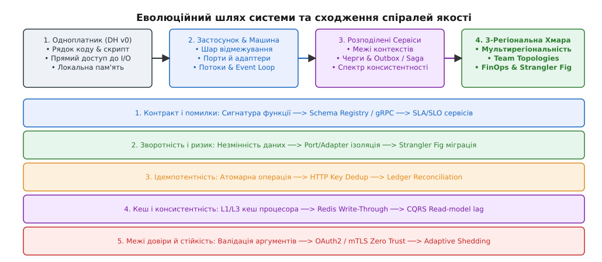
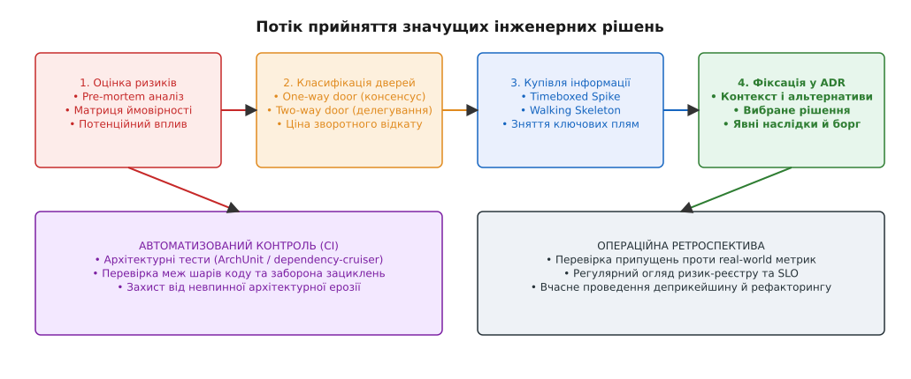
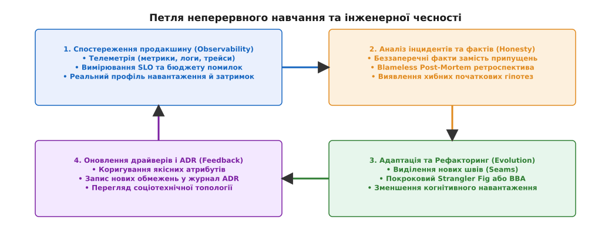

# Прощання з курсом: Масштаб турботи та інженерна відповідальність

<preknowlist>
- [Якісні атрибути й сценарії](root:sf-apps/quality-attributes) — вимірювані вимоги до системи як основа аналізу компромісів.
- [Зворотні й незворотні рішення](root:sf-apps/reversible-irreversible-decisions) — один-два двері та калібрування темпу розробки під ціну відкату.
- [Технічний борг і вартість зміни](root:sf-apps/technical-debt) — борг як свідомий інженерний обмін, а не випадковий хаос.
- [Еволюційна архітектура](root:sf-apps/evolutionary-architecture) — пристосованість системи до змін за мінімальної початкової складності.
</preknowlist>

У першому модулі платформу Digital Homes (DH v0) було представлено у вигляді однофайлового Python-скрипта на 150 рядків коду, який працював на одноплатному комп'ютері Raspberry Pi, читав температуру з I2C-датчика та смикав електромагнітне реле. Пристроєм керувала проста інструкція `if/else`, а будь-яка апаратна затримка шини блокувала весь процес. На тридцять другому модулі та після проходження капстон-проєкту та сама платформа перетворилася на багаторегіональну хмарну систему, яка обслуговує 1 500 000 активних розумних будинків, обробляє 85 000 подійно-орієнтованих телеметричних подій за секунду, забезпечує строго ізольоване обслуговування багатоорендних клієнтів (Multi-tenancy), розрулює розподілені фінансові транзакції через Saga-оркестратори та гарантує нульовий простій (Zero-Downtime) при міграції баз даних.

Те, що відбулося між цими двома точками, не є просто збільшенням обсягу вихідного коду чи кількістю орендованих серверів. Це послідовне розширення **масштабу турботи (Scale of Concern)** інженера. Зростання масштабу турботи змушує архітектора послідовно змінювати оптику: від боротьби за чисті рядки та ізольовані функції — до зв'язуваності модулів, моделей конкурентності, гарантій консистентності сховищ, мережевих роздоріж, соціотехнічної топології команд та економічної доцільності існування всієї системи.


*Еволюційний шлях системи та сходження п'яти наскрізних спіралей: із зростанням масштабу турботи від однофайлового скрипта до багаторегіональної хмари кожна якісна характеристика вимагає глибших архітектурних тактик.*

---

## 1. Еволюція масштабу турботи: від рядка коду до планетарної організації

Головним хребтом усієї дисципліни є усвідомлення того, що класи відмов та джерела складності є **адитивними**. Помилка, пропущена на нижчому масштабі турботи, не може бути виправлена на вищому шарі без гігантського когнітивного та фінансового оверхеду. Навпаки, спроба застосувати важкі тактики планетарного масштабу на рівні однієї функції створює монструозне надпроєктування (Over-engineering).

Кожен новий масштаб розширює горизонт відповідальності інженера, змушуючи його враховувати затримки, обмеження пам'яті, мережеві роздоріжжя та соціотехнічні фактори:

```
[Масштаб 1: Рядок коду]       ──> Чистота функцій, незмінність, контракти типів
          │
          ▼
[Масштаб 2: Модуль/Застосунок] ──> Гексагональна межа, приховування таємниці, DDD-lite
          │
          ▼
[Масштаб 3: Конкурентність]   ──> Lock-free, Channels, Event Loop, Backpressure
          │
          ▼
[Масштаб 4: Сховище й Дані]   ──> ACID, MVCC, LSM/WAL, CDC, Pipeline Consistency
          │
          ▼
[Масштаб 5: Розподілена Мережа]──> CAP/PACELC, Vector Clocks, Raft, 2PC, Quorums
          │
          ▼
[Масштаб 6: Сервіси й Вузли]  ──> Saga/Outbox, Identity, Multi-Tenancy, Ledger
          │
          ▼
[Масштаб 7: Планета й Організація]──> Zero Trust, SLO, Team Topologies, FinOps, Strangler
```

### Детальний розбір ланок масштабу турботи

1. **Рядок коду та функція (Scale 1)**: турбота про незмінність (Immutability), відсутність прихованих побічних ефектів, чіткий контракт типів та обробку помилок. Якщо функція змінює глобальний стан або ігнорує коди помилок, жоден розподілений консенсус не зробить систему стійкою. На цьому рівні часовий масштаб вимірюється наносекундами (чистота L1/L2 кешу процесора).
2. **Застосунок та модуль (Scale 2)**: декомпозиція за принципами зчеплення (Coupling) та зв'язності (Cohesion). Поділ системи на шари (гексагональна архітектура, порти й адаптери) та виділення обмежених контекстів (Bounded Contexts). Модуль описується через свою «таємницю» (приховування інформації за Деніелом Парнасом), а не через кроки процедурного алгоритму. Зміна всередині модуля не повинна протікати через його межу.
3. **Одна машина та конкурентність (Scale 3)**: перехід межі одного процесу. Розуміння вартості контекстного перемикання потоків (~1–2 мкс), дедлоків, моделей невизначеного обміну (Lock-free, Channels, Actors, Event Loop), зворотного тиску (Backpressure) та закон Амдала. Неможливо побудувати високонавантажений сервіс, якщо внутрішній потік виконання блокується на синхронному дисковому I/O чи мережевому сокеті.
4. **Дані та еволюція схем (Scale 4)**: турбота про те, що переживає сам код. Транзакційні гарантії ACID, рівні ізоляції MVCC, структура WAL-журналів та LSM-дерев. Перехід від простого CRUD до подійного руху даних (CDC, Schema Registry, ETL/ELT pipelines) та збереження матеріалізованих уявлень (Read-Models). Зміна схеми бази даних є незворотною операцією, яка вимагає двофазного сумісного оновлення (Expand-Contract).
5. **Мережа та розподілені системи (Scale 5)**: перетин межі фізичного дроту. Руйнування 8 оман розподілених обчислень (The 8 Fallacies of Distributed Computing). Затримка RTT між регіонами вимірюється сотнями мілісекунд (наприклад, 150 мс Франкфурт — Сінгапур). Спектр консистентності (CAP/PACELC), фізичні та логічні годинники (Vector Clocks, Lamport), кворумна реплікація, алгоритми консенсусу (Raft, Paxos) та проблеми розподілених замків і лізингу.
6. **Сервіси та критичні вузли (Scale 6)**: рішення про межі автономії. Чітке визначення, коли різати моноліт на мікросервіси, а коли тримати модульну монолітну формацію. Проєктування API-шлюзів (BFF), саги (Saga Orchestration / Choreography), паттерн Transactional Outbox, ідемпотентність споживачів, вузли автентифікації (Identity), мультиарендність (Multi-tenancy) та двостороння бухгалтерія (Ledger Reconciliation).
7. **Планета та соціотехнічна організація (Scale 7)**: вихід на глобальний ринковий рівень. Захист від метастабільних відмов, адаптивне скидання навантаження (Adaptive Shedding), Zero Trust безпека, аналіз бізнес-SLO та бюджетів помилок (Error Budget), Закон Конвея, топологія команд (Team Topologies), FinOps-моделювання та стратегії еволюційного виводу застарілих систем з експлуатації (Deprecation & Strangler Fig).

### Числові орієнтири затримок та порядків масштабу (Back-of-the-Envelope)

Архітектор повинен пам'ятати порядки величин апаратної та мережевої латентності (за Джеффом Діном):

| Операція | Типовий час виконання | Архітектурне обмеження |
|---|---|---|
| Обрахунок L1-кешу CPU | ~1 нс | Незмінні локальні значення |
| Захват/вивільнення Mutex | ~15 нс | Конкурентність одного процесу |
| Читання з головної пам'яті (RAM) | ~100 нс | Нуль зайвих DTO-маперів |
| Зчитування 1 КБ з NVMe SSD | ~50 мкс | WAL та асинхронний I/O |
| RTT у межах одного дата-центру | ~0.5 мс | Запити між сервісами |
| Кворумний запис Raft у 3 регіони | ~150–250 мс | Async Saga & Eventual Consistency |

Розуміння цих чисел дає можливість проводити швидкі оцінки «на серветці» (Back-of-the-Envelope calculations) та відсіювати нереалістичні варіанти ще до написання першого рядка коду.

---

## 2. П'ять наскрізних спіралей курсу: повернення на вищому рівні

Протягом вивчення дисципліни фундаментальні інженерні поняття не просто вводилися один раз, а поверталися на кожному наступному масштабі турботи. Що вищим ставав масштаб, то глибшою та суворішою ставала вимога до реалізації відповідної якості.

Детальний аналіз еволюції архітектури як дисципліни розібрано у праці [📜 Від конференцій NATO 1968 року до соціотехнічного дизайну 2020-х](root:progarch/course-farewell/hist-software-architecture-lineage.md).

```
СМУГА 1: Рядок / Модуль   ──>  СМУГА 2: Сховище / Мережа  ──>  СМУГА 3: Сервіси / Планета
───────────────────────────────────────────────────────────────────────────────────────
1. Контракт помилок       ──>  Schema Registry            ──>  SLO / SLA та RFC 7807
2. Зворотність (Doors)    ──>  Port/Adapter               ──>  Strangler Fig / BBA
3. Ідемпотентність        ──>  HTTP Key Dedup             ──>  Ledger Reconciliation
4. Кешування              ──>  Redis Write-Through        ──>  CQRS Read-model lag
5. Межі довіри            ──>  OAuth2 / mTLS              ──>  Adaptive Shedding
```

### Спіраль 1: Контракт та межа помилок (Contract & Error Boundary)
На рівні функції контракт визначається сигнатурою, типом повернення та строгим винятком. Помилка обробляється локально або повертається як значення (`std::expected` / `Result`). На рівні модуля контракт стає інтерфейсом. На рівні сховища даних — це реляційна схема або Schema Registry у Kafka, що перевіряє зворотно-сумісні зміни JSON/Protobuf бінарних форматів. На рівні розподілених сервісів — це gRPC/Protobuf специфікація та машинно-прочитуваний формат помилок (RFC 7807 problem details). На рівні всієї організації контракт перетворюється на угоду про рівень обслуговування (SLA/SLO), де помилка є вимірюваним вичерпанням бюджету помилок (Error Budget), що автоматично блокує нові релізи у CI/CD.

### Спіраль 2: Зворотність і ризик (Reversibility & Risk)
На рівні коду зворотність забезпечується незмінністю даних (Immutability) та чистотою функцій: якщо функція не має побічних ефектів, її виконання можна скасувати або повторити без ризику пошкодити стан. На рівні архітектури застосунку — це портові адаптери (Hexagonal Architecture), які дозволяють підмінити реальну СУБД у тесті на in-memory імплементацію. На рівні деплою — це гілки абстракцій (Branch-by-Abstraction) та Feature Flags, які дозволяють перемикати трафік між новими та старими реалізаціями в реальному часі. На рівні еволюції великої платформи — це стратегія Strangler Fig та двофазний вивід API з експлуатації (Deprecation Policy), що зберігає точки неповернення відкритими якомога довше.

### Спіраль 3: Ідемпотентність і гарантії обробки (Idempotency & Processing)
Почавшись із атомарних інструкцій процесора (`Compare-And-Swap`) та блокувань пам'яті, ідемпотентність згодом виросла у гарантії передачі мережевих повідомлень (At-Least-Once / Exactly-Once processing semantics). На рівні REST/gRPC API вона вимагає використання унікальних ключів ідемпотентності (Idempotency Keys) з TTL-вікнами дедуплікації у Redis для захисту від подвійних кліків або мережевих таймаутів. На рівні критичних вузлів (гроші, білінг, білінг-аудит) ідемпотентність стає фундаментальною умовою побудови подвійного запису та математичного свердлування (Reconciliation), де жодна копійка не повинна втратитися навіть при аварійному перезавантаженні вузла під час обробки транзакції.

### Спіраль 4: Кешування та консистентність (Caching & Consistency)
Перше знайомство з кешем відбувалося на рівні L1/L3-ліній кешу процесора та вирівнювання структур у пам'яті (Cache-line padding для усунення false sharing). Далі кеш з'явився як довільна оперативна пам'ять (In-Memory Redis/Memcached) з інвалідацією Write-Through/Write-Back та стратегіями LRU/LFU. На рівні мікросервісів кешування перетворилося на фундаментальну проблему затримки відображення (Read-Model Lag) у CQRS-архітектурах, де прочитане значення може заощадити латентність ціною показу застарілого стану (Stale Data). На рівні планети кеш — це глобальні мережі CDN, оновлення яких вимагає усвідомленої згоди на слабкі моделі консистентності (Eventual Consistency) та розуміння границь TTL.

### Спіраль 5: Межі довіри та операційна стійкість (Trust Boundaries & Resilience)
На найдрібнішому рівні захист виглядає як перевірка аргументів (Preconditions & Assertions). На рівні процесу — це ізоляція адресного простору та обмеження прав Linux cgroups/namespaces. На рівні сервісів — це автентифікація через OAuth2/JWT та RBAC/ABAC політики доступу. На рівні мережі — це Zero Trust периметр з обов'язковим mTLS-шифруванням кожного міжсервісного виклику. На рівні всієї системи під навантаженням стійкість реалізується через тактики адаптивного скидання навантаження (Adaptive Load Shedding), таймаути, Circuit Breakers та вирівнювання трафіку для запобігання метастабільним аваріям, коли система тоне у власних повторних спробах (Thundering Herd & Retry Storms).

---

## 3. Інженерна відповідальність та повага до успадкованої системи

Молодий або недосвідчений розробник, приходячи у новий проєкт із багатою історією, майже завжди відчуває спокусу зневажливо назвати існуючий код «застарілим мотлохом» та висунути вимогу: *«Усе це треба викинути й переписати з нуля на новій технології!»*.

Це головний маркер відсутності архітектурного смаку та інженерної незрілості.

Система, яка працює в продакшені сьогодні, створювалася іншими інженерами під тиском обмежень, про які ви можете навіть не здогадуватися: дедлайни ринку, брак ресурсів, застарілі версії бібліотек 5-річної давнини або специфічні вимоги перших клієнтів. Саме ця «неідеальна» система приносила компанії прибуток і виплачувала зарплату, поки створювалися нові концепції.


*Потік прийняття значущих інженерних рішень: від pre-mortem аналізу та класифікації дверей рішення до зафіксованого ADR, автоматизованих фітнес-тестів у CI та регулярної ретроспективи.*

### Таксономія технічного боргу за Вордом Каннінгемом та Мартином Фаулером

Технічний борг — це метафора, введена Вордом Каннінгемом у 1992 році. Вона означає свідомий обмін короткострокової швидкості виходу на ринок (Time-to-Market) на майбутні витрати з обслуговування коду. Проте Мартин Фаулер деталізував цю метафору, розділивши борг на чотири квадранти (The Technical Debt Quadrant):

1. **Свідомий та обачний (Prudent & Deliberate)**: «Ми мусимо випустити продукт зараз ради виживання бізнесу, ми знаємо про наслідки і заплануємо рефакторинг через місяць». Це професійний інженерний обмін.
2. **Необачний та свідомий (Reckless & Deliberate)**: «У нас немає часу на дизайн чи тести, просто ліпіть абищо». Це початкова деструкція.
3. **Необачний та несвідомий (Reckless & Inadvertent)**: «Що таке патерни чи межі модулів? Ми просто пишемо код як вміємо». Це відсутність кваліфікації.
4. **Обачний та несвідомий (Prudent & Inadvertent)**: «Ми створили чудове рішення, але тепер, пропрацювавши з доменом рік, ми зрозуміли, як насправді мала бути побудована система». Це природне зростання знань.

### Ефект другої системи та небезпека Великого Переписування (Big Rewrite)

Фредерік Брукс у праці *«Міфічний людино-місяць»* описує **Ефект другої системи (Second-System Effect)**: коли інженер проєктує свою другу систему, він прагне втілити у ній усі ідеї та абстракції, від яких довелося відмовитися у першій. У результаті друга система виходить грандіозною, переускладненою, ненажерливою до ресурсів і практично нездатною до релізу.

Історія знає класичний приклад Netscape 6 (2000 рік), коли компанія вирішила повністю переписати код браузера Netscape Communicator з нуля. Переписування зайняло понад три роки. За цей час ринок повністю захопив Internet Explorer від Microsoft, а компанія Netscape втратила самостійність і була поглинута. Іншим гучним прикладом стала катастрофа Knight Capital (2012 рік), коли неперевірений деплой застарілого коду на тлі відсутності deprecation-політики призвів до збитку у \$440 млн за 45 хвилин торговельної сесії.

Джоел Спольскі назвав рішення про тотальне переписування з нуля *«найгіршою стратегічною помилкою, яку може зробити програмна компанія»*.

Зрілий архітектор поважає успадкований код (Legacy). Замість стихійного знищення він обирає шлях еволюційного оздоровлення:

1. **Археологія та створення швів (Seams)**: виділення у старому коді місць, де можна розірвати залежність без зміни поведінки (за Майклом Фізерсом).
2. **Характеризаційні тести (Characterization Tests)**: фіксація фактичної поведінки легасі-системи тестами до початку будь-яких змін.
3. **Паттерн Strangler Fig (Малюк-удушувач)**: поступове витіснення старих модулів новими мікросервісами на межі API-шлюзу, поки старий моноліт не зменшиться до нуля.

Для практичного контролю архітектурної ерозії та автоматичної перевірки меж між шарами використовується спеціалізований інструмент, показаний у вставці [⚙️ Автоматизований вимірник фітнес-функцій та ерозії архітектури](root:progarch/course-farewell/proj-arch-fitness-evaluator.md).

---

## 4. Архітектура як потік рішень під невизначеністю, а не статичні діаграми

Великою помилкою є сприйняття архітектури як комплекту гарних статичних діаграм у Visio, Enterprise Architect чи Structurizr. Намальована діаграма застаріває в момент, коли розробник робить перший `git push` у репозиторій.

**Архітектура — це не набір діаграм. Це безперервний потік значущих інженерних рішень, прийнятих в умовах невизначеності.**

Коли проєкт тільки починається, інженер опиняється у «тумані війни»: невідомий точний обсяг майбутнього навантаження, невідомі всі крайові випадки домену, а поведінка зовнішніх постачальників послуг є нестабільною. Спроба прийняти всі незворотні рішення наперед (Big Design Up Front, BDUF) гарантовано призводить до катастрофи.

### Евристики прийняття рішень під тиском

1. **Один чи два двері (One-Way vs Two-Way Doors)**: перш ніж витрачати тижні на обговорення, дайте відповідь на питання: *«Наскільки дорого буде скасувати це рішення завтра?»*. Зворотні рішення (Two-way doors) приймаються максимально швидко та делегуються командам. Незворотні рішення (One-way doors) — сповільнюються, вимагають колегіального рев'ю, колегії стейкхолдерів та документування.
2. **Купівля інформації через спайк (Spikes)**: якщо ви не знаєте, чи витримає обрана СУБД 50 000 write-RPS, не вгадуйте. Виділіть 2 дні (Timebox) на написання найпростішого прототипу (Spike), дайте навантаження у тестовому середовищі та отримайте беззаперечні цифри.
3. **Останній відповідальний момент (Last Responsible Moment)**: відкладайте прийняття незворотного рішення до точної межі, поки відсутність рішення не почне завдавати шкоди. Що довше ви відкладаєте вибір, то більше реальних фактів ви матимете на руках.
4. **Принцип YAGNI за замовчуванням (You Aren't Gonna Need It)**: будь-яка кодова лінія чи абстракція, яка додається «на майбутнє, бо раптом знадобиться», створює щоденний борг зчитування та налагодження. Не будуйте інфраструктуру під мільйон користувачів, поки у вас немає першої сотні.
5. **Фіксація у журналі ADR (Architecture Decision Records)**: якщо рішення є значущим, запишіть ЧОМУ воно було прийнято, які альтернативи розглядали, та якими негативними наслідками погодилися заплатити. 

Специфікацію проведення комплексного рев'ю системи та порядок фіксації артефактів наведено у вставці [📋 Плейбук та інтерфейс комплексного архітектурного аудиту системи](root:progarch/course-farewell/api-architecture-audit-playbook.md).

---

## 5. Неперервне навчання, інженерна чесність та майбутній вектор

Справжній інженерний смак та архітектурна зрілість опираються на принципову **інженерну чесність**. Інженерна чесність — це здатність визнати, що початкова гіпотеза виявилася хибною, коли факти з продакшену свідчать проти неї.


*Петля неперервного навчання інженера: спостереження за вимірюваними SLO в продакшені живить аналіз інцидентів та коригує майбутні архітектурні драйвери.*

### Петля зворотного зв'язку архітектора

Робота архітектора не закінчується на стадії передачі специфікації розробникам. Вона замикається у неперервний цикл:

```
[Проєктування & ADR] ──> [Реалізація & CI Fitness] ──> [Деплой у Продакшн]
        ▲                                                      │
        │                                                      ▼
[Оновлення Драйверів] <── [Post-Mortem ретроспектива] <── [Метрики SLO / Traces]
```

1. **Спостереження за продакшеном**: читання графіків p99 затримок, відсотка 5xx помилок та вичерпання бюджету помилок (Error Budget). Продакшн — це єдиний справжній суддя ваших архітектурних припущень.
2. **Безжалісні Post-Mortem ретроспективи (Blameless Post-Mortems)**: після кожного серйозного інциденту команда шукає не «палиця-винного розробника», а системну прогалину у дизайні (відсутність таймауту, зламаний Circuit Breaker, невірно розрахований кворум).
3. **Постійний рефакторинг та адаптація**: виправлення архітектурних меж на основі реальних профілів навантаження.

### Куди рости далі після курсу «Архітектура програмних систем»

Завершення цього курсу — це лише фундамент вашої професійної інженерної траєкторії. Архітектура програмних систем є безмежною галуззю, яка розгалужується на кілька глибинних спеціалізацій:

1. **Високонавантажені розподілені сховища (Distributed Storage Engineering)**: занурення у нутрощі устрою розподілених баз даних, алгоритми консенсусу (Raft, Multi-Paxos, Spanner TrueTime), розробка СУБД та носіїв даних. (Рекомендоване читання: Мартін Клеппман, *«Designing Data-Intensive Applications»*).
2. **Соціотехнічний дизайн та орг-архітектура (Sociotechnical Systems & Enterprise)**: вивчення трансформації великих компаній, побудова внутрішніх інженерних платформ (Platform Engineering), управління портфелями продуктів та FinOps. (Рекомендоване читання: Skelton/Pais, *«Team Topologies»*).
3. **Еволюційні системи та рефакторинг складності**: опанування методик беззупинної трансформації гігантських критичних систем у банках, авіації та телекомі. (Рекомендоване читання: Ford/Parsons, *«Evolutionary Architecture»*, Michael Feathers, *«Working Effectively with Legacy Code»*).
4. **Низькорівнева архітектура та реальний час (Embedded & Real-Time OS)**: перехід на межу між залізом та софтом — операційні системи реального часу (RTOS), драйвери, системні шини та жорсткі часові дедлайни.

Кожне рішення, яке ви приймаєте у коді, залишає слід у системі. Пам'ятайте: найкраща архітектура — це не та, яка вражає складністю на слайдах презентації, а та, яка непомітно, надійно та ефективно вирішує задачі людей щодня, дозволяючи команді спокійно спати вночі.
