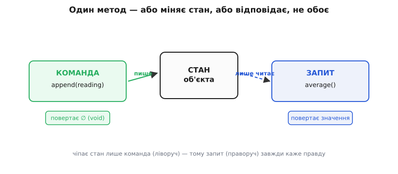
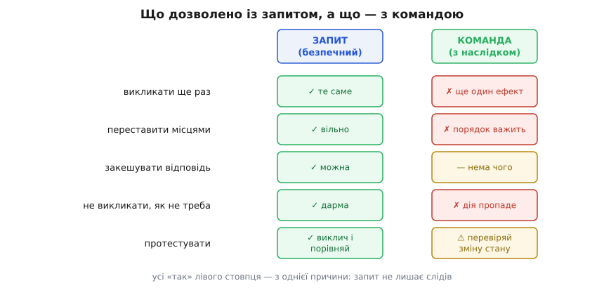

# CQS: команда діє, запит відповідає

<preknowlist>
- [Чисті функції і побічні ефекти](topic:sf-apps/pure-functions-side-effects) — що таке побічний ефект (зміна стану, запис у файл, мережа) на противагу чистому обчисленню, яке лише повертає значення; без цієї межі різниця «команда/запит» не тримається.
</preknowlist>

У попередньому кроці ми розсікли програму на [функціональне ядро й імперативну оболонку](topic:sf-apps/functional-core-imperative-shell): чисті рішення окремо, брудні дії окремо. Це був різ на рівні всієї програми — тут вирішуємо, там чіпаємо світ. CQS — той самий різ, тільки проведений у найдрібнішому масштабі, який лишився: у **межах одного методу**. І питання, яке варто поставити чесно: чому взагалі один метод не має права і щось змінити, і щось відповісти за один виклик?

Відповідь виводиться не з моди й не зі смаку, а з того, що ми вже знаємо про побічні ефекти. Пройдімо її до кінця — і CQS перестане бути «ще одним правилом зі списку», а стане компасом, який видно неозброєним оком у чужому коді.

## Дві чесні речі, які можна попросити в об'єкта

Коли ти викликаєш метод об'єкта, ти по суті звертаєшся до нього з проханням. Прохань, якщо придивитися, буває рівно два роди. Або **«зміни ось це»** — увімкни світло, спиши гроші, додай пристрій. Або **«скажи мені ось це»** — яка температура, чи ввімкнений замок, скільки в списку елементів. Перше змінює світ і нічого не мусить повертати. Друге повертає відповідь і нічого не мусить чіпати.

Правило Command–Query Separation (англ. «розділення команди й запиту») формулюється так само просто, як і звучить: **кожен метод — або команда, або запит, і ніколи обоє одразу.**

- **Команда** (від лат. *mandare* — доручати, наказувати) змінює стан системи й повертає порожнечу (`void`, `None`, `∅`).
- **Запит** (лат. *quaerere* — питати, шукати) повертає значення й **не змінює нічого, що можна побачити ззовні**.

Найкоротше те саме звучить як приказка: **питання не повинне міняти відповідь**. Спитав об'єкт «яка температура?» двічі поспіль — і, якщо між питаннями ти нічого не наказував, маєш почути те саме число. Якщо ж саме питання посунуло стан — об'єкт тобі бреше самою своєю формою.

Правило вивів Бертран Меєр — французький науковець, творець мови Eiffel — наприкінці 1980-х, коли будував мову навколо надійності й міркування про код. CQS у нього стоїть поряд із проєктуванням за контрактом і принципом однакового доступу: [як народилося це правило й чому воно виявилося таким живучим](root:progarch/cqs-command-query/hist-meyer-cqs.md).


*Дві доріжки одного об'єкта: команда пише в стан і повертає порожнечу, запит лише читає й відповідає. Поки чіпає стан тільки ліва доріжка, права завжди каже правду.*

## Чому це важливо: що дає розділення

Правило коштувало б небагато, якби було лише про охайність. Його цінність у тому, що з чистого запиту **сама собою випливає ціла жменя дозволів**, яких із командою ти не маєш. Простежмо їх — саме тут ховається вся вигода.

Запит нічого не змінює, тож:

- **його можна викликати скільки завгодно разів** — відповідь та сама, зайвий виклик нічого не коштує (крім часу);
- **виклики запитів можна переставляти місцями** — жоден не заважає іншому, бо жоден не лишає слідів;
- **відповідь можна закешувати** — запам'ятати раз і роздавати, поки стан не змінили командою;
- **запит можна взагалі не викликати**, якщо результат не потрібен, — нічого не станеться;
- **його тривіально тестувати** — виклич і порівняй значення; ні готувати оточення, ні перевіряти «а чи справді щось відбулося» не треба.

Із командою — жодного з цих дозволів задарма. Викликати команду двічі — це не те саме, що раз (якщо вона не *ідемпотентна*, тобто спеціально зроблена так, щоб повтор не додавав ефекту). Порядок команд важить. Закешувати «дію» неможливо. А тест на команду — це завжди «виклич і піди перевір, що стан справді змінився». Ось чому переплутати їх в одному методі так дорого: **мішанина позбавляє тебе дозволів запиту, але не звільняє від обережності команди** — гірше з обох світів.

Це та сама властивість, що й [референційна прозорість](topic:sf-apps/pure-functions-side-effects) у чистих функціях: виклик, який нічого не змінює, можна подумки замінити його результатом і не зламати програму. CQS просто піднімає цю чистоту з функцій на методи об'єктів — де стан є, але ми домовляємося, що чіпає його лише один рід методів.


*Що дозволено робити із запитом і чого — з командою. П'ять дозволів правого стовпця випливають з одного: запит не лишає слідів.*

> 🔧 **Навіщо це.** Коли метод — чесний запит, рев'юер і компілятор можуть довіряти йому наосліп: пересунути виклик, обгорнути кешем, викликати в логах чи в асерті тесту — без страху щось зіпсувати. Кожен метод, який таємно робить і те, і те, забирає цю довіру в усіх, хто його кличе, і перетворює безневинний `if (sensor.value() > 20)` на джерело багів, які не відтворюються.

## Метод, що робить двоє: як це виглядає

Візьмімо журнал телеметрії нашого розумного дому. Наївний метод дописує показник і одразу повертає свіже середнє — здається зручним, «усе за один виклик»:

```ts
class TelemetryLog {
  private readings: number[] = [];

  // робить двоє: І дописує показник, І повертає нове середнє
  append(reading: number): number {
    this.readings.push(reading);
    const sum = this.readings.reduce((a, b) => a + b, 0);
    return sum / this.readings.length;
  }
}
```

Підступ у тому, що ім'я `append` (дописати) — це наказ, а от `: number` наприкінці — це вже відповідь. Метод прикидається командою, а нишком іще й запитує. Хочеш просто дописати — мусиш або проковтнути повернене середнє, або вдати, що його нема. Хочеш дізнатися середнє, не дописуючи, — не можеш узагалі, бо єдиний шлях до нього лежить через зміну стану. І тест на «чи правильно рахується середнє» тепер щоразу псує журнал.

Різ очевидний: **розділити на команду й запит.**

:::tabs
```ts
class TelemetryLog {
  private readings: number[] = [];

  // КОМАНДА: змінює стан, нічого не повертає
  append(reading: number): void {
    this.readings.push(reading);
  }

  // ЗАПИТ: відповідає, стану не чіпає
  average(): number {
    if (this.readings.length === 0) return 0;
    const sum = this.readings.reduce((a, b) => a + b, 0);
    return sum / this.readings.length;
  }
}
```
```py
class TelemetryLog:
    def __init__(self) -> None:
        self._readings: list[float] = []

    def append(self, reading: float) -> None:   # КОМАНДА: змінює стан
        self._readings.append(reading)

    def average(self) -> float:                 # ЗАПИТ: тільки читає
        if not self._readings:
            return 0.0
        return sum(self._readings) / len(self._readings)
```
:::

Тепер сигнатура не бреше. `append(reading): void` — це чистий наказ: віддав показник, стан змінився, крапка. `average(): number` — чисте питання: спитав скільки завгодно разів, дому нічим не нашкодив. Хто хоче дописати й одразу побачити середнє, робить два кроки в одному рядку виклику — і це навіть читабельніше, бо видно **обидва наміри окремо**:

```ts
log.append(reading);
const avg = log.average();
```

Ціна — один зайвий виклик; виграш — тест на `average()` більше не чіпає журнал, кеш на середнє стає можливим, а порядок «спершу допиши, тоді питай» тепер видно в коді, а не захований у нутрі методу.

## Мова може змусити дотримувати половину правила

У деяких мовах різ між командою й запитом не лишається на совісті автора — його стереже компілятор. Запит помічають ознакою «я не змінюю себе», і будь-яка спроба нишком щось мутувати всередині просто не збереться:

:::tabs
```rust
impl TelemetryLog {
    // &mut self → команда: дозволено міняти стан
    fn append(&mut self, reading: f64) { self.readings.push(reading); }

    // &self → запит: позичка лише на читання, мутація не скомпілюється
    fn average(&self) -> f64 { /* лише читаємо self.readings */ }
}
```
```cpp
class TelemetryLog {
public:
  void append(double reading);            // мутатор — команда

  // const → компілятор не дасть змінити поля; [[nodiscard]] → не дасть змовчати відповідь
  [[nodiscard]] double average() const;
};
```
:::

Rust розводить це позичками: `&self` дає методу лише читання, `&mut self` — право на зміну; запит із `&self`, що спробує мутувати стан, — помилка компіляції. C++ ставить `const` на метод-запит, і компілятор стереже те саме, а `[[nodiscard]]` додає симетричну заборону — не можна мовчки викинути відповідь запиту (бо якщо її можна ігнорувати, навіщо це запит?). Це не робить CQS автоматичним — рішення, що є командою, а що запитом, усе одно твоє, — але там, де мова допомагає, порушення ловиться раніше, ніж встигне народити баг.

## Як упізнати порушення

Найчастіший різновид — **запит, що нишком діє**. Метод зветься `get…`, `is…`, `find…`, `count…` — тобто обіцяє питання, — а в тілі десь ховається запис у базу, лічильник звернень, лог із побічним ефектом, лінива ініціалізація, що міняє видимий стан. Тест: якби я викликав це двічі поспіль, чи змінилося б щось? Якщо так — маска запиту зірвана.

Тонкий випадок — **кеш усередині запиту**. Хіба `getAverage()`, що першого разу порахувало й запам'ятало результат, не порушує правило? Ні — якщо кеш не змінює **видиму** відповідь. CQS говорить про *спостережний* стан: те, що можна помітити ззовні через інші методи. Внутрішнє запам'ятовування, яке нікому назовні не видно й не міняє жодної відповіді, лишається чесним запитом. Межа проходить не по «чи торкнулися байтів у пам'яті», а по «чи змінилася хоч одна відповідь, яку побачить викликач».

Дзеркальний різновид — **команда, що потай повертає корисне**, як наш `append`, спокушаючи будувати логіку на поверненому значенні замість окремого запиту.

## Чесні винятки: коли правило ламають свідомо

CQS — компас, не закон, і Меєр знав це від початку. Є кілька місць, де злити команду із запитом не просто зручно, а **правильно**, — і важливо їх упізнавати, щоб не ламати правило там, де воно працює, і не боятися зламати там, де треба.

- **Дістати-й-вилучити.** Класичний `pop()` зі стека чи `dequeue()` з черги повертає елемент **і** прибирає його. Розділити на «подивись верхній» + «прибери верхній» можна — але тоді між двома викликами інший потік устигне забрати той самий елемент, і два споживачі отримають одну роботу.
- **Атомарне читання-запис.** Замок нашого дому: `tryOpen()` має **одним неподільним кроком** перевірити, що замкнено, і замкнути (чи навпаки). Сенс саме в тому, щоб перевірка й зміна злилися в один крок: розділиш їх — і між ними встигне вклинитися чужий виклик, тож двоє відчинять те, що мало відчинити одне. Це не порушення CQS через недбалість, а свідома відмова від нього заради коректності, коли до об'єкта тягнуться руки водночас.
- **Створити-й-повернути-ідентифікатор.** `createDevice(...) → id`: ідентифікатора не існує, доки пристрій не створено, тож повернути його окремим запитом фізично нема звідки. `INSERT … RETURNING id` — те саме на рівні бази.

Спільне в усіх трьох: розділення або **впускає між кроки чужий виклик**, або **фізично неможливе**. Правило для винятку просте — **ламай свідомо, назви причину й зроби повернене чесним** (те, що команда таки повертає, має бути прямим наслідком дії — вилучений елемент, свіжий ідентифікатор, успіх/невдача атомарної спроби, — а не якийсь побічний звіт «до купи»). [Повний розбір рефакторингу з трьома винятками в коді](root:progarch/cqs-command-query/proj-cqs-refactor.md) показує кожен випадок робочим прикладом і те, як їх тестувати.

> 🔧 **Навіщо це.** «Принципи як інструменти, не догми» — тема, до якої ми ще прийдемо, і CQS — перший чіткий приклад. Ти не ставиш CQS проти коректності: коли розділення народжує перегін, виграє коректність, а виняток документуєш. Компас показує північ; коли обходиш болото — обходиш свідомо, а не вдаєш, що його нема.

## CQS — це не CQRS

Дві абревіатури — один корінь, але різний масштаб, і плутають їх постійно, тож розведімо одразу.

**CQS** — дисципліна рівня **методу**: усередині одного класу метод або міняє, або відповідає. Дешева щоденна звичка, яку можна завести сьогодні, не питаючи ні в кого дозволу.

**CQRS** (Command Query Responsibility Segregation) — рішення рівня **архітектури**: розвести не методи, а **цілі моделі** — окремий шлях (і часто окреме сховище) для запису й окремий для читання. Назву в 2010-х вивели саме з CQS, але це важка й необов'язкова ставка з власною ціною — [коли вона окупається, а коли лише додає складності](topic:sf-apps/cqrs), розбираємо далеко попереду, у розділі про обмін повідомленнями.

Не сплутай ціну: завести CQS у методі — майже безкоштовно; завести CQRS у системі — це окрема архітектурна угода з наслідками на роки.

## Де ти вже живеш за CQS

Правило не академічне — на ньому тримаються речі, якими ти користуєшся щодня, тільки під іншими назвами.

**HTTP.** `GET` — це запит: за домовленістю він *безпечний* (англ. *safe*), тобто не змінює стан на сервері, тож його вільно кешують, повторюють, роблять наперед, обходять пошуковими роботами. `POST`, `PUT`, `DELETE` — команди: міняють стан, і жоден проксі не сміє повторити їх сам собою. Уся ця машинерія кешів і префетчерів працює лише тому, що світ домовився: **`GET` не повинен нічого міняти** — те саме «питання не міняє відповідь», піднесене до масштабу мережі. Коли хтось ховає зміну стану за `GET`, ламається не стиль, а кеші й краулери по всьому шляху.

**SQL.** `SELECT` — запит, читає й не чіпає; `INSERT`/`UPDATE`/`DELETE` — команди. Та сама межа, тільки в мові даних.

Це й є ознака доброго компаса: коли бачиш його всюди — від методу класу до протоколу мережі, — розумієш, що він схопив щось справжнє про природу коду, а не чиюсь стильову забаганку.

## Що лишається в руках

CQS зводиться до одного руху думки: перш ніж писати метод, спитай себе — **він діятиме чи відповідатиме?** — і зроби рівно одне. З цього одного різу випливає все інше: запити, яким можна довіряти наосліп, команди, які видно й до яких ставишся обережно, тести, що не заважають одні одним, і чужий код, який читається без пасток.

Це той самий поділ, що вів нас у функціональному ядрі та імперативній оболонці, тільки прикладений до найдрібнішої цеглинки: запит — то форма ядра (обчислив і віддав), команда — форма оболонки (пішов і змінив світ). Наступний крок збере всі ці компаси — SOLID, композицію, CQS — в одну думку: **принципи служать тобі, а не ти їм**.
