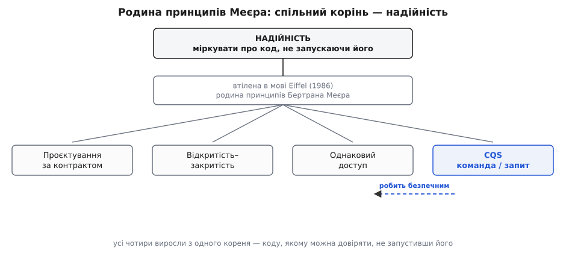

# 📜 Як народилося розділення команди й запиту

Правило, яким ти щойно навчився різати методи навпіл, не впало з неба готовою заповіддю. Воно народилося з упертої одержимості однієї конкретної людини — і щоб зрозуміти, чому воно виявилося таким живучим, варто пройти той самий шлях, яким ішов її автор. Бо CQS — не порада «як охайніше писати». Це побічний висновок із куди більшого питання, яке мучило його автора десятиліттями: **чи можна взагалі довіряти програмі, не запускаючи її?**

## Людина, одержима надійністю

Бертран Меєр (фр. Bertrand Meyer, нар. 1950) — французький науковець, що майже все життя воював з однією річчю: ненадійністю коду. Він вивчився в École Polytechnique й Télécom Paris, здобув магістерський ступінь у Стенфорді (1974) і докторат в університеті Нансі (1985). Але найважливіше сталося не в аудиторії, а на службі: майже десятиліття Меєр працював в Électricité de France — національній енергокомпанії Франції, — де дослужився від інженера до керівника відділу підтримки програмного забезпечення.

Це важлива деталь, а не рядок з резюме. В енергетиці програма — не іграшка й не демо на вихідні. Вона велика, живе роками, її пишуть і латають десятки рук, і коли вона падає, гасне не вкладка в браузері. Меєр надивився на промисловий код зблизька — і виніс звідти не любов до трюків, а страх перед крихкістю. Питання, яке він почав ставити, звучало інженерно, майже по-будівельному: **як зробити так, щоб про поведінку програми можна було міркувати наперед — як інженер міркує про міст, перш ніж пустити на нього потяг?**

1985 року Меєр заснував власну компанію — ISE (Interactive Software Engineering, згодом Eiffel Software) — і взявся будувати не чергову бібліотеку, а цілу мову, підпорядковану одній меті: надійності.

## Вежа, зведена вчасно

Мову назвали **Eiffel** — на честь Гюстава Ейфеля (фр. Gustave Eiffel), інженера тієї самої паризької вежі. Назва не випадкова й не марнославна: Ейфелеву вежу звели **вчасно й у межах кошторису**, вона пережила зневагу сучасників і заклики знести її, знайшла несподівані нові вжитки (радіо, авіація) і стоїть досі. Для Меєра це був живий образ того, чого він хотів від коду, — зробленого з інженерною суворістю так, щоб трималося довго й не підводило.

Меєр задумав мову 1985 року, першу версію випустив 1986-го, а публічно показав її восени 1986-го на першій конференції OOPSLA, де вона одразу привернула увагу. Eiffel так і не стала масовою — але це не поразка, а ключ до всієї історії. Її призначенням було не завоювати ринок, а **бути машиною надійності**: кожна риса мови існувала, щоб зробити код таким, про який можна впевнено міркувати. І саме з цієї машини, як стружка з-під верстата, вилетіло розділення команди й запиту.

## Корінь: міркувати про код, не запускаючи його

Ось інтелектуальний корінь, з якого росте все інше. Меєр хотів, щоб про програму можна було міркувати **як про математику** — читати текст і виводити з нього правду, не проганяючи його. А що заважає так міркувати найдужче? **Побічні ефекти.** Якщо виклик, який виглядає невинним питанням, нишком щось міняє, ти вже не можеш просто прочитати рядок і зрозуміти, що він означає, — доводиться тримати в голові всю історію того, що з об'єктом робили раніше. Мова, побудована навколо міркування, мусила приборкати саме це.

> 🔧 **Навіщо це.** Уся вигода CQS, яку ти вже бачив — переставляти, кешувати, повторювати запити безкарно, — це лише перелік речей, які стають можливі, коли **читання не має побічних ефектів**. Меєр не складав той список окремо; він випадав сам собою з вимоги «про код треба міркувати, не запускаючи». CQS — не мета, а тінь цієї вимоги.

Головним знаряддям міркування в Eiffel стало [проєктування за контрактом](topic:programming/design-by-contract) — механізм передумов, післяумов та інваріантів, вбудований прямо в мову: кожна риса оголошує, що вимагає на вході й що обіцяє на виході, і ці обіцянки перевіряються. (Термін *Design by Contract* Меєр згодом зробив зареєстрованою торговою маркою Eiffel Software — настільки він вважав його своїм.) А тепер простеж думку: контракт має сенс лише тоді, коли ти можеш **чесно спитати об'єкт про його стан**, не зіпсувавши цей стан самим питанням. Післяумова «після виклику `balance` дорівнює старому плюс внесок» стає безглуздою, якщо саме звертання до `balance` крадькома щось посуває. Отже, щоб контракти працювали, потрібне тверде правило: **запит нічого не міняє.** Так проєктування за контрактом майже вимагає CQS — одне не тримається без іншого.

Це та сама межа, що й [референційна прозорість](topic:programming/pure-functions-side-effects) у чистих функціях: вираз, який нічого не змінює, можна подумки замінити його результатом. Меєр просто хотів мати цю прозорість не лише у функціях, а й у методах об'єктів зі станом.

## Точні слова Меєра

Тут варто відрізнити те, що Меєр **справді написав**, від приказки, яку йому часто приписують. У «Object-Oriented Software Construction» — головній його книзі (1-ше видання 1988, Prentice Hall; розширене 2-ге — 1997) — він ділить риси класу на два роди сухою, майже формальною мовою:

- **запити** (queries) — риси, що повертають результат і **не справляють абстрактного побічного ефекту**;
- **команди** (commands) — риси, що змінюють об'єкт.

І ключове поняття, яке зазвичай губиться в переказах, — **абстрактний побічний ефект**. Меєр означив його точно: це «конкретний побічний ефект, що може змінити значення несекретного запиту». Вчитайся — це хірургічно різкіше, ніж «нічого не чіпай». Правило говорить не про байти в пам'яті, а про **відповіді, які видно ззовні**. Тому запит, що всередині щось порахував і запам'ятав задля швидкості, лишається чесним запитом: кеш — це конкретний побічний ефект, але він **не змінює жодного несекретного запиту**, отже, не абстрактний. Той самий виняток для кешу, який ти вже бачив у правилі, — не поблажка, а пряме прочитання Меєрового означення. Він передбачив його з першого дня, бо вписав межу саме по видимій відповіді, а не по «торкнулися стану».

## Родина, а не одинак

CQS ніколи не стояло саме. Це одна гілка цілої родини принципів, які Меєр вростив в Eiffel, — і всі вони живляться з того самого кореня надійності.


*Родина принципів Меєра з одного кореня. CQS — не окреме правило смаку, а сестра проєктування за контрактом, однакового доступу й відкритості-закритості; усі чотири служать одному: коду, якому можна довіряти, не запустивши його.*

Найтісніше CQS сплетене з **принципом однакового доступу** (Uniform Access Principle) — і цей зв'язок варто побачити, бо він пояснює, **чому** Меєр поставив ці два правила поруч. Принцип однакового доступу вимагає, щоб клієнт звертався до риси однаково, байдуже, збережена вона чи обчислюється. В Eiffel це вбудовано в сам синтаксис: запит без аргументів кличуть **без дужок**, точнісінько як звертаються до поля.

```eiffel
-- запит: клієнт пише account.balance — і не знає й не мусить знати,
-- це збережене поле чи обчислення на льоту з історії операцій
balance: INTEGER

-- команда: змінює стан рахунку й нічого не повертає
deposit (sum: INTEGER)
    do
        balance := balance + sum
    end
```

Клієнт пише `account.deposit (100)`, а тоді `account.balance` — і не здогадується, поле це чи функція. Завтра автор класу може замінити збережене `balance` на обчислення з журналу операцій — і **жоден рядок клієнта не зміниться**. Ось у чому свобода однакового доступу.

Але тепер спитай себе: за якої умови ця підміна безпечна? Лише якщо читання `balance` **нічого не міняє**. Якби обчислювальна версія крадькома щось записувала чи посувала, підміна поля на функцію тихо змінила б поведінку програми — і «однаковий» доступ виявився б брехнею. Отже, **саме CQS робить однаковий доступ чесним**: гарантія, що запит не лишає слідів, — це та підпора, на якій тримається право вільно міняти збережене на обчислюване. Меєр не склав ці два принципи поруч випадково. Один підпирає інший.

Четверта гілка — **принцип відкритості-закритості** (Open–Closed Principle), який Меєр теж уперше сформулював у тій самій книзі 1988 року. (Цікава деталь для чесності: той OCP, що ти знаєш зі SOLID, — це вже пізніше перечитання Роберта Мартіна (англ. Robert Martin) через поліморфізм та інтерфейси; Меєрів початковий OCP говорив про розширення класу через успадкування. Добрі принципи так і живуть — їх переосмислюють наступні покоління.)

## Звідки взялася приказка

А тепер — про ту саму фразу, з якої CQS упізнають з першого погляду: **«питання не повинне міняти відповідь»** (англ. *asking a question should not change the answer*). Її раз у раз чіпляють Меєрові в уста — і тут потрібна історична чесність.

Меєр так **не писав**. Його власні слова, як ми щойно бачили, сухіші й точніші: «функції не повинні справляти абстрактного побічного ефекту». Мартін Фаулер (англ. Martin Fowler), який зробив чи не найбільше для популяризації CQS, у своєму нарисі теж чесно приписує принцип Меєрові — але цієї приказки **не вживає**. Тобто фраза не походить ані від першоджерела, ані від головного популяризатора.

Звідки ж вона? Це **пізніша народна викрутка** — мнемонічна перлина, що злежалася в спільноті програмістів, поки Меєрове «абстрактний побічний ефект» переказували своїми словами одне одному. Хтось перший стиснув технічне означення до афоризму, той афоризм виявився влучним і пішов гуляти, аж поки осів у довідниках як «канонічне» формулювання. Простежити його до єдиного авторства й дати не вдається — і саме тому чесно казати: **ідея — Меєрова й безсумнівна, а от карбована фраза — колективний фольклор**, який точно передає суть, але не є цитатою. Це доля багатьох добрих правил: народ карбує для них гасло, коротше й дзвінкіше за оригінал.

## Друге життя: від CQS до CQRS

Наприкінці 2000-х Меєрове правило дало несподіваний паросток. Ґреґ Янґ (англ. Greg Young) близько 2010 року вивів з нього архітектурний взірець **CQRS** (Command Query Responsibility Segregation) — назву викував саме він, а поряд ті самі ідеї розвивав Уді Даган (англ. Udi Dahan). Янґ прямо казав, що бере «те саме означення команд і запитів, яким користувався Меєр», і зберігає вимогу їхньої чистоти. Різниця одна, але велика: CQS ділить **методи** всередині об'єкта, а CQRS розтинає надвоє **цілі об'єкти й моделі** — окремий шлях для запису, окремий для читання.

Тобто назву в 2010-х свідомо викували з CQS — але це вже інша, важча й куди дорожча ідея, зі своєю окремою ціною й окремими причинами братися за неї чи ні. [Коли ця ставка окупається, а коли лише додає складності](topic:programming/cqrs), — розмова далеко попереду. Тут досить запам'ятати родовід: **дешева щоденна звичка рівня методу породила назву для важкого архітектурного рішення**, і плутати їх — означає плутати компас із перебудовою дому.

## Чому воно пережило свою мову

Eiffel не завоювала світ. Проєктування за контрактом досі радше рідкість, ніж норма. То чому ж CQS — маленька гілка тієї програми — живе й донині, коли про саму мову згадують хіба в підручниках з історії?

Бо Меєр не **вигадав** правило — він **упізнав і назвав** тріщину, що вже проходила крізь усе. Той самий різ між «дією» і «відповіддю» лежить у серці математики (процедура, що щось робить, проти функції, що щось повертає). Він самостійно виринув у HTTP (`GET`, що лише читає, проти `POST`, що міняє), у SQL (`SELECT` проти `INSERT`), у функційному програмуванні (референційна прозорість). Меєр не приніс цю межу в код ззовні — він показав, що вона там уже є, і дав їй чітке ім'я на рівні окремого методу.

Ось чому правило пережило свою мову. Стильові моди помирають разом з тими, хто їх завів; а **ім'я для чогось справжнього** лишається, бо його щоразу перевідкривають незалежно — і щоразу воно виявляється тим самим. Меєр просто був першим, хто вимовив його чітко й пояснив, чому воно того варте.
