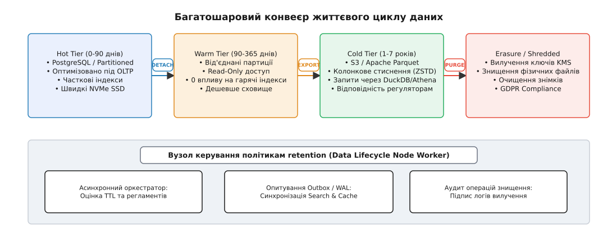
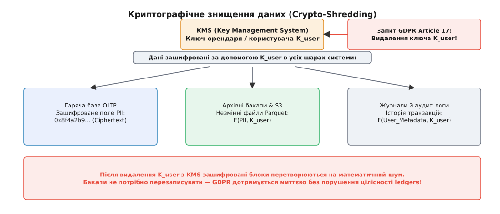

# Життєвий цикл даних як вузол

<preknowlist>
- [М'яке видалення і надгробки](root:sf-data/soft-delete-tombstones) — використання прапорців і позначок часу вилучення без негайного очищення диска.
- [Мультиарендність](root:sf-distributed/tenant-isolation) — поділ даних між орендарями (tenants) та межі ізоляції в OLTP-сховищах.
- [Аудит-лог як вузол](root:sf-security/audit-logging) — незмінний журнал подій, вимоги фінансового та безпекового аудиту до цілісності історії.
</preknowlist>

Коли платформа розумного дому Digital Homes запускала перші дві тисячі хабів, таблиця телеметрії `telemetry_readings` вміщала кілька мільйонів записів і працювала бездоганно. Щосекунди давачі температури, струму й протікання надсилали показання, база миттєво зберігала їх, а дашборд малював графіки. Проте за три роки кількість пристроїв зросла до п'ятдесяти тисяч, а таблиця роздулася до двох мільярдів рядків. У той самий день запит залишків напруги на головній сторінці, який раніше тривав чотири мілісекунди, почав загинатися на вісім секунд, а плановий фоновий скрипт `DELETE FROM telemetry_readings WHERE created_at < NOW() - INTERVAL '90 days'`, запущений у ночі з неділі на понеділок, викликав сплеск генерації WAL-файлів, повністю забив дискову смугу запису, заблокував таблицю й поклав транзакційний OLTP-сервер.

Спроба розв'язати проблему "простим очищенням баз за розкладом" спирається на помилкове уявлення про те, як реляційна СУБД поводиться під навантаженням. Дані в живій системі народжуються як безперервний потік, але не можуть існувати в гарячому сховищі вічно. Якщо управління життєвим циклом даних не спроєктовано як **самостійний критичний вузол системної архітектури**, система неминуче впирається в три стіни: фізичну деградацію B-tree індексів через мертві записи (*dead tuples*), юридичний конфлікт між вимогами податкового аудиту та GDPR, і руйнування цілісності вторинних сховищ (пошукових індексів та кешів).

Ось звідки головна теза кроку: **життєвий цикл даних — це не скрипт у cron, а автономний архітектурний вузол**, який володіє власною моделлю станів, керує шаруванням сховища (*tiered storage*), виконує атомарне виведення партицій та відповідає за криптографічне знищення персональних даних без порушення цілісності гросбухів.

## Механіка руйнування: чому просте видалення нищить OLTP-базу

Щоб зрозуміти, чому звичайний `DELETE` стає катастрофою під високим навантаженням, треба подивитися на внутрішній устрій багатоверсійності СУБД (MVCC — *Multi-Version Concurrency Control*). У реляційних рушіях на кшталт PostgreSQL кожен рядок таблиці (кортеж / *heap tuple*) має приховані службові поля у своєму заголовку:

* `xmin` — ідентифікатор транзакції, яка створила цей рядок.
* `xmax` — ідентифікатор транзакції, яка видалила або оновила цей рядок. Якщо `xmax` дорівнює нулю або прапорці вказують на незавершено транзакцію, рядок вважається живим.
* `t_ctid` — фізична адреса кортежу у форматі `(блок, офсет)`, яка вказує на конкретну дискову сторінку розміром 8 КБ.

Коли додаток виконує `DELETE FROM telemetry_readings WHERE id = 100`, СУБД **не видаляє байти з диска**. Вона лише записати номер поточної транзакції у поле `xmax` відповідного кортежу та оновлює карту видимості (*visibility map*). Кортеж перетворюється на змертвілий запис (*dead tuple*). Фізичний рядок продовжує займати місце на дисковій сторінці, а B-tree індекси продовжують містити вказівники на його адресу `t_ctid`.

Змертвілі записи не вилучаються негайно, бо паралельні читаючі транзакції, які стартували раніше, за правилами ізоляції snapshot isolation мають продовжити бачити стан бази на момент свого старту. Лише після завершення найстарішої транзакції фоновий демон `VACUUM` може просканувати сторінки, знайти мертві кортежі й позначити їхній простір як вільний для наступних записів `INSERT`.

Зміна стану сторінки СУБД при накопиченні мертвих кортежів проходить через фізичне розбухання (*table bloat*). Кожна 8-кілобайтна сторінка таблиці містить лінійні покажчики (*line pointers*) на початку та самі дані кортежів наприкінці сторінки. Коли `VACUUM` очищає змертвілий кортеж, він звільняє місце у середині сторінки, але **не може стиснути файл на диску**, якщо в кінці сторінки залишається бодай один живий рядок.

Коли фоновий cron-скрипт намагається видалити тридцять мільйонів застарілих записів одним махом, в OLTP-системі розгортається ланцюгова реакція руйнування:

1. **Журнальний вибух (WAL Explosion)**: Кожен видалений рядок та кожна зміна сторінки індексу мусять бути записані у журнал попереднього запису (*Write-Ahead Log*). Мільйони видалень за секунди генерують десятки гігабайтів WAL, переповнюють дисковий буфер, роздувають реплікаційний трафік і викликають дискове голодування (*I/O saturation*) у гарячих транзакцій.
2. **Блокування сторінок індексу**: Масове вилучення модифікує листові вузли B-tree індексів. Це змушує СУБД захоплювати ексклюзивні замки (*exclusive locks*) на сторінки індексу, затримуючи паралельні `SELECT` та `INSERT` записи від реальних користувачів.
3. **Розбухання таблиці й індексів (Bloat)**: Навіть після завершення `DELETE` та проходу `VACUUM` розмір файлів таблиці на диску **не зменшується**. `VACUUM` лише звільняє внутрішній простір усередині 8-кілобайтних сторінок, але не повертає файли операційній системі (для цього потрібен `VACUUM FULL`, який захоплює повний ексклюзивний замок на таблицю `AccessExclusiveLock` і блокує всі читання й записи на години). В результаті індекси перетворюються на розріджені, фрагментовані дерева, де 80% сторінок займає порожнеча.

Здавалося б, природною альтернативою є патерн [м'якого видалення](root:sf-data/soft-delete-tombstones) — додавання колонки `deleted_at TIMESTAMP` або `is_deleted BOOLEAN`. Проте необережне м'яке видалення створює іншу пастку: розбухання індексів надгробками (*tombstones*).


*Порівняння звичайного індексу та часткового індексу. У звичайному індексі мертві надгробки залишаються у листових сторінках B-tree, забруднюють операційну пам'ять RAM і сповільнюють пошук. Частковий індекс повністю відсікає надгробки на рівні метаданих СУБД.*

Коли додаток виконує більшість запитів у формі `SELECT * FROM orders WHERE tenant_id = 't1' AND is_deleted = false`, звичайний B-tree індекс за колонками `(tenant_id, is_deleted)` змушений зберігати вказівники на **усі** записи, включно з мертвими. Якщо 90% замовлень у базі є видаленими, СУБД під час кожного пошуку прочитує з диска в пам'ять RAM 90% марного сміття.

Рішенням на рівні гарячого шару є використання **часткових індексів** (*partial indexes*):

```sql
-- Частковий індекс: індексуються лише живі записи!
CREATE INDEX idx_orders_active_tenant 
ON orders (tenant_id, created_at) 
WHERE deleted_at IS NULL;
```

Такий індекс взагалі не містить надгробків. Його розмір на диску у п'ять-десять разів менший за повний індекс, він повністю вміщується в оперативній пам'яті, а швидкість читання активних даних залишається максимальною незалежно від кількості накопичених видалених рядків.

Проте частковий індекс розв'язує лише проблему швидкості читання активних записів. Він не вирішує головного питання: що робити з таблицями, які щодня зростають на десятки мільйонів рядків телеметрії чи аудит-логів? Для цього потрібен перехід від вилучення окремих рядків до партиціювання.

## Шарування сховища та стратегії партиціювання

Найефективніший спосіб керувати обсягом даних у реляційній базі — це зробити так, щоб операція видалення застарілих записів не чіпала окремі рядки взагалі. Це досягається за допомогою декларативного партиціювання (*declarative partitioning*).

При партиціюванні за часовим інтервалом (*range partitioning*) одна логічна таблиця `telemetry_readings` розділяється СУБД на окремі фізичні таблиці-партиції, наприклад, за місяцями: `telemetry_readings_2026_01`, `telemetry_readings_2026_02`.

У такій схемі видалення застарілих даних за січень 2026 року зводиться до двох команд DDL:

```sql
-- 1. Від'єднання партиції від логічної таблиці (атомарна операція в метаданих)
ALTER TABLE telemetry_readings 
DETACH PARTITION telemetry_readings_2026_01 CONCURRENTLY;

-- 2. Фізичне видалення окремої таблиці з диска
DROP TABLE telemetry_readings_2026_01;
```

Різниця між `DELETE FROM` та `DETACH PARTITION + DROP TABLE` є фундаментальною:

* **Часова складність**: `DELETE` виконується за `O(N)`, де `N` — кількість видалених рядків. `DETACH + DROP` виконується за `O(1)`, модифікуючи лише декілька рядків у системному каталозі СУБД.
* **Генерація WAL**: `DELETE` створює WAL для кожного рядка й індексу. `DROP TABLE` генерує нуль WAL-записів для вмісту таблиці, миттєво вивільняючи блоки на диску на рівні операційної системи.
* **Вплив на OLTP**: `DETACH PARTITION CONCURRENTLY` не блокує виконання паралельних `SELECT` та `INSERT` у гарячих партиціях поточного місяця.

Важливою перевагою партиціювання під час виконання читаючих запитів є **відсікання партицій (Partition Pruning)**. Коли оптимізатор СУБД бачить у запиті умову `WHERE created_at >= '2026-08-01'`, він ще на етапі планування запиту відсікає всі партиції за минулі місяці. Планувальник навіть не відкриває дискові файли січневих чи лютневих партицій, що зводить вибіркову складність читання до мінімального обсягу гарячих даних.

Це підводить нас до архітектурної концепції **багатошарового зберігання даних (Tiered Storage)**. Життєвий цикл даних поділяється на чотири чіткі фізичні шари:


*Конвеєр життєвого циклу даних. Дані проходять шлях від гарячих NVMe-накопичувачів до незмінних холодних об'єктних сховищ, завершуючись остаточним знищенням або вилученням ключів KMS.*

1. **Гарячий шар (Hot Tier — OLTP)**: Швидкі NVMe-диски, PostgreSQL або MySQL. Тут живуть активні партиції за останні 30–90 днів. Сховище оптимізовано під низьку латентність запису та читання. Використовуються часткові індекси `WHERE deleted_at IS NULL`.
2. **Теплий шар (Warm Tier — Read-Only)**: Від'єднані від головного B-tree партиції за останні 90–365 днів. Вони залишаються доступними для аналітичних запитів або звірок, але не навантажують гарячі індекси основними транзакціями.
3. **Холодний шар (Cold Tier — Archival)**: Партиції вивантажуються з реляційної бази, конвертуються в колонковий стиснений формат **Apache Parquet** або ORC зі стисненням ZSTD і зберігаються в об'єктному сховищі (Amazon S3, MinIO). Вартість збереження терабайта даних тут в десятки разів нижча за NVMe. Запити до холодного шару виконуються через серверлесс-рушії (DuckDB, Amazon Athena, Trino).
4. **Знищення та вилучення (Purge / Shredded Tier)**: Після закінчення нормативного строку утримання (*retention period*) стиснені файли вилучаються з S3 за допомогою S3 Lifecycle Rules, а персональні ключі шифрування знищуються.

Чому формат **Apache Parquet** став стандартом для холодного шару? На відміну від рядкових форматів (JSON, CSV, SQL-дампи), Parquet організовує дані у колонкові групи (*row groups*) зі стисненням по окремих колонках. Завдяки алгоритмам RLE (Run-Length Encoding), словниковому кодуванню (*dictionary encoding*) та бітовому пакуванню (*bit-packing*), однакові значення у мільйонах рядків стискаються у кілька байтів.

Якщо аналітичному запиту потрібно обчислити середню температуру за рік, DuckDB або Athena зчитують з S3 **лише одну колонку** `temperature`, повністю ігноруючи решту п'ятдесят колонок тексту. Крім того, колонтитули Parquet містять статдані про мінімальне та максимальне значення в кожній колонковій групі (*footer min/max metadata*) та фільтри Блума (*Bloom filters*). Це дозволяє рушію запитів пропускати 95% блоків без розпакування, досягаючи векторної швидкості виконання запитів.

> 🔧 **Навіщо це.** Спроба тримати трирічну історію телеметрії та логів у гарячій OLTP-базі змушує компанію платити за дорогі диски бази даних та нарощувати оперативну пам'ять RAM лише для того, щоб тримати фрагментовані індекси. Шарування сховища виводить 90% обсягу даних у стиснені Parquet-файли на S3, знижуючи витрати на інфраструктуру в рази та гарантуючи стабільну латентність OLTP-бази незалежно від віку системи.

Проте технічне вивантаження партицій у Cold Storage впирається в іншу проблему: вимоги закону.

## Юридичний трикутник: GDPR, фінансовий аудит та Crypto-Shredding

Коли системний архітектор проєктує політики життєвого циклу даних, він неминуче опиняється в епіцентрі юридичного конфлікту. Докладно про [історію юридичного конфлікту між ретеншн-директивами та правом на забуття](root:progarch/data-lifecycle-node/hist-gdpr-and-retention.md) розказано в окремій вставці, але його архітектурна суть зводиться до двох протилежних вимог законодавства:

1. **Вимоги фінансового та податкового аудиту**: Закони про бухгалтерський облік зобов'язують зберігати всі первинні документи, інвойси, квитанції та записи в [двохвхідному гросбуху](root:sf-data/double-entry-ledger) протягом **7–10 років**. Фізичне вилучення транзакції з гросбуху є порушенням цілісності обліку.
2. **Вимоги регуляцій приватності (GDPR Article 17 / CCPA)**: Загальний регламент про захист даних надає користувачеві "Право на вилучення" (*Right to Erasure*). Компанія зобов'язана безповоротно вилучити всі персональні дані (PII — *Personally Identifiable Information*: ім'я, email, номер телефону, IP-адресу, геолокацію) протягом 30 днів після запиту.

Якщо користувач натискає кнопку "Видалити акаунт", система не може просто виконати каскадне видалення `DELETE FROM users WHERE id = U1`, оскільки це зламає зовнішні ключі у таблиці `ledger_entries`, зробивши аудит балансу неможливим. З іншого боку, ззвичайне м'яке видалення (`is_deleted = true`) є прямою протиправною дією: персональні дані продовжують лежати на диску у відкритому вигляді.

Для розв'язання цього трикутника використовуються два класи архітектурних паттернів:

### 1. Деанонімізація та псевдонімізація на місці (In-Place Anonymization)

У цій схемі сама транзакція гросбуху або журнал аудит-логу залишаються в базі, але всі поля, що містять PII, безповоротно перезаписуються криптографічним одностороннім хешем із сіллю або заповнюються нулями:

```sql
-- Анонімізація користувача при збереженні фінансових транзакцій
UPDATE users 
SET full_name = 'ANONYMIZED_USER',
    email = encode(digest(email || 'salt_2026', 'sha256'), 'hex'),
    phone = NULL,
    home_address = NULL,
    status = 'ERASED_GDPR'
WHERE id = 'usr_9912';
```

Транзакції в `ledger_entries` продовжують посилатися на `usr_9912`, суми й баланси збігаються до цента, але зв'язок між цим записом та реальною фізичною людиною безповоротно знищено.

### 2. Криптографічне знищення даних (Crypto-Shredding)

Що робити з незмінними (*immutable*) холодними архівами на S3 та резервними копіями (*backups*)? Перезаписувати терабайтні двійкові файли бакапів або Parquet-архіви кожного разу, коли один користувач подає запит на видалення за GDPR, технічно неможливо й небезпечно для цілісності резервних копій.

Тут застосовується **Crypto-Shredding**:


*Механізм Crypto-Shredding. Знищення одного ключа в KMS робить усі копії даних у всіх бакапах та архівах математично нечитабельними без модифікації самих дискових файлів.*

Crypto-Shredding побудовано на схемі конвертного шифрування (*envelope encryption*). Система створює двонеобхідний ієрархічний замок:

* **Master Key (K_master)**: Головний ключ шифрування підсистеми, що зберігається в апаратному модулі безпеки (HSM / KMS).
* **Tenant / User Key (K_user)**: Унікальний симетричний ключ шифрування (AES-256-GCM), згенерований індивідуально для кожного користувача або орендаря.
* **Ciphertext**: Усі записи PII (імена, адреси, номери карток) перед записом у базу чи холодний Parquet-файл шифруються ключем `K_user`.

Коли від користувача надходить підтверджений запит на виконання GDPR Article 17, вузол життєвого циклу викликає API KMS і виконує атомарну команду: `kms.destroyKey(K_user)`.

Після знищення ключа `K_user`:
* Зашифровані тексти PII в гарячій базі даних, у від'єднаних теплих партиціях, у холодних Parquet-файлах на S3 та у вечірніх бакапах на стрічках перетворюються на нерозшифровний математичний шум.
* Регуляторні органи (включно з європейськими CNIL та BSI) юридично визнають Crypto-Shredding еквівалентом фізичного знищення носія.
* Жоден резервний копійний файл чи архів не потребує перезапису або перезбірки.

## Анатомія вузла управління життєвим циклом даних

Зібравши разом механіку партицій, багатошарове сховище та вимоги регуляторів, ми можемо спроєктувати **вузол життєвого циклу даних (Data Lifecycle Node)** як самостійний компонент системи.

Вузол життєвого циклу керується декларативними політиками. Повний [декларативний контракт конфігурації політик утримання](root:progarch/data-lifecycle-node/api-lifecycle-policy.md) винесено у відповідний довідник, а його суть зводиться до формального опису правил для кожної сутності.

Двома основними мовами системного програмування та бекенду реалізація оркестратора життєвого циклу виглядає так:

:::tabs
```ts
import { Client } from "pg";

export interface LifecyclePolicy {
  entityName: string;
  retentionDays: number;
  archiveToS3: boolean;
  cryptoShredding: boolean;
}

export class DataLifecycleNode {
  constructor(
    private readonly db: Client,
    private readonly kms: { deleteKey(id: string): Promise<void> },
    private readonly s3: { putObject(key: string, body: Buffer): Promise<void> }
  ) {}

  /**
   * Асинхронний крок обробки застарілих партицій за політикою retention
   */
  async executePolicyStep(policy: LifecyclePolicy): Promise<number> {
    const cutoffDate = new Date(Date.now() - policy.retentionDays * 86400 * 1000);
    
    // 1. Пошук застарілих партицій у системному каталозі
    const { rows } = await this.db.query(
      `SELECT c.relname AS partition_name
       FROM pg_class c
       JOIN pg_inherits i ON c.oid = i.inhrelid
       JOIN pg_class parent ON i.inhparent = parent.oid
       WHERE parent.relname = $1
         AND c.relname ~ '_[0-9]{4}_[0-9]{2}$'
         AND to_date(substring(c.relname from '_([0-9]{4}_[0-9]{2})$'), 'YYYY_MM') < $2;`,
      [policy.entityName, cutoffDate]
    );

    let processedCount = 0;

    for (const row of rows) {
      const partName = row.partition_name;

      // 2. Атомарне від'єднання партиції від гарячого B-tree індексу
      await this.db.query(
        `ALTER TABLE ${policy.entityName} DETACH PARTITION ${partName} CONCURRENTLY;`
      );

      // 3. Експорт у Cold Storage (Parquet/S3) за потреби
      if (policy.archiveToS3) {
        const dump = await this.db.query(`SELECT * FROM ${partName}`);
        const payload = Buffer.from(JSON.stringify(dump.rows));
        await this.s3.putObject(`cold-archives/${policy.entityName}/${partName}.json`, payload);
      }

      // 4. Фізичне вилучення від'єднаної таблиці без WAL для рядків
      await this.db.query(`DROP TABLE ${partName};`);
      processedCount++;
    }

    return processedCount;
  }

  /**
   * Виконання Crypto-Shredding для конкретного користувача (GDPR Article 17)
   */
  async shredUserData(userId: string, kmsKeyId: string): Promise<void> {
    // Знищуємо ключ шифрування у KMS
    await this.kms.deleteKey(kmsKeyId);

    // Робимо запис в аудит-лог про виконання знищення (без PII)
    await this.db.query(
      `INSERT INTO erasure_audit_log (user_id_hash, erased_at, strategy)
       VALUES (sha256($1), NOW(), 'CRYPTO_SHREDDING')`,
      [Buffer.from(userId)]
    );
  }
}
```
```py
import datetime
import json

class DataLifecycleNode:
    def __init__(self, db_connection, kms_client, s3_client):
        self.db = db_connection
        self.kms = kms_client
        self.s3 = s3_client

    def execute_policy_step(self, entity_name: str, retention_days: int, archive_to_s3: bool = True) -> int:
        cutoff_date = datetime.datetime.now(datetime.timezone.utc) - datetime.timedelta(days=retention_days)
        cutoff_str = cutoff_date.strftime("%Y-%m-%d")

        cursor = self.db.cursor()
        
        # 1. Пошук застарілих партицій
        find_sql = """
            SELECT c.relname AS partition_name
            FROM pg_class c
            JOIN pg_inherits i ON c.oid = i.inhrelid
            JOIN pg_class parent ON i.inhparent = parent.oid
            WHERE parent.relname = %s
              AND c.relname ~ '_[0-9]{4}_[0-9]{2}$'
              AND to_date(substring(c.relname from '_([0-9]{4}_[0-9]{2})$'), 'YYYY_MM') < %s;
        """
        cursor.execute(find_sql, (entity_name, cutoff_str))
        partitions = cursor.fetchall()

        count = 0
        for (part_name,) in partitions:
            # 2. Атомарний DETACH від гарячого B-tree
            cursor.execute(f"ALTER TABLE {entity_name} DETACH PARTITION {part_name} CONCURRENTLY;")

            # 3. Експорт у Cold Storage S3
            if archive_to_s3:
                cursor.execute(f"SELECT * FROM {part_name};")
                rows = cursor.fetchall()
                data = json.dumps(rows).encode('utf-8')
                self.s3.put_object(Bucket="cold-archive", Key=f"archives/{entity_name}/{part_name}.json", Body=data)

            # 4. Фізичний DROP без WAL-вибуху
            cursor.execute(f"DROP TABLE {part_name};")
            count += 1

        self.db.commit()
        return count

    def shred_user_data(self, user_id: str, kms_key_id: str):
        """Виконання Crypto-Shredding шляхом вилучення ключа KMS"""
        self.kms.destroy_key(kms_key_id)
        
        cursor = self.db.cursor()
        cursor.execute(
            "INSERT INTO erasure_audit_log (user_id_hash, erased_at, strategy) VALUES (digest(%s, 'sha256'), NOW(), 'CRYPTO_SHREDDING');",
            (user_id,)
        )
        self.db.commit()
```
:::

Повний приклад побудови такого демона деталізовано в [практичному проєкті автоматизованого рушія вилучення партицій](root:progarch/data-lifecycle-node/proj-retention-worker.md).

## Узгодженість побічних ефектів: пошук, кеш та Outbox

Вилучення або вивантаження даних із первинної OLTP-бази має негайні побічні наслідки для всієї розподіленої системи. Якщо вузол життєвого циклу видалив або деанонімізував записи в PostgreSQL, але залишив їх у вторинних сховищах, система потрапляє у стан неузгодженості:

* **Пошукова підсистема (Search Subsystem)**: Elasticsearch або OpenSearch продовжують віддавати картку користувача або телеметрію в пошукових результатах, видаючи помилку `404 Not Found` під час спроби відкрити деталі.
* **Кеш-шар (Redis/Memcached)**: Кешовані JSON-об'єкти профілів продовжують містити PII-дані "забутого" користувача.
* **Аналітичний OLAP-куб**: Події продовжують зараховуватися у демографічні звіти.

Щоб узгодити побічні ефекти, вузол життєвого циклу даних використовує патерн **Transactional Outbox**. Операція вилучення або Crypto-Shredding записується у таблицю `outbox_events` в межах тієї самої транзакції, що й анонімізація або від'єднання партиції.

Подія `data.lifecycle.pii_erased` або `data.lifecycle.partition_detached` публікується в шину повідомлень (Kafka/RabbitMQ), після чого вторинні підсистеми асинхронно виконують свої реакції:

1. **Search Worker**: Виконує `DELETE FROM indexes WHERE tenant_id = X` або повністю переіндексує шар.
2. **Cache Invalidator**: Висилає команду `DEL user:session:X` у Redis-кластер.
3. **Audit Logger**: Записує неупереджений підтверджений факт виконання вилучення (із зазначенням SHA-256 хешу ідентифікатора та штампу часу), який надається юридичному аудитору за потреби.

У разі використання шини Kafka події вилучення публікуються в компактний топік (*compacted topic*) із повідомленнями-надгробками (*tombstone messages*), де `key = user_id` та `value = null`. Рушій компакції Kafka автоматично вилучає старі записи з цим ключем з усіх сегментів журналу, гарантуючи очищення транзитного шару.

Життєвий цикл даних, спроєктований як перший клас системних вузлів, завершує ланцюг безпечної роботи з даними в мультиарендній архітектурі. Він перетворює потенційну катастрофу розбухання баз і загрозу штрафів GDPR на керований, прогнозований та асинхронний інженерний конвеєр.
